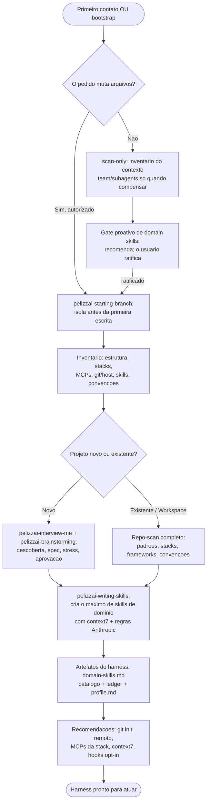

# PelizzAI Audit

<FIRST-TIME-USING-PELIZZAI>
Na **primeira vez** que o usuário interagir com o harness PelizzAI neste projeto, ou sempre que ele
digitar **"bootstrap"**, esta skill **PRECISA** ser invocada antes de qualquer trabalho — no mínimo
em `scan-only`. Sem este mapeamento, o harness atua às cegas.

O harness está inicializado neste projeto quando existe o arquivo `pelizzai/domain-skills.md`. Se
ele **não** existe, trate como primeira vez: mapeie e PROPONHA o bootstrap ativamente, sem esperar o
usuário descobrir que ele existe. Invocar é obrigatório; **escrever continua dependendo da resposta
do usuário** (ver *Escolher o modo*).
</FIRST-TIME-USING-PELIZZAI>

## Objetivo

Mapear o contexto de trabalho para que o harness atue com precisão — o que é o projeto (único ou
workspace, novo ou existente), com que é construído, o que já existe de infraestrutura — e, quando
autorizado, converter cada descoberta em artefato útil: as skills de domínio e a documentação que
tornam o agente assertivo. Bootstrap versionável e portátil, nunca relatório por si só.

**Anuncie:** "Usando a skill PelizzAI Audit em modo `<scan-only|bootstrap-write>` para mapear o projeto proporcionalmente."

## Escolher o modo

| Modo | Gatilho | Pode escrever? |
| --- | --- | --- |
| `scan-only` | analisar, explicar, revisar, diagnosticar; tarefa mutável ainda sem autorização de bootstrap | Não. Nem state, branch, profile, catálogo, ledger, hook ou skill. |
| `bootstrap-write` | usuário disse `bootstrap`/`reinicializar`, ou aprovou a proposta após scan | Sim, dentro da task branch criada antes da primeira escrita. |

Um pedido read-only nunca vira bootstrap mutável só porque `pelizzai/domain-skills.md` não existe.

## Source mode

Se existir a sentinela `scripts/pelizzai-source-repo.txt`, trate o projeto como repo-fonte PelizzAI. Não crie `pelizzai/` consumidor; faça apenas o scan necessário à tarefa. A presença de manifesto/sync-harness NÃO indica repo-fonte — consumidores instalados via `-ExportConsumer` também os têm.

## Profundidade proporcional

```text
projeto pequeno/stack simples
→ inspeção inline focada.

monorepo ou múltiplas frentes independentes
→ subagents/time read-only quando reduzirem latência ou aumentarem cobertura.

projeto novo/vazio
→ não implementar nem inventar padrões; encaminhar primeiro ao ciclo greenfield de descoberta,
  spec e aprovação.
```

Team não é default. Use-o somente quando as frentes são independentes e a síntese vale o custo.

## Scan-only

Responda às perguntas relevantes, sem transformar o scan em inventário universal:

```text
Estrutura: repo único, monorepo ou workspace de múltiplos repos?
Stack: manifests, lockfiles, frameworks, runtime, banco e versões-chave?
Execução: comandos reais de test/build/lint/dev e seus diretórios?
Convenções: instruções, linters, testes, commits, design system e padrões repetidos?
Git: branch atual, default real, remotos/provider, CI e working tree?
Skills: roots instalados, domain skills existentes e catálogo?
Ferramentas: MCPs/conectores que realmente mudam esta tarefa?
```

Separe fatos observados de inferências. Não escreva relatório genérico se o pedido exige apenas uma resposta localizada.

Depois de identificar stack e versões reais, consulte Context7 para os componentes externos que
podem mudar a rota, as candidatas de skill ou as recomendações. Não consulte uma versão genérica
quando lockfile/manifest fornece a versão instalada; não consulte tecnologia irrelevante só para
encher o inventário.

Ao terminar scan-only:

- entregue a análise solicitada;
- nas bordas design→plano e plano→execução, PUXE proativamente a proposta de domain skills (não espere o usuário digitar `bootstrap`) — ver **Gate proativo de domain skills**; peça consentimento uma vez;
- não crie placeholders para "preparar depois".

## Gate proativo de domain skills (bordas design→plano e plano→execução)

A classificação de stack e a lista de candidatas são computadas, mas viram **recomendação a
ratificar**, nunca escrita silenciosa. Puxe a proposta nas bordas de alto valor, sem esperar o
usuário digitar `bootstrap`:

- **design→plano (projeto novo):** após spec/design aprovados, detecte a stack escolhida; proponha
  domain skills fundamentadas em `context7`/doc oficial antes do plano. O plano não começa enquanto
  o usuário não escolher criar, reduzir, adiar ou registrar zero skills.
- **plano→execução (projeto existente):** antes de fixar a lane de build, se a stack de uma tarefa mutável não está coberta pelo catálogo (ausente, OU presente mas sem cobrir aquela stack), proponha todas as domain skills que cobririam essa lacuna e evitariam erro do agente.

**Quem invoca este gate (não é só auto-serviço da audit):** `pelizzai-brainstorming` o aciona na
borda design→plano, como passo numerado do fechamento da borda de design; `pelizzai-writing-plans` o
aciona como rede de segurança antes da Tarefa 1, quando a stack do plano não tem cobertura no
catálogo (ou o catálogo está ausente). Nesses dois pontos, o kickoff do `pelizzai-router` já anuncia
nos Artefatos que as domain skills da stack virão como proposta na borda do design.

Gate de uma pergunta, com recomendação:

```text
Detectei a stack ratificada <X, Y, Z>. Proponho <N> domain skills: [nome — decisão/erro que corrige],
fundamentadas em context7/doc oficial da versão travada no manifest.
Recomendação: <criar todas | subconjunto> — <motivo em uma linha>.
Pergunta: deseja criar as recomendadas, ajustar o conjunto ou seguir sem nenhuma agora?
```

Depois da resposta sobre skills, faça separadamente a pergunta opt-in sobre armar manutenção
(Stack baseline + ledger + hook), também com recomendação. Não esconda duas decisões num único
checkbox.

Zero domain skills é válido somente quando ratificado diante da proposta. "Primeira interação" não
dispara escrita sozinha; greenfield dispara descoberta e, após spec aprovada, esta proposta. Nada é
gravado sem resposta explícita. Context7 define a fundamentação técnica da skill, não decide se o
projeto quer criá-la.

Sob briefing fechado (SUBAGENT-STOP), não produza análises de rota nem abra gates: aplique o briefing e escale ao coordenador o que exigir decisão.

**Source mode** (repo-fonte PelizzAI): este gate NÃO roda; regras de domínio, se houver, ficam no execution record nativo.

## Fluxo lógico do bootstrap



## Bootstrap-write

### 1. Isolar antes de escrever

Se houver Git, invoque `pelizzai-starting-branch` e crie uma task branch como
`chore/bootstrap-harness` antes de qualquer arquivo. Se não houver Git, ofereça `git init`; se o
usuário recusar, explique que não haverá histórico/rollback e prossiga somente com autorização.

O bootstrap é uma transação própria. Seus artefatos precisam estar commitados/integrados ou permanecer na mesma task branch antes de um worktree de feature depender deles.

### 2. Detectar skill roots

Registre no `pelizzai/profile.md` os roots realmente instalados:

```text
source-mode: false
skill-roots:
  - .claude/skills   # se existir/for usado
  - .agents/skills   # se existir/for usado
canonical-skill-root: <root ativo>
```

`pelizzai-writing-skills` escreve domain skills no root ativo; se ambos estiverem instalados, mantém cópias byte a byte e verifica paridade.

### 3. Propor o máximo de domain skills úteis

Em projeto existente ou workspace, faça antes o **repo-scan completo** — padrões, stacks, frameworks,
linguagens, convenções e pontos de extensão. Dos padrões observados sai a proposta:
o **máximo de skills de domínio úteis** para o agente trabalhar corretamente neste projeto.
Cobertura ampla é o alvo; o filtro é "útil", não "pouco". `pelizzai-writing-skills` redige cada
candidata fundamentada no MCP `context7` (documentação real das libs/frameworks na versão travada no
manifest) e nas regras de criação de skills da Anthropic.

Sinais que aumentam a confiança numa candidata — critérios de qualidade, para ordenar a proposta e
guiar a redação, **nunca uma porta conjuntiva** que veta candidatas:

```text
- existe padrão/invariante recorrente e específico deste projeto;
- carregá-lo mudaria uma decisão ou evitaria erro real do agente;
- há evidência no repo, design aprovado ou documentação oficial que a fundamente;
- ainda não está coberto por instruções/skill existentes — cobertura parcial vira recorte
  complementar, não motivo para descartar.
```

Candidata com poucos sinais entra mais abaixo na ordem, com o motivo em uma linha — não é descartada
em silêncio. O que evita ruído é o valor de cada skill, não um teto de quantidade: skill por pasta,
arquivo ou ferramenta genérica não é cobertura. A proposta cresce com os padrões reais do projeto,
não com a árvore de diretórios.

Zero domain skills é um resultado possível QUANDO ratificado pelo usuário diante da proposta — a decisão de não criar é do usuário, não do classificador.

Apresente SEMPRE as candidatas (nome + erro que evitam) e aguarde confirmação antes de redigi-las — a proposta é apresentada por inteiro, inclusive quando o conjunto recomendado é pequeno ou vazio, e o usuário pode criar todas, reduzir, adiar ou recusar. Para stack/lib externa, a skill deve ser fundamentada em `context7` ou documentação oficial atual da versão travada; para regras internas observadas no repo, `context7` é preferencial, não um bloqueio.

### 4. Criar os artefatos

O bootstrap persistente deixa:

- `pelizzai/domain-skills.md` — catálogo, inclusive `_nenhuma por enquanto_` quando aplicável;
- `pelizzai/data/review-domain-skills.md` — ledger semeado com a data/HEAD atuais;
- `pelizzai/profile.md` — comandos reais, package manager, **Stack baseline** (âncora de drift dos eixos version/adoption) e skill roots; grave também a seção **Defaults de execução ratificados** com todos os campos em `<unset>` — o bootstrap não chuta política; o usuário ratifica no gate pós-plano;
- `pelizzai/.gitignore` — proteção scoped dos efêmeros.

Conteúdo obrigatório de `pelizzai/.gitignore`:

```gitignore
data/.cadence-state.json
data/handoffs/
data/mockups/
data/reports/
```

`data/state.md`, `data/review-domain-skills.md` e `data/history/` são **versionados** — registro
durável; nunca entram no ignore (um `data/*` amplo com exceções silenciaria `history/` e quebraria a
durabilidade do registro das tarefas seladas). Verifique com `git check-ignore` usando arquivos
de prova temporários; remova as provas depois.

Crie sob demanda, não no bootstrap: `context.md`, `adr/`, `out-of-scope/`, `specs/`, `plans/` e diretórios efêmeros.

**Armar a manutenção é resultado de 1ª classe, mesmo com zero skills.** A inicialização mínima (arm-only) grava o profile (Stack baseline + skill roots + comandos reais), semeia o ledger com a data de hoje e oferece o hook de cadência — sem exigir criar nenhuma skill (`_nenhuma por enquanto_` é catálogo válido). Trate "armar a manutenção" como item ratificável distinto de "criar skills": sem a âncora (Stack baseline + ledger), os eixos version/adoption/rework e a cadência ficam sem onde disparar depois — a maquinaria morre na origem.

### 5. Projeto novo

Sem código/padrões, use o ciclo greenfield: `pelizzai-interview-me` uma pergunta por vez →
`pelizzai-brainstorming` completo → stress → spec aprovada. Depois aplique o **Gate proativo de
domain skills** antes do plano, crie apenas as ratificadas e registre no catálogo/ledger. Se o
pedido original inclui construir o produto, siga então para `pelizzai-writing-plans`; se pediu
apenas bootstrap/design, pare no escopo aprovado.

### 6. Hooks e integrações

Hooks Claude são opt-in e separados. Na primeira interação mutável de um consumidor, verifique
`node scripts/install-hooks.mjs --check` em modo read-only. Se estiverem ausentes, ofereça instalar
os **hooks opt-in do Claude Code** — **um a um, com confirmação; nunca imponha** —, explicando o
efeito de cada um. Não reabra a oferta quando o check passar:

- **Hook de cadência** (`pelizzai-cadence.mjs`/`.ps1`, `UserPromptSubmit`): lembrete não bloqueante
  para revisar as skills de domínio (ver `pelizzai-writing-skills` →
  `references/domain-skill-maintenance.md`); sem ledger é no-op.
- **Hook de guarda git** (`pelizzai-guardrails.mjs`/`.ps1`, `PreToolUse` matcher `Bash`): bloqueia,
  antes de rodarem, `push --force` (exceto `--force-with-lease`), `reset --hard`, `clean -f`,
  `branch -D`, `checkout .` e `restore .` — enforcement executável dos gates fail-closed que, sem
  ele, dependem só da obediência do modelo.
- **Hook de SessionStart** (`pelizzai-session-start.mjs`/`.ps1`, matcher
  `startup|resume|clear|compact`): re-injeta a entrada do harness (core → router), avisa de tarefa
  ativa no `state.md` e recapitula a política de execução já ratificada — valor maior no `clear` e
  em plataformas que não re-injetam a entrada sempre-carregada.
- **Writegate** (`pelizzai-writegate.mjs`/`.ps1`, `PreToolUse` nos matchers
  `Write|Edit|MultiEdit|NotebookEdit` **e** `Bash`): rede de segurança fail-closed que bloqueia escrita de produto em branch protegida/destacada ou enquanto o gate de isolamento continua `<pending>` em `pelizzai/data/state.md` — move o invariante "isolamento antes da primeira escrita" da obediência do modelo para enforcement executável; fail-open em qualquer erro do próprio hook (sempre exit 0 quando não pode decidir).

Só edite settings depois da confirmação, e respeite a granularidade da resposta:
`node scripts/install-hooks.mjs` registra o conjunto PelizzAI inteiro (e `--remove` tira o conjunto
inteiro), então use-o quando o usuário aceitar todos; se ele aceitar apenas um subconjunto, registre
à mão em `.claude/settings.json` só os handlers escolhidos — nunca instale em lote o que não foi
aceito. O instalador mescla `.claude/settings.json` sem sobrescrever hooks/permissões existentes e é
idempotente. A exportação pode registrá-los imediatamente apenas quando o usuário escolher
explicitamente `--install-hooks`.

`PreToolUse` tem **dois** grupos: o writegate roda também em `Bash`, senão escrita por
redirecionamento/heredoc passa por fora do gate. É assim que `scripts/install-hooks.mjs` grava:

```json
{
  "hooks": {
    "PreToolUse": [
      {
        "matcher": "Bash",
        "hooks": [
          { "type": "command", "command": "node \"${CLAUDE_PROJECT_DIR}/.claude/hooks/pelizzai-guardrails.mjs\"" },
          { "type": "command", "command": "node \"${CLAUDE_PROJECT_DIR}/.claude/hooks/pelizzai-writegate.mjs\"" }
        ]
      },
      {
        "matcher": "Write|Edit|MultiEdit|NotebookEdit",
        "hooks": [
          { "type": "command", "command": "node \"${CLAUDE_PROJECT_DIR}/.claude/hooks/pelizzai-writegate.mjs\"" }
        ]
      }
    ]
  }
}
```

Cadência e SessionStart ficam nos seus próprios eventos (`UserPromptSubmit` e `SessionStart` com
matcher `startup|resume|clear|compact`).

Os hooks `.mjs` e o instalador Node são portáteis entre Windows, macOS e Linux; as variantes `.ps1`
permanecem como fallback Windows. Context7 é a integração técnica preferencial: verifique sua
disponibilidade no bootstrap e use-o sempre que stack/API/versão externa importar. Se ausente,
recomende configurá-lo para a plataforma; documentação oficial atual é o fallback, não memória.

Feche o bootstrap com as recomendações de ambiente — recomende, não imponha; qualquer ação que
altere o ambiente espera confirmação:

```text
- Git ausente → sugerir `git init` (o harness atua melhor com histórico).
- Sem remoto → sugerir integração com GitHub ou GitLab.
- MCPs → pesquisar os mais relevantes para a stack identificada e sugerir.
- context7 ausente → sugerir a instalação: é ele que fundamenta skills e respostas na
  documentação real, em vez de adivinhar.
```

### 7. Validar e fechar

Antes de declarar bootstrap pronto:

```text
[ ] catálogo existe e corresponde às skills reais;
[ ] ledger/profile não têm placeholders (campos `<unset>` em *Defaults de execução ratificados* são estado válido — política ainda não ratificada —, não placeholder a preencher);
[ ] comandos vieram de manifests/scripts reais;
[ ] skill roots e paridade foram verificados;
[ ] efêmeros passam em git check-ignore;
[ ] diff contém somente artefatos aprovados;
```

Revise o diff inteiro em perfil `combined` (ou `split` se hooks/settings/segurança elevarem o risco),
commite os artefatos aprovados com paths exatos e só então rode
`pelizzai-verification-before-completion` contra esse HEAD. Após gravar `validated-head`, feche a
transação via `pelizzai-finish-task`. Não deixe bootstrap não commitado nem tente fazer a
finish-task consolidá-lo.

## Estado parcial

- catálogo existe, ledger ausente → proponha/repare somente o ledger em modo write;
- skill existe fora do catálogo → catalogue após confirmar origem/conteúdo;
- profile desatualizado → atualize apenas os campos afetados;
- read-only → apenas reporte a inconsistência.

## Layout canônico

```text
pelizzai/
├── .gitignore
├── domain-skills.md
├── profile.md
├── context.md | context/           sob demanda
├── adr/ | out-of-scope/            sob demanda
├── specs/ | plans/                 sob demanda
└── data/
    ├── state.md                    versionado
    ├── review-domain-skills.md     versionado
    ├── history/                    versionado (bloco íntegro de cada tarefa, migrado no selo)
    ├── .cadence-state.json         ignorado
    ├── handoffs/                   ignorado
    ├── mockups/                    ignorado
    └── reports/                    ignorado
```

Em workspace com múltiplos repositórios, não finja que um state escalar cobre todos: faça bootstrap por repo ou declare explicitamente a raiz dona dos artefatos.

## Anti-padrões

```text
- Mudar arquivos em scan-only.
- Começar scaffolding de projeto novo antes de descoberta, spec e plano aprovados.
- Usar Context7 como substituto de decisões de produto ou do gate de domain skills.
- Reexecutar bootstrap em toda nova sessão.
- Pular o bootstrap no primeiro contato e começar a trabalhar às cegas.
- Cortar a proposta de domain skills por teto de quantidade, em vez de por utilidade.
- Usar team num repo que uma inspeção focada resolve.
- Criar profile com comandos chutados.
- Gravar skill apenas em .claude quando a plataforma ativa usa .agents (ou vice-versa).
- Declarar diretório gitignored sem provar no projeto consumidor.
- Deixar o bootstrap solto em main ou invisível ao worktree seguinte.
```

## Integração

Usa `pelizzai-starting-branch` e `pelizzai-finish-task` somente em `bootstrap-write`; `pelizzai-writing-skills` redige as domain skills ratificadas — o alvo é o máximo de skills úteis, fundamentadas em `context7`; `pelizzai-team`/`pelizzai-subagents` paralelizam o repo-scan quando as frentes são independentes; `pelizzai-brainstorming` entra apenas no ramo de projeto novo/incerto.
