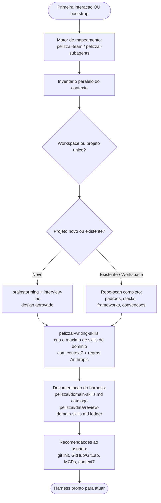

# PelizzAI Audit

<FIRST-TIME-USING-PELIZZAI>
Na **primeira vez** que o usuário interagir com o harness PelizzAI, ou sempre que ele digitar **"bootstrap"**, esta skill **PRECISA** ser invocada antes de qualquer trabalho. Sem este mapeamento, o harness atua às cegas.

O harness está inicializado neste projeto quando existe o arquivo `pelizzai/domain-skills.md`. Se ele **não** existe, trate como primeira vez.
</FIRST-TIME-USING-PELIZZAI>

## Objetivo

Mapear o contexto de trabalho para que o PelizzAI atue com precisão: identificar **o que** é o projeto (único ou workspace, novo ou existente), **com que** é construído (stacks, frameworks, linguagens, ferramentas), **o que já existe** de infraestrutura (MCPs, git/host remoto, skills de domínio) e, a partir disso, **preparar o harness** — criando as skills de domínio e a documentação que o tornam assertivo.

O mapeamento é **insumo**, não fim: ele existe para habilitar as próximas tarefas, não para produzir um relatório por si só.

**Anuncie ao iniciar:** "Usando a skill PelizzAI Audit para mapear seu contexto e preparar o harness."

---

## Princípio central

> Mapeie antes de agir, mas mapeie na medida certa. Um projeto novo e vazio precisa de uma entrevista; um monorepo maduro precisa de um repo-scan paralelo. Ajuste a profundidade ao que existe — e converta cada descoberta em um artefato útil (skill de domínio, recomendação ou registro), nunca em ruído.

Não transforme o bootstrap em interrogatório nem em auditoria interminável. Recomende mudanças (git, MCPs, integrações); **não as imponha** sem confirmação do usuário.

---

## Como executar o mapeamento

Conduza o levantamento com um **time de agentes**: use `pelizzai-team` (preferência) ou, se for indisponível/desnecessário, `pelizzai-subagents`. O mapeamento é naturalmente paralelizável — cada frente do inventário (estrutura, stacks, MCPs, git/host, skills existentes) é uma frente disjunta, ideal para um membro do time.

- Coordene pelo protocolo da `pelizzai-team`: um briefing por frente, arquivos/áreas próprios, e síntese ao final.
- Cada frente é **leitura** (read-only): prefira o agentType `Explore` no modo subagents.

---

## Fluxo lógico do bootstrap



---

## Fase 1 — Triagem do alvo

Determine, antes de tudo, **o que** você está mapeando:

- **Workspace ou projeto único?** Vários projetos independentes na mesma pasta (múltiplos `package.json`/`pyproject.toml`/`.git`, subpastas autossuficientes) indicam workspace/monorepo — mapeie cada projeto e a relação entre eles.
- **Novo ou existente?** Pasta vazia ou só com scaffolding (sem código de domínio, sem histórico relevante de git) → **novo**. Caso contrário → **existente**.

## Fase 2 — Inventário do contexto (em paralelo)

Levante, em frentes simultâneas:

```text
- Estrutura: layout de pastas, monorepo vs único, módulos e fronteiras.
- Stacks: linguagens, frameworks, gerenciadores de pacote, build, runtime, banco de dados.
- MCPs: instalados no projeto (.mcp.json, .claude/settings.json) e globais (~/.claude).
- Skills de domínio: já existe alguma skill não-`pelizzai-` neste projeto?
- Versionamento: git inicializado? remoto no GitHub/GitLab? CI/CD? branch atual e fluxo.
- Convenções: CLAUDE.md/AGENTS.md, linters, padrões de teste, estilo de commit.
```

> O sinal canônico de **bootstrap concluído** é a existência de `pelizzai/domain-skills.md` — não a presença de skills de domínio avulsas. Skills de domínio sem catálogo devem ser inventariadas e então **catalogadas** pela `pelizzai-writing-skills`, não tratadas como bootstrap já feito. **Auto-reparo do estado parcial:** se o catálogo existir mas o ledger `pelizzai/data/review-domain-skills.md` estiver ausente, NÃO refaça o bootstrap — semeie apenas o ledger via `pelizzai-writing-skills` (sem ele, a cadência de manutenção fica silenciosamente morta).

## Fase 3 — Ramificação

**Projeto NOVO:**

1. `pelizzai-brainstorming` — capturar a intenção e produzir um design enxuto aprovado (a brainstorming já usa `pelizzai-interview-me` internamente para estressar). **No bootstrap, o destino após o design é a `pelizzai-writing-skills`, não a `pelizzai-writing-plans`.**
2. `pelizzai-writing-skills` — criar as skills de domínio iniciais e escrever `pelizzai/domain-skills.md` (marca o bootstrap concluído), a partir do design aprovado.
3. Só então, se o usuário quiser implementar, segue-se o fluxo de feature normal (`pelizzai-writing-plans` → `pelizzai-execution-plans`).

**Projeto EXISTENTE ou WORKSPACE:**

1. **Repo-scan completo** — padrões, stacks, frameworks, linguagens, convenções e pontos de extensão.
2. `pelizzai-writing-skills` — criar o **máximo de skills de domínio** úteis a partir dos padrões observados, usando o MCP `context7` para fundamentar cada uma na documentação real das libs/frameworks, conforme as regras de criação de skills da Anthropic.

> A criação, a nomenclatura, o catálogo e o ledger das skills de domínio são responsabilidade da `pelizzai-writing-skills`. O `pelizzai-audit` **orquestra** e garante que essa etapa aconteça.

## Fase 4 — Documentação do harness

Garanta que o bootstrap deixe três artefatos (os dois primeiros criados/atualizados via `pelizzai-writing-skills`; o perfil, por esta skill):

- **`pelizzai/domain-skills.md`** — catálogo das skills de domínio: o que cada uma faz e quando usá-la.
- **`pelizzai/data/review-domain-skills.md`** — ledger de manutenção: quando cada skill de domínio foi criada/atualizada e a referência de git correspondente.
- **`pelizzai/profile.md`** — perfil de execução (template: [templates/profile.md](templates/profile.md)): comandos de test/build/lint/format/dev, package manager e stack baseline. Detecte lendo os scripts **REAIS** do projeto (`package.json` → `scripts`, Makefile/Justfile, pyproject, etc. — nunca chute `npm test`); honre o package manager do **LOCKFILE** (instalar com npm num projeto pnpm corrompe o lock); quando a detecção for inconclusiva, **confirme com o usuário** antes de gravar. O stack baseline (stack + versões-chave dos manifests, com data) ancora o eixo version-driven da `pelizzai-writing-skills`.

Ofereça também instalar os **hooks opt-in do Claude Code** (um a um, com confirmação — nunca imponha):

- **Hook de cadência** (`pelizzai-cadence.mjs`/`.ps1`, UserPromptSubmit): lembra de revisar as skills de domínio (ver `pelizzai-writing-skills` → `references/domain-skill-maintenance.md`).
- **Hook de guarda git** (`pelizzai-guardrails.mjs`/`.ps1`, PreToolUse com matcher `Bash`): bloqueia, antes de rodarem, `push --force` (exceto `--force-with-lease`), `reset --hard`, `clean -f`, `branch -D`, `checkout .` e `restore .` — enforcement executável dos gates fail-closed que, sem ele, dependem só da obediência do modelo. Instruções de instalação e teste no cabeçalho do próprio hook.
- **Hook de SessionStart** (`pelizzai-session-start.mjs`/`.ps1`, matcher `startup|clear|compact`): re-injeta o lembrete da `pelizzai-core` (regra do 1%) e o aviso de tarefa ativa no `state.md` — valor maior no `clear` e em plataformas que não re-injetam a entrada sempre-carregada.

A existência de `pelizzai/domain-skills.md` é o sinal de que o harness já foi inicializado neste projeto.

## Fase 5 — Recomendações ao usuário

Recomende (sem impor; aguarde confirmação para qualquer ação que altere o ambiente):

```text
- Git ausente → sugerir `git init` (o harness atua melhor com histórico).
- Sem remoto → sugerir integração com GitHub ou GitLab.
- MCPs → pesquisar na web os MCPs mais relevantes para a stack identificada e sugerir.
- context7 ausente → sugerir a instalação. É um MCP essencial para o PelizzAI fundamentar
  skills e respostas na documentação real, em vez de adivinhar.
```

---

## Padrão de diretório `pelizzai/`

Toda a documentação e o estado do harness vivem em `pelizzai/`, na **raiz do repositório ou do workspace**. Este é o padrão único que todas as skills consomem — nunca espalhe artefatos do harness por outras pastas.

Regra única de leitura: a **raiz** de `pelizzai/` guarda conhecimento versionado; `data/` guarda o estado e os efêmeros. **Tudo que o harness gera fica dentro de `pelizzai/`** — nunca em `.pelizzai/`, no temp do SO nem espalhado por outras pastas.

```text
pelizzai/                         na raiz do repositório ou workspace
│  ── CONHECIMENTO (versionado) ──
├── domain-skills.md              catálogo das skills de domínio (marca o bootstrap concluído)
├── profile.md                    perfil de execução: comandos test/build/lint, package manager, stack baseline (pelizzai-audit)
├── context.md                    glossário do domínio (pelizzai-domain-modeling); multi-contexto: context/<nome>.md + context-map.md
├── adr/                          decisões de arquitetura (ADRs numerados, registrados automaticamente)
├── out-of-scope/                 rejeições duráveis, um arquivo por conceito (pelizzai-domain-modeling)
├── specs/                        designs aprovados (pelizzai-brainstorming): AAAA-MM-DD-<topico>-design.md
├── plans/                        planos de implementação (pelizzai-writing-plans)
└── data/                         ── ESTADO E EFÊMEROS ──
    ├── state.md                  cursor da tarefa ativa (pelizzai-execution-plans) — versionado
    ├── review-domain-skills.md   ledger de manutenção das skills de domínio — versionado
    ├── .cadence-state.json       contador do hook de cadência                 — gitignored
    ├── handoffs/                 briefs, relatórios, pacotes de review e handoffs (task-brief / review-package / pelizzai-handoff) — gitignored
    ├── mockups/                  telas do visual companion (pelizzai-brainstorming)                                                — gitignored
    └── reports/                  relatórios HTML de arquitetura (pelizzai-improving-architecture)                                   — gitignored
```

> `context.md`, `adr/`, `out-of-scope/` e os subdiretórios de `data/` são criados **sob demanda** pelas skills que os usam, não no bootstrap — sua ausência logo após o bootstrap é esperada.

Em **workspace** (vários projetos na mesma pasta), o `pelizzai/` fica na raiz do workspace e cobre todos; cada skill registra a qual projeto um artefato pertence quando isso importar.

---

## Critério de conclusão

```text
[ ] Alvo classificado (workspace/único, novo/existente).
[ ] Inventário do contexto levantado (stacks, MCPs, git/host, skills, convenções).
[ ] Skills de domínio criadas ou confirmadas como já existentes (via pelizzai-writing-skills).
[ ] Catálogo (domain-skills.md) e ledger (review-domain-skills.md) presentes/atualizados.
[ ] Recomendações apresentadas ao usuário (git, host, MCPs, context7).
```

---

## Anti-padrões

```text
- Pular o bootstrap na primeira interação e começar a trabalhar às cegas.
- Transformar o mapeamento em interrogatório ou em auditoria sem fim.
- Impor mudanças (git init, instalar MCP, criar skills) sem confirmação do usuário.
- Criar skill de domínio com prefixo `pelizzai-` (reservado ao harness).
- Mapear um monorepo como se fosse um projeto único (ou vice-versa).
- Concluir sem deixar o catálogo e o ledger que tornam o mapeamento reaproveitável.
```

---

## Integração

**Combina com:**

- `pelizzai-team` / `pelizzai-subagents` — motor paralelo do mapeamento.
- `pelizzai-interview-me` / `pelizzai-brainstorming` — ramo de projeto novo.
- `pelizzai-writing-skills` — cria as skills de domínio, o catálogo e o ledger.
- `pelizzai-reasoning` — raciocínio do mapeamento (Structured Decomposition, Evidence Synthesis).
