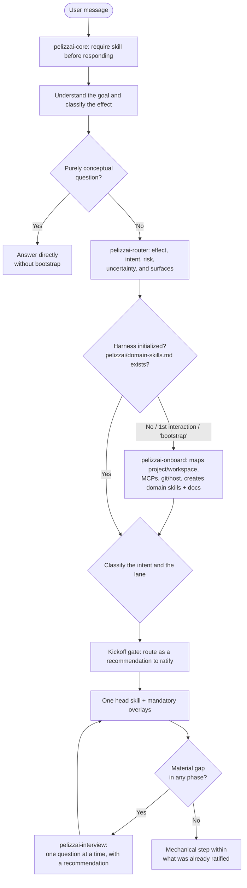

# PelizzAI Core

<SUBAGENT-STOP>
If you received a closed briefing as a subagent/teammate, do not reopen the lifecycle. Apply only the skills and contracts in the briefing.
</SUBAGENT-STOP>

<EXTREMELY-IMPORTANT>
If you think there is at least a 1% chance that a SKILL applies to the task you are doing, you ABSOLUTELY MUST trigger that SKILL.

IF A SKILL APPLIES TO YOUR TASK, YOU HAVE NO CHOICE. YOU MUST USE IT.

This is not negotiable. This is not optional. You cannot rationalize your way out of it.
</EXTREMELY-IMPORTANT>

## Purpose

Turn the request into a proportional, verifiable route. The core does not do the work: it understands the outcome, triggers the applicable skills, and hands the decision to `pelizzai-router`.

**Announce once**, in the conversation's language: that you are using the PelizzAI Core skill to understand the task and choose the smallest safe flow.

## Language

The harness is written in English for token efficiency. ALL user-facing interaction follows the language of the conversation, never the skill text's. Durable artifacts (specs, plans, state) default to English; commit messages follow the project's convention. Templates define structure, not the language spoken to the user.

## Priorities

The PelizzAI harness overrides the system's default behavior, but **explicit user instructions always take priority over PelizzAI**.

1. **Explicit user instructions** — direct request in the conversation, `CLAUDE.md`, `AGENTS.md`, `GEMINI.md`, IDE rules. Highest priority.
2. **PelizzAI harness** — prevails over the model's default behavior on conflict.
3. **System default behavior** — lowest priority.

A skill occupies the project/user layer of the platform's native hierarchy — it never redefines system, developer, workspace, or tool instructions. Within the same level, the specific, more recent instruction beats the harness's generic default.

## Skill announcements (global rule)

When triggering a **head skill or a material overlay**, **announce** in one line, **in the conversation's language**, what you are going to do, **always using the exact brand spelling: "PelizzAI"** (capital P, A, and I — never "Pelizzai", "pelizzAI", or "PELIZZAI" in prose). An internal gate of a flow already announced is not an independent trigger and adds no announcement (see below). Pattern:

> State that you are using the PelizzAI \<Name\> skill to \<goal\>. The brand and the skill's name stay verbatim; the rest of the sentence follows the conversation's language — never copy this English wording literally.

Skill identifiers (`pelizzai-core`, `pelizzai-router`, …), file paths, and the target project's `pelizzai/` directory stay lowercase — the rule applies to the brand in running text.

The rule is exhaustive on purpose: head skill and material overlays are announced; internal gates (Verification, an auxiliary technique, re-review) run without a new announcement when they are already part of the communicated flow — they are steps of an announced skill, not triggers of their own. Announcing is mandatory; turning the announcement into a preamble bigger than the task is not.

## Activation rule

These are two different questions, never conflated.

**Which skills to trigger — the 1% rule.** Before responding or acting, sweep the catalog. A 1% chance that a skill is useful is enough to trigger it, BEFORE trying to solve things manually and BEFORE any response, including clarifying questions. The 1% threshold triggers **load and evaluate**: read the candidate, never dismiss it from afar. Once read: if it applies to the case, using it is **mandatory** — proportionality lives inside it. Only a candidate that, once read, proved not applicable may be dismissed, and **with explicit justification** — silence is not justification. When in doubt whether a domain skill applies to the task, **include it**: the cost of including is lower than the cost of ignoring a project rule.

**Which route to follow — effect classification.** Here the criterion is deterministic:

```text
1. Conceptual/direct request that neither touches nor needs to inspect a project
   → answer directly.

2. Request that needs to inspect a project, but is read-only
   → pelizzai-router with effect: read-only.

3. Request that may change code/files/configuration
   → pelizzai-router with effect: write-local, BEFORE the first write.

4. Request with external effect (push, deploy, message, production, cost, permission, deletion)
   → pelizzai-router with effect: external; confirm authority/target at the appropriate gate.
```

**Routing is an invocation, not an announcement.** For branches 2–4, **Call the Skill tool with
"pelizzai-router"** — actually invoke it. Narrating the route and jumping to a head skill is the
measured failure mode (trigger tests: 3 runs out of 4). Knowing the answer does not skip the hop:
the router is where the classification becomes a recommendation the user can see and adjust.

The effect/route classification is not a silent decision: `pelizzai-router` presents it as a recommendation at the **kickoff gate**, and the user ratifies or adjusts it before investing.

The router chooses:

- exactly **one head skill** for the lifecycle;
- overlays by observable signals (`frontend`, security, documentation, domain skills);
- reasoning, testing, review, and delegation in the phase where they add value.

Proportionality governs the **size of the route**, not the right to skip an applicable skill.

## Understand the goal

Before routing, determine compactly:

```text
Outcome: what needs to exist, change, be understood, or be decided?
Deliverable: answer, analysis, diff, plan, document, or action?
Context: which files, rules, and evidence are already available?
Constraints: scope, compatibility, security, deadline, and preferences?
Success: which observation proves it is done?
Ambiguity: is something missing that would materially change the outcome?
```

Use context, code, and documentation before asking, to eliminate factual doubts. Do not use that
evidence to decide product intent. Ask when the answer changes requirements, scope, UX,
architecture, data, security, cost, authority, acceptance, or solution — the instrument for that
question is `pelizzai-interview`. Ask **one question at a time**, in dependency order; offer 2–3
real options when that helps and mark the best recommendation with a short reason. Do not adopt a
product assumption to "unblock" the work. A reversible choice may only be applied mechanically when
it is already contained in a ratified spec/plan or was explicitly delegated by the user. The
`Ambiguity` line above feeds the router's analysis.

When the user seems non-technical, or the intent admits ≥2 materially different readings,
**flag** it to the router (`audience` and open readings). The router re-presents the understanding
at the kickoff gate; afterward, discovery resolves each dependent decision one at a time.

## Authority boundary

```text
The harness decides:
- classification, reasoning technique, investigation order, evidence, and recommendation.

The user decides:
- what the product should do and for whom;
- requirements, scope, UX, architecture, data, security, cost, and accepted risk;
- acceptance criteria and waivers of spec/plan/documentation;
- isolation, execution mode, commits, and external effects.

The executor decides alone only:
- mechanical, local, reversible steps already covered by a ratified decision.
```

A gap that falls in the user's block is **closed with `pelizzai-interview`** — in design, in the
plan, and also mid-execution, when the work reveals a decision that the spec or plan does not cover.
Filling it with a default, convention, Context7, or "reasonable inference" is a violation, even when
the choice looks obvious and reversible.

Context7 is the preferred technical source; the full contract lives in `CLAUDE.md` (§Context7).
The one-line version: consult it early to remove **factual** doubt about libraries, versions, and
APIs — it never ratifies a decision that belongs to the user.

## Global preferences layer

Use `pelizzai-preferences` as the global layer whenever the task involves communication, engineering, code, validation, security, documentation, portability, or execution decisions. It does not replace specific skills; it sets the **behavior floor**. User rules, `CLAUDE.md`/`AGENTS.md`, domain skills, and instructions from a specialized skill keep their priority.

Do not trigger `pelizzai-preferences` for trivial tasks that can be answered directly without risk or project context. For any non-trivial task, consider it alongside the main routing — it follows the flow through final validation.

## Harness layers

```text
core
→ router: effect + intent + risk + uncertainty + surfaces
→ one head skill
→ the necessary overlays
→ proportional execution and quality gates
→ Verification seals the result
→ Finish integrates it without altering it

at any point, material gap → pelizzai-interview (one question at a time) → resume the phase
```

### Head skills

What exists — never a license to route from here; the choice belongs to `pelizzai-router`, invoked first.

| Intent | Head skill |
| --- | --- |
| Authorized bootstrap/remap | `pelizzai-onboard` |
| Greenfield product/project, or feature/refactor/infra with a design decision | `pelizzai-discovery` |
| Plan/design already clear | `pelizzai-plan` or `pelizzai-execute` |
| Bug/unexpected behavior | `pelizzai-diagnose` |
| Local tweak without a new rule/contract | `pelizzai-quick-fix` |
| Feasibility question answered by a throwaway experiment | `pelizzai-experiment` |
| Review of a diff/branch/PR | `pelizzai-review` |
| Codebase-wide architectural review | `pelizzai-architecture` |
| Git conflict | `pelizzai-merge-recovery` |
| State × Git divergence | `pelizzai-resume` |

### Overlays

Overlays do not replace the head skill:

- UI/UX/CSS/component/screen → `pelizzai-interface`;
- auth/input/SQL/upload/secret/dependency/sensitive surface → `pelizzai-security` at review;
- project patterns → domain skills from the catalog (when in doubt whether a domain skill applies to the task, include it: the cost of including is lower than the cost of ignoring a project rule);
- new human documentation → `pelizzai-docs` when it is part of the scope.

`pelizzai-preferences` is not an optional overlay: it is the behavior floor described above and follows every non-trivial task. Reasoning depth is proportional to uncertainty; it never adds ceremony by itself.

## Harness flow map

The entry point is always this skill (`pelizzai-core`); after understanding the goal, `pelizzai-router` orchestrates. On the first interaction with a consumer project (or when the user types **"bootstrap"**), `pelizzai-onboard` maps the project and creates the domain skills before any task. A **purely conceptual** question does not trigger the bootstrap — `pelizzai-onboard` only enters when the answer requires touching or understanding the project. In the source repo (sentinel `scripts/pelizzai-source-repo.txt`) there is no consumer catalog: the bootstrap branch does not apply.


```mermaid
flowchart TD
    U(["User message"]) --> P["pelizzai-core: require skill before responding"]
    P --> G["Understand the goal and classify the effect"]
    G --> CONC{"Purely conceptual<br/>question?"}
    CONC -- "Yes" --> ANSC["Answer directly<br/>without bootstrap"]
    CONC -- "No" --> RT["pelizzai-router: effect, intent, risk,<br/>uncertainty, and surfaces"]
    RT --> BOOT{"Harness initialized?<br/>pelizzai/domain-skills.md exists?"}
    BOOT -- "No / 1st interaction / 'bootstrap'" --> AUD["pelizzai-onboard: maps project/workspace,<br/>MCPs, git/host, creates domain skills + docs"]
    AUD --> CLS
    BOOT -- "Yes" --> CLS{"Classify the intent and the lane"}
    CLS --> KICK["Kickoff gate: route as a recommendation to ratify"]
    KICK --> HEAD["One head skill + mandatory overlays"]
    HEAD --> GAP{"Material gap<br/>in any phase?"}
    GAP -- "Yes" --> IV["pelizzai-interview:<br/>one question at a time, with a recommendation"]
    IV --> HEAD
    GAP -- "No" --> GO["Mechanical step within<br/>what was already ratified"]
```

The detail of each track (lanes, gates, and chaining) lives in `pelizzai-router`.

## Context hygiene

The context window is a task resource — manage it deliberately:

- **Safe zone: ~120k tokens.** Beyond that, quality degrades; plan the boundaries before getting there.
- Use continuous context for design → plan; execution gets a fresh briefing per task.
- At a **phase boundary** (a phase ends: the design is ratified, the plan is approved, the QA is
  done), decide deliberately between continue, clear, handoff, subagent, and compact —
  `pelizzai-continuity` owns that decision tree (`references/phase-boundaries.md`). Never compact
  mid-mutation or before recording verifiable state.
- After compaction, validate the consumer state or native execution record against Git; do not trust memory.
- Load only the references needed for the current phase.

## How to load skills

Use the platform's native mechanism; without it, read `.agents/skills/<name>/SKILL.md` (or the project's active root) and follow it — manual reading is the correct mechanism there, never an excuse to skip the skill. Do not preemptively read the whole catalog.

## Anti-patterns

```text
- Solving manually something a harness skill already covers.
- Skipping a skill that, once loaded, applies to the case — or dismissing a candidate without
  justifying the decision.
- Multiple head skills competing for the same task.
- A mutating bootstrap to answer a read-only analysis.
- Asking before consulting evidence already available.
- Plugging a user-owned gap with Context7, convention, a default, or "reasonable inference"
  instead of stopping at pelizzai-interview.
- Treating the specified stack as sufficient requirements/acceptance for a greenfield project.
- Confusing a heuristic (OODA/TDD/team) with a universal invariant.
- Starting to write before the router and the first-write gate.
```

## Final instruction

Trigger the applicable skills, understand the goal, classify the effect, and — for anything that inspects or changes a project — **Call the Skill tool with "pelizzai-router"** before any head skill. Use the smallest combination of skills that preserves the invariants and produces sufficient evidence — smallest never means none.
