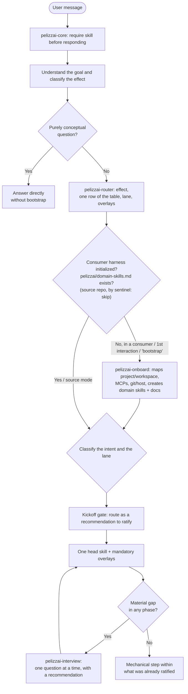

# PelizzAI Core

<SUBAGENT-STOP>
If you received a closed briefing as a subagent/teammate, do not reopen the lifecycle. Apply only the skills and contracts in the briefing.
</SUBAGENT-STOP>

<EXTREMELY-IMPORTANT>
If you think there is at least a 1% chance that a SKILL applies to the task you are doing, you ABSOLUTELY MUST trigger that SKILL.

IF A SKILL APPLIES TO YOUR TASK, YOU HAVE NO CHOICE. YOU MUST USE IT.

This is not negotiable. This is not optional. You cannot rationalize your way out of it.
</EXTREMELY-IMPORTANT>

## Purpose

Turn the request into a proportional, verifiable route. The core does not do the work: it understands
the outcome, triggers the applicable skills, and hands project work to `pelizzai-router`.

**Announce once**, in the conversation's language: that you are using the PelizzAI Core skill to understand the task and choose the smallest safe flow. Use the exact brand spelling **"PelizzAI"** in prose; skill identifiers, paths, and the `pelizzai/` directory stay lowercase. Head skills and material overlays announce themselves in one line; internal gates of an announced flow do not.

## Priorities

1. **Explicit user instructions** — the conversation, `CLAUDE.md`, `AGENTS.md`, `GEMINI.md`, IDE rules.
2. **PelizzAI harness** — prevails over the model's default behavior on conflict.
3. **System default behavior.**

A skill occupies the project/user layer of the platform's hierarchy and never redefines system, developer, or tool instructions. Within one level, the specific and more recent instruction beats the generic default.

## Activation rule

Two different questions, never conflated.

**Which skills to trigger — the 1% rule.** Before responding or acting, sweep the catalog. A 1% chance that a skill is useful is enough to **load and evaluate** it: read the candidate, never dismiss it from afar. Once read, if it applies, using it is mandatory — proportionality lives inside it. Only a candidate that, once read, proved not applicable may be dismissed, with the reason stated. In doubt whether a domain skill applies, include it.

**Which route to follow — effect classification.** Deterministic:

```text
1. Conceptual or direct request that neither touches nor needs to inspect a project
   → answer directly.
2. Needs to inspect a project, read-only
   → pelizzai-router with effect: read-only.
3. May change code, files, or configuration
   → pelizzai-router with effect: write-local, BEFORE the first write.
4. External effect (push, deploy, message, production, cost, permission, deletion)
   → pelizzai-router with effect: external.
```

**Routing is an invocation, not an announcement.** For branches 2–4, **Call the Skill tool with
"pelizzai-router"** — actually invoke it. Narrating the route and jumping to a head skill is the measured
failure mode (trigger tests: 3 runs out of 4). Knowing the answer does not skip the hop: the router is
where the classification becomes a recommendation the user can see and adjust at the kickoff gate, and
where exactly one head skill and the overlays are chosen.

## Understand the goal

Before routing, determine compactly:

```text
Outcome:     what needs to exist, change, be understood, or be decided?
Deliverable: answer, analysis, diff, plan, document, or action?
Context:     which files, rules, and evidence are already available?
Constraints: scope, compatibility, security, deadline, preferences?
Success:     which observation proves it is done?
Ambiguity:   is something missing that would materially change the outcome?
```

Use context, code, and documentation before asking, to eliminate **factual** doubt — Context7 first for
libraries, versions, and APIs. Never use that evidence to decide product intent: requirements, scope,
UX, architecture, data, security, cost, acceptance, and accepted risk belong to the user and are closed
with `pelizzai-interview`, one question at a time, with a recommendation (`CLAUDE.md` §The LLM never
decides alone). Flag a non-technical audience or two material readings to the router; it re-presents
the understanding at the kickoff gate.

## Global preferences layer

`pelizzai-preferences` is the behavior floor of every non-trivial task — communication, engineering,
code, validation, security, documentation, portability. It does not replace specific skills; user rules,
`CLAUDE.md`/`AGENTS.md`, domain skills, and a specialized skill's instructions keep their priority. A
trivial task answered directly, with no risk and no project context, has nothing to apply.

## Harness layers

```text
core
→ router: effect → one row of the table → lane → overlays
→ one head skill
→ the necessary overlays
→ proportional execution and quality gates
→ Verification seals the result
→ Finish integrates it without altering it

at any point, material gap → pelizzai-interview (one question at a time) → resume the phase
```

### Head skills

What exists — never a license to route from here; the choice belongs to `pelizzai-router`, invoked first.

| Intent | Head skill |
| --- | --- |
| Authorized bootstrap/remap | `pelizzai-onboard` |
| Greenfield product/project, or feature/refactor/infra with a design decision | `pelizzai-discovery` |
| Plan/design already clear | `pelizzai-plan` or `pelizzai-execute` |
| Bug/unexpected behavior | `pelizzai-diagnose` |
| Local tweak without a new rule/contract | `pelizzai-quick-fix` |
| Feasibility question answered by a throwaway experiment | `pelizzai-experiment` |
| Review of a diff/branch/PR | `pelizzai-review` |
| Codebase-wide architectural review | `pelizzai-architecture` |
| Git conflict | `pelizzai-merge-recovery` |
| State × Git divergence | `pelizzai-resume` |

### Overlays

Overlays do not replace the head skill:

- UI/UX/CSS/component/screen → `pelizzai-interface`;
- auth/input/SQL/upload/secret/dependency/sensitive surface → `pelizzai-security` at review;
- project patterns → domain skills from the catalog (when in doubt whether a domain skill applies to the task, include it: the cost of including is lower than the cost of ignoring a project rule);
- new human documentation → `pelizzai-docs` when it is part of the scope.

`pelizzai-preferences` is not an optional overlay: it is the behavior floor described above and follows every non-trivial task. Reasoning depth is proportional to uncertainty; it never adds ceremony by itself.

## Harness flow map

The entry point is always this skill (`pelizzai-core`); after understanding the goal, `pelizzai-router` orchestrates. On the first interaction with a consumer project (or when the user types **"bootstrap"**), `pelizzai-onboard` maps the project and creates the domain skills before any task. A **purely conceptual** question does not trigger the bootstrap — `pelizzai-onboard` only enters when the answer requires touching or understanding the project. In the source repo (sentinel `scripts/pelizzai-source-repo.txt`) there is no consumer catalog: the bootstrap branch does not apply.


```mermaid
flowchart TD
    U(["User message"]) --> P["pelizzai-core: require skill before responding"]
    P --> G["Understand the goal and classify the effect"]
    G --> CONC{"Purely conceptual<br/>question?"}
    CONC -- "Yes" --> ANSC["Answer directly<br/>without bootstrap"]
    CONC -- "No" --> RT["pelizzai-router: effect,<br/>one row of the table, lane, overlays"]
    RT --> BOOT{"Consumer harness initialized?<br/>pelizzai/domain-skills.md exists?<br/>(source repo, by sentinel: skip)"}
    BOOT -- "No, in a consumer / 1st interaction / 'bootstrap'" --> AUD["pelizzai-onboard: maps project/workspace,<br/>MCPs, git/host, creates domain skills + docs"]
    AUD --> CLS
    BOOT -- "Yes / source mode" --> CLS{"Classify the intent and the lane"}
    CLS --> KICK["Kickoff gate: route as a recommendation to ratify"]
    KICK --> HEAD["One head skill + mandatory overlays"]
    HEAD --> GAP{"Material gap<br/>in any phase?"}
    GAP -- "Yes" --> IV["pelizzai-interview:<br/>one question at a time, with a recommendation"]
    IV --> HEAD
    GAP -- "No" --> GO["Mechanical step within<br/>what was already ratified"]
```

The detail of each track (lanes, gates, and chaining) lives in `pelizzai-router`.

## How to load skills

Use the platform's native mechanism; without one, read `.agents/skills/<name>/SKILL.md` (or the
project's active root) and follow it — manual reading is the correct mechanism there, never an excuse to
skip the skill. Do not preemptively read the whole catalog. Context boundaries (handoff, clear, compact)
are `pelizzai-continuity`'s decision; never compact mid-mutation or before recording verifiable state.

## Anti-patterns

```text
- Solving manually something a harness skill already covers, or dismissing a loaded candidate without a reason.
- Starting to write before the router and the first-write gate.
- Announcing a head skill instead of invoking it.
- Plugging a user-owned gap with Context7, convention, a default, or "reasonable inference".
- Treating the specified stack as sufficient requirements for a greenfield project.
```

## Final instruction

Trigger the applicable skills, understand the goal, classify the effect, and — for anything that inspects
or changes a project — **Call the Skill tool with "pelizzai-router"** before any head skill. Use the
smallest combination of skills that preserves the invariants and produces sufficient evidence; smallest
never means none.
