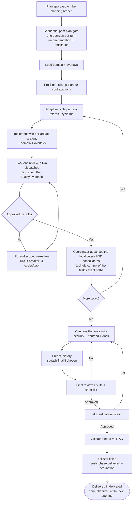

# PelizzAI Execute

## Goal

Execute an approved plan with **per-task discipline**: each task gets the test/validation
strategy suited to its artifact, passes the blind spec and quality/evidence lenses in their two
dispatches, and only then is
consolidated. At the end, overlays that may write run before the content is sealed by
review, suite, and checklist. The skill keeps resumable state and prevents integrating content
different from what was validated.

**Announce on start**, in the conversation's language: that you are using the PelizzAI Execute skill to execute the plan, task by task.

<TEAM-MEMBER-STOP>
If you are a **member** (teammate/subagent) in charge of **one task**, implement only yours:
follow the declared test strategy, the domain skills, and the cross-cutting skills/overlays
pasted into the briefing; respect `pelizzai-preferences` and return `DONE`, `DONE_WITH_CONCERNS`,
`BLOCKED`, or `NEEDS_CONTEXT`. A decision that is not in the briefing/plan/spec is **not yours to
fill**: name the gap and return `NEEDS_CONTEXT`. Do not orchestrate or commit. See
`references/task-cycle.md`.
</TEAM-MEMBER-STOP>

---

## Core principle

> Execute only the approved plan, with human gates at the **edges** (post-plan setup, destination,
> completion) and autonomy **between the tasks**: a mechanical step already covered by the
> spec/plan asks no permission — don't stop to ask "should I continue?" at every task. The
> autonomy is of execution, never of decision: a material gap in requirements, scope, UX,
> architecture, data, security, cost, or acceptance stops the work and goes to the human via
> `pelizzai-interview`, never to a default. No task is consolidated without evidence and review.

---

## Sequential post-plan setup gate (MANDATORY before Task 1)

The normal case is that the task/planning branch already exists: `pelizzai-starting-branch`
created it **before** the spec/plan and recorded `base-ref`/`base-sha`. If an external plan
(PRD/issues) arrived without a branch, invoke it now before continuing.

With the plan approved and **before any product write**, the gate opens by re-presenting the
plan's technical decisions (item 0) and then ratifies the setup decisions
**one at a time**. In each turn, present real options, highlight the recommended one with a
one-line why, ask a single question, and wait. First read `pelizzai/profile.md`
(§Ratified execution defaults): a filled field = the recommendation already comes from project
policy; `<unset>` = compute the proportional default. `destination` **never** comes from the
profile — push/PR/publication are decided per task in `pelizzai-finish`.

```text
0. Technical decisions of the plan (bridge from the approved WHAT to the HOW)
   Decisions already ratified (spec/design/interview) appear as a one-line recap — what the user
   already decided is not re-asked. The cited origin must be locatable in the artifact — do the
   quick read to confirm; a non-corroborable origin (absent from the spec/design, or a "plan
   interview" with no record in this session) is treated as OPEN, not as a recap. If the plan
   marked "no material technical decisions", say so.
   Safety net: any decision on the list WITHOUT a recorded ratification origin does not pass as
   an item to rubber-stamp — present it here as a question with 2–3 options and the recommended
   one (one-line why) and wait for the choice before proceeding.
   Anchor: a technical decision without ratification does not pass the gate — it becomes a
   question with options and a recommendation, never a list item to rubber-stamp.

1. Isolation (only after 0)
   Recommended: <branch|worktree> — <why>.
   Alternative: <...>.
   Question: which isolation do you choose?

2. Mode (only after 1)
   Options always visible: inline · subagents · team.
   Recommended: <mode> — <why>.
   Note (say it, do not assume it is known): the mode decides who IMPLEMENTS. It does NOT change
   the review. In every mode — inline included — the two lenses go out as TWO INDEPENDENT
   DISPATCHES, because the coordinator can never be the blind lens. `inline` means "no delegation
   to implement", never "no subagents at all".
   Check this for the REVIEWER specifically — being able to dispatch an implementer does not prove
   a reviewer is dispatchable. If this environment cannot dispatch an independent reviewer, say so
   HERE, in the conversation's language, and open the degradation choice (`pelizzai-review` →
   "When there is no independent reviewer") — not later, with the code already written. The gate
   does NOT advance to item 3 until the user has chosen (a), (b), or (c): as with every other
   item, recommendation and silence are not answers, and a non-blind review is never self-granted.
   Question: which mode do you choose?

3. Commits (only after 2)
   Options: granular · squash-final.
   Recommended: granular — preserves checkpoints; squash-final only if you ask for it.
   Question: which strategy do you choose?
```

Rules: the mode keeps **the three options always visible** — **team is never omitted**. There is
no universal ranking. **Squash-final only on explicit user request**. The plan's content (the
WHAT) was already approved at the previous edge; this gate ratifies the HOW without hiding
several decisions behind a single "ok". Silence and recommendation do not count as an answer. Do
not write code, move a worktree, squash, or record final decisions until steps 0–3 are complete.
Branch base and name were already ratified before the spec/plan by `pelizzai-starting-branch`.

**The review is deliberately NOT a gate item.** It is not asked because it has no alternative to
offer: every task **and** the final candidate go through the two lenses of `pelizzai-review` in
**two dispatches**, and the blindness of the spec lens is not negotiable — there is no profile to
pick and no downgrade to ratify. A gate item whose only valid answer is the recommendation is not
ratification, it is ritual; and ritual teaches the user to answer gates on autopilot, which
corrodes exactly the attention items 0–3 need. This omission does not widen the harness's
autonomy: it removes a question that never had two answers.

Under a closed briefing (SUBAGENT-STOP / TEAM-MEMBER-STOP), do not produce route analyses or open
gates: apply the briefing and escalate to the coordinator whatever requires a decision.

**Policy already ratified.** Values from `profile.md` pre-select the recommendation of each step,
but do not auto-confirm the current task. Ask the sequential questions normally; the user may
answer "use the policy for the remaining items" and explicitly delegate that application.

If the signals diverge from the policy, explain the divergence in the recommendation. An override
does not change the profile; changing the policy requires separate confirmation before writing.
In source mode, use the native execution record as the task's memory, never as inherited
authorization.

**Applying the isolation — invoke `pelizzai-starting-branch` (POST-ratification).** Only after the three answers:
branch checkpoints the persistent setup when it exists and keeps the current branch; worktree
captures `checkpoint-sha` after the optional checkpoint, frees the branch in the main working
tree, adds the worktree with the **existing branch**, and records the new path before Task 1.
Both start implementation with a clean working tree. Worktree does not authorize concurrent
writers on paths that overlap — parallel writing inside the single worktree requires DISJOINT
PATHS (canonical rule in "Isolation and parallelism"). Any `squash-final` happens **before** final review/tests/`validated-head`;
`pelizzai-finish` never rewrites content or history after the seal.

**Record (only after completing the gate).** Write isolation/execution-mode/commit-strategy and the
marker `kickoff: ratified <YYYY-MM-DD>` to the consumer state (`pelizzai/data/state.md`) or, in
source mode, to the native execution record with the same keywords. On a real resumption with
values already ratified and recorded (`kickoff: ratified`), honor them without re-asking.
Writes/review/commit on the working tree are serialized.

If the degradation choice was opened at step 2 and the user accepted a declared non-blind review,
also record `review-integrity: degraded <YYYY-MM-DD> — <reason>`. **Read it back on resumption**: a
session that regains the capability does not inherit blindness for what was reviewed without it —
offer to re-review those tasks before the seal. Absent the field, assume `blind`, never the reverse.

---

## Prerequisites (gate)

Before the first task, confirm:

```text
[ ] Plan ratified at the edge: a plan generated by the harness received explicit approval of its
    CONTENT; a PRD/issues supplied by the user themselves already count as
    ratified. No plan → go back to pelizzai-writing-plans.
[ ] Greenfield: the eight steps happened in this order — discovery → spec → spec stress-test →
    approval → plan → plan stress-test → approval → setup — or the user granted an explicit
    waiver. Ratifications (date + what was approved) live in the PLAN HEADER, not in cursor
    fields: this gate reads the artifact, not a field stamped by a hook.
[ ] Consumer: the catalog exists (zero domain skills is valid) and state was prepared.
    Source mode: do NOT create a consumer catalog/state; use the source repo's rules and the
    execution record.
[ ] The relevant domain skills were selected when the consumer has them.
[ ] `overlays` was inferred from the effect/surface and the cross-cutting skills are ready to
    apply/paste into executor and reviewer briefings.
[ ] The post-plan setup gate was conducted: the plan's technical decisions were re-presented and
    ratified (item 0) and isolation/execution-mode/commit-strategy RATIFIED
    by the user in sequential questions (no default applied without ratification; no <pending>;
    `kickoff: ratified`) and the isolation created via pelizzai-starting-branch AFTER the "ok".
[ ] NOT on a protected branch (real default/base-ref, main/master/develop/dev, or empty HEAD).
[ ] In a consumer, the state exists at pelizzai/data/state.md (if not, instantiate from the template and fill
    slug/track/lane/phase/project/branch/base-ref/base-sha/kickoff/isolation/execution-mode/
    commit-strategy/overlays/spec/plan before Task 1; `validated-head: <none>`,
    `kickoff: pending` until ratification; writing the file is enough — there is no setup-only
    commit) and it was validated against git (branch: `git branch --show-current`; worktree:
    `git worktree list` or the command run INSIDE the worktree-path).
```

In the consumer, the `pelizzai/` directory follows the harness pattern and state lives in
`pelizzai/data/state.md`. In source mode, state lives only in the native execution record.

---

## Build the skill package (mandatory in all three modes)

Domain skills capture the project's patterns; cross-cutting skills/overlays capture a surface of
the change. **Every executor and reviewer receives the applicable ones** — the briefing of EACH
task (inline, subagents, or team) includes the applicable domain-skill package from the catalog,
not just the overlays. Recompute overlays from the real diff: UI includes
`pelizzai-frontend`; a sensitive surface includes `pelizzai-oswap`; a new stable surface may
include `pelizzai-documentation`. Persisting names in `overlays:` does not replace pasting
their gates into the briefing.

**The Active rules travel in the package too — CONSUMER ONLY.** Before Task 1, in a consumer,
read the **Active rules** of `pelizzai/data/learnings.md` (the short section only — the Incident
log is consulted on demand, not loaded here) and paste them into the briefing of EVERY task,
exactly like the domain skills. **In source mode there is no consumer runtime to read**: use the
source repo's own rules/skills and do not create `pelizzai/` to satisfy this step.
Reading them yourself is not enough: in subagents/team the implementer is another agent with an
isolated context, and a rule the coordinator read but did not paste never reaches the code. These
are the rules this project already paid to learn — most of them are about **how you prove
something works**, which is what a task under time pressure gets wrong first.

```text
1. Consumer: read `pelizzai/domain-skills.md`; source mode: use the source repo's rules/skills.
1.5. Consumer: read the Active rules of `pelizzai/data/learnings.md` (Incident log NOT loaded).
2. Read `overlays:` in the state/execution record and complement from the observed effect/surface.
3. Inline: load domain + overlays. Subagents/Team: PASTE their operational points into the briefing.
4. Propagate the same package to the reviewer; they must judge UI/security/docs requirements too.
5. Priority: explicit request and project rules > domain skills > applicable overlays >
   generic preferences/reasoning. A material conflict goes up to the coordinator.
6. If a task's surface touches a stack with NO covering domain skill (the catalog exists but does
   not cover it), record ONE "domain skill gap" in the state/execution record and flag it in the
   task report (a member returns `DONE_WITH_CONCERNS`); do NOT block execution or create a skill
   mid-task. The coordinator accumulates the gaps and forwards them to the adoption-driven axis of
   `pelizzai-create-skill` at closeout, in a single grouped proposal — never a gate per task.
```

In the consumer, a missing catalog goes back to `pelizzai-audit`. In source mode, absence is the
contract — the domain-skill proposal gate does not run; domain rules, if any, live in the native
execution record. When the plan arrived via PRD/issues (without passing through
`pelizzai-writing-plans`/`pelizzai-idea-generation`) and the stack is not covered by the consumer's
catalog, the post-plan setup gate pulls the proactive domain-skill proposal
(recommend-and-ratify; owner: `pelizzai-router`/
`pelizzai-writing-plans`/`pelizzai-audit`) before Task 1 — this skill does not re-specify it,
only guarantees that that path does not skip it.

---

## The three execution modes

There is no universal ranking; use the least coordination that preserves quality.

| Mode                 | Skill              | When                                                                       |
| -------------------- | ------------------ | ---------------------------------------------------------------------------- |
| **team**             | `pelizzai-team`    | Fronts with dependencies that require coordination and exchange during execution |
| **subagents**        | `pelizzai-subagents` | Independent tasks that only need to **report**; one fresh subagent per task, isolated context, per-task review |
| **inline**           | —                  | Small/sequential plan where delegating **the implementation** would cost more than executing it. It does not waive the review's two dispatches — no mode does |

```text
Isolation and parallelism (as the user ratified at the gate). The shared working tree does NOT
isolate agents from each other — this rule serializes, not Git:
- isolation: branch → ONE integration working tree, ONE writer at a time. The coordinator applies
  the writes serially; parallelism stays with what does not write (investigation, reading, review,
  decomposition). Before the per-task review, quiesce writers and generate
  `review-package --working-tree`, which must represent only the task under review.
- isolation: worktree → fronts write in parallel INSIDE the task's single worktree, as long as
  they touch DISJOINT PATHS. Disjointness is the CONDITION, not advice: a real conflict proves
  the pair was not disjoint — replan the decomposition instead of forcing it.
  Never one worktree per agent.
- Review with parallel writing in progress (worktree): the working tree contains WIP from OTHER
  fronts. (a) scope the package to the paths of the front under review; (b) instruct the reviewer
  to IGNORE changes outside them (they are not "extras" of this task — they belong to another
  front); (c) for the test evidence, run the front's subset or quiesce the others before the full
  suite — an intentional RED from another front does not fail this task.
- Under any isolation, review, stage, commit, and cursor are serialized by the coordinator.
```

**Tie-breaker:** team when members need to talk/negotiate dependencies; subagents when each unit
only needs to report; inline when the work is short and serial. Parallelism alone does not
require team.

Record the mode in the consumer `state.md` or the native execution record
(`execution-mode: team | subagents | inline`).

---

## Flow



OODA is useful as **macro control** when there is feedback and mutable state: observe evidence,
orient against the DoD, decide, and act. It is not the mandatory reasoning of every task. The
briefing selects the technique that attacks the problem (decomposition, RCA, hypothesis,
comparison, verification); OODA only coordinates iterations when a real loop exists.

---

## Pre-flight

Before Task 1, read the plan looking for internal contradictions or conflicts with domain/review
skills. If there are investigable technical facts, investigate. If there is a human decision,
present the highest-impact one with a recommendation and ask one question at a time. If it is
clean, proceed.

---

## Per-task cycle

The detailed protocol — self-sufficient briefing, per-artifact strategy, the two-lens review,
circuit breaker, and commit as a gate — lives in
**[references/task-cycle.md](references/task-cycle.md)**. Summary:

```text
1. Briefing: PASTE the full text + domain skills + overlays + the evidence strategy
   (the member never reads the whole plan file; use scripts/task-brief.* only when a compatible
   persistent Markdown plan exists. A native plan uses a pasted/constructed brief — see §1,
   including
   `review-package --working-tree`; range is final-only). Instruct preferences/reasoning with the
   right priority: project rules > domain > overlays > generic layer.
   Answer questions BEFORE the work starts.
2. Apply TDD, characterization, validate, visual, or static/scenario per the artifact. The
   member does NOT commit.
   If a decision not covered by the spec/plan emerges, the member NAMES the gap (what is missing,
   what it changes, and the 2–3 options they see) and returns `NEEDS_CONTEXT` — they do not
   choose requirements, UX, architecture, data, security, or acceptance. The coordinator does not
   decide for them or by itself either: it consolidates the gaps and takes them to the human via
   `pelizzai-interview` in gap mode before the front continues.
3. Review with two lenses in TWO dispatches, always — including a bounded task: (a) conformance
   to the spec, BLIND (no implementer report), which approves before (b) quality + FRESH evidence
   is dispatched. Two dispatches are where the blindness actually exists; a single pass would
   turn it into mere reading order.
4. Failed? Fix (resume the original implementer when the platform allows — its context is intact;
   do not fix by hand, it pollutes the context) and RE-REVIEW under the same lens, SCOPED to the
   fix's diff — widened to the directly affected consumers when the fix changed a public, wire,
   or persisted contract (task-cycle §5). Circuit breaker: 3 cycles per task, one budget shared
   by both lenses; a rejection
   raises the next round's effort (escalation by failure — task-cycle §5); the same
   issue twice escalates on the 2nd; a structural rejection escalates immediately; on overflow →
   record phase: blocked and escalate to the human with an actionable message.
5. Both lenses approved? The COORDINATOR consolidates: stage the task's EXACT paths and, in the
   consumer, update the state alongside the commit (the cursor is local per dev, ignored by git —
   issue #43 — and is never staged); in source mode advance the execution record
   without a file. Inspect `git diff --cached` and commit (granular: definitive; squash-final:
   wip). Never use `git add -A`.
```

---

## Team mode

Use `pelizzai-team` when fronts need to coordinate dependencies. The lead delegates briefings
with domain + overlays and synthesizes. Investigation is always parallelizable; writing follows
the ratified isolation (under `branch`, serial application by the coordinator; under `worktree`,
fronts with disjoint paths write in parallel inside the task's single worktree). Review, cursor,
and commit are serialized by the coordinator in every case.

## Subagents mode

Use `pelizzai-subagents`. One **fresh subagent per task**, dispatched by the coordinator, with isolated context. The coordinator routes, dispatches the two review lenses, and consolidates. Continuous execution between tasks; no per-task pause.

## Inline mode

For a small, sequential plan, the coordinator executes in its own session following the same
cycle. Inline is an adequate choice, not an inferior fallback.

**Inline is not "without subagents".** It removes the delegation of the IMPLEMENTATION; the review
keeps its two independent dispatches, exactly as in the other two modes — the coordinator wrote the
code here, so it is precisely the agent that CANNOT judge it blind. A session that cannot dispatch a reviewer
is not "inline mode": it is an environment without an independent reviewer, and that goes through
`pelizzai-review` → "When there is no independent reviewer", declared at the gate.

In any mode, "go all the way" authorizes executing the ratified plan **without asking permission
at every task**; it does not authorize filling product gaps. A material gap interrupts the loop
and goes to the human via `pelizzai-interview` (gap mode): name the gap, offer 2–3 options
with the recommended one, and ask one question at a time. Record `phase: blocked`/a pending item
when the front cannot continue without the answer.

---

## Context hygiene

The general rule (safe zone, phases, "handoff forks; compact continues") lives in `pelizzai-core`. In plan execution, apply it like this:

```text
- Safe zone: ~120k tokens. Beyond that quality degrades — plan the phase boundaries
  BEFORE you get there, not when the window is already full.
- Design → plan are born in one uninterrupted window; each task executes in fresh context
  (pasted briefing — which the team/subagents modes already guarantee).
- NEVER compact in the middle of a phase or task: close the phase (review ✅ + cursor + commit)
  and compact at the edge.
- Handoff forks; compact continues: to change direction or open another front, dispatch with a
  new briefing; to continue the SAME work with a full window, compact at the phase edge.
```

---

## State and resumption

Common invariants:

```text
- `phase: done`/an empty slug means no active task; a new task does not inherit state decisions
  from the previous one (accidental carryover). The project policy ratified in
  `pelizzai/profile.md` is not inheritance: it pre-selects the recap's recommendation, re-shown
  and ratifiable at each new task.
- `phase: delivered` = delivery sealed + destination executed, awaiting the observation of `done`
  (see Reconciliation of the previous delivery). `pelizzai-finish` closes in `delivered`, never in `done`.
- `base-ref`/`base-sha` are the initial snapshot and are never recalculated at the end.
- a content change invalidates `validated-head`; it is only born after the final validation.
- `project` is exactly one repo; another repo gets another execution record.
- branch/worktree, HEAD, and the record's progress must agree with Git.
```

**Consumer:** the cursor lives in `pelizzai/data/state.md` (template in
[templates/state.md](templates/state.md)) — the template carries the fields; the doctrine is this
section. The cursor is **local per dev** — `pelizzai/.gitignore` covers it (issue #43) — so it is
never staged or committed: advance it alongside each task's commit, write `phase: blocked` locally
when escalating, and the closure commit of `pelizzai-finish` carries only the migrated `history/`
file. After compaction, trust the state + `git log` (never
post-compaction memory, which re-dispatches an already completed task) and rebuild from the
state, the `plan:` file, and Git.

**Who writes the cursor.** The file is created by the first among `pelizzai-router` /
`pelizzai-starting-branch` / this skill that needs to write — writing is enough, **there is no
commit at all for it**: the cursor is local per dev and never travels in any commit (issue #43).
Then:
`pelizzai-router` (initial route decisions), `pelizzai-starting-branch` (branch/base-ref/base-sha/
isolation/worktree-path), this skill (`kickoff: ratified`, cursor/progress, and the
`delivered`→`done` reconciliation), and `pelizzai-finish` (`delivered` seal + `confirm:`).
A new task never inherits the previous one's decisions: reconcile the previous delivery and then
overwrite lane/kickoff/audience/spec/plan/isolation/execution-mode/commit-strategy/overlays/confirm
with the placeholders. The policy ratified in `pelizzai/profile.md` is not inheritance — it
pre-selects the recommendation the new task re-shows.

**Source mode:** the cursor lives in the native plan/execution record. Advance it after each
commit, read the native plan for pending tasks, and rebuild from the record + Git; do not look
for/create state, a consumer plan file, or a cursor commit. Missing state is the contract, not a
divergence.

**Progress hygiene (consumer).** Record **one line per task** of the plan under `## Progress`
(`T<n> ✅ <sha|date> — short note if any`); long reports (QA, review, investigation, round
decisions) go to `pelizzai/data/reports/<YYYY-MM-DD>-<slug>-<topic>.md` (ignored) with the link
in the state, never pasted into the cursor's body. When `state.md` exceeds ~60 lines, propose
compacting once (advisory, same model as the cadence; it never blocks): the whole template is
~50 lines, so that threshold already exposes a bloated cursor. Apart from migrating an intact
block to `history/` (lossless), any condensation of content is propose-confirm.

**Migration at the `delivered` seal (the cursor slims down at closeout, not at the next opening).**
The executor is `pelizzai-finish`; the boundary is defined here. When writing
`phase: delivered`, the task's **intact block** migrates to
`pelizzai/data/history/<YYYY-MM-DD>-<slug>-<sha7>.md` (VERSIONED; `<sha7>` from
`validated-head` — naming authority: `pelizzai-finish` §2b) and the state returns to template
size, with ONE index line under `## History`. Intact block (**migration boundary**, identical
for `done` and `abandoned`) = all fields of this task's `## Active task` + its
`T<n>`/`next`/`pending` lines from `## Progress`, with the `data/reports/` links copied verbatim.
Order of operations (lossless → verifiable):

```text
1. Copy the intact block to data/history/<YYYY-MM-DD>-<slug>-<sha7>.md — a faithful copy, nothing rewritten.
2. Return `## Active task` to the template placeholders, PRESERVING the fields that the
   destination and the later observation still read: slug, phase: delivered, branch, base-ref,
   base-sha, validated-head, commit-strategy, worktree-path, confirm, delivery-status, and
   `kickoff: ratified`.
3. Remove the migrated T<n>/next/pending lines from `## Progress` (they return to placeholders).
4. Insert under `## History`: `- <date> <slug> — delivered — <result ≤10 words> →
   data/history/<file>`.
```

The migration is only complete after (1)–(4) and is lossless → automatic; CONDENSING the block's
content (instead of copying it faithfully) is destructive, falls outside the automatic rule →
propose-confirm only.

**Why `kickoff` is preserved here** (it was not, and the two contracts disagreed): the reset of
that field belongs to the **opening of the NEXT task** — "overwrite lane/kickoff/…/confirm with the
placeholders", above — not to this seal. Deflating it here says "this task was never ratified"
about a task that just shipped, and it is factually wrong for the whole `delivered` window: the
gate DID happen. It is also load-bearing, because the writegate is fail-closed on this exact marker
(Rule B): with the field emptied, any product write between the seal and the next opening — a
follow-up fix, a doc touch, the reconciliation itself — is blocked by a state that misreports its
own history. Preserving it opens no hole: the next task's opening resets it and its own gate
re-ratifies it before any product is written.

**Reconciliation of the previous delivery (`delivered` → `done`).** When opening the next task
(here) or resuming (`pelizzai-recovery`/session-start), if the state carries `phase: delivered`,
observe the delivery BEFORE overwriting the cursor. The cursor is local per dev (issue #43): on a
machine without it (another developer, a fresh clone), there is no `delivered` to trip over —
deliveries sealed elsewhere are readable in the versioned `data/history/` files, and their `done`
stamp is appended there by whoever observes the integration. The block is already in `history/`; the
reconciliation only stamps the outcome:

```text
- Read `confirm:` and verify it against git (read-only): does `base-ref` already contain
  `validated-head`? Was the PR merged/closed? Was the branch integrated? (Local delivery: does
  the user accept it?)
- Observed → stamp the `## History` index line (`— done <YYYY-MM-DD> — <one-line evidence>`),
  write `phase: done`, and append the same observation to the corresponding `data/history/`
  file. Only then free slug/branch/base-*/validated-head/confirm for the new task.
- Failed (PR closed without merge, branch discarded) → do NOT stamp `done`. Report it and propose
  resuming the delivery branch or archiving it as `abandoned` — the decision is the user's.
  Archiving as `abandoned` uses the SAME lossless migration: the block already migrated at the
  seal, and the index line gets `— abandoned <YYYY-MM-DD> — <reason ≤10 words>`.
```

Metadata writes in `pelizzai/` are allowed on any branch; the commit still requires a task
branch. That is why the reconciliation **reads** on the current branch (even a protected one) and
**writes** the reconciled metadata, but it is only **committed in the first commit of the NEW
task branch** — never a commit on a protected branch. Source mode: the same observation applies
in the native execution record, without creating `pelizzai/` or `history/` runtime.

In both modes, validate the branch with `git branch --show-current` and the worktree via
`git worktree list`/a command run inside the recorded path. A material divergence calls
`pelizzai-recovery` in the corresponding mode; it preserves WIP before reconciling.

---

## Loop until delivery (adaptive control)

The loop uses evidence and the Definition of Done. OODA may coordinate the macro-loop, but local
reasoning is selected by the situation. As long as the next action is mechanical and covered by
the plan, iterate without asking. On material doubt, stop and use `pelizzai-interview` in gap
mode — naming the gap, with 2–3 options and the recommended one; do not turn uncertainty into
yet another automatic lap, nor the stop into an open-ended "what do you prefer?" question.

---

## Human gates (edges) and mechanical autonomy between the tasks

```text
GATES (recommend-and-ratify; never apply a structural decision in silence):
- Starting on a protected branch (main/master/develop/dev) — forbidden, no exceptions.
- Plan: content and stress-test are approved before setup.
- Post-plan setup: isolation, execution mode with **the three options
  always visible** (**team is never omitted**), commit strategy (**squash-final only on explicit
  user request**), and review are asked ONE PER TURN, always with a recommendation,
  and ratified before Task 1. Branch base and name were already ratified before planning.
- External destination: push / PR / worktree discard and removal require a PER-TASK decision;
  without an external request, pelizzai-finish keeps it local by default. `destination` is never
  inherited from profile policy.
- Completion.

AUTONOMY (without asking at every step):
- Between the tasks of an ALREADY APPROVED plan, continuously execute the mechanical,
  verifiable steps covered by the ratified contract: do not ask "should I continue?" at the end
  of each task, and do not request permission for every reversible local command.
- Stop only for: a real BLOCKED you cannot resolve, a MATERIAL GAP, evidence that invalidates
  the plan, or the plan complete.
- A MATERIAL GAP is not a vague stop nor "asking something": it is the concrete path of
  `pelizzai-interview` in gap mode — stop, NAME the gap (what the spec/plan did not decide
  and what it changes in the delivery), offer 2–3 real options with the recommended one and a
  one-line why, ask ONE question at a time, record the decision in the plan (`## Technical
  decisions in this plan`, origin: execution interview; the gap leaves `## Exposed material
  gaps` resolved), and resume where you stopped.
- This covers requirements, scope, UX, architecture, data, security, cost, accepted risk, and
  acceptance criteria. Filling by convention, default, Context7, or "reasonable inference" is a
  violation — even when the choice seems obvious and reversible.

Under a closed briefing (SUBAGENT-STOP / TEAM-MEMBER-STOP), do not open gates or policy recaps:
apply the briefing and escalate to the coordinator whatever requires a decision.

NEVER the "hands-free" mode that removes the edge gates (failed in the field in the previous
harness).
```

---

## Final delivery validation (coordinator/lead)

When the tasks are finished, the coordinator validates the whole delivery. The order is a contract:

### 1. Run the overlays that may write

Re-evaluate `base-sha..HEAD` and run, when applicable, **before** the final review:

```text
- pelizzai-oswap: auth, input, SQL/query, secret, upload, dependency, authorization, etc.;
- pelizzai-frontend: anti-slop requirements during implementation + running app, states and
  viewports in the visual validation;
- pelizzai-documentation: documentation required for a new stable surface.
```

An applicable overlay is not a late offer from pelizzai-finish. A fix or generated doc becomes
delivery content, receives proportional evidence, and is committed before proceeding.

### 2. Freeze the commit strategy

- `granular`: confirm a clean working tree and keep the definitive commits.
- `squash-final`: consolidate **now**, never in pelizzai-finish. Prefer the recoverable alternative
  to `reset --soft`: rename the current branch to a unique name `<branch>-preseal-<timestamp>`,
  recreate `<branch>` at `base-sha`, apply `git merge --squash <preseal>`, and make the approved
  final commit. The preseal branch preserves the history; do not delete it automatically. Stop
  if the branch is already published or if any guard fails.

After this step, `git status --porcelain` must be empty and `validated-head` remains `<none>`.

### 3. Validate the frozen candidate

```text
1. Capture candidate-head = `git rev-parse HEAD`.
2. FINAL REVIEW via pelizzai-review on the exact range `base-sha..candidate-head`, in the SAME
   two dispatches as a task: the blind spec lens over the whole range (diff + spec/plan +
   domain skills, no delivery narrative) approves first, then the quality/evidence lens. Use
   independent reviewers, at the session's model — never a smaller one — and the
   highest effort the platform allows (see task-cycle §8). There is NO reuse of a task's review as the final
   review, and no bounded/low-risk exception: the range is a different object from any single
   task, and the last filter before the seal is the one place the blindness is worth the most
   (see `pelizzai-review` → "Final branch review"). Critical/Important block.
3. Run, by the coordinator itself, all applicable checks of the profile (test/lint/build/render/
   dry-run/visual etc.), from scratch, with output and exit code. Do not invent a suite for a
   static artifact.
4. Re-read the plan/spec requirement by requirement and point to where each one was delivered.
5. Run pelizzai-final-verification with the fresh evidence.
```

Any fix in steps 2–5 — including security, UI, or docs — invalidates the candidate: write
`validated-head: <none>`, commit the fix, go back to step 1 (overlays), re-consolidate if the
strategy is squash-final, and **reopen the final review**. Apply the task-cycle circuit breaker
to the loop.

### 4. Seal and hand off to pelizzai-finish

With everything approved and HEAD still equal to `candidate-head`, in a consumer write
`validated-head: <full SHA of candidate-head>` to the state, without committing; that is the only
dirt allowed. In source mode, write the SHA to the execution record and keep the working tree
clean. Call `pelizzai-finish`: the consumer closes with a metadata-only commit (state + the
`data/history/` file generated by the seal migration); source mode creates no closure. No code,
config, or doc may change after the seal.

---

## Reasoning — `pelizzai-reasoning`

- Known sequence: *Plan and Execute*; dependencies: *Structured Decomposition*.
- Unexpected failure: hypothesis + *Root Cause Analysis*; decision between alternatives: *Decision Making* (comparison; search with pruning and backtracking for interdependent paths).
- Continuous feedback and mutable reality: OODA as a macro controller, not as a local ritual.
- Before consolidating and sealing: *Verification* with artifact evidence.

---

## Anti-patterns

```text
- Executing without an approved plan, without the post-plan setup gate, or without isolation (on
  a protected branch).
- Applying isolation/mode/commit without the user's sequential ratification, or omitting team.
- Skipping domain skills/overlays — or not pasting them into executor and reviewer briefings.
- Choosing team out of universal preference, or downgrading model/effort below what the
  user chose to save cost (capability is the user's decision; architecture, review, and final
  validation never run a shallower process to compensate for a smaller model — see task-cycle §8).
- Letting the member/subagent commit (the commit is the coordinator's gate, after the two review lenses).
- Accepting an inferred "tests pass", without fresh pasted evidence.
- Fixing a member's rejected work by hand (re-dispatch — fixing by hand pollutes the context).
- Skipping the re-review after a fix ("I fixed it" is just one more unverified claim).
- An endless fix→re-review loop (ignoring the 3-cycle circuit breaker).
- Declaring delivered without applicable overlays + final review (or proven bounded reuse) +
  checks + checklist + seal.
- Pausing at every task of an already approved plan, or asking permission for every mechanical
  command it already covers — or, at the opposite extreme, deciding an emergent product question
  just to keep the loop running.
- Stopping for a material gap and returning an open-ended question ("what do you prefer?")
  instead of naming the gap with 2–3 options and the recommended one per `pelizzai-interview`.
- Making the subagent read the whole plan file (paste the task's text).
- Any commit that stages the cursor (issue #43): it is local per dev and lives outside git — a
  `phase: blocked` record is a plain local write, and the metadata-only closure of pelizzai-finish
  in the consumer stages only the migrated history file, under both commit strategies.
- Trusting state.md without validating it against git on resumption.
- Concurrent writing under `isolation: branch`, or on paths that overlap inside the worktree,
  making `--working-tree` impossible to scope.
- One worktree per agent (it is one per task, with disjoint paths per front).
- Running security/frontend/docs after the final validation, or not reopening review after a fix.
- Running squash/reset/rebase in pelizzai-finish after `validated-head`.
```

---

## Integration

**Combines with:**

- `pelizzai-writing-plans` — produces the plan on the already-open task branch.
- `pelizzai-starting-branch` — creates the branch before the plan and applies the post-plan isolation.
- `pelizzai-tdd` — discipline for executable behavior; other strategies live in the task-cycle.
- `pelizzai-team` / `pelizzai-subagents` — modes used per topology; inline is a legitimate peer.
- `pelizzai-review` — per-task review (spec + quality) and the final branch review.
- `pelizzai-loop` — OODA when a real loop exists, Definition of Done, and stopping on doubt.
- `pelizzai-interview` — the mandatory destination of the material-gap stop during execution.
- `pelizzai-reasoning` — ordering, diagnosis, and verification.
- `pelizzai-final-verification` / `pelizzai-finish` — completion with gates.
- `pelizzai-audit` — the `pelizzai/` directory pattern and the domain-skill catalog.

Invoke only the skills required by the task's effect, risk, domain, and overlays; do not turn the
whole catalog into a checklist.

---

## Final instruction to the agent

```text
Execute task by task with an adequate evidence strategy and working-tree review.
Create the branch before spec/plan; approve the plan's content and stress-test; then ratify
setup one decision per turn, with a recommendation, before Task 1.
Choose inline/subagents/team by topology, with no universal ranking.
Propagate domain + overlays to executor and reviewers; flag a domain-skill gap in the report.
Continuously execute the mechanical steps within the plan; do not ask "should I continue?" at
every task.
A material gap stops the work and is filled by pelizzai-interview, never by a default.
Consolidate only after spec ✅ and quality ✅ with fresh evidence.
Run overlays before freezing/validating; any fix reopens the final review.
Write validated-head only after approval; finish creates closure only in the consumer.
State in the consumer state or the source execution record; one repo per task; validate against Git.
Never start on a protected branch. Never hands-free.
```
