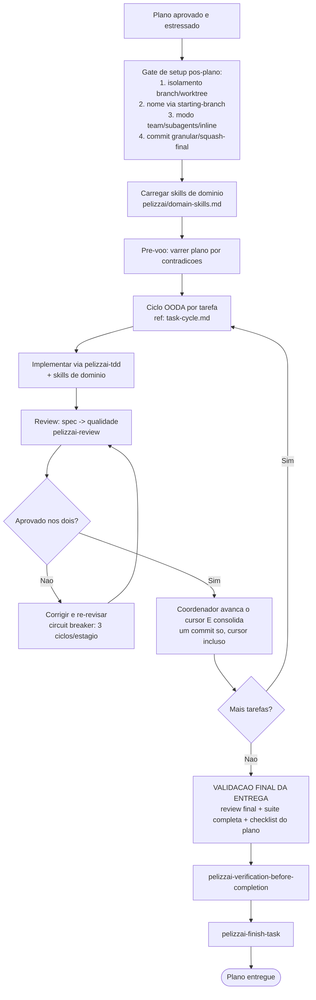

# PelizzAI Execution Plans

## Objetivo

Executar um plano de implementação aprovado com **disciplina por tarefa**: cada tarefa é implementada via TDD, revisada (spec + qualidade) e só então consolidada, em **loop** até o plano inteiro ser entregue com êxito — e a entrega é validada no final pelo **coordenador/líder** (review final + suíte completa + checklist do plano). A skill conduz o **gate de setup pós-plano** (como isolar, como executar, como commitar) e mantém um **estado retomável**.

**Anuncie ao iniciar:** "Usando a skill PelizzAI Execution Plans para executar o plano, tarefa por tarefa."

<MEMBRO-DO-TIME-STOP>
Se você é um **membro** (teammate/subagente) encarregado de **uma tarefa**, implemente apenas a sua: siga `pelizzai-tdd`, aplique as skills de domínio coladas no seu briefing (elas prevalecem sobre padrões genéricos), respeite a camada global (`pelizzai-preferences`) e devolva o resultado com um dos status (`DONE` / `DONE_WITH_CONCERNS` / `BLOCKED` / `NEEDS_CONTEXT`). Não orquestre o plano nem commite — a consolidação é do coordenador. Ver `references/task-cycle.md`.
</MEMBRO-DO-TIME-STOP>

---

## Princípio central

> Execute um plano aprovado com gates humanos nas **bordas** (setup pós-plano, destino, conclusão) e autonomia **entre as tarefas** (não pare para perguntar "sigo?" a cada tarefa). Nenhuma tarefa é consolidada sem TDD e review. Nenhuma entrega é declarada sem a validação final do coordenador. Nunca o modo "mãos-livres" que remove os gates de borda.

---

## Gate de setup pós-plano (OBRIGATÓRIO antes da Tarefa 1)

Com o plano salvo e estressado, conduza as **quatro perguntas, nesta ordem** (é aqui que elas acontecem — o router registrou `<pending>` nos tracks com plano). Cada resposta é registrada em `pelizzai/data/state.md`. Se algum campo já estiver decidido **para esta tarefa** (retomada real), honre — não re-pergunte. Os menus abaixo são os **canônicos** do harness: as demais skills (`pelizzai-router`, `pelizzai-starting-branch`, `pelizzai-writing-plans`) os referenciam em vez de duplicá-los.

**1. Isolamento — pergunte e aguarde:**

```text
Plano pronto. Como você prefere trabalhar nesta tarefa?

1. Branch — troca no lugar, no working tree atual (recomendado para a maioria)
2. Worktree — uma cópia isolada do projeto em outra pasta; vale a pena quando o plano tem
   partes independentes (ex.: backend e frontend) que podem ser construídas em paralelo

Qual opção?
```

Recomende com base no plano: frentes independentes paralelizáveis → sugira `worktree`; plano sequencial → sugira `branch`.

**2. Nome e criação — invoque `pelizzai-starting-branch`:** ela sugere o tipo conventional a partir do track (`feat/`, `fix/`, `refactor/`, …), propõe `<tipo>/<slug>`, confirma com o usuário e cria a branch ou o worktree (com baseline de testes no worktree).

**3. Modo de execução — pergunte e aguarde, SEMPRE com as três opções visíveis:**

```text
Como você quer que eu execute o plano?

1. team — um time de agentes coordenados, papéis/frentes em paralelo (pelizzai-team)
   [recomendado quando o plano tem múltiplas frentes ou pede revisão multi-perspectiva]
2. subagents — um subagente isolado por tarefa, que reporta de volta (pelizzai-subagents)
3. inline — eu mesmo, nesta sessão, tarefa a tarefa

Qual opção?
```

Ordem de preferência **team > subagents > inline**, proporcional ao plano (não monte um time para um plano trivial — mas a opção team SEMPRE aparece no menu).

**4. Estratégia de commit — pergunte e aguarde:**

```text
Como você quer os commits desta tarefa?

1. granular — um commit definitivo por tarefa concluída (histórico detalhado, mantido no fim)
2. squash-final — commits de trabalho (wip) durante a execução e UM commit único consolidado no fechamento

Qual opção?
```

A escolha é honrada até o fim: `granular` não ganha squash no fechamento; `squash-final` já autoriza a consolidação final.

---

## Pré-requisitos (gate)

Antes da primeira tarefa, confirme:

```text
[ ] Existe um plano aprovado (pelizzai-writing-plans, PRD ou issues). Sem plano → volte a pelizzai-writing-plans.
[ ] Existe o catálogo pelizzai/domain-skills.md. Se NÃO existe, o harness não foi inicializado:
    rode pelizzai-audit (bootstrap) e só então volte.
[ ] As skills de domínio relevantes foram selecionadas do catálogo, prontas para aplicar/colar —
    obrigatório nos três modos (ver abaixo).
[ ] O gate de setup pós-plano foi conduzido: isolation/execution-mode/commit-strategy registrados
    (nenhum <pending>) e o isolamento criado via pelizzai-starting-branch.
[ ] NÃO está em branch protegida (main/master/develop/dev, ou HEAD vazio — fail-closed).
[ ] O estado existe em pelizzai/data/state.md (se não, instancie a partir do template e preencha
    slug/track/phase/branch/isolation/execution-mode/commit-strategy/plan antes da Tarefa 1) e
    foi validado contra o git (branch: `git branch --show-current`; worktree: `git worktree list`
    ou o comando rodado DENTRO do worktree-path).
```

O diretório `pelizzai/` segue o **padrão único do harness** (ver `pelizzai-audit` → "Padrão de diretório `pelizzai/`"). O estado desta skill vive em **`pelizzai/data/state.md`**.

---

## Ler as skills de domínio (obrigatório nos três modos)

As skills de domínio capturam os padrões deste projeto. **Todo executor as aplica** — em time, com subagentes ou inline — e elas **prevalecem** sobre padrões genéricos e sobre as regras genéricas de `pelizzai-preferences`/`pelizzai-reasoning`.

```text
1. Leia o catálogo `pelizzai/domain-skills.md` e selecione as skills de domínio relevantes à tarefa.
2. Inline: carregue essas skills no seu contexto e aplique-as ao implementar.
3. Subagents/Team: o membro NÃO herda seu contexto — COLE as skills de domínio relevantes
   (ou seus pontos-chave) no briefing de cada tarefa, junto com o texto completo da tarefa.
```

Se o catálogo não existir, o projeto não foi inicializado: rode a `pelizzai-audit` (bootstrap) antes de executar.

---

## Os três modos de execução

Ordem de preferência: **team → subagents → inline**. Escolha proporcional ao plano (não monte um time para um plano trivial).

| Modo                 | Skill              | Quando                                                                       |
| -------------------- | ------------------ | ---------------------------------------------------------------------------- |
| **team** (preferido) | `pelizzai-team`    | Plano com **frentes paralelas** ou cross-layer (ex.: backend + frontend + testes), donos distintos que se beneficiam de coordenação/diálogo |
| **subagents**        | `pelizzai-subagents` | Tarefas independentes que só precisam **reportar**; um subagente fresco por tarefa, contexto isolado, review por tarefa |
| **inline** (último)  | —                  | Subagentes/time indisponíveis, ou plano **pequeno e muito sequencial**; o coordenador implementa tarefa a tarefa na própria sessão |

```text
Isolamento e paralelismo (condicionado à escolha do usuário no gate):
- isolation: branch → um working tree só. A execução que ESCREVE roda uma frente por vez e o
  COORDENADOR integra as contribuições EM SÉRIE. O paralelismo de team/subagents fica para o que
  NÃO escreve concorrentemente: investigação, leitura, review e decomposição.
- isolation: worktree → o worktree ÚNICO da tarefa permite escrita paralela quando as frentes
  tocam CAMINHOS DISJUNTOS (arquivos que não se sobrepõem). Não crie um worktree por agente —
  um por tarefa; frentes com paths disjuntos escrevem em paralelo dentro dele; review, commit e
  cursor continuam serializados pelo coordenador. Se aparecer conflito real, o par não era
  disjunto — replaneje em vez de forçar.
- Review com escrita paralela em curso (worktree): a working tree contém WIP de OUTRAS frentes.
  (a) escope o diff do review por tarefa aos paths da frente (git diff -- <paths-da-frente>);
  (b) instrua o revisor a IGNORAR mudanças fora desses paths (não são "extra" da tarefa em
  revisão — pertencem a outra frente); (c) para a evidência de teste, rode o subconjunto da
  frente ou aguarde/quiesça as escritas das demais frentes antes de rodar a suíte completa —
  um RED intencional de outra frente no exit code não pode reprovar esta tarefa.
```

**Desempate team × subagents:** team = múltiplas frentes em paralelo (via teammates ou subagentes internos do `pelizzai-team`); subagents = um subagente isolado por tarefa, em série. Havendo paralelismo de frentes, prefira **team** mesmo que os membros só reportem.

O modo escolhido é registrado em `pelizzai/data/state.md` (`execution-mode: team | subagents | inline`).

---

## Fluxo



O laço macro **desta skill** é um ciclo **OODA** (`pelizzai-loop`): **Observar** o estado real (testes, diffs, reviews) → **Orientar** contra o plano e a Definition of Done → **Decidir** a próxima ação (próxima tarefa, corrigir, escalar) → **Agir** — repetido até a DoD do plano.

---

## Pré-voo

Antes da Tarefa 1, leia o plano **uma vez** procurando contradições internas ou conflitos com as skills de domínio/critérios de review. Se houver, apresente tudo ao usuário em **uma** pergunta batched; se estiver limpo, siga em silêncio.

---

## Ciclo por tarefa

O protocolo detalhado — briefing por colagem, TDD, review em dois estágios, status, circuit breaker e commit como gate — está em **[references/task-cycle.md](references/task-cycle.md)**. Resumo:

```text
1. Briefing: COLE o texto completo da tarefa + as skills de domínio relevantes no prompt
   (o membro nunca lê o arquivo do plano). Instrua a camada global (pelizzai-preferences +
   pelizzai-reasoning) com a prioridade certa: skills de DOMÍNIO > preferences/reasoning.
   Responda perguntas ANTES de o trabalho começar.
2. Implementar via pelizzai-tdd (Iron Law: teste que falha primeiro). O membro NÃO commita.
3. Review em dois estágios, nesta ordem: (a) conformidade com a spec — o revisor NÃO confia no
   relatório do implementador, compara código vs requisitos linha a linha; (b) qualidade do código,
   com evidência de teste FRESCA (rodou e colou a saída + exit code — não inferida; o que não
   rodou = UNVERIFIED, nunca ✅). Use pelizzai-review.
4. Reprovou? Corrija (re-despachando ao implementador — não corrija à mão, polui o contexto) e
   RE-REVISE no mesmo estágio. Circuit breaker: 3 ciclos por estágio por tarefa; mesma issue 2x
   escala na 2ª; rejeição estrutural escala de imediato; ao estourar → registra phase: blocked
   e escala ao humano com mensagem acionável.
5. Aprovou nos dois? O COORDENADOR avança o cursor em pelizzai/data/state.md e consolida —
   nesta ordem, num commit só: atualiza o state.md, estagia tudo e commita (granular: commit
   definitivo; squash-final: wip). O cursor viaja DENTRO do commit da tarefa.
```

---

## Modo Team (preferido)

Use `pelizzai-team`. Cada **frente** do plano (conjunto coeso de tarefas, ex.: uma camada) vira um membro; o coordenador (lead) delega por briefing autossuficiente (com as skills de domínio coladas e a camada global instruída), monitora e sintetiza. Escrita paralela: só com `isolation: worktree` e caminhos disjuntos por frente (ver "Isolamento e paralelismo" acima); em `branch`, o coordenador integra as escritas **em série**, reservando o paralelismo para investigação, review e decomposição. O ciclo por tarefa acima vale dentro de cada frente.

## Modo Subagents

Use `pelizzai-subagents`. Um subagente **fresco por tarefa**, despachado pelo coordenador, com contexto isolado. O coordenador roteia, revisa (dois estágios) e consolida. Execução contínua entre tarefas; sem pausa por tarefa.

## Modo Inline (último recurso)

Sem subagentes/time, ou plano pequeno e sequencial: o coordenador implementa tarefa a tarefa na própria sessão, seguindo o mesmo ciclo (TDD → review → consolidar → avançar cursor). É o **fallback** — prefira team ou subagents quando disponíveis.

---

## Higiene de contexto

A regra geral (zona segura, fases, "handoff bifurca; compact continua") mora na `pelizzai-core`. Na execução de planos, aplique-a assim:

```text
- Zona segura: ~120k tokens. Acima disso a qualidade degrada — planeje as fronteiras de fase
  ANTES de chegar lá, não quando a janela já está cheia.
- Design → plano nascem numa janela ininterrupta; cada tarefa executa em contexto fresco
  (briefing colado — é o que os modos team/subagents já garantem).
- NUNCA compacte no meio de uma fase ou tarefa: feche a fase (review ✅ + cursor + commit)
  e compacte na borda.
- Handoff bifurca; compact continua: para mudar de rumo ou abrir outra frente, despache com
  briefing novo; para continuar o MESMO trabalho com a janela cheia, compacte na borda de fase.
```

---

## Estado e retomada — `pelizzai/data/state.md`

O cursor da tarefa ativa vive em `pelizzai/data/state.md` (template: [templates/state.md](templates/state.md)). Campos: identidade da tarefa (`slug`, `track`, `phase`), `branch`, `isolation`, `worktree-path`, `execution-mode`, `commit-strategy`, `audience`, `plan` (caminho do plano em execução), `project` (projeto-alvo, em workspace), progresso (`delivered`/`next`/`pending`) e o `## Histórico`. Se o arquivo não existir, instancie-o a partir do template antes da Tarefa 1.

```text
- Sentinela: slug: <none> ou phase: done → não há tarefa ativa (começa do zero; os gates
  perguntam de novo — tarefa nova NUNCA herda isolation/execution-mode/commit-strategy).
- Avance o cursor a cada tarefa concluída; em granular o toque do cursor entra no MESMO
  commit da tarefa; em squash-final, entra no commit wip da tarefa — DURANTE a execução,
  nunca um commit órfão só do cursor (exceções: o registro de phase: blocked do circuit
  breaker — ver references/task-cycle.md §5 — e o commit de fechamento do cursor da
  pelizzai-finish-task no modo granular).
- Retomada após compaction: confie no state.md e no git log, NÃO na sua memória (a falha mais
  cara desse cenário é re-despachar tarefas já concluídas) — e VALIDE contra a realidade: com
  isolation: branch, a branch registrada bate com `git branch --show-current`? Com
  isolation: worktree, valide pela saída de `git worktree list` (caminho + branch) ou rode
  o comando DENTRO do worktree-path (no working tree principal ele devolve outra branch —
  divergência falso-positiva)?
  Releia o arquivo apontado em `plan:` para reconstruir o texto das tarefas pendentes (o membro
  nunca lê o plano; quem cola é o coordenador). Em divergência que arrisque o trabalho, NÃO confie
  cego: reporte e recupere o estado com o usuário antes de prosseguir.
- Em workspace, a branch e os comandos de teste/lint/build são POR-PROJETO; use o campo `project:`.
```

---

## Loop até a entrega (OODA)

O laço macro — implementar → testar → revisar → corrigir, repetido até a **Definition of Done** do plano (todas as tarefas concluídas, testes verdes com evidência, validação final aprovada) — é conduzido por **esta skill** como um ciclo **OODA** (ver `pelizzai-loop`): Observar a evidência fresca de cada ciclo, Orientar contra o plano/DoD, Decidir a próxima ação, Agir. De `pelizzai-loop` importe: (a) a noção de **Definition of Done** do plano, (b) a lente OODA do laço e (c) a regra — em dúvida material durante o loop, **pare** e use `pelizzai-interview-me`; só retome quando resolvida.

---

## Gates humanos (bordas) e autonomia entre tarefas

```text
GATES (exigem confirmação do usuário):
- Começar em branch protegida (main/master/develop/dev) — proibido, sem exceção.
- Gate de setup pós-plano: isolamento (branch/worktree), nome da branch/worktree,
  modo de execução (team/subagents/inline) e estratégia de commit (granular/squash-final).
- Destino: push direto / push + PR / manter local / descartar (pelizzai-finish-task).
- Conclusão.

AUTONOMIA (sem perguntar a cada passo):
- Entre as tarefas de um plano JÁ APROVADO, execute de forma contínua (não pergunte "sigo?").
- Pare apenas por: BLOCKED que você não resolve, ambiguidade material, ou plano concluído.

NUNCA o modo "mãos-livres" que remove os gates de borda (reprovado em campo no harness anterior).
```

---

## Validação final da entrega (coordenador/líder)

Ao terminar todas as tarefas, o **coordenador/líder valida a entrega inteira** — independente de qualquer alegação anterior dos membros. Nesta ordem:

```text
1. REVIEW FINAL da branch inteira (range <BASE>..<HEAD>, não só por tarefa) via pelizzai-review,
   com o modelo mais capaz disponível e effort máximo. Critical/Important abertos bloqueiam:
   re-despache o fix (a um implementador novo com briefing do achado; em inline, corrija) e
   RE-REVISE — com o MESMO circuit breaker do task-cycle §5 aplicado ao review final
   (3 ciclos → phase: blocked e escalar ao humano; nunca loop infinito de fix→re-review).
2. SUÍTE COMPLETA rodada pelo próprio coordenador: testes + lint + build do projeto, do zero,
   com saída e exit code colados — não reaproveite runs por tarefa nem confie em relatório
   de membro ("subagente disse que passou" não é evidência; o diff do git e a suíte são).
3. CHECKLIST DO PLANO, requisito a requisito: releia o plano/spec e aponte, para cada requisito,
   onde ele foi entregue. Requisito sem tarefa entregue = lacuna → volte ao ciclo (não é "done").
   Conformidade com a spec é BINÁRIA — "quase tudo" não é entregue.
4. pelizzai-verification-before-completion — o gate de evidência fresca antes de qualquer
   alegação de conclusão.
5. pelizzai-finish-task — fechar o cursor (phase: done), consolidar honrando a commit-strategy
   (sem re-perguntar squash), perguntar destino (push/PR/local/descartar) e, se worktree,
   oferecer a remoção.
```

---

## Raciocínio — `pelizzai-reasoning`

- Laço macro e replanejamento: *OODA* (a lente do loop) com *Plan and Execute* (ordenar tarefas e checkpoints).
- Tarefa que falha de forma inesperada: *Root Cause Analysis* (e a `pelizzai-tdd`/diagnóstico).
- Antes de consolidar: *Verification* — o comportamento existe de fato, com evidência.

---

## Anti-padrões

```text
- Executar sem plano aprovado, sem o gate de setup pós-plano, ou sem isolamento (em branch protegida).
- Pular a leitura das skills de domínio — ou não colá-las no briefing dos membros.
- Omitir a opção team do menu de modo de execução (as TRÊS opções sempre aparecem).
- Deixar o membro/subagente commitar (o commit é gate do coordenador, após os dois reviews).
- Aceitar "testes passam" inferido, sem evidência fresca colada.
- Corrigir à mão o trabalho reprovado de um membro (re-despache — corrigir à mão polui o contexto).
- Pular a re-revisão após um fix ("corrigi" é só mais uma alegação não verificada).
- Loop infinito de fix→re-review (ignorar o circuit breaker de 3 ciclos).
- Declarar o plano entregue sem a validação final do coordenador (review final + suíte + checklist).
- Pausar a cada tarefa de um plano já aprovado (quebra a execução contínua) — ou, no extremo oposto,
  remover os gates de borda (mãos-livres).
- Fazer o subagente ler o arquivo do plano inteiro (cole o texto da tarefa).
- Commit órfão só para mover o cursor DURANTE a execução (exceções legítimas: o registro de
  phase: blocked do circuit breaker e o commit de fechamento do cursor da pelizzai-finish-task
  no modo granular).
- Confiar no state.md sem validar contra o git ao retomar.
- Um worktree por agente (é um por tarefa, com paths disjuntos por frente).
```

---

## Integração

**Combina com:**

- `pelizzai-writing-plans` — produz o plano que esta skill executa (o gate de setup roda AQUI, não lá).
- `pelizzai-starting-branch` — cria o isolamento (branch ou worktree) dentro do gate de setup.
- `pelizzai-tdd` — disciplina por tarefa (test-first).
- `pelizzai-team` / `pelizzai-subagents` — os dois modos paralelos; inline é o fallback.
- `pelizzai-review` — review por tarefa (spec + qualidade) e review final da branch.
- `pelizzai-loop` — a lente OODA do laço macro, a Definition of Done e a parada por dúvida.
- `pelizzai-reasoning` — ordenação, diagnóstico e verificação.
- `pelizzai-verification-before-completion` / `pelizzai-finish-task` — conclusão com gates.
- `pelizzai-audit` — padrão de diretório `pelizzai/` e catálogo de skills de domínio.

**Todas as skills irmãs da cadeia estão materializadas** — invoque-as diretamente conforme os encadeamentos acima (`pelizzai-starting-branch`, `pelizzai-tdd`, `pelizzai-review`, `pelizzai-verification-before-completion`, `pelizzai-finish-task`, `pelizzai-subagents`, `pelizzai-team`). Não há mais fallback inline.

---

## Instrução final para o agente

```text
Execute o plano aprovado, tarefa por tarefa, sempre via TDD e review, em loop OODA até a entrega.

Conduza o gate de setup pós-plano (isolamento → nome → modo → commit) antes da Tarefa 1 —
as quatro perguntas ao usuário, com a opção team sempre visível.
Prefira team → subagents → inline, de forma proporcional ao plano.
Leia e aplique as skills de domínio nos três modos (cole-as no briefing dos membros;
elas prevalecem sobre preferences/reasoning genéricas).
Mantenha gates humanos nas bordas; execute com autonomia entre tarefas.
Consolide só após spec ✅ e qualidade ✅ com evidência fresca.
Feche com a VALIDAÇÃO FINAL do coordenador: review final + suíte completa + checklist do plano.
Estado em pelizzai/data/state.md; valide contra o git ao retomar.
Nunca comece em branch protegida. Nunca mãos-livres.
```
