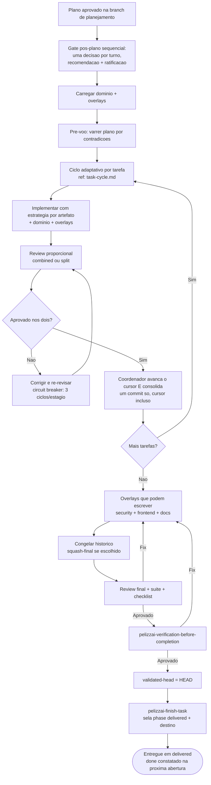

# PelizzAI Execution Plans

## Objetivo

Executar um plano aprovado com **disciplina por tarefa**: cada tarefa recebe a estratégia de
teste/validação adequada ao artefato, passa pelas lentes de spec + qualidade no perfil de review
proporcional e só então é
consolidada. No final, overlays que podem escrever rodam antes de o conteúdo ser selado por
review, suíte e checklist. A skill mantém estado retomável e impede integrar conteúdo diferente
do que foi validado.

**Anuncie ao iniciar:** "Usando a skill PelizzAI Execution Plans para executar o plano, tarefa por tarefa."

<MEMBRO-DO-TIME-STOP>
Se você é um **membro** (teammate/subagente) encarregado de **uma tarefa**, implemente apenas a
sua: siga a estratégia de teste declarada, as skills de domínio e as skills transversais/overlays
coladas no briefing; respeite `pelizzai-preferences` e devolva `DONE`, `DONE_WITH_CONCERNS`,
`BLOCKED` ou `NEEDS_CONTEXT`. Não orquestre nem commite. Ver `references/task-cycle.md`.
</MEMBRO-DO-TIME-STOP>

---

## Princípio central

> Execute somente o plano aprovado. Entre gates, tome decisões mecânicas cobertas pela spec/plano;
> qualquer decisão emergente de requisito, escopo, UX, arquitetura, dados, segurança, custo ou
> aceite pausa a execução e volta ao usuário. Nenhuma tarefa é consolidada sem evidência e review.

---

## Gate de setup pós-plano sequencial (OBRIGATÓRIO antes da Tarefa 1)

O normal é a branch de tarefa/planejamento já existir: `pelizzai-starting-branch` a criou **antes**
da spec/plano e gravou `base-ref`/`base-sha`. Se um plano externo (PRD/issues) chegou sem branch,
invoque-a agora antes de continuar.

Com o plano aprovado e **antes de qualquer escrita de produto**, o gate abre reapresentando as
decisões técnicas do plano (item 0) e então ratifica as decisões de setup
**uma por vez**. Em cada turno, apresente opções reais, destaque a recomendada com uma linha de
porquê, faça uma única pergunta e aguarde. Leia primeiro `pelizzai/profile.md`
(§Defaults de execução ratificados): campo preenchido = a recomendação já vem da política do
projeto; `<unset>` = calcule o default proporcional. `destination` **nunca** sai do profile —
push/PR/publicação são decididos por tarefa na `pelizzai-finish-task`.

```text
0. Decisões técnicas do plano (ponte do QUÊ aprovado para o COMO)
   As já ratificadas (spec/design/entrevista) aparecem como recap de uma linha — não se re-pergunta
   o que o usuário já decidiu. A origem citada deve ser localizável no artefato — faça a leitura
   rápida para confirmar; origem não-corroborável (ausente da spec/design, ou "entrevista do plano"
   sem registro nesta sessão) é tratada como ABERTA, não como recap. Se o plano marcou "nenhuma
   decisão técnica material", diga isso.
   Rede de segurança: qualquer decisão da lista SEM origem de ratificação registrada não passa como
   item para carimbar — apresente-a aqui como pergunta com 2–3 opções e a recomendada (porquê em uma
   linha) e aguarde a escolha antes de seguir.
   Âncora: decisão técnica sem ratificação não passa pelo gate — vira pergunta com opções e
   recomendação, nunca item de lista para carimbar.

1. Isolamento (somente depois de 0)
   Recomendado: <branch|worktree> — <porquê>.
   Alternativa: <...>.
   Pergunta: qual isolamento você escolhe?

2. Modo (somente depois de 1)
   Opções sempre visíveis: inline · subagents · team.
   Recomendado: <modo> — <porquê>.
   Pergunta: qual modo você escolhe?

3. Commits (somente depois de 2)
   Opções: granular · squash-final.
   Recomendado: granular — preserva checkpoints; squash-final só com seu pedido.
   Pergunta: qual estratégia você escolhe?

4. Review (somente depois de 3)
   Recomendado: <combined|split> — <porquê conforme risco/superfície>.
   Pergunta: confirma este perfil?
```

Regras: o modo mantém **as três opções sempre visíveis** — **team nunca é omitido**. Não existe
ranking universal. **Squash-final somente com pedido explícito do usuário**. O conteúdo do plano
(o QUÊ) já foi aprovado na borda anterior; este gate ratifica o COMO sem esconder várias decisões
num único “ok”. Silêncio e recomendação não valem como resposta. Não escreva código, mova worktree,
faça squash ou grave decisões finais até concluir os passos 0–4. Base e nome da branch já foram
ratificados antes da spec/plano pela `pelizzai-starting-branch`.

Sob briefing fechado (SUBAGENT-STOP / MEMBRO-DO-TIME-STOP), não produza análises de rota nem abra
gates: aplique o briefing e escale ao coordenador o que exigir decisão.

**Política já ratificada.** Valores do `profile.md` pré-selecionam a recomendação de cada passo,
mas não auto-confirmam a tarefa atual. Faça as perguntas sequenciais normalmente; o usuário pode
responder “usar a política para os itens restantes” e delegar explicitamente essa aplicação.

Se os sinais divergirem da política, explique a divergência na recomendação. Override não altera o
profile; trocar a política pede confirmação separada antes de gravar. Em source mode, use o
execution record nativo como memória da tarefa, nunca como autorização herdada.

**Aplicar o isolamento — invoque `pelizzai-starting-branch` (PÓS-ratificação).** Só depois das quatro respostas:
branch faz checkpoint do setup persistente quando existir e mantém a branch atual; worktree captura
`checkpoint-sha` após o checkpoint opcional, libera a branch no working tree principal, adiciona o
worktree com a **branch existente** e registra o novo path antes da Tarefa 1. Ambos começam a
implementação com working tree limpa. Worktree não autoriza vários writers concorrentes no mesmo
diretório. Qualquer `squash-final` ocorre **antes** de review final/testes/`validated-head`;
`pelizzai-finish-task` nunca reescreve conteúdo ou histórico após o seal.

**Registrar (só após concluir o gate).** Grave isolation/execution-mode/commit-strategy e o marcador
`kickoff: ratificado <AAAA-MM-DD>` no state consumidor (`pelizzai/data/state.md`) ou, em source mode,
no execution record nativo com as mesmas palavras-chave. Em retomada real com valores já ratificados
e gravados (`kickoff: ratificado`), honre sem re-perguntar. Escritas/review/commit na working tree
são serializados.

---

## Pré-requisitos (gate)

Antes da primeira tarefa, confirme:

```text
[ ] Plano ratificado na borda: plano gerado pelo harness recebeu aprovação explícita do CONTEÚDO;
    PRD/issues fornecidos pelo próprio usuário já contam como
    ratificados. Sem plano → volte a pelizzai-writing-plans.
[ ] Greenfield: discovery, spec-approval, domain-skills-decision e plan-approval estão ratificados
    ou possuem dispensa explícita registrada; nenhum campo permanece <pending>.
[ ] Consumidor: catálogo existe (zero domain skills é válido) e state foi preparado.
    Source mode: NÃO crie catálogo/state consumidor; use as regras do repo-fonte e execution record.
[ ] As skills de domínio relevantes foram selecionadas quando o consumidor as possui.
[ ] `overlays` foi inferido pelo efeito/superfície e as skills transversais estão prontas para
    aplicar/colar nos briefings de executores e reviewers.
[ ] O gate de setup pós-plano foi conduzido: as decisões técnicas do plano foram reapresentadas e
    ratificadas (item 0) e isolation/execution-mode/commit-strategy RATIFICADOS
    pelo usuário em perguntas sequenciais (nenhum default aplicado sem ratificação; nenhum <pending>;
    `kickoff: ratificado`) e o isolamento criado via pelizzai-starting-branch APÓS o "ok".
[ ] NÃO está em branch protegida (default real/base-ref, main/master/develop/dev, ou HEAD vazio).
[ ] Em consumidor, o estado existe em pelizzai/data/state.md (se não, instancie a partir do template e preencha
    slug/track/lane/phase/project/branch/base-ref/base-sha/kickoff/isolation/execution-mode/
    commit-strategy/overlays/discovery/spec/spec-approval/domain-skills-decision/plan/plan-approval
    antes da Tarefa 1; `validated-head: <none>`, `kickoff: pendente`
    até a ratificação) e
    foi validado contra o git (branch: `git branch --show-current`; worktree: `git worktree list`
    ou o comando rodado DENTRO do worktree-path).
```

No consumidor, o diretório `pelizzai/` segue o padrão do harness e o estado vive em
`pelizzai/data/state.md`. Em source mode, o estado vive somente no execution record nativo.

---

## Construir o pacote de skills (obrigatório nos três modos)

Skills de domínio capturam padrões do projeto; skills transversais/overlays capturam uma superfície
da mudança. **Todo executor e reviewer recebe as aplicáveis** — o briefing de CADA tarefa (inline,
subagents ou team) inclui o pacote de domain skills aplicável do catálogo, não só os overlays.
Recalcule overlays pelo diff real: UI inclui
`pelizzai-frontend`; superfície sensível inclui `pelizzai-oswap`; nova superfície estável pode
incluir `pelizzai-documenting-features`. Persistir nomes em `overlays:` não substitui colar seus
gates no briefing.

```text
1. Consumidor: leia `pelizzai/domain-skills.md`; source mode: use regras/skills do repo-fonte.
2. Leia `overlays:` no state/execution record e complemente pelo efeito/superfície observada.
3. Inline: carregue domínio + overlays. Subagents/Team: COLE seus pontos operacionais no briefing.
4. Propague o mesmo pacote ao reviewer; ele precisa julgar requisitos de UI/segurança/docs também.
5. Prioridade: pedido explícito e regras do projeto > skills de domínio > overlays aplicáveis >
   preferences/reasoning genéricos. Conflito material sobe ao coordenador.
6. Se a superfície de uma tarefa toca uma stack SEM domain skill cobrindo (catálogo existe mas não
   cobre), registre UMA "lacuna de domain skill" no state/execution record e sinalize-a no relatório
   da tarefa (membro devolve `DONE_WITH_CONCERNS`); NÃO bloqueie a execução nem crie skill no meio
   da tarefa. O coordenador acumula as lacunas e encaminha ao eixo adoption-driven de
   `pelizzai-writing-skills` no fechamento, numa proposta única e agrupada — nunca um gate por tarefa.
```

No consumidor, catálogo ausente volta a `pelizzai-audit`. Em source mode, ausência é o contrato — o
gate de proposta de domain skills não roda; regras de domínio, se houver, vivem no execution record
nativo. Quando o plano chegou por PRD/issues (sem passar por `pelizzai-writing-plans`/
`pelizzai-brainstorming`) e a stack não está coberta pelo catálogo do consumidor, o gate de setup
pós-plano puxa a proposta proativa de domain skills (recomendar-e-ratificar; dona: `pelizzai-router`/
`pelizzai-writing-plans`/`pelizzai-audit`) antes da Tarefa 1 — esta skill não a re-especifica,
só garante que esse caminho não a pule.

---

## Os três modos de execução

Não há ranking universal; use a menor coordenação que preserve qualidade.

| Modo                 | Skill              | Quando                                                                       |
| -------------------- | ------------------ | ---------------------------------------------------------------------------- |
| **team**             | `pelizzai-team`    | Frentes com dependências que exigem coordenação e troca durante a execução |
| **subagents**        | `pelizzai-subagents` | Tarefas independentes que só precisam **reportar**; um subagente fresco por tarefa, contexto isolado, review por tarefa |
| **inline**           | —                  | Plano pequeno/sequencial em que delegar custaria mais que executar |

```text
Branch e worktree desta tarefa têm UMA working tree de integração. Apenas o coordenador aplica
escritas nela, em série. Agentes podem investigar/revisar em paralelo ou devolver patches; não
mantêm WIP concorrente no diretório compartilhado. Antes do review por tarefa, quiesça writers e
gere `review-package --working-tree`, que deve representar somente a tarefa em revisão.
```

**Desempate:** team quando membros precisam conversar/negociar dependências; subagents quando cada
unidade só precisa reportar; inline quando o trabalho é curto e serial. Paralelismo, sozinho, não
obriga team.

Registre o modo no `state.md` consumidor ou execution record nativo
(`execution-mode: team | subagents | inline`).

---

## Fluxo



OODA é útil como **controle macro** quando há feedback e estado mutável: observar evidência,
orientar contra a DoD, decidir e agir. Não é o reasoning obrigatório de toda tarefa. O briefing
seleciona a técnica que ataca o problema (decomposição, RCA, hipótese, comparação, verification);
OODA apenas coordena iterações quando existe um loop real.

---

## Pré-voo

Antes da Tarefa 1, leia o plano procurando contradições internas ou conflitos com skills de
domínio/review. Se houver fatos técnicos investigáveis, investigue. Se houver decisão humana,
apresente a de maior impacto com recomendação e faça uma pergunta por vez. Se estiver limpo, siga.

---

## Ciclo por tarefa

O protocolo detalhado — briefing autossuficiente, estratégia por artefato, review proporcional
com duas lentes, circuit breaker e commit como gate — está em
**[references/task-cycle.md](references/task-cycle.md)**. Resumo:

```text
1. Briefing: COLE o texto completo + skills de domínio + overlays + estratégia de evidência e
   perfil de review (`combined` ou `split`)
   (o membro nunca lê o arquivo inteiro do plano; use scripts/task-brief.* somente quando houver
   plano Markdown persistente compatível. Plano nativo usa colagem/brief construído — ver §1,
   incluindo
   `review-package --working-tree`; range é só final). Instrua preferences/reasoning com a
   prioridade certa: regras do projeto > domínio > overlays > camada genérica.
   Responda perguntas ANTES de o trabalho começar.
2. Aplicar TDD, characterization, validate, visual ou static/scenario conforme o artefato. O
   membro NÃO commita.
   Se surgir decisão não coberta pela spec/plano, devolva `NEEDS_CONTEXT`; o coordenador pausa e
   pergunta ao usuário. Não escolha requisito, UX, arquitetura, dados, segurança ou aceite.
3. Review com duas lentes: (a) conformidade com a spec; (b) qualidade + evidência FRESCA.
   `combined` aplica ambas em um despacho/relatório para tarefa bounded/low-risk; `split` usa
   estágios sequenciais quando risco, contrato, dados, segurança ou complexidade pedirem.
4. Reprovou? Corrija (re-despachando ao implementador — não corrija à mão, polui o contexto) e
   RE-REVISE na mesma lente. Circuit breaker: 3 ciclos por lente por tarefa; mesma issue 2x
   escala na 2ª; rejeição estrutural escala de imediato; ao estourar → registra phase: blocked
   e escala ao humano com mensagem acionável.
5. As duas lentes aprovaram? O COORDENADOR consolida: estagia paths EXATOS da tarefa e, no
   consumidor, atualiza/estagia state no mesmo commit; em source mode avança o execution record
   sem arquivo. Inspeciona `git diff --cached` e commita (granular: definitivo; squash-final: wip).
   Nunca use `git add -A`.
```

---

## Modo Team

Use `pelizzai-team` quando frentes precisam coordenar dependências. O lead delega briefings com
domínio + overlays e sintetiza. Investigação pode ser paralela; aplicação na working tree, review,
cursor e commit são serializados pelo coordenador.

## Modo Subagents

Use `pelizzai-subagents`. Um subagente **fresco por tarefa**, despachado pelo coordenador, com contexto isolado. O coordenador roteia, aplica o perfil de review e consolida. Execução contínua entre tarefas; sem pausa por tarefa.

## Modo Inline

Para plano pequeno e sequencial, o coordenador executa na própria sessão seguindo o mesmo ciclo.
Inline é uma escolha adequada, não um fallback inferior.

Em qualquer modo, “seguir até o fim” autoriza executar o plano ratificado; não autoriza completar
lacunas de produto. Decisão emergente interrompe o loop, registra `phase: blocked`/pendência e volta
ao usuário com uma pergunta e a melhor recomendação.

---

## Higiene de contexto

A regra geral (zona segura, fases, "handoff bifurca; compact continua") mora na `pelizzai-core`. Na execução de planos, aplique-a assim:

```text
- Zona segura: ~120k tokens. Acima disso a qualidade degrada — planeje as fronteiras de fase
  ANTES de chegar lá, não quando a janela já está cheia.
- Design → plano nascem numa janela ininterrupta; cada tarefa executa em contexto fresco
  (briefing colado — é o que os modos team/subagents já garantem).
- NUNCA compacte no meio de uma fase ou tarefa: feche a fase (review ✅ + cursor + commit)
  e compacte na borda.
- Handoff bifurca; compact continua: para mudar de rumo ou abrir outra frente, despache com
  briefing novo; para continuar o MESMO trabalho com a janela cheia, compacte na borda de fase.
```

---

## Estado e retomada

Invariantes comuns:

```text
- `phase: done`/slug vazio significa nenhuma tarefa ativa; tarefa nova não herda decisões de state
  da anterior (carryover acidental). A política de projeto ratificada em `pelizzai/profile.md` não é
  herança: pré-seleciona a recomendação do recap, re-exibido e ratificável a cada nova tarefa.
- `phase: delivered` = entrega selada + destino executado, aguardando constatação de `done` (ver
  Reconciliação da entrega anterior). A finish-task encerra em `delivered`, nunca em `done`.
- `base-ref`/`base-sha` são o snapshot inicial e nunca são recalculados no fim.
- mudança de conteúdo invalida `validated-head`; ele só nasce após a validação final.
- `project` é exatamente um repo; outro repo recebe outro registro de execução.
- branch/worktree, HEAD e progresso do registro precisam concordar com Git.
```

**Consumidor:** o cursor vive em `pelizzai/data/state.md` (template em
[templates/state.md](templates/state.md)). Avance-o no mesmo commit da tarefa; os únicos commits
só de cursor são `phase: blocked` e o closure final. Após compaction, reconstrua pelo state, arquivo
`plan:` e Git.

**Source mode:** o cursor vive no plano/execution record nativo. Avance-o após cada commit, leia o
plano nativo para tarefas pendentes e reconstrua pelo record + Git; não procure/crie state, arquivo
de plano consumidor nem commit de cursor. State ausente é o contrato, não uma divergência.

**Higiene do progresso (consumidor).** Registre **uma linha por tarefa** do plano em `## Progresso`
(`T<n> ✅ <sha|data> — nota curta se houver`); relatórios longos (QA, review, investigação, decisões
de rodada) vão para `pelizzai/data/reports/<AAAA-MM-DD>-<slug>-<tema>.md` (ignorado) com o link no
state, nunca colados no corpo do cursor. Quando `state.md` passar de ~150 linhas, proponha compactar
uma vez (advisory, mesmo modelo da cadência; nunca bloqueia). Fora a migração de bloco íntegro para
`history/` (sem perda), qualquer condensação de conteúdo é propor-confirmar.

**Reconciliação da entrega anterior (`delivered` → `done`).** Ao abrir a próxima tarefa (aqui) ou ao
retomar (`pelizzai-recovery`/session-start), se o state trouxer `phase: delivered`, constate a
entrega ANTES de sobrescrever o cursor:

```text
- Leia `confirmar:` e verifique-a contra o git (read-only): a `base-ref` já contém `validated-head`?
  O PR foi mergeado/fechado? A branch foi integrada? (Entrega local: o usuário aceita?)
- Constatada → grave `phase: done` + data + evidência de 1 linha e migre o bloco íntegro da tarefa
  para `pelizzai/data/history/<AAAA-MM-DD>-<slug>.md` (VERSIONADO), deixando no state só a linha de
  índice `- <data> <slug> — done — <resultado ≤10 palavras> → data/history/<arquivo>`. A migração de
  bloco íntegro é sem perda → automática; CONDENSAR conteúdo é destrutivo → só propor-confirmar.
- Falhou (PR fechado sem merge, branch descartada) → NÃO grave `done`. Informe e proponha retomar a
  branch da entrega ou arquivá-la como `abandoned` — a decisão é do usuário. Arquivar como `abandoned`
  usa a MESMA migração sem perda: o bloco íntegro vai para `data/history/<AAAA-MM-DD>-<slug>.md` e no
  state fica a linha de índice `- <data> <slug> — abandoned — <motivo ≤10 palavras> → data/history/<arquivo>`.
```

O **bloco íntegro** (fronteira da migração, idêntica para `done` e `abandoned`) = todos os campos de
`## Tarefa ativa` desta tarefa + suas linhas `T<n>`/`next`/`pending` de `## Progresso`, com os links
de `data/reports/` copiados verbatim. Ordem das operações (sem perda → verificável): (1) copie o bloco
íntegro para `data/history/<AAAA-MM-DD>-<slug>.md` — cópia fiel, nada reescrito; (2) substitua os
campos de `## Tarefa ativa` pelos placeholders da tarefa nova; (3) remova as linhas
`T<n>`/`next`/`pending` da tarefa migrada em `## Progresso`; (4) insira a linha de índice em
`## Histórico`. A migração só está completa após (1)–(4); condensar qualquer conteúdo do bloco (em vez
de copiá-lo fielmente) é destrutivo e sai da regra automática → só propor-confirmar.

Escrita de metadata em `pelizzai/` é permitida em qualquer branch; o commit continua exigindo branch
de tarefa. Por isso a reconciliação **lê** na branch atual (mesmo protegida) e **escreve** a metadata
reconciliada, mas ela só é **commitada no primeiro commit da task branch NOVA** — nunca um commit em
branch protegida. Source mode: a mesma constatação vale no execution record nativo, sem criar
`pelizzai/` nem `history/` runtime.

Em ambos os modos, valide branch com `git branch --show-current` e worktree por
`git worktree list`/comando dentro do path registrado. Divergência material chama
`pelizzai-recovery` no modo correspondente; ela preserva WIP antes de reconciliar.

---

## Loop até a entrega (controle adaptativo)

O loop usa evidência e Definition of Done. OODA pode coordenar o macro-loop, mas o reasoning local
é selecionado pela situação. Em dúvida material, pare e use `pelizzai-interview-me`; não transforme
incerteza em mais uma volta automática.

---

## Gates humanos e execução controlada

```text
GATES (recomendar-e-ratificar; nunca aplicar decisão estrutural em silêncio):
- Começar em branch protegida (main/master/develop/dev) — proibido, sem exceção.
- Plano: conteúdo e stress são aprovados antes do setup.
- Setup pós-plano: isolamento, modo de execução com **as três opções
  sempre visíveis** (**team nunca é omitido**), estratégia de commit (**squash-final somente com
  pedido explícito do usuário**) e review são perguntados UM POR TURNO, sempre com recomendação,
  e ratificados antes da Tarefa 1. Base e nome da branch já foram ratificados antes do planejamento.
- Destino externo: push / PR / descarte e remoção de worktree exigem decisão POR TAREFA; sem pedido
  externo, finish-task mantém local por default. `destination` nunca é herdado de política do profile.
- Conclusão.

EXECUÇÃO CONTROLADA:
- Entre tarefas de plano aprovado, execute continuamente apenas passos mecânicos cobertos pelo
  contrato ratificado; não peça permissão para cada comando local reversível.
- Pare diante de qualquer escolha nova de requisito, escopo, UX, arquitetura, dados, segurança,
  custo, risco aceito ou critério de aceite. Faça uma pergunta com recomendação e aguarde.
- Pare também por BLOCKED real, evidência que invalida o plano ou plano concluído.

Sob briefing fechado (SUBAGENT-STOP / MEMBRO-DO-TIME-STOP), não abra gates nem recaps de política:
aplique o briefing e escale ao coordenador o que exigir decisão.

NUNCA o modo "mãos-livres" que remove os gates de borda (reprovado em campo no harness anterior).
```

---

## Validação final da entrega (coordenador/líder)

Ao terminar as tarefas, o coordenador valida a entrega inteira. A ordem é um contrato:

### 1. Rodar overlays que podem escrever

Reavalie `base-sha..HEAD` e execute, quando aplicável, **antes** do review final:

```text
- pelizzai-oswap: auth, input, SQL/query, segredo, upload, dependência, autorização etc.;
- pelizzai-frontend: requisitos anti-slop durante a implementação + app rodando, estados e
  viewports na validação visual;
- pelizzai-documenting-features: documentação exigida para nova superfície estável.
```

Overlay aplicável não é oferta tardia da finish-task. Correção ou doc gerada vira conteúdo da
entrega, recebe a evidência proporcional e é commitada antes de seguir.

### 2. Congelar a estratégia de commits

- `granular`: confirme working tree limpa e mantenha os commits definitivos.
- `squash-final`: consolide **agora**, nunca na finish-task. Prefira a alternativa recuperável a
  `reset --soft`: renomeie a branch atual para um nome único `<branch>-preseal-<timestamp>`, crie
  novamente `<branch>` em `base-sha`, aplique `git merge --squash <preseal>` e faça o commit final
  aprovado. A branch preseal preserva o histórico; não a delete automaticamente. Pare se a branch
  já estiver publicada ou se qualquer guarda falhar.

Depois desta etapa, `git status --porcelain` deve estar vazio e `validated-head` continua `<none>`.

### 3. Validar o candidato congelado

```text
1. Capture candidate-head = `git rev-parse HEAD`.
2. REVIEW FINAL via pelizzai-review no range exato `base-sha..candidate-head`. Use reviewer
   independente e capacidade proporcional ao risco. Exceção: uma única tarefa `bounded`, perfil
   `combined`, sem mutação posterior pode reutilizar o review da tarefa se
   `reviewed-tree == candidate-head^{tree}`; qualquer ausência de prova exige review normal.
   Critical/Important bloqueiam.
3. Rode pelo próprio coordenador todos os checks aplicáveis do perfil (test/lint/build/render/
   dry-run/visual etc.), do zero, com saída e exit code. Não invente suíte para artefato estático.
4. Releia plano/spec requisito a requisito e aponte onde cada um foi entregue.
5. Rode pelizzai-verification-before-completion com a evidência fresca.
```

Qualquer fix nos passos 2–5 — inclusive segurança, UI ou docs — invalida o candidato: grave
`validated-head: <none>`, commite o fix, volte ao passo 1 (overlays), reconsolide se a estratégia
for squash-final e **reabra o review final**. Aplique o circuit breaker do task-cycle ao loop.

### 4. Selar e entregar à finish-task

Com tudo aprovado e HEAD ainda igual a `candidate-head`, em consumidor escreva no state
`validated-head: <SHA completo de candidate-head>`, sem commitar; essa é a única sujeira permitida.
Em source mode, grave o SHA no execution record e mantenha a working tree limpa. Chame
`pelizzai-finish-task`: consumidor fecha com um commit metadata-only de state; source mode não cria
closure. Nenhum código, config ou doc pode mudar depois do seal.

---

## Raciocínio — `pelizzai-reasoning`

- Sequência conhecida: *Plan and Execute*; dependências: *Structured Decomposition*.
- Falha inesperada: hipótese + *Root Cause Analysis*; decisão entre alternativas: comparação/ToT.
- Feedback contínuo e realidade mutável: OODA como controlador macro, não como ritual local.
- Antes de consolidar e selar: *Verification* com evidência do artefato.

---

## Anti-padrões

```text
- Executar sem plano aprovado, sem o gate de setup pós-plano, ou sem isolamento (em branch protegida).
- Aplicar isolamento/modo/commit sem ratificação sequencial do usuário ou omitir team.
- Pular skills de domínio/overlays — ou não colá-las nos briefings de executor e reviewer.
- Escolher team por preferência universal, ou forçar effort máximo numa tarefa mecânica.
- Deixar o membro/subagente commitar (o commit é gate do coordenador, após as duas lentes de review).
- Aceitar "testes passam" inferido, sem evidência fresca colada.
- Corrigir à mão o trabalho reprovado de um membro (re-despache — corrigir à mão polui o contexto).
- Pular a re-revisão após um fix ("corrigi" é só mais uma alegação não verificada).
- Loop infinito de fix→re-review (ignorar o circuit breaker de 3 ciclos).
- Declarar entregue sem overlays aplicáveis + review final (ou reutilização bounded comprovada) +
  checks + checklist + seal.
- Pedir permissão para cada comando mecânico já coberto pelo plano — ou, no extremo oposto,
  escolher uma decisão emergente de produto para manter o loop rodando.
- Fazer o subagente ler o arquivo do plano inteiro (cole o texto da tarefa).
- Commit órfão só para mover o cursor DURANTE a execução (exceções legítimas: o registro de
  phase: blocked do circuit breaker e o commit de fechamento do cursor da pelizzai-finish-task
  no modo granular).
- Confiar no state.md sem validar contra o git ao retomar.
- Writers concorrentes na mesma working tree, tornando `--working-tree` impossível de escopar.
- Rodar security/frontend/docs depois da validação final, ou não reabrir review após fix.
- Executar squash/reset/rebase na finish-task depois de `validated-head`.
```

---

## Integração

**Combina com:**

- `pelizzai-writing-plans` — produz o plano na branch de tarefa já aberta.
- `pelizzai-starting-branch` — cria a branch antes do plano e aplica o isolamento pós-plano.
- `pelizzai-tdd` — disciplina para comportamento executável; outras estratégias estão no task-cycle.
- `pelizzai-team` / `pelizzai-subagents` — modos usados conforme a topologia; inline é par legítimo.
- `pelizzai-review` — review por tarefa (spec + qualidade) e review final da branch.
- `pelizzai-loop` — OODA quando houver loop real, Definition of Done e parada por dúvida.
- `pelizzai-reasoning` — ordenação, diagnóstico e verificação.
- `pelizzai-verification-before-completion` / `pelizzai-finish-task` — conclusão com gates.
- `pelizzai-audit` — padrão de diretório `pelizzai/` e catálogo de skills de domínio.

Invoque apenas as skills exigidas pelo efeito, risco, domínio e overlays da tarefa; não transforme o
catálogo inteiro em checklist.

---

## Instrução final para o agente

```text
Execute tarefa por tarefa com estratégia de evidência adequada e review working-tree.
Crie a branch antes de spec/plano; aprove conteúdo e stress do plano; depois ratifique setup uma
decisão por turno, com recomendação, antes da Tarefa 1.
Escolha inline/subagents/team pela topologia, sem ranking universal.
Propague domínio + overlays para executor e reviewers; sinalize lacuna de domain skill no relatório.
Execute mecanicamente dentro do plano; devolva qualquer decisão nova ao usuário.
Consolide só após spec ✅ e qualidade ✅ com evidência fresca.
Rode overlays antes de congelar/validar; qualquer fix reabre o review final.
Grave validated-head só após aprovação; finish cria closure só no consumidor.
Estado no state consumidor ou execution record source; um repo por tarefa; valide contra Git.
Nunca comece em branch protegida. Nunca mãos-livres.
```
