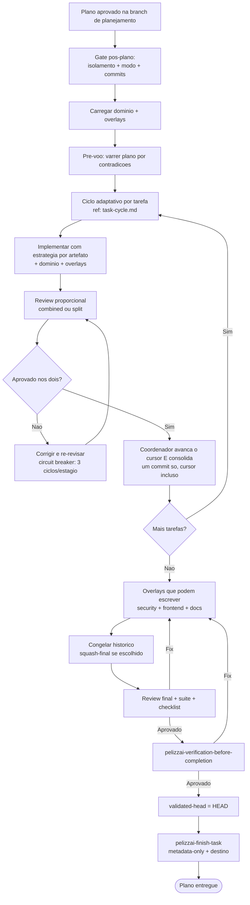

# PelizzAI Execution Plans

## Objetivo

Executar um plano aprovado com **disciplina por tarefa**: cada tarefa recebe a estratégia de
teste/validação adequada ao artefato, passa pelas lentes de spec + qualidade no perfil de review
proporcional e só então é
consolidada. No final, overlays que podem escrever rodam antes de o conteúdo ser selado por
review, suíte e checklist. A skill mantém estado retomável e impede integrar conteúdo diferente
do que foi validado.

**Anuncie ao iniciar:** "Usando a skill PelizzAI Execution Plans para executar o plano, tarefa por tarefa."

<MEMBRO-DO-TIME-STOP>
Se você é um **membro** (teammate/subagente) encarregado de **uma tarefa**, implemente apenas a
sua: siga a estratégia de teste declarada, as skills de domínio e as skills transversais/overlays
coladas no briefing; respeite `pelizzai-preferences` e devolva `DONE`, `DONE_WITH_CONCERNS`,
`BLOCKED` ou `NEEDS_CONTEXT`. Não orquestre nem commite. Ver `references/task-cycle.md`.
</MEMBRO-DO-TIME-STOP>

---

## Princípio central

> Execute um plano aprovado com gates humanos nas **bordas** e autonomia entre tarefas. Nenhuma
> tarefa é consolidada sem evidência apropriada ao artefato e review. Nenhum conteúdo muda depois
> de `validated-head`; consumidor acrescenta só o closure metadata-only, source mode nenhum commit.

---

## Gate de setup pós-plano (OBRIGATÓRIO antes da Tarefa 1)

O normal é a branch de tarefa/planejamento já existir: `pelizzai-starting-branch` a criou **antes**
da spec/plano e gravou `base-ref`/`base-sha`. Se um plano externo chegou sem branch, invoque-a
agora antes de continuar. Com o plano aprovado, resolva as três decisões ainda pendentes e grave
no state consumidor ou execution record nativo; em retomada real, honre valores já decididos.

**1. Isolamento:** branch é o default seguro: continue na branch de planejamento. Só proponha
worktree quando o working tree principal precisa ficar livre/isolado ou o usuário o pediu; explique
que será necessário um checkpoint e confirme essa mudança material. Worktree não autoriza vários
writers concorrentes no mesmo diretório.

**2. Aplicar isolamento — invoque `pelizzai-starting-branch`:** branch faz checkpoint do setup
persistente quando existir e mantém a branch atual; worktree captura `checkpoint-sha` após o
checkpoint opcional, libera a branch no working tree principal, adiciona
o worktree com a **branch existente** e registra o novo path antes da Tarefa 1. Ambos começam a
implementação com working tree limpa.

**3. Modo de execução:** selecione a menor coordenação suficiente e registre-a. Inline é default
para mudança pequena/sequencial; subagents para investigação/unidades que só reportam; team para
dependências que exigem coordenação e diálogo. Não existe prioridade
`team > subagents > inline`. Preferência explícita do usuário prevalece; só pergunte se duas opções
tiverem trade-off material. Escritas/review/commit na working tree são serializados.

**4. Estratégia de commit:** granular é o default seguro. `squash-final` exige pedido/preferência ou
trade-off real apresentado ao usuário, pois consolida a branch. Registre a decisão. Qualquer squash
ocorre **antes** de review final/testes/`validated-head`; `pelizzai-finish-task` nunca reescreve
conteúdo ou histórico após o seal.

---

## Pré-requisitos (gate)

Antes da primeira tarefa, confirme:

```text
[ ] Existe um plano aprovado (pelizzai-writing-plans, PRD ou issues). Sem plano → volte a pelizzai-writing-plans.
[ ] Consumidor: catálogo existe (zero domain skills é válido) e state foi preparado.
    Source mode: NÃO crie catálogo/state consumidor; use as regras do repo-fonte e execution record.
[ ] As skills de domínio relevantes foram selecionadas quando o consumidor as possui.
[ ] `overlays` foi inferido pelo efeito/superfície e as skills transversais estão prontas para
    aplicar/colar nos briefings de executores e reviewers.
[ ] O gate de setup pós-plano foi conduzido: isolation/execution-mode/commit-strategy registrados
    (nenhum <pending>) e o isolamento criado via pelizzai-starting-branch.
[ ] NÃO está em branch protegida (default real/base-ref, main/master/develop/dev, ou HEAD vazio).
[ ] Em consumidor, o estado existe em pelizzai/data/state.md (se não, instancie a partir do template e preencha
    slug/track/phase/project/branch/base-ref/base-sha/isolation/execution-mode/
    commit-strategy/overlays/plan antes da Tarefa 1; `validated-head: <none>`) e
    foi validado contra o git (branch: `git branch --show-current`; worktree: `git worktree list`
    ou o comando rodado DENTRO do worktree-path).
```

No consumidor, o diretório `pelizzai/` segue o padrão do harness e o estado vive em
`pelizzai/data/state.md`. Em source mode, o estado vive somente no execution record nativo.

---

## Construir o pacote de skills (obrigatório nos três modos)

Skills de domínio capturam padrões do projeto; skills transversais/overlays capturam uma superfície
da mudança. **Todo executor e reviewer recebe as aplicáveis**. Recalcule overlays pelo diff real: UI inclui
`pelizzai-frontend`; superfície sensível inclui `pelizzai-oswap`; nova superfície estável pode
incluir `pelizzai-documenting-features`. Persistir nomes em `overlays:` não substitui colar seus
gates no briefing.

```text
1. Consumidor: leia `pelizzai/domain-skills.md`; source mode: use regras/skills do repo-fonte.
2. Leia `overlays:` no state/execution record e complemente pelo efeito/superfície observada.
3. Inline: carregue domínio + overlays. Subagents/Team: COLE seus pontos operacionais no briefing.
4. Propague o mesmo pacote ao reviewer; ele precisa julgar requisitos de UI/segurança/docs também.
5. Prioridade: pedido explícito e regras do projeto > skills de domínio > overlays aplicáveis >
   preferences/reasoning genéricos. Conflito material sobe ao coordenador.
```

No consumidor, catálogo ausente volta a `pelizzai-audit`. Em source mode, ausência é o contrato.

---

## Os três modos de execução

Não há ranking universal; use a menor coordenação que preserve qualidade.

| Modo                 | Skill              | Quando                                                                       |
| -------------------- | ------------------ | ---------------------------------------------------------------------------- |
| **team**             | `pelizzai-team`    | Frentes com dependências que exigem coordenação e troca durante a execução |
| **subagents**        | `pelizzai-subagents` | Tarefas independentes que só precisam **reportar**; um subagente fresco por tarefa, contexto isolado, review por tarefa |
| **inline**           | —                  | Plano pequeno/sequencial em que delegar custaria mais que executar |

```text
Branch e worktree desta tarefa têm UMA working tree de integração. Apenas o coordenador aplica
escritas nela, em série. Agentes podem investigar/revisar em paralelo ou devolver patches; não
mantêm WIP concorrente no diretório compartilhado. Antes do review por tarefa, quiesça writers e
gere `review-package --working-tree`, que deve representar somente a tarefa em revisão.
```

**Desempate:** team quando membros precisam conversar/negociar dependências; subagents quando cada
unidade só precisa reportar; inline quando o trabalho é curto e serial. Paralelismo, sozinho, não
obriga team.

Registre o modo no `state.md` consumidor ou execution record nativo
(`execution-mode: team | subagents | inline`).

---

## Fluxo



OODA é útil como **controle macro** quando há feedback e estado mutável: observar evidência,
orientar contra a DoD, decidir e agir. Não é o reasoning obrigatório de toda tarefa. O briefing
seleciona a técnica que ataca o problema (decomposição, RCA, hipótese, comparação, verification);
OODA apenas coordena iterações quando existe um loop real.

---

## Pré-voo

Antes da Tarefa 1, leia o plano **uma vez** procurando contradições internas ou conflitos com as skills de domínio/critérios de review. Se houver, apresente tudo ao usuário em **uma** pergunta batched; se estiver limpo, siga em silêncio.

---

## Ciclo por tarefa

O protocolo detalhado — briefing autossuficiente, estratégia por artefato, review proporcional
com duas lentes, circuit breaker e commit como gate — está em
**[references/task-cycle.md](references/task-cycle.md)**. Resumo:

```text
1. Briefing: COLE o texto completo + skills de domínio + overlays + estratégia de evidência e
   perfil de review (`combined` ou `split`)
   (o membro nunca lê o arquivo inteiro do plano; use scripts/task-brief.* somente quando houver
   plano Markdown persistente compatível. Plano nativo usa colagem/brief construído — ver §1,
   incluindo
   `review-package --working-tree`; range é só final). Instrua preferences/reasoning com a
   prioridade certa: regras do projeto > domínio > overlays > camada genérica.
   Responda perguntas ANTES de o trabalho começar.
2. Aplicar TDD, characterization, validate, visual ou static/scenario conforme o artefato. O
   membro NÃO commita.
3. Review com duas lentes: (a) conformidade com a spec; (b) qualidade + evidência FRESCA.
   `combined` aplica ambas em um despacho/relatório para tarefa bounded/low-risk; `split` usa
   estágios sequenciais quando risco, contrato, dados, segurança ou complexidade pedirem.
4. Reprovou? Corrija (re-despachando ao implementador — não corrija à mão, polui o contexto) e
   RE-REVISE na mesma lente. Circuit breaker: 3 ciclos por lente por tarefa; mesma issue 2x
   escala na 2ª; rejeição estrutural escala de imediato; ao estourar → registra phase: blocked
   e escala ao humano com mensagem acionável.
5. As duas lentes aprovaram? O COORDENADOR consolida: estagia paths EXATOS da tarefa e, no
   consumidor, atualiza/estagia state no mesmo commit; em source mode avança o execution record
   sem arquivo. Inspeciona `git diff --cached` e commita (granular: definitivo; squash-final: wip).
   Nunca use `git add -A`.
```

---

## Modo Team

Use `pelizzai-team` quando frentes precisam coordenar dependências. O lead delega briefings com
domínio + overlays e sintetiza. Investigação pode ser paralela; aplicação na working tree, review,
cursor e commit são serializados pelo coordenador.

## Modo Subagents

Use `pelizzai-subagents`. Um subagente **fresco por tarefa**, despachado pelo coordenador, com contexto isolado. O coordenador roteia, aplica o perfil de review e consolida. Execução contínua entre tarefas; sem pausa por tarefa.

## Modo Inline

Para plano pequeno e sequencial, o coordenador executa na própria sessão seguindo o mesmo ciclo.
Inline é uma escolha adequada, não um fallback inferior.

---

## Higiene de contexto

A regra geral (zona segura, fases, "handoff bifurca; compact continua") mora na `pelizzai-core`. Na execução de planos, aplique-a assim:

```text
- Zona segura: ~120k tokens. Acima disso a qualidade degrada — planeje as fronteiras de fase
  ANTES de chegar lá, não quando a janela já está cheia.
- Design → plano nascem numa janela ininterrupta; cada tarefa executa em contexto fresco
  (briefing colado — é o que os modos team/subagents já garantem).
- NUNCA compacte no meio de uma fase ou tarefa: feche a fase (review ✅ + cursor + commit)
  e compacte na borda.
- Handoff bifurca; compact continua: para mudar de rumo ou abrir outra frente, despache com
  briefing novo; para continuar o MESMO trabalho com a janela cheia, compacte na borda de fase.
```

---

## Estado e retomada

Invariantes comuns:

```text
- `phase: done`/slug vazio significa nenhuma tarefa ativa; tarefa nova não herda decisões.
- `base-ref`/`base-sha` são o snapshot inicial e nunca são recalculados no fim.
- mudança de conteúdo invalida `validated-head`; ele só nasce após a validação final.
- `project` é exatamente um repo; outro repo recebe outro registro de execução.
- branch/worktree, HEAD e progresso do registro precisam concordar com Git.
```

**Consumidor:** o cursor vive em `pelizzai/data/state.md` (template em
[templates/state.md](templates/state.md)). Avance-o no mesmo commit da tarefa; os únicos commits
só de cursor são `phase: blocked` e o closure final. Após compaction, reconstrua pelo state, arquivo
`plan:` e Git.

**Source mode:** o cursor vive no plano/execution record nativo. Avance-o após cada commit, leia o
plano nativo para tarefas pendentes e reconstrua pelo record + Git; não procure/crie state, arquivo
de plano consumidor nem commit de cursor. State ausente é o contrato, não uma divergência.

Em ambos os modos, valide branch com `git branch --show-current` e worktree por
`git worktree list`/comando dentro do path registrado. Divergência material chama
`pelizzai-recovery` no modo correspondente; ela preserva WIP antes de reconciliar.

---

## Loop até a entrega (controle adaptativo)

O loop usa evidência e Definition of Done. OODA pode coordenar o macro-loop, mas o reasoning local
é selecionado pela situação. Em dúvida material, pare e use `pelizzai-interview-me`; não transforme
incerteza em mais uma volta automática.

---

## Gates humanos (bordas) e autonomia entre tarefas

```text
GATES (exigem confirmação quando há escolha/efeito material):
- Começar em branch protegida (main/master/develop/dev) — proibido, sem exceção.
- Branch/nome/base antes do planejamento somente quando ambíguos; worktree e squash-final quando
  saem dos defaults seguros.
- Modo de execução só vira pergunta quando há trade-off material ou preferência explícita.
- Destino externo: push / PR / descarte e remoção de worktree exigem decisão; sem pedido externo,
  finish-task mantém local por default.
- Conclusão.

AUTONOMIA (sem perguntar a cada passo):
- Entre as tarefas de um plano JÁ APROVADO, execute de forma contínua (não pergunte "sigo?").
- Pare apenas por: BLOCKED que você não resolve, ambiguidade material, ou plano concluído.

NUNCA o modo "mãos-livres" que remove os gates de borda (reprovado em campo no harness anterior).
```

---

## Validação final da entrega (coordenador/líder)

Ao terminar as tarefas, o coordenador valida a entrega inteira. A ordem é um contrato:

### 1. Rodar overlays que podem escrever

Reavalie `base-sha..HEAD` e execute, quando aplicável, **antes** do review final:

```text
- pelizzai-oswap: auth, input, SQL/query, segredo, upload, dependência, autorização etc.;
- pelizzai-frontend: requisitos anti-slop durante a implementação + app rodando, estados e
  viewports na validação visual;
- pelizzai-documenting-features: documentação exigida para nova superfície estável.
```

Overlay aplicável não é oferta tardia da finish-task. Correção ou doc gerada vira conteúdo da
entrega, recebe a evidência proporcional e é commitada antes de seguir.

### 2. Congelar a estratégia de commits

- `granular`: confirme working tree limpa e mantenha os commits definitivos.
- `squash-final`: consolide **agora**, nunca na finish-task. Prefira a alternativa recuperável a
  `reset --soft`: renomeie a branch atual para um nome único `<branch>-preseal-<timestamp>`, crie
  novamente `<branch>` em `base-sha`, aplique `git merge --squash <preseal>` e faça o commit final
  aprovado. A branch preseal preserva o histórico; não a delete automaticamente. Pare se a branch
  já estiver publicada ou se qualquer guarda falhar.

Depois desta etapa, `git status --porcelain` deve estar vazio e `validated-head` continua `<none>`.

### 3. Validar o candidato congelado

```text
1. Capture candidate-head = `git rev-parse HEAD`.
2. REVIEW FINAL via pelizzai-review no range exato `base-sha..candidate-head`. Use reviewer
   independente e capacidade proporcional ao risco. Exceção: uma única tarefa `bounded`, perfil
   `combined`, sem mutação posterior pode reutilizar o review da tarefa se
   `reviewed-tree == candidate-head^{tree}`; qualquer ausência de prova exige review normal.
   Critical/Important bloqueiam.
3. Rode pelo próprio coordenador todos os checks aplicáveis do perfil (test/lint/build/render/
   dry-run/visual etc.), do zero, com saída e exit code. Não invente suíte para artefato estático.
4. Releia plano/spec requisito a requisito e aponte onde cada um foi entregue.
5. Rode pelizzai-verification-before-completion com a evidência fresca.
```

Qualquer fix nos passos 2–5 — inclusive segurança, UI ou docs — invalida o candidato: grave
`validated-head: <none>`, commite o fix, volte ao passo 1 (overlays), reconsolide se a estratégia
for squash-final e **reabra o review final**. Aplique o circuit breaker do task-cycle ao loop.

### 4. Selar e entregar à finish-task

Com tudo aprovado e HEAD ainda igual a `candidate-head`, em consumidor escreva no state
`validated-head: <SHA completo de candidate-head>`, sem commitar; essa é a única sujeira permitida.
Em source mode, grave o SHA no execution record e mantenha a working tree limpa. Chame
`pelizzai-finish-task`: consumidor fecha com um commit metadata-only de state; source mode não cria
closure. Nenhum código, config ou doc pode mudar depois do seal.

---

## Raciocínio — `pelizzai-reasoning`

- Sequência conhecida: *Plan and Execute*; dependências: *Structured Decomposition*.
- Falha inesperada: hipótese + *Root Cause Analysis*; decisão entre alternativas: comparação/ToT.
- Feedback contínuo e realidade mutável: OODA como controlador macro, não como ritual local.
- Antes de consolidar e selar: *Verification* com evidência do artefato.

---

## Anti-padrões

```text
- Executar sem plano aprovado, sem o gate de setup pós-plano, ou sem isolamento (em branch protegida).
- Pular skills de domínio/overlays — ou não colá-las nos briefings de executor e reviewer.
- Escolher team por preferência universal, ou forçar effort máximo numa tarefa mecânica.
- Deixar o membro/subagente commitar (o commit é gate do coordenador, após as duas lentes de review).
- Aceitar "testes passam" inferido, sem evidência fresca colada.
- Corrigir à mão o trabalho reprovado de um membro (re-despache — corrigir à mão polui o contexto).
- Pular a re-revisão após um fix ("corrigi" é só mais uma alegação não verificada).
- Loop infinito de fix→re-review (ignorar o circuit breaker de 3 ciclos).
- Declarar entregue sem overlays aplicáveis + review final (ou reutilização bounded comprovada) +
  checks + checklist + seal.
- Pausar a cada tarefa de um plano já aprovado (quebra a execução contínua) — ou, no extremo oposto,
  remover os gates de borda (mãos-livres).
- Fazer o subagente ler o arquivo do plano inteiro (cole o texto da tarefa).
- Commit órfão só para mover o cursor DURANTE a execução (exceções legítimas: o registro de
  phase: blocked do circuit breaker e o commit de fechamento do cursor da pelizzai-finish-task
  no modo granular).
- Confiar no state.md sem validar contra o git ao retomar.
- Writers concorrentes na mesma working tree, tornando `--working-tree` impossível de escopar.
- Rodar security/frontend/docs depois da validação final, ou não reabrir review após fix.
- Executar squash/reset/rebase na finish-task depois de `validated-head`.
```

---

## Integração

**Combina com:**

- `pelizzai-writing-plans` — produz o plano na branch de tarefa já aberta.
- `pelizzai-starting-branch` — cria a branch antes do plano e aplica o isolamento pós-plano.
- `pelizzai-tdd` — disciplina para comportamento executável; outras estratégias estão no task-cycle.
- `pelizzai-team` / `pelizzai-subagents` — modos usados conforme a topologia; inline é par legítimo.
- `pelizzai-review` — review por tarefa (spec + qualidade) e review final da branch.
- `pelizzai-loop` — OODA quando houver loop real, Definition of Done e parada por dúvida.
- `pelizzai-reasoning` — ordenação, diagnóstico e verificação.
- `pelizzai-verification-before-completion` / `pelizzai-finish-task` — conclusão com gates.
- `pelizzai-audit` — padrão de diretório `pelizzai/` e catálogo de skills de domínio.

Invoque apenas as skills exigidas pelo efeito, risco, domínio e overlays da tarefa; não transforme o
catálogo inteiro em checklist.

---

## Instrução final para o agente

```text
Execute tarefa por tarefa com estratégia de evidência adequada e review working-tree.
Crie a branch antes de spec/plano; no gate pós-plano resolva isolamento, modo e commits.
Escolha inline/subagents/team pela topologia, sem ranking universal.
Propague domínio + overlays para executor e reviewers.
Mantenha gates humanos nas bordas; execute com autonomia entre tarefas.
Consolide só após spec ✅ e qualidade ✅ com evidência fresca.
Rode overlays antes de congelar/validar; qualquer fix reabre o review final.
Grave validated-head só após aprovação; finish cria closure só no consumidor.
Estado no state consumidor ou execution record source; um repo por tarefa; valide contra Git.
Nunca comece em branch protegida. Nunca mãos-livres.
```
