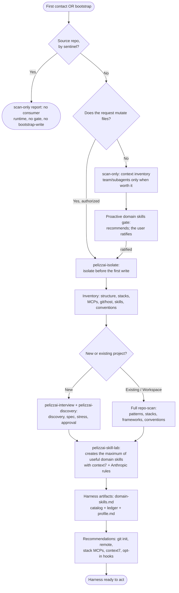

# PelizzAI Onboard

<FIRST-TIME-USING-PELIZZAI>
The **first time** the user interacts with the PelizzAI harness in this project, or whenever they
type **"bootstrap"**, this skill **MUST** be invoked before any work — at minimum in `scan-only`.
Without this mapping, the harness works blind.

The harness is initialized in this project when the file `pelizzai/domain-skills.md` exists. If it
does **not** exist, treat this as the first time: map the project and actively PROPOSE the
bootstrap, without waiting for the user to discover it exists. Invoking is mandatory; **writing
still depends on the user's answer** (see *Choosing the mode*).
</FIRST-TIME-USING-PELIZZAI>

## Goal

Map the working context so the harness acts with precision — what the project is (single or
workspace, new or existing), what it is built with, what infrastructure already exists — and, when
authorized, turn each finding into a useful artifact: the domain skills and documentation that make
the agent assertive. A versionable, portable bootstrap, never a report for its own sake.

**Announce**, in the conversation's language: that you are using the PelizzAI Onboard skill in `<scan-only|bootstrap-write>` mode to map the project proportionally.

## Choosing the mode

| Mode | Trigger | May write? |
| --- | --- | --- |
| `scan-only` | analyze, explain, review, diagnose; a mutating task still without bootstrap authorization | No. No state, branch, profile, catalog, ledger, hook, or skill. |
| `bootstrap-write` | the user said `bootstrap`/`reinitialize`, or approved the proposal after a scan | Yes, inside the task branch created before the first write. |

A read-only request never becomes a mutating bootstrap just because `pelizzai/domain-skills.md` does not exist.

The router hands the situation over; this is the row it lands on:

| Situation | Route |
| --- | --- |
| Catalog missing, first interaction with the project | `scan-only` at minimum; propose the bootstrap before the kickoff gate. Declining does not block the request. |
| Catalog missing, `effect: read-only` | Map in `scan-only`, propose, and wait. Yes → `bootstrap-write`; no or later → stay in `scan-only`, no file is created, one line records the limitation. |
| The user said `bootstrap` or `reinitialize` | `bootstrap-write`. |
| Mutating task, catalog missing | `scan-only`, present the proposed minimum set of artifacts, get consent for `bootstrap-write`; once accepted the effect is `write-local` and the first-write gate applies. |
| Catalog exists, ledger missing | In an authorized mutating task, repair only the ledger; read-only just reports. |
| Catalog exists | Re-running the bootstrap (remap) requires an explicit request or observed drift — proactivity applies to an uninitialized harness, not to rewriting what was ratified. |

Proposing is not executing: the bootstrap only writes after an explicit "yes", in the conversation's
language, and a purely conceptual question never triggers the proposal. In the source repo there is no
trigger: there is no consumer catalog to create.

## Source mode

If the sentinel `scripts/pelizzai-source-repo.txt` exists, treat the project as the PelizzAI source repo. Do not create a consumer `pelizzai/`; do only the scan the task needs. The presence of a manifest/sync-harness does NOT indicate a source repo — consumers installed via `-ExportConsumer` have them too.

## Proportional depth

```text
small project/simple stack
→ focused inline inspection.

monorepo or multiple independent fronts
→ read-only subagents/team when they cut latency or raise coverage.

new/empty project
→ do not implement or invent patterns; route first through the greenfield cycle of discovery,
  spec, and approval.
```

Team is not the default. Use it only when the fronts are independent and the synthesis is worth the cost.

## Scan-only

Answer the relevant questions without turning the scan into a universal inventory:

```text
Structure: single repo, monorepo, or multi-repo workspace?
Stack: manifests, lockfiles, frameworks, runtime, database, and key versions?
Execution: real test/build/lint/dev commands and their directories?
Conventions: instructions, linters, tests, commits, design system, and repeated patterns?
Git: current branch, real default, remotes/provider, CI, and working tree?
Skills: installed roots, existing domain skills, and catalog?
Tooling: MCPs/connectors that actually change this task?
```

Separate observed facts from inferences. Do not write a generic report when the request only needs a localized answer.

After identifying the real stack and versions, consult Context7 for the external components that
could change the route, the skill candidates, or the recommendations. Do not consult a generic
version when the lockfile/manifest provides the installed one; do not consult irrelevant
technology just to pad the inventory.

When finishing scan-only:

- deliver the requested analysis;
- at the design→plan and plan→execution edges, proactively PULL the domain-skills proposal (do not wait for the user to type `bootstrap`) — see **Proactive domain skills gate**; ask for consent once;
- do not create placeholders to "prepare later".

## Proactive domain skills gate (design→plan and plan→execution edges)

The stack classification and the candidate list are computed, but they become a **recommendation to
ratify**, never a silent write. Pull the proposal at the high-value edges, without waiting for the
user to type `bootstrap`:

- **design→plan (new project):** after the spec/design is approved, detect the chosen stack;
  propose domain skills grounded in `context7`/official docs before the plan.
  The plan does not start until the user chooses to create, trim, defer, or record zero skills.
- **plan→execution (existing project):** before fixing the build lane, if a mutating task's stack is not covered by the catalog (absent, OR present but not covering that stack), propose all the domain skills that would close that gap and prevent agent error.

**Who invokes this gate (it is not just the audit's own self-service):** `pelizzai-discovery`
triggers it at the design→plan edge, as a numbered step of closing the design edge;
`pelizzai-plan` triggers it as a safety net before Task 1, when the plan's stack has no
coverage in the catalog (or the catalog is absent). At those two points, the `pelizzai-router`
kickoff already announces in the Artifacts that the stack's skills come as a design-edge proposal.

A one-question gate, with a recommendation:

```text
I detected the ratified stack <X, Y, Z>. I propose <N> domain skills: [name — decision/error it corrects],
grounded in context7/official docs for the version pinned in the manifest.
Recommendation: <create all | subset> — <one-line reason>.
Question: create the recommended ones, adjust the set, or proceed with none for now?
```

After the answer about skills, ask separately the opt-in question about arming maintenance (Stack
baseline + ledger + hook), also with a recommendation — never two decisions in one checkbox.

Zero domain skills is valid only when ratified against the proposal. "First interaction" does not
trigger writing by itself; greenfield triggers discovery and, after the spec is approved, this
proposal. Nothing is written without an explicit answer. Context7 provides the skill's technical
grounding; it does not decide whether the project wants the skill.

Under a closed briefing (SUBAGENT-STOP / TEAM-MEMBER-STOP), produce no route analyses and open no gates: apply the briefing and escalate to the coordinator whatever requires a decision.

**Source mode** (PelizzAI source repo): this gate does NOT run; domain rules, if any, live in the native execution record.

## Bootstrap logical flow



## Bootstrap-write

### 1. Isolate before writing

If Git exists, invoke `pelizzai-isolate` and create a task branch such as
`chore/bootstrap-harness` before any file. If there is no Git, offer `git init`; if the user
declines, bootstrap-write does NOT proceed — without a repository there is no branch, no
isolation, and no rollback, and a generic authorization does not replace that precondition (the
first-write gate rules). Offer scan-only instead: the mapping and the proposal survive; only the
writes wait for a repository.

The bootstrap is its own transaction. Its artifacts must be committed/integrated or stay on the same task branch before a feature worktree depends on them.

### 2. Detect skill roots

Record in `pelizzai/profile.md` the roots actually installed:

```text
source-mode: false
skill-roots:
  - .claude/skills   # if it exists/is used
  - .agents/skills   # if it exists/is used
canonical-skill-root: <active root>
```

`pelizzai-skill-lab` writes domain skills to the active root; if both are installed, it keeps byte-for-byte copies and verifies parity.

### 3. Propose the maximum of useful domain skills

In an existing project or workspace, first do the **full repo-scan** — patterns, stacks,
frameworks, languages, conventions, and extension points. From the observed patterns comes the
proposal: the **maximum of useful domain skills** for the agent to work correctly in this project.
Broad coverage is the target; the filter is "useful", not "few". `pelizzai-skill-lab` writes
each candidate grounded in the `context7` MCP (real documentation of the libs/frameworks at the
version pinned in the manifest) and in Anthropic's skill-creation rules.

Signals that raise confidence in a candidate — quality criteria to order the proposal and guide
the writing, **never a conjunctive door** that vetoes candidates:

```text
- a recurring, project-specific pattern/invariant exists;
- loading it would change a decision or prevent a real agent error;
- there is evidence in the repo, approved design, or official documentation to ground it;
- it is not yet covered by existing instructions/skills — partial coverage becomes a
  complementary cut, not a reason to discard.
```

A candidate with few signals goes lower in the order, with a one-line reason — it is not silently
discarded. What prevents noise is each skill's value, not a quantity cap: a skill per folder, file,
or generic tool is not coverage. The proposal grows with real project patterns, not the tree.

Zero domain skills is a possible outcome WHEN the user ratifies it against the proposal — the decision not to create is the user's, not the classifier's.

ALWAYS present the candidates (name + error they prevent) and wait for confirmation before writing them — the proposal is presented in full, including when the recommended set is small or empty, and the user may create all, trim, defer, or decline. For an external stack/lib, the skill must be grounded in `context7` or current official documentation for the pinned version; for internal rules observed in the repo, `context7` is preferred, not a blocker.

### 4. Create the artifacts

The persistent bootstrap leaves:

- `pelizzai/domain-skills.md` — the catalog, including `_none for now_` when applicable;
- `pelizzai/data/review-domain-skills.md` — the ledger seeded with the current date/HEAD;
- `pelizzai/profile.md` — real commands, package manager, **Stack baseline** (the drift anchor for the version/adoption axes), and skill roots; also record the **Ratified execution defaults** section with every field at `<unset>` — the bootstrap does not guess policy; the user ratifies it at the post-plan gate;
- `pelizzai/.gitignore` and `pelizzai/.gitattributes` — scoped protection of the ephemerals; union merge for the append-shaped files;
- `pelizzai/data/learnings.md` and `pelizzai/data/verification-standard.md` — seeded from the `pelizzai-evolve` templates.

Mandatory content of `pelizzai/.gitignore`:

```gitignore
data/.cadence-state.json
data/handoffs/
data/mockups/
data/reports/
data/state.md
```

Mandatory `pelizzai/.gitattributes`:

```gitattributes
data/learnings.md merge=union
data/history/learnings-*.md merge=union
```

`data/review-domain-skills.md`, `data/learnings.md`, `data/verification-standard.md`, and
`data/history/` are **versioned** — a durable record; never in the ignore (a broad `data/*` with
exceptions would silence `history/`).

`data/state.md` is the one deliberate exception: **the cursor is local per dev** — versioned, every
dev's closure commit would fight over the same singleton. The durable per-task record is
`data/history/<YYYY-MM-DD>-<slug>.md`, conflict-free by unique name.

`merge=union` keeps concurrent appends to `learnings.md` from conflicting; the residual duplicated
line between parallel appends is visible and benign for append-shaped content — on anything NOT
append-shaped it interleaves edits silently, so declare, never assume. Verify the ignore with
`git check-ignore` using temporary proof files; remove the proofs afterward.

Create on demand, not at bootstrap: `context.md`, `adr/`, `out-of-scope/`, `specs/`, `plans/`, and the ephemeral directories.

**Arming maintenance is a first-class outcome, even with zero skills.** The minimal initialization (arm-only) writes the profile (Stack baseline + skill roots + real commands), seeds the ledger with today's date, and offers the cadence hook — without requiring any skill to be created (`_none for now_` is a valid catalog). Treat "arm maintenance" as a ratifiable item distinct from "create skills": without the anchor (Stack baseline + ledger), the version/adoption/rework axes and the cadence have nowhere to fire later — the machinery dies at the origin.

### 5. New project

With no code/patterns, use the greenfield cycle: `pelizzai-interview` one question at a time →
full `pelizzai-discovery` → stress → approved spec. Then apply the **Proactive domain skills
gate** before the plan, create only the ratified ones, and record them in the catalog/ledger. If
the original request includes building the product, continue to `pelizzai-plan`; if it
asked only for bootstrap/design, stop at the approved scope.

### 6. Hooks and integrations

Claude hooks are opt-in and separate. On a consumer's first mutating interaction, run
`node scripts/install-hooks.mjs --check` in read-only mode. If they are absent, offer to install
the **opt-in Claude Code hooks** — **one by one, with confirmation; never impose** — explaining
the effect of each. Do not reopen the offer once the check passes:

- **Cadence hook** (`pelizzai-cadence.mjs`/`.ps1`, `UserPromptSubmit`): non-blocking reminder to
  review the domain skills (see `pelizzai-skill-lab` →
  `references/domain-skill-maintenance.md`); a no-op without a ledger.
- **Git guard hook** (`pelizzai-guardrails.mjs`/`.ps1`, `PreToolUse` matcher `Bash`): blocks,
  before they run, `push --force` (except `--force-with-lease`), `reset --hard`, `clean -f`,
  `branch -D`, `checkout .`, and `restore .` — executable enforcement of the fail-closed gates
  that, without it, depend only on model obedience.
- **SessionStart hook** (`pelizzai-session-start.mjs`/`.ps1`, matcher
  `startup|resume|clear|compact`): re-injects the harness entry point (core → router), warns of an
  active task in `state.md`, and recaps the already-ratified execution policy — most valuable on
  `clear` and on platforms that do not re-inject the always-loaded entry point.
- **Writegate** (`pelizzai-writegate.mjs`/`.ps1`, `PreToolUse` on the matchers
  `Write|Edit|MultiEdit|NotebookEdit` **and** `Bash`): fail-closed safety net that blocks product
  writes on a protected/detached branch (Rule A) and, in a consumer, while `kickoff: ratified` is
  not yet recorded in `pelizzai/data/state.md` (Rule B — skipped in source mode, where the marker
  lives in the native execution record) — it moves the invariant "isolation before the first
  write" from model obedience to executable enforcement.
  It does NOT enforce the greenfield approval steps: the kickoff menu remains the harness's, not
  the hook's. Fail-open on any error of the hook itself (always exit 0 when it cannot decide).

Only edit settings after confirmation, and respect the granularity of the answer: use
`node scripts/install-hooks.mjs` when the user accepts all four. If they accept only a subset, use
`--only <ids>` (`guardrails`, `writegate`, `cadence`, `session-start`, comma-separated) and pass
the same `--only` to `--check` and `--remove` — never batch-install what was not accepted, and do
not hand-edit `.claude/settings.json` for a subset the installer already handles in its canonical
form. `--only` is additive (it does not drop a hook the user had already accepted), bare `--check`
is an inventory in which a deliberate partial install is not a failure, and `--check --only <ids>`
turns into a turnstile that requires exactly those hooks. The installer merges
`.claude/settings.json` without overwriting existing hooks/permissions and is idempotent. The
export may register them immediately only when the user explicitly chooses `--install-hooks`.

`PreToolUse` has **two** groups: the writegate also runs on `Bash`, otherwise writes via
redirection/heredoc slip past the gate. This is how `scripts/install-hooks.mjs` writes it:

```json
{
  "hooks": {
    "PreToolUse": [
      {
        "matcher": "Bash",
        "hooks": [
          { "type": "command", "command": "node \"$CLAUDE_PROJECT_DIR/.claude/hooks/pelizzai-guardrails.mjs\"" },
          { "type": "command", "command": "node \"$CLAUDE_PROJECT_DIR/.claude/hooks/pelizzai-writegate.mjs\"" }
        ]
      },
      {
        "matcher": "Write|Edit|MultiEdit|NotebookEdit",
        "hooks": [
          { "type": "command", "command": "node \"$CLAUDE_PROJECT_DIR/.claude/hooks/pelizzai-writegate.mjs\"" }
        ]
      }
    ]
  }
}
```

Cadence and SessionStart live on their own events (`UserPromptSubmit` and `SessionStart` with
matcher `startup|resume|clear|compact`).

The `.mjs` hooks and the Node installer are portable across Windows, macOS, and Linux; the `.ps1`
variants remain as a Windows fallback. Context7 is the preferred technical integration: verify its
availability at bootstrap and use it whenever an external stack/API/version matters. If absent,
recommend configuring it for the platform; current official documentation is the fallback, not
memory.

Close the bootstrap with the environment recommendations — recommend, do not impose; any action
that changes the environment waits for confirmation:

```text
- No Git → suggest `git init` (the harness works better with history).
- No remote → suggest integrating with GitHub or GitLab.
- context7 absent → suggest it FIRST (grounds skills/answers in real documentation); playwright/browser
  MCP absent with UI in the project → suggest it (turns interface floors into machine oracles).
- Other MCPs → research the most relevant ones for the identified stack and suggest them.
```

### 7. Validate and close

Before declaring the bootstrap done:

```text
[ ] the catalog exists and matches the real skills;
[ ] ledger/profile have no placeholders (`<unset>` fields in *Ratified execution defaults* are valid state — policy not yet ratified —, not a placeholder to fill);
[ ] commands came from real manifests/scripts;
[ ] skill roots and parity were verified;
[ ] ephemerals pass git check-ignore;
[ ] the diff contains only approved artifacts;
```

Review the whole diff with the task review's single dispatch — both verdicts, quality-lens
depth raised when hooks/settings/security are touched — commit the approved artifacts with exact
paths, and only then run `pelizzai-verify` against that HEAD. After recording `validated-head`,
close the transaction via `pelizzai-finish`. Do not leave the bootstrap uncommitted or expect
`pelizzai-finish` to consolidate it.

## Partial state

- catalog exists, ledger missing → propose/repair only the ledger in write mode;
- a skill exists outside the catalog → catalog it after confirming origin/content;
- outdated profile → update only the affected fields;
- dead `pelizzai-*` names in `pelizzai/**/*.md` (skills renamed since bootstrap) → run the dead-name sweep ([remap-sweep.md](references/remap-sweep.md)): catalog on disk is the ground truth, `pelizzai/data/history/` stays untouched, substitutions are proposed and ratified, never silent;
- read-only → just report the inconsistency.

## Canonical layout

```text
pelizzai/
├── .gitignore
├── .gitattributes
├── domain-skills.md
├── profile.md
├── context.md | context/ · adr/ | out-of-scope/ · specs/ | plans/   on demand
└── data/
    ├── state.md                    ignored (local per-dev cursor)
    ├── review-domain-skills.md     versioned
    ├── learnings.md                versioned (merge=union)
    ├── verification-standard.md    versioned
    ├── history/                    versioned (each task's intact block, migrated at the seal)
    └── .cadence-state.json · handoffs/ · mockups/ · reports/   ignored
```

In a workspace with multiple repositories, do not pretend one scalar state covers them all: bootstrap per repo or explicitly declare which root owns the artifacts.

## Anti-patterns

```text
- Changing files in scan-only.
- Starting new-project scaffolding before discovery, spec, and an approved plan.
- Using Context7 as a substitute for product decisions or for the domain skills gate.
- Re-running the bootstrap in every new session.
- Skipping the bootstrap on first contact and starting to work blind.
- Cutting the domain-skills proposal by a quantity cap instead of by usefulness.
- Using a team on a repo that a focused inspection solves.
- Creating a profile with guessed commands.
- Writing a skill only to .claude when the active platform uses .agents (or vice versa).
- Declaring a directory gitignored without proving it in the consumer project.
- Leaving the bootstrap loose on main or invisible to the next worktree.
```

## Integration

Uses `pelizzai-isolate` and `pelizzai-finish` only in `bootstrap-write`; `pelizzai-skill-lab` writes the ratified domain skills — the target is the maximum of useful skills, grounded in `context7`; `pelizzai-team`/`pelizzai-subagents` parallelize the repo-scan when the fronts are independent; `pelizzai-discovery` enters only on the new/uncertain-project branch.
