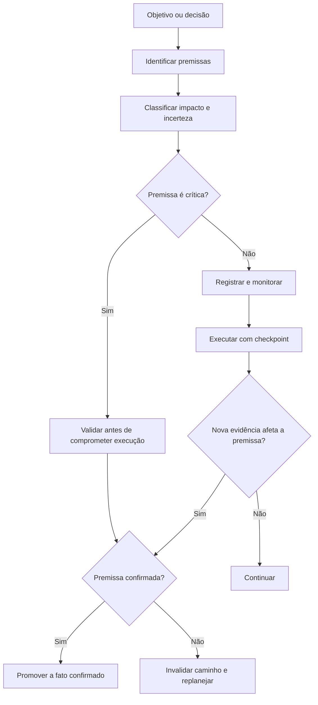
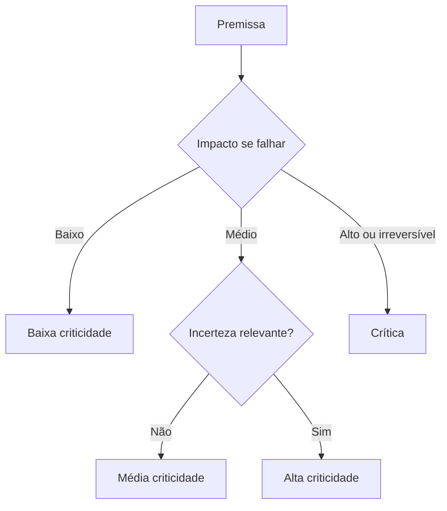
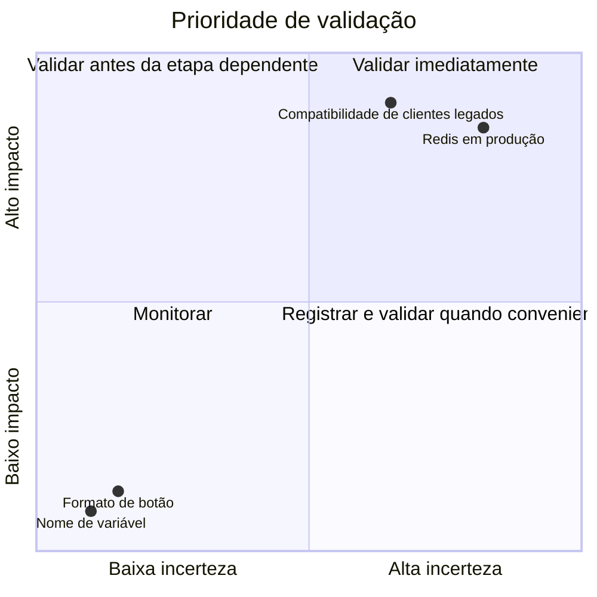
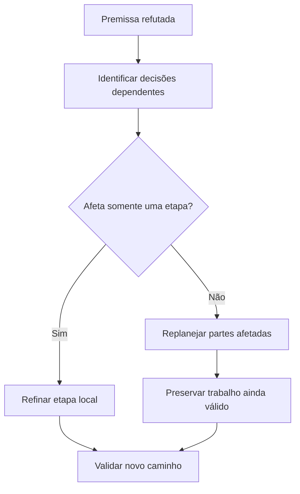

# Assumption Tracking

## Objetivo

Use Assumption Tracking para impedir que decisões importantes dependam de premissas ocultas, não verificadas ou incorretas.

Uma premissa é algo tratado temporariamente como verdadeiro para permitir que uma análise, plano ou implementação avance.

Exemplos:

```text
- O ambiente possui Redis disponível.
- A API aceita o parâmetro `status`.
- Clientes antigos toleram ausência do novo campo.
- O volume de dados cabe no limite de memória definido.
- O usuário possui permissão para executar determinada ação.
- A biblioteca é compatível com a versão atual do framework.
```

Premissas técnicas podem ser necessárias para orientar investigação. Decisões de produto não são
premissas que a LLM pode adotar: requisito, escopo, UX, arquitetura preferida, dados, segurança,
risco aceito e aceite pertencem ao usuário.

O problema é:

```text
- assumir sem registrar;
- implementar antes de validar premissa crítica;
- apresentar hipótese como fato;
- ignorar evidência contrária;
- não saber o que fazer quando a premissa falha.
```

## Princípio central

> Toda decisão relevante deve deixar claro quais condições ainda precisam ser verdadeiras para que ela continue válida.



## Quando usar

Use Assumption Tracking quando a tarefa envolver:

```text
- requisitos incompletos ou ambíguos;
- decisões arquiteturais;
- dependências externas;
- APIs, bibliotecas ou ferramentas ainda não verificadas;
- integrações com outros sistemas;
- migrações;
- segurança, permissões ou dados sensíveis;
- estimativas de custo, volume, performance ou prazo;
- múltiplos ambientes;
- comportamento legado;
- regras de negócio pouco documentadas;
- hipóteses de causa raiz em debugging;
- ações com alto custo de reversão.
```

Exemplos adequados:

```text
- Planejar processamento assíncrono assumindo que existe broker disponível.
- Alterar contrato de API assumindo compatibilidade com clientes existentes.
- Escolher banco de dados assumindo determinado volume de carga.
- Criar integração assumindo que o fornecedor suporta webhook.
- Corrigir bug assumindo que a duplicidade vem de clique duplo.
- Recomendação técnica baseada em versão ainda não confirmada.
```

## Quando evitar

Não crie um registro formal de premissas para tarefas triviais.

Evite ou simplifique quando:

```text
- não há incerteza relevante;
- a resposta depende apenas de conteúdo fornecido pelo usuário;
- existe fonte de verdade direta e fácil de consultar;
- a tarefa é pequena, reversível e local;
- registrar premissas custa mais do que executar e validar.
```

Exemplos em que a técnica é desnecessária:

```text
- Corrigir erro de sintaxe evidente.
- Traduzir um texto.
- Reescrever um parágrafo.
- Renomear variável local sem impacto externo.
- Ajustar um título ou uma descrição.
```

## Relação com outras técnicas

| Técnica                                              | Responsabilidade                                                     |
| ---------------------------------------------------- | -------------------------------------------------------------------- |
| [Constraint Satisfaction](constraint-satisfaction.md) | Organiza requisitos, proibições e limites                            |
| Assumption Tracking                                  | Registra condições ainda não confirmadas                             |
| [Plan and Execute](plan-and-execute.md)              | Define etapas e checkpoints                                          |
| [ReAct](react.md)                                    | Executa ações para reduzir incerteza                                 |
| [Verification](verification.md)                      | Confirma, limita ou refuta premissas                                 |
| [Decision Making](decision-making.md)                | Escolhe entre estratégias quando premissas distintas produzem caminhos interdependentes |
| [Critique and Refine](critique-and-refine.md)        | Corrige plano ou solução após premissa inválida                      |

### Regra de integração

- Use **Constraint Satisfaction** para separar o que é obrigatório do que é desejável.
- Use **Assumption Tracking** para identificar o que ainda não é fato.
- Use **Verification** para confirmar ou refutar premissas.
- Use **Plan and Execute** para inserir checkpoints antes de ações dependentes de premissas críticas.
- Use **Decision Making** quando diferentes premissas levam a estratégias materialmente distintas (modo de busca com poda quando os caminhos são interdependentes).

## Categorias de informação

Não misture estes conceitos.

| Categoria       | Definição                                                            | Tratamento                                  |
| --------------- | -------------------------------------------------------------------- | ------------------------------------------- |
| Fato confirmado | Informação observada, testada ou sustentada por evidência confiável  | Pode orientar decisões                      |
| Premissa        | Condição tratada temporariamente como verdadeira, mas não comprovada | Deve ser rastreada                          |
| Hipótese        | Explicação possível para um problema ou comportamento                | Deve ser testada                            |
| Restrição       | Condição obrigatória ou limite que a solução precisa respeitar       | Deve ser atendida                           |
| Preferência     | Característica desejável, mas negociável                             | Só otimizar após atender obrigatórios       |
| Risco           | Consequência caso algo dê errado                                     | Deve ser mitigado ou aceito conscientemente |
| Desconhecido    | Informação ausente sem hipótese suficiente                           | Não deve ser inventada                      |

Exemplo:

```text
Fato confirmado:
- A API atual usa PostgreSQL.

Premissa:
- O banco possui capacidade suficiente para nova consulta analítica.

Hipótese:
- A lentidão é causada por ausência de índice.

Restrição:
- Não pode haver downtime.

Preferência:
- Evitar adicionar infraestrutura nova.

Risco:
- A migração pode bloquear tabela em produção.

Desconhecido:
- Não foi medido o volume real de registros afetados.
```

## Modelo de uma premissa

Registre premissas relevantes no formato canônico abaixo. Use o conjunto completo de campos para premissas críticas; em registros mais leves, omita campos que não agregam, mas mantenha sempre Premissa, Criticidade, Validação necessária, Gatilho de invalidação e Status.

```text
Premissa:
- [condição assumida]

Tipo:
- Técnica, funcional, infraestrutura, externa, segurança, compatibilidade, custo, volume ou prazo.

Impacto se estiver errada:
- [consequência]

Criticidade:
- Baixo, Médio, Alto ou Crítico.

Evidência atual:
- [por que a premissa parece plausível]

Validação necessária:
- [teste, contrato, documentação, medição, acesso ou confirmação]

Gatilho de invalidação:
- [o que provaria que a premissa não é válida]

Ação de contingência:
- [o que fazer se a premissa falhar]

Status:
- Não verificada, em validação, confirmada, parcialmente confirmada, refutada, obsoleta, bloqueada ou aceita como risco.
```

Exemplo:

```text
Premissa:
- Redis está disponível e aprovado para uso no ambiente de produção.

Tipo:
- Infraestrutura.

Impacto se estiver errada:
- A estratégia de fila assíncrona baseada em Redis não é viável.

Criticidade:
- Alto.

Evidência atual:
- O projeto possui configuração local de Redis.

Validação necessária:
- Confirmar disponibilidade, capacidade e política de uso em produção.

Gatilho de invalidação:
- Ambiente de produção não possui Redis ou não permite novo uso.

Ação de contingência:
- Avaliar infraestrutura de fila já existente ou executar processamento controlado por outro mecanismo.

Status:
- Não verificada.
```

## Identificação de premissas

Procure por linguagem que indique incerteza, condição ou dependência implícita.

Sinais comuns:

```text
- "provavelmente"
- "deve existir"
- "talvez"
- "aparentemente"
- "imagino que"
- "se suportar"
- "desde que"
- "assumindo que"
- "deve funcionar"
- "parece compatível"
- "normalmente"
- "em teoria"
```

Também procure premissas escondidas em decisões aparentemente simples.

```text
Decisão:
"Vamos adicionar cache."

Premissas ocultas:
- Existe gargalo mensurável.
- O dado pode ficar desatualizado por algum período.
- Há mecanismo de invalidação viável.
- O ambiente suporta cache.
- O ganho justifica a complexidade.
```

## Classificação por criticidade

A criticidade depende de impacto e incerteza.



| Criticidade | Característica                                                   | Tratamento                                         |
| ----------- | ---------------------------------------------------------------- | -------------------------------------------------- |
| Baixo       | Falha gera pequeno retrabalho e é facilmente reversível          | Registrar apenas se útil                           |
| Médio       | Afeta parte da solução ou exige ajuste localizado                | Validar antes da etapa dependente                  |
| Alto        | Pode invalidar arquitetura, integração ou plano relevante        | Validar cedo, antes de implementação significativa |
| Crítico     | Pode gerar perda, exposição, indisponibilidade ou violação grave | Não avançar sem validação suficiente               |

### Regra prática

```text
Quanto maior o custo de a premissa estar errada,
mais cedo ela deve ser validada.
```

## Premissas críticas

Premissas críticas exigem atenção especial.

Considere crítica uma premissa que, se errada:

```text
- invalida a arquitetura escolhida;
- bloqueia requisito obrigatório;
- expõe dados, segredos ou permissões;
- gera perda ou corrupção de dados;
- quebra compatibilidade;
- cria custo financeiro relevante;
- exige retrabalho em muitas partes;
- impede rollback;
- torna o prazo inviável;
- depende de sistema externo fora do controle do projeto.
```

Exemplos:

```text
- Serviço externo permite o volume de chamadas necessário.
- Migração pode ocorrer sem downtime.
- Provedor de autenticação atende requisito regulatório.
- Biblioteca é compatível com runtime obrigatório.
- Cliente legado suporta novo contrato.
```

Não implemente longamente com base em premissa crítica não verificada.

## Ordem de validação

Valide primeiro premissas com maior combinação de impacto e incerteza.



Use esta ordem:

```text
1. Premissas críticas e incertas.
2. Premissas que definem arquitetura ou contrato.
3. Premissas que afetam segurança, compatibilidade ou dados.
4. Premissas que afetam custo, performance ou prazo.
5. Premissas locais e facilmente reversíveis.
```

## Métodos de validação

Escolha a menor ação que confirme ou refute a premissa.

| Tipo de premissa        | Validação preferida                                                        |
| ----------------------- | -------------------------------------------------------------------------- |
| API ou contrato         | Schema, documentação oficial, código ou chamada controlada                 |
| Biblioteca ou framework | Documentação oficial da versão usada, changelog ou teste mínimo            |
| Infraestrutura          | Configuração real, ambiente, time responsável ou execução controlada       |
| Compatibilidade         | Teste com cliente antigo, contrato versionado ou logs de uso               |
| Performance             | Métrica, profiling, benchmark ou carga controlada                          |
| Volume de dados         | Query, relatório, métrica observada ou dado histórico                      |
| Segurança               | Política, teste de autorização, revisão de configuração ou ameaça modelada |
| Regra de negócio        | Especificação, usuário responsável, documentos ou comportamento atual      |
| Causa de bug            | Reprodução, logs, tracing, teste isolado ou experimento controlado         |

```text
Não valide premissa técnica crítica com opinião, memória ou exemplo genérico.
```

## Premissas encadeadas

Algumas premissas dependem de outras.

```text
- valide primeiro a premissa mais fundamental;
- não trate premissa derivada como confirmada;
- atualize todas as decisões dependentes quando a base mudar.
```

Exemplo:

```text
Premissa base:
- O serviço de filas está disponível em produção.

Premissa derivada:
- Podemos gerar relatórios em background.

Premissa derivada de segundo nível:
- A interface pode responder imediatamente e consultar status depois.
```

Se a primeira falhar, as seguintes devem ser reavaliadas.

## Premissas temporais

Algumas premissas são verdadeiras apenas em determinado período.

```text
Exemplos:
- Clientes antigos ainda consomem a versão anterior da API.
- A infraestrutura atual suporta o volume presente, mas não a projeção futura.
- Uma credencial é válida até determinada data.
- Uma biblioteca é compatível apenas enquanto a versão atual do runtime for mantida.
```

Registre:

```text
- quando a premissa foi verificada;
- até quando ela deve ser considerada válida;
- qual evento exige nova validação;
- quem ou qual sistema pode alterar sua validade.
```

Exemplo:

```text
Premissa:
- Nenhum cliente usa o endpoint legado.

Verificada em:
- Logs dos últimos 30 dias.

Gatilho de revalidação:
- Novo cliente integrado ou nova versão de aplicativo liberada.

Ação:
- Monitorar uso antes de remover endpoint.
```

## Premissas sobre usuários e requisitos

Não transforme ausência de informação em decisão permanente.

```text
Ruim:
"O usuário quer resposta imediata."

Melhor:
"Resposta imediata é uma hipótese; validar se o usuário aceita processamento assíncrono com status."
```

```text
Ruim:
"O usuário não precisa de auditoria."

Melhor:
"Não há requisito de auditoria identificado; verificar se o domínio, segurança ou regras internas exigem rastreabilidade."
```

Quando a questão material for factual, valide por contexto, código ou documentação. Quando for
decisão humana, use [pelizzai-interview-me](../../pelizzai-interview-me/SKILL.md), uma pergunta por
vez, com recomendação; documentação não decide pelo usuário.

## Premissas em debugging

Em diagnóstico de bug, trate cada causa possível como hipótese rastreável. Para investigação sistemática de causa raiz, combine com [Root Cause Analysis](root-cause-analysis.md).

```text
Problema:
- Pedidos duplicados.

Hipótese A:
- Usuário faz clique duplo.

Hipótese B:
- Cliente faz retry de rede.

Hipótese C:
- Backend não aplica idempotência.

Hipótese D:
- Worker consome mensagem mais de uma vez.
```

Para cada hipótese:

```text
- evidência atual;
- experimento de validação;
- resultado esperado;
- condição de descarte;
- impacto da confirmação.
```

Não corrija a primeira hipótese plausível sem validação.

## Premissas e replanejamento

Quando uma premissa falhar, não apenas altere o detalhe local.

Verifique o impacto sobre todo o plano.



### Regra de impacto

```text
Premissa refutada:
- "A API não suporta filtro no servidor."

Consequências possíveis:
- A estratégia de filtro precisa mudar.
- A paginação pode ficar incorreta se filtrar no cliente.
- O volume de dados pode tornar fallback inviável.
- Critérios de performance precisam ser reavaliados.
```

Não aplique workaround local sem verificar se a premissa afeta arquitetura, segurança, compatibilidade ou desempenho.

## Registro de decisões condicionais

Quando uma decisão depende de premissa ainda aberta, registre explicitamente.

```text
Decisão condicional:
- Usar processamento em fila, desde que a infraestrutura existente suporte o volume e o SLA definido.

Premissa:
- Broker e workers estão disponíveis em produção.

Ação de validação:
- Confirmar configuração, capacidade e observabilidade.

Plano alternativo:
- Processamento em lote controlado ou nova infraestrutura aprovada.
```

Isso evita que uma recomendação condicional seja interpretada como decisão definitiva.

## Estados de uma premissa

| Status                  | Significado                                                                 |
| ----------------------- | --------------------------------------------------------------------------- |
| Não verificada          | Existe, mas ainda não foi investigada                                       |
| Em validação            | Há ação em andamento para confirmá-la                                       |
| Confirmada              | Evidência suficiente para o contexto                                        |
| Parcialmente confirmada | Válida apenas em parte do escopo ou sob condições                           |
| Refutada                | Evidência mostra que a premissa é falsa                                     |
| Obsoleta                | Era válida, mas contexto mudou                                              |
| Bloqueada               | Não pode ser validada por falta de acesso, permissão ou contexto            |
| Aceita como risco       | Não foi possível validar, mas a decisão segue conscientemente com mitigação |

Não trate "aceita como risco" como "confirmada".

## Aceitação consciente de risco

Em alguns casos, não será possível validar uma premissa antes de avançar.

Só registre risco aceito após ratificação do usuário e quando:

```text
- a premissa não é crítica;
- a ação é reversível;
- existe contingência viável;
- o impacto é conhecido;
- o custo de validar agora é desproporcional;
- a limitação é comunicada.
```

Formato recomendado:

```text
Premissa:
- [condição não verificada]

Risco aceito:
- [impacto possível]

Motivo:
- [por que não será validada agora]

Mitigação:
- [rollback, feature flag, monitoramento, limite ou plano alternativo]

Gatilho de revisão:
- [evento que exigirá nova validação]
```

Nunca aceite como risco uma premissa crítica de segurança, dados ou ação irreversível sem evidência suficiente.

## Anti-padrões

### 1. Premissa invisível

```text
Ruim:
"Vamos usar fila porque o processo é pesado."

Premissa oculta:
- O ambiente possui fila e worker disponíveis.

Melhor:
"Fila é uma opção condicionada à disponibilidade do broker e worker em produção."
```

### 2. Tratar hipótese como fato

```text
Ruim:
"O problema é cache."

Melhor:
"Cache é uma hipótese; medir taxa de acerto, invalidação e comportamento sem cache antes de concluir."
```

### 3. Validar tarde demais

```text
Ruim:
Implementar toda a integração antes de descobrir que o fornecedor não suporta o fluxo necessário.

Melhor:
Validar capacidade, autenticação e limites da integração antes de construir dependências ao redor dela.
```

### 4. Não definir contingência

```text
Ruim:
"Se Redis não existir, veremos depois."

Melhor:
"Se Redis não estiver disponível, usar infraestrutura de jobs já existente ou reavaliar estratégia de processamento."
```

### 5. Confundir restrição com premissa

```text
Ruim:
"Não usar serviço pago" tratado como algo a validar.

Melhor:
"Não usar serviço pago" é restrição obrigatória; "serviço gratuito suporta volume" é premissa.
```

### 6. Ignorar validade temporal

```text
Ruim:
"Clientes antigos não usam o endpoint" baseado em observação antiga.

Melhor:
"Não houve uso nos últimos 30 dias; revalidar antes de remover o endpoint."
```

### 7. Seguir após refutação

```text
Ruim:
Teste mostra que o contrato não suporta determinado campo, mas a implementação continua assumindo suporte.

Melhor:
Atualizar plano, remover premissa inválida e escolher alternativa compatível.
```

## Exemplos

### Exemplo 1 — Compatibilidade de API

```text
Objetivo:
- Adicionar campo `priority` ao endpoint público.

Premissa:
- Clientes existentes toleram campo ausente ou valor padrão.

Criticidade:
- Crítico.

Evidência atual:
- Alguns clientes usam versão antiga do SDK.

Validação:
- Executar testes de contrato com clientes antigos e revisar telemetria de versões.

Gatilho de invalidação:
- Cliente antigo falha ao receber ou omitir o campo.

Contingência:
- Tornar campo opcional, definir padrão compatível e versionar contrato antes de obrigatoriedade.

Status:
- Em validação.
```

### Exemplo 2 — Performance

```text
Objetivo:
- Melhorar tempo de resposta da busca de usuários.

Premissa:
- A consulta ao banco é o gargalo principal.

Criticidade:
- Médio.

Evidência atual:
- Usuários relatam lentidão, mas não há profiling.

Validação:
- Medir tempo de API, consulta, serialização e chamadas externas.

Gatilho de invalidação:
- Banco representa pequena parte da latência total.

Contingência:
- Investigar serialização, rede, cache, frontend ou integração externa.

Status:
- Não verificada.
```

## Instrução resumida para o agente

```text
- Valide primeiro premissas com maior combinação de impacto e incerteza; não implemente extensamente sobre premissa crítica não verificada.
- Não trate premissas como fatos nem aceite convergência interna como prova.
- Atualize decisões e dependências quando uma premissa for confirmada, refutada ou se tornar obsoleta; use replanejamento quando ela afetar mais de uma etapa.
- Aceite risco apenas quando a premissa não for crítica, a ação for reversível e houver mitigação clara.
- Antes de concluir, comunique premissas materiais ainda abertas, limitações e contingências.
- Não exponha cadeia de pensamento detalhada; comunique apenas premissas relevantes, evidências, impacto, decisão e limitações.
```

## Técnicas relacionadas

- [Constraint Satisfaction](constraint-satisfaction.md)
- [Verification](verification.md)
- [Plan and Execute](plan-and-execute.md)
- [ReAct](react.md)
- [Decision Making](decision-making.md)
- [Critique and Refine](critique-and-refine.md)
- [Root Cause Analysis](root-cause-analysis.md)

Voltar ao [catálogo de técnicas](../SKILL.md).
