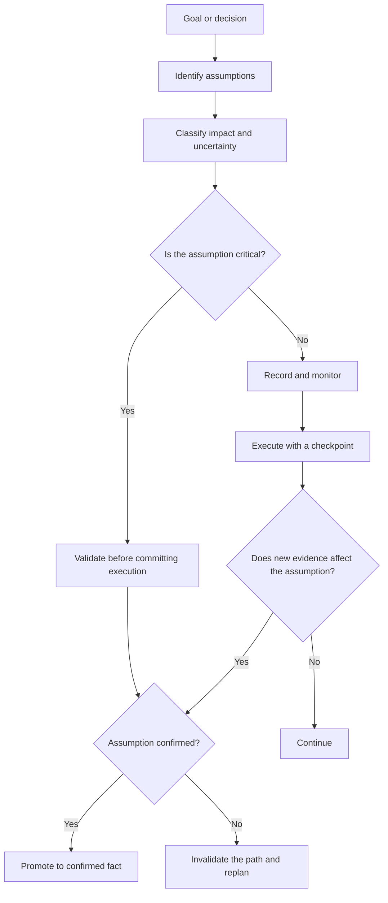
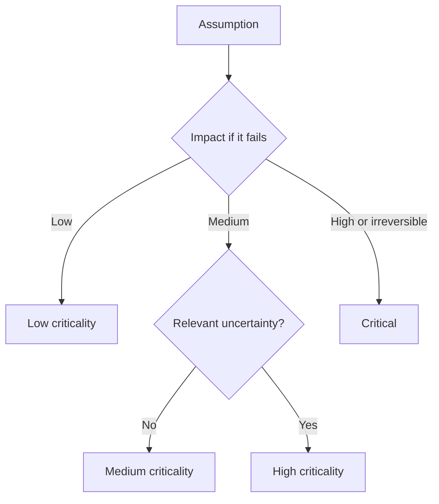
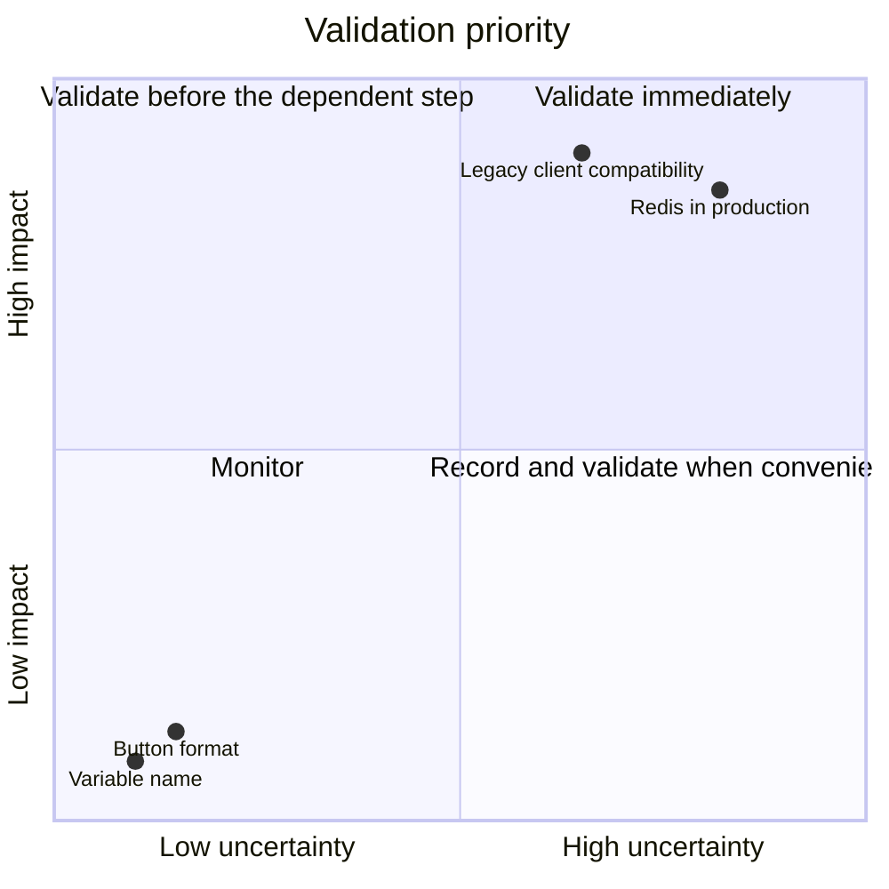
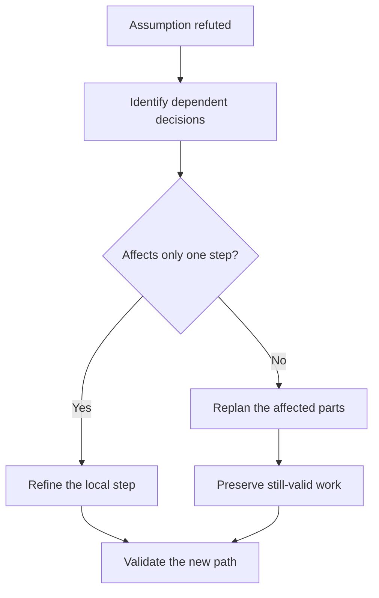

# Assumption Tracking

## Purpose

Use Assumption Tracking to keep important decisions from resting on hidden, unverified, or incorrect assumptions.

An assumption is something treated temporarily as true so that an analysis, plan, or implementation can move forward.

Examples:

```text
- The environment has Redis available.
- The API accepts the `status` parameter.
- Old clients tolerate the absence of the new field.
- The data volume fits within the defined memory limit.
- The user has permission to perform a given action.
- The library is compatible with the current framework version.
```

Technical assumptions can be necessary to guide investigation. Product decisions are not
assumptions the LLM may adopt: requirement, scope, UX, preferred architecture, data, security,
accepted risk, and acceptance belong to the user.

The problem is:

```text
- assuming without recording;
- implementing before validating a critical assumption;
- presenting a hypothesis as fact;
- ignoring contrary evidence;
- not knowing what to do when the assumption fails.
```

## Core principle

> Every relevant decision must make clear which conditions still need to be true for it to remain valid.


```mermaid
flowchart TD
    A[Goal or decision] --> B[Identify assumptions]
    B --> C[Classify impact and uncertainty]
    C --> D{Is the assumption critical?}

    D -- Yes --> E[Validate before committing execution]
    D -- No --> F[Record and monitor]

    E --> G{Assumption confirmed?}
    G -- Yes --> H[Promote to confirmed fact]
    G -- No --> I[Invalidate the path and replan]

    F --> J[Execute with a checkpoint]
    J --> K{Does new evidence affect the assumption?}
    K -- Yes --> G
    K -- No --> L[Continue]
```

## When to use

Use Assumption Tracking when the task involves:

```text
- incomplete or ambiguous requirements;
- architectural decisions;
- external dependencies;
- APIs, libraries, or tools not yet verified;
- integrations with other systems;
- migrations;
- security, permissions, or sensitive data;
- estimates of cost, volume, performance, or deadlines;
- multiple environments;
- legacy behavior;
- poorly documented business rules;
- root-cause hypotheses in debugging;
- actions with a high cost of reversal.
```

Good examples:

```text
- Planning asynchronous processing assuming a broker is available.
- Changing an API contract assuming compatibility with existing clients.
- Choosing a database assuming a given load volume.
- Building an integration assuming the vendor supports webhooks.
- Fixing a bug assuming the duplication comes from a double click.
- A technical recommendation based on a version not yet confirmed.
```

## When to avoid

Do not create a formal assumption record for trivial tasks.

Avoid or simplify when:

```text
- there is no relevant uncertainty;
- the answer depends only on content supplied by the user;
- there is a direct, easy-to-consult source of truth;
- the task is small, reversible, and local;
- recording assumptions costs more than executing and validating.
```

Examples where the technique is unnecessary:

```text
- Fixing an obvious syntax error.
- Translating a text.
- Rewriting a paragraph.
- Renaming a local variable with no external impact.
- Adjusting a title or a description.
```

## Relationship to other techniques

| Technique                                             | Responsibility                                                       |
| ----------------------------------------------------- | -------------------------------------------------------------------- |
| [Constraint Satisfaction](constraint-satisfaction.md) | Organizes requirements, prohibitions, and limits                     |
| Assumption Tracking                                   | Records conditions not yet confirmed                                 |
| [Plan and Execute](plan-and-execute.md)               | Defines steps and checkpoints                                        |
| [ReAct](react.md)                                     | Executes actions to reduce uncertainty                               |
| [Verification](verification.md)                       | Confirms, bounds, or refutes assumptions                             |
| [Decision Making](decision-making.md)                 | Chooses between strategies when distinct assumptions produce interdependent paths |
| [Critique and Refine](critique-and-refine.md)         | Fixes the plan or solution after an invalid assumption               |

### Integration rule

- Use **Constraint Satisfaction** to separate what is mandatory from what is desirable.
- Use **Assumption Tracking** to identify what is not yet fact.
- Use **Verification** to confirm or refute assumptions.
- Use **Plan and Execute** to insert checkpoints before actions that depend on critical assumptions.
- Use **Decision Making** when different assumptions lead to materially distinct strategies (search-with-pruning mode when the paths are interdependent).

## Information categories

Do not mix these concepts.

| Category        | Definition                                                           | Treatment                                    |
| --------------- | -------------------------------------------------------------------- | -------------------------------------------- |
| Confirmed fact  | Information observed, tested, or supported by reliable evidence      | Can drive decisions                          |
| Assumption      | Condition treated temporarily as true, but not proven                | Must be tracked                              |
| Hypothesis      | Possible explanation for a problem or behavior                       | Must be tested                               |
| Constraint      | Mandatory condition or limit the solution must respect               | Must be met                                  |
| Preference      | Desirable but negotiable characteristic                              | Optimize only after meeting the mandatory    |
| Risk            | Consequence if something goes wrong                                  | Must be mitigated or consciously accepted    |
| Unknown         | Missing information without a sufficient hypothesis                  | Must not be invented                         |

Example:

```text
Confirmed fact:
- The current API uses PostgreSQL.

Assumption:
- The database has enough capacity for the new analytical query.

Hypothesis:
- The slowness is caused by a missing index.

Constraint:
- No downtime allowed.

Preference:
- Avoid adding new infrastructure.

Risk:
- The migration may lock a table in production.

Unknown:
- The real volume of affected records has not been measured.
```

## Assumption template

Record relevant assumptions in the canonical format below. Use the full field set for critical assumptions; in lighter records, omit fields that add nothing, but always keep Assumption, Criticality, Required validation, Invalidation trigger, and Status.

```text
Assumption:
- [assumed condition]

Type:
- Technical, functional, infrastructure, external, security, compatibility, cost, volume, or deadline.

Impact if wrong:
- [consequence]

Criticality:
- Low, Medium, High, or Critical.

Current evidence:
- [why the assumption seems plausible]

Required validation:
- [test, contract, documentation, measurement, access, or confirmation]

Invalidation trigger:
- [what would prove the assumption is not valid]

Contingency action:
- [what to do if the assumption fails]

Status:
- Unverified, under validation, confirmed, partially confirmed, refuted, obsolete, blocked, or accepted as risk.
```

Example:

```text
Assumption:
- Redis is available and approved for use in the production environment.

Type:
- Infrastructure.

Impact if wrong:
- The Redis-based asynchronous queue strategy is not viable.

Criticality:
- High.

Current evidence:
- The project has a local Redis configuration.

Required validation:
- Confirm availability, capacity, and usage policy in production.

Invalidation trigger:
- The production environment has no Redis or does not allow new usage.

Contingency action:
- Evaluate existing queue infrastructure or run controlled processing through another mechanism.

Status:
- Unverified.
```

## Identifying assumptions

Look for language that signals uncertainty, condition, or implicit dependency.

Common signals:

```text
- "probably"
- "there should be"
- "maybe"
- "apparently"
- "I imagine"
- "if it supports"
- "as long as"
- "assuming that"
- "it should work"
- "seems compatible"
- "usually"
- "in theory"
```

Also look for assumptions hidden in seemingly simple decisions.

```text
Decision:
"Let's add caching."

Hidden assumptions:
- There is a measurable bottleneck.
- The data can be stale for some period.
- A viable invalidation mechanism exists.
- The environment supports caching.
- The gain justifies the complexity.
```

## Classification by criticality

Criticality depends on impact and uncertainty.


```mermaid
flowchart TD
    A[Assumption] --> B{Impact if it fails}
    B -- Low --> C[Low criticality]
    B -- Medium --> D{Relevant uncertainty?}
    D -- No --> E[Medium criticality]
    D -- Yes --> F[High criticality]
    B -- High or irreversible --> G[Critical]
```

| Criticality | Characteristic                                                    | Treatment                                          |
| ----------- | ----------------------------------------------------------------- | -------------------------------------------------- |
| Low         | Failure causes minor rework and is easily reversible              | Record only if useful                              |
| Medium      | Affects part of the solution or requires a localized adjustment   | Validate before the dependent step                 |
| High        | Can invalidate architecture, integration, or a relevant plan      | Validate early, before significant implementation  |
| Critical    | Can cause loss, exposure, unavailability, or a serious violation  | Do not proceed without sufficient validation       |

### Rule of thumb

```text
The higher the cost of the assumption being wrong,
the earlier it must be validated.
```

## Critical assumptions

Critical assumptions demand special attention.

Consider an assumption critical if, when wrong, it:

```text
- invalidates the chosen architecture;
- blocks a mandatory requirement;
- exposes data, secrets, or permissions;
- causes data loss or corruption;
- breaks compatibility;
- creates relevant financial cost;
- forces rework across many parts;
- prevents rollback;
- makes the deadline unfeasible;
- depends on an external system outside the project's control.
```

Examples:

```text
- The external service allows the required call volume.
- The migration can happen without downtime.
- The authentication provider meets the regulatory requirement.
- The library is compatible with the mandatory runtime.
- The legacy client supports the new contract.
```

Do not implement at length on top of an unverified critical assumption.

## Validation order

Validate first the assumptions with the highest combination of impact and uncertainty.


```mermaid
quadrantChart
    title Validation priority
    x-axis Low uncertainty --> High uncertainty
    y-axis Low impact --> High impact
    quadrant-1 Validate immediately
    quadrant-2 Validate before the dependent step
    quadrant-3 Monitor
    quadrant-4 Record and validate when convenient
    "Redis in production": [0.82, 0.85]
    "Button format": [0.15, 0.12]
    "Legacy client compatibility": [0.65, 0.90]
    "Variable name": [0.10, 0.08]
```

Use this order:

```text
1. Critical and uncertain assumptions.
2. Assumptions that define architecture or contracts.
3. Assumptions that affect security, compatibility, or data.
4. Assumptions that affect cost, performance, or deadlines.
5. Local and easily reversible assumptions.
```

## Validation methods

Choose the smallest action that confirms or refutes the assumption.

| Assumption type         | Preferred validation                                                       |
| ----------------------- | -------------------------------------------------------------------------- |
| API or contract         | Schema, official documentation, code, or a controlled call                 |
| Library or framework    | Official docs for the version in use, changelog, or a minimal test         |
| Infrastructure          | Real configuration, environment, owning team, or a controlled run          |
| Compatibility           | Test with an old client, versioned contract, or usage logs                 |
| Performance             | Metric, profiling, benchmark, or controlled load                           |
| Data volume             | Query, report, observed metric, or historical data                         |
| Security                | Policy, authorization test, configuration review, or threat modeling       |
| Business rule           | Specification, responsible user, documents, or current behavior            |
| Bug cause               | Reproduction, logs, tracing, isolated test, or a controlled experiment     |

```text
Do not validate a critical technical assumption with opinion, memory, or a generic example.
```

## Chained assumptions

Some assumptions depend on others.

```text
- validate the most fundamental assumption first;
- do not treat a derived assumption as confirmed;
- update all dependent decisions when the base changes.
```

Example:

```text
Base assumption:
- The queue service is available in production.

Derived assumption:
- We can generate reports in the background.

Second-level derived assumption:
- The interface can respond immediately and poll status later.
```

If the first fails, the following ones must be reassessed.

## Time-bound assumptions

Some assumptions are true only for a certain period.

```text
Examples:
- Old clients still consume the previous version of the API.
- The current infrastructure supports today's volume, but not the future projection.
- A credential is valid until a certain date.
- A library is compatible only while the current runtime version is kept.
```

Record:

```text
- when the assumption was verified;
- until when it should be considered valid;
- which event requires revalidation;
- who or which system can change its validity.
```

Example:

```text
Assumption:
- No client uses the legacy endpoint.

Verified against:
- Logs from the last 30 days.

Revalidation trigger:
- New client integrated or new app version released.

Action:
- Monitor usage before removing the endpoint.
```

## Assumptions about users and requirements

Do not turn missing information into a permanent decision.

```text
Bad:
"The user wants an immediate response."

Better:
"An immediate response is a hypothesis; validate whether the user accepts asynchronous processing with status."
```

```text
Bad:
"The user does not need auditing."

Better:
"No auditing requirement has been identified; check whether the domain, security, or internal rules require traceability."
```

When the material question is factual, validate it through context, code, or documentation. When it
is a human decision, use [pelizzai-interview-me](../../pelizzai-interview-me/SKILL.md), one question
at a time, with a recommendation; documentation does not decide for the user.

## Assumptions in debugging

When diagnosing a bug, treat each possible cause as a trackable hypothesis. For systematic root cause investigation, combine with [Root Cause Analysis](root-cause-analysis.md).

```text
Problem:
- Duplicate orders.

Hypothesis A:
- The user double-clicks.

Hypothesis B:
- The client retries on network failure.

Hypothesis C:
- The backend does not enforce idempotency.

Hypothesis D:
- The worker consumes a message more than once.
```

For each hypothesis:

```text
- current evidence;
- validation experiment;
- expected result;
- discard condition;
- impact of confirmation.
```

Do not fix the first plausible hypothesis without validation.

## Assumptions and replanning

When an assumption fails, do not just change the local detail.

Check the impact on the whole plan.


```mermaid
flowchart TD
    A[Assumption refuted] --> B[Identify dependent decisions]
    B --> C{Affects only one step?}
    C -- Yes --> D[Refine the local step]
    C -- No --> E[Replan the affected parts]
    E --> F[Preserve still-valid work]
    D --> G[Validate the new path]
    F --> G
```

### Impact rule

```text
Refuted assumption:
- "The API does not support server-side filtering."

Possible consequences:
- The filtering strategy has to change.
- Pagination may become incorrect if filtering happens on the client.
- The data volume may make the fallback unfeasible.
- Performance criteria need to be reassessed.
```

Do not apply a local workaround without checking whether the assumption affects architecture, security, compatibility, or performance.

## Recording conditional decisions

When a decision depends on an assumption still open, record it explicitly.

```text
Conditional decision:
- Use queue-based processing, provided the existing infrastructure supports the volume and the defined SLA.

Assumption:
- Broker and workers are available in production.

Validation action:
- Confirm configuration, capacity, and observability.

Alternative plan:
- Controlled batch processing or newly approved infrastructure.
```

This prevents a conditional recommendation from being read as a final decision.

## Assumption states

| Status                  | Meaning                                                                      |
| ----------------------- | ---------------------------------------------------------------------------- |
| Unverified              | Exists, but has not been investigated yet                                    |
| Under validation        | An action is in progress to confirm it                                       |
| Confirmed               | Sufficient evidence for the context                                          |
| Partially confirmed     | Valid only for part of the scope or under conditions                         |
| Refuted                 | Evidence shows the assumption is false                                       |
| Obsolete                | Was valid, but the context changed                                           |
| Blocked                 | Cannot be validated due to missing access, permission, or context            |
| Accepted as risk        | Could not be validated, but the decision proceeds consciously with mitigation |

Do not treat "accepted as risk" as "confirmed".

## Conscious risk acceptance

In some cases, it will not be possible to validate an assumption before moving forward.

Only record an accepted risk after user ratification and when:

```text
- the assumption is not critical;
- the action is reversible;
- a viable contingency exists;
- the impact is known;
- the cost of validating now is disproportionate;
- the limitation is communicated.
```

Recommended format:

```text
Assumption:
- [unverified condition]

Accepted risk:
- [possible impact]

Reason:
- [why it will not be validated now]

Mitigation:
- [rollback, feature flag, monitoring, limit, or alternative plan]

Review trigger:
- [event that will require revalidation]
```

Never accept as risk a critical assumption about security, data, or an irreversible action without sufficient evidence.

## Anti-patterns

### 1. Invisible assumption

```text
Bad:
"Let's use a queue because the process is heavy."

Hidden assumption:
- The environment has a queue and worker available.

Better:
"A queue is an option conditioned on broker and worker availability in production."
```

### 2. Treating a hypothesis as fact

```text
Bad:
"The problem is the cache."

Better:
"The cache is a hypothesis; measure hit rate, invalidation, and behavior without the cache before concluding."
```

### 3. Validating too late

```text
Bad:
Implementing the whole integration before discovering the vendor does not support the required flow.

Better:
Validating the integration's capabilities, authentication, and limits before building dependencies around it.
```

### 4. No contingency defined

```text
Bad:
"If Redis doesn't exist, we'll figure it out later."

Better:
"If Redis is not available, use the existing job infrastructure or reassess the processing strategy."
```

### 5. Confusing constraint with assumption

```text
Bad:
"Do not use a paid service" treated as something to validate.

Better:
"Do not use a paid service" is a mandatory constraint; "the free service supports the volume" is an assumption.
```

### 6. Ignoring temporal validity

```text
Bad:
"Old clients don't use the endpoint" based on an old observation.

Better:
"No usage in the last 30 days; revalidate before removing the endpoint."
```

### 7. Continuing after refutation

```text
Bad:
A test shows the contract does not support a given field, but the implementation keeps assuming support.

Better:
Update the plan, remove the invalid assumption, and choose a compatible alternative.
```

## Examples

### Example 1 — API compatibility

```text
Goal:
- Add a `priority` field to the public endpoint.

Assumption:
- Existing clients tolerate a missing field or a default value.

Criticality:
- Critical.

Current evidence:
- Some clients use an old version of the SDK.

Validation:
- Run contract tests with old clients and review version telemetry.

Invalidation trigger:
- An old client fails when receiving or omitting the field.

Contingency:
- Make the field optional, define a compatible default, and version the contract before making it mandatory.

Status:
- Under validation.
```

### Example 2 — Performance

```text
Goal:
- Improve the response time of the user search.

Assumption:
- The database query is the main bottleneck.

Criticality:
- Medium.

Current evidence:
- Users report slowness, but there is no profiling.

Validation:
- Measure API time, query time, serialization, and external calls.

Invalidation trigger:
- The database accounts for a small share of the total latency.

Contingency:
- Investigate serialization, network, cache, frontend, or external integration.

Status:
- Unverified.
```

## Summary instruction for the agent

```text
- Validate first the assumptions with the highest combination of impact and uncertainty; do not implement extensively on top of an unverified critical assumption.
- Do not treat assumptions as facts, and do not accept internal convergence as proof.
- Update decisions and dependencies when an assumption is confirmed, refuted, or becomes obsolete; replan when it affects more than one step.
- Accept risk only when the assumption is not critical, the action is reversible, and there is clear mitigation.
- Before concluding, communicate material assumptions still open, limitations, and contingencies.
- Do not expose detailed chain of thought; communicate only relevant assumptions, evidence, impact, decision, and limitations.
```

## Related techniques

- [Constraint Satisfaction](constraint-satisfaction.md)
- [Verification](verification.md)
- [Plan and Execute](plan-and-execute.md)
- [ReAct](react.md)
- [Decision Making](decision-making.md)
- [Critique and Refine](critique-and-refine.md)
- [Root Cause Analysis](root-cause-analysis.md)

Back to the [technique catalog](../SKILL.md).
