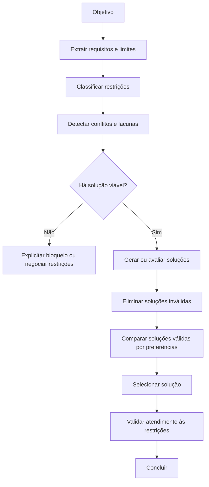
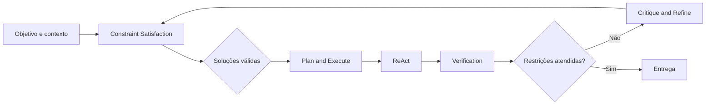
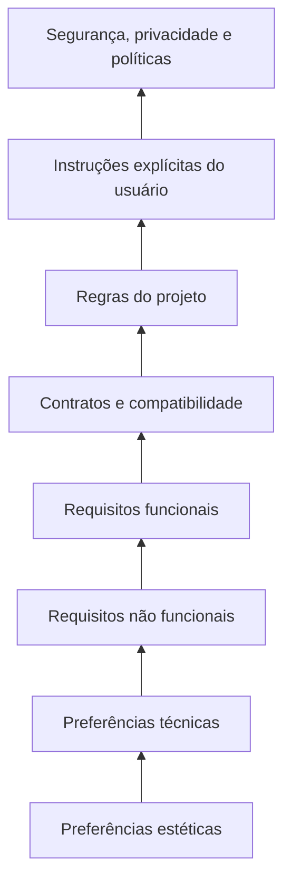
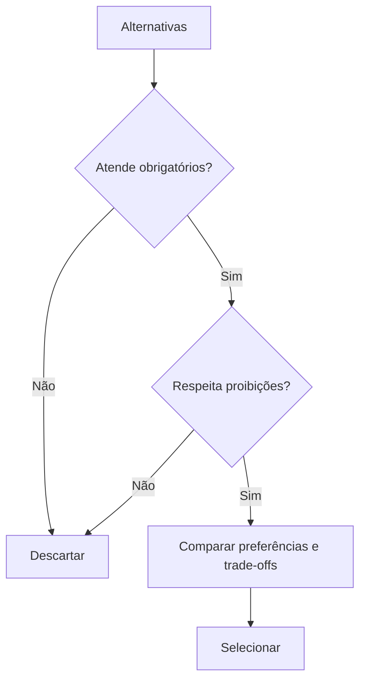
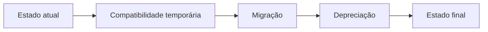

# Constraint Satisfaction

## Objetivo

Use Constraint Satisfaction para garantir que uma solução, plano, recomendação, implementação ou resposta respeite as condições que realmente limitam o problema.

A técnica organiza requisitos em quatro grupos:

1. **restrições obrigatórias**: não podem ser violadas;
2. **proibições**: comportamentos ou soluções que não podem ocorrer;
3. **preferências**: características desejáveis, mas negociáveis;
4. **critérios de otimização**: fatores usados para escolher entre soluções válidas.

O objetivo não é encontrar a solução "mais elegante".

O objetivo é encontrar uma solução **válida primeiro** e, entre as válidas, selecionar a mais adequada ao contexto.

## Princípio central

> Uma solução que viola uma restrição obrigatória não é uma solução aceitável, mesmo que seja rápida, barata, popular ou tecnicamente sofisticada.



## Quando usar

Use Constraint Satisfaction quando a tarefa envolver:

```text
- requisitos explícitos do usuário;
- regras de projeto, organização ou domínio;
- limitações técnicas, de stack ou de infraestrutura;
- compatibilidade com versões, contratos ou APIs;
- segurança, privacidade, permissões ou dados sensíveis;
- orçamento, prazo, performance ou consumo de recursos;
- decisões com trade-offs;
- múltiplas alternativas de implementação;
- recomendações de ferramentas, bibliotecas ou arquitetura;
- tarefas com proibições claras;
- entregáveis que precisam obedecer a formato ou estrutura específica.
```

Exemplos adequados:

```text
- Escolher banco de dados sem introduzir serviço gerenciado pago.
- Implementar feature preservando compatibilidade com clientes antigos.
- Criar API que exige autenticação, paginação e formato de erro existente.
- Recomendar biblioteca compatível com determinada versão de framework.
- Criar componente usando Tailwind sem adicionar CSS novo.
- Escrever documento que deve conter tópicos obrigatórios e evitar dados sensíveis.
- Planejar migração com zero downtime e rollback possível.
```

## Quando evitar

Não use Constraint Satisfaction como processo formal para tarefas sem limites materiais.

Evite ou simplifique quando:

```text
- a tarefa possui uma única ação clara;
- não há alternativas reais;
- as restrições já estão implícitas e triviais;
- a resposta é criativa e o usuário não definiu limites relevantes;
- criar matriz de restrições custaria mais do que executar;
- a tarefa é tradução, reescrita ou ajuste pontual simples.
```

Exemplos inadequados:

```text
- Corrigir um typo.
- Explicar o que é uma variável.
- Traduzir uma frase curta.
- Renomear uma função local.
- Ajustar uma vírgula em um texto.
```

## Relação com outras técnicas

| Técnica                  | Responsabilidade                                                 |
| ------------------------ | ---------------------------------------------------------------- |
| Structured Decomposition | Divide o problema em partes coesas                               |
| Plan and Execute         | Organiza a sequência de execução                                 |
| Decision Making          | Escolhe entre soluções válidas, inclusive caminhos interdependentes |
| Constraint Satisfaction  | Elimina caminhos que violam requisitos e prioriza opções válidas |
| ReAct                    | Executa ações e atualiza o estado                                |
| Verification             | Confirma que requisitos foram realmente atendidos                |
| Critique and Refine      | Corrige violações, lacunas ou inconsistências detectadas         |



### Regra de integração

Use Constraint Satisfaction antes de comprometer a solução.

Depois de escolher uma solução válida:

- use **Plan and Execute** para organizar o trabalho;
- use **ReAct** para executar cada etapa;
- use **Verification** para confirmar que as restrições foram atendidas na prática;
- use **Critique and Refine** caso a validação revele violação ou lacuna.

## Tipos de restrição

Esta é a taxonomia canônica das restrições. As restrições **obrigatórias** e as **proibições** são restrições duras (não podem ser violadas); as **preferências** são restrições suaves (podem ser sacrificadas com justificativa).

### 1. Restrição obrigatória (dura)

Uma condição que precisa ser satisfeita para que a solução seja válida.

```text
Exemplos:
- Deve funcionar com Angular 20.
- Não pode expor dados pessoais.
- Precisa manter compatibilidade com API atual.
- Deve usar o banco já adotado no projeto.
- Precisa respeitar o orçamento máximo definido.
- Deve funcionar em ambiente Windows.
```

Uma solução que viola uma restrição obrigatória deve ser descartada ou tratada como bloqueada.

### 2. Proibição (dura)

Uma ação, tecnologia, comportamento ou resultado que não pode ocorrer. Tratada como restrição obrigatória negativa.

```text
Exemplos:
- Não alterar arquivos `.env`.
- Não incluir segredos no repositório.
- Não usar dependência sem licença compatível.
- Não bloquear a thread principal.
- Não usar `setTimeout` para mascarar sincronização.
- Não quebrar clientes existentes.
```

### 3. Preferência (suave)

Uma característica desejável, mas que pode ser sacrificada para cumprir algo mais importante. Preferências não devem anular requisitos obrigatórios.

```text
Exemplos:
- Preferir solução simples.
- Preferir reutilizar componentes existentes.
- Preferir menor número de dependências.
- Preferir execução mais rápida.
- Preferir menor custo operacional.
- Preferir biblioteca com comunidade maior.
```

### 4. Critério de otimização

Um fator usado para comparar soluções que já são válidas. Veja [Decision Making](decision-making.md) ao otimizar entre soluções válidas.

```text
Exemplos:
- Menor complexidade.
- Menor custo.
- Melhor performance.
- Menor risco operacional.
- Maior manutenibilidade.
- Menor prazo de implementação.
- Melhor experiência do usuário.
```

### 5. Premissa

Uma condição assumida como verdadeira para viabilizar uma solução.

```text
Exemplos:
- Redis já está disponível no ambiente.
- A API suporta paginação.
- O usuário possui permissão de administrador.
- O serviço externo aceita webhooks.
```

Premissas não são restrições confirmadas. Devem ser verificadas antes de orientar decisões críticas. Para premissas desconhecidas ou ainda não validadas, use [Assumption Tracking](assumption-tracking.md), que é a técnica dona do rastreamento de premissas.

## Hierarquia de restrições

Quando houver conflito, aplique esta ordem padrão:

```text
1. Segurança, privacidade, legalidade e políticas obrigatórias.
2. Instruções explícitas do usuário.
3. Regras obrigatórias do projeto ou organização.
4. Contratos técnicos e compatibilidade.
5. Requisitos funcionais.
6. Requisitos não funcionais.
7. Preferências do usuário.
8. Preferências técnicas ou estéticas.
```



### Regra de conflito

> Não sacrifique uma restrição de nível superior para satisfazer uma preferência de nível inferior.

Exemplo:

```text
Errado:
Usar uma biblioteca mais conveniente que não suporta a versão obrigatória do framework.

Correto:
Eliminar a biblioteca por incompatibilidade e comparar apenas opções viáveis.
```

## Modelo de restrições

Antes de escolher ou implementar uma solução, registre o estado mínimo no formato canônico abaixo.

```text
Objetivo:
- [resultado esperado]

Restrições obrigatórias:
- [condições que não podem ser violadas]

Proibições:
- [ações ou resultados vedados]

Preferências:
- [características desejáveis]

Critérios de otimização:
- [como comparar soluções válidas]

Premissas a validar:
- [condições ainda não confirmadas]

Restrições desconhecidas:
- [informações ausentes que podem afetar a solução]

Conflitos:
- [restrições incompatíveis ou potencialmente incompatíveis]

Soluções válidas:
- [alternativas que atendem obrigatórios]

Trade-offs:
- [preferências sacrificadas ou custos aceitos]

Critério de conclusão:
- [como confirmar que a entrega atende ao necessário]
```

Exemplo:

```text
Objetivo:
- Implementar exportação de pedidos em CSV.

Restrições obrigatórias:
- Respeitar filtros ativos.
- Permitir somente usuários autorizados.
- Não incluir dados sensíveis.
- Funcionar com a API atual.

Proibições:
- Não gerar arquivo completo em memória se o volume puder ser alto.
- Não expor dados de outros usuários.

Preferências:
- Reutilizar componentes e serviços existentes.
- Evitar nova infraestrutura.

Critérios de otimização:
- Menor complexidade operacional.
- Melhor experiência de uso.

Premissas a validar:
- A API atual suporta streaming ou paginação suficiente.
```

## Extração de restrições

As restrições podem estar distribuídas em diferentes lugares.

Procure em:

```text
- pedido explícito do usuário;
- mensagens anteriores;
- documentação do projeto;
- AGENTS.md, README, CONTRIBUTING.md e regras internas;
- código existente;
- contratos de API;
- schemas;
- testes;
- infraestrutura;
- configurações;
- políticas de segurança;
- limitações de ferramentas;
- requisitos legais, financeiros ou operacionais.
```

Não assuma que a primeira descrição do usuário contém todas as restrições relevantes.

## Processo de Constraint Satisfaction

### 1. Extrair

Identifique todas as condições relevantes.

```text
Perguntas:
- O que precisa obrigatoriamente acontecer?
- O que não pode acontecer?
- Quais tecnologias ou versões são obrigatórias?
- Quais dados, contratos ou fluxos precisam ser preservados?
- Há prazo, orçamento, ambiente ou permissão limitada?
- Existe compatibilidade com comportamento anterior?
- Quais preferências são negociáveis?
```

### 2. Normalizar

Reescreva requisitos vagos em forma verificável.

```text
Ruim:
"Tem que ser rápido."

Melhor:
"A interação principal deve responder sem bloquear a interface; operações pesadas devem ocorrer fora do request principal quando necessário."
```

```text
Ruim:
"Use uma solução barata."

Melhor:
"Não introduzir custo recorrente adicional sem autorização explícita."
```

### 3. Classificar

Classifique cada item como:

```text
- Obrigatório.
- Proibição.
- Preferência.
- Critério de otimização.
- Premissa.
- Desconhecido.
```

Não trate uma preferência como obrigatória apenas porque é conveniente.

Não trate uma proibição como preferência apenas porque a solução alternativa é mais fácil.

### 4. Detectar conflitos

Procure condições impossíveis ou contraditórias.

Exemplos de conflito:

```text
- "Não usar serviços externos" + "Usar autenticação por Google OAuth".
- "Zero downtime" + "Alterar coluna obrigatória sem estratégia de migração".
- "Sem custo adicional" + "Usar provedor pago obrigatório".
- "Sem alteração de backend" + "Adicionar regra que precisa de autorização no servidor".
- "Resposta instantânea" + "Gerar relatório muito grande no mesmo request".
```

### 5. Avaliar viabilidade

Antes de implementar, determine se existe caminho que atende às restrições obrigatórias.

```text
Possíveis resultados:
- Viável: existe ao menos uma solução válida.
- Viável com trade-off: solução atende obrigatórios, mas sacrifica preferências.
- Condicional: depende de premissa ainda não validada.
- Bloqueado: não existe solução válida com as restrições atuais.
- Inconsistente: requisitos se contradizem e precisam de decisão.
```

Não esconda inviabilidade com solução que viola requisito crítico.

### 6. Filtrar soluções inválidas

Antes de comparar custo, elegância ou popularidade, descarte soluções que violam obrigatórios.



Exemplo:

```text
Alternativas:
A. Usar biblioteca nova que exige Node incompatível.
B. Reutilizar biblioteca existente compatível.
C. Implementar solução customizada.

Filtro:
- A é descartada por incompatibilidade obrigatória.
- B e C seguem para comparação.
```

### 7. Otimizar entre soluções válidas

Somente depois de garantir validade, compare preferências. Quando a comparação envolver trade-offs relevantes, conduza a escolha com [Decision Making](decision-making.md).

```text
Critérios possíveis:
- Complexidade.
- Custo.
- Prazo.
- Performance.
- Segurança.
- Manutenibilidade.
- Observabilidade.
- Reversibilidade.
- Experiência do usuário.
```

Não crie pontuações artificiais.

```text
Ruim:
"Solução A = 9, Solução B = 7."

Melhor:
"Solução A exige nova infraestrutura e reduz latência.
Solução B reutiliza recursos existentes, mas tem maior custo de processamento.
Ambas atendem os requisitos obrigatórios; a escolha depende de orçamento versus performance."
```

### 8. Validar no resultado final

Antes de concluir, verifique se a solução real atende as restrições, não apenas o plano.

```text
Checklist:
[ ] Todos os requisitos obrigatórios foram atendidos.
[ ] Nenhuma proibição foi violada.
[ ] Premissas críticas foram confirmadas.
[ ] Preferências sacrificadas foram justificadas.
[ ] Trade-offs relevantes foram comunicados.
[ ] Compatibilidade foi validada quando aplicável.
[ ] Segurança e privacidade foram consideradas.
[ ] Não há requisito oculto conhecido sem tratamento.
```

## Restrições globais e locais

### Restrição global

Afeta toda a solução.

```text
Exemplos:
- Não usar serviços pagos.
- O projeto deve funcionar em Windows e Linux.
- Nenhum segredo pode ser exposto.
- A solução precisa manter compatibilidade com clientes existentes.
```

### Restrição local

Afeta apenas uma parte.

```text
Exemplos:
- O endpoint de exportação deve limitar 10 mil registros por request.
- O componente deve usar design system existente.
- A migração deve possuir rollback.
- O worker deve ser idempotente.
```

Não trate uma restrição local como global sem evidência.

Não ignore restrição global por ela não aparecer em uma subtarefa específica.

## Restrições temporais

Algumas restrições variam por fase.

```text
Exemplos:
- Durante migração, clientes antigos e novos precisam coexistir.
- Após depreciação, contrato antigo pode ser removido.
- Em produção, mudanças exigem rollback.
- Em ambiente local, mocks podem ser permitidos; em produção, não.
```



Ao analisar restrições temporais, defina:

```text
- qual regra vale agora;
- quando ela muda;
- qual evento permite a transição;
- como evitar quebra durante coexistência.
```

## Restrições de compatibilidade

Ao alterar sistemas existentes, verifique:

```text
- versões de runtime;
- versões de bibliotecas;
- contratos de API;
- schemas;
- payloads;
- banco de dados;
- clientes existentes;
- variáveis de ambiente;
- browsers ou sistemas operacionais;
- migrações e rollback;
- integrações externas.
```

Exemplo:

```text
Objetivo:
Adicionar campo obrigatório `priority`.

Restrição:
Clientes antigos não enviam esse campo.

Solução inválida:
Tornar o campo obrigatório imediatamente no endpoint público.

Solução viável:
Aceitar ausência temporariamente, definir valor padrão compatível, atualizar clientes e só então tornar obrigatório em versão futura.
```

## Restrições de segurança e privacidade

Sempre trate os itens abaixo como restrições duras, salvo instrução legítima e segura em sentido diferente:

```text
- Não expor segredos.
- Não registrar dados sensíveis sem necessidade.
- Não confiar em validação apenas do cliente.
- Não permitir acesso entre usuários sem autorização.
- Não alterar permissões sem validar o alvo.
- Não executar ação destrutiva sem confirmação adequada.
- Não usar dados pessoais além do necessário.
```

Uma solução funcional que viola segurança não é uma solução válida.

## Restrições de recurso

Considere limitações de:

```text
- tempo;
- orçamento;
- memória;
- CPU;
- rede;
- limite de API;
- custo de tokens;
- latência;
- armazenamento;
- equipe disponível;
- permissões;
- janelas de manutenção.
```

Exemplo:

```text
Problema:
Processar 2 milhões de registros.

Restrição:
Não pode carregar todos os registros em memória.

Consequência:
Soluções que criam lista completa em memória são inválidas.
```

## Tratamento de conflito

Quando restrições entrarem em conflito:

### 1. Confirmar o conflito

Não assuma conflito onde existe uma solução de compromisso.

```text
Exemplo:
"Sem serviço externo" e "Google OAuth" parecem conflitantes.

Possível resolução:
Usar Google apenas como provedor de identidade, sem introduzir banco de dados ou serviço externo adicional além do OAuth exigido.
```

### 2. Aplicar hierarquia

Priorize requisitos superiores.

```text
Exemplo:
Segurança obrigatória supera preferência por implementação mais rápida.
```

### 3. Procurar reformulação

Verifique se o objetivo pode ser atendido por outra abordagem.

```text
Exemplo:
"Zero downtime" e alteração estrutural podem coexistir com estratégia expand-contract.
```

### 4. Declarar inviabilidade

Quando não houver solução válida:

```text
- explique quais restrições entram em conflito;
- mostre o impacto;
- apresente opções de relaxamento;
- não finja que existe solução perfeita.
```

Formato recomendado:

```text
Conflito:
- [restrição A] é incompatível com [restrição B].

Impacto:
- [por que não é possível atender ambas]

Opções:
1. [relaxar condição A]
2. [relaxar condição B]
3. [alterar escopo]
4. [adiar requisito]

Recomendação:
- [opção mais segura ou proporcional]
```

## Anti-padrões

### 1. Otimizar antes de validar

```text
Ruim:
Escolher a solução mais rápida antes de confirmar compatibilidade.

Melhor:
Eliminar opções incompatíveis e comparar velocidade apenas entre soluções válidas.
```

### 2. Tratar preferência como requisito obrigatório

```text
Ruim:
"Precisamos usar biblioteca X porque é popular."

Melhor:
"Biblioteca X é preferida, mas será descartada se não atender compatibilidade, segurança ou manutenção."
```

### 3. Ignorar proibição implícita

```text
Ruim:
Adicionar segredo no código porque a tarefa não disse explicitamente para não fazer isso.

Melhor:
Aplicar regras globais de segurança e configuração.
```

### 4. Assumir premissa como fato

```text
Ruim:
Planejar fila usando Redis sem verificar se Redis está disponível.

Melhor:
Registrar Redis como premissa e confirmar infraestrutura antes da decisão.
```

### 5. Esconder inviabilidade

```text
Ruim:
Prometer zero downtime sem estratégia de compatibilidade ou rollback.

Melhor:
Declarar que a restrição exige migração gradual, janela controlada ou mudança de requisito.
```

### 6. Usar matriz decorativa

```text
Ruim:
Criar tabela de requisitos sem usar seus resultados para eliminar ou selecionar opções.

Melhor:
Usar a matriz para descartar soluções inválidas e justificar trade-offs.
```

### 7. Ignorar restrições temporais

```text
Ruim:
Remover contrato antigo antes de todos os clientes migrarem.

Melhor:
Definir coexistência, migração, monitoramento e depreciação.
```

## Exemplos

### Exemplo 1 — Escolha de biblioteca

```text
Objetivo:
Escolher biblioteca de autenticação.

Restrições obrigatórias:
- Compatível com FastAPI atual.
- Suporte a OAuth com Google.
- Integração com PostgreSQL.
- Manutenção ativa.
- Sem expor credenciais.

Proibições:
- Não criar autenticação customizada insegura.
- Não depender de versão incompatível de Python.

Preferências:
- Menor curva de adoção.
- Boa documentação.
- Menor quantidade de código próprio.

Processo:
1. Eliminar bibliotecas incompatíveis com FastAPI ou OAuth.
2. Confirmar suporte na documentação oficial.
3. Comparar opções válidas por manutenção, integração e custo de adoção.
4. Registrar limitações e estratégia de sessão.
```

### Exemplo 2 — Migração de banco

```text
Objetivo:
Alterar coluna usada por clientes em produção.

Restrições obrigatórias:
- Zero downtime.
- Clientes antigos continuam funcionando.
- Rollback disponível.
- Dados existentes preservados.

Proibições:
- Não remover coluna antiga antes da migração dos consumidores.
- Não executar alteração destrutiva sem backup.

Preferências:
- Menor duração de coexistência.
- Menor custo operacional.

Solução viável:
1. Adicionar estrutura nova.
2. Manter leitura compatível.
3. Fazer backfill.
4. Migrar consumidores.
5. Monitorar uso do contrato antigo.
6. Depreciar e remover após confirmação.
```

## Instrução resumida para o agente

Pontos de execução que reforçam ou complementam o processo acima:

```text
1. Não trate premissas como fatos; valide premissas críticas (ver Assumption Tracking).
2. Elimine soluções que violem requisitos obrigatórios ou proibições antes de comparar preferências.
3. Compare preferências apenas entre soluções válidas (ver Decision Making).
4. Declare inviabilidade quando não existir solução que satisfaça as restrições atuais.
5. Registre trade-offs e preferências sacrificadas.
6. Antes de concluir, valide que o resultado real atende às restrições, não apenas o plano.
7. Não exponha cadeia de pensamento detalhada; comunique requisitos relevantes, conflitos, trade-offs, decisão, evidências e limitações.
```

## Técnicas relacionadas

| Técnica | Relação |
| ------- | ------- |
| [Plan and Execute](plan-and-execute.md) | Organiza a execução após escolher uma solução válida |
| [Verification](verification.md) | Confirma que as restrições foram atendidas na prática |
| [Critique and Refine](critique-and-refine.md) | Corrige violações ou lacunas reveladas na validação |
| [Structured Decomposition](structured-decomposition.md) | Divide o problema em partes coesas |
| [ReAct](react.md) | Executa ações e atualiza o estado |
| [Decision Making](decision-making.md) | Escolhe entre soluções válidas por trade-offs |
| [Assumption Tracking](assumption-tracking.md) | Rastreia e valida premissas desconhecidas |

Voltar ao [catálogo de técnicas](../SKILL.md).
