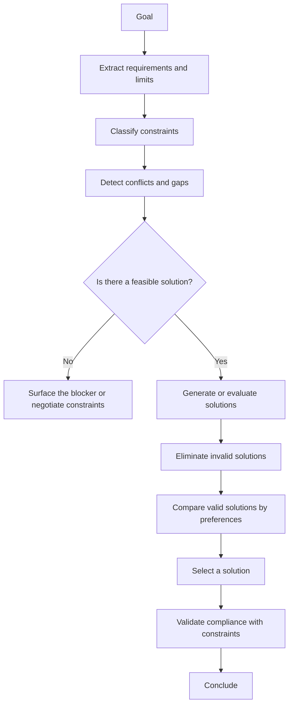
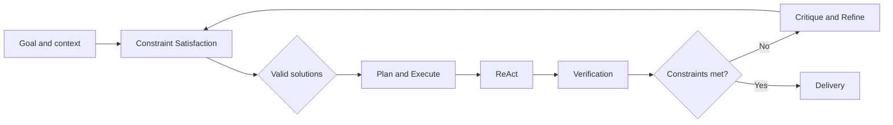
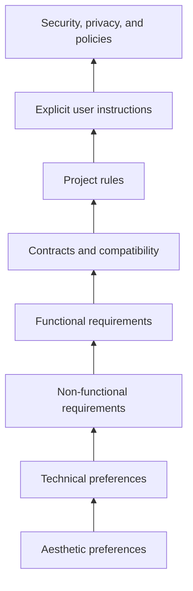
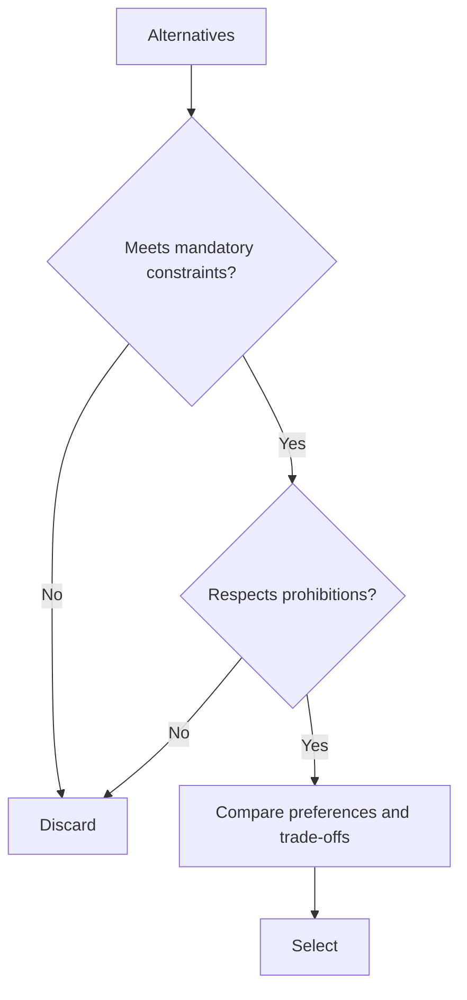
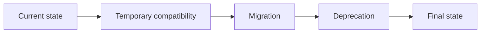

# Constraint Satisfaction

## Purpose

Use Constraint Satisfaction to ensure that a solution, plan, recommendation, implementation, or answer respects the conditions that actually constrain the problem.

The technique organizes requirements into four groups:

1. **mandatory constraints**: cannot be violated;
2. **prohibitions**: behaviors or solutions that must not occur;
3. **preferences**: desirable but negotiable characteristics;
4. **optimization criteria**: factors used to choose among valid solutions.

The goal is not to find the "most elegant" solution.

The goal is to find a **valid solution first** and, among the valid ones, select the one best suited to the context.

## Core principle

> A solution that violates a mandatory constraint is not an acceptable solution, even if it is fast, cheap, popular, or technically sophisticated.


```mermaid
flowchart TD
    A[Goal] --> B[Extract requirements and limits]
    B --> C[Classify constraints]
    C --> D[Detect conflicts and gaps]
    D --> E{Is there a feasible solution?}

    E -- No --> F[Surface the blocker or negotiate constraints]
    E -- Yes --> G[Generate or evaluate solutions]

    G --> H[Eliminate invalid solutions]
    H --> I[Compare valid solutions by preferences]
    I --> J[Select a solution]
    J --> K[Validate compliance with constraints]
    K --> L[Conclude]
```

## When to use

Use Constraint Satisfaction when the task involves:

```text
- explicit user requirements;
- project, organization, or domain rules;
- technical, stack, or infrastructure limitations;
- compatibility with versions, contracts, or APIs;
- security, privacy, permissions, or sensitive data;
- budget, deadline, performance, or resource consumption;
- decisions with trade-offs;
- multiple implementation alternatives;
- recommendations of tools, libraries, or architecture;
- tasks with clear prohibitions;
- deliverables that must follow a specific format or structure.
```

Good examples:

```text
- Choosing a database without introducing a paid managed service.
- Implementing a feature while preserving compatibility with legacy clients.
- Building an API that requires authentication, pagination, and the existing error format.
- Recommending a library compatible with a given framework version.
- Building a component with Tailwind without adding new CSS.
- Writing a document that must cover mandatory topics and avoid sensitive data.
- Planning a migration with zero downtime and a possible rollback.
```

## When to avoid

Do not use Constraint Satisfaction as a formal process for tasks with no material limits.

Avoid or simplify when:

```text
- the task has a single clear action;
- there are no real alternatives;
- the constraints are already implicit and trivial;
- the answer is creative and the user set no relevant limits;
- building a constraint matrix would cost more than executing;
- the task is a translation, a rewrite, or a simple one-off tweak.
```

Poor examples:

```text
- Fixing a typo.
- Explaining what a variable is.
- Translating a short sentence.
- Renaming a local function.
- Adjusting a comma in a text.
```

## Relationship to other techniques

| Technique                | Responsibility                                                   |
| ------------------------ | ---------------------------------------------------------------- |
| Structured Decomposition | Splits the problem into cohesive parts                           |
| Plan and Execute         | Organizes the execution sequence                                 |
| Decision Making          | Chooses among valid solutions, including interdependent paths    |
| Constraint Satisfaction  | Eliminates paths that violate requirements and prioritizes valid options |
| ReAct                    | Executes actions and updates state                               |
| Verification             | Confirms that requirements were actually met                     |
| Critique and Refine      | Fixes detected violations, gaps, or inconsistencies              |


```mermaid
flowchart LR
    A[Goal and context] --> B[Constraint Satisfaction]
    B --> C{Valid solutions}
    C --> D[Plan and Execute]
    D --> E[ReAct]
    E --> F[Verification]
    F --> G{Constraints met?}
    G -- No --> H[Critique and Refine]
    H --> B
    G -- Yes --> I[Delivery]
```

### Integration rule

Use Constraint Satisfaction before committing to a solution.

After choosing a valid solution:

- use **Plan and Execute** to organize the work;
- use **ReAct** to execute each step;
- use **Verification** to confirm the constraints were met in practice;
- use **Critique and Refine** if validation reveals a violation or a gap.

## Constraint types

This is the canonical taxonomy of constraints. **Mandatory constraints** and **prohibitions** are hard constraints (they cannot be violated); **preferences** are soft constraints (they can be sacrificed with justification).

### 1. Mandatory constraint (hard)

A condition that must be satisfied for the solution to be valid.

```text
Examples:
- Must work with Angular 20.
- Must not expose personal data.
- Must remain compatible with the current API.
- Must use the database already adopted in the project.
- Must respect the defined maximum budget.
- Must work on Windows.
```

A solution that violates a mandatory constraint must be discarded or treated as blocked.

### 2. Prohibition (hard)

An action, technology, behavior, or outcome that must not occur. Treated as a negative mandatory constraint.

```text
Examples:
- Do not modify `.env` files.
- Do not put secrets in the repository.
- Do not use a dependency without a compatible license.
- Do not block the main thread.
- Do not use `setTimeout` to mask synchronization.
- Do not break existing clients.
```

### 3. Preference (soft)

A desirable characteristic that can be sacrificed to satisfy something more important. Preferences must not override mandatory requirements.

```text
Examples:
- Prefer a simple solution.
- Prefer reusing existing components.
- Prefer fewer dependencies.
- Prefer faster execution.
- Prefer lower operational cost.
- Prefer a library with a larger community.
```

### 4. Optimization criterion

A factor used to compare solutions that are already valid. See [Decision Making](decision-making.md) when optimizing among valid solutions.

```text
Examples:
- Lower complexity.
- Lower cost.
- Better performance.
- Lower operational risk.
- Higher maintainability.
- Shorter implementation time.
- Better user experience.
```

### 5. Assumption

A condition assumed to be true to make a solution viable.

```text
Examples:
- Redis is already available in the environment.
- The API supports pagination.
- The user has administrator permission.
- The external service accepts webhooks.
```

Assumptions are not confirmed constraints. Verify them before they drive critical decisions. For unknown or not-yet-validated assumptions, use [Assumption Tracking](assumption-tracking.md), the technique that owns assumption tracking.

## Constraint hierarchy

When there is a conflict, apply this default order:

```text
1. Security, privacy, legality, and mandatory policies.
2. Explicit user instructions.
3. Mandatory project or organization rules.
4. Technical contracts and compatibility.
5. Functional requirements.
6. Non-functional requirements.
7. User preferences.
8. Technical or aesthetic preferences.
```


```mermaid
flowchart BT
    A[Aesthetic preferences]
    B[Technical preferences]
    C[Non-functional requirements]
    D[Functional requirements]
    E[Contracts and compatibility]
    F[Project rules]
    G[Explicit user instructions]
    H[Security, privacy, and policies]

    A --> B --> C --> D --> E --> F --> G --> H
```

### Conflict rule

> Do not sacrifice a higher-level constraint to satisfy a lower-level preference.

Example:

```text
Wrong:
Using a more convenient library that does not support the mandatory framework version.

Right:
Eliminating the library for incompatibility and comparing only viable options.
```

## Constraint model

Before choosing or implementing a solution, record the minimal state in the canonical format below.

```text
Goal:
- [expected outcome]

Mandatory constraints:
- [conditions that cannot be violated]

Prohibitions:
- [forbidden actions or outcomes]

Preferences:
- [desirable characteristics]

Optimization criteria:
- [how to compare valid solutions]

Assumptions to validate:
- [conditions not yet confirmed]

Unknown constraints:
- [missing information that may affect the solution]

Conflicts:
- [incompatible or potentially incompatible constraints]

Valid solutions:
- [alternatives that meet the mandatory constraints]

Trade-offs:
- [sacrificed preferences or accepted costs]

Completion criterion:
- [how to confirm the delivery meets what is needed]
```

Example:

```text
Goal:
- Implement order export to CSV.

Mandatory constraints:
- Respect active filters.
- Allow only authorized users.
- Do not include sensitive data.
- Work with the current API.

Prohibitions:
- Do not build the full file in memory if the volume may be high.
- Do not expose other users' data.

Preferences:
- Reuse existing components and services.
- Avoid new infrastructure.

Optimization criteria:
- Lower operational complexity.
- Better user experience.

Assumptions to validate:
- The current API supports streaming or sufficient pagination.
```

## Constraint extraction

Constraints may be scattered across different places.

Look in:

```text
- the user's explicit request;
- previous messages;
- project documentation;
- AGENTS.md, README, CONTRIBUTING.md, and internal rules;
- existing code;
- API contracts;
- schemas;
- tests;
- infrastructure;
- configuration;
- security policies;
- tool limitations;
- legal, financial, or operational requirements.
```

Do not assume the user's first description contains all relevant constraints.

## Constraint Satisfaction process

### 1. Extract

Identify every relevant condition.

```text
Questions:
- What absolutely must happen?
- What must not happen?
- Which technologies or versions are mandatory?
- Which data, contracts, or flows must be preserved?
- Is there a limited deadline, budget, environment, or permission?
- Is compatibility with previous behavior required?
- Which preferences are negotiable?
```

### 2. Normalize

Rewrite vague requirements in verifiable form.

```text
Bad:
"It has to be fast."

Better:
"The main interaction must respond without blocking the interface; heavy operations must run outside the main request when necessary."
```

```text
Bad:
"Use a cheap solution."

Better:
"Do not introduce additional recurring cost without explicit authorization."
```

### 3. Classify

Classify each item as:

```text
- Mandatory.
- Prohibition.
- Preference.
- Optimization criterion.
- Assumption.
- Unknown.
```

Do not treat a preference as mandatory just because it is convenient.

Do not treat a prohibition as a preference just because the alternative solution is easier.

### 4. Detect conflicts

Look for impossible or contradictory conditions.

Conflict examples:

```text
- "No external services" + "Use Google OAuth authentication".
- "Zero downtime" + "Change a required column with no migration strategy".
- "No additional cost" + "Use a mandatory paid provider".
- "No backend changes" + "Add a rule that requires server-side authorization".
- "Instant response" + "Generate a very large report in the same request".
```

### 5. Assess feasibility

Before implementing, determine whether a path exists that meets the mandatory constraints.

```text
Possible outcomes:
- Feasible: at least one valid solution exists.
- Feasible with trade-off: the solution meets the mandatory constraints but sacrifices preferences.
- Conditional: depends on an assumption not yet validated.
- Blocked: no valid solution exists under the current constraints.
- Inconsistent: requirements contradict each other and need a decision.
```

Do not hide infeasibility behind a solution that violates a critical requirement.

### 6. Filter invalid solutions

Before comparing cost, elegance, or popularity, discard solutions that violate mandatory constraints.


```mermaid
flowchart TD
    A[Alternatives] --> B{Meets mandatory constraints?}
    B -- No --> C[Discard]
    B -- Yes --> D{Respects prohibitions?}
    D -- No --> C
    D -- Yes --> E[Compare preferences and trade-offs]
    E --> F[Select]
```

Example:

```text
Alternatives:
A. Use a new library that requires an incompatible Node version.
B. Reuse an existing compatible library.
C. Implement a custom solution.

Filter:
- A is discarded for violating mandatory compatibility.
- B and C move on to comparison.
```

### 7. Optimize among valid solutions

Only after ensuring validity, compare preferences. When the comparison involves relevant trade-offs, drive the choice with [Decision Making](decision-making.md).

```text
Possible criteria:
- Complexity.
- Cost.
- Time.
- Performance.
- Security.
- Maintainability.
- Observability.
- Reversibility.
- User experience.
```

Do not invent artificial scores.

```text
Bad:
"Solution A = 9, Solution B = 7."

Better:
"Solution A requires new infrastructure and reduces latency.
Solution B reuses existing resources but has a higher processing cost.
Both meet the mandatory requirements; the choice depends on budget versus performance."
```

### 8. Validate the final result

Before concluding, verify that the actual solution meets the constraints, not just the plan.

```text
Checklist:
[ ] Every mandatory requirement was met.
[ ] No prohibition was violated.
[ ] Critical assumptions were confirmed.
[ ] Sacrificed preferences were justified.
[ ] Relevant trade-offs were communicated.
[ ] Compatibility was validated where applicable.
[ ] Security and privacy were considered.
[ ] No known hidden requirement was left unaddressed.
```

## Global and local constraints

### Global constraint

Affects the whole solution.

```text
Examples:
- Do not use paid services.
- The project must work on Windows and Linux.
- No secret may be exposed.
- The solution must remain compatible with existing clients.
```

### Local constraint

Affects only one part.

```text
Examples:
- The export endpoint must cap each request at 10,000 records.
- The component must use the existing design system.
- The migration must have a rollback.
- The worker must be idempotent.
```

Do not treat a local constraint as global without evidence.

Do not ignore a global constraint just because it does not show up in a specific subtask.

## Temporal constraints

Some constraints vary by phase.

```text
Examples:
- During a migration, old and new clients must coexist.
- After deprecation, the old contract can be removed.
- In production, changes require rollback.
- In a local environment, mocks may be allowed; in production, not.
```


```mermaid
flowchart LR
    A[Current state] --> B[Temporary compatibility]
    B --> C[Migration]
    C --> D[Deprecation]
    D --> E[Final state]
```

When analyzing temporal constraints, define:

```text
- which rule applies now;
- when it changes;
- which event allows the transition;
- how to avoid breakage during coexistence.
```

## Compatibility constraints

When changing existing systems, check:

```text
- runtime versions;
- library versions;
- API contracts;
- schemas;
- payloads;
- database;
- existing clients;
- environment variables;
- browsers or operating systems;
- migrations and rollback;
- external integrations.
```

Example:

```text
Goal:
Add a required `priority` field.

Constraint:
Legacy clients do not send this field.

Invalid solution:
Make the field required immediately on the public endpoint.

Viable solution:
Temporarily accept its absence, define a compatible default value, update the clients, and only then make it required in a future version.
```

## Security and privacy constraints

Always treat the items below as hard constraints. Only an explicit user instruction can except one, ratified through `pelizzai-interview-me` — never the agent's own judgment that a deviation looks legitimate or safe:

```text
- Do not expose secrets.
- Do not log sensitive data without need.
- Do not rely on client-side validation alone.
- Do not allow cross-user access without authorization.
- Do not change permissions without validating the target.
- Do not run a destructive action without proper confirmation.
- Do not use personal data beyond what is necessary.
```

A working solution that violates security is not a valid solution.

## Resource constraints

Consider limits on:

```text
- time;
- budget;
- memory;
- CPU;
- network;
- API limits;
- token cost;
- latency;
- storage;
- available team;
- permissions;
- maintenance windows.
```

Example:

```text
Problem:
Process 2 million records.

Constraint:
Cannot load all records into memory.

Consequence:
Solutions that build the full list in memory are invalid.
```

## Conflict handling

When constraints conflict:

### 1. Confirm the conflict

Do not assume a conflict where a compromise solution exists.

```text
Example:
"No external service" and "Google OAuth" look conflicting.

Possible resolution:
Use Google only as the identity provider, without introducing a database or any external service beyond the required OAuth.
```

### 2. Apply the hierarchy

Prioritize higher-level requirements.

```text
Example:
Mandatory security outweighs a preference for a faster implementation.
```

### 3. Look for a reformulation

Check whether the goal can be met through another approach.

```text
Example:
"Zero downtime" and a structural change can coexist with an expand-contract strategy.
```

### 4. Declare infeasibility

When no valid solution exists:

```text
- explain which constraints conflict;
- show the impact;
- present relaxation options;
- do not pretend a perfect solution exists.
```

Recommended format:

```text
Conflict:
- [constraint A] is incompatible with [constraint B].

Impact:
- [why both cannot be satisfied]

Options:
1. [relax condition A]
2. [relax condition B]
3. [change the scope]
4. [defer the requirement]

Recommendation:
- [the safest or most proportional option]
```

## Anti-patterns

### 1. Optimizing before validating

```text
Bad:
Choosing the fastest solution before confirming compatibility.

Better:
Eliminating incompatible options and comparing speed only among valid solutions.
```

### 2. Treating a preference as a mandatory requirement

```text
Bad:
"We must use library X because it is popular."

Better:
"Library X is preferred, but it will be discarded if it fails compatibility, security, or maintenance."
```

### 3. Ignoring an implicit prohibition

```text
Bad:
Adding a secret to the code because the task did not explicitly say not to.

Better:
Applying global security and configuration rules.
```

### 4. Assuming an assumption is a fact

```text
Bad:
Planning a queue on Redis without checking whether Redis is available.

Better:
Recording Redis as an assumption and confirming the infrastructure before the decision.
```

### 5. Hiding infeasibility

```text
Bad:
Promising zero downtime with no compatibility or rollback strategy.

Better:
Declaring that the constraint requires a gradual migration, a controlled window, or a requirement change.
```

### 6. Using a decorative matrix

```text
Bad:
Building a requirements table without using its results to eliminate or select options.

Better:
Using the matrix to discard invalid solutions and justify trade-offs.
```

### 7. Ignoring temporal constraints

```text
Bad:
Removing the old contract before all clients have migrated.

Better:
Defining coexistence, migration, monitoring, and deprecation.
```

## Examples

### Example 1 — Library choice

```text
Goal:
Choose an authentication library.

Mandatory constraints:
- Compatible with the current FastAPI.
- Supports OAuth with Google.
- Integrates with PostgreSQL.
- Actively maintained.
- No credential exposure.

Prohibitions:
- Do not build insecure custom authentication.
- Do not depend on an incompatible Python version.

Preferences:
- Lower adoption curve.
- Good documentation.
- Less custom code.

Process:
1. Eliminate libraries incompatible with FastAPI or OAuth.
2. Confirm support in the official documentation.
3. Compare valid options by maintenance, integration, and adoption cost.
4. Record limitations and the session strategy.
```

### Example 2 — Database migration

```text
Goal:
Change a column used by clients in production.

Mandatory constraints:
- Zero downtime.
- Legacy clients keep working.
- Rollback available.
- Existing data preserved.

Prohibitions:
- Do not remove the old column before the consumers migrate.
- Do not run a destructive change without a backup.

Preferences:
- Shorter coexistence period.
- Lower operational cost.

Viable solution:
1. Add the new structure.
2. Keep reads compatible.
3. Backfill.
4. Migrate the consumers.
5. Monitor usage of the old contract.
6. Deprecate and remove after confirmation.
```

## Summary instruction for the agent

Execution points that reinforce or complement the process above:

```text
1. Do not treat assumptions as facts; validate critical assumptions (see Assumption Tracking).
2. Eliminate solutions that violate mandatory requirements or prohibitions before comparing preferences.
3. Compare preferences only among valid solutions (see Decision Making).
4. Declare infeasibility when no solution satisfies the current constraints.
5. Record trade-offs and sacrificed preferences.
6. Before concluding, validate that the actual result meets the constraints, not just the plan.
7. Do not expose detailed chain of thought; communicate the relevant requirements, conflicts, trade-offs, decision, evidence, and limitations.
```

## Related techniques

| Technique | Relationship |
| ------- | ------- |
| [Plan and Execute](plan-and-execute.md) | Organizes execution after a valid solution is chosen |
| [Verification](verification.md) | Confirms the constraints were met in practice |
| [Critique and Refine](critique-and-refine.md) | Fixes violations or gaps revealed by validation |
| [Structured Decomposition](structured-decomposition.md) | Splits the problem into cohesive parts |
| [ReAct](react.md) | Executes actions and updates state |
| [Decision Making](decision-making.md) | Chooses among valid solutions by trade-offs |
| [Assumption Tracking](assumption-tracking.md) | Tracks and validates unknown assumptions |

Back to the [technique catalog](../SKILL.md).
