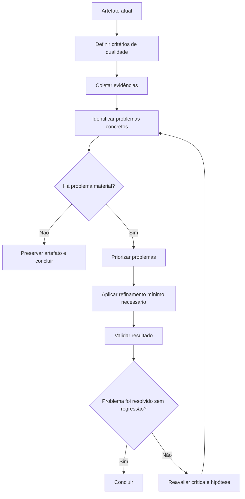
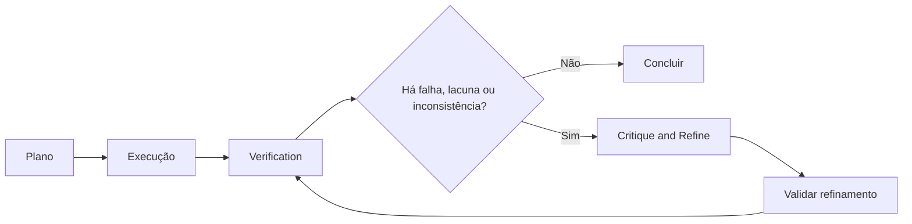
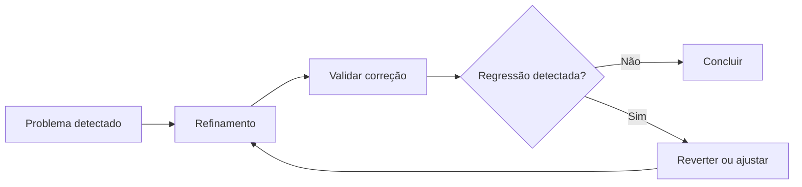

# Critique and Refine

## Objetivo

Use Critique and Refine para melhorar um artefato existente — código, plano, análise, documento, resposta, decisão ou configuração — quando houver evidência concreta de que ele está incompleto, incorreto, inconsistente, inseguro, pouco claro ou incompatível com os requisitos.

A técnica possui quatro fases:

1. identificar o artefato e o critério de qualidade;
2. criticar com base em evidência;
3. decidir se o refinamento é necessário;
4. alterar, validar e encerrar.

Critique and Refine não deve ser usado para gerar autocrítica infinita, reescrever conteúdo já adequado ou alterar algo apenas para parecer mais sofisticado.

## Princípio central

> Refine apenas quando existir um problema identificável, um critério objetivo ou uma oportunidade de melhoria com benefício mensurável.

Uma crítica útil responde:

```text
- O que está errado, incompleto ou frágil?
- Qual evidência sustenta essa conclusão?
- Qual requisito, contrato, teste, fonte ou critério foi violado?
- Qual é a menor alteração que resolve o problema?
- Como confirmar que o refinamento melhorou o resultado sem introduzir regressão?
```



## Quando usar

Use Critique and Refine quando houver pelo menos um gatilho verificável.

### Gatilhos válidos

```text
- Teste, lint, build ou typecheck falhou.
- Feedback do usuário indicou problema específico.
- Requisito solicitado não foi atendido.
- Código, contrato, fonte ou documentação contradiz o resultado.
- Há inconsistência interna entre partes do artefato.
- Uma conclusão extrapola a evidência disponível.
- Existe risco de segurança, regressão, ambiguidade ou manutenção não tratado.
- Uma revisão objetiva identificou problema de clareza, estrutura ou precisão.
- Um resultado de ferramenta revelou comportamento inesperado.
- Uma mudança de contexto tornou a solução anterior inadequada.
```

Exemplos adequados:

```text
- Ajustar uma implementação após teste de integração falhar.
- Corrigir uma análise que confundiu fato confirmado com inferência.
- Revisar uma resposta que não tratou uma restrição importante do usuário.
- Melhorar uma Pull Request após feedback de code review.
- Corrigir documentação incompatível com a API real.
- Refinar um plano após descobrir dependência técnica não prevista.
```

## Quando evitar

Não use Critique and Refine como ritual automático. Evite ou simplifique quando não há evidência de problema material — os anti-padrões abaixo detalham os casos recorrentes. Em resumo, não refine quando:

```text
- Não existe evidência de problema.
- A alteração seria apenas estética e não agrega valor relevante.
- O resultado já atende ao critério de conclusão.
- O usuário solicitou apenas uma resposta direta e simples.
- A crítica depende exclusivamente de intuição sem critério objetivo.
- O refinamento pode introduzir mais risco do que benefício.
- Não há como validar que a alteração melhorou o resultado.
```

## Relação com outras técnicas

| Técnica             | Responsabilidade                                                                      |
| ------------------- | ------------------------------------------------------------------------------------- |
| Plan and Execute    | Define etapas, dependências e checkpoints                                             |
| ReAct               | Executa ações, observa resultados e atualiza o estado                                 |
| Verification        | Determina se uma afirmação ou resultado tem evidência suficiente                      |
| Critique and Refine | Corrige problemas concretos detectados por feedback, validação ou critérios objetivos |
| Tree of Thoughts    | Explora alternativas quando há múltiplos caminhos relevantes                          |



### Regra de integração

- Use **Verification** para descobrir se há evidência suficiente.
- Use **Critique and Refine** somente quando essa evidência revelar um problema concreto.
- Use **ReAct** durante a investigação e a correção local.
- Use **Plan and Execute** quando o refinamento exigir múltiplas etapas ou afetar várias partes do sistema.

## Crítica baseada em evidência

Uma crítica não deve ser vaga.

```text
Ruim:
"Esse código pode ser melhorado."

Melhor:
"O método mistura validação, persistência e envio de e-mail. Isso dificulta teste isolado e viola a separação de responsabilidades adotada no projeto."
```

```text
Ruim:
"Essa resposta está incompleta."

Melhor:
"A resposta recomenda a biblioteca, mas não avalia compatibilidade com a versão do framework usada no projeto nem trata o requisito de OAuth."
```

### Schema canônico de crítica

Registre toda crítica relevante neste schema único. Em revisões rápidas, os campos `Artefato` e `Decisão` podem ser omitidos; em revisões formais, preencha todos.

```text
Artefato:
- [nome ou descrição]

Problema:
- [o que está errado, ausente, inconsistente ou frágil]

Evidência:
- [teste, requisito, fonte, contrato, feedback, diff ou observação]

Impacto:
- [o que pode quebrar, confundir, expor ou impedir]

Decisão:
- [preservar, refinar localmente, replanejar, pedir confirmação, declarar limitação ou bloquear]

Refinamento proposto:
- [menor mudança necessária]

Validação:
- [como confirmar a melhoria]
```

## Critérios de qualidade

Antes de criticar, defina quais critérios realmente importam para o artefato. Os critérios gerais valem para qualquer artefato; as listas seguintes especializam-nos por tipo.

```text
Gerais:
- Correção factual e técnica.
- Atendimento ao objetivo do usuário.
- Completude proporcional ao escopo.
- Clareza e ausência de ambiguidade material.
- Consistência interna.
- Compatibilidade com contexto, projeto e contratos.
- Segurança e privacidade.
- Manutenibilidade e simplicidade proporcional.
- Validação adequada ao risco.

Código:
- Comportamento correto, contratos e tipos compatíveis, erros tratados.
- Ausência de regressão; segurança de entradas, permissões e dados.
- Coesão, baixo acoplamento, testabilidade e conformidade com convenções.
- Sem complexidade ou dependência injustificada.

Planos:
- Objetivo e escopo claros; etapas necessárias e suficientes.
- Dependências corretas, riscos identificados, validações previstas.
- Critério de conclusão objetivo; ordem adequada entre descoberta, implementação e validação.

Análises e recomendações:
- Fatos separados de inferências; fontes adequadas ao risco; premissas explícitas.
- Contra-argumentos e alternativas plausíveis considerados; limitações declaradas.
- Recomendação ligada ao contexto, não apenas à popularidade.

Documentação e respostas:
- Objetivo atendido, estrutura compreensível, termos consistentes, exemplos corretos.
- Sem contradição; precisão compatível com o público; instruções acionáveis e sem excesso irrelevante.
```

## Processo de crítica

### 1. Congelar o objetivo

Antes de revisar, confirme o que o artefato deveria alcançar.

```text
Perguntas:
- Qual resultado esperado?
- Quais requisitos são obrigatórios?
- Quais restrições não podem ser violadas?
- O que está fora do escopo?
- Como será determinado que o resultado está correto?
```

Não critique com base em preferências pessoais que não fazem parte do objetivo ou das convenções do projeto.

### 2. Coletar evidências

Use evidências compatíveis com o tipo de artefato.

| Artefato     | Evidências úteis                                                           |
| ------------ | -------------------------------------------------------------------------- |
| Código       | Testes, logs, lint, build, typecheck, contrato, diff e execução controlada |
| API          | Request real, response, schema, documentação e teste de integração         |
| Plano        | Dependências reais, requisitos, riscos, escopo e critério de conclusão     |
| Análise      | Fontes primárias, dados, premissas, consistência lógica e contraexemplos   |
| Documento    | Requisitos, audiência, estrutura, exemplos e coerência interna             |
| Configuração | Arquivos reais, documentação, ambiente, logs e comportamento observado     |

Não invente evidência ou trate impressão como prova.

### 3. Identificar problemas materiais

Priorize apenas problemas com impacto real, conforme a severidade. A severidade segue a escala de impacto do catálogo (Baixo/Médio/Alto/Crítico); o esforço de correção deve respeitar o orçamento de esforço definido em [pelizzai-reasoning](../SKILL.md).

| Severidade     | Descrição                                                                        | Tratamento                                                |
| -------------- | -------------------------------------------------------------------------------- | --------------------------------------------------------- |
| Crítico        | Pode causar perda, exposição, vulnerabilidade, violação grave ou falha sistêmica | Corrigir antes de concluir                                |
| Alto           | Quebra requisito central, contrato ou fluxo principal                            | Corrigir antes de concluir                                |
| Médio          | Pode causar bug secundário, manutenção ruim ou experiência inconsistente         | Corrigir quando proporcional                              |
| Baixo          | Clareza, nomenclatura, estética ou melhoria pequena                              | Corrigir apenas se não gerar custo ou risco desnecessário |
| Não comprovado | Não há evidência suficiente de que é problema                                    | Não alterar sem investigar                                |

## Decidir se deve refinar

Após criticar, escolha uma destas decisões:

| Decisão            | Quando usar                                                                   |
| ------------------ | ----------------------------------------------------------------------------- |
| Preservar          | Não há problema material ou a alteração não agrega valor                      |
| Refinar localmente | O problema é limitado e a correção é clara                                    |
| Replanejar         | O problema afeta várias etapas, arquitetura ou premissas                      |
| Pedir confirmação  | A correção altera escopo, comportamento esperado ou decisão do usuário        |
| Declarar limitação | Não há acesso, evidência ou ferramenta suficiente para corrigir com segurança |
| Bloquear           | A ação necessária é insegura, proibida ou depende de autorização              |

```text
Regra:
Não refine apenas porque uma alternativa parece mais elegante.
Refine quando o ganho é justificável por requisito, evidência, risco ou manutenção.
```

## Refinamento mínimo necessário

O objetivo não é reescrever tudo.

> Aplique a menor alteração que resolva o problema confirmado e preserve tudo que já está validado.

```text
Ruim:
Encontrar um campo incompatível e reescrever todo o módulo.

Melhor:
Corrigir o mapeamento incompatível, adicionar teste de regressão e validar os fluxos afetados.
```

```text
Ruim:
Encontrar uma lacuna na análise e substituir toda a recomendação.

Melhor:
Adicionar a limitação ausente, revisar a conclusão apenas se ela depender dessa lacuna e preservar as partes ainda sustentadas.
```

### Regras de preservação

```text
- Preserve comportamento já validado.
- Preserve decisões do usuário e convenções do projeto.
- Não altere escopo sem necessidade.
- Não introduza abstrações apenas para acomodar uma correção pequena.
- Não substitua uma solução simples por uma solução complexa sem benefício comprovado.
- Não remova validações existentes sem evidência de que são incorretas ou redundantes.
```

## Validação após refinamento

Todo refinamento relevante deve ser validado.



A validação deve responder:

```text
- O problema original foi resolvido?
- O requisito continua atendido?
- Houve regressão em comportamento existente?
- A alteração introduziu novo risco?
- A solução permanece compatível com contratos e convenções?
```

Não conclua que o refinamento foi bem-sucedido apenas porque a alteração parece correta.

## Limites de iteração

Critique and Refine deve ter limites claros.

### Regra padrão

```text
- Faça uma rodada inicial de crítica.
- Refine os problemas materiais encontrados.
- Valide o resultado.
- Faça uma segunda crítica somente se a validação revelar nova falha, regressão ou requisito ainda não atendido.
```

Não continue refinando sem nova evidência.

### Gatilhos para nova rodada

Inicie uma nova rodada somente quando:

```text
- O refinamento falhou na validação.
- O refinamento introduziu regressão.
- Foi descoberto novo requisito relevante.
- Surgiu feedback externo específico.
- Uma dependência ou fonte contradisse o resultado.
- O problema original era sintoma de causa mais profunda (ver Root Cause Analysis).
```

### Regras de parada

Pare quando:

```text
- Os problemas materiais foram resolvidos.
- O critério de conclusão foi atendido.
- Não há nova evidência relevante.
- Melhorias restantes são apenas cosméticas ou marginais.
- O próximo refinamento teria risco ou custo maior que o benefício.
- Falta acesso, contexto ou autorização para continuar.
```

## Autocrítica limitada

A crítica interna pode ajudar a detectar inconsistências óbvias, mas não substitui validação externa.

Use autocrítica para:

```text
- Conferir se todos os requisitos explícitos foram atendidos.
- Procurar contradições internas.
- Identificar premissas não declaradas.
- Avaliar se uma conclusão extrapola a evidência.
- Verificar se a resposta segue o formato solicitado.
- Revisar checklist objetivo.
```

Não use autocrítica como única prova para:

```text
- Confirmar que código funciona.
- Confirmar segurança.
- Confirmar compatibilidade de API.
- Confirmar fatos externos atuais.
- Confirmar cálculos complexos.
- Confirmar ausência de regressão.
```

## Feedback externo

Quando houver feedback de usuário, teste, revisor, ferramenta ou fonte externa:

1. interprete o feedback com precisão;
2. confirme se ele se aplica ao artefato atual;
3. identifique a causa, não apenas o sintoma;
4. refine o mínimo necessário;
5. valide a correção;
6. informe o que foi alterado e o que permanece limitado.

```text
Feedback:
"O filtro não funciona quando há mais de uma página."

Crítica:
- A implementação atual atualiza o filtro, mas não redefine a paginação.
- A evidência é o comportamento observado e o estado atual da consulta.

Refinamento:
- Redefinir página para 1 ao alterar filtros.

Validação:
- Testar filtro na primeira página e em páginas posteriores.
```

Não aceite feedback automaticamente como verdade absoluta quando ele contradizer evidência objetiva. Investigue o conflito.

## Anti-padrões

### 1. Crítica vaga

```text
Ruim:
"Melhore o código."

Melhor:
"O método contém regra de autorização duplicada em três rotas. Centralizar a regra reduz inconsistência e torna os testes mais confiáveis."
```

### 2. Refinamento cosmético ou reescrita total sem necessidade

```text
Ruim:
Reescrever nomes, estrutura e estilo sem resolver nenhum problema material, ou refazer toda uma análise porque um dado secundário estava desatualizado.

Melhor:
Preservar o artefato quando ele atende ao critério e não há ganho concreto; quando houver problema localizado, atualizar apenas o dado e as conclusões que dependem dele.
```

### 3. Corrigir sintoma e ignorar causa

```text
Ruim:
Adicionar delay para "resolver" uma condição de corrida.

Melhor:
Identificar o estado, evento ou contrato que está gerando a corrida e corrigir a sincronização real (ver [Root Cause Analysis](root-cause-analysis.md)).
```

### 4. Confiar apenas na autocrítica

```text
Ruim:
"Revisei mentalmente e parece correto."

Melhor:
"Revisei requisitos e validei o comportamento com teste ou execução controlada."
```

### 5. Ignorar regressão

```text
Ruim:
Corrigir o cenário novo e não verificar fluxos existentes.

Melhor:
Validar o problema original e os fluxos diretamente afetados pela alteração.
```

### 6. Iteração infinita

```text
Ruim:
Continuar revisando após todos os requisitos e validações terem sido atendidos.

Melhor:
Encerrar quando melhorias restantes forem marginais ou não comprovadas.
```

### 7. Aceitar crítica externa sem investigar

```text
Ruim:
Aplicar uma sugestão de review sem conferir contrato, contexto ou consequência.

Melhor:
Validar se a crítica é aplicável e se a correção proposta não cria efeito colateral.
```

## Exemplos

### Exemplo 1 — Código

```text
Artefato:
- Endpoint de criação de pedido.

Problema:
- O endpoint permite criar pedidos duplicados em retries de rede.

Evidência:
- Teste de integração com duas requisições idênticas cria dois registros.

Impacto:
- Duplicidade de dados e possível cobrança indevida.

Decisão:
- Refinar localmente.

Refinamento:
- Adicionar chave de idempotência e restrição de unicidade conforme o contrato.

Validação:
- Reexecutar teste com requests duplicados e confirmar que apenas um pedido é persistido.
```

### Exemplo 2 — Plano

```text
Artefato:
- Plano para implementar autenticação OAuth.

Problema:
- O plano prevê tela de login antes de confirmar provedor, callback, escopos e persistência de sessão.

Evidência:
- Requisitos ainda não definem provedor OAuth nem estratégia de refresh token.

Impacto:
- Alto risco de retrabalho no frontend e backend.

Decisão:
- Replanejar.

Refinamento:
- Inserir etapa de descoberta e definição de contrato antes da implementação.

Validação:
- Confirmar requisitos e contrato de autenticação antes de iniciar código.
```

## Instrução resumida para o agente

```text
- Aplique Critique and Refine somente com evidência de falha, lacuna, inconsistência, requisito não atendido ou risco material.
- Não trate preferência estética como defeito técnico nem refine sem critério objetivo.
- Use o schema canônico de crítica; classifique a severidade na escala Baixo/Médio/Alto/Crítico.
- Aplique a menor alteração que resolva o problema e preserve comportamento, decisões e partes já validadas.
- Valide que o refinamento corrigiu o problema sem regressão; faça nova rodada apenas com nova evidência.
- Pare quando o critério de conclusão for atendido ou não houver ganho proporcional.
- Não exponha cadeia de pensamento detalhada; comunique problema, evidência, decisão, alteração, validação e limitações relevantes.
```

## Técnicas relacionadas

- [Plan and Execute](plan-and-execute.md)
- [ReAct](react.md)
- [Verification](verification.md)
- [Tree of Thoughts](tree-of-thoughts.md)
- [Root Cause Analysis](root-cause-analysis.md)

Voltar ao [catálogo de técnicas](../SKILL.md).
