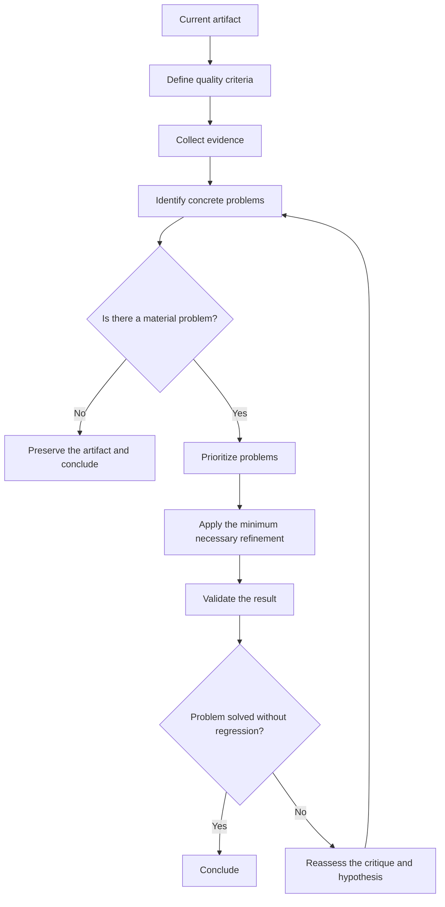
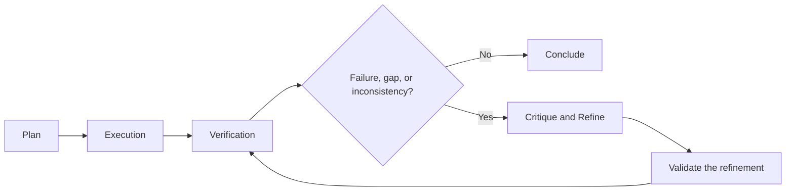
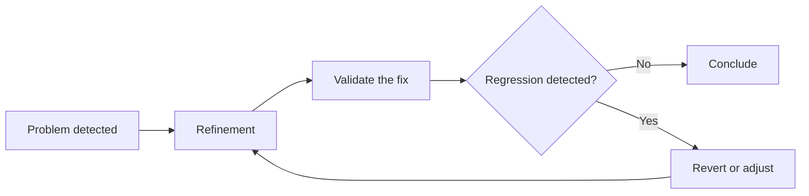

# Critique and Refine

## Purpose

Use Critique and Refine to improve an existing artifact — code, plan, analysis, document, answer, decision, or configuration — when there is concrete evidence that it is incomplete, incorrect, inconsistent, insecure, unclear, or incompatible with the requirements.

The technique has four phases:

1. identify the artifact and the quality criterion;
2. critique based on evidence;
3. decide whether refinement is necessary;
4. change, validate, and conclude.

Critique and Refine must not be used to generate endless self-criticism, rewrite content that is already adequate, or change something just to look more sophisticated.

## Core principle

> Refine only when there is an identifiable problem, an objective criterion, or an improvement opportunity with measurable benefit.

A useful critique answers:

```text
- What is wrong, incomplete, or fragile?
- What evidence supports that conclusion?
- Which requirement, contract, test, source, or criterion was violated?
- What is the smallest change that fixes the problem?
- How to confirm the refinement improved the result without introducing a regression?
```


```mermaid
flowchart TD
    A[Current artifact] --> B[Define quality criteria]
    B --> C[Collect evidence]
    C --> D[Identify concrete problems]
    D --> E{Is there a material problem?}

    E -- No --> F[Preserve the artifact and conclude]
    E -- Yes --> G[Prioritize problems]
    G --> H[Apply the minimum necessary refinement]
    H --> I[Validate the result]
    I --> J{Problem solved without regression?}

    J -- Yes --> K[Conclude]
    J -- No --> L[Reassess the critique and hypothesis]
    L --> D
```

## When to use

Use Critique and Refine when there is at least one verifiable trigger.

### Valid triggers

```text
- A test, lint, build, or typecheck failed.
- User feedback pointed to a specific problem.
- A requested requirement was not met.
- Code, a contract, a source, or documentation contradicts the result.
- There is internal inconsistency between parts of the artifact.
- A conclusion goes beyond the available evidence.
- There is an unaddressed risk of security, regression, ambiguity, or maintenance.
- An objective review identified a problem of clarity, structure, or accuracy.
- A tool result revealed unexpected behavior.
- A context change made the previous solution inadequate.
```

Good examples:

```text
- Adjusting an implementation after an integration test failed.
- Fixing an analysis that confused a confirmed fact with an inference.
- Revising an answer that ignored an important user constraint.
- Improving a Pull Request after code review feedback.
- Fixing documentation incompatible with the real API.
- Refining a plan after discovering an unforeseen technical dependency.
```

## When to avoid

Do not use Critique and Refine as an automatic ritual. Avoid or simplify when there is no evidence of a material problem — the anti-patterns below detail the recurring cases. In short, do not refine when:

```text
- There is no evidence of a problem.
- The change would be purely cosmetic and adds no relevant value.
- The result already meets the completion criterion.
- The user asked only for a direct, simple answer.
- The critique rests solely on intuition with no objective criterion.
- The refinement may introduce more risk than benefit.
- There is no way to validate that the change improved the result.
```

## Relationship to other techniques

| Technique           | Responsibility                                                                         |
| ------------------- | -------------------------------------------------------------------------------------- |
| Plan and Execute    | Defines steps, dependencies, and checkpoints                                           |
| ReAct               | Executes actions, observes results, and updates state                                  |
| Verification        | Determines whether a claim or result has sufficient evidence                           |
| Critique and Refine | Fixes concrete problems detected by feedback, validation, or objective criteria        |
| Decision Making     | Chooses among solution paths, including interdependent ones with pruning               |


```mermaid
flowchart LR
    A[Plan] --> B[Execution]
    B --> C[Verification]
    C --> D{Failure, gap, or inconsistency?}

    D -- No --> E[Conclude]
    D -- Yes --> F[Critique and Refine]
    F --> G[Validate the refinement]
    G --> C
```

### Integration rule

- Use **Verification** to find out whether there is sufficient evidence.
- Use **Critique and Refine** only when that evidence reveals a concrete problem.
- Use **ReAct** during the investigation and the local fix.
- Use **Plan and Execute** when the refinement requires multiple steps or affects several parts of the system.

## Evidence-based critique

A critique must not be vague.

```text
Bad:
"This code could be better."

Better:
"The method mixes validation, persistence, and email sending. That makes isolated testing hard and violates the separation of concerns adopted in the project."
```

```text
Bad:
"This answer is incomplete."

Better:
"The answer recommends the library but does not assess compatibility with the framework version used in the project, nor does it address the OAuth requirement."
```

### Canonical critique schema

Record every relevant critique in this single schema. In quick reviews, the `Artifact` and `Decision` fields may be omitted; in formal reviews, fill in all of them.

```text
Artifact:
- [name or description]

Problem:
- [what is wrong, missing, inconsistent, or fragile]

Evidence:
- [test, requirement, source, contract, feedback, diff, or observation]

Impact:
- [what may break, confuse, expose, or block]

Decision:
- [preserve, refine locally, replan, ask for confirmation, declare a limitation, or block]

Proposed refinement:
- [smallest necessary change]

Validation:
- [how to confirm the improvement]
```

## Quality criteria

Before critiquing, define which criteria actually matter for the artifact. The general criteria apply to any artifact; the lists that follow specialize them by type.

```text
General:
- Factual and technical correctness.
- Fulfillment of the user's goal.
- Completeness proportional to the scope.
- Clarity and absence of material ambiguity.
- Internal consistency.
- Compatibility with context, project, and contracts.
- Security and privacy.
- Maintainability and proportional simplicity.
- Validation adequate to the risk.

Code:
- Correct behavior, compatible contracts and types, errors handled.
- No regression; safety of inputs, permissions, and data.
- Cohesion, low coupling, testability, and conformance to conventions.
- No unjustified complexity or dependency.

Plans:
- Clear goal and scope; necessary and sufficient steps.
- Correct dependencies, identified risks, planned validations.
- Objective completion criterion; proper ordering of discovery, implementation, and validation.

Analyses and recommendations:
- Facts separated from inferences; sources adequate to the risk; explicit assumptions.
- Plausible counter-arguments and alternatives considered; limitations declared.
- Recommendation tied to the context, not just to popularity.

Documentation and answers:
- Goal met, understandable structure, consistent terms, correct examples.
- No contradictions; precision suited to the audience; actionable instructions without irrelevant excess.
```

## Critique process

### 1. Freeze the goal

Before reviewing, confirm what the artifact was supposed to achieve.

```text
Questions:
- What is the expected outcome?
- Which requirements are mandatory?
- Which constraints cannot be violated?
- What is out of scope?
- How will correctness be determined?
```

Do not critique based on personal preferences that are not part of the goal or the project's conventions.

### 2. Collect evidence

Use evidence appropriate to the artifact type.

| Artifact      | Useful evidence                                                             |
| ------------- | --------------------------------------------------------------------------- |
| Code          | Tests, logs, lint, build, typecheck, contract, diff, and controlled execution |
| API           | Real request, response, schema, documentation, and integration test         |
| Plan          | Real dependencies, requirements, risks, scope, and completion criterion     |
| Analysis      | Primary sources, data, assumptions, logical consistency, and counterexamples |
| Document      | Requirements, audience, structure, examples, and internal coherence         |
| Configuration | Real files, documentation, environment, logs, and observed behavior         |

Do not invent evidence or treat an impression as proof.

### 3. Identify material problems

Prioritize only problems with real impact, by severity. Severity follows the catalog's impact scale (Low/Medium/High/Critical); the fix effort must respect the effort budget defined in [pelizzai-reasoning](../SKILL.md).

| Severity  | Description                                                                      | Treatment                                                 |
| --------- | -------------------------------------------------------------------------------- | --------------------------------------------------------- |
| Critical  | May cause loss, exposure, a vulnerability, a serious violation, or systemic failure | Fix before concluding                                     |
| High      | Breaks a central requirement, contract, or main flow                             | Fix before concluding                                     |
| Medium    | May cause a secondary bug, poor maintainability, or an inconsistent experience   | Fix when proportional                                     |
| Low       | Clarity, naming, aesthetics, or a small improvement                              | Fix only if it adds no unnecessary cost or risk           |
| Unproven  | There is not enough evidence that it is a problem                                | Do not change without investigating                       |

## Deciding whether to refine

After critiquing, pick one of these decisions:

| Decision             | When to use                                                                    |
| -------------------- | ------------------------------------------------------------------------------ |
| Preserve             | There is no material problem or the change adds no value                       |
| Refine locally       | The problem is bounded and the fix is clear                                    |
| Replan               | The problem affects multiple steps, the architecture, or assumptions           |
| Ask for confirmation | The fix changes scope, expected behavior, or a user decision                   |
| Declare a limitation | There is not enough access, evidence, or tooling to fix safely                 |
| Block                | The necessary action is unsafe, prohibited, or requires authorization          |

```text
Rule:
Do not refine just because an alternative looks more elegant.
Refine when the gain is justified by a requirement, evidence, risk, or maintenance.
```

## Minimum necessary refinement

The goal is not to rewrite everything.

> Apply the smallest change that fixes the confirmed problem and preserves everything already validated.

```text
Bad:
Finding an incompatible field and rewriting the whole module.

Better:
Fixing the incompatible mapping, adding a regression test, and validating the affected flows.
```

```text
Bad:
Finding a gap in the analysis and replacing the entire recommendation.

Better:
Adding the missing limitation, revising the conclusion only if it depends on that gap, and preserving the parts still supported.
```

### Preservation rules

```text
- Preserve behavior that is already validated.
- Preserve the user's decisions and the project's conventions.
- Do not change scope without need.
- Do not introduce abstractions just to accommodate a small fix.
- Do not replace a simple solution with a complex one without proven benefit.
- Do not remove existing validations without evidence that they are incorrect or redundant.
```

## Validation after refinement

Every relevant refinement must be validated.


```mermaid
flowchart LR
    A[Problem detected] --> B[Refinement]
    B --> C[Validate the fix]
    C --> D{Regression detected?}

    D -- No --> E[Conclude]
    D -- Yes --> F[Revert or adjust]
    F --> B
```

The validation must answer:

```text
- Was the original problem solved?
- Is the requirement still met?
- Was there a regression in existing behavior?
- Did the change introduce a new risk?
- Does the solution remain compatible with contracts and conventions?
```

Do not conclude that the refinement succeeded just because the change looks correct.

## Iteration limits

Critique and Refine must have clear limits.

### Default rule

```text
- Run an initial round of critique.
- Refine the material problems found.
- Validate the result.
- Run a second critique only if validation reveals a new failure, a regression, or a requirement still unmet.
```

Do not keep refining without new evidence.

### Triggers for a new round

Start a new round only when:

```text
- The refinement failed validation.
- The refinement introduced a regression.
- A relevant new requirement was discovered.
- Specific external feedback came in.
- A dependency or source contradicted the result.
- The original problem was a symptom of a deeper cause (see Root Cause Analysis).
```

### Stop rules

Stop when:

```text
- The material problems were solved.
- The completion criterion was met.
- There is no relevant new evidence.
- Remaining improvements are only cosmetic or marginal.
- The next refinement would carry more risk or cost than benefit.
- Access, context, or authorization to continue is missing.
```

## Limited self-critique

Internal critique can help detect obvious inconsistencies, but it does not replace external validation.

Use self-critique to:

```text
- Check that every explicit requirement was met.
- Look for internal contradictions.
- Identify undeclared assumptions.
- Assess whether a conclusion goes beyond the evidence.
- Verify that the answer follows the requested format.
- Review an objective checklist.
```

Do not use self-critique as the only proof to:

```text
- Confirm that code works.
- Confirm security.
- Confirm API compatibility.
- Confirm current external facts.
- Confirm complex calculations.
- Confirm the absence of regression.
```

## External feedback

When there is feedback from a user, test, reviewer, tool, or external source:

1. interpret the feedback precisely;
2. confirm that it applies to the current artifact;
3. identify the cause, not just the symptom;
4. refine the minimum necessary;
5. validate the fix;
6. report what was changed and what remains limited.

```text
Feedback:
"The filter does not work when there is more than one page."

Critique:
- The current implementation updates the filter but does not reset pagination.
- The evidence is the observed behavior and the current state of the query.

Refinement:
- Reset the page to 1 when filters change.

Validation:
- Test the filter on the first page and on later pages.
```

Do not automatically accept feedback as absolute truth when it contradicts objective evidence. Investigate the conflict.

## Anti-patterns

### 1. Vague critique

```text
Bad:
"Improve the code."

Better:
"The method duplicates the authorization rule across three routes. Centralizing the rule reduces inconsistency and makes the tests more reliable."
```

### 2. Cosmetic refinement or unnecessary full rewrite

```text
Bad:
Rewriting names, structure, and style without solving any material problem, or redoing an entire analysis because a secondary data point was outdated.

Better:
Preserving the artifact when it meets the criterion and there is no concrete gain; when there is a localized problem, updating only the data point and the conclusions that depend on it.
```

### 3. Fixing the symptom and ignoring the cause

```text
Bad:
Adding a delay to "fix" a race condition.

Better:
Identifying the state, event, or contract generating the race and fixing the actual synchronization (see [Root Cause Analysis](root-cause-analysis.md)).
```

### 4. Relying on self-critique alone

```text
Bad:
"I reviewed it mentally and it looks correct."

Better:
"I reviewed the requirements and validated the behavior with a test or a controlled execution."
```

### 5. Ignoring regression

```text
Bad:
Fixing the new scenario without checking existing flows.

Better:
Validating the original problem and the flows directly affected by the change.
```

### 6. Endless iteration

```text
Bad:
Continuing to revise after all requirements and validations have been met.

Better:
Stopping when remaining improvements are marginal or unproven.
```

### 7. Accepting external critique without investigating

```text
Bad:
Applying a review suggestion without checking the contract, context, or consequences.

Better:
Validating whether the critique applies and whether the proposed fix creates no side effects.
```

## Examples

### Example 1 — Code

```text
Artifact:
- Order creation endpoint.

Problem:
- The endpoint allows duplicate orders on network retries.

Evidence:
- An integration test with two identical requests creates two records.

Impact:
- Duplicate data and possible incorrect charges.

Decision:
- Refine locally.

Refinement:
- Add an idempotency key and a uniqueness constraint per the contract.

Validation:
- Rerun the test with duplicate requests and confirm that only one order is persisted.
```

### Example 2 — Plan

```text
Artifact:
- Plan to implement OAuth authentication.

Problem:
- The plan schedules the login screen before confirming the provider, callback, scopes, and session persistence.

Evidence:
- The requirements do not yet define the OAuth provider or the refresh token strategy.

Impact:
- High risk of rework on the frontend and backend.

Decision:
- Replan.

Refinement:
- Insert a discovery and contract-definition step before implementation.

Validation:
- Confirm the requirements and the authentication contract before starting code.
```

## Summary instruction for the agent

```text
- Apply Critique and Refine only with evidence of a failure, gap, inconsistency, unmet requirement, or material risk.
- Do not treat an aesthetic preference as a technical defect, and do not refine without an objective criterion.
- Use the canonical critique schema; classify severity on the Low/Medium/High/Critical scale.
- Apply the smallest change that fixes the problem and preserves behavior, decisions, and already-validated parts.
- Validate that the refinement fixed the problem without regression; run a new round only with new evidence.
- Stop when the completion criterion is met or there is no proportional gain.
- Do not expose detailed chain of thought; communicate the problem, evidence, decision, change, validation, and relevant limitations.
```

## Related techniques

- [Plan and Execute](plan-and-execute.md)
- [ReAct](react.md)
- [Verification](verification.md)
- [Decision Making](decision-making.md)
- [Root Cause Analysis](root-cause-analysis.md)

Back to the [technique catalog](../SKILL.md).
