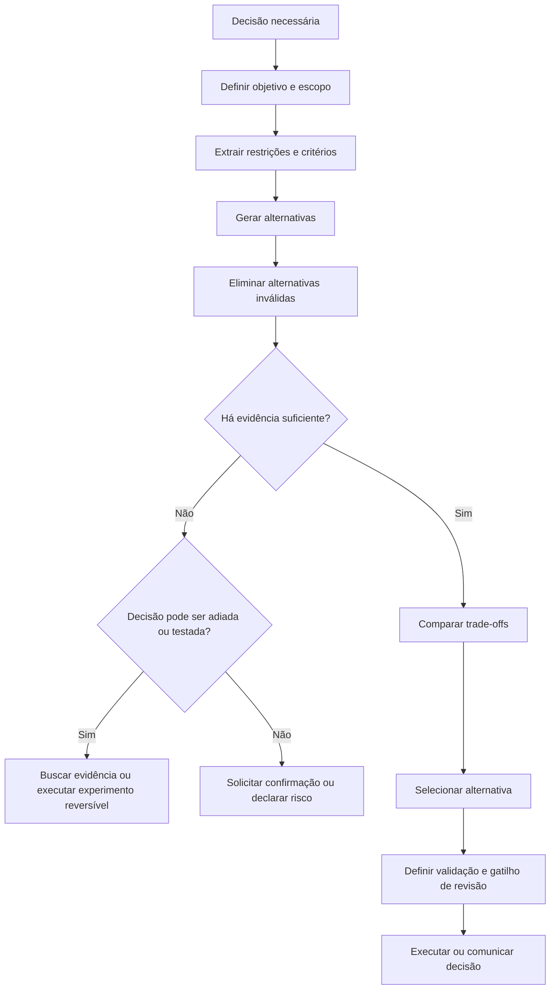
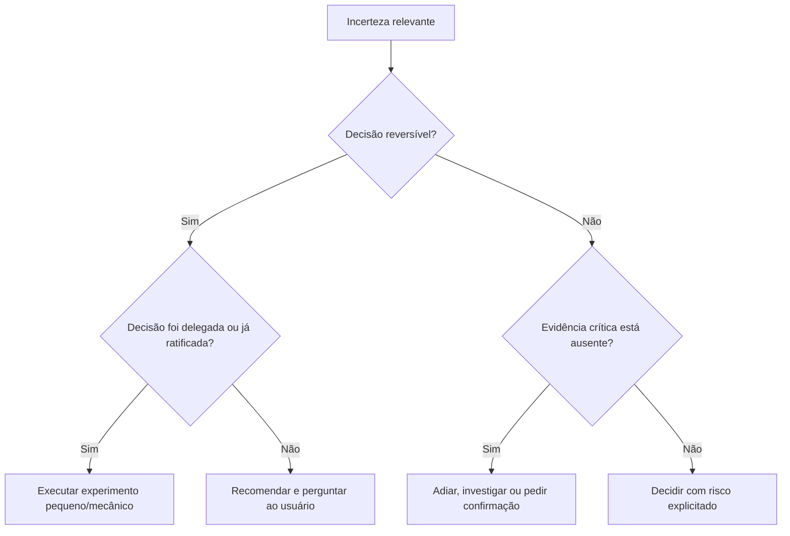

# Decision Making

## Objetivo

Use Decision Making quando houver mais de uma alternativa viável e for necessário escolher uma direção de forma explícita, proporcional e justificável.

A técnica responde:

```text
- Qual decisão deve ser tomada agora?
- Quais critérios realmente importam?
- Quais alternativas são válidas?
- Que trade-offs cada alternativa cria?
- Há evidência suficiente para decidir?
- A decisão é reversível?
- Devemos agir, experimentar, adiar, pedir confirmação ou bloquear?
```

Decision Making não é apenas listar prós e contras.

Ela exige:

1. definir a decisão;
2. separar alternativas inválidas das válidas;
3. explicitar critérios;
4. avaliar evidências, riscos e reversibilidade;
5. escolher a menor decisão necessária;
6. registrar trade-offs e condições de revisão.

## Princípio central

> Selecione e justifique a melhor **recomendação**. Execute-a somente quando a decisão for mecânica e
> já estiver coberta por spec/plano ratificado ou quando o usuário delegar explicitamente essa
> categoria. Reversibilidade reduz risco; não transfere autoridade sobre o produto para a LLM.



## Quando usar

Use Decision Making quando a tarefa envolver:

```text
- duas ou mais alternativas válidas;
- trade-offs entre custo, prazo, segurança, simplicidade, performance ou manutenção;
- decisão arquitetural;
- seleção de tecnologia, biblioteca, fornecedor ou abordagem;
- priorização de backlog;
- escolha entre corrigir, reverter, mitigar ou investigar;
- decisão sob incerteza;
- ação potencialmente irreversível;
- necessidade de justificar por que uma alternativa foi escolhida;
- conflito entre preferências legítimas.
```

Exemplos adequados:

```text
- Escolher entre fila assíncrona, processamento síncrono otimizado ou serviço externo.
- Decidir se uma migração pode ocorrer agora ou precisa de estratégia gradual.
- Selecionar biblioteca de autenticação.
- Escolher entre corrigir localmente ou refatorar estrutura.
- Definir se um incidente exige rollback ou hotfix.
- Priorizar segurança, prazo ou compatibilidade em uma alteração.
```

## Quando evitar

Não use Decision Making como processo formal quando existe uma única ação correta, determinada por contrato ou evidência direta.

Evite ou simplifique quando:

```text
- há apenas uma solução compatível com as restrições;
- a escolha é trivial, local e reversível;
- a tarefa é pura execução de requisito claro;
- existe fonte de verdade direta;
- não há trade-off material;
- criar matriz de decisão custa mais do que agir.
```

Exemplos:

```text
- Corrigir import inválido.
- Aplicar campo obrigatório já definido em schema.
- Executar teste indicado por erro de CI.
- Traduzir texto.
- Renomear variável local.
```

## Relação com outras técnicas

| Técnica                 | Responsabilidade                                                    |
| ----------------------- | ------------------------------------------------------------------- |
| Constraint Satisfaction | Define o que torna uma opção válida ou inválida                     |
| Assumption Tracking     | Registra condições ainda não confirmadas                            |
| Evidence Synthesis      | Combina fontes e evidências para avaliar alternativas               |
| Tree of Thoughts        | Explora caminhos concorrentes e permite poda                        |
| Decision Making         | Seleciona, adia, condiciona ou bloqueia uma direção                 |
| Plan and Execute        | Organiza execução após a decisão                                    |
| Verification            | Confirma que a decisão e seu resultado atendem aos critérios        |
| Critique and Refine     | Corrige decisão ou resultado quando novas evidências revelam falhas |

## Tipos de decisão

### 1. Decisão de execução

Escolhe como realizar algo.

```text
Exemplo:
- Implementar exportação como endpoint síncrono ou job assíncrono.
```

### 2. Decisão de arquitetura

Escolhe estrutura com efeitos de longo prazo.

```text
Exemplo:
- Usar monólito modular, microserviços ou processamento orientado a eventos.
```

### 3. Decisão de prioridade

Escolhe o que fazer primeiro.

```text
Exemplo:
- Corrigir incidente, entregar feature ou reduzir dívida técnica.
```

### 4. Decisão de risco

Escolhe entre agir, mitigar, aceitar risco, adiar ou bloquear.

```text
Exemplo:
- Publicar hotfix agora, reverter versão ou aguardar investigação.
```

### 5. Decisão condicional

Escolhe uma direção que depende de uma premissa ainda aberta.

```text
Exemplo:
- Usar fila existente, desde que a capacidade de produção seja confirmada.
```

## Critérios de decisão

Use critérios relevantes ao contexto. Não use lista fixa como checklist automático.

Critérios comuns:

```text
- Correção.
- Segurança.
- Compatibilidade.
- Custo.
- Prazo.
- Simplicidade.
- Manutenibilidade.
- Performance.
- Escalabilidade.
- Confiabilidade.
- Observabilidade.
- Reversibilidade.
- Experiência do usuário.
- Risco operacional.
- Dependência de terceiros.
```

### Regra de prioridade

Restrições obrigatórias vêm antes de critérios de otimização.

```text
Errado:
Escolher alternativa mais rápida que viola segurança.

Correto:
Eliminar alternativas inseguras e comparar velocidade apenas entre opções válidas.
```

## Evidência suficiente e desempate

### Critério objetivo de evidência suficiente

A evidência é suficiente quando reunir mais dados não mudaria a alternativa escolhida.

```text
Teste:
- A evidência ainda ausente, se obtida, alteraria a alternativa selecionada?
  - Não -> a evidência é suficiente; decida.
  - Sim -> falta evidência crítica; busque-a, experimente ou condicione a decisão.
  - Incerto -> trate como crítica se a decisão for irreversível ou de alto impacto;
    caso contrário, decida com risco explicitado e gatilho de revisão.
```

Detalhe secundário não justifica pesquisa infinita. Se a escolha pertence ao usuário, apresente a
recomendação e pergunte mesmo quando reversível.

### Regra de desempate

Quando duas ou mais alternativas válidas empatam nos critérios, desempate nesta ordem:

```text
1. Reversibilidade: prefira a mais fácil de desfazer.
2. Menor decisão necessária: prefira a que preserva mais opções futuras.
3. Menor risco operacional e menor dependência de terceiros.
4. Simplicidade e custo de manutenção.
5. Se ainda empatar: escolha qualquer uma válida, registre o empate como premissa
   e defina gatilho de revisão; não escale empate de baixo impacto.
```

## Modelo de decisão (template canônico)

Use este template único para organizar e registrar decisões relevantes. Para decisões pequenas, preencha apenas os campos materiais; para decisões de alto impacto ou registro permanente, preencha todos.

```text
Decisão:
- [o que precisa ser escolhido]

Objetivo:
- [resultado que a decisão deve maximizar ou proteger]

Escopo:
- [o que está dentro e fora da decisão]

Restrições obrigatórias:
- [o que nenhuma opção pode violar]

Alternativas válidas:
1. [opção]
   - Benefícios: [o que melhora]
   - Custos: [o que exige]
   - Riscos: [o que pode falhar]
   - Premissas: [o que precisa ser verdadeiro]
   - Reversibilidade: [como voltar atrás]
   - Evidências: [fatos, testes, fontes ou observações]
   - Gatilho de descarte: [o que torna a opção inviável]

2. [opção]
   - (mesmos campos)

Critérios:
- [como as opções serão comparadas]

Decisão tomada:
- [opção selecionada, decisão condicional, experimento, adiamento, confirmação,
  risco aceito, bloqueio ou escalonamento]

Trade-offs:
- [o que foi priorizado e o que foi sacrificado, e por que é aceitável]

Premissas abertas:
- [condições ainda não confirmadas]

Risco:
- [impacto se a decisão estiver errada]

Validação:
- [como confirmar na prática que a decisão foi adequada]

Gatilho de revisão:
- [evento que exigirá reavaliar a decisão]
```

## Decisão sob incerteza

Nem toda decisão terá evidência completa.

A pergunta não é apenas "temos certeza?"

A pergunta correta é:

```text
- O risco de decidir agora é menor que o custo de esperar?
- A decisão é reversível?
- Podemos fazer experimento pequeno?
- Existe uma opção conservadora?
- Falta uma evidência crítica ou apenas detalhe secundário?
- Quem é responsável por aceitar o risco?
```



## Reversibilidade

Classifique decisões pelo custo de desfazer.

| Nível                 | Característica                                        | Estratégia                                    |
| --------------------- | ----------------------------------------------------- | --------------------------------------------- |
| Alta reversibilidade  | Fácil de alterar, baixo impacto e baixo custo         | Decidir rapidamente e validar                 |
| Média reversibilidade | Exige ajuste, mas possui rollback viável              | Definir checkpoint e contingência             |
| Baixa reversibilidade | Afeta dados, contratos, usuários ou infraestrutura    | Buscar mais evidência antes de decidir        |
| Irreversível          | Perda de dados, custo elevado ou exposição permanente | Não avançar sem confirmação e validação forte |

Exemplos:

```text
Alta reversibilidade:
- Alterar texto de interface.

Média reversibilidade:
- Trocar componente de filtro com testes.

Baixa reversibilidade:
- Alterar contrato público de API.

Irreversível:
- Excluir dados sem backup.
```

## Ações possíveis

Uma decisão não precisa sempre resultar em "escolher uma solução".

Escolha entre:

| Ação                     | Quando usar                                                             |
| ------------------------ | ----------------------------------------------------------------------- |
| Decidir e executar       | Passo mecânico coberto por decisão ratificada/delegada                   |
| Decidir condicionalmente | Depende de premissa rastreada                                           |
| Executar experimento     | Incerteza relevante, mas decisão reversível                             |
| Adiar                    | Falta evidência crítica e o custo de esperar é aceitável                |
| Pedir confirmação        | A escolha pertence ao produto/usuário, mesmo quando reversível          |
| Aceitar risco            | Usuário ratificou; incerteza não crítica, reversível e mitigada         |
| Bloquear                 | Não há opção válida, segura ou autorizada                               |
| Escalar                  | Decisão depende de responsável, permissão ou conhecimento externo       |

## Decisão mínima necessária

Não tome decisão maior do que a evidência permite.

```text
Ruim:
"Vamos migrar toda a arquitetura para microserviços."

Melhor:
"Vamos validar um módulo isolado como serviço separado, pois a evidência atual aponta gargalo apenas nesse domínio."
```

A decisão mínima necessária reduz risco e preserva opções futuras.

## Decisão conservadora e experimento

Quando há incerteza alta, prefira opção reversível ou experimento controlado.

```text
Exemplo:
Decisão:
- Adicionar cache distribuído.

Incerteza:
- Não foi confirmado se banco é gargalo.

Decisão conservadora:
- Medir latência e plano de execução antes de adicionar cache.

Experimento:
- Aplicar índice ou otimização controlada em ambiente seguro e comparar métricas.

Resultado:
- Escolher cache apenas se evidência mostrar benefício proporcional.
```

## Trade-offs explícitos

Toda decisão relevante sacrifica algo.

Registre:

```text
- O que foi priorizado.
- O que foi sacrificado.
- Por que esse trade-off é aceitável.
- Qual sinal indicaria que a decisão precisa ser revista.
```

Exemplo:

```text
Decisão:
- Usar processamento assíncrono com polling.

Priorizado:
- Resposta rápida da API e reutilização de infraestrutura existente.

Sacrificado:
- Experiência de resultado imediato.

Justificativa:
- Relatórios podem demorar e não exigem resposta síncrona.

Gatilho de revisão:
- Usuários exigirem acompanhamento em tempo real ou houver alto abandono durante espera.
```

## Decisões de alto impacto

Antes de decidir sobre ações de alto impacto, confirme:

```text
[ ] A decisão está dentro da autorização do usuário ou responsável.
[ ] Restrições obrigatórias foram identificadas.
[ ] Alternativas viáveis foram consideradas.
[ ] Evidências críticas foram verificadas.
[ ] Riscos e reversibilidade foram avaliados.
[ ] Há plano de rollback ou contingência quando aplicável.
[ ] O impacto sobre dados, segurança, custo e usuários foi considerado.
[ ] Existe critério claro para validar a decisão.
```

Exemplos de alto impacto:

```text
- Alterar produção.
- Executar migração destrutiva.
- Excluir dados.
- Mudar contrato público.
- Adicionar custo recorrente.
- Alterar permissões.
- Publicar informação sensível.
- Escolher arquitetura difícil de reverter.
```

A escala de impacto (Baixo/Médio/Alto/Crítico) e o orçamento de esforço por nível vêm do catálogo: ver [pelizzai-reasoning](../SKILL.md).

## Critérios de qualidade

Uma decisão de qualidade deve ser:

```text
- Válida: respeita restrições obrigatórias.
- Informada: usa evidência proporcional.
- Proporcional: não exige certeza impossível para decisão reversível.
- Explícita: registra critérios e trade-offs.
- Reversível quando possível.
- Verificável: possui sinal de sucesso ou falha.
- Revisável: possui gatilho para reavaliação.
- Honesta: declara premissas e incertezas.
```

## Anti-padrões

### 1. Decidir sem restrições ou por preferência

```text
Ruim:
Escolher melhor performance ignorando orçamento, compatibilidade ou segurança;
ou tratar preferência ("não criar dependência nova") como regra obrigatória.

Melhor:
Filtrar opções por restrições obrigatórias antes de comparar otimizações;
reconhecer preferência como preferência e justificar exceção quando necessário.
```

### 2. Paralisia por análise

```text
Ruim:
Continuar pesquisando detalhes marginais em decisão reversível.

Melhor:
Definir evidência mínima suficiente, decidir e validar cedo.
```

### 3. Tratar incerteza como impossibilidade

```text
Ruim:
Não agir porque não existe certeza total.

Melhor:
Usar experimento reversível, decisão condicional ou mitigação proporcional.
```

### 4. Omitir trade-off ou condição de revisão

```text
Ruim:
"Fila é a melhor solução." (sem trade-off, sem quando revisar)

Melhor:
"Fila reduz bloqueio da API, mas introduz consistência eventual e operação adicional;
reavaliar ao atingir 10 mil jobs diários ou quando a latência exceder o limite definido."
```

### 5. Escalar decisão que pode ser resolvida

```text
Ruim:
Pedir confirmação para toda escolha técnica pequena.

Melhor:
Escalar somente quando a decisão altera escopo, custo, prioridade, risco aceito ou requisito explícito.
```

## Exemplos

### Exemplo 1 — Alteração de contrato

```text
Decisão:
- Tornar campo `priority` obrigatório agora?

Alternativas:
A. Tornar obrigatório imediatamente.
B. Tornar opcional com padrão temporário.
C. Criar nova versão do endpoint.

Restrições:
- Clientes antigos continuam ativos.
- Não quebrar integração pública.
- Migração precisa ser reversível.

Evidências:
- Teste com cliente antigo falha sem campo.
- Logs mostram uso de versões antigas.

Decisão:
- B: campo opcional com padrão, depreciação e plano de versionamento.

Trade-off:
- Mantém compatibilidade, mas aumenta período de coexistência.

Validação:
- Monitorar adoção do novo campo e testar clientes antigos.

Gatilho de revisão:
- Todos os consumidores ativos migrarem ou prazo de depreciação expirar.
```

### Exemplo 2 — Incidente de produção

```text
Decisão:
- Reverter deploy ou aplicar hotfix?

Alternativas:
A. Reverter imediatamente.
B. Aplicar hotfix.
C. Manter versão e investigar.

Restrições:
- Erros 401 afetam login em produção.
- Não expor usuários a indisponibilidade prolongada.
- Mudança precisa ser reversível.

Evidências:
- Aumento de erros começou imediatamente após deploy.
- Configuração de assinatura de token mudou.

Decisão:
- A: reverter imediatamente como contenção.

Justificativa:
- Reversão reduz impacto mais rápido que hotfix sob incerteza.

Próximo passo:
- Investigar configuração e criar validação de startup antes de novo deploy.
```

## Instrução resumida para o agente

```text
- Não exija certeza total em decisões reversíveis, mas não avance sem evidência suficiente
  (teste: a evidência ausente mudaria a escolha?) em decisões irreversíveis ou críticas.
- Em empate entre alternativas válidas, desempate por reversibilidade, depois menor decisão necessária.
- Tome a menor decisão necessária e registre trade-offs, premissas abertas, contingência e gatilho de revisão.
- Não exponha cadeia de pensamento detalhada; comunique decisão, critérios, evidências,
  trade-offs, riscos, limitações e próximo passo relevante.
```

## Técnicas relacionadas

- [Constraint Satisfaction](constraint-satisfaction.md) — define o que torna uma opção válida ou inválida.
- [Assumption Tracking](assumption-tracking.md) — registra premissas e condições ainda não confirmadas.
- [Evidence Synthesis](evidence-synthesis.md) — combina fontes para avaliar alternativas.
- [Tree of Thoughts](tree-of-thoughts.md) — explora caminhos concorrentes e permite poda.
- [Plan and Execute](plan-and-execute.md) — organiza a execução após a decisão.
- [Verification](verification.md) — confirma que a decisão e seu resultado atendem aos critérios.
- [Critique and Refine](critique-and-refine.md) — corrige decisão ou resultado quando novas evidências revelam falhas.

Voltar ao [catálogo de técnicas](../SKILL.md).
