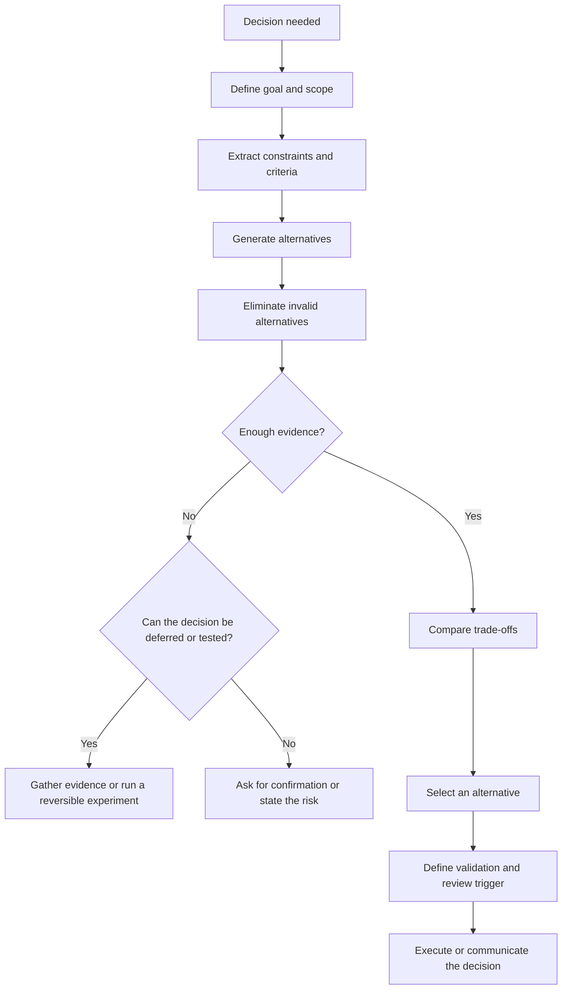
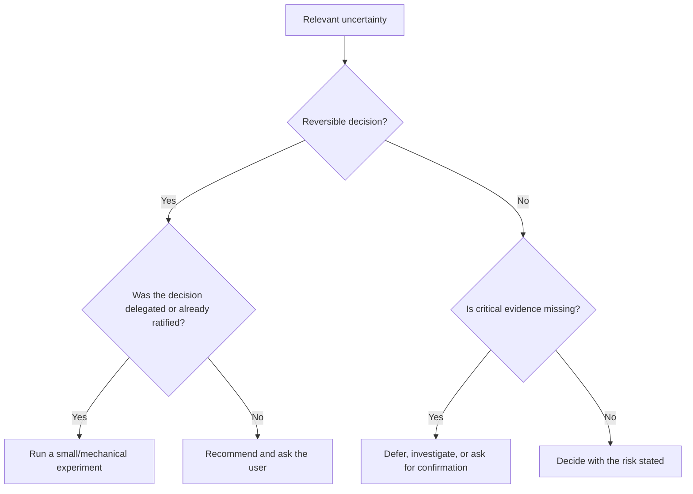

# Decision Making

## Purpose

Use Decision Making when more than one viable alternative exists and a direction must be chosen explicitly, proportionally, and justifiably.

The technique answers:

```text
- Which decision must be made now?
- Which criteria actually matter?
- Which alternatives are valid?
- What trade-offs does each alternative create?
- Is there enough evidence to decide?
- Is the decision reversible?
- Should we act, experiment, defer, ask for confirmation, or block?
```

Decision Making is not just listing pros and cons.

It requires:

1. defining the decision;
2. separating invalid alternatives from valid ones;
3. making criteria explicit;
4. weighing evidence, risks, and reversibility;
5. choosing the smallest decision necessary;
6. recording trade-offs and review conditions.

## Core principle

> Select and justify the best **recommendation**. Execute it only when the decision is mechanical and
> already covered by a ratified spec/plan, or when the user has explicitly delegated that category.
> Reversibility reduces risk; it does not transfer authority over the product to the LLM.


```mermaid
flowchart TD
    A[Decision needed] --> B[Define goal and scope]
    B --> C[Extract constraints and criteria]
    C --> D[Generate alternatives]
    D --> E[Eliminate invalid alternatives]
    E --> F{Enough evidence?}

    F -- No --> G{Can the decision be deferred or tested?}
    G -- Yes --> H[Gather evidence or run a reversible experiment]
    G -- No --> I[Ask for confirmation or state the risk]

    F -- Yes --> J[Compare trade-offs]
    J --> K[Select an alternative]
    K --> L[Define validation and review trigger]
    L --> M[Execute or communicate the decision]
```

## When to use

Use Decision Making when the task involves:

```text
- two or more valid alternatives;
- trade-offs among cost, deadline, security, simplicity, performance, or maintenance;
- an architectural decision;
- selecting a technology, library, vendor, or approach;
- backlog prioritization;
- choosing between fixing, reverting, mitigating, or investigating;
- a decision under uncertainty;
- a potentially irreversible action;
- the need to justify why one alternative was chosen;
- a conflict between legitimate preferences.
```

Good examples:

```text
- Choose between an async queue, optimized synchronous processing, or an external service.
- Decide whether a migration can happen now or needs a gradual strategy.
- Select an authentication library.
- Choose between a local fix and a structural refactor.
- Decide whether an incident requires rollback or hotfix.
- Prioritize security, deadline, or compatibility in a change.
```

## When to avoid

Do not use Decision Making as a formal process when there is a single correct action, determined by contract or direct evidence.

Avoid or simplify when:

```text
- only one option is compatible with the constraints;
- the choice is trivial, local, and reversible;
- the task is pure execution of a clear requirement;
- a direct source of truth exists;
- there is no material trade-off;
- building a decision matrix costs more than acting.
```

Examples:

```text
- Fix an invalid import.
- Apply a required field already defined in the schema.
- Run the test indicated by a CI error.
- Translate text.
- Rename a local variable.
```

## Relationship to other techniques

| Technique               | Responsibility                                                      |
| ----------------------- | ------------------------------------------------------------------- |
| Constraint Satisfaction | Defines what makes an option valid or invalid                       |
| Assumption Tracking     | Records conditions not yet confirmed                                |
| Evidence Synthesis      | Combines sources and evidence to evaluate alternatives              |
| Decision Making         | Selects, defers, conditions, or blocks a direction; includes search with pruning and backtracking for interdependent paths |
| Plan and Execute        | Organizes execution after the decision                              |
| Verification            | Confirms that the decision and its outcome meet the criteria        |
| Critique and Refine     | Corrects the decision or outcome when new evidence reveals flaws    |

## Decision types

### 1. Execution decision

Chooses how to do something.

```text
Example:
- Implement export as a synchronous endpoint or an async job.
```

### 2. Architecture decision

Chooses structure with long-term effects.

```text
Example:
- Use a modular monolith, microservices, or event-driven processing.
```

### 3. Priority decision

Chooses what to do first.

```text
Example:
- Fix an incident, ship a feature, or pay down technical debt.
```

### 4. Risk decision

Chooses among acting, mitigating, accepting the risk, deferring, or blocking.

```text
Example:
- Ship a hotfix now, revert the release, or wait for investigation.
```

### 5. Conditional decision

Chooses a direction that depends on a still-open assumption.

```text
Example:
- Use the existing queue, provided production capacity is confirmed.
```

## Interdependent paths (search with pruning and backtracking)

The default case for this technique compares **closed, independent** alternatives: the options are
already enumerated and the work is weighing trade-offs in a single pass. There is a less common case
where the choice is not linear — each decision opens or closes the next ones, and the viable path
only appears when you **build a partial solution, evaluate it, prune what does not hold, and
backtrack** to try another branch. It is search, not comparison: generate a partial path → evaluate
against the criteria → prune unviable branches → backtrack when an assumption falls → deepen the
promising branch.

You almost never need this externally: a model with extended reasoning already branches and prunes
internally while deciding. If the exploration fits inside the reasoning itself and ends in a
recommendation, treat it as an ordinary decision — enumerate 2 to 4 alternatives, compare, and
choose. Verbalizing "branches" adds no decision value.

Reserve **external, auditable** backtracking for when the branches must exist outside your head:
exploring 2-3 partial architectures in real files or prototypes before choosing; chaining migrations
where each step can only be validated after applying the previous one; any case where proving one
branch requires an artifact, test, or measurement the other branches do not share. There the value
is the explicit record of every prune and return.

Minimum discipline when external search is justified:

```text
- Generate 2 to 4 materially distinct branches, never superficial variants of the same one.
- For each promising branch, pick ONE action that produces evidence (read the contract, prototype,
  measure), not more hypothesis.
- Prune a branch as soon as it violates a mandatory requirement, is dominated, or is refuted by
  evidence — pruning is not failure; it is what cuts cost.
- Backtrack only on concrete evidence (a critical assumption fell, a dependency is missing),
  never out of aesthetics or insecurity.
- Stop when a branch satisfies the mandatory requirements and dominates the others, or when the
  exploration budget runs out and an acceptable viable branch exists.
- The end of the search produces a RECOMMENDATION with the evidence for each prune. If the choice
  is material (architecture, contract, data, risk), the user ratifies it — automatic closure only
  for a mechanical decision already covered by a ratified spec/contract.
```

If every branch gets pruned, do not force a choice among unviable ones: re-examine whether some
"mandatory" requirement is negotiable, seek evidence that rehabilitates a pruned branch, or escalate
the requirements conflict to the user with the trade-off made explicit.

## Decision criteria

Use criteria relevant to the context. Do not use a fixed list as an automatic checklist.

Common criteria:

```text
- Correctness.
- Security.
- Compatibility.
- Cost.
- Deadline.
- Simplicity.
- Maintainability.
- Performance.
- Scalability.
- Reliability.
- Observability.
- Reversibility.
- User experience.
- Operational risk.
- Third-party dependency.
```

### Priority rule

Mandatory constraints come before optimization criteria.

```text
Wrong:
Choose the fastest alternative even though it violates security.

Right:
Eliminate insecure alternatives and compare speed only among valid options.
```

## Sufficient evidence and tie-breaking

### Objective criterion for sufficient evidence

Evidence is sufficient when gathering more data would not change the chosen alternative.

```text
Test:
- If obtained, would the still-missing evidence change the selected alternative?
  - No -> the evidence is sufficient; decide.
  - Yes -> critical evidence is missing; gather it, experiment, or make the decision conditional.
  - Unsure -> treat it as critical if the decision is irreversible or high-impact;
    otherwise, decide with the risk stated and a review trigger set.
```

Secondary detail does not justify endless research. If the choice belongs to the user, present the
recommendation and ask even when it is reversible.

### Tie-breaking rule

When two or more valid alternatives tie on the criteria, break the tie in this order:

```text
1. Reversibility: prefer the one easiest to undo.
2. Smallest decision necessary: prefer the one that preserves the most future options.
3. Lowest operational risk and least third-party dependency.
4. Simplicity and maintenance cost.
5. If still tied: pick any valid one, record the tie as an assumption
   and set a review trigger; do not escalate a low-impact tie.
```

## Decision model (canonical template)

Use this single template to organize and record relevant decisions. For small decisions, fill in only the material fields; for high-impact decisions or permanent records, fill in all of them.

```text
Decision:
- [what needs to be chosen]

Goal:
- [outcome the decision must maximize or protect]

Scope:
- [what is inside and outside the decision]

Mandatory constraints:
- [what no option may violate]

Valid alternatives:
1. [option]
   - Benefits: [what improves]
   - Costs: [what it requires]
   - Risks: [what can fail]
   - Assumptions: [what must be true]
   - Reversibility: [how to back out]
   - Evidence: [facts, tests, sources, or observations]
   - Discard trigger: [what makes the option unviable]

2. [option]
   - (same fields)

Criteria:
- [how the options will be compared]

Decision made:
- [selected option, conditional decision, experiment, deferral, confirmation,
  accepted risk, block, or escalation]

Trade-offs:
- [what was prioritized and what was sacrificed, and why that is acceptable]

Open assumptions:
- [conditions not yet confirmed]

Risk:
- [impact if the decision is wrong]

Validation:
- [how to confirm in practice that the decision was adequate]

Review trigger:
- [event that will require re-evaluating the decision]
```

## Decisions under uncertainty

Not every decision will have complete evidence.

The question is not just "are we certain?"

The right question is:

```text
- Is the risk of deciding now lower than the cost of waiting?
- Is the decision reversible?
- Can we run a small experiment?
- Is there a conservative option?
- Is critical evidence missing, or only secondary detail?
- Who is responsible for accepting the risk?
```


```mermaid
flowchart TD
    A[Relevant uncertainty] --> B{Reversible decision?}
    B -- Yes --> C{Was the decision delegated or already ratified?}
    C -- Yes --> G[Run a small/mechanical experiment]
    C -- No --> H[Recommend and ask the user]
    B -- No --> D{Is critical evidence missing?}
    D -- Yes --> E[Defer, investigate, or ask for confirmation]
    D -- No --> F[Decide with the risk stated]
```

## Reversibility

Classify decisions by the cost of undoing them.

| Level                 | Characteristic                                       | Strategy                                        |
| --------------------- | ---------------------------------------------------- | ----------------------------------------------- |
| High reversibility    | Easy to change, low impact and low cost              | Decide quickly and validate                     |
| Medium reversibility  | Requires adjustment but has a viable rollback        | Define a checkpoint and contingency             |
| Low reversibility     | Affects data, contracts, users, or infrastructure    | Gather more evidence before deciding            |
| Irreversible          | Data loss, high cost, or permanent exposure          | Do not proceed without confirmation and strong validation |

Examples:

```text
High reversibility:
- Change interface copy.

Medium reversibility:
- Swap a filter component covered by tests.

Low reversibility:
- Change a public API contract.

Irreversible:
- Delete data without a backup.
```

## Possible actions

A decision does not always have to end in "picking a solution".

Choose among:

| Action                   | When to use                                                             |
| ------------------------ | ----------------------------------------------------------------------- |
| Decide and execute       | Mechanical step covered by a ratified/delegated decision                |
| Decide conditionally     | Depends on a tracked assumption                                         |
| Run an experiment        | Relevant uncertainty, but the decision is reversible                    |
| Defer                    | Critical evidence is missing and the cost of waiting is acceptable      |
| Ask for confirmation     | The choice belongs to the product/user, even when reversible            |
| Accept the risk          | User has ratified; uncertainty is non-critical, reversible, and mitigated |
| Block                    | No valid, safe, or authorized option exists                             |
| Escalate                 | The decision depends on an owner, permission, or external knowledge     |

## Smallest decision necessary

Do not make a decision bigger than the evidence allows.

```text
Bad:
"Let's migrate the whole architecture to microservices."

Better:
"Let's validate one isolated module as a separate service, since current evidence points to a bottleneck only in that domain."
```

The smallest decision necessary reduces risk and preserves future options.

## Conservative decision and experiment

When uncertainty is high, prefer a reversible option or a controlled experiment.

```text
Example:
Decision:
- Add a distributed cache.

Uncertainty:
- It has not been confirmed that the database is the bottleneck.

Conservative decision:
- Measure latency and the execution plan before adding a cache.

Experiment:
- Apply an index or a controlled optimization in a safe environment and compare metrics.

Outcome:
- Choose the cache only if evidence shows a proportional benefit.
```

## Explicit trade-offs

Every relevant decision sacrifices something.

Record:

```text
- What was prioritized.
- What was sacrificed.
- Why that trade-off is acceptable.
- What signal would indicate the decision needs revisiting.
```

Example:

```text
Decision:
- Use asynchronous processing with polling.

Prioritized:
- Fast API response and reuse of existing infrastructure.

Sacrificed:
- Immediate-result experience.

Rationale:
- Reports can take time and do not require a synchronous response.

Review trigger:
- Users demand real-time tracking, or abandonment during the wait becomes high.
```

## High-impact decisions

Before deciding on high-impact actions, confirm:

```text
[ ] The decision is within the user's or owner's authorization.
[ ] Mandatory constraints have been identified.
[ ] Viable alternatives have been considered.
[ ] Critical evidence has been verified.
[ ] Risks and reversibility have been assessed.
[ ] There is a rollback or contingency plan where applicable.
[ ] The impact on data, security, cost, and users has been considered.
[ ] There is a clear criterion to validate the decision.
```

High-impact examples:

```text
- Change production.
- Run a destructive migration.
- Delete data.
- Change a public contract.
- Add recurring cost.
- Change permissions.
- Publish sensitive information.
- Choose an architecture that is hard to reverse.
```

The impact scale (Low/Medium/High/Critical) and the effort budget per level come from the catalog: see [pelizzai-reasoning](../SKILL.md).

## Quality criteria

A quality decision must be:

```text
- Valid: respects mandatory constraints.
- Informed: uses proportional evidence.
- Proportional: does not demand impossible certainty for a reversible decision.
- Explicit: records criteria and trade-offs.
- Reversible when possible.
- Verifiable: has a success or failure signal.
- Reviewable: has a trigger for re-evaluation.
- Honest: states assumptions and uncertainties.
```

## Anti-patterns

### 1. Deciding without constraints or by preference

```text
Bad:
Choose the best performance while ignoring budget, compatibility, or security;
or treat a preference ("don't add a new dependency") as a mandatory rule.

Better:
Filter options by mandatory constraints before comparing optimizations;
recognize a preference as a preference and justify exceptions when needed.
```

### 2. Analysis paralysis

```text
Bad:
Keep researching marginal details for a reversible decision.

Better:
Define the minimum sufficient evidence, decide, and validate early.
```

### 3. Treating uncertainty as impossibility

```text
Bad:
Refuse to act because total certainty does not exist.

Better:
Use a reversible experiment, a conditional decision, or proportional mitigation.
```

### 4. Omitting the trade-off or review condition

```text
Bad:
"A queue is the best solution." (no trade-off, no review point)

Better:
"A queue reduces API blocking but introduces eventual consistency and extra operations;
re-evaluate at 10,000 daily jobs or when latency exceeds the defined limit."
```

### 5. Escalating a decision that can be resolved

```text
Bad:
Ask for confirmation on every small technical choice.

Better:
Escalate only when the decision changes scope, cost, priority, accepted risk, or an explicit requirement.
```

## Examples

### Example 1 — Contract change

```text
Decision:
- Make the `priority` field required now?

Alternatives:
A. Make it required immediately.
B. Make it optional with a temporary default.
C. Create a new version of the endpoint.

Constraints:
- Old clients remain active.
- Do not break the public integration.
- The migration must be reversible.

Evidence:
- A test with an old client fails without the field.
- Logs show old versions in use.

Decision:
- B: optional field with a default, deprecation, and a versioning plan.

Trade-off:
- Keeps compatibility but extends the coexistence period.

Validation:
- Monitor adoption of the new field and test old clients.

Review trigger:
- All active consumers migrate, or the deprecation deadline expires.
```

### Example 2 — Production incident

```text
Decision:
- Revert the deploy or apply a hotfix?

Alternatives:
A. Revert immediately.
B. Apply a hotfix.
C. Keep the version and investigate.

Constraints:
- 401 errors are affecting production login.
- Do not expose users to prolonged unavailability.
- The change must be reversible.

Evidence:
- The error spike started immediately after the deploy.
- The token-signing configuration changed.

Decision:
- A: revert immediately as containment.

Rationale:
- Under uncertainty, reverting reduces impact faster than a hotfix.

Next step:
- Investigate the configuration and add startup validation before the next deploy.
```

## Summary instruction for the agent

```text
- Do not demand total certainty for reversible decisions, but do not proceed without sufficient
  evidence (test: would the missing evidence change the choice?) for irreversible or critical decisions.
- On a tie between valid alternatives, break it by reversibility, then by the smallest decision necessary.
- Make the smallest decision necessary and record trade-offs, open assumptions, contingency, and the review trigger.
- Do not expose detailed chain of thought; communicate the decision, criteria, evidence,
  trade-offs, risks, limitations, and the relevant next step.
```

## Related techniques

- [Constraint Satisfaction](constraint-satisfaction.md) — defines what makes an option valid or invalid.
- [Assumption Tracking](assumption-tracking.md) — records assumptions and conditions not yet confirmed.
- [Evidence Synthesis](evidence-synthesis.md) — combines sources to evaluate alternatives.
- [Plan and Execute](plan-and-execute.md) — organizes execution after the decision.
- [Verification](verification.md) — confirms that the decision and its outcome meet the criteria.
- [Critique and Refine](critique-and-refine.md) — corrects the decision or outcome when new evidence reveals flaws.

Back to the [technique catalog](../SKILL.md).
