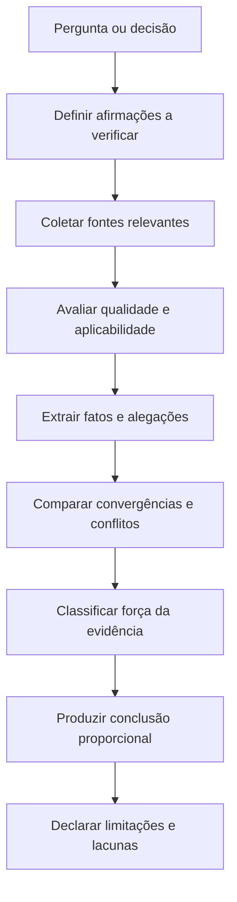
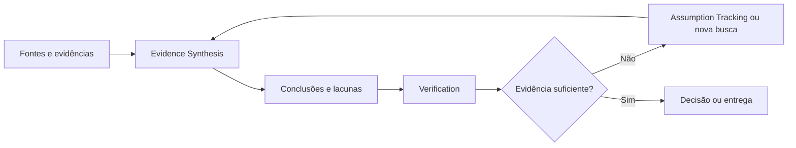
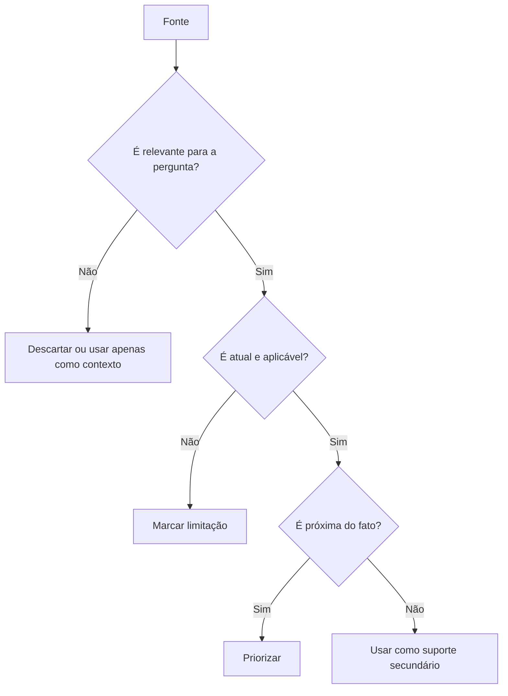
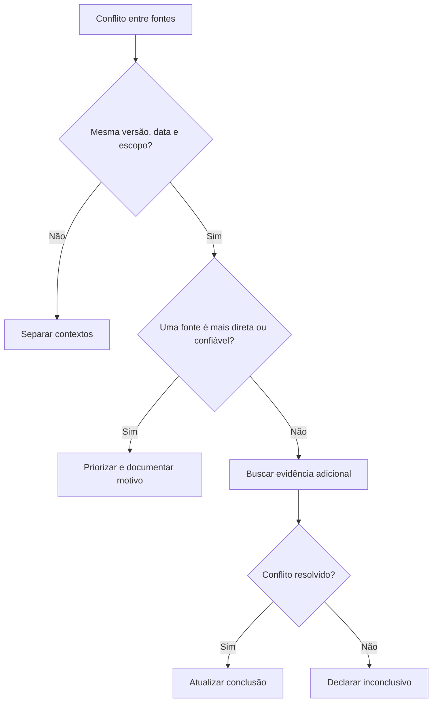

# Evidence Synthesis

## Objetivo

Use Evidence Synthesis quando uma resposta, decisão, análise ou recomendação depender de múltiplas fontes de informação.

A técnica ajuda a responder perguntas como:

```text
- Quais fontes realmente sustentam esta conclusão?
- Quais informações são fatos confirmados?
- Onde as fontes concordam?
- Onde elas divergem?
- Qual fonte deve prevalecer?
- A evidência é suficiente para recomendar uma ação?
- O que permanece incerto?
```

Evidence Synthesis não é apenas resumir fontes. Ela exige:

1. identificar a pergunta ou decisão;
2. coletar evidências relevantes;
3. avaliar qualidade, recência e aplicabilidade;
4. separar fatos de interpretações;
5. comparar convergências e conflitos;
6. produzir uma conclusão proporcional à evidência disponível.

## Princípio central

> Não trate várias fontes como várias verdades. Avalie o que cada fonte realmente prova, para qual contexto ela vale e quais limitações possui.



## Quando usar

Use Evidence Synthesis quando a tarefa envolver:

```text
- múltiplas fontes, documentos, arquivos ou páginas;
- pesquisa técnica;
- comparação de bibliotecas, ferramentas ou serviços;
- análise de logs, testes, código e documentação;
- recomendação com impacto relevante;
- fatos atuais, regras, preços, políticas ou versões;
- documentos contraditórios;
- análise jurídica, financeira, médica ou regulatória;
- investigação de incidentes;
- decisão arquitetural;
- revisão de requisitos dispersos;
- conclusões baseadas em dados, relatórios ou métricas.
```

Exemplos adequados:

```text
- Comparar bibliotecas de autenticação para uma stack específica.
- Avaliar se uma API suporta determinado fluxo.
- Sintetizar requisitos de README, código, testes e tickets.
- Identificar causa provável de bug usando logs, testes e código.
- Elaborar recomendação a partir de documentação oficial e limitações do projeto.
- Analisar documentos com versões divergentes.
- Verificar se uma tecnologia continua compatível com a versão usada no projeto.
```

## Quando evitar

Não use Evidence Synthesis quando existe uma única fonte de verdade clara e suficiente.

Evite ou simplifique quando:

```text
- o usuário forneceu todo o conteúdo necessário;
- a tarefa é puramente criativa;
- há um único contrato, schema ou teste que responde diretamente;
- a resposta é conceitual, estável e não depende de fonte atual;
- buscar múltiplas fontes não reduz incerteza relevante;
- a tarefa é uma tradução, reescrita ou resumo simples.
```

Exemplos inadequados:

```text
- Traduzir uma frase.
- Renomear uma variável.
- Explicar conceito básico de programação.
- Corrigir erro de sintaxe.
- Resumir um único parágrafo fornecido pelo usuário.
```

## Relação com outras técnicas

| Técnica                 | Responsabilidade                                                 |
| ----------------------- | ---------------------------------------------------------------- |
| Evidence Synthesis      | Combina e interpreta evidências de múltiplas fontes              |
| Verification            | Confirma se uma afirmação específica possui evidência suficiente |
| Assumption Tracking     | Registra premissas ainda não confirmadas                         |
| Constraint Satisfaction | Garante respeito a requisitos e proibições                       |
| Tree of Thoughts        | Explora alternativas concorrentes                                |
| Self-Consistency        | Compara tentativas independentes                                 |
| ReAct                   | Busca, observa e atualiza o estado                               |
| Plan and Execute        | Organiza etapas e checkpoints                                    |
| Critique and Refine     | Corrige conclusões ou artefatos após identificar falhas          |



### Regra de integração

Use Evidence Synthesis para responder:

```text
- O que as fontes dizem em conjunto?
- Quais fontes são mais confiáveis para esta pergunta?
- Quais conclusões são sustentadas?
- Onde há conflito ou ausência de evidência?
```

Use Verification para responder:

```text
- Esta afirmação específica foi comprovada o suficiente?
```

## Tipos de fonte e hierarquia por contexto

A qualidade de uma fonte depende da pergunta. Não existe hierarquia universal: a regra geral é **preferir a fonte mais próxima do fato**, atual e aplicável ao contexto.

### Camadas de fonte

| Camada     | O que é                                          | Exemplos                                                                                                                                                                                                                    |
| ---------- | ------------------------------------------------ | --------------------------------------------------------------------------------------------------------------------------------------------------------------------------------------------------------------------------- |
| Primária   | Produz ou registra diretamente o fato analisado  | Código-fonte, testes executados, logs, schema de API, resposta real de endpoint, documento original, lei/contrato/norma, artigo científico original, base de dados oficial, changelog oficial, relatório financeiro oficial |
| Secundária | Interpreta, resume ou explica fontes primárias   | Artigos técnicos, tutoriais, relatórios de mercado, documentação não oficial, análises de especialistas, reviews                                                                                                            |
| Terciária  | Organiza ou agrega conhecimento de várias fontes | Wikis, listas comparativas, resumos genéricos, respostas em fóruns, compilações de links                                                                                                                                    |

Fontes terciárias podem ajudar a descobrir caminhos, mas não devem sustentar sozinhas conclusões de alto impacto.

### Hierarquia por contexto

A ordem de prioridade muda conforme o domínio, mas sempre privilegia a fonte mais próxima do fato.

```text
Tecnologia e desenvolvimento:
1. Código, testes, logs, schema e comportamento real.
2. Documentação oficial da versão usada.
3. Repositório oficial, changelog e issues oficiais.
4. Artigos técnicos confiáveis.
5. Fóruns, blogs e exemplos comunitários.

Integração de API:
1. Contrato, schema e chamada controlada.
2. Documentação oficial.
3. Código do cliente ou servidor.
4. Logs, telemetria e testes de integração.
5. Relatos de terceiros.

Pesquisa factual atual:
1. Fonte primária atual ou órgão oficial.
2. Documento, anúncio ou dado original.
3. Veículo confiável que cite fontes primárias.
4. Análise especializada.
5. Comentários, agregadores ou redes sociais.

Dados e cálculos:
1. Dados de origem.
2. Fórmula, consulta ou processo reproduzível.
3. Relatório gerado diretamente da fonte.
4. Resumo ou planilha derivada.
5. Relato informal.
```

## Modelo de evidência

Para cada evidência relevante, registre:

```text
Fonte:
- [origem da informação]

Tipo:
- Primária, secundária ou terciária.

Afirmação sustentada:
- [o que a fonte realmente demonstra]

Escopo:
- [para quais versões, datas, ambientes ou condições vale]

Recência:
- [quando foi produzida, atualizada ou observada]

Confiabilidade:
- [por que a fonte é adequada ou limitada]

Conflitos:
- [quais fontes divergem]

Limitações:
- [o que a fonte não prova]

Status:
- Confirmada, parcial, conflitante, desatualizada, insuficiente ou refutada.
```

Exemplo:

```text
Fonte:
- Schema OpenAPI do serviço.

Tipo:
- Primária.

Afirmação sustentada:
- O endpoint aceita o parâmetro `status`.

Escopo:
- Versão atual da API exposta no ambiente analisado.

Recência:
- Gerado na execução atual.

Confiabilidade:
- Alta; representa contrato formal da API.

Limitações:
- Não confirma como o filtro se comporta com valores inválidos ou grande volume de dados.

Status:
- Confirmada para existência do parâmetro.
```

## Separação entre fato, inferência e opinião

Não misture o que uma fonte mostra com a conclusão derivada dela.

| Categoria       | Definição                                                   | Exemplo                                                |
| --------------- | ----------------------------------------------------------- | ------------------------------------------------------ |
| Fato confirmado | Observado ou sustentado diretamente por evidência confiável | O endpoint retorna HTTP 422 para payload inválido      |
| Inferência      | Conclusão derivada de fatos confirmados                     | O frontend provavelmente envia campo incompatível      |
| Opinião         | Avaliação subjetiva ou recomendação                         | A biblioteca parece mais simples de adotar             |
| Hipótese        | Explicação possível ainda não validada                      | O bug pode estar no cache                              |
| Desconhecido    | Informação ausente                                          | Não foi confirmado se clientes legados usam o endpoint |

```text
Regra:
Uma inferência pode ser forte, mas não deve ser apresentada como fato direto.
```

### Mapeamento entre os eixos de status

Este arquivo usa três vocabulários para classificar evidência. Eles descrevem eixos distintos, mas se alinham assim:

| Categoria epistêmica (fato/inferência) | Status no Modelo de evidência (por fonte) | Força da conclusão (síntese final) |
| -------------------------------------- | ----------------------------------------- | ---------------------------------- |
| Fato confirmado                        | Confirmada                                | Confirmado / Fortemente sustentado |
| Inferência                             | Parcial                                   | Provável                           |
| Hipótese                               | Insuficiente                              | Possível                           |
| Desconhecido                           | Insuficiente / conflitante                | Inconclusivo                       |
| (contradição comprovada)               | Refutada                                  | Refutado                           |

"Hipótese" (categoria epistêmica) e "Possível" (força da conclusão) descrevem o mesmo grau: explicação plausível ainda sem validação suficiente.

## Processo de síntese

### 1. Definir a pergunta

Comece com uma pergunta verificável.

```text
Ruim:
"Qual biblioteca é melhor?"

Melhor:
"Qual biblioteca atende FastAPI atual, OAuth com Google, PostgreSQL, política de sessão definida e manutenção ativa?"
```

```text
Ruim:
"Por que a API está lenta?"

Melhor:
"Qual componente explica a maior parte da latência observada no endpoint X?"
```

### 2. Definir afirmações necessárias

Quebre a pergunta em afirmações que precisam ser sustentadas.

```text
Pergunta:
- Esta biblioteca é adequada para autenticação?

Afirmações necessárias:
- É compatível com a versão atual do framework.
- Suporta OAuth com Google.
- Integra com o banco usado no projeto.
- Possui manutenção ativa.
- Não exige infraestrutura incompatível.
- Atende à política de sessão necessária.
```

Não busque fontes aleatórias antes de saber o que precisa ser comprovado.

### 3. Coletar evidência relevante

Colete apenas fontes que possam responder às afirmações necessárias.

```text
Priorize:
- documentação oficial;
- código e contratos reais;
- testes;
- logs;
- changelogs;
- fontes primárias;
- dados diretamente observáveis.
```

Evite acumular fontes sem propósito.

```text
Ruim:
Ler dez artigos genéricos sobre autenticação.

Melhor:
Consultar documentação da biblioteca, compatibilidade da versão, exemplo oficial de OAuth e contrato atual do projeto.
```

### 4. Avaliar qualidade e aplicabilidade

Pergunte para cada fonte:

```text
- Esta fonte é próxima do fato analisado?
- Ela é atual para a versão, período ou ambiente relevante?
- Ela trata exatamente da pergunta?
- O autor ou sistema possui autoridade sobre o assunto?
- A fonte possui incentivo ou viés relevante?
- Há contexto omitido?
- A fonte pode estar desatualizada?
```



### 5. Extrair alegações verificáveis

Não sintetize documentos inteiros de uma vez. Extraia as afirmações que importam.

```text
Fonte:
- Documento de API.

Alegação:
- O campo `priority` é opcional.

Evidência:
- Schema não o marca como obrigatório.

Limitações:
- O schema não prova comportamento de clientes antigos.
```

### 6. Comparar convergências

Convergência existe quando fontes independentes sustentam a mesma conclusão.

```text
Exemplo:
- Schema confirma que o campo existe.
- Código do backend processa o campo.
- Teste de integração confirma comportamento real.

Síntese:
- Há evidência forte de que o campo é suportado.
```

A convergência é mais forte quando as fontes possuem métodos ou origens diferentes. Quando há agregação de muitas tentativas ou evidências independentes apontando para a mesma resposta, [Self-Consistency](self-consistency.md) é a técnica auxiliar para medir esse acordo.

### 7. Tratar conflitos

Quando fontes divergem, não escolha automaticamente a mais conveniente. Primeiro identifique a natureza do conflito. Em casos de agregação ou evidências conflitantes entre tentativas independentes, apoie-se em [Self-Consistency](self-consistency.md).

| Tipo de conflito | Exemplo                                           | Tratamento                                 |
| ---------------- | ------------------------------------------------- | ------------------------------------------ |
| Temporal         | Documento antigo diverge da versão atual          | Priorizar fonte atual e registrar mudança  |
| De escopo        | Fonte fala de versão diferente                    | Separar contextos                          |
| De ambiente      | Funciona localmente, falha em produção            | Investigar configuração e ambiente         |
| De definição     | Fontes usam termos diferentes                     | Normalizar conceitos                       |
| De evidência     | Uma fonte é indireta e outra é observação direta  | Priorizar evidência mais próxima do fato   |
| Real             | Duas fontes confiáveis divergem no mesmo contexto | Declarar incerteza e buscar nova evidência |



## Força da conclusão

A conclusão deve refletir a qualidade da evidência. Os rótulos abaixo são o eixo de síntese final (ver mapeamento na seção de fato/inferência).

| Status                | Uso                                                        |
| --------------------- | ---------------------------------------------------------- |
| Confirmado            | Evidência direta e suficiente para o contexto              |
| Fortemente sustentado | Múltiplas evidências convergentes, com pequenas limitações |
| Provável              | Evidência relevante, mas indireta ou incompleta            |
| Possível              | Hipótese plausível sem validação suficiente                |
| Inconclusivo          | Evidências insuficientes ou conflitantes                   |
| Refutado              | Evidência confiável contradiz a afirmação                  |

Exemplo:

```text
Confirmado:
- O endpoint não aceita campo obrigatório ausente.

Provável:
- A falha da interface decorre de incompatibilidade de payload.

Inconclusivo:
- Não foi possível confirmar se um cliente externo depende do comportamento antigo.

Refutado:
- A hipótese de indisponibilidade da API foi descartada pelo log e pela chamada controlada.
```

## Síntese proporcional

Uma boa síntese não exagera.

```text
Ruim:
"A biblioteca é totalmente compatível e resolve autenticação."

Melhor:
"A documentação oficial confirma suporte ao fluxo OAuth analisado e compatibilidade com a versão atual do framework. A integração com a política específica de refresh token ainda precisa de prova de conceito."
```

```text
Ruim:
"Os pedidos duplicam por causa do frontend."

Melhor:
"Logs confirmam requests repetidos; isso sugere participação do cliente ou de retries. Ainda é necessário verificar idempotência no backend e consumo de mensagens antes de atribuir causa única."
```

## Matriz de síntese

Use uma matriz quando houver várias afirmações ou fontes relevantes.

| Afirmação                              | Fonte principal      | Evidência adicional | Status         | Limitação                                |
| -------------------------------------- | -------------------- | ------------------- | -------------- | ---------------------------------------- |
| API aceita `status`                    | Schema atual         | Teste de integração | Confirmado     | Valores inválidos ainda não testados     |
| Clientes antigos continuam compatíveis | Telemetria parcial   | Teste local         | Parcial        | Nem todos os clientes foram simulados    |
| Biblioteca suporta OAuth               | Documentação oficial | Exemplo oficial     | Confirmado     | Fluxo de refresh token precisa validação |
| Infraestrutura suporta fila            | Configuração local   | Nenhuma             | Não verificado | Produção ainda não confirmada            |

Não use tabelas decorativas. A matriz deve orientar decisão, investigação ou comunicação de limitações.

## Relevância e recência

Uma fonte confiável pode ser inadequada se estiver fora de contexto.

```text
Exemplos:
- Documentação de versão antiga não confirma comportamento da versão atual.
- Log de um ambiente não prova comportamento em outro.
- Benchmark genérico não prova performance no projeto.
- Artigo acadêmico não prova viabilidade operacional imediata.
- Documento interno antigo pode não refletir política atual.
```

Sempre registre, quando relevante:

```text
- versão;
- data;
- ambiente;
- escopo;
- configuração;
- população ou conjunto de dados;
- limitações conhecidas.
```

## Evidência negativa

Ausência de evidência não é automaticamente evidência de ausência.

```text
Ruim:
"Não encontrei clientes usando endpoint legado, então ninguém usa."

Melhor:
"Não foram encontrados usos nos logs analisados; isso reduz a probabilidade, mas não prova ausência completa de consumidores."
```

Use evidência negativa apenas quando a fonte ou método teria alta chance de detectar o que está sendo procurado.

## Fontes conflitantes e decisão

Quando não for possível resolver conflito, a decisão deve considerar risco. A escala de risco/impacto (Baixo/Médio/Alto/Crítico) segue o orçamento de esforço da skill [pelizzai-reasoning](../SKILL.md).

```text
Baixo:
- Escolher opção reversível e monitorar.

Médio:
- Executar prova de conceito ou teste controlado.

Alto:
- Não avançar sem evidência adicional ou confirmação do responsável.

Crítico:
- Bloquear decisão até obter fonte primária, teste independente ou autorização explícita.
```

## Regras de parada

Pare de coletar e iterar quando qualquer critério objetivo for atendido, sempre dentro do orçamento de esforço da skill [pelizzai-reasoning](../SKILL.md):

```text
- Convergência: N fontes independentes (com métodos ou origens diferentes) sustentam a mesma conclusão.
- Afirmação crítica confirmada por fonte primária (código, schema, teste, log ou documento original).
- Esgotamento útil: novas fontes não reduzem mais a incerteza relevante.
- Orçamento de esforço atingido: registrar como inconclusivo e declarar limitações em vez de buscar indefinidamente.
```

Calibre N pelo risco: Baixo/Médio podem aceitar convergência de 2 fontes independentes; Alto/Crítico exigem confirmação por fonte primária ou autorização do responsável.

## Evidência para recomendações

Uma recomendação deve conter:

```text
Recomendação:
- Qual opção é sugerida.

Evidências:
- Fatos que sustentam a escolha.

Critérios:
- Requisitos e restrições usados para comparar opções.

Trade-offs:
- Custos, riscos e preferências sacrificadas.

Contra-argumento:
- Em qual cenário outra opção seria melhor.

Limitações:
- O que não foi confirmado.

Nível de confiança:
- Alto, médio ou baixo, com motivo.
```

Exemplo:

```text
Recomendação:
- Usar fila assíncrona com infraestrutura já existente.

Evidências:
- O endpoint possui operação pesada; há broker disponível no ambiente analisado.

Trade-offs:
- Maior complexidade operacional e necessidade de idempotência.

Contra-argumento:
- Se o volume for baixo e a resposta imediata for obrigatória, uma otimização síncrona pode ser mais simples.

Limitações:
- Capacidade do broker em produção ainda precisa ser confirmada.

Nível de confiança:
- Médio.
```

## Anti-padrões

### 1. Contar fontes em vez de avaliar qualidade

```text
Ruim:
"Cinco blogs dizem que a ferramenta é boa."

Melhor:
"A documentação oficial confirma compatibilidade; dois relatos independentes indicam limitação em cenário específico."
```

### 2. Usar fonte fora de escopo

```text
Ruim:
Usar documentação de versão 2 para afirmar comportamento da versão 4.

Melhor:
Confirmar versão, ambiente e contrato antes de usar a fonte.
```

### 3. Confundir citação com evidência

```text
Ruim:
Adicionar várias referências que não sustentam a afirmação central.

Melhor:
Citar a fonte que prova exatamente a afirmação feita.
```

### 4. Ignorar evidência contrária

```text
Ruim:
Selecionar apenas fontes que confirmam a hipótese inicial.

Melhor:
Registrar conflito, investigar causa e ajustar conclusão.
```

### 5. Concluir além do que a fonte prova

```text
Ruim:
"A documentação mostra que o campo existe, então todos os clientes são compatíveis."

Melhor:
"O campo existe no contrato atual; compatibilidade com clientes antigos requer validação separada."
```

### 6. Tratar ausência como prova

```text
Ruim:
"Não há problema porque não encontrei log de erro."

Melhor:
"Não foram encontrados erros no período analisado; verificar cobertura de logs e fluxo observado antes de concluir."
```

### 7. Misturar fatos e preferências

```text
Ruim:
"A biblioteca é melhor porque é popular."

Melhor:
"A biblioteca possui comunidade maior; ainda é necessário comparar compatibilidade, manutenção e requisitos do projeto."
```

## Exemplos

### Exemplo 1 — Biblioteca técnica

```text
Pergunta:
- Qual biblioteca usar para autenticação?

Afirmações:
- Compatibilidade com framework.
- OAuth com Google.
- Integração com banco.
- Manutenção ativa.
- Política de sessão adequada.

Fontes:
- Documentação oficial.
- Changelog.
- Repositório oficial.
- Código atual do projeto.
- Exemplo oficial.

Síntese:
- Opção A atende compatibilidade e OAuth.
- Opção B possui integração mais simples, mas depende de versão incompatível.
- Opção C exige serviço externo pago.

Conclusão:
- Opção A é a mais adequada para as restrições atuais.
- A política de refresh token ainda exige prova de conceito.
```

### Exemplo 2 — Diagnóstico de bug

```text
Pergunta:
- Por que pedidos estão duplicando?

Evidências:
- Logs mostram requests repetidos.
- Teste de integração permite criação repetida.
- Backend não possui chave de idempotência.
- Worker também permite reprocessamento.

Síntese:
- Há múltiplas camadas capazes de produzir duplicidade.
- Não é seguro atribuir causa única ao clique duplo.

Conclusão:
- A ausência de idempotência no backend é causa estrutural confirmada.
- O clique duplo pode ser fator contribuinte, mas precisa de validação específica.
```

## Formato compacto para comunicar a síntese

Use este formato para comunicar síntese de evidências e para a entrega final ao agente. Ele consolida o checklist do processo: cada campo corresponde a uma etapa já descrita acima.

```text
Pergunta:
- [o que precisa ser respondido]

Afirmações analisadas:
- [itens que precisam de suporte]

Evidências principais:
- [fonte]: [o que sustenta]
- [fonte]: [o que sustenta]

Convergências:
- [pontos sustentados por múltiplas evidências independentes]

Conflitos:
- [divergências e possível explicação]

Limitações:
- [lacunas, contexto ausente ou fonte desatualizada]

Conclusão:
- [confirmada, fortemente sustentada, provável, possível, inconclusiva ou refutada]

Nível de confiança:
- [alto, médio ou baixo]
```

Lembretes que não estão cobertos pelos campos acima:

```text
- Priorize qualidade e independência das fontes; nunca conte fontes.
- Não conclua além da evidência disponível.
- Use Verification para confirmar afirmações críticas.
- Não exponha cadeia de pensamento detalhada; comunique apenas evidências relevantes, síntese, conclusão, limitações e decisão.
```

## Técnicas relacionadas

- [Verification](verification.md) — confirma se uma afirmação crítica possui evidência suficiente.
- [Assumption Tracking](assumption-tracking.md) — registra premissas ainda não confirmadas.
- [Constraint Satisfaction](constraint-satisfaction.md) — garante respeito a requisitos e proibições.
- [Tree of Thoughts](tree-of-thoughts.md) — explora alternativas concorrentes.
- [Self-Consistency](self-consistency.md) — compara tentativas independentes; auxiliar para agregação e evidências conflitantes.
- [Decision Making](decision-making.md) — estrutura a escolha entre opções com critérios e trade-offs.
- [ReAct](react.md) — busca, observa e atualiza o estado.
- [Plan and Execute](plan-and-execute.md) — organiza etapas e checkpoints.
- [Critique and Refine](critique-and-refine.md) — corrige conclusões ou artefatos após identificar falhas.

Voltar a skill [pelizzai-reasoning](../SKILL.md).
