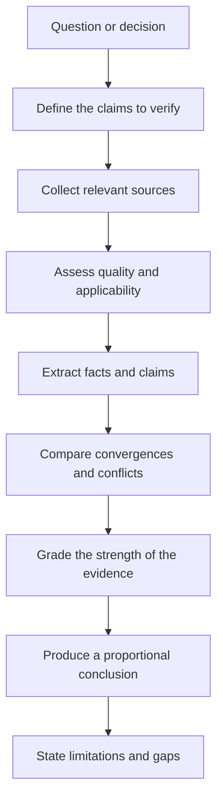
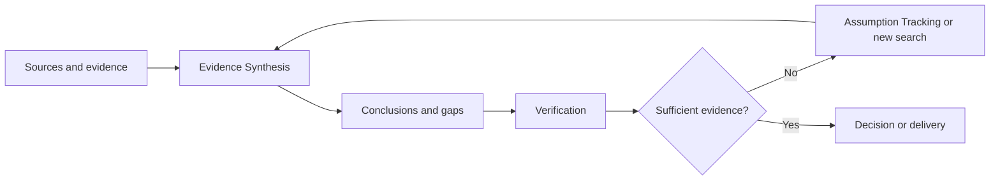
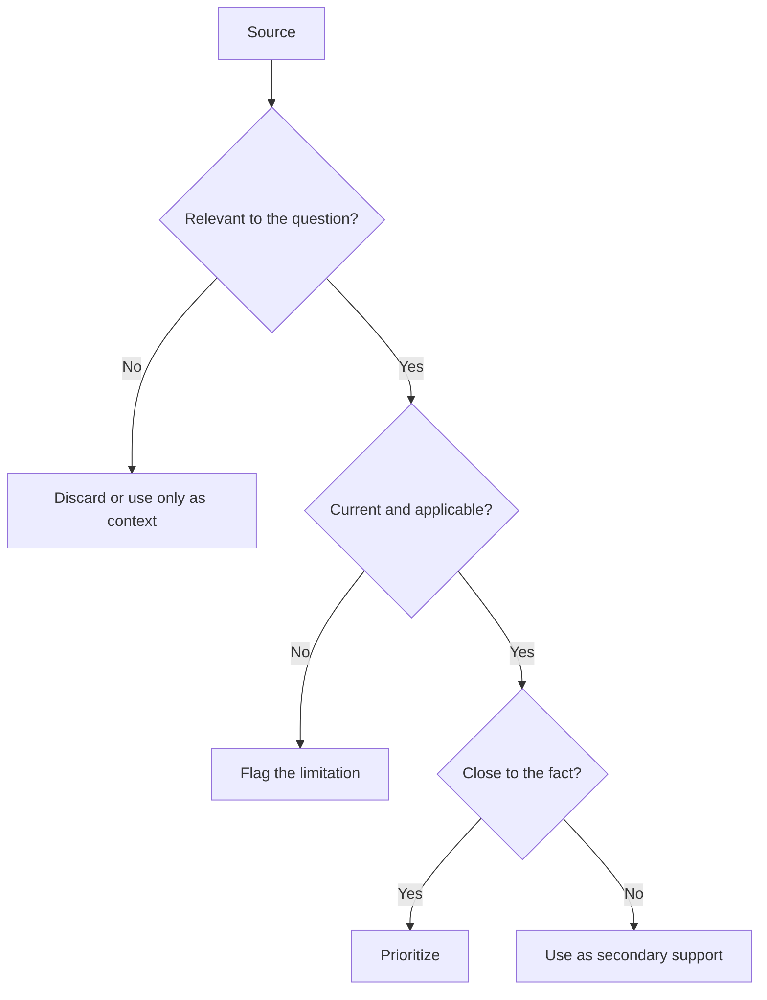
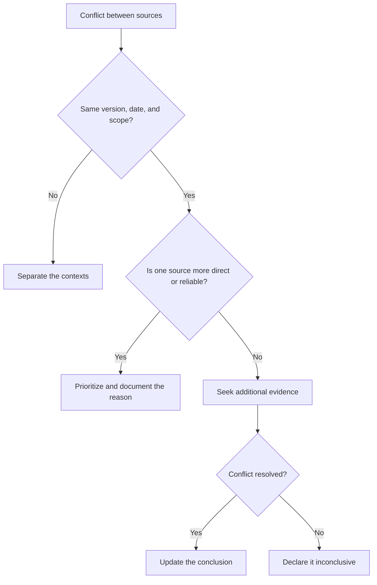

# Evidence Synthesis

## Purpose

Use Evidence Synthesis when an answer, decision, analysis, or recommendation depends on multiple sources of information.

The technique helps answer questions like:

```text
- Which sources actually support this conclusion?
- Which pieces of information are confirmed facts?
- Where do the sources agree?
- Where do they diverge?
- Which source should prevail?
- Is the evidence sufficient to recommend an action?
- What remains uncertain?
```

Evidence Synthesis is not just summarizing sources. It requires:

1. identifying the question or decision;
2. collecting relevant evidence;
3. assessing quality, recency, and applicability;
4. separating facts from interpretations;
5. comparing convergences and conflicts;
6. producing a conclusion proportional to the available evidence.

## Core principle

> Do not treat multiple sources as multiple truths. Assess what each source actually proves, which context it applies to, and what limitations it has.


```mermaid
flowchart TD
    A[Question or decision] --> B[Define the claims to verify]
    B --> C[Collect relevant sources]
    C --> D[Assess quality and applicability]
    D --> E[Extract facts and claims]
    E --> F[Compare convergences and conflicts]
    F --> G[Grade the strength of the evidence]
    G --> H[Produce a proportional conclusion]
    H --> I[State limitations and gaps]
```

## When to use

Use Evidence Synthesis when the task involves:

```text
- multiple sources, documents, files, or pages;
- technical research;
- comparing libraries, tools, or services;
- analyzing logs, tests, code, and documentation;
- a recommendation with relevant impact;
- current facts, rules, prices, policies, or versions;
- contradictory documents;
- legal, financial, medical, or regulatory analysis;
- incident investigation;
- an architectural decision;
- reviewing scattered requirements;
- conclusions based on data, reports, or metrics.
```

Good examples:

```text
- Compare authentication libraries for a specific stack.
- Assess whether an API supports a given flow.
- Synthesize requirements from README, code, tests, and tickets.
- Identify the likely cause of a bug using logs, tests, and code.
- Build a recommendation from official documentation and project constraints.
- Analyze documents with diverging versions.
- Verify that a technology is still compatible with the version used in the project.
```

## When to avoid

Do not use Evidence Synthesis when a single, clear, and sufficient source of truth exists.

Avoid or simplify when:

```text
- the user has provided all the necessary content;
- the task is purely creative;
- a single contract, schema, or test answers the question directly;
- the answer is conceptual, stable, and does not depend on a current source;
- consulting multiple sources does not reduce relevant uncertainty;
- the task is a simple translation, rewrite, or summary.
```

Poor examples:

```text
- Translate a sentence.
- Rename a variable.
- Explain a basic programming concept.
- Fix a syntax error.
- Summarize a single paragraph provided by the user.
```

## Relationship to other techniques

| Technique               | Responsibility                                                   |
| ----------------------- | ---------------------------------------------------------------- |
| Evidence Synthesis      | Combines and interprets evidence from multiple sources           |
| Verification            | Confirms whether a specific claim has sufficient evidence        |
| Assumption Tracking     | Records assumptions not yet confirmed                            |
| Constraint Satisfaction | Ensures requirements and prohibitions are respected              |
| Decision Making         | Chooses among alternatives, including interdependent paths       |
| ReAct                   | Searches, observes, and updates state                            |
| Plan and Execute        | Organizes steps and checkpoints                                  |
| Critique and Refine     | Corrects conclusions or artifacts after finding flaws            |


```mermaid
flowchart LR
    A[Sources and evidence] --> B[Evidence Synthesis]
    B --> C[Conclusions and gaps]
    C --> D[Verification]
    D --> E{Sufficient evidence?}
    E -- No --> F[Assumption Tracking or new search]
    F --> B
    E -- Yes --> G[Decision or delivery]
```

### Integration rule

Use Evidence Synthesis to answer:

```text
- What do the sources say together?
- Which sources are most reliable for this question?
- Which conclusions are supported?
- Where is there conflict or missing evidence?
```

Use Verification to answer:

```text
- Has this specific claim been proven well enough?
```

## Source types and context-dependent hierarchy

The quality of a source depends on the question. There is no universal hierarchy: the general rule is to **prefer the source closest to the fact**, current and applicable to the context.

### Source layers

| Layer     | What it is                                        | Examples                                                                                                                                                                                                                   |
| --------- | ------------------------------------------------- | -------------------------------------------------------------------------------------------------------------------------------------------------------------------------------------------------------------------------- |
| Primary   | Directly produces or records the fact under analysis | Source code, executed tests, logs, API schema, real endpoint response, original document, law/contract/standard, original scientific paper, official database, official changelog, official financial report             |
| Secondary | Interprets, summarizes, or explains primary sources | Technical articles, tutorials, market reports, unofficial documentation, expert analyses, reviews                                                                                                                         |
| Tertiary  | Organizes or aggregates knowledge from multiple sources | Wikis, comparison lists, generic summaries, forum answers, link compilations                                                                                                                                          |

Tertiary sources can help discover paths, but must not support high-impact conclusions on their own.

### Context-dependent hierarchy

The priority order changes with the domain, but always favors the source closest to the fact.

```text
Technology and development:
1. Code, tests, logs, schema, and real behavior.
2. Official documentation for the version in use.
3. Official repository, changelog, and official issues.
4. Reliable technical articles.
5. Forums, blogs, and community examples.

API integration:
1. Contract, schema, and a controlled call.
2. Official documentation.
3. Client or server code.
4. Logs, telemetry, and integration tests.
5. Third-party reports.

Current factual research:
1. Current primary source or official body.
2. Original document, announcement, or data.
3. Reliable outlet citing primary sources.
4. Expert analysis.
5. Comments, aggregators, or social media.

Data and calculations:
1. Source data.
2. Reproducible formula, query, or process.
3. Report generated directly from the source.
4. Derived summary or spreadsheet.
5. Informal account.
```

## Evidence model

For each relevant piece of evidence, record:

```text
Source:
- [where the information comes from]

Type:
- Primary, secondary, or tertiary.

Claim supported:
- [what the source actually demonstrates]

Scope:
- [which versions, dates, environments, or conditions it applies to]

Recency:
- [when it was produced, updated, or observed]

Reliability:
- [why the source is adequate or limited]

Conflicts:
- [which sources diverge]

Limitations:
- [what the source does not prove]

Status:
- Confirmed, partial, conflicting, outdated, insufficient, or refuted.
```

Example:

```text
Source:
- The service's OpenAPI schema.

Type:
- Primary.

Claim supported:
- The endpoint accepts the `status` parameter.

Scope:
- Current API version exposed in the analyzed environment.

Recency:
- Generated in the current run.

Reliability:
- High; it represents the API's formal contract.

Limitations:
- Does not confirm how the filter behaves with invalid values or large data volumes.

Status:
- Confirmed for the parameter's existence.
```

## Separating fact, inference, and opinion

Do not mix what a source shows with the conclusion derived from it.

| Category        | Definition                                                  | Example                                                  |
| --------------- | ----------------------------------------------------------- | -------------------------------------------------------- |
| Confirmed fact  | Observed or directly supported by reliable evidence         | The endpoint returns HTTP 422 for an invalid payload     |
| Inference       | Conclusion derived from confirmed facts                     | The frontend probably sends an incompatible field        |
| Opinion         | Subjective assessment or recommendation                     | The library seems simpler to adopt                       |
| Hypothesis      | Possible explanation not yet validated                      | The bug may be in the cache                              |
| Unknown         | Missing information                                         | Whether legacy clients use the endpoint is not confirmed |

```text
Rule:
An inference can be strong, but it must not be presented as a direct fact.
```

### Mapping between the status axes

This file uses three vocabularies to classify evidence. They describe distinct axes, but align like this:

| Epistemic category (fact/inference) | Status in the Evidence model (per source) | Strength of the conclusion (final synthesis) |
| ----------------------------------- | ----------------------------------------- | -------------------------------------------- |
| Confirmed fact                      | Confirmed                                 | Confirmed / Strongly supported               |
| Inference                           | Partial                                   | Likely                                       |
| Hypothesis                          | Insufficient                              | Possible                                     |
| Unknown                             | Insufficient / conflicting                | Inconclusive                                 |
| (proven contradiction)              | Refuted                                   | Refuted                                      |

"Hypothesis" (epistemic category) and "Possible" (strength of the conclusion) describe the same degree: a plausible explanation without sufficient validation.

## Synthesis process

### 1. Define the question

Start with a verifiable question.

```text
Bad:
"Which library is best?"

Better:
"Which library supports current FastAPI, OAuth with Google, PostgreSQL, the defined session policy, and active maintenance?"
```

```text
Bad:
"Why is the API slow?"

Better:
"Which component explains most of the latency observed on endpoint X?"
```

### 2. Define the necessary claims

Break the question into claims that need support.

```text
Question:
- Is this library adequate for authentication?

Necessary claims:
- It is compatible with the current framework version.
- It supports OAuth with Google.
- It integrates with the database used in the project.
- It has active maintenance.
- It does not require incompatible infrastructure.
- It meets the required session policy.
```

Do not chase random sources before knowing what needs to be proven.

### 3. Collect relevant evidence

Collect only sources that can answer the necessary claims.

```text
Prioritize:
- official documentation;
- real code and contracts;
- tests;
- logs;
- changelogs;
- primary sources;
- directly observable data.
```

Avoid accumulating sources without purpose.

```text
Bad:
Read ten generic articles about authentication.

Better:
Check the library's documentation, version compatibility, the official OAuth example, and the project's current contract.
```

### 4. Assess quality and applicability

Ask about each source:

```text
- Is this source close to the fact under analysis?
- Is it current for the relevant version, period, or environment?
- Does it address exactly this question?
- Does the author or system have authority on the subject?
- Does the source have a relevant incentive or bias?
- Is context being omitted?
- Could the source be outdated?
```


```mermaid
flowchart TD
    A[Source] --> B{Relevant to the question?}
    B -- No --> C[Discard or use only as context]
    B -- Yes --> D{Current and applicable?}
    D -- No --> E[Flag the limitation]
    D -- Yes --> F{Close to the fact?}
    F -- Yes --> G[Prioritize]
    F -- No --> H[Use as secondary support]
```

### 5. Extract verifiable claims

Do not synthesize entire documents at once. Extract the claims that matter.

```text
Source:
- API document.

Claim:
- The `priority` field is optional.

Evidence:
- The schema does not mark it as required.

Limitations:
- The schema does not prove the behavior of old clients.
```

### 6. Compare convergences

Convergence exists when independent sources support the same conclusion.

```text
Example:
- The schema confirms the field exists.
- The backend code processes the field.
- An integration test confirms the real behavior.

Synthesis:
- There is strong evidence that the field is supported.
```

Convergence is stronger when the sources have different methods or origins. When many independent pieces of evidence aggregate — from distinct sources or from runs of distinct agents/lenses — pointing to the same answer, the **cross-check across independent runs** in [Verification](verification.md) measures that agreement.

### 7. Handle conflicts

When sources diverge, do not automatically pick the most convenient one. First identify the nature of the conflict. For aggregation cases or conflicting evidence across independent runs (distinct agents or lenses), lean on the cross-check in [Verification](verification.md).

| Conflict type | Example                                            | Handling                                     |
| ------------- | -------------------------------------------------- | -------------------------------------------- |
| Temporal      | An old document diverges from the current version  | Prioritize the current source and record the change |
| Scope         | The source refers to a different version           | Separate the contexts                        |
| Environment   | Works locally, fails in production                 | Investigate configuration and environment    |
| Definition    | Sources use different terms                        | Normalize the concepts                       |
| Evidence      | One source is indirect and the other is direct observation | Prioritize the evidence closest to the fact |
| Real          | Two reliable sources diverge in the same context   | State the uncertainty and seek new evidence  |


```mermaid
flowchart TD
    A[Conflict between sources] --> B{Same version, date, and scope?}
    B -- No --> C[Separate the contexts]
    B -- Yes --> D{Is one source more direct or reliable?}
    D -- Yes --> E[Prioritize and document the reason]
    D -- No --> F[Seek additional evidence]
    F --> G{Conflict resolved?}
    G -- Yes --> H[Update the conclusion]
    G -- No --> I[Declare it inconclusive]
```

## Strength of the conclusion

The conclusion must reflect the quality of the evidence. The labels below are the final-synthesis axis (see the mapping in the fact/inference section).

| Status              | Use                                                           |
| ------------------- | ------------------------------------------------------------- |
| Confirmed           | Direct evidence, sufficient for the context                   |
| Strongly supported  | Multiple converging pieces of evidence, with minor limitations |
| Likely              | Relevant but indirect or incomplete evidence                  |
| Possible            | Plausible hypothesis without sufficient validation            |
| Inconclusive        | Insufficient or conflicting evidence                          |
| Refuted             | Reliable evidence contradicts the claim                       |

Example:

```text
Confirmed:
- The endpoint does not accept a missing required field.

Likely:
- The interface failure stems from a payload incompatibility.

Inconclusive:
- It could not be confirmed whether an external client depends on the old behavior.

Refuted:
- The API-unavailability hypothesis was ruled out by the log and the controlled call.
```

## Proportional synthesis

A good synthesis does not overstate.

```text
Bad:
"The library is fully compatible and solves authentication."

Better:
"The official documentation confirms support for the analyzed OAuth flow and compatibility with the current framework version. Integration with the specific refresh-token policy still needs a proof of concept."
```

```text
Bad:
"Orders are duplicating because of the frontend."

Better:
"Logs confirm repeated requests; this suggests involvement of the client or of retries. Backend idempotency and message consumption still need checking before attributing a single cause."
```

## Synthesis matrix

Use a matrix when there are several relevant claims or sources.

| Claim                              | Main source            | Additional evidence | Status       | Limitation                               |
| ---------------------------------- | ---------------------- | ------------------- | ------------ | ---------------------------------------- |
| API accepts `status`               | Current schema         | Integration test    | Confirmed    | Invalid values not yet tested            |
| Old clients remain compatible      | Partial telemetry      | Local test          | Partial      | Not all clients were simulated           |
| Library supports OAuth             | Official documentation | Official example    | Confirmed    | Refresh-token flow needs validation      |
| Infrastructure supports a queue    | Local configuration    | None                | Not verified | Production not yet confirmed             |

Do not use decorative tables. The matrix must guide a decision, an investigation, or the communication of limitations.

## Relevance and recency

A reliable source can be inadequate if it is out of context.

```text
Examples:
- Documentation for an old version does not confirm the current version's behavior.
- A log from one environment does not prove behavior in another.
- A generic benchmark does not prove performance in the project.
- An academic paper does not prove immediate operational viability.
- An old internal document may not reflect the current policy.
```

Always record, when relevant:

```text
- version;
- date;
- environment;
- scope;
- configuration;
- population or dataset;
- known limitations.
```

## Negative evidence

Absence of evidence is not automatically evidence of absence.

```text
Bad:
"I found no clients using the legacy endpoint, so nobody uses it."

Better:
"No usage was found in the analyzed logs; this lowers the probability but does not prove the complete absence of consumers."
```

Use negative evidence only when the source or method would have a high chance of detecting what is being looked for.

## Conflicting sources and decision

When a conflict cannot be resolved, the decision must account for risk. The risk/impact scale (Low/Medium/High/Critical) follows the effort budget of the [pelizzai-reasoning](../SKILL.md) skill.

```text
Low:
- Choose a reversible option and monitor.

Medium:
- Run a proof of concept or a controlled test.

High:
- Do not proceed without additional evidence or the owner's confirmation.

Critical:
- Block the decision until a primary source, an independent test, or explicit authorization is obtained.
```

## Stopping rules

Stop collecting and iterating when any objective criterion is met, always within the effort budget of the [pelizzai-reasoning](../SKILL.md) skill:

```text
- Convergence: N independent sources (with different methods or origins) support the same conclusion.
- A critical claim is confirmed by a primary source (code, schema, test, log, or original document).
- Useful exhaustion: new sources no longer reduce the relevant uncertainty.
- Effort budget reached: record it as inconclusive and state the limitations instead of searching indefinitely.
```

Calibrate N by risk: Low/Medium can accept convergence of 2 independent sources; High/Critical require confirmation by a primary source or the owner's authorization.

## Evidence for recommendations

A recommendation must contain:

```text
Recommendation:
- Which option is suggested.

Evidence:
- Facts that support the choice.

Criteria:
- Requirements and constraints used to compare options.

Trade-offs:
- Costs, risks, and preferences sacrificed.

Counter-argument:
- In which scenario another option would be better.

Limitations:
- What has not been confirmed.

Confidence level:
- High, medium, or low, with the reason.
```

Example:

```text
Recommendation:
- Use an async queue with the existing infrastructure.

Evidence:
- The endpoint performs a heavy operation; a broker is available in the analyzed environment.

Trade-offs:
- Higher operational complexity and the need for idempotency.

Counter-argument:
- If volume is low and an immediate response is required, a synchronous optimization may be simpler.

Limitations:
- The broker's capacity in production still needs confirmation.

Confidence level:
- Medium.
```

## Anti-patterns

### 1. Counting sources instead of assessing quality

```text
Bad:
"Five blogs say the tool is good."

Better:
"The official documentation confirms compatibility; two independent reports indicate a limitation in a specific scenario."
```

### 2. Using a source out of scope

```text
Bad:
Use version 2 documentation to claim version 4 behavior.

Better:
Confirm the version, environment, and contract before using the source.
```

### 3. Confusing citation with evidence

```text
Bad:
Add several references that do not support the central claim.

Better:
Cite the source that proves exactly the claim being made.
```

### 4. Ignoring contrary evidence

```text
Bad:
Select only sources that confirm the initial hypothesis.

Better:
Record the conflict, investigate the cause, and adjust the conclusion.
```

### 5. Concluding beyond what the source proves

```text
Bad:
"The documentation shows the field exists, so all clients are compatible."

Better:
"The field exists in the current contract; compatibility with old clients requires separate validation."
```

### 6. Treating absence as proof

```text
Bad:
"There is no problem because I found no error log."

Better:
"No errors were found in the analyzed period; check log coverage and the observed flow before concluding."
```

### 7. Mixing facts and preferences

```text
Bad:
"The library is better because it is popular."

Better:
"The library has a larger community; compatibility, maintenance, and the project's requirements still need comparison."
```

## Examples

### Example 1 — Technical library

```text
Question:
- Which library to use for authentication?

Claims:
- Framework compatibility.
- OAuth with Google.
- Database integration.
- Active maintenance.
- Adequate session policy.

Sources:
- Official documentation.
- Changelog.
- Official repository.
- The project's current code.
- Official example.

Synthesis:
- Option A meets compatibility and OAuth.
- Option B has simpler integration but depends on an incompatible version.
- Option C requires a paid external service.

Conclusion:
- Option A is the best fit for the current constraints.
- The refresh-token policy still requires a proof of concept.
```

### Example 2 — Bug diagnosis

```text
Question:
- Why are orders duplicating?

Evidence:
- Logs show repeated requests.
- An integration test allows repeated creation.
- The backend has no idempotency key.
- The worker also allows reprocessing.

Synthesis:
- Multiple layers are capable of producing duplication.
- It is not safe to attribute a single cause to the double click.

Conclusion:
- The lack of idempotency in the backend is a confirmed structural cause.
- The double click may be a contributing factor but needs specific validation.
```

## Compact format for communicating the synthesis

Use this format to communicate the evidence synthesis and for the final delivery to the agent. It consolidates the process checklist: each field corresponds to a step already described above.

```text
Question:
- [what needs to be answered]

Claims analyzed:
- [items that need support]

Main evidence:
- [source]: [what it supports]
- [source]: [what it supports]

Convergences:
- [points supported by multiple independent pieces of evidence]

Conflicts:
- [divergences and a possible explanation]

Limitations:
- [gaps, missing context, or outdated source]

Conclusion:
- [confirmed, strongly supported, likely, possible, inconclusive, or refuted]

Confidence level:
- [high, medium, or low]
```

Reminders not covered by the fields above:

```text
- Prioritize source quality and independence; never count sources.
- Do not conclude beyond the available evidence.
- Use Verification to confirm critical claims.
- Do not expose detailed chain of thought; communicate only relevant evidence, synthesis, conclusion, limitations, and the decision.
```

## Related techniques

- [Verification](verification.md) — confirms whether a critical claim has sufficient evidence.
- [Assumption Tracking](assumption-tracking.md) — records assumptions not yet confirmed.
- [Constraint Satisfaction](constraint-satisfaction.md) — ensures requirements and prohibitions are respected.
- [Decision Making](decision-making.md) — structures the choice among options with criteria and trade-offs, including interdependent paths with pruning.
- [ReAct](react.md) — searches, observes, and updates state.
- [Plan and Execute](plan-and-execute.md) — organizes steps and checkpoints.
- [Critique and Refine](critique-and-refine.md) — corrects conclusions or artifacts after finding flaws.

Back to the [technique catalog](../SKILL.md).
