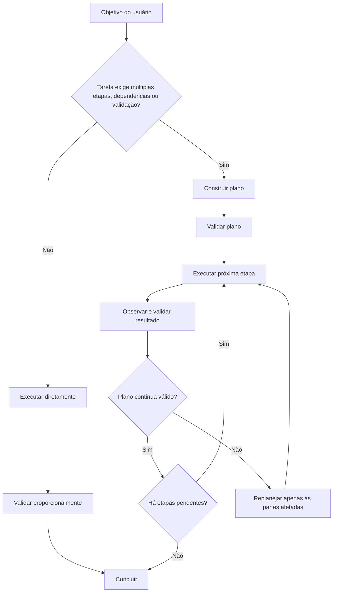
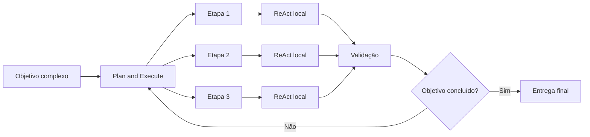
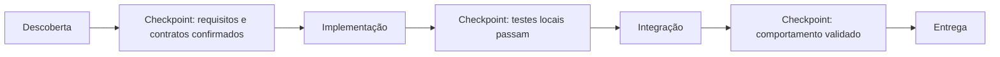

# Plan and Execute

## Objetivo

Use Plan and Execute para transformar um objetivo complexo em um conjunto de etapas explícitas, ordenadas, verificáveis e proporcionais ao risco da tarefa.

A técnica possui dois níveis:

1. **Planejamento global**: define o caminho para atingir o objetivo.
2. **Execução local**: realiza cada etapa, usando ReAct quando houver incerteza, ferramentas, validação ou necessidade de observação.

Plan and Execute não exige expor cadeia de pensamento detalhada ao usuário.

O plano deve ser um artefato operacional: compacto, verificável, adaptável e orientado a resultados.

## Princípio central

> Planeje antes de executar quando a ordem, as dependências, os riscos ou as validações puderem afetar o resultado.

Um plano não é uma lista decorativa de tarefas.

Cada etapa deve responder:

```text
- Qual resultado essa etapa produz?
- Por que ela é necessária?
- De que informações ou etapas ela depende?
- Como seu resultado será validado?
- Qual risco existe se ela falhar?
```



## Quando usar

Use Plan and Execute quando a tarefa tiver uma ou mais das características abaixo:

- possui múltiplas etapas dependentes;
- exige investigação antes de implementação;
- envolve arquivos, código, testes, ferramentas, APIs ou serviços externos;
- possui risco de regressão, perda de dados, efeito colateral ou alteração irreversível;
- exige coordenação entre frontend, backend, banco, infraestrutura ou documentação;
- envolve decisão arquitetural, migração, integração ou refatoração relevante;
- exige pesquisas, comparação de alternativas ou validação de fatos;
- possui requisitos que precisam ser atendidos em sequência;
- contém subtarefas que podem ser paralelizadas com segurança;
- exige entregáveis intermediários antes do resultado final.

Exemplos adequados:

```text
- Implementar uma funcionalidade que envolve frontend, API e banco de dados.
- Corrigir uma falha cujo ponto de origem ainda é desconhecido.
- Migrar uma integração para uma nova API.
- Criar um plano de execução para uma feature grande.
- Revisar um projeto e propor melhorias priorizadas.
- Pesquisar, comparar e recomendar uma tecnologia.
- Criar um documento técnico baseado em múltiplas fontes ou arquivos.
```

## Quando evitar

Não use Plan and Execute como ritual automático.

Evite ou simplifique a técnica quando:

- a tarefa possui uma única ação clara;
- a resposta pode ser dada diretamente com contexto suficiente;
- o usuário pediu tradução, reescrita, resumo ou ajuste pontual de texto;
- não existem dependências relevantes;
- não há necessidade de ferramenta, validação ou observação;
- criar um plano custaria mais do que executar a tarefa;
- a tarefa é criativa e não exige precisão factual ou etapas dependentes.

Exemplos em que um plano completo seria exagerado:

```text
- "Explique o que é Docker."
- "Melhore este parágrafo."
- "Traduza esta frase para inglês."
- "Renomeie esta variável."
- "Crie um título para este documento."
```

## Relação com ReAct

Plan and Execute e ReAct resolvem problemas diferentes.

| Técnica             | Responsabilidade                                                                    |
| ------------------- | ----------------------------------------------------------------------------------- |
| Plan and Execute    | Define estratégia, etapas, dependências, checkpoints e critério de conclusão        |
| ReAct               | Decide a próxima ação dentro de uma etapa, executa, observa e atualiza o estado     |
| Verification        | Confirma se fatos, alterações e conclusões são sustentados por evidências           |
| Critique and Refine | Revisa um resultado quando houver critério objetivo, feedback ou evidência de falha |



### Regra de integração

Use Plan and Execute para decidir **o que precisa acontecer**.

Use ReAct para decidir **qual é a próxima ação concreta dentro da etapa atual**.

Não crie um novo plano completo após cada ação pequena. Replaneje apenas quando evidências relevantes afetarem o caminho atual.

### Plan and Execute vs Structured Decomposition

Plan and Execute ordena e valida etapas cujas partes e contratos você já consegue enunciar. Use [Structured Decomposition](structured-decomposition.md) antes, quando as partes do problema, suas fronteiras ou seus contratos ainda são desconhecidos e precisam ser descobertos para que um plano sequer faça sentido.

Teste operacional de fronteira:

```text
- Consigo nomear as etapas, suas dependências e como validar cada uma? -> Plan and Execute.
- Ainda não sei em quais partes o problema se divide nem onde ficam as fronteiras/contratos? -> Structured Decomposition primeiro, depois Plan and Execute.
```

## Modelo de plano

Antes de criar um plano, organize o estado da tarefa e descreva cada etapa com os campos abaixo. Use este modelo único para registrar ou comunicar o plano.

```text
Objetivo:
- Resultado final esperado pelo usuário.

Escopo:
- Inclui: o que está dentro da tarefa.
- Não inclui: o que está fora da tarefa.

Entregáveis:
- Arquivos, código, análise, decisão, relatório ou ação que precisam existir ao final.

Fatos confirmados:
- Informações observadas diretamente, fornecidas pelo usuário ou verificadas por fontes confiáveis.

Hipóteses:
- Possibilidades ainda não comprovadas.

Riscos e restrições:
- Regressões, efeitos colaterais, dependências externas, dados sensíveis ou ações irreversíveis.
- Regras do projeto, stack, prazo, permissões, segurança, orçamento, compatibilidade e preferências.

Plano (cada etapa):
1. [etapa]
   - ID: identificador simples e estável.
   - Resultado esperado: o que deve existir ou estar confirmado após a etapa.
   - Ação: o trabalho necessário para gerar o resultado.
   - Dependências: etapas, arquivos, decisões ou dados necessários antes da execução.
   - Validação: como confirmar que a etapa foi concluída corretamente.
   - Risco: impacto caso a etapa falhe.
   - Status: pendente, em andamento, concluída, bloqueada ou descartada.

Checkpoint:
- Condição que deve ser confirmada antes de seguir.

Critério de conclusão:
- Condições objetivas para considerar a tarefa concluída.
```

Exemplo de plano compacto:

```text
Objetivo:
Adicionar filtro por status à listagem de pedidos.

Plano:
1. Inspecionar o contrato atual do endpoint e o padrão de filtros existente.
   - Resultado: parâmetros aceitos e convenções do projeto confirmados.
   - Validação: contrato e código atual revisados.

2. Ajustar a camada de serviço para enviar o filtro.
   - Dependência: etapa 1.
   - Validação: teste ou inspeção do request gerado.

3. Adicionar o controle de filtro na interface.
   - Dependência: etapa 1.
   - Validação: interação atualiza a consulta corretamente.

4. Atualizar testes relevantes.
   - Dependência: etapas 2 e 3.
   - Validação: testes passam.

5. Executar lint, typecheck e build aplicáveis.
   - Dependência: etapas anteriores.
   - Validação: comandos concluídos sem erros introduzidos.
```

## Critérios de qualidade do plano

Antes de executar, avalie se o plano atende aos critérios abaixo.

```text
[ ] Cobre todos os entregáveis necessários.
[ ] Não possui etapas redundantes.
[ ] A ordem respeita dependências reais.
[ ] Cada etapa produz um resultado observável.
[ ] Cada etapa possui forma de validação.
[ ] Riscos relevantes foram identificados.
[ ] Ações irreversíveis foram isoladas e protegidas.
[ ] O plano não depende de suposições críticas não verificadas.
[ ] O nível de detalhe é proporcional à complexidade.
[ ] O plano pode ser ajustado sem reiniciar todo o trabalho.
```

## Como planejar

### 1. Definir o resultado final

Comece pelo que precisa estar verdadeiro ao final da tarefa.

Evite objetivos vagos:

```text
Ruim:
"Melhorar o sistema."

Melhor:
"Reduzir falhas de autenticação causadas por expiração de token, preservar sessões válidas e adicionar testes de regressão."
```

O objetivo deve ser concreto o suficiente para permitir validação.

### 2. Identificar entregáveis

Liste os resultados reais esperados.

Exemplos:

```text
- Código implementado.
- Endpoint atualizado.
- Testes adicionados.
- Documento revisado.
- Decisão recomendada com critérios explícitos.
- Migração criada e validada.
- Relatório baseado em evidências.
- Configuração alterada com rollback definido.
```

Não confunda atividade com entregável.

```text
Atividade:
"Ler documentação."

Entregável:
"Confirmar o contrato de autenticação e registrar as limitações relevantes."
```

### 3. Mapear dependências

Identifique o que precisa acontecer antes de cada etapa.

Uma etapa depende de outra quando:

- precisa do resultado técnico dela;
- exige uma decisão anterior;
- modifica o mesmo recurso;
- consome um contrato produzido por outra etapa;
- pode invalidar o trabalho realizado antes;
- exige autorização ou informação ainda ausente.

Não invente dependências apenas para tornar o plano mais longo.

### 4. Separar descoberta de execução

Quando existir incerteza material, crie primeiro uma etapa de descoberta. Se as próprias fronteiras do problema ainda forem desconhecidas, use [Structured Decomposition](structured-decomposition.md) antes de tentar ordenar etapas.

```text
Descoberta:
- Confirmar onde o problema ocorre.
- Ler contrato da API.
- Verificar convenções do projeto.
- Reproduzir erro.
- Identificar requisito ausente.

Execução:
- Alterar código.
- Criar migração.
- Ajustar configuração.
- Atualizar testes.
- Atualizar documentação.
```

Não implemente antes de entender aspectos que podem invalidar a implementação.

### 5. Definir validação antes da execução

Toda etapa importante deve possuir um método de validação definido antecipadamente.

| Tipo de tarefa        | Validação adequada                                                      |
| --------------------- | ----------------------------------------------------------------------- |
| Alteração de frontend | Teste, lint, typecheck, build e fluxo visual ou funcional aplicável     |
| Alteração de backend  | Teste de unidade, integração, contrato, logs e tratamento de erro       |
| Migração de banco     | Schema, dados de teste, rollback e impacto em consultas                 |
| Pesquisa técnica      | Documentação primária, data da fonte, comparação e limites              |
| Análise de arquivo    | Leitura direta, citações, consistência interna e conferência de números |
| Decisão arquitetural  | Critérios explícitos, trade-offs, custos, riscos e compatibilidade      |
| Automação             | Execução controlada, logs, idempotência e resultado verificável         |

## Execução do plano

### Regra principal

Execute uma etapa por vez quando o resultado dela puder alterar a próxima decisão.

Use paralelismo apenas para etapas realmente independentes: que não dependem do mesmo recurso ou resultado, não geram conflitos, race conditions ou efeitos colaterais, e cujo paralelismo traz ganho real.

### Para cada etapa

Siga este ciclo:

```text
1. Confirmar o objetivo da etapa.
2. Verificar dependências e restrições.
3. Executar a menor ação útil.
4. Usar ReAct se houver incerteza, ferramenta ou observação necessária.
5. Validar o resultado.
6. Atualizar status, fatos e riscos.
7. Decidir se a próxima etapa continua válida.
```

Formato operacional recomendado:

```text
Etapa:
- Implementar validação de payload no endpoint de criação.

Dependências:
- Contrato da rota confirmado.

Ação:
- Ajustar schema e tratamento de erro.

Validação:
- Executar testes de rota para payload válido, inválido e incompleto.

Resultado:
- Testes passam; respostas 422 seguem o contrato definido.

Status:
- Concluída.
```

### Quando uma etapa fica bloqueada

Uma etapa entra em status **bloqueada** quando falta dependência, permissão, contexto ou ferramenta indispensável. Diferencie bloqueio temporário de inviabilidade real e escolha uma das saídas:

```text
- Aguardar: se a dependência será resolvida em breve por etapa em andamento, mantenha a etapa bloqueada e siga por etapas independentes.
- Escalar: se falta permissão, decisão ou informação que só o usuário fornece, pare nessa etapa e solicite explicitamente o que falta.
- Contornar: se existe caminho alternativo válido que não viola escopo, segurança ou regras do projeto, replaneje a etapa afetada.
```

Não deixe uma etapa silenciosamente bloqueada: registre o motivo, o que destravaria e qual saída foi escolhida.

## Uso de ReAct dentro de uma etapa

Não use um plano detalhado como substituto de observação.

Dentro de uma etapa, use ReAct quando for necessário:

```text
1. Avaliar o estado atual.
2. Escolher a menor ação que reduza incerteza.
3. Executar a ação.
4. Observar o resultado real.
5. Atualizar fatos, hipóteses e pendências.
6. Repetir até concluir ou bloquear a etapa.
```

Exemplo:

```text
Etapa:
Corrigir falha no envio do formulário.

Plano global:
- Identificar causa.
- Corrigir frontend ou backend.
- Criar teste.
- Validar fluxo completo.

ReAct local:
- Reproduzir falha.
- Observar HTTP 422.
- Inspecionar payload enviado.
- Comparar com schema da API.
- Corrigir campo incompatível.
- Reexecutar teste.
```

## Checkpoints

Checkpoints são pontos de validação entre grupos de etapas.

Use checkpoints quando:

- uma decisão afeta muitas etapas futuras;
- uma alteração é difícil de reverter;
- há integração entre sistemas;
- existe risco de regressão;
- uma etapa depende de fonte ou ferramenta externa;
- o custo de continuar com premissa errada é alto.



Exemplos de checkpoints:

```text
- Requisitos confirmados antes de alterar arquitetura.
- Contrato de API validado antes de implementar frontend.
- Testes locais aprovados antes de editar múltiplos módulos.
- Migração validada em ambiente seguro antes de produção.
- Dados e fontes revisados antes de entregar recomendação crítica.
```

## Replanejamento

Replaneje quando houver evidência de que o plano atual deixou de ser adequado.

Não replaneje apenas porque surgiu uma alternativa marginalmente diferente.

### Gatilhos válidos

Replaneje quando:

- uma hipótese crítica foi refutada;
- uma dependência não existe ou não está disponível;
- a ferramenta retornou resultado inesperado;
- um teste revelou regressão ou comportamento incompatível;
- o usuário alterou escopo, prioridade ou restrições;
- uma ação revelou risco não previsto;
- o plano exige permissão que não está disponível;
- uma etapa anterior tornou etapas futuras desnecessárias;
- a solução planejada viola regra do projeto, segurança ou compatibilidade;
- surgiu uma alternativa materialmente mais segura, simples ou correta.

### Regras de replanejamento

```text
- Preserve etapas concluídas e validadas.
- Não repita trabalho sem motivo concreto.
- Atualize apenas partes afetadas do plano.
- Registre qual premissa falhou.
- Diferencie bloqueio temporário de inviabilidade real.
- Comunique mudanças materiais de escopo, risco ou prazo.
- Não entre em ciclo infinito de planejamento e replanejamento.
```

## Ações de alto impacto

Etapas que podem causar efeito irreversível ou relevante (deletar arquivos, alterar banco, migrações, infraestrutura, permissões, publicação, envio de mensagens, configurações de produção, dados sensíveis ou custos financeiros) exigem cuidado especial. Consulte a lista canônica e a doutrina completa na skill [pelizzai-reasoning](../SKILL.md).

Antes de executar uma ação de alto impacto:

```text
[ ] O objetivo do usuário está claro.
[ ] O alvo foi confirmado.
[ ] A ação é necessária.
[ ] Há alternativa reversível ou ambiente seguro.
[ ] Existe backup, rollback ou plano de recuperação quando aplicável.
[ ] O impacto foi avaliado.
[ ] A validação posterior está definida.
```

## Regras de parada

Encerre a execução quando uma das condições abaixo for verdadeira:

```text
- Todos os critérios de conclusão foram atendidos.
- Os entregáveis solicitados foram produzidos e validados.
- Não há pendência material conhecida.
- A próxima ação não reduz incerteza nem melhora o resultado.
- Falta permissão, contexto ou ferramenta indispensável.
- A próxima ação exigiria autorização explícita do usuário.
- O custo ou risco de continuar deixou de ser proporcional ao benefício.
```

Não continue criando subtarefas, buscas ou validações apenas para aparentar profundidade.

## Anti-padrões

### 1. Plano genérico demais

```text
Ruim:
1. Analisar.
2. Implementar.
3. Testar.

Melhor:
1. Confirmar contrato e convenções existentes.
2. Implementar alteração no serviço responsável.
3. Atualizar a interface consumidora.
4. Criar testes de regressão.
5. Executar validações configuradas no projeto.
```

### 2. Plano detalhado demais

Criar dezenas de microetapas para uma alteração simples. Melhor: agrupar ações que compartilham o mesmo objetivo e a mesma validação.

### 3. Implementar antes de validar premissas

Alterar o frontend presumindo que a API aceita determinado campo. Melhor: inspecionar o contrato ou a resposta real antes da alteração.

### 4. Executar plano cegamente

Continuar implementando após um teste provar que a hipótese inicial estava errada. Melhor: atualizar o estado, identificar a premissa inválida e replanejar somente o necessário.

### 5. Paralelismo inseguro

Editar simultaneamente arquivos ou recursos compartilhados sem controle. Melhor: paralelizar apenas tarefas independentes, como leitura de documentação, inspeção de módulos distintos ou testes isolados.

### 6. Confundir planejamento com procrastinação

Continuar expandindo o plano sem iniciar nenhuma ação útil. Melhor: criar o menor plano suficiente e iniciar a etapa de maior valor informacional.

### 7. Não definir critério de conclusão

```text
Ruim:
"Implementar autenticação."

Melhor:
"Permitir login, proteger rotas, renovar sessão conforme a regra definida, retornar erros previsíveis e cobrir fluxos principais por testes."
```

## Exemplos

### Exemplo 1 — Nova funcionalidade

```text
Tarefa:
Adicionar exportação CSV à listagem de usuários.

Objetivo:
Permitir que usuários autorizados exportem os dados visíveis conforme os filtros ativos.

Plano:
1. Confirmar regras de autorização e campos permitidos.
2. Verificar se a API já suporta exportação ou se será necessário novo endpoint.
3. Implementar geração ou download do CSV.
4. Integrar o botão na interface e propagar filtros ativos.
5. Criar ou atualizar testes.
6. Executar lint, typecheck, testes e build.
7. Validar fluxo manual com filtros e usuário sem permissão.

Checkpoints:
- Contrato do endpoint confirmado antes da interface.
- Autorização validada antes da entrega.

Critério de conclusão:
- Exportação respeita filtros.
- Campos sensíveis não aparecem.
- Usuário sem permissão não consegue exportar.
- Testes e build aplicáveis passam.
```

### Exemplo 2 — Correção de bug de origem desconhecida

Quando o ponto de origem da falha ainda é desconhecido, a etapa de descoberta usa [Root Cause Analysis](root-cause-analysis.md) para localizar a causa antes de corrigir.

```text
Tarefa:
Pedidos duplicados são criados ao clicar duas vezes em "Salvar".

Objetivo:
Garantir que uma solicitação de criação gere no máximo um pedido válido.

Plano:
1. Reproduzir o problema e confirmar se a duplicidade ocorre no frontend, backend ou ambos.
2. Inspecionar requisições, logs e comportamento de persistência.
3. Definir proteção adequada: bloqueio de interface, idempotência no backend ou ambas.
4. Implementar correção.
5. Criar teste de regressão.
6. Validar clique duplo, retry de rede e envio concorrente.

Risco:
- Resolver apenas no frontend pode não proteger chamadas diretas ou retries.
```

## Instrução resumida para o agente

```text
- Replaneje apenas quando evidências invalidarem ou alterarem materialmente o plano; preserve trabalho já validado.
- Diferencie etapa bloqueada (aguardar/escalar/contornar) de inviabilidade real e registre o motivo.
- Conclua somente quando o critério de conclusão for atendido; aplique as Regras de parada.
- Use Structured Decomposition antes quando as partes/contratos do problema ainda forem desconhecidos.
- Não exponha cadeia de pensamento detalhada; comunique apenas plano, decisões, evidências, resultados e limitações relevantes.
```

## Técnicas relacionadas

- [ReAct](react.md)
- [Verification](verification.md)
- [Critique and Refine](critique-and-refine.md)
- [Structured Decomposition](structured-decomposition.md)
- [Root Cause Analysis](root-cause-analysis.md)

Voltar ao [catálogo de técnicas](../SKILL.md).
