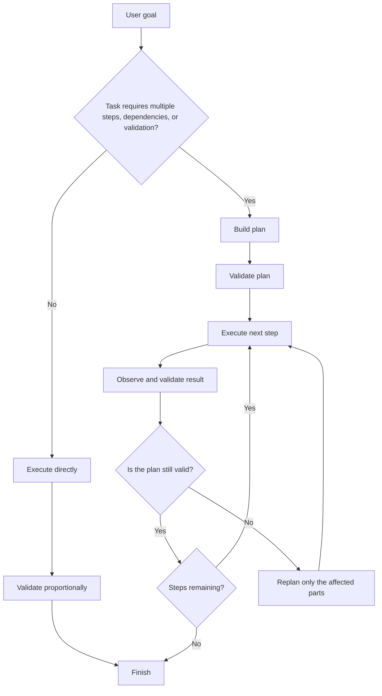
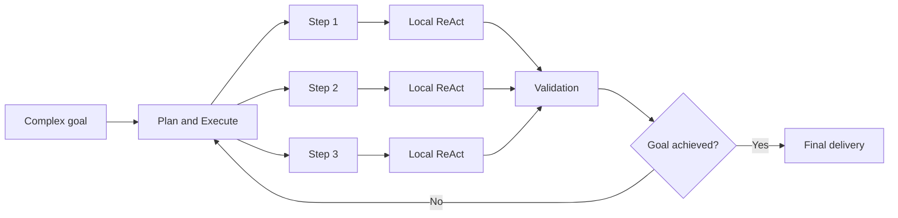
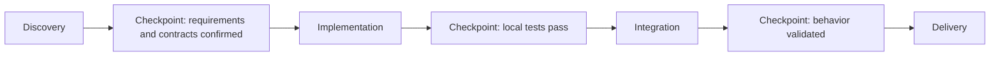

# Plan and Execute

## Purpose

Use Plan and Execute to turn a complex goal into a set of explicit, ordered, verifiable steps proportional to the task's risk.

The technique has two levels:

1. **Global planning**: defines the path to the goal.
2. **Local execution**: performs each step, using ReAct when there is uncertainty, tooling, validation, or a need for observation.

Plan and Execute does not require exposing detailed chain of thought to the user.

The plan must be an operational artifact: compact, verifiable, adaptable, and results-oriented.

## Core principle

> Plan before executing when ordering, dependencies, risks, or validations can affect the outcome.

A plan is not a decorative task list.

Every step must answer:

```text
- What result does this step produce?
- Why is it necessary?
- What information or steps does it depend on?
- How will its result be validated?
- What is the risk if it fails?
```


```mermaid
flowchart TD
    A[User goal] --> B{Task requires multiple steps, dependencies, or validation?}

    B -- No --> C[Execute directly]
    C --> D[Validate proportionally]
    D --> E[Finish]

    B -- Yes --> F[Build plan]
    F --> G[Validate plan]
    G --> H[Execute next step]
    H --> I[Observe and validate result]
    I --> J{Is the plan still valid?}

    J -- Yes --> K{Steps remaining?}
    K -- Yes --> H
    K -- No --> E

    J -- No --> L[Replan only the affected parts]
    L --> H
```

## When to use

Use Plan and Execute when the task has one or more of the traits below:

- has multiple dependent steps;
- requires investigation before implementation;
- involves files, code, tests, tools, APIs, or external services;
- carries risk of regression, data loss, side effects, or irreversible change;
- requires coordination across frontend, backend, database, infrastructure, or documentation;
- involves an architectural decision, migration, integration, or significant refactor;
- requires research, comparison of alternatives, or fact validation;
- has requirements that must be satisfied in sequence;
- contains subtasks that can be safely parallelized;
- requires intermediate deliverables before the final result.

Good examples:

```text
- Implement a feature spanning frontend, API, and database.
- Fix a failure whose point of origin is still unknown.
- Migrate an integration to a new API.
- Create an execution plan for a large feature.
- Review a project and propose prioritized improvements.
- Research, compare, and recommend a technology.
- Write a technical document based on multiple sources or files.
```

## When to avoid

Do not use Plan and Execute as an automatic ritual.

Avoid or simplify the technique when:

- the task has a single clear action;
- the answer can be given directly with enough context;
- the user asked for a translation, rewrite, summary, or small text tweak;
- there are no relevant dependencies;
- no tool, validation, or observation is needed;
- building a plan would cost more than doing the task;
- the task is creative and requires neither factual precision nor dependent steps.

Examples where a full plan would be overkill:

```text
- "Explain what Docker is."
- "Improve this paragraph."
- "Translate this sentence into English."
- "Rename this variable."
- "Write a title for this document."
```

## Relationship with ReAct

Plan and Execute and ReAct solve different problems.

| Technique           | Responsibility                                                                          |
| ------------------- | --------------------------------------------------------------------------------------- |
| Plan and Execute    | Defines strategy, steps, dependencies, checkpoints, and the completion criterion         |
| ReAct               | Decides the next action within a step, executes, observes, and updates state            |
| Verification        | Confirms that facts, changes, and conclusions are backed by evidence                    |
| Critique and Refine | Revises a result when there is an objective criterion, feedback, or evidence of failure |


```mermaid
flowchart LR
    A[Complex goal] --> B[Plan and Execute]
    B --> C[Step 1]
    B --> D[Step 2]
    B --> E[Step 3]

    C --> F[Local ReAct]
    D --> G[Local ReAct]
    E --> H[Local ReAct]

    F --> I[Validation]
    G --> I
    H --> I

    I --> J{Goal achieved?}
    J -- No --> B
    J -- Yes --> K[Final delivery]
```

### Integration rule

Use Plan and Execute to decide **what needs to happen**.

Use ReAct to decide **the next concrete action within the current step**.

Do not build a whole new plan after every small action. Replan only when relevant evidence affects the current path.

### Plan and Execute vs Structured Decomposition

Plan and Execute orders and validates steps whose parts and contracts you can already state. Use [Structured Decomposition](structured-decomposition.md) first, when the parts of the problem, their boundaries, or their contracts are still unknown and must be discovered before a plan even makes sense.

Operational boundary test:

```text
- Can I name the steps, their dependencies, and how to validate each one? -> Plan and Execute.
- Do I still not know what parts the problem splits into or where the boundaries/contracts lie? -> Structured Decomposition first, then Plan and Execute.
```

## Plan template

Before creating a plan, organize the task state and describe each step with the fields below. Use this single template to record or communicate the plan.

```text
Goal:
- Final result the user expects.

Scope:
- Includes: what is inside the task.
- Excludes: what is outside the task.

Deliverables:
- Files, code, analysis, decision, report, or action that must exist at the end.

Confirmed facts:
- Information directly observed, provided by the user, or verified via reliable sources.

Hypotheses:
- Possibilities not yet proven.

Risks and constraints:
- Regressions, side effects, external dependencies, sensitive data, or irreversible actions.
- Project rules, stack, deadline, permissions, security, budget, compatibility, and preferences.

Plan (each step):
1. [step]
   - ID: simple, stable identifier.
   - Expected result: what must exist or be confirmed after the step.
   - Action: the work needed to produce the result.
   - Dependencies: steps, files, decisions, or data required before execution.
   - Validation: how to confirm the step completed correctly.
   - Risk: impact if the step fails.
   - Status: pending, in progress, done, blocked, or dropped.

Checkpoint:
- Condition that must be confirmed before moving on.

Completion criterion:
- Objective conditions for considering the task done.
```

Compact plan example:

```text
Goal:
Add a status filter to the order listing.

Plan:
1. Inspect the endpoint's current contract and the existing filter pattern.
   - Result: accepted parameters and project conventions confirmed.
   - Validation: contract and current code reviewed.

2. Adjust the service layer to send the filter.
   - Dependency: step 1.
   - Validation: test or inspection of the generated request.

3. Add the filter control to the interface.
   - Dependency: step 1.
   - Validation: interaction updates the query correctly.

4. Update relevant tests.
   - Dependency: steps 2 and 3.
   - Validation: tests pass.

5. Run the applicable lint, typecheck, and build.
   - Dependency: previous steps.
   - Validation: commands finish with no introduced errors.
```

## Plan quality criteria

Before executing, check the plan against the criteria below.

```text
[ ] Covers every required deliverable.
[ ] Has no redundant steps.
[ ] The order respects real dependencies.
[ ] Each step produces an observable result.
[ ] Each step has a way to be validated.
[ ] Relevant risks have been identified.
[ ] Irreversible actions have been isolated and protected.
[ ] The plan does not rest on unverified critical assumptions.
[ ] The level of detail is proportional to the complexity.
[ ] The plan can be adjusted without restarting all the work.
```

## How to plan

### 1. Define the final result

Start from what must be true at the end of the task.

Avoid vague goals:

```text
Bad:
"Improve the system."

Better:
"Reduce authentication failures caused by token expiration, preserve valid sessions, and add regression tests."
```

The goal must be concrete enough to allow validation.

### 2. Identify deliverables

List the actual expected results.

Examples:

```text
- Code implemented.
- Endpoint updated.
- Tests added.
- Document revised.
- Decision recommended with explicit criteria.
- Migration created and validated.
- Evidence-based report.
- Configuration changed with a defined rollback.
```

Do not confuse activity with deliverable.

```text
Activity:
"Read documentation."

Deliverable:
"Confirm the authentication contract and record the relevant limitations."
```

### 3. Map dependencies

Identify what must happen before each step.

A step depends on another when it:

- needs its technical result;
- requires a prior decision;
- modifies the same resource;
- consumes a contract produced by another step;
- can invalidate work done earlier;
- requires authorization or information still missing.

Do not invent dependencies just to make the plan longer.

### 4. Separate discovery from execution

When there is material uncertainty, create a discovery step first. If the very boundaries of the problem are still unknown, use [Structured Decomposition](structured-decomposition.md) before trying to order steps.

```text
Discovery:
- Confirm where the problem occurs.
- Read the API contract.
- Check project conventions.
- Reproduce the error.
- Identify a missing requirement.

Execution:
- Change code.
- Create a migration.
- Adjust configuration.
- Update tests.
- Update documentation.
```

Do not implement before understanding whatever could invalidate the implementation.

### 5. Define validation before executing

Every important step must have its validation method defined up front.

| Task type              | Appropriate validation                                                     |
| ---------------------- | -------------------------------------------------------------------------- |
| Frontend change        | Test, lint, typecheck, build, and the applicable visual or functional flow |
| Backend change         | Unit, integration, and contract tests, logs, and error handling            |
| Database migration     | Schema, test data, rollback, and impact on queries                         |
| Technical research     | Primary documentation, source date, comparison, and limits                 |
| File analysis          | Direct reading, quotes, internal consistency, and number checking          |
| Architectural decision | Explicit criteria, trade-offs, costs, risks, and compatibility             |
| Automation             | Controlled run, logs, idempotency, and a verifiable result                 |

## Executing the plan

### Main rule

Execute one step at a time when its result can change the next decision.

Use parallelism only for truly independent steps: ones that do not depend on the same resource or result, do not create conflicts, race conditions, or side effects, and where parallelism brings real gain.

### For each step

Follow this cycle:

```text
1. Confirm the step's goal.
2. Check dependencies and constraints.
3. Execute the smallest useful action.
4. Use ReAct if uncertainty, a tool, or observation is required.
5. Validate the result.
6. Update status, facts, and risks.
7. Decide whether the next step is still valid.
```

Recommended operational format:

```text
Step:
- Implement payload validation on the creation endpoint.

Dependencies:
- Route contract confirmed.

Action:
- Adjust schema and error handling.

Validation:
- Run route tests for valid, invalid, and incomplete payloads.

Result:
- Tests pass; 422 responses follow the defined contract.

Status:
- Done.
```

### When a step becomes blocked

A step enters **blocked** status when it lacks an indispensable dependency, permission, context, or tool. Distinguish a temporary block from true infeasibility and choose one of the exits:

```text
- Wait: if the dependency will soon be resolved by a step in progress, keep the step blocked and continue through independent steps.
- Escalate: if a permission, decision, or piece of information only the user can provide is missing, stop at that step and explicitly request what is missing.
- Work around: if a valid alternative path exists that violates neither scope, security, nor project rules, replan the affected step.
```

Do not leave a step silently blocked: record the reason, what would unblock it, and which exit was chosen.

## Using ReAct within a step

Do not use a detailed plan as a substitute for observation.

Within a step, use ReAct when needed to:

```text
1. Assess the current state.
2. Choose the smallest action that reduces uncertainty.
3. Execute the action.
4. Observe the actual result.
5. Update facts, hypotheses, and open items.
6. Repeat until the step is done or blocked.
```

Example:

```text
Step:
Fix the form submission failure.

Global plan:
- Identify the cause.
- Fix frontend or backend.
- Write a test.
- Validate the full flow.

Local ReAct:
- Reproduce the failure.
- Observe HTTP 422.
- Inspect the submitted payload.
- Compare against the API schema.
- Fix the mismatched field.
- Re-run the test.
```

## Checkpoints

Checkpoints are validation points between groups of steps.

Use checkpoints when:

- a decision affects many future steps;
- a change is hard to revert;
- systems are being integrated;
- there is regression risk;
- a step depends on an external source or tool;
- the cost of proceeding on a wrong premise is high.


```mermaid
flowchart LR
    A[Discovery] --> B[Checkpoint: requirements and contracts confirmed]
    B --> C[Implementation]
    C --> D[Checkpoint: local tests pass]
    D --> E[Integration]
    E --> F[Checkpoint: behavior validated]
    F --> G[Delivery]
```

Checkpoint examples:

```text
- Requirements confirmed before changing architecture.
- API contract validated before implementing the frontend.
- Local tests passing before editing multiple modules.
- Migration validated in a safe environment before production.
- Data and sources reviewed before delivering a critical recommendation.
```

## Replanning

Replan when there is evidence that the current plan is no longer adequate.

Do not replan just because a marginally different alternative appeared.

### Valid triggers

Replan when:

- a critical hypothesis was refuted;
- a dependency does not exist or is unavailable;
- a tool returned an unexpected result;
- a test revealed a regression or incompatible behavior;
- the user changed scope, priority, or constraints;
- an action revealed an unforeseen risk;
- the plan requires a permission that is not available;
- an earlier step made future steps unnecessary;
- the planned solution violates a project rule, security, or compatibility;
- a materially safer, simpler, or more correct alternative emerged.

### Replanning rules

```text
- Preserve completed, validated steps.
- Do not repeat work without a concrete reason.
- Update only the affected parts of the plan.
- Record which premise failed.
- Distinguish a temporary block from true infeasibility.
- Communicate material changes in scope, risk, or timeline.
- Do not enter an endless plan-replan loop.
```

## High-impact actions

Steps that can cause irreversible or significant effects (deleting files, changing the database, migrations, infrastructure, permissions, publishing, sending messages, production configuration, sensitive data, or financial costs) require special care. See the canonical list and the full doctrine in the [pelizzai-reasoning](../SKILL.md) skill.

Before executing a high-impact action:

```text
[ ] The user's goal is clear.
[ ] The target has been confirmed.
[ ] The action is necessary.
[ ] There is a reversible alternative or a safe environment.
[ ] A backup, rollback, or recovery plan exists where applicable.
[ ] The impact has been assessed.
[ ] Post-action validation is defined.
```

## Stopping rules

Stop executing when one of the conditions below is true:

```text
- All completion criteria have been met.
- The requested deliverables have been produced and validated.
- No known material items remain open.
- The next action neither reduces uncertainty nor improves the result.
- An indispensable permission, context, or tool is missing.
- The next action would require the user's explicit authorization.
- The cost or risk of continuing is no longer proportional to the benefit.
```

Do not keep creating subtasks, searches, or validations just to look thorough.

## Anti-patterns

### 1. Overly generic plan

```text
Bad:
1. Analyze.
2. Implement.
3. Test.

Better:
1. Confirm the existing contract and conventions.
2. Implement the change in the responsible service.
3. Update the consuming interface.
4. Write regression tests.
5. Run the validations configured in the project.
```

### 2. Overly detailed plan

Creating dozens of micro-steps for a simple change. Better: group actions that share the same goal and the same validation.

### 3. Implementing before validating premises

Changing the frontend assuming the API accepts a given field. Better: inspect the contract or the actual response before the change.

### 4. Executing the plan blindly

Continuing to implement after a test proved the initial hypothesis wrong. Better: update the state, identify the invalid premise, and replan only what is needed.

### 5. Unsafe parallelism

Editing shared files or resources concurrently without control. Better: parallelize only independent tasks, such as reading documentation, inspecting distinct modules, or running isolated tests.

### 6. Mistaking planning for procrastination

Endlessly expanding the plan without starting any useful action. Better: build the smallest sufficient plan and start with the step of highest informational value.

### 7. No completion criterion

```text
Bad:
"Implement authentication."

Better:
"Allow login, protect routes, renew sessions per the defined rule, return predictable errors, and cover the main flows with tests."
```

## Examples

### Example 1 — New feature

```text
Task:
Add CSV export to the user listing.

Goal:
Allow authorized users to export the visible data according to the active filters.

Plan:
1. Confirm authorization rules and allowed fields.
2. Check whether the API already supports export or a new endpoint is needed.
3. Implement CSV generation or download.
4. Wire the button into the interface and propagate active filters.
5. Create or update tests.
6. Run lint, typecheck, tests, and build.
7. Validate the manual flow with filters and with an unauthorized user.

Checkpoints:
- Endpoint contract confirmed before the interface.
- Authorization validated before delivery.

Completion criterion:
- Export respects filters.
- Sensitive fields do not appear.
- An unauthorized user cannot export.
- Applicable tests and build pass.
```

### Example 2 — Fixing a bug of unknown origin

When the failure's point of origin is still unknown, the discovery step uses [Root Cause Analysis](root-cause-analysis.md) to locate the cause before fixing.

```text
Task:
Duplicate orders are created when "Save" is clicked twice.

Goal:
Ensure a creation request produces at most one valid order.

Plan:
1. Reproduce the problem and confirm whether the duplication happens in the frontend, the backend, or both.
2. Inspect requests, logs, and persistence behavior.
3. Choose the appropriate protection: interface locking, backend idempotency, or both.
4. Implement the fix.
5. Write a regression test.
6. Validate double click, network retry, and concurrent submission.

Risk:
- Fixing only the frontend may not protect direct calls or retries.
```

## Summary instruction for the agent

```text
- Replan only when evidence invalidates or materially changes the plan; preserve already-validated work.
- Distinguish a blocked step (wait/escalate/work around) from true infeasibility and record the reason.
- Finish only when the completion criterion is met; apply the Stopping rules.
- Use Structured Decomposition first when the problem's parts/contracts are still unknown.
- Do not expose detailed chain of thought; communicate only the plan, decisions, evidence, results, and relevant limitations.
```

## Related techniques

- [ReAct](react.md)
- [Verification](verification.md)
- [Critique and Refine](critique-and-refine.md)
- [Structured Decomposition](structured-decomposition.md)
- [Root Cause Analysis](root-cause-analysis.md)

Back to the [technique catalog](../SKILL.md).
