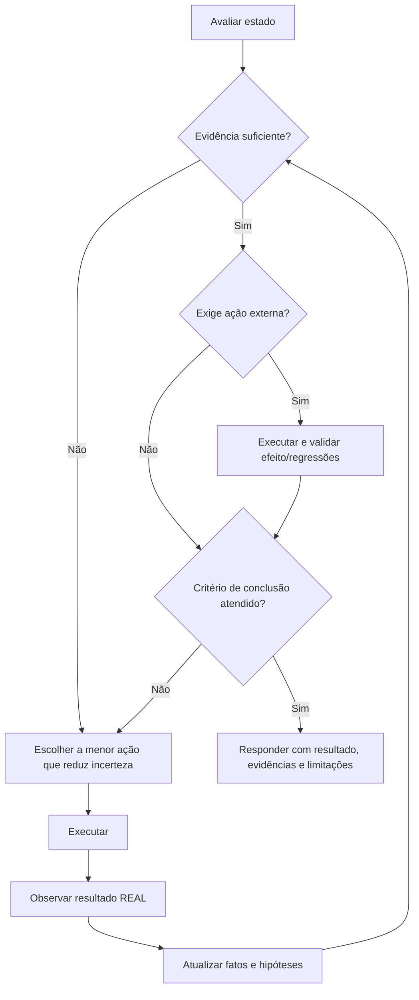

# ReAct

## Objetivo

ReAct (Reasoning and Acting) conduz tarefas que exigem alternar entre pensar e agir com evidência:
avaliar o estado, decidir a menor ação útil, executá-la, **observar o resultado real**, atualizar o
entendimento e repetir enquanto houver incerteza relevante ou trabalho pendente.

Não é convite para raciocínio longo nem para expor cadeia de pensamento. É um mecanismo de controle
contra dois erros: agir sem evidência suficiente e continuar raciocinando sem verificar a realidade.

## Princípio central

> Não trate uma suposição como fato quando uma ação, ferramenta, arquivo, teste, documentação ou
> observação puder validá-la.

Esta é a disciplina anti-fabricação de ReAct e o coração da técnica:

- **Nunca invente o resultado de uma ferramenta.** Não afirme que um arquivo foi alterado, um teste
  passou, um comando rodou ou uma API respondeu algo sem ter observado o resultado real.
- **Observe antes do próximo passo.** Cada ação relevante produz uma observação que precede a próxima
  decisão. Um erro de ferramenta, log ou teste é evidência — deve alterar o estado da tarefa, nunca
  ser ignorado.
- **Uma ação por vez** quando o resultado puder mudar a decisão seguinte. Só paralelize ações
  independentes (não tocam o mesmo recurso, não dependem uma da outra, resultados interpretáveis
  separadamente).



## Quando usar

Use ReAct quando a tarefa tiver ao menos uma destas condições:

- múltiplas etapas dependentes;
- depende de ferramentas, arquivos, APIs, banco, terminal, testes ou navegador;
- incerteza relevante que a observação pode reduzir;
- depuração, diagnóstico ou investigação de causa raiz (ver [Root Cause Analysis](root-cause-analysis.md));
- exige validar uma implementação antes de concluir;
- tem efeito colateral (editar código, enviar mensagem, alterar config, criar recurso);
- envolve fatos potencialmente atuais ou verificáveis;
- tem risco técnico, financeiro, jurídico, operacional ou de segurança.

## Quando evitar

Não use ReAct como ritual em tarefa simples, direta ou puramente criativa: explicação conceitual
estável, reescrita/tradução de texto fornecido, ou quando nenhuma ferramenta/observação agrega valor e
a próxima ação não reduz incerteza.

```text
"Explique o que é uma função em Python."   "Traduza este texto para inglês."
"Melhore a clareza deste parágrafo."       "Crie nomes para uma startup."
```

## ReAct e as outras técnicas

ReAct é o mecanismo de execução; trabalha dentro de outras técnicas, não as substitui.

| Técnica                                       | Relação com ReAct                                                    |
| --------------------------------------------- | -------------------------------------------------------------------- |
| [OODA](ooda.md)                               | Macro-loop até a DoD; ReAct é o micro-ciclo dentro do Agir           |
| [Plan and Execute](plan-and-execute.md)       | Define as etapas; ReAct executa e ajusta cada uma                    |
| [Verification](verification.md)               | Define a prova; ReAct interpreta o resultado e decide o próximo passo |
| [Root Cause Analysis](root-cause-analysis.md) | Estrutura a investigação; ReAct executa as inspeções                 |
| [Critique and Refine](critique-and-refine.md) | Identifica a falha; ReAct age antes de concluir                      |

## Modelo mental do ciclo

Cada ciclo responde, de forma compacta e interna (não para o usuário):

```text
1. O que já é fato confirmado?
2. O que ainda é hipótese ou desconhecido e precisa ser validado?
3. Qual é a menor próxima ação útil, e que evidência espero dela?
4. O resultado confirmou, refutou ou ajustou a hipótese?
5. Posso concluir com segurança?
```

Classifique cada informação importante como **Confirmado** (observado ou de fonte confiável — orienta
decisões), **Inferido** (apresente como inferência), **Hipótese** (teste ou sinalize) ou
**Desconhecido** (não invente).

## As seis fases

**1. Avaliar.** Entenda objetivo, escopo, contexto disponível, regras do projeto e riscos antes de
agir. Não pergunte por reflexo: use entrevista só quando o contexto, código, documentação, arquivos ou
observação segura não resolverem.

**2. Decidir.** Escolha a menor ação que gere progresso real — que reduza incerteza, valide uma
hipótese, recupere evidência, avance uma etapa, detecte regressão ou identifique bloqueio. Evite ações
que apenas parecem produtivas (pesquisar sem pergunta, rodar todos os testes sem relação com a mudança,
ler dezenas de arquivos sem hipótese, alterar código antes de entender a causa).

**3. Agir.** Execute uma ação por vez quando o resultado puder mudar a próxima decisão. Nunca afirme
que uma ação ocorreu sem observar o resultado real.

**4. Observar.** Após cada ação relevante, interprete antes de continuar: o que aconteceu? corresponde
ao esperado? a hipótese foi confirmada, refutada ou enfraquecida? surgiu erro, limitação ou risco? o
plano muda? Não ignore erro de ferramenta, mensagem de teste, log ou resultado inesperado — é
evidência.

**5. Atualizar.** Atualize o entendimento por evidência, não por desejo. Quando uma hipótese falha
(ver [Assumption Tracking](assumption-tracking.md)): não insista sem nova evidência, identifique a
premissa errada, formule uma alternativa, escolha uma ação que **diferencie** as hipóteses e evite
correção cosmética que só esconde o problema.

**6. Concluir.** Encerre só quando o critério de conclusão estiver atendido:

```text
[ ] Objetivo principal atendido e informações relevantes validadas.
[ ] Resultado respeita restrições do usuário e do projeto.
[ ] Alterações verificadas por teste, lint, build ou revisão compatível.
[ ] Riscos, limitações e pendências comunicados.
[ ] Nenhuma suposição crítica tratada como fato; nenhuma próxima ação obrigatória pendente.
```

## Formato de registro operacional

Não exponha cadeia de pensamento detalhada. Quando registrar uma etapa, use formato compacto e
verificável — preferível a explicações longas ou especulativas:

```text
Objetivo da ação:
- Validar se o erro vem do contrato da API ou do mapeamento no frontend.
Ação:
- Inspecionar o tipo de resposta usado pelo endpoint.
Observação:
- O campo retornado é `created_at`, mas o frontend espera `createdAt`.
Atualização:
- Hipótese de incompatibilidade de contrato confirmada.
Próxima decisão:
- Corrigir o mapeamento e adicionar teste de regressão.
```

## Ferramentas e parada

Regras de uso de ferramentas, efeito colateral e confirmação de alto impacto vivem na skill
[pelizzai-reasoning](../SKILL.md) e valem aqui. Notas do ciclo: antes de usar uma ferramenta, saiba
qual pergunta ela responde; depois, confirme que interpretou o resultado e se ele muda o plano; trate
com mais cuidado ações com efeito colateral (editar/deletar, publicar, enviar, transações), preferindo
reversíveis e validando o efeito após a execução.

Interrompa o ciclo quando: o objetivo foi atendido e validado; não há incerteza material; nenhuma ação
disponível reduz incerteza ou avança o objetivo; **detecção de loop** (a mesma ação produz a mesma
observação, ou as últimas iterações não mudaram fatos, hipóteses nem pendências); o orçamento de
esforço estourou; faltam permissões, contexto ou ferramentas; a próxima ação exige autorização do
usuário; ou o custo deixou de ser proporcional ao benefício. Não continue só para parecer diligente.

## Exemplo — hipótese refutada (backtracking)

```text
Tarefa:
- "A página fica em branco intermitentemente após o login."

Hipótese inicial:
- O token de sessão expira cedo e derruba a renderização.

Ação:
- Inspecionar logs de autenticação e o tempo de vida do token nas sessões afetadas.

Observação:
- O token continua válido nos casos com tela em branco; o erro real é um `TypeError`
  ao ler um campo ausente no payload do perfil.

Atualização:
- Hipótese do token REFUTADA. A premissa "o problema é de sessão" estava errada.
- Nova hipótese: o payload do perfil às vezes vem sem o campo esperado.

Próxima ação (que diferencia as hipóteses):
- Reproduzir com um perfil incompleto e confirmar o `TypeError`, em vez de "corrigir" o token,
  o que apenas esconderia o problema.
```

O exemplo mostra a disciplina central: a observação real derruba a hipótese, o estado é atualizado por
evidência e a próxima ação é escolhida para diferenciar hipóteses — nunca para confirmar a inicial.

## Técnicas relacionadas

- [OODA](ooda.md) — macro-loop; ReAct vive dentro do Agir.
- [Plan and Execute](plan-and-execute.md) · [Verification](verification.md) · [Critique and Refine](critique-and-refine.md) · [Assumption Tracking](assumption-tracking.md) · [Root Cause Analysis](root-cause-analysis.md)

Voltar ao [catálogo de técnicas](../SKILL.md).
