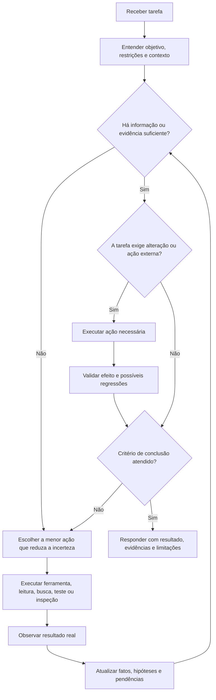
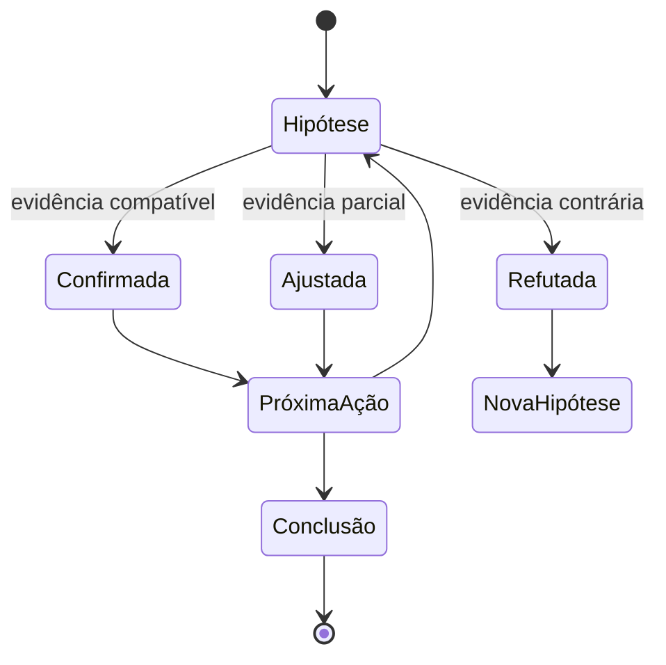

# ReAct

## Objetivo

ReAct (Reasoning and Acting) conduz tarefas que exigem alternância entre:

1. avaliar o estado atual;
2. decidir a próxima ação útil;
3. executar uma ação ou ferramenta;
4. observar o resultado real;
5. atualizar o entendimento;
6. repetir somente enquanto houver incerteza relevante ou trabalho pendente.

ReAct não é um convite para produzir raciocínio longo, especulativo ou expor cadeia de pensamento ao usuário.

Ele é um mecanismo de controle para evitar dois problemas comuns:

- agir sem evidência suficiente;
- continuar raciocinando sem verificar a realidade.

## Princípio central

> Não trate uma suposição como fato quando uma ação, ferramenta, arquivo, teste, documentação ou observação puder validá-la.

O ciclo canônico é: avaliar o estado, decidir a menor ação que reduz a incerteza, executá-la, observar o resultado real, atualizar fatos e hipóteses, e concluir ou repetir.



## Quando usar ReAct

Use ReAct quando a tarefa tiver pelo menos uma das condições abaixo:

- exige múltiplas etapas dependentes;
- depende de ferramentas, arquivos, APIs, banco de dados, terminal, testes ou navegador;
- contém incerteza relevante que pode ser reduzida por observação;
- envolve depuração, diagnóstico ou investigação de causa raiz (ver [Root Cause Analysis](root-cause-analysis.md));
- requer validar uma implementação antes de concluir;
- possui efeitos colaterais, como editar código, enviar mensagens, alterar configurações ou criar recursos;
- exige adaptação após resultados inesperados;
- envolve fatos potencialmente atuais, externos ou verificáveis;
- possui risco técnico, financeiro, jurídico, operacional ou de segurança.

Exemplos adequados:

- investigar por que um teste está falhando;
- implementar uma funcionalidade em projeto existente;
- revisar uma Pull Request;
- consultar documentação de uma biblioteca atualizada;
- analisar um arquivo antes de gerar uma peça ou relatório;
- verificar se uma API responde conforme o contrato;
- encontrar a causa de um erro de build;
- pesquisar informação atual antes de recomendar uma decisão.

## Quando evitar ReAct

Não use ReAct como ritual automático em tarefas simples, diretas ou puramente criativas.

Evite ou reduza o ciclo quando:

- o usuário pediu uma explicação conceitual estável e sem necessidade de pesquisa;
- a resposta pode ser produzida diretamente com base em conhecimento confiável;
- a tarefa é uma reescrita, tradução ou ajuste de texto fornecido pelo usuário;
- não existe ferramenta, observação ou validação que agregue valor;
- o custo de investigar é maior que o risco da resposta;
- a tarefa é criativa e não depende de fatos externos;
- a próxima ação não reduz incerteza nem avança o objetivo.

Exemplos em que ReAct normalmente é desnecessário:

```text
"Explique o que é uma função em Python."
"Traduza este texto para inglês."
"Melhore a clareza deste parágrafo."
"Crie nomes para uma startup."
```

## ReAct não substitui outras técnicas

ReAct é um mecanismo de execução e controle. Ele deve trabalhar junto com outras skills e técnicas.

| Técnica                                       | Função principal                        | Relação com ReAct                                     |
| --------------------------------------------- | --------------------------------------- | ----------------------------------------------------- |
| [OODA](ooda.md)                               | Macro-loop da execução inteira até a DoD | ReAct é o micro-ciclo dentro da fase Agir do OODA     |
| [Plan and Execute](plan-and-execute.md)       | Quebrar objetivo em etapas              | ReAct executa e ajusta o plano                        |
| [Evidence Synthesis](evidence-synthesis.md)   | Recuperar contexto e evidência          | ReAct decide quando buscar e como usar o resultado    |
| [Verification](verification.md)               | Validar comportamento                   | ReAct interpreta o resultado e decide o próximo passo |
| [Critique and Refine](critique-and-refine.md) | Identificar falhas no plano ou resposta | ReAct usa isso antes de concluir                      |

### Técnicas relacionadas

- [OODA](ooda.md) — para execução longa/dinâmica, o macro-loop é o OODA; ReAct vive dentro do Agir
- [Plan and Execute](plan-and-execute.md)
- [Evidence Synthesis](evidence-synthesis.md)
- [Verification](verification.md)
- [Critique and Refine](critique-and-refine.md)
- [Assumption Tracking](assumption-tracking.md)
- [Root Cause Analysis](root-cause-analysis.md)

Voltar ao [catálogo de técnicas](../SKILL.md).

## Modelo mental operacional

Cada ciclo ReAct deve responder, de forma compacta, às perguntas abaixo.

```text
1. O que já é conhecido?
2. O que ainda é desconhecido ou precisa ser validado?
3. Qual é a menor próxima ação útil?
4. Que evidência espero obter?
5. O resultado confirmou, refutou ou alterou minha hipótese?
6. A tarefa pode ser concluída com segurança?
```

Não é necessário produzir essas perguntas literalmente para o usuário. Elas orientam a execução interna e evitam ações aleatórias.

## Estado operacional

Antes de agir, construa ou atualize um estado mínimo da tarefa.

```text
Objetivo:
- Resultado que o usuário espera receber.

Contexto:
- Arquivos, código, regras, ferramentas e informações disponíveis.

Fatos confirmados:
- Informações observadas, testadas ou fornecidas explicitamente.

Hipóteses:
- Possibilidades ainda não comprovadas.

Restrições:
- Segurança, escopo, prazo, stack, convenções, permissões e preferências.

Pendências:
- O que precisa ser descoberto, decidido, implementado ou validado.

Critério de conclusão:
- O que precisa estar verdadeiro para encerrar a tarefa.
```

### Regra de evidência

Classifique mentalmente cada informação importante como uma destas categorias:

| Categoria    | Significado                                            | Tratamento                                    |
| ------------ | ------------------------------------------------------ | --------------------------------------------- |
| Confirmado   | Observado diretamente ou fornecido por fonte confiável | Pode orientar decisões                        |
| Inferido     | Conclusão razoável baseada em evidências               | Deve ser apresentado como inferência          |
| Hipótese     | Possibilidade ainda não validada                       | Deve ser testada ou explicitamente sinalizada |
| Desconhecido | Informação ausente                                     | Não deve ser inventada                        |

## Ciclo ReAct

### 1. Avaliar

Entenda a tarefa antes de agir. Verifique:

- objetivo explícito;
- escopo solicitado;
- contexto já disponível;
- regras do projeto;
- riscos;
- ambiguidade material;
- necessidade de ferramentas;
- necessidade de confirmação do usuário.

Não faça perguntas por reflexo. Use a skill de entrevista somente quando a resposta não puder ser obtida por contexto, código, documentação, arquivos ou observação segura.

### 2. Decidir

Escolha a menor ação que gere progresso real. Uma boa ação ReAct deve atender a pelo menos um critério:

- reduz incerteza;
- valida uma hipótese;
- recupera evidência;
- avança uma etapa do objetivo;
- detecta regressão;
- confirma uma alteração;
- identifica bloqueio ou risco.

Evite ações que apenas pareçam produtivas.

Exemplos ruins:

```text
- Pesquisar sem uma pergunta específica.
- Rodar todos os testes sem relação com a alteração.
- Ler dezenas de arquivos sem hipótese ou objetivo.
- Alterar código antes de entender a causa do problema.
- Fazer várias chamadas de ferramenta redundantes.
```

Exemplos bons:

```text
- Ler o componente citado no erro antes de propor uma correção.
- Executar o teste que falhou para confirmar o comportamento.
- Consultar a documentação oficial de uma API antes de usar um método novo.
- Inspecionar o contrato de uma rota antes de alterar o frontend.
- Verificar o diff antes de concluir uma refatoração.
```

### 3. Agir

Execute uma ação por vez quando o resultado de uma ação puder mudar a próxima decisão.

Ações independentes podem ocorrer em paralelo apenas quando:

- não alteram o mesmo recurso;
- não dependem do resultado uma da outra;
- não criam risco de race condition;
- há ganho real de tempo ou cobertura;
- os resultados podem ser interpretados separadamente.

Nunca afirme que uma ação foi executada, um arquivo foi alterado, um teste passou ou uma ferramenta retornou algo sem observar o resultado real.

### 4. Observar

Após cada ação relevante, interprete o resultado antes de continuar. A observação deve responder:

```text
- O que aconteceu?
- O resultado corresponde ao esperado?
- A hipótese foi confirmada, refutada ou enfraquecida?
- Surgiu nova informação relevante?
- Há erro, inconsistência, limitação ou risco?
- O plano precisa ser alterado?
```

Não ignore erros de ferramentas, mensagens de teste, logs, conflitos ou resultados inesperados. Um erro é evidência. Ele deve alterar o estado da tarefa.

### 5. Atualizar

Atualize o entendimento com base em evidência, não em desejo.



Quando uma hipótese falhar (ver [Assumption Tracking](assumption-tracking.md)):

1. não insista nela sem nova evidência;
2. identifique qual premissa estava errada;
3. formule uma hipótese alternativa;
4. escolha uma nova ação que diferencie as hipóteses;
5. evite aplicar correções cosméticas que apenas escondam o problema.

### 6. Concluir

Conclua somente quando o critério de conclusão estiver atendido. Antes de finalizar, verifique:

```text
[ ] O objetivo principal foi atendido.
[ ] As informações relevantes foram validadas.
[ ] O resultado respeita as restrições do usuário e do projeto.
[ ] Alterações foram verificadas por testes, lint, build ou revisão compatível.
[ ] Riscos, limitações e pendências foram comunicados.
[ ] Não há suposições críticas tratadas como fatos.
[ ] Não existe próxima ação obrigatória claramente identificável.
```

A resposta final deve separar, quando aplicável: resultado; evidências ou validações realizadas; decisões importantes; limitações ou riscos; e próximos passos somente quando forem úteis.

## Formato de registro operacional

Não exponha cadeia de pensamento detalhada. Quando for útil registrar uma etapa, use um formato compacto e verificável:

```text
Objetivo da ação:
- Validar se o erro vem do contrato da API ou do mapeamento no frontend.

Ação:
- Inspecionar o tipo de resposta usado pelo endpoint.

Observação:
- O campo retornado é `created_at`, mas o frontend espera `createdAt`.

Atualização:
- A hipótese de incompatibilidade de contrato foi confirmada.

Próxima decisão:
- Corrigir o mapeamento e adicionar teste de regressão.
```

Esse formato é preferível a explicações longas, especulativas ou sem evidência.

## Regras para ferramentas

As regras de uso de ferramentas, ações com efeito colateral e confirmação de ações de alto impacto vivem na skill [pelizzai-reasoning](../SKILL.md) e valem integralmente aqui. Notas mínimas específicas do ciclo ReAct:

- antes de usar uma ferramenta, saiba qual pergunta ela responde e qual resultado seria suficiente;
- depois de usar, confirme que o resultado foi interpretado corretamente e se altera o plano;
- trate como ações de maior cuidado as que têm efeito colateral (editar/deletar, alterar infraestrutura, publicar, enviar mensagens, transações). Prefira ações reversíveis, valide o alvo e o efeito após a execução.

## Regras de parada

Interrompa o ciclo ReAct quando ocorrer uma destas condições:

- o objetivo foi atendido e validado;
- não há mais incerteza material;
- nenhuma ação disponível reduz incerteza ou avança o objetivo;
- detecção de loop ou não-progresso: a mesma ação produz a mesma observação sem mudar o estado, ou as últimas iterações não alteraram fatos, hipóteses nem pendências;
- o esforço gasto ultrapassou o orçamento de esforço previsto para a tarefa (ver [pelizzai-reasoning](../SKILL.md));
- faltam permissões, contexto ou ferramentas essenciais;
- a próxima ação exige autorização explícita do usuário;
- o custo, risco ou tempo da investigação deixou de ser proporcional ao benefício;
- foram encontradas evidências suficientes para comunicar uma limitação ou bloqueio.

Não continue pesquisando, testando ou alterando apenas para parecer diligente.

## Falhas comuns

### 1. Agir antes de observar

```text
Erro:
"Vou alterar o componente porque provavelmente o problema está nele."

Melhor:
"Ler o componente, reproduzir o erro e identificar a origem antes da alteração."
```

### 2. Pesquisar sem hipótese

```text
Erro:
"Pesquisar tudo sobre autenticação JWT."

Melhor:
"Verificar na documentação se a biblioteca aceita rotação de refresh token sem invalidar sessões ativas."
```

### 3. Ignorar resultado inesperado

```text
Erro:
"O teste falhou, mas a alteração parece correta. Vou seguir."

Melhor:
"O teste falhou; verificar se representa regressão, expectativa desatualizada ou ambiente inconsistente."
```

### 4. Fazer muitas ações sem reavaliar

```text
Erro:
Ler arquivos, alterar código, rodar build e criar teste sem interpretar resultados intermediários.

Melhor:
Executar uma sequência curta, observar, atualizar o estado e então decidir a próxima ação.
```

### 5. Confundir hipótese com fato

```text
Erro:
"A API não suporta paginação."

Melhor:
"Não encontrei paginação no contrato atual; verificar documentação, implementação ou resposta real antes de concluir."
```

### 6. Usar ReAct em excesso

```text
Erro:
Aplicar múltiplas ferramentas para responder uma pergunta conceitual simples.

Melhor:
Responder diretamente quando não houver necessidade real de evidência externa.
```

## Exemplos

### Exemplo 1 — Correção de bug

```text
Tarefa:
"O botão de salvar não funciona."

Estado inicial:
- Não há erro informado.
- Não se sabe se o problema está no frontend, API ou validação.

Decisão:
- Reproduzir o comportamento e inspecionar erros do navegador.

Ação:
- Executar a aplicação e acionar o botão.

Observação:
- A requisição retorna HTTP 422.
- O backend exige `document_number`, mas o frontend envia `documentNumber`.

Atualização:
- A causa provável é incompatibilidade de contrato.

Próxima ação:
- Corrigir o payload, adicionar teste e validar a submissão novamente.
```

### Exemplo 2 — Hipótese refutada (backtracking)

```text
Tarefa:
"A página fica em branco intermitentemente após o login."

Hipótese inicial:
- O token de sessão expira cedo demais e derruba a renderização.

Ação:
- Inspecionar logs de autenticação e o tempo de vida do token nas sessões afetadas.

Observação:
- O token continua válido nos casos com tela em branco; o erro real é um `TypeError`
  ao ler um campo ausente no payload do perfil.

Atualização:
- Hipótese do token REFUTADA. A premissa "o problema é de sessão" estava errada.
- Nova hipótese: payload do perfil às vezes vem sem o campo esperado.

Próxima ação (que diferencia as hipóteses):
- Reproduzir com um perfil incompleto e confirmar o `TypeError`, evitando "corrigir"
  o token, o que apenas esconderia o problema.
```

## Integração com PelizzAI

Ao usar ReAct dentro do harness:

- aplique primeiro as skills globais e regras do projeto, recuperando contexto relevante antes de agir;
- use entrevista apenas quando a ambiguidade for material; use documentação, ferramentas e arquivos como fontes de evidência;
- valide ações antes de declarar sucesso e respeite regras de segurança, permissões e efeitos colaterais;
- mantenha o ciclo proporcional ao risco e à complexidade da tarefa, dentro do orçamento de esforço da skill [pelizzai-reasoning](../SKILL.md).
