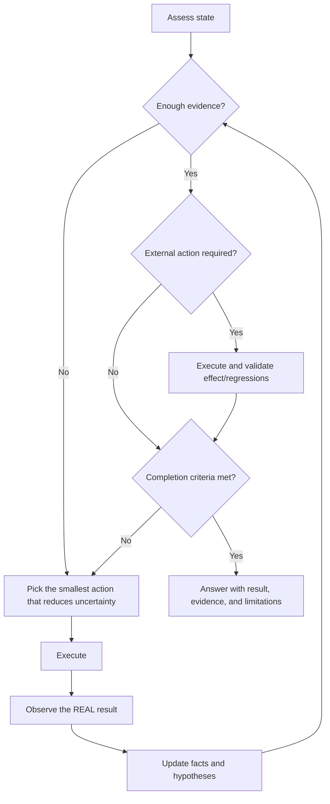

# ReAct

## Purpose

ReAct (Reasoning and Acting) drives tasks that require alternating between thinking and acting on
evidence: assess the state, decide the smallest useful action, execute it, **observe the real
result**, update your understanding, and repeat while relevant uncertainty or pending work remains.

It is not an invitation to long-form reasoning or to exposing chain of thought. It is a control
mechanism against two errors: acting without sufficient evidence, and reasoning on without checking
reality.

## Core principle

> Never treat an assumption as fact when an action, tool, file, test, documentation, or
> observation can validate it.

This is ReAct's anti-fabrication discipline and the heart of the technique:

- **Never fabricate the result of a tool.** Do not claim a file was changed, a test passed, a
  command ran, or an API returned something without having observed the real result.
- **Observe before the next step.** Every relevant action produces an observation that precedes the
  next decision. A tool error, log, or test failure is evidence — it must change the state of the
  task, never be ignored.
- **One action at a time** whenever the result could change the next decision. Only parallelize
  independent actions (they do not touch the same resource, do not depend on each other, and their
  results are interpretable separately).


```mermaid
flowchart TD
    A[Assess state] --> B{Enough evidence?}
    B -- No --> C[Pick the smallest action that reduces uncertainty]
    C --> D[Execute]
    D --> E[Observe the REAL result]
    E --> F[Update facts and hypotheses]
    F --> B
    B -- Yes --> G{External action required?}
    G -- Yes --> H[Execute and validate effect/regressions]
    G -- No --> I{Completion criteria met?}
    H --> I
    I -- No --> C
    I -- Yes --> J[Answer with result, evidence, and limitations]
```

## When to use

Use ReAct when the task meets at least one of these conditions:

- multiple dependent steps;
- depends on tools, files, APIs, a database, a terminal, tests, or a browser;
- relevant uncertainty that observation can reduce;
- debugging, diagnosis, or root cause investigation (see [Root Cause Analysis](root-cause-analysis.md));
- requires validating an implementation before concluding;
- has side effects (editing code, sending a message, changing config, creating a resource);
- involves potentially current or verifiable facts;
- carries technical, financial, legal, operational, or security risk.

## When to avoid

Do not use ReAct as a ritual on simple, direct, or purely creative tasks: stable conceptual
explanation, rewriting/translating supplied text, or when no tool/observation adds value and the
next action does not reduce uncertainty.

```text
"Explain what a function is in Python."   "Translate this text into English."
"Improve the clarity of this paragraph."  "Come up with names for a startup."
```

## ReAct and the other techniques

ReAct is the execution mechanism; it works inside other techniques rather than replacing them.

| Technique                                     | Relationship to ReAct                                                 |
| --------------------------------------------- | --------------------------------------------------------------------- |
| [OODA](ooda.md)                               | Macro-loop up to the DoD; ReAct is the micro-cycle inside Act         |
| [Plan and Execute](plan-and-execute.md)       | Defines the steps; ReAct executes and adjusts each one                |
| [Verification](verification.md)               | Defines the proof; ReAct interprets the result and decides next steps |
| [Root Cause Analysis](root-cause-analysis.md) | Structures the investigation; ReAct runs the inspections              |
| [Critique and Refine](critique-and-refine.md) | Identifies the flaw; ReAct acts before concluding                     |

## Mental model of the cycle

Each cycle answers, compactly and internally (not to the user):

```text
1. What is already confirmed fact?
2. What is still hypothesis or unknown and needs validation?
3. What is the smallest next useful action, and what evidence do I expect from it?
4. Did the result confirm, refute, or adjust the hypothesis?
5. Can I safely conclude?
```

Classify each important piece of information as **Confirmed** (observed or from a reliable source —
can drive decisions), **Inferred** (present it as inference), **Hypothesis** (test it or flag it),
or **Unknown** (do not invent it).

## The six phases

**1. Assess.** Understand the goal, scope, available context, project rules, and risks before
acting. Do not ask reflexively on a **factual** doubt: context, code, documentation, files, and safe
observation settle facts. A **material** decision gap (requirement, scope, UX, architecture, data,
security, acceptance) is not settled by research: it goes to `pelizzai-interview-me` even when the
documentation suggests a path — evidence improves the recommendation, it never replaces
ratification.

**2. Decide.** Pick the smallest action that produces real progress — one that reduces uncertainty,
validates a hypothesis, recovers evidence, advances a step, detects a regression, or identifies a
blocker. Avoid actions that only look productive (searching without a question, running all tests
unrelated to the change, reading dozens of files without a hypothesis, changing code before
understanding the cause).

**3. Act.** Execute one action at a time whenever the result could change the next decision. Never
claim an action happened without observing the real result.

**4. Observe.** After each relevant action, interpret before moving on: what happened? does it match
expectations? was the hypothesis confirmed, refuted, or weakened? did an error, limitation, or risk
surface? does the plan change? Do not ignore a tool error, test message, log, or unexpected result —
it is evidence.

**5. Update.** Update your understanding based on evidence, not on wishful thinking. When a
hypothesis fails (see [Assumption Tracking](assumption-tracking.md)): do not insist without new
evidence, identify the wrong premise, formulate an alternative, choose an action that
**differentiates** the hypotheses, and avoid cosmetic fixes that merely hide the problem.

**6. Conclude.** Stop only when the completion criteria are met:

```text
[ ] Main goal met and relevant information validated.
[ ] Result respects user and project constraints.
[ ] Changes verified by test, lint, build, or an appropriate review.
[ ] Risks, limitations, and open items communicated.
[ ] No critical assumption treated as fact; no mandatory next action left pending.
```

## Operational logging format

Do not expose detailed chain of thought. When logging a step, use a compact, verifiable format —
preferable to long or speculative explanations:

```text
Action goal:
- Validate whether the error comes from the API contract or the frontend mapping.
Action:
- Inspect the response type used by the endpoint.
Observation:
- The returned field is `created_at`, but the frontend expects `createdAt`.
Update:
- Contract mismatch hypothesis confirmed.
Next decision:
- Fix the mapping and add a regression test.
```

## Tools and stopping

Rules for tool use, side effects, and high-impact confirmation live in the
[pelizzai-reasoning](../SKILL.md) skill and apply here. Cycle notes: before using a tool, know which
question it answers; afterwards, confirm you interpreted the result and whether it changes the plan;
treat side-effecting actions (edit/delete, publish, send, transactions) with extra care, preferring
reversible ones and validating the effect after execution.

Break the cycle when: the goal has been met and validated; there is no material uncertainty; no
available action reduces uncertainty or advances the goal; **loop detection** (the same action
produces the same observation, or the last iterations changed no facts, hypotheses, or open items);
the effort budget is exhausted; permissions, context, or tools are missing; the next action requires
user authorization; or the cost is no longer proportional to the benefit. Do not keep going just to
look diligent.

## Example — refuted hypothesis (backtracking)

```text
Task:
- "The page intermittently goes blank after login."

Initial hypothesis:
- The session token expires early and breaks rendering.

Action:
- Inspect authentication logs and the token lifetime in the affected sessions.

Observation:
- The token is still valid in the blank-screen cases; the real error is a `TypeError`
  when reading a missing field in the profile payload.

Update:
- Token hypothesis REFUTED. The premise "this is a session problem" was wrong.
- New hypothesis: the profile payload sometimes arrives without the expected field.

Next action (one that differentiates the hypotheses):
- Reproduce with an incomplete profile and confirm the `TypeError`, instead of "fixing" the token,
  which would only hide the problem.
```

The example shows the core discipline: the real observation knocks down the hypothesis, the state is
updated by evidence, and the next action is chosen to differentiate hypotheses — never to confirm
the initial one.

## Related techniques

- [OODA](ooda.md) — macro-loop; ReAct lives inside Act.
- [Plan and Execute](plan-and-execute.md) · [Verification](verification.md) · [Critique and Refine](critique-and-refine.md) · [Assumption Tracking](assumption-tracking.md) · [Root Cause Analysis](root-cause-analysis.md)

Back to the [technique catalog](../SKILL.md).
