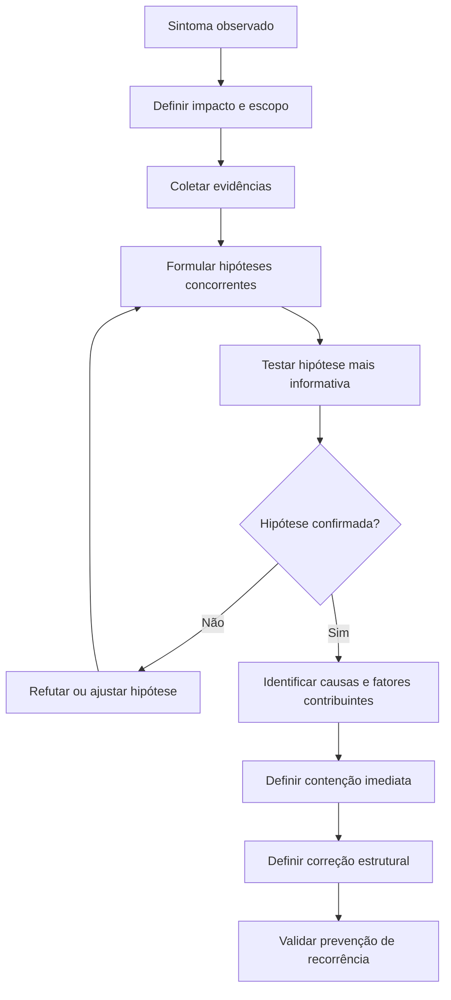
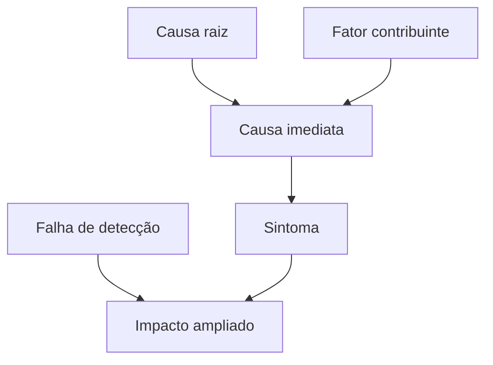
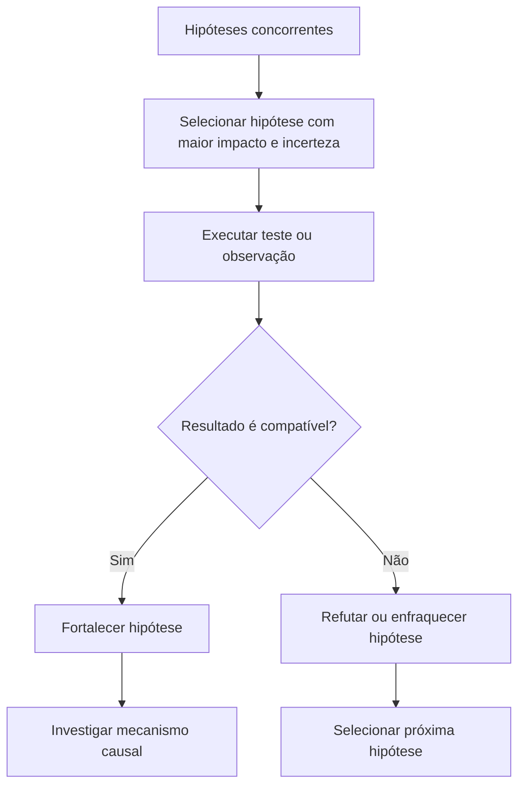
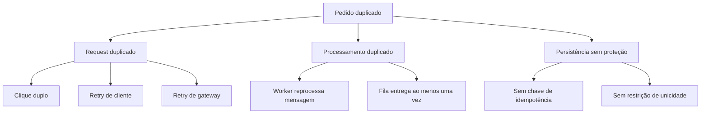
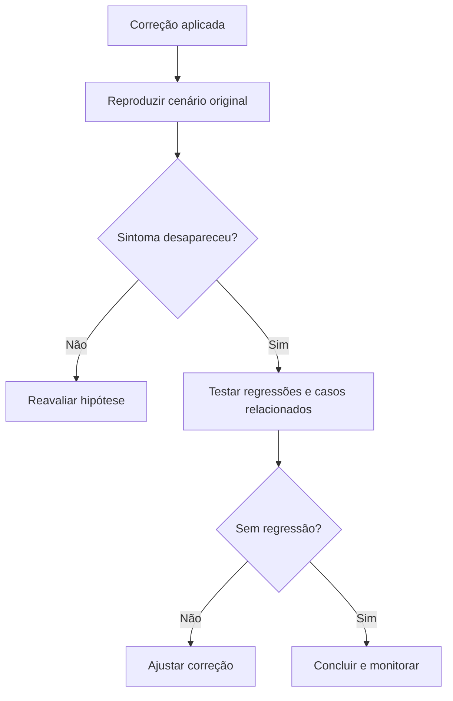

# Root Cause Analysis

## Objetivo

Use Root Cause Analysis para identificar por que um problema ocorreu, quais condições permitiram sua ocorrência e qual correção reduz a chance de repetição.

A técnica deve evitar correções superficiais que apenas escondem o sintoma.

Ela é especialmente útil para:

```text
- Bugs recorrentes.
- Falhas de integração.
- Dados duplicados ou inconsistentes.
- Erros intermitentes.
- Lentidão ou degradação de performance.
- Incidentes em produção.
- Regressões após deploy.
- Falhas de autenticação, autorização ou permissões.
- Problemas envolvendo filas, retries, cache ou concorrência.
- Comportamento diferente entre ambientes.
```

Root Cause Analysis não significa procurar uma única causa perfeita em todos os casos.

Problemas reais podem possuir:

```text
- Um sintoma observável.
- Uma causa imediata.
- Uma ou mais causas raiz.
- Fatores contribuintes.
- Falhas de detecção.
- Lacunas de prevenção.
```

Causas raiz **múltiplas ou sistêmicas** são caso de primeira classe, não exceção. Quando duas ou mais condições estruturais contribuem de forma independente para o sintoma, trate cada uma como causa raiz própria, com sua própria correção e prevenção. Forçar uma única causa quando há várias é um erro de modelagem (ver Fault Tree Analysis e os anti-padrões abaixo).

## Princípio central

> Não corrija apenas o primeiro ponto que parece errado. Confirme qual mecanismo produziu o problema, quais condições permitiram sua ocorrência e como evitar recorrência.



## Quando usar

Use Root Cause Analysis quando:

```text
- O problema é recorrente ou possui impacto relevante.
- A causa não é evidente.
- Há múltiplas hipóteses plausíveis.
- Uma correção superficial já falhou antes.
- O erro ocorre apenas em certos ambientes, horários, dados ou usuários.
- O problema envolve concorrência, retries, cache, integrações ou estado compartilhado.
- Existe risco de regressão, perda de dados, falha de segurança ou indisponibilidade.
- O incidente precisa gerar correção duradoura, documentação ou prevenção.
```

Exemplos adequados:

```text
- Pedidos são duplicados.
- Usuários são deslogados aleatoriamente.
- Um endpoint ficou lento após deploy.
- Arquivos enviados desaparecem em alguns casos.
- Uma integração funciona localmente, mas falha em produção.
- Um job é processado duas vezes.
- O frontend exibe dados desatualizados.
```

O esforço de investigação deve ser proporcional ao risco e ao impacto, conforme o orçamento de esforço definido na skill [pelizzai-reasoning](../SKILL.md).

## Quando evitar

Não use Root Cause Analysis completa para problemas simples e localizados.

Evite ou reduza a técnica quando:

```text
- Existe erro explícito, reproduzível e com causa direta evidente.
- A alteração é pequena, reversível e sem impacto relevante.
- Um teste, contrato ou compilador já aponta claramente o problema.
- A investigação custaria mais do que corrigir e validar.
- O problema não possui recorrência, risco ou dependência relevante.
```

Exemplos:

```text
- Import com caminho incorreto.
- Erro de sintaxe.
- Variável inexistente claramente apontada pelo compilador.
- Texto incorreto em uma interface.
- Configuração local ausente e facilmente identificável.
```

## Relação com outras técnicas

| Técnica             | Responsabilidade                                                     |
| ------------------- | -------------------------------------------------------------------- |
| Root Cause Analysis | Investiga por que um problema ocorreu e como impedir recorrência     |
| ReAct               | Executa ações de investigação e atualiza hipóteses                   |
| Assumption Tracking | Registra hipóteses e premissas ainda não confirmadas                 |
| Evidence Synthesis  | Combina logs, testes, código, documentação e observações             |
| Decision Making     | Escolhe entre estratégias de correção quando os caminhos são interdependentes |
| Verification        | Confirma ou refuta a causa identificada                              |
| Critique and Refine | Corrige a solução quando a validação revela lacunas                  |
| Plan and Execute    | Organiza investigação, contenção, correção e prevenção               |

## Conceitos fundamentais

### Sintoma

É o comportamento visível que revela um problema.

```text
Exemplos:
- Usuários recebem erro 500.
- Pedido aparece duas vezes.
- Tela permanece carregando.
- API responde lentamente.
- Arquivo não aparece após upload.
```

O sintoma não é necessariamente a causa.

### Causa imediata

É o mecanismo técnico diretamente responsável pelo resultado observado.

```text
Exemplo:
Sintoma:
- Pedido duplicado.

Causa imediata:
- O endpoint persistiu duas requisições idênticas.
```

A causa imediata pode ainda não explicar por que a duplicidade foi permitida.

### Causa raiz

É uma condição estrutural que, se corrigida, reduz a probabilidade de recorrência do problema.

```text
Exemplo:
Causa raiz:
- O endpoint não possui chave de idempotência nem restrição de unicidade para impedir persistência duplicada durante retries.
```

Uma causa raiz deve ser sustentada por evidência, não escolhida por intuição. Um mesmo sintoma pode ter mais de uma causa raiz independente; nesse caso, registre todas.

### Fator contribuinte

É uma condição que aumenta a probabilidade ou o impacto do problema, mas não é suficiente sozinha para causá-lo.

```text
Exemplos:
- Clique duplo no botão.
- Retry automático do cliente.
- Falta de monitoramento.
- Timeout curto.
- Cache desatualizado.
- Ausência de teste de regressão.
```

### Falha de detecção

É o motivo pelo qual o problema não foi percebido antes ou não foi interceptado corretamente.

```text
Exemplos:
- Não havia alerta para crescimento de erros.
- Testes não cobriam cenário concorrente.
- Logs não incluíam ID de correlação.
- A interface escondia erro do backend.
```

## Modelo causal

Use esta estrutura para não confundir camadas do problema.

```text
Sintoma:
- O que foi observado?

Impacto:
- Quem ou o que foi afetado?

Causa imediata:
- Qual mecanismo produziu o erro?

Causa raiz:
- Qual falha estrutural permitiu que isso ocorresse? (pode haver mais de uma)

Fatores contribuintes:
- Quais condições aumentaram a chance ou impacto?

Falha de detecção:
- Por que o problema não foi identificado antes?

Correção:
- O que elimina ou reduz a causa raiz?

Prevenção:
- O que reduz probabilidade, impacto ou tempo de detecção?
```



## Processo de investigação

### 1. Definir o problema com precisão

Comece descrevendo o comportamento observável, sem assumir causa.

```text
Ruim:
"O botão salva duas vezes."

Melhor:
"Dois pedidos são criados quando a ação de salvar é acionada duas vezes em menos de dois segundos."
```

Registre:

```text
- Quando ocorre.
- Onde ocorre.
- Quem é afetado.
- Frequência.
- Impacto.
- Ambiente.
- Versão ou deploy relacionado.
- Dados ou condições necessárias.
- Evidências já disponíveis.
```

### 2. Delimitar escopo e impacto

Antes de investigar causa, determine o tamanho do problema.

```text
Perguntas:
- O erro ocorre para todos ou apenas alguns usuários?
- O problema começou após mudança específica?
- Acontece em produção, homologação ou localmente?
- Existe padrão por navegador, dispositivo, região, tenant ou tipo de dado?
- Há perda, duplicidade, exposição ou indisponibilidade?
- O impacto continua ativo?
```

Não investigue com premissa de que todos os casos possuem a mesma causa.

### 3. Conter antes de corrigir

Quando houver risco de dano contínuo, priorize contenção reversível.

```text
Exemplos:
- Desativar feature por feature flag.
- Bloquear ação repetida temporariamente.
- Pausar job defeituoso.
- Reduzir taxa de processamento.
- Reverter deploy.
- Isolar integração externa.
- Impedir operação destrutiva.
```

A contenção não substitui correção estrutural (ver a tabela em "Correção, contenção e prevenção").

### 4. Coletar evidências antes de alterar

Colete o mínimo de evidência necessário para formular hipóteses úteis.

Fontes comuns:

```text
- Logs e traces.
- Métricas e dashboards.
- Requests e responses.
- Testes automatizados.
- Código e diff recente.
- Configuração de ambiente.
- Eventos de fila.
- Dados persistidos.
- Telemetria.
- Relatos de usuários.
- Documentação e contratos.
```

Não altere código antes de preservar evidência importante, especialmente em incidentes intermitentes ou produção.

```text
Regra:
O que foi observado diretamente deve ser separado do que está sendo inferido.
```

### 5. Construir linha do tempo

Uma linha do tempo ajuda a localizar mudança, gatilho ou sequência causal.

```text
Formato:

T0:
- Último comportamento conhecido como correto.

T1:
- Mudança, deploy, configuração, evento externo ou aumento de carga.

T2:
- Primeiro sintoma observado.

T3:
- Impacto confirmado.

T4:
- Contenção aplicada.

T5:
- Hipótese validada ou refutada.
```

Não conclua que uma alteração recente é a causa apenas porque ocorreu antes do incidente. Use-a como hipótese inicial.

### 6. Formular hipóteses concorrentes

Crie hipóteses que expliquem os fatos observados. Hipóteses não são mutuamente exclusivas: mais de uma pode ser confirmada simultaneamente.

```text
Problema:
- Pedidos duplicados.

Hipóteses:
A. Interface envia duas requisições.
B. Cliente faz retry após timeout.
C. Gateway repete request.
D. Backend não é idempotente.
E. Worker processa mensagem duas vezes.
F. Banco permite duplicidade por falta de restrição.
```

Para cada hipótese, registre:

```text
Hipótese:
- [explicação possível]

Evidência a favor:
- [fatos compatíveis]

Evidência contra:
- [fatos incompatíveis]

Teste ou observação:
- [menor ação que confirma ou refuta]

Resultado esperado:
- [o que deve aparecer se for verdadeira]

Critério de descarte:
- [o que a torna improvável ou falsa]

Impacto:
- [o que muda se for confirmada]
```

## Investigação orientada por hipótese

Não busque "tudo".

Escolha a próxima ação pelo maior valor informacional.



Exemplo:

```text
Hipótese:
- O frontend faz request duplicado.

Ação útil:
- Inspecionar logs com request ID e timestamp.

Ação pouco útil:
- Refatorar o botão antes de confirmar requisições duplicadas.
```

## Técnicas de investigação

### 5 Whys

Use 5 Whys para aprofundar uma cadeia causal simples, não como ritual obrigatório.

```text
Problema:
- Usuários recebem erro ao gerar relatório.

Por quê?
- O worker falha ao processar arquivo grande.

Por quê?
- O arquivo inteiro é carregado em memória.

Por quê?
- A implementação usa processamento síncrono em lote.

Por quê?
- Não havia requisito explícito de limite de memória ou streaming.

Por quê?
- A análise inicial não considerou volume real de dados.

Possível causa raiz:
- Ausência de requisito e validação de volume para processamento de relatórios.
```

Limitações:

```text
- Não funciona bem para sistemas com múltiplas causas.
- Pode induzir causalidade linear artificial.
- Não deve substituir logs, testes ou evidência real.
```

### Fault Tree Analysis

Use árvore de falhas quando um sintoma pode resultar de combinações de causas. É a ferramenta natural para causas raiz múltiplas ou sistêmicas.



Use quando:

```text
- Há múltiplos caminhos causais.
- O sistema é distribuído.
- Existem retries, filas, cache ou concorrência.
- Uma falha depende de combinação de eventos.
```

### Comparação de estados

Use quando o problema ocorre apenas em alguns ambientes, usuários ou dados.

```text
Compare:

- Ambiente que funciona versus ambiente que falha.
- Request bem-sucedido versus request com erro.
- Usuário afetado versus não afetado.
- Dados válidos versus dados problemáticos.
- Antes versus depois de deploy.
- Configuração antiga versus configuração nova.
```

### Reprodução controlada

Sempre que possível, transforme relato em cenário reproduzível.

```text
Uma boa reprodução define:
- entrada;
- estado inicial;
- ambiente;
- sequência de ações;
- resultado esperado;
- resultado observado;
- logs ou evidências associadas.
```

```text
Ruim:
"Às vezes falha."

Melhor:
"Após alterar filtro na página 3 e clicar em exportar, a API recebe `page=3`, gera arquivo vazio e retorna sucesso."
```

## Identificação da causa raiz

Uma hipótese só deve ser tratada como causa raiz quando:

```text
[ ] Explica o sintoma observado.
[ ] É compatível com evidências disponíveis.
[ ] Pode ser reproduzida, observada ou testada.
[ ] A correção reduz a chance de recorrência.
[ ] Não depende de outra causa mais fundamental ainda não investigada.
[ ] Não é apenas um efeito secundário.
```

```text
Regra:
A causa raiz não precisa explicar todos os problemas possíveis.
Ela precisa explicar o problema investigado dentro do escopo definido.
Pode haver mais de uma causa raiz; cada uma deve passar pelos mesmos critérios.
```

## Correção estrutural

A correção deve atacar o mecanismo confirmado, não apenas esconder o sintoma. Quando há mais de uma causa raiz, cada uma precisa de sua própria correção.

Uma boa correção pode combinar camadas:

```text
- Interface: evita ação repetida e melhora feedback.
- API: aplica idempotência e valida contrato.
- Banco: impede duplicidade estrutural.
- Worker: trata reprocessamento de forma idempotente.
- Observabilidade: monitora tentativas duplicadas.
```

## Prevenção e detecção

Depois da correção, identifique como evitar ou detectar recorrência.

### Prevenção

```text
- Teste de regressão.
- Validação de entrada.
- Idempotência.
- Restrição de banco.
- Retry com política segura.
- Controle de concorrência.
- Contrato explícito.
- Feature flag.
- Limites de recurso.
- Revisão de arquitetura.
```

### Detecção

```text
- Logs estruturados.
- Correlation ID.
- Métricas.
- Alertas.
- Dashboards.
- Auditoria.
- Health checks.
- Monitoramento de taxa de erro.
- Monitoramento de duplicidade.
```

## Correção, contenção e prevenção

| Tipo      | Objetivo                       | Exemplo                               |
| --------- | ------------------------------ | ------------------------------------- |
| Contenção | Reduzir impacto agora          | Desativar feature defeituosa          |
| Correção  | Eliminar causa confirmada      | Adicionar idempotência no endpoint    |
| Prevenção | Reduzir recorrência futura     | Criar teste de retry e regra de banco |
| Detecção  | Descobrir problema rapidamente | Alertar duplicidade acima do limite   |

Não confunda contenção com resolução definitiva.

## Validação da correção

Uma correção não está concluída apenas porque o sintoma desapareceu uma vez.

Valide:

```text
[ ] O cenário original foi reproduzido antes da correção, quando possível.
[ ] A causa identificada foi testada ou observada diretamente.
[ ] A correção impede o cenário original.
[ ] Casos relacionados não sofreram regressão.
[ ] Fatores contribuintes relevantes foram tratados.
[ ] Testes de regressão foram adicionados ou atualizados.
[ ] Monitoramento ou logs permitem detectar recorrência.
[ ] A solução respeita contratos, restrições e segurança.
```



## Regras de parada

Encerre a investigação quando:

```text
- A causa raiz foi confirmada com evidência suficiente.
- A contenção está ativa ou o impacto cessou.
- A correção estrutural foi implementada e validada.
- Testes de regressão foram adicionados quando aplicável.
- Riscos remanescentes foram identificados e comunicados.
- Não há hipótese concorrente material não investigada.
```

Declare investigação inconclusiva quando:

```text
- Não há evidência suficiente.
- O problema não pode ser reproduzido.
- Logs, acesso ou contexto são insuficientes.
- Hipóteses relevantes permanecem igualmente plausíveis.
- A ação necessária depende de outro responsável ou ambiente indisponível.
```

Não invente causa raiz para encerrar um incidente.

## Anti-padrões

### 1. Corrigir o sintoma

```text
Ruim:
Adicionar delay para evitar duplicidade.

Melhor:
Verificar retries, idempotência, unicidade e processamento concorrente.
```

### 2. Escolher a primeira hipótese plausível

```text
Ruim:
"É problema de cache porque os dados estão desatualizados."

Melhor:
Comparar API, cache, banco, browser e invalidação antes de concluir.
```

### 3. Confundir correlação com causalidade

```text
Ruim:
"O bug começou após deploy, então o deploy causou o bug."

Melhor:
"Deploy é uma hipótese temporal; comparar diff, métricas e comportamento antes e depois."
```

### 4. Ignorar fatores contribuintes ou causas raiz adicionais

```text
Ruim:
Corrigir só o clique duplo e encerrar, mesmo havendo outra causa estrutural.

Melhor:
Também verificar retries, idempotência, worker e banco, tratando cada causa raiz confirmada.
```

### 5. Não preservar evidência

```text
Ruim:
Alterar logs e configuração antes de capturar requests, traces e estado atual.

Melhor:
Preservar evidências relevantes antes de modificar o sistema.
```

### 6. Usar 5 Whys mecanicamente

```text
Ruim:
Forçar cinco perguntas em um problema com causas paralelas.

Melhor:
Usar 5 Whys apenas quando houver cadeia causal linear plausível.
```

### 7. Declarar causa raiz sem validação

```text
Ruim:
"A causa raiz é falta de teste."

Melhor:
"Ausência de teste é falha de prevenção; a causa técnica precisa explicar como o comportamento incorreto ocorreu."
```

### 8. Não adicionar prevenção

```text
Ruim:
Corrigir bug sem teste, monitoramento ou ajuste de processo.

Melhor:
Adicionar mecanismos proporcionais para impedir ou detectar recorrência.
```

## Exemplos

### Exemplo 1 — Pedidos duplicados (duas causas raiz)

```text
Sintoma:
- Alguns pedidos são criados duas vezes.

Impacto:
- Cobrança duplicada e inconsistência operacional.

Hipóteses:
A. Clique duplo na interface.
B. Retry automático do cliente.
C. Endpoint sem idempotência.
D. Worker reprocessa mensagem.
E. Banco permite duplicidade.

Evidências:
- Logs mostram requests próximos com mesmo payload.
- Endpoint não recebe chave de idempotência.
- Banco não possui unicidade para o identificador externo.

Causa imediata:
- Duas requisições idênticas persistem dois registros.

Causas raiz (independentes):
1. API sem chave de idempotência: aceita requisições repetidas como novas.
2. Banco sem restrição de unicidade: não rejeita o segundo registro.
   Cada uma sozinha já permite duplicidade; ambas precisam de correção.

Fatores contribuintes:
- Interface permite clique repetido.
- Retry de rede não é distinguido de nova solicitação.

Correção:
- Chave de idempotência na API + restrição de unicidade no banco + teste de requests duplicados.

Prevenção:
- Métrica de duplicidade, logs com correlation ID e teste de regressão.
```

### Exemplo 2 — Endpoint lento

```text
Sintoma:
- Endpoint de busca responde em mais de 10 segundos para alguns clientes.

Hipóteses:
A. Consulta sem índice.
B. N+1 queries.
C. Serialização excessiva.
D. Integração externa lenta.
E. Cache ineficiente.

Evidências a coletar:
- Tempo de banco.
- Tempo de serialização.
- Traces de chamadas externas.
- Plano de execução da query.
- Volume de registros retornados.

Causa raiz:
- Só deve ser declarada após medir qual componente concentra a latência.

Correção possível:
- Índice, paginação, redução de payload, batch de queries ou timeout controlado.

Regra:
- Não adicionar cache antes de confirmar o gargalo.
```

### Exemplo 3 — Investigação inconclusiva

```text
Sintoma:
- Alguns uploads desaparecem de forma intermitente em produção.

Impacto:
- Poucos usuários por semana; sem padrão claro de tenant ou região.

Hipóteses:
A. Falha silenciosa no storage externo.
B. Worker descarta evento sob carga.
C. Race condition entre upload e move final.

Evidências disponíveis:
- Sem correlation ID nos logs do período afetado.
- Retenção de logs do storage já expirou para os casos relatados.
- Não foi possível reproduzir localmente nem em homologação.

Status:
- INCONCLUSIVA. As hipóteses A, B e C permanecem igualmente plausíveis;
  nenhuma evidência distingue entre elas.

Ação tomada (sem inventar causa raiz):
- Contenção: confirmação de recebimento ao usuário e fila de reprocessamento manual.
- Instrumentação: adicionar correlation ID e ampliar retenção de logs.
- Reabrir a investigação quando ocorrer o próximo caso com evidência completa.
```

## Formato de registro

Use este formato ao registrar uma investigação:

```text
Problema:
- [sintoma observável]

Impacto e escopo:
- [quem, onde, quando e quanto foi afetado]

Evidências confirmadas:
- [fatos observados]

Hipóteses:
1. [hipótese]
   - Evidência a favor:
   - Evidência contra:
   - Validação:
   - Critério de descarte:

Causa imediata:
- [mecanismo confirmado]

Causa raiz:
- [falha(s) estrutural(is) confirmada(s) — liste todas]

Fatores contribuintes:
- [condições que aumentaram probabilidade ou impacto]

Contenção:
- [ação temporária]

Correção:
- [mudança estrutural por causa raiz]

Prevenção e detecção:
- [testes, métricas, alertas ou controles]

Validação:
- [como confirmar que a recorrência foi reduzida]

Limitações:
- [o que ainda não foi confirmado]
```

## Lembretes para o agente

```text
- Não exponha cadeia de pensamento detalhada; comunique problema, evidências, hipóteses relevantes, causa(s) confirmada(s), correção, prevenção e limitações.
- Trate causas raiz múltiplas ou sistêmicas como caso normal: liste e corrija todas.
- Não confunda correlação com causalidade nem ausência de teste com causa raiz técnica.
- Corrija o mecanismo confirmado e não apenas o sintoma; adicione prevenção e detecção proporcionais ao risco.
- Quando a evidência não basta, declare investigação inconclusiva em vez de inventar causa.
```

## Técnicas relacionadas

- [ReAct](react.md)
- [Assumption Tracking](assumption-tracking.md)
- [Evidence Synthesis](evidence-synthesis.md)
- [Decision Making](decision-making.md)
- [Verification](verification.md)
- [Critique and Refine](critique-and-refine.md)
- [Plan and Execute](plan-and-execute.md)

Voltar a skill [pelizzai-reasoning](../SKILL.md).
