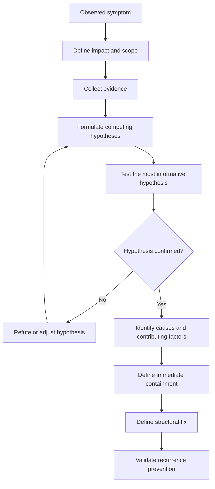
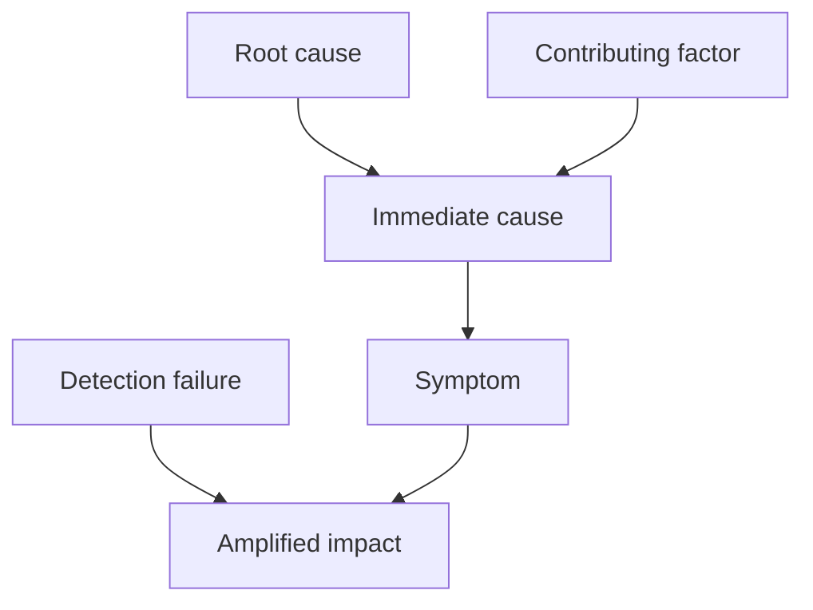
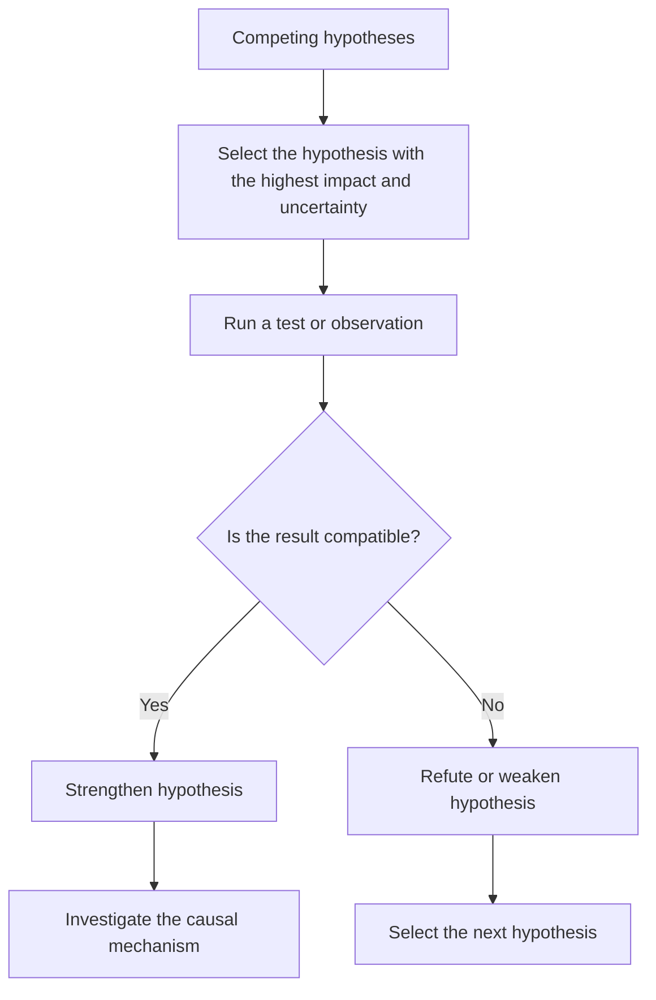
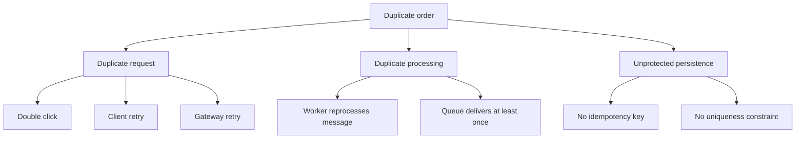
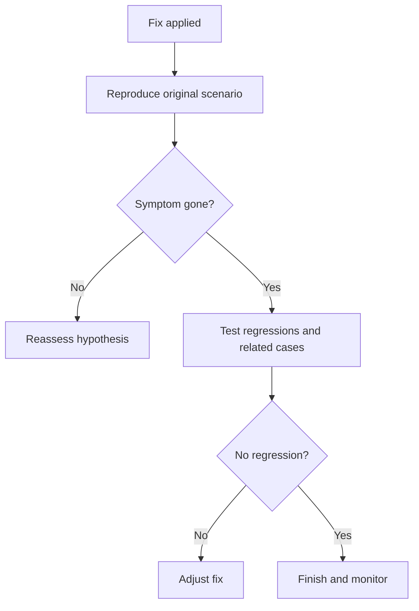

# Root Cause Analysis

## Purpose

Use Root Cause Analysis to identify why a problem occurred, which conditions allowed it to happen, and which fix reduces the chance of recurrence.

The technique must avoid superficial fixes that merely hide the symptom.

It is especially useful for:

```text
- Recurring bugs.
- Integration failures.
- Duplicate or inconsistent data.
- Intermittent errors.
- Slowness or performance degradation.
- Production incidents.
- Regressions after a deploy.
- Authentication, authorization, or permission failures.
- Problems involving queues, retries, cache, or concurrency.
- Behavior that differs between environments.
```

Root Cause Analysis does not mean hunting for a single perfect cause in every case.

Real problems can have:

```text
- An observable symptom.
- An immediate cause.
- One or more root causes.
- Contributing factors.
- Detection failures.
- Prevention gaps.
```

**Multiple or systemic** root causes are a first-class case, not an exception. When two or more structural conditions independently contribute to the symptom, treat each one as a root cause in its own right, with its own fix and its own prevention. Forcing a single cause when there are several is a modeling error (see Fault Tree Analysis and the anti-patterns below).

## Core principle

> Do not just fix the first thing that looks wrong. Confirm which mechanism produced the problem, which conditions allowed it to happen, and how to prevent recurrence.


```mermaid
flowchart TD
    A[Observed symptom] --> B[Define impact and scope]
    B --> C[Collect evidence]
    C --> D[Formulate competing hypotheses]
    D --> E[Test the most informative hypothesis]
    E --> F{Hypothesis confirmed?}

    F -- No --> G[Refute or adjust hypothesis]
    G --> D

    F -- Yes --> H[Identify causes and contributing factors]
    H --> I[Define immediate containment]
    I --> J[Define structural fix]
    J --> K[Validate recurrence prevention]
```

## When to use

Use Root Cause Analysis when:

```text
- The problem is recurring or has significant impact.
- The cause is not evident.
- There are multiple plausible hypotheses.
- A superficial fix has already failed before.
- The error occurs only in certain environments, times, data, or users.
- The problem involves concurrency, retries, cache, integrations, or shared state.
- There is risk of regression, data loss, security failure, or unavailability.
- The incident must produce a lasting fix, documentation, or prevention.
```

Good examples:

```text
- Orders are duplicated.
- Users get logged out at random.
- An endpoint became slow after a deploy.
- Uploaded files disappear in some cases.
- An integration works locally but fails in production.
- A job is processed twice.
- The frontend shows stale data.
```

Investigation effort must be proportional to risk and impact, per the effort budget defined in the [pelizzai-reasoning](../SKILL.md) skill.

## When to avoid

Do not use full Root Cause Analysis for simple, localized problems.

Avoid or scale down the technique when:

```text
- There is an explicit, reproducible error with an evident direct cause.
- The change is small, reversible, and without significant impact.
- A test, contract, or compiler already points clearly at the problem.
- Investigating would cost more than fixing and validating.
- The problem has no relevant recurrence, risk, or dependency.
```

Examples:

```text
- An import with a wrong path.
- A syntax error.
- A nonexistent variable clearly flagged by the compiler.
- Wrong text in an interface.
- A missing, easily identified local configuration.
```

## Relationship with other techniques

| Technique           | Responsibility                                                        |
| ------------------- | --------------------------------------------------------------------- |
| Root Cause Analysis | Investigates why a problem occurred and how to prevent recurrence     |
| ReAct               | Executes investigation actions and updates hypotheses                 |
| Assumption Tracking | Records hypotheses and premises not yet confirmed                     |
| Evidence Synthesis  | Combines logs, tests, code, documentation, and observations           |
| Decision Making     | Chooses between fix strategies when the paths are interdependent      |
| Verification        | Confirms or refutes the identified cause                              |
| Critique and Refine | Fixes the solution when validation reveals gaps                       |
| Plan and Execute    | Organizes investigation, containment, fix, and prevention             |

## Fundamental concepts

### Symptom

The visible behavior that reveals a problem.

```text
Examples:
- Users get a 500 error.
- An order appears twice.
- A screen stays loading.
- The API responds slowly.
- A file does not appear after upload.
```

The symptom is not necessarily the cause.

### Immediate cause

The technical mechanism directly responsible for the observed result.

```text
Example:
Symptom:
- Duplicate order.

Immediate cause:
- The endpoint persisted two identical requests.
```

The immediate cause may still not explain why the duplication was allowed.

### Root cause

A structural condition that, once fixed, reduces the probability of the problem recurring.

```text
Example:
Root cause:
- The endpoint has neither an idempotency key nor a uniqueness constraint to prevent duplicate persistence during retries.
```

A root cause must be backed by evidence, not picked by intuition. The same symptom can have more than one independent root cause; in that case, record them all.

### Contributing factor

A condition that increases the probability or impact of the problem but is not sufficient on its own to cause it.

```text
Examples:
- Double click on the button.
- Automatic client retry.
- Lack of monitoring.
- Short timeout.
- Stale cache.
- Missing regression test.
```

### Detection failure

The reason the problem was not noticed earlier or was not intercepted correctly.

```text
Examples:
- There was no alert for growing error rates.
- Tests did not cover the concurrent scenario.
- Logs lacked a correlation ID.
- The interface hid the backend error.
```

## Causal model

Use this structure to avoid conflating the problem's layers.

```text
Symptom:
- What was observed?

Impact:
- Who or what was affected?

Immediate cause:
- Which mechanism produced the error?

Root cause:
- Which structural failure allowed it to happen? (there can be more than one)

Contributing factors:
- Which conditions increased the likelihood or the impact?

Detection failure:
- Why was the problem not identified earlier?

Fix:
- What eliminates or reduces the root cause?

Prevention:
- What reduces probability, impact, or time to detection?
```


```mermaid
flowchart TD
    A[Root cause] --> B[Immediate cause]
    C[Contributing factor] --> B
    B --> D[Symptom]
    E[Detection failure] --> F[Amplified impact]
    D --> F
```

## Investigation process

### 1. Define the problem precisely

Start by describing the observable behavior, without assuming a cause.

```text
Bad:
"The button saves twice."

Better:
"Two orders are created when the save action is triggered twice within less than two seconds."
```

Record:

```text
- When it occurs.
- Where it occurs.
- Who is affected.
- Frequency.
- Impact.
- Environment.
- Related version or deploy.
- Required data or conditions.
- Evidence already available.
```

### 2. Bound scope and impact

Before investigating a cause, size the problem.

```text
Questions:
- Does the error affect all users or only some?
- Did the problem start after a specific change?
- Does it happen in production, staging, or locally?
- Is there a pattern by browser, device, region, tenant, or data type?
- Is there loss, duplication, exposure, or unavailability?
- Is the impact still active?
```

Do not investigate under the premise that every case has the same cause.

### 3. Contain before fixing

When there is risk of ongoing damage, prioritize reversible containment.

```text
Examples:
- Disable the feature via feature flag.
- Temporarily block the repeated action.
- Pause the faulty job.
- Reduce the processing rate.
- Roll back the deploy.
- Isolate the external integration.
- Prevent the destructive operation.
```

Containment does not replace a structural fix (see the table under "Fix, containment, and prevention").

### 4. Collect evidence before changing anything

Collect the minimum evidence needed to formulate useful hypotheses.

Common sources:

```text
- Logs and traces.
- Metrics and dashboards.
- Requests and responses.
- Automated tests.
- Code and the recent diff.
- Environment configuration.
- Queue events.
- Persisted data.
- Telemetry.
- User reports.
- Documentation and contracts.
```

Do not change code before preserving important evidence, especially in intermittent incidents or in production.

```text
Rule:
Keep what was directly observed separate from what is being inferred.
```

### 5. Build a timeline

A timeline helps locate the change, trigger, or causal sequence.

```text
Format:

T0:
- Last known-good behavior.

T1:
- Change, deploy, configuration, external event, or load increase.

T2:
- First observed symptom.

T3:
- Impact confirmed.

T4:
- Containment applied.

T5:
- Hypothesis validated or refuted.
```

Do not conclude that a recent change is the cause merely because it happened before the incident. Use it as an initial hypothesis.

### 6. Formulate competing hypotheses

Create hypotheses that explain the observed facts. Hypotheses are not mutually exclusive: more than one can be confirmed at the same time.

```text
Problem:
- Duplicate orders.

Hypotheses:
A. The interface sends two requests.
B. The client retries after a timeout.
C. The gateway repeats the request.
D. The backend is not idempotent.
E. The worker processes the message twice.
F. The database allows duplicates due to a missing constraint.
```

For each hypothesis, record:

```text
Hypothesis:
- [possible explanation]

Evidence for:
- [compatible facts]

Evidence against:
- [incompatible facts]

Test or observation:
- [smallest action that confirms or refutes it]

Expected result:
- [what should appear if it is true]

Discard criterion:
- [what makes it unlikely or false]

Impact:
- [what changes if it is confirmed]
```

## Hypothesis-driven investigation

Do not go looking for "everything".

Choose the next action by highest informational value.


```mermaid
flowchart TD
    A[Competing hypotheses] --> B[Select the hypothesis with the highest impact and uncertainty]
    B --> C[Run a test or observation]
    C --> D{Is the result compatible?}
    D -- Yes --> E[Strengthen hypothesis]
    D -- No --> F[Refute or weaken hypothesis]
    E --> G[Investigate the causal mechanism]
    F --> H[Select the next hypothesis]
```

Example:

```text
Hypothesis:
- The frontend sends a duplicate request.

Useful action:
- Inspect logs by request ID and timestamp.

Low-value action:
- Refactor the button before confirming duplicate requests.
```

## Investigation techniques

### 5 Whys

Use 5 Whys to go deeper along a simple causal chain, not as a mandatory ritual.

```text
Problem:
- Users get an error when generating a report.

Why?
- The worker fails when processing a large file.

Why?
- The whole file is loaded into memory.

Why?
- The implementation uses synchronous batch processing.

Why?
- There was no explicit requirement for a memory limit or streaming.

Why?
- The initial analysis did not consider the real data volume.

Possible root cause:
- Missing volume requirement and validation for report processing.
```

Limitations:

```text
- Does not work well for systems with multiple causes.
- Can induce artificial linear causality.
- Must not replace logs, tests, or real evidence.
```

### Fault Tree Analysis

Use a fault tree when a symptom can result from combinations of causes. It is the natural tool for multiple or systemic root causes.


```mermaid
flowchart TD
    A[Duplicate order] --> B[Duplicate request]
    A --> C[Duplicate processing]
    A --> D[Unprotected persistence]

    B --> E[Double click]
    B --> F[Client retry]
    B --> G[Gateway retry]

    C --> H[Worker reprocesses message]
    C --> I[Queue delivers at least once]

    D --> J[No idempotency key]
    D --> K[No uniqueness constraint]
```

Use when:

```text
- There are multiple causal paths.
- The system is distributed.
- There are retries, queues, cache, or concurrency.
- A failure depends on a combination of events.
```

### State comparison

Use when the problem occurs only in some environments, users, or data.

```text
Compare:

- Working environment versus failing environment.
- Successful request versus failing request.
- Affected user versus unaffected user.
- Valid data versus problematic data.
- Before versus after a deploy.
- Old configuration versus new configuration.
```

### Controlled reproduction

Whenever possible, turn a report into a reproducible scenario.

```text
A good reproduction defines:
- input;
- initial state;
- environment;
- sequence of actions;
- expected result;
- observed result;
- associated logs or evidence.
```

```text
Bad:
"It fails sometimes."

Better:
"After changing the filter on page 3 and clicking export, the API receives `page=3`, generates an empty file, and returns success."
```

## Identifying the root cause

A hypothesis should be treated as a root cause only when:

```text
[ ] It explains the observed symptom.
[ ] It is compatible with the available evidence.
[ ] It can be reproduced, observed, or tested.
[ ] Fixing it reduces the chance of recurrence.
[ ] It does not depend on a more fundamental cause not yet investigated.
[ ] It is not merely a secondary effect.
```

```text
Rule:
The root cause does not need to explain every possible problem.
It needs to explain the problem under investigation within the defined scope.
There can be more than one root cause; each must pass the same criteria.
```

## Structural fix

The fix must attack the confirmed mechanism, not merely hide the symptom. When there is more than one root cause, each one needs its own fix.

A good fix can combine layers:

```text
- Interface: prevents repeated action and improves feedback.
- API: applies idempotency and validates the contract.
- Database: structurally prevents duplicates.
- Worker: handles reprocessing idempotently.
- Observability: monitors duplicate attempts.
```

## Prevention and detection

After the fix, identify how to prevent or detect recurrence.

### Prevention

```text
- Regression test.
- Input validation.
- Idempotency.
- Database constraint.
- Retry with a safe policy.
- Concurrency control.
- Explicit contract.
- Feature flag.
- Resource limits.
- Architecture review.
```

### Detection

```text
- Structured logs.
- Correlation ID.
- Metrics.
- Alerts.
- Dashboards.
- Auditing.
- Health checks.
- Error-rate monitoring.
- Duplicate monitoring.
```

## Fix, containment, and prevention

| Type        | Goal                          | Example                                  |
| ----------- | ----------------------------- | ---------------------------------------- |
| Containment | Reduce impact now             | Disable the faulty feature               |
| Fix         | Eliminate the confirmed cause | Add idempotency to the endpoint          |
| Prevention  | Reduce future recurrence      | Add a retry test and a database rule     |
| Detection   | Discover the problem quickly  | Alert on duplicates above the threshold  |

Do not mistake containment for a definitive resolution.

## Validating the fix

A fix is not complete just because the symptom disappeared once.

Validate:

```text
[ ] The original scenario was reproduced before the fix, when possible.
[ ] The identified cause was tested or observed directly.
[ ] The fix prevents the original scenario.
[ ] Related cases did not regress.
[ ] Relevant contributing factors were addressed.
[ ] Regression tests were added or updated.
[ ] Monitoring or logs make recurrence detectable.
[ ] The solution respects contracts, constraints, and security.
```


```mermaid
flowchart TD
    A[Fix applied] --> B[Reproduce original scenario]
    B --> C{Symptom gone?}
    C -- No --> D[Reassess hypothesis]
    C -- Yes --> E[Test regressions and related cases]
    E --> F{No regression?}
    F -- No --> G[Adjust fix]
    F -- Yes --> H[Finish and monitor]
```

## Stopping rules

Stop the investigation when:

```text
- The root cause was confirmed with sufficient evidence.
- Containment is active or the impact has ceased.
- The structural fix was implemented and validated.
- Regression tests were added where applicable.
- Remaining risks were identified and communicated.
- No material competing hypothesis remains uninvestigated.
```

Declare the investigation inconclusive when:

```text
- There is not enough evidence.
- The problem cannot be reproduced.
- Logs, access, or context are insufficient.
- Relevant hypotheses remain equally plausible.
- The required action depends on another owner or an unavailable environment.
```

Do not invent a root cause to close an incident.

## Anti-patterns

### 1. Fixing the symptom

```text
Bad:
Add a delay to avoid duplicates.

Better:
Check retries, idempotency, uniqueness, and concurrent processing.
```

### 2. Picking the first plausible hypothesis

```text
Bad:
"It's a cache problem because the data is stale."

Better:
Compare API, cache, database, browser, and invalidation before concluding.
```

### 3. Mistaking correlation for causation

```text
Bad:
"The bug started after the deploy, so the deploy caused the bug."

Better:
"The deploy is a temporal hypothesis; compare the diff, metrics, and behavior before and after."
```

### 4. Ignoring contributing factors or additional root causes

```text
Bad:
Fix only the double click and close, even though another structural cause exists.

Better:
Also check retries, idempotency, the worker, and the database, addressing every confirmed root cause.
```

### 5. Not preserving evidence

```text
Bad:
Change logs and configuration before capturing requests, traces, and the current state.

Better:
Preserve relevant evidence before modifying the system.
```

### 6. Using 5 Whys mechanically

```text
Bad:
Force five questions onto a problem with parallel causes.

Better:
Use 5 Whys only when a plausible linear causal chain exists.
```

### 7. Declaring a root cause without validation

```text
Bad:
"The root cause is a missing test."

Better:
"A missing test is a prevention failure; the technical cause must explain how the incorrect behavior occurred."
```

### 8. Not adding prevention

```text
Bad:
Fix the bug without a test, monitoring, or process adjustment.

Better:
Add proportional mechanisms to prevent or detect recurrence.
```

## Examples

### Example 1 — Duplicate orders (two root causes)

```text
Symptom:
- Some orders are created twice.

Impact:
- Duplicate billing and operational inconsistency.

Hypotheses:
A. Double click in the interface.
B. Automatic client retry.
C. Endpoint without idempotency.
D. Worker reprocesses the message.
E. Database allows duplicates.

Evidence:
- Logs show close-together requests with the same payload.
- The endpoint receives no idempotency key.
- The database has no uniqueness constraint on the external identifier.

Immediate cause:
- Two identical requests persist two records.

Root causes (independent):
1. API without an idempotency key: accepts repeated requests as new ones.
2. Database without a uniqueness constraint: does not reject the second record.
   Each one alone already allows duplication; both need fixing.

Contributing factors:
- The interface allows repeated clicks.
- A network retry is not distinguished from a new submission.

Fix:
- Idempotency key in the API + uniqueness constraint in the database + duplicate-request test.

Prevention:
- Duplicate metric, logs with correlation ID, and a regression test.
```

### Example 2 — Slow endpoint

```text
Symptom:
- The search endpoint takes over 10 seconds to respond for some clients.

Hypotheses:
A. Query without an index.
B. N+1 queries.
C. Excessive serialization.
D. Slow external integration.
E. Ineffective cache.

Evidence to collect:
- Database time.
- Serialization time.
- Traces of external calls.
- Query execution plan.
- Volume of returned records.

Root cause:
- Should only be declared after measuring which component concentrates the latency.

Possible fix:
- Index, pagination, payload reduction, query batching, or a controlled timeout.

Rule:
- Do not add a cache before confirming the bottleneck.
```

### Example 3 — Inconclusive investigation

```text
Symptom:
- Some uploads disappear intermittently in production.

Impact:
- A few users per week; no clear tenant or region pattern.

Hypotheses:
A. Silent failure in the external storage.
B. Worker drops the event under load.
C. Race condition between the upload and the final move.

Available evidence:
- No correlation ID in the logs for the affected period.
- Storage log retention has already expired for the reported cases.
- Could not reproduce locally or in staging.

Status:
- INCONCLUSIVE. Hypotheses A, B, and C remain equally plausible;
  no evidence distinguishes between them.

Action taken (without inventing a root cause):
- Containment: acknowledge receipt to the user and add a manual reprocessing queue.
- Instrumentation: add a correlation ID and extend log retention.
- Reopen the investigation when the next case arrives with complete evidence.
```

## Record format

Use this format when recording an investigation:

```text
Problem:
- [observable symptom]

Impact and scope:
- [who, where, when, and how much was affected]

Confirmed evidence:
- [observed facts]

Hypotheses:
1. [hypothesis]
   - Evidence for:
   - Evidence against:
   - Validation:
   - Discard criterion:

Immediate cause:
- [confirmed mechanism]

Root cause:
- [confirmed structural failure(s) — list them all]

Contributing factors:
- [conditions that increased probability or impact]

Containment:
- [temporary action]

Fix:
- [structural change per root cause]

Prevention and detection:
- [tests, metrics, alerts, or controls]

Validation:
- [how to confirm recurrence was reduced]

Limitations:
- [what has not been confirmed yet]
```

## Reminders for the agent

```text
- Do not expose detailed chain of thought; communicate the problem, evidence, relevant hypotheses, confirmed cause(s), fix, prevention, and limitations.
- Treat multiple or systemic root causes as the normal case: list and fix them all.
- Do not mistake correlation for causation, nor a missing test for a technical root cause.
- Fix the confirmed mechanism, not just the symptom; add prevention and detection proportional to the risk.
- When the evidence is not enough, declare the investigation inconclusive instead of inventing a cause.
```

## Related techniques

- [ReAct](react.md)
- [Assumption Tracking](assumption-tracking.md)
- [Evidence Synthesis](evidence-synthesis.md)
- [Decision Making](decision-making.md)
- [Verification](verification.md)
- [Critique and Refine](critique-and-refine.md)
- [Plan and Execute](plan-and-execute.md)

Back to the [technique catalog](../SKILL.md).
