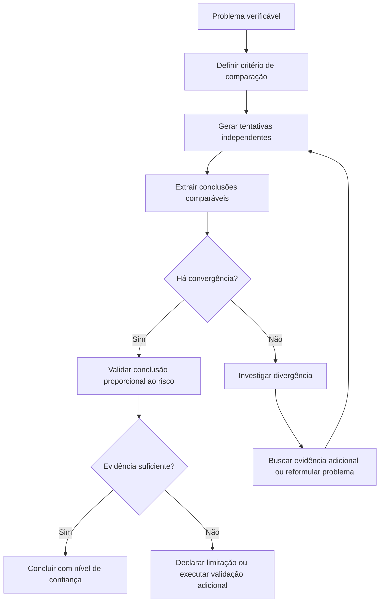
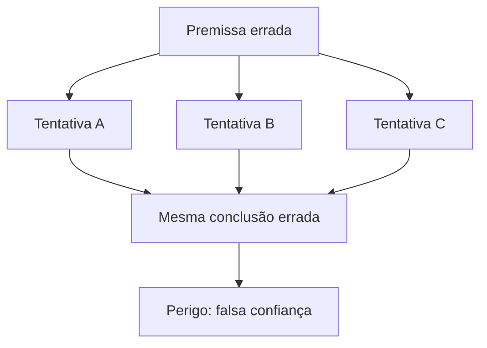

# Self-Consistency

Self-Consistency é técnica de APOIO (auxiliar): ela aumenta a confiança em uma conclusão, mas não a valida por si só. Para validação e roteamento, ela depende de [Verification](verification.md) e da skill [pelizzai-reasoning](../SKILL.md).

## Objetivo

Use Self-Consistency quando uma única tentativa pode ser insuficiente para produzir uma resposta confiável, mas múltiplas tentativas independentes podem revelar convergência, divergência ou fragilidade na solução.

A técnica consiste em:

1. definir uma pergunta ou decisão verificável;
2. gerar múltiplas tentativas independentes;
3. comparar resultados;
4. identificar convergência, divergência e lacunas;
5. validar a conclusão com evidências externas quando necessário;
6. selecionar, sintetizar ou declarar incerteza.

Self-Consistency não significa repetir a mesma resposta com palavras diferentes. Ela também não substitui testes, documentação, fontes oficiais, observação direta ou validação externa.

## Princípio central

> Concordância entre tentativas independentes aumenta confiança apenas quando as tentativas são realmente independentes, comparáveis e compatíveis com evidências externas.



## Quando usar e quando evitar

Use Self-Consistency somente quando houver benefício real em comparar múltiplas respostas independentes. Antes de aplicar, confirme as pré-condições; se alguma falhar, não use a técnica.

```text
Use quando (e somente quando todas valerem):
- A pergunta ou decisão é claramente definida e verificável.
- Existe critério objetivo para comparar respostas (concordar/divergir).
- Múltiplas tentativas podem ser produzidas de forma materialmente independente.
- A convergência entre tentativas terá valor prático.
- Há orçamento de custo e latência compatível.
- Existe forma de validar ou limitar a conclusão.

Casos típicos:
- Lógica, cálculo, classificação ou decisão com resposta comparável.
- Análise de múltiplas hipóteses concorrentes.
- Interpretação de requisito ambíguo com impacto relevante.
- Revisão de decisão arquitetural difícil de reverter.
- Avaliação de risco com critérios explícitos.
- Extração estruturada de informação de fontes complexas.
- Checagem de consistência de uma resposta crítica antes da entrega.
```

```text
Evite quando:
- Há uma única fonte de verdade direta (contrato, documentação oficial, teste).
- A resposta é simples, estável ou puramente criativa.
- As tentativas seriam apenas variações superficiais da mesma ideia.
- Não existe critério objetivo para comparar resultados.
- O custo de múltiplas tentativas supera o risco de errar.
- A tarefa exige ação imediata e reversível.
- O problema depende de informação externa ainda não consultada.
- As tentativas são inevitavelmente dependentes da mesma premissa.

Exemplos inadequados:
- Traduzir uma frase, renomear uma variável, corrigir erro de sintaxe simples.
- Consultar o valor de um campo em arquivo conhecido.
- Verificar se um endpoint existe quando o contrato está disponível.
- Reescrever um texto já aprovado.
```

## Relação com outras técnicas

| Técnica             | Responsabilidade                                                   |
| ------------------- | ------------------------------------------------------------------ |
| Tree of Thoughts    | Explora caminhos e alternativas em forma de busca estruturada      |
| Self-Consistency    | Compara múltiplas tentativas independentes para medir convergência |
| ReAct               | Executa ações, observa resultados e atualiza o estado              |
| Plan and Execute    | Organiza a estratégia e a sequência de execução                    |
| Verification        | Determina se a evidência é suficiente para confiar na conclusão    |
| Critique and Refine | Corrige falhas concretas após feedback ou validação                |

O roteamento entre técnicas pertence a skill [pelizzai-reasoning](../SKILL.md). Em resumo: use **Tree of Thoughts** quando é necessário explorar caminhos dependentes, com poda e backtracking; use **Self-Consistency** quando várias tentativas independentes podem responder à mesma pergunta e a convergência entre elas é informativa.

## Independência entre tentativas

Tentativas independentes devem diferir na estratégia, perspectiva, método ou ordem de análise. Não basta alterar a redação.

```text
Formas válidas de independência:
- Resolver por métodos diferentes.
- Avaliar com critérios distintos.
- Começar por hipóteses diferentes.
- Usar fontes independentes.
- Separar análise técnica, operacional e de risco.
- Comparar solução direta com solução conservadora.
- Executar cálculo por fórmula e por recomposição dos dados.
- Avaliar requisito a partir de contrato, código e comportamento observado.

Formas inválidas de independência:
- Repetir a mesma resposta com sinônimos.
- Usar a mesma fonte fraca em todas as tentativas.
- Reaproveitar a mesma conclusão sem reavaliar premissas.
- Gerar várias opções que dependem do mesmo erro de interpretação.
- Fazer múltiplas chamadas sem mudar método, critério ou evidência.
```

## Estrutura e formato de uma rodada

Cada rodada usa o template canônico abaixo. Preencha o método de cada tentativa de forma materialmente distinta; normalize tudo em conclusão, premissas, evidências e limitações para que a comparação não vire impressão subjetiva.

```text
Pergunta:
- [afirmação, cálculo ou decisão sendo avaliada]

Critério de comparação:
- [o que significa concordar ou divergir]

Tentativa A / B / C:
- Método:
- Conclusão:
- Premissas:
- Evidências:
- Limitações:

Agregação:
- Convergência:
- Divergências (e quais são materiais):
- Risco de falsa convergência:

Validação externa:
- [teste, fonte, contrato ou observação necessária]

Conclusão:
- [confirmado, provável, inconclusivo ou bloqueado]
```

## Número de tentativas

Use poucas tentativas de alta qualidade, proporcionais ao risco (ver "orçamento de esforço" na skill [pelizzai-reasoning](../SKILL.md)).

```text
- Baixo: 2 tentativas independentes.
- Médio: 2 a 3 tentativas.
- Alto: 3 tentativas, com validação externa.
- Crítico: múltiplas tentativas + fonte primária + revisão independente quando possível.
```

Não aumente o número de tentativas apenas para buscar maioria artificial. Gerar 10 respostas semelhantes e contar a mais frequente é pior do que gerar 2 ou 3 abordagens realmente independentes e investigar as divergências relevantes.

## Formas de agregação

### 1. Convergência direta

Use quando as tentativas chegam à mesma conclusão por caminhos independentes.

```text
Tentativa A:
- O problema está no contrato do payload.

Tentativa B:
- A comparação entre schema e request aponta campo incompatível.

Tentativa C:
- O teste de integração falha apenas quando o campo usa o nome antigo.

Agregação:
- Convergência forte para incompatibilidade de contrato.
```

A convergência aumenta confiança, mas não substitui validação.

### 2. Convergência parcial

Use quando as tentativas concordam no ponto principal, mas divergem em detalhes.

```text
Tentativa A:
- Recomenda fila assíncrona.

Tentativa B:
- Recomenda fila assíncrona, mas com polling.

Tentativa C:
- Recomenda fila assíncrona, mas com notificação.

Agregação:
- Há convergência sobre processamento assíncrono.
- A estratégia de retorno ao usuário ainda precisa de decisão adicional.
```

### 3. Divergência explicável

Use quando as conclusões diferem porque adotam premissas diferentes.

```text
Tentativa A:
- Prefere solução simples porque o volume é baixo.

Tentativa B:
- Prefere solução distribuída assumindo crescimento elevado.

Agregação:
- A decisão depende da projeção de carga.
- A próxima ação é validar o volume atual e esperado.
```

Não trate divergência como falha automática. Ela pode revelar requisito ou premissa ausente.

### 4. Divergência crítica

Use quando as tentativas chegam a conclusões incompatíveis e não há evidência suficiente para escolher.

```text
Tentativa A:
- A alteração é retrocompatível.

Tentativa B:
- A alteração quebra clientes que não enviam o novo campo.

Agregação:
- Divergência crítica.
- Não concluir até revisar o contrato, os clientes existentes e os testes de compatibilidade.
```

## Avaliação de convergência

A convergência deve ser avaliada por conteúdo e evidência, não por palavras iguais.

```text
Perguntas:
- As tentativas chegaram à mesma conclusão?
- Usaram premissas independentes?
- As evidências são compatíveis?
- A concordância cobre o requisito principal?
- Há alguma exceção relevante?
- A divergência afeta a decisão final?
```

| Resultado              | Interpretação                                                 |
| ---------------------- | ------------------------------------------------------------- |
| Convergência forte     | Métodos independentes sustentam a mesma conclusão             |
| Convergência parcial   | Há acordo no núcleo, mas detalhes permanecem em aberto        |
| Divergência explicável | Premissas diferentes produzem resultados diferentes           |
| Divergência crítica    | Não é seguro concluir sem nova evidência                      |
| Falsa convergência     | Todas as tentativas dependem da mesma fonte, hipótese ou erro |

## Convergência, risco e estado de triagem

Self-Consistency é **auxiliar**: ela produz um estado **intermediário de triagem**, nunca o veredito final — o status FINAL de qualquer conclusão pertence à [Verification](verification.md) (e usa o vocabulário canônico dela). O resultado da agregação, combinado ao nível de risco/impacto — Baixo/Médio/Alto/Crítico, ver "orçamento de esforço" na skill [pelizzai-reasoning](../SKILL.md) — determina a triagem e o handoff:

| Convergência       | Risco        | Validação externa   | Triagem (intermediária) | Handoff                                                                                                  |
| ------------------ | ------------ | ------------------- | ----------------------- | -------------------------------------------------------------------------------------------------------- |
| Forte              | Baixo/Médio  | —                   | Forte candidata         | [Verification](verification.md) proporcional (leve) e concluir                                          |
| Forte              | Alto/Crítico | obtida e compatível | Forte candidata         | [Verification](verification.md) completa antes de concluir                                               |
| Forte              | Alto/Crítico | ausente             | Sob suspeita            | obrigatório: obter validação via [Verification](verification.md)                                         |
| Parcial            | qualquer     | —                   | Sob suspeita            | decidir detalhes em aberto; validar com [Verification](verification.md)                                  |
| Explicável         | qualquer     | —                   | Inconclusiva            | validar a premissa que separa os resultados; ver [Evidence Synthesis](evidence-synthesis.md)             |
| Crítica            | Alto/Crítico | —                   | Bloqueada               | não concluir; escalar para [Verification](verification.md) e [Evidence Synthesis](evidence-synthesis.md) |
| Falsa convergência | qualquer     | —                   | Bloqueada               | refazer com métodos/fontes independentes; ver [Evidence Synthesis](evidence-synthesis.md)                |

Regra de parada: pare a agregação quando a triagem estabilizar (novas tentativas não agregam informação) e faça o handoff da linha correspondente — nenhuma linha conclui sem passar pela Verification proporcional ao risco. Em Bloqueada, interrompa a agregação e faça o handoff explícito.

## Falsa convergência

Falsa convergência ocorre quando várias tentativas parecem concordar, mas compartilham a mesma premissa incorreta.

```text
Exemplos:
- Todas as respostas usam documentação desatualizada.
- Todas assumem o mesmo requisito que nunca foi confirmado.
- Todas repetem a mesma resposta anterior.
- Todas dependem de um exemplo incorreto.
- Todas ignoram uma restrição crítica do projeto.
```



```text
Como reduzir falsa convergência:
- Variar métodos, fontes ou perspectivas.
- Verificar premissas críticas antes de agregar resultados.
- Usar fontes independentes quando a tarefa for factual.
- Procurar contraexemplos.
- Aplicar Verification antes de concluir.
- Não tratar maioria como verdade quando todas as tentativas compartilham a mesma base.
```

## Processo operacional

### 1. Definir uma pergunta verificável

Evite perguntas vagas.

```text
Ruim:
"Qual é a melhor arquitetura?"

Melhor:
"Qual arquitetura atende a processamento assíncrono, uso de infraestrutura existente, prazo curto e necessidade de rastrear status de execução?"
```

### 2. Definir o que será comparado

```text
- Resultado numérico.
- Diagnóstico provável.
- Estratégia recomendada.
- Conjunto de requisitos atendidos.
- Campos extraídos de um documento.
- Riscos identificados.
- Compatibilidade com um contrato.
```

### 3. Gerar tentativas independentes

Cada tentativa deve usar abordagem distinta.

```text
Exemplo de diagnóstico:
Tentativa A: partir de logs e eventos observados.
Tentativa B: partir do contrato e do fluxo de dados.
Tentativa C: partir de hipóteses de concorrência e persistência.

Exemplo de cálculo:
Tentativa A: recalcular pela fórmula principal.
Tentativa B: reconstituir o resultado pela soma dos componentes.
Tentativa C: conferir por método alternativo ou ferramenta de cálculo.
```

### 4. Normalizar resultados

Converta cada tentativa no formato do template canônico (conclusão, premissas, evidências, limitações). Sem normalização, a comparação vira impressão subjetiva.

### 5. Agregar e investigar divergências

Não escolha automaticamente a maioria.

```text
Ruim:
"Duas tentativas disseram A, então A é correto."

Melhor:
"Duas tentativas sustentam A por métodos diferentes; a terceira depende de uma premissa que foi refutada pelo contrato atual."
```

Quando houver divergência:

```text
1. Identifique a premissa que separa os resultados.
2. Escolha a menor ação que valide essa premissa.
3. Atualize as tentativas afetadas.
4. Agregue novamente.
5. Declare incerteza se a divergência não puder ser resolvida.
```

Para reconciliar tentativas e evidências conflitantes, use [Evidence Synthesis](evidence-synthesis.md).

### 6. Validar externamente

Self-Consistency aumenta confiança, mas não cria evidência externa. Sempre que houver risco material, use [Verification](verification.md) para validar a conclusão por teste, execução controlada, contrato, documentação oficial, fonte primária, dado real, revisão de diff, log ou cálculo reproduzível.

## Aplicações recomendadas

### 1. Diagnóstico de bugs

```text
Pergunta:
- Qual causa explica melhor a falha observada?

Tentativa A:
- Analisar logs e erros.

Tentativa B:
- Seguir fluxo de dados e contratos.

Tentativa C:
- Avaliar concorrência, cache ou estado compartilhado.

Agregação:
- Priorizar hipótese compatível com mais evidências.

Validação:
- Criar teste reproduzível ou executar experimento controlado.
```

### 2. Decisões de arquitetura

```text
Pergunta:
- Qual solução atende melhor aos requisitos e restrições?

Tentativa A:
- Perspectiva de simplicidade e prazo.

Tentativa B:
- Perspectiva de escala e resiliência.

Tentativa C:
- Perspectiva de manutenção, custo e operação.

Agregação:
- Identificar opção robusta para o contexto atual.

Validação:
- Confirmar requisitos críticos, infraestrutura disponível e limitações reais.
```

### 3. Cálculos e reconciliação de dados

```text
Pergunta:
- O total está correto?

Tentativa A:
- Somar valores de origem.

Tentativa B:
- Recalcular pela fórmula de negócio.

Tentativa C:
- Conferir por agrupamento ou fonte independente.

Agregação:
- Identificar divergências por arredondamento, filtro ou duplicidade.

Validação:
- Confirmar entradas, unidades e regras aplicadas.
```

## Anti-padrões

```text
1. Maioria sem independência.
   Ruim: três respostas repetem a mesma hipótese não verificada.
   Melhor: verificar se cada resposta usa premissas, fontes ou métodos realmente diferentes.

2. Tentar substituir evidência externa.
   Ruim: "Três tentativas concordaram, então a API suporta esse recurso."
   Melhor: "Suporte provável; confirmar na documentação oficial ou em chamada controlada."

3. Rodadas demais.
   Ruim: gerar respostas indefinidamente até aparecer a desejada.
   Melhor: definir orçamento de tentativas e investigar divergência com evidência.

4. Comparar respostas não normalizadas.
   Ruim: comparar parágrafos longos e vagos por impressão geral.
   Melhor: extrair conclusão, premissas, evidências e limitações de cada tentativa.

5. Ignorar divergência minoritária.
   Ruim: descartar uma resposta diferente apenas por ser minoritária.
   Melhor: verificar se a divergência revela condição limite, requisito ausente ou risco relevante.

6. Usar para tarefas triviais.
   Ruim: gerar três formas de responder uma pergunta simples.
   Melhor: responder diretamente quando uma única execução confiável é suficiente.

7. Confundir consistência com verdade.
   Ruim: "Todas as respostas concordam, logo está certo."
   Melhor: "A convergência aumenta confiança, mas a conclusão depende da qualidade das premissas e da validação externa."
```

## Instrução resumida para o agente

```text
- Trate Self-Consistency como apoio: ela aumenta confiança, não valida sozinha.
- Compare conteúdo e evidência, não palavras nem maioria; investigue a premissa que explica divergências materiais.
- Mapeie convergência + risco para o estado final (Confirmado/Provável/Inconclusivo/Bloqueado) e faça o handoff: Verification para validar, Evidence Synthesis para conflitos.
- Não exponha cadeia de pensamento detalhada; comunique apenas métodos, conclusões, evidências, divergências, limitações e decisão final.
```

## Técnicas relacionadas

- [Tree of Thoughts](tree-of-thoughts.md)
- [Verification](verification.md)
- [ReAct](react.md)
- [Plan and Execute](plan-and-execute.md)
- [Critique and Refine](critique-and-refine.md)
- [Evidence Synthesis](evidence-synthesis.md)

Voltar a skill [pelizzai-reasoning](../SKILL.md).
