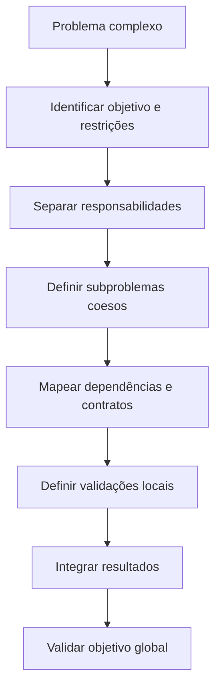
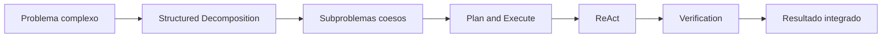
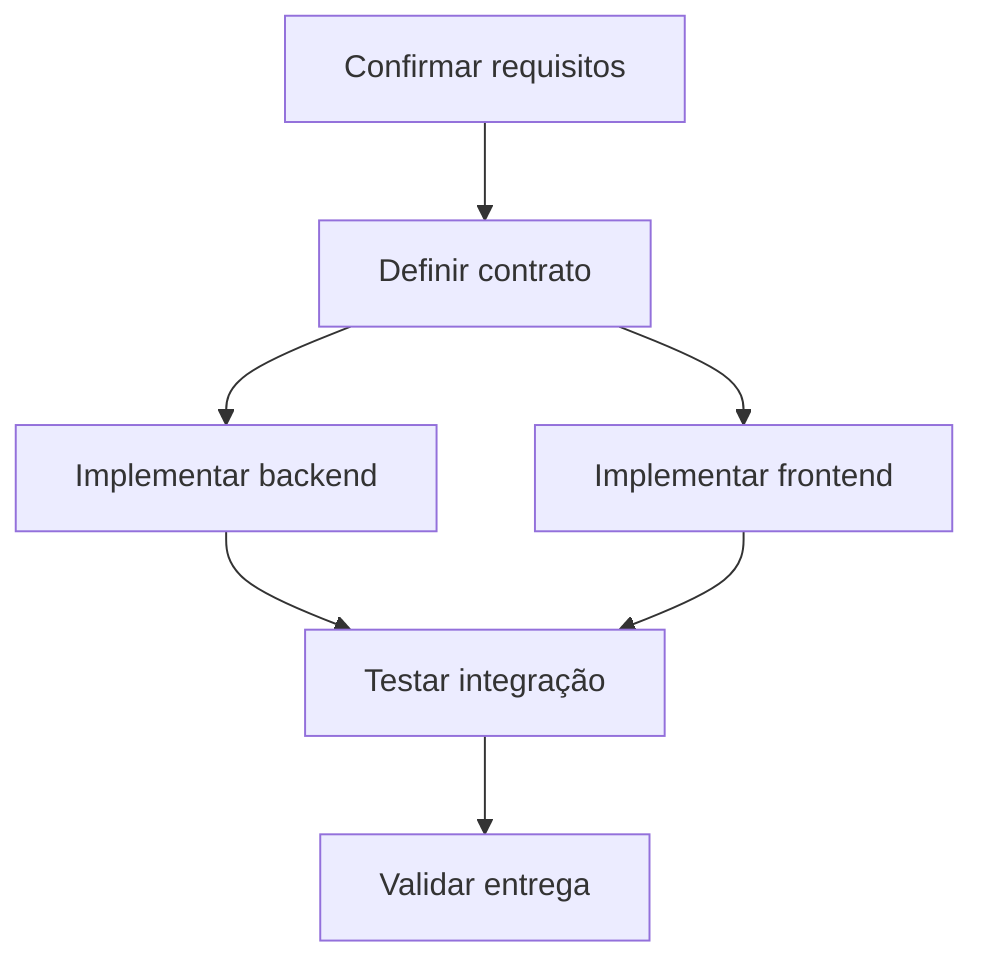
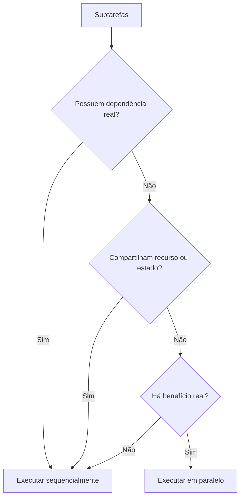
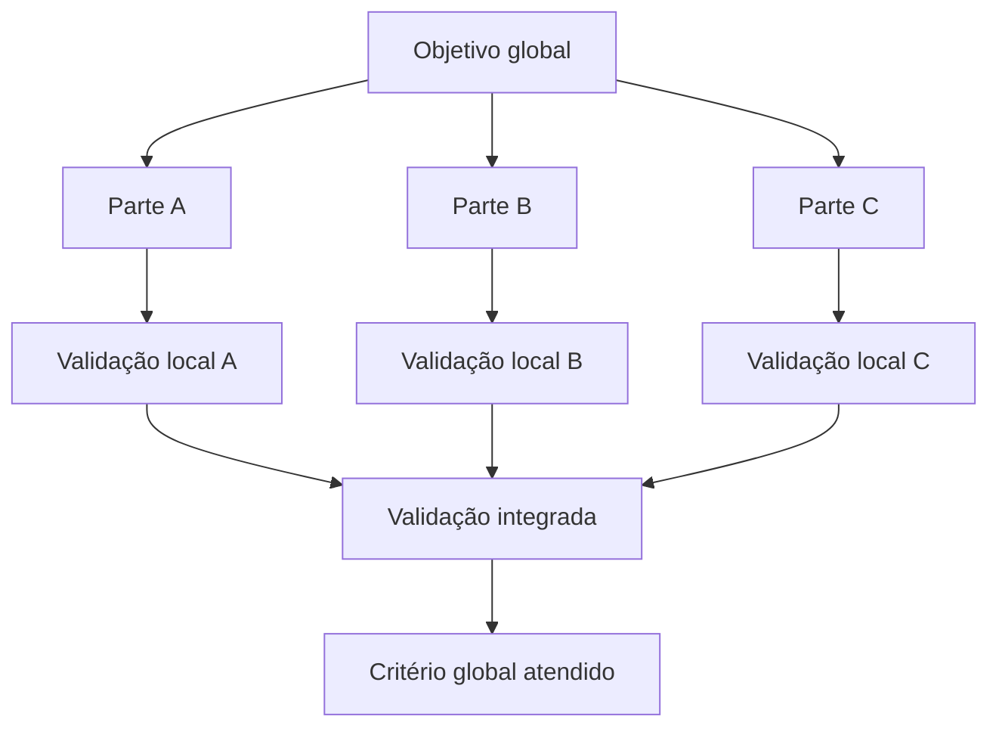

# Structured Decomposition

## Objetivo

Use Structured Decomposition para transformar um problema complexo em partes menores que possam ser entendidas, investigadas, implementadas, validadas e integradas com segurança.

A técnica evita dois extremos:

```text
Subdecomposição:
- Tratar um problema grande como uma única tarefa vaga.
- Misturar responsabilidades, riscos e decisões incompatíveis.
- Implementar antes de entender partes essenciais do problema.

Sobredecomposição:
- Criar microtarefas artificiais.
- Dividir trabalho que precisa permanecer coeso.
- Aumentar coordenação, contexto e custo sem ganho real.
```

A decomposição deve produzir uma estrutura operacional clara: componentes, responsabilidades, dependências, contratos, riscos, validações e integração. Não exige expor cadeia de pensamento detalhada.

## Princípio central

> Divida o problema nas menores partes que possam ser compreendidas, verificadas e integradas sem perder o contexto necessário.

Uma boa decomposição preserva o objetivo global.



## Quando usar

Use Structured Decomposition quando a tarefa envolver:

```text
- Múltiplas responsabilidades ou componentes.
- Requisitos técnicos, funcionais e operacionais misturados.
- Frontend, backend, banco, integrações ou infraestrutura.
- Arquivos ou documentos extensos com múltiplos tópicos.
- Sistemas com fluxos, estados e dependências.
- Refatoração de módulos grandes ou acoplados.
- Análise de problema com várias causas possíveis.
- Decisão que envolve diferentes dimensões: segurança, custo, prazo, compatibilidade e manutenção.
- Tarefa grande demais para ser validada como uma única unidade.
- Necessidade de delegar, paralelizar ou organizar subtarefas.
```

Os mesmos gatilhos servem de exemplos adequados: autenticação com login/sessão/autorização/OAuth, funcionalidade que cruza interface/API/banco/notificações, refatoração de componente grande, análise documental, migração de banco, diagnóstico distribuído, transformação de requisitos vagos em entregáveis.

## Quando evitar

Não use Structured Decomposition como ritual automático. Evite ou simplifique quando:

```text
- Há uma única ação clara e local.
- A tarefa é pequena, reversível e facilmente verificável.
- O problema não possui dependências relevantes.
- O usuário pediu tradução, reescrita, resumo ou ajuste pontual.
- A decomposição criaria mais coordenação do que valor.
- A resposta depende apenas de consulta direta a uma fonte conhecida.
```

Exemplos inadequados: corrigir erro de sintaxe, renomear variável, traduzir uma frase, ajustar o texto de um botão, consultar a assinatura de uma função documentada.

## Relação com outras técnicas

| Técnica                  | Responsabilidade                                              |
| ------------------------ | ------------------------------------------------------------- |
| Structured Decomposition | Divide o problema em partes coesas, dependências e contratos  |
| Plan and Execute         | Organiza a ordem de execução das partes                       |
| ReAct                    | Decide a próxima ação dentro de uma parte                     |
| Verification             | Define como validar cada parte e o resultado integrado        |
| Critique and Refine      | Corrige partes que apresentam falhas ou lacunas               |
| Decision Making          | Escolhe entre abordagens, inclusive caminhos interdependentes com poda |



### Divisão de papéis com Plan and Execute

Use Structured Decomposition para responder:

```text
- Quais partes existem?
- Quais responsabilidades pertencem a cada parte?
- Quais partes dependem umas das outras?
- Quais contratos conectam essas partes?
- Como cada parte será validada?
- Como confirmar que a integração atende ao objetivo global?
```

Use [Plan and Execute](plan-and-execute.md) para responder:

```text
- Em qual ordem essas partes devem ser executadas?
- Quais etapas podem ocorrer em paralelo?
- Onde devem existir checkpoints?
- Quando é necessário replanejar?
```

## Modelo de decomposição

Antes de dividir, defina o problema de forma mínima.

```text
Objetivo:
- Qual resultado final precisa existir?

Escopo:
- O que está incluído?
- O que está explicitamente fora?

Entradas:
- Quais dados, arquivos, eventos, requisitos ou dependências existem?

Saídas:
- Quais entregáveis, decisões, mudanças ou comportamentos devem existir?

Restrições:
- Stack, segurança, prazo, compatibilidade, orçamento, permissões e convenções.

Riscos:
- O que pode falhar, gerar regressão, expor dados ou aumentar custo?

Critério de conclusão:
- Como saber que o problema foi resolvido?
```

Não decomponha um objetivo vago sem antes torná-lo minimamente verificável.

```text
Ruim:
"Melhorar a autenticação."

Melhor:
"Permitir login por e-mail e Google OAuth, proteger rotas por perfil, renovar sessão conforme a política definida e registrar falhas sem expor tokens."
```

### Reenquadrar antes de decompor (step-back)

Quando o problema tiver alta incerteza ou estiver formulado de modo enviesado, dê um passo atrás e reenquadre antes de dividir. Decompor um enquadramento errado apenas multiplica o erro em subproblemas.

```text
- Qual é o problema real por trás do pedido?
- O enunciado já assume uma solução? Qual premissa está embutida?
- Existe um nível de abstração superior em que o problema fica mais simples?
- Que pergunta, se respondida, dissolveria boa parte da complexidade?
```

Para problemas de alta incerteza ou diagnóstico, combine com [Root Cause Analysis](root-cause-analysis.md) e registre premissas com [Assumption Tracking](assumption-tracking.md) antes de partir para a execução.

## Unidade correta de decomposição

Uma parte deve ter responsabilidade clara, resultado observável e limite suficiente para ser validada.

```text
Uma boa unidade de decomposição:
- possui objetivo próprio;
- tem entradas e saídas identificáveis;
- pode ser validada isoladamente;
- tem dependências explícitas;
- reduz incerteza ou trabalho real;
- não mistura responsabilidades incompatíveis.

Uma unidade ruim:
- é vaga demais;
- depende de tudo;
- não possui critério de conclusão;
- apenas repete o nome do objetivo maior;
- existe somente para aumentar a quantidade de etapas.
```

Exemplo:

```text
Ruim:
1. Fazer backend.
2. Fazer frontend.
3. Testar tudo.

Melhor:
1. Confirmar contrato de criação de pedido.
2. Implementar validação e persistência do pedido.
3. Implementar retorno de erros previsíveis.
4. Integrar formulário à rota.
5. Validar fluxo de sucesso, erro e duplicidade.
```

### Decomposição recursiva e quando parar

Se um subproblema continuar complexo, aplique a mesma decomposição sobre ele — recursivamente. Mas cada nível de profundidade adiciona coordenação, então pare de decompor assim que a parte atual satisfizer todos os critérios abaixo:

```text
Pare de decompor quando a parte:
- tem critério de conclusão claro e verificável;
- pode ser validada isoladamente;
- tem responsabilidade única e dependências explícitas;
- pode ser implementada/investigada sem dividir de novo para ser entendida;
- cabe no orçamento de esforço previsto (ver o catálogo em ../SKILL.md).

Continue decompondo apenas enquanto pelo menos um desses critérios falhar.
```

Decompor além desse ponto é sobredecomposição: gera microtarefas cujo custo de coordenação supera o trabalho.

## Tipos de decomposição

### 1. Por responsabilidade

Use quando diferentes partes possuem finalidades distintas.

```text
Problema:
Implementar autenticação.

Responsabilidades:
- Cadastro e identidade do usuário.
- Login e validação de credenciais.
- Emissão e renovação de sessão.
- Autorização por papel ou permissão.
- Logout e revogação.
- Auditoria e tratamento de falhas.
```

Não misture todas essas responsabilidades em uma única tarefa ou módulo sem necessidade.

### 2. Por fluxo

Use quando o problema é orientado a etapas de negócio ou usuário.

```text
Fluxo:
Exportar relatório.

Partes:
1. Usuário solicita exportação.
2. Sistema valida permissão e filtros.
3. Job é criado.
4. Worker gera o arquivo.
5. Arquivo é armazenado.
6. Usuário recebe status ou notificação.
7. Download é autorizado.
```

Cada parte deve ser clara o suficiente para identificar falhas e validações.

### 3. Por camada

Use quando o sistema já possui arquitetura em camadas bem definida.

```text
Feature:
Adicionar filtro por status.

Camadas:
- Interface: seletor de status e atualização de estado.
- Aplicação: composição de query params.
- API: validação e aplicação do filtro.
- Persistência: consulta com condição adequada.
- Testes: comportamento local e integrado.
```

Não force decomposição por camada quando ela piorar a coesão.

### 4. Por risco

Use quando partes diferentes possuem riscos muito distintos.

```text
Exemplo:
Migração de banco.

Partes:
- Alteração de schema.
- Compatibilidade com aplicação atual.
- Migração de dados existentes.
- Backfill.
- Performance de consultas.
- Rollback.
- Monitoramento após deploy.
```

A decomposição por risco impede tratar migração como simples alteração de tabela.

### 5. Por incerteza

Use quando o problema ainda não está suficientemente compreendido. Para diagnóstico de causa, veja [Root Cause Analysis](root-cause-analysis.md).

```text
Exemplo:
"O sistema está lento."

Subproblemas:
- A lentidão ocorre no frontend, API, banco ou integração externa?
- A lentidão é constante ou depende de volume?
- Há regressão recente?
- Há gargalo de CPU, I/O, consulta, serialização ou rede?
- Existe métrica ou log para validar cada hipótese?
```

Nesse caso, não implemente melhorias antes de separar descoberta de execução.

### 6. Por entregável

Use quando o objetivo exige artefatos distintos.

```text
Exemplo:
Criar integração com serviço externo.

Entregáveis:
- Cliente autenticado.
- Contratos de request e response.
- Tratamento de erro.
- Observabilidade.
- Testes.
- Documentação de configuração.
```

Útil quando os resultados precisam ser entregues, revisados ou testados separadamente.

## Como decompor

### 1. Identificar o núcleo do problema

Pergunte:

```text
- Qual é o resultado principal?
- Qual parte é obrigatória para considerar a tarefa concluída?
- Quais resultados são secundários?
- Quais restrições não podem ser violadas?
```

Exemplo:

```text
Tarefa:
"Adicionar pagamento recorrente."

Núcleo:
- Cobrar corretamente em periodicidade definida.
- Registrar estado e resultado das cobranças.
- Impedir duplicidade.
- Tratar falhas e cancelamentos.

Secundário:
- Dashboard detalhado.
- Histórico avançado.
- Notificações adicionais.
```

Não permita que funcionalidades secundárias escondam o objetivo principal.

### 2. Identificar responsabilidades

Separe atividades que têm razões diferentes para mudar.

```text
Ruim:
"Serviço de pagamento que valida entrada, calcula preço, cobra cartão,
atualiza assinatura, envia e-mail e gera relatório."

Melhor:
- Validação de requisição.
- Cálculo e regras de preço.
- Cobrança via provedor.
- Atualização de assinatura.
- Notificação.
- Auditoria e relatórios.
```

Essa regra não exige uma classe ou serviço para cada responsabilidade. Exige apenas que responsabilidades distintas sejam reconhecidas e não sejam acopladas sem necessidade.

### 3. Identificar entradas, saídas e contratos

Para cada parte, defina:

```text
Entrada:
- Dados, eventos, parâmetros ou recursos necessários.

Saída:
- Resultado produzido, estado alterado, resposta ou artefato.

Contrato:
- Formato, invariantes, permissões, erros e comportamentos esperados.

Dependências:
- Serviços, dados, etapas ou decisões necessárias.

Validação:
- Como confirmar que a parte funciona.
```

Quando os contratos e requisitos não funcionais virarem o eixo do problema, trate-os com [Constraint Satisfaction](constraint-satisfaction.md).

Exemplo:

```text
Parte:
Criar pedido.

Entrada:
- Itens, cliente, endereço, método de pagamento.

Saída:
- Pedido persistido com identificador e estado inicial.

Contrato:
- Itens precisam existir.
- Quantidades precisam ser positivas.
- Usuário deve possuir permissão.
- Erros devem seguir formato padronizado.

Dependências:
- Catálogo, estoque, pagamento e banco.

Validação:
- Teste de sucesso, erro de estoque, pagamento recusado e duplicidade.
```

### 4. Mapear dependências

Diferencie dependência real de preferência de ordem.



Uma dependência é real quando:

```text
- Uma parte precisa da saída da outra.
- Uma decisão precisa ser tomada antes.
- Ambas alteram o mesmo recurso compartilhado.
- Uma parte define contrato usado pela outra.
- A execução em ordem errada gera retrabalho ou risco.
```

Não crie dependência apenas porque uma etapa "parece vir antes".

### 5. Definir fronteiras de integração

Partes independentes precisam de interfaces claras.

```text
Uma fronteira de integração deve explicitar:
- dados trocados;
- formato;
- responsabilidade de cada lado;
- tratamento de erro;
- autenticação e autorização;
- sincronismo ou assincronismo;
- idempotência, quando aplicável;
- observabilidade;
- compatibilidade.
```

Exemplo:

```text
Frontend <-> API

Entrada:
GET /orders?status=active&page=1

Saída:
{
  "items": [...],
  "page": 1,
  "page_size": 20,
  "total": 75
}

Erros:
- 400 para filtro inválido.
- 401 para ausência de autenticação.
- 403 para ausência de permissão.

Validação:
- Testes de contrato e fluxo de interface.
```

## Granularidade

### Sinais de que a parte está grande demais

```text
- Possui múltiplas responsabilidades independentes.
- Não é possível escrever critério de conclusão claro.
- A falha pode ocorrer em muitas causas diferentes.
- Exige muitos arquivos ou sistemas sem fronteira definida.
- Não pode ser validada sem validar todo o sistema.
- Mistura descoberta, decisão, implementação e validação.
```

### Sinais de que a parte está pequena demais

```text
- Não produz resultado útil isoladamente.
- Só existe porque uma etapa foi quebrada artificialmente.
- Possui custo de coordenação maior que o trabalho.
- Não pode ser validada separadamente.
- Apenas repete uma microação mecânica.
- Precisa sempre ocorrer junto de outra parte.
```

Parte grande demais: dividir por responsabilidade, risco ou contrato. Parte pequena demais: reagrupar por objetivo ou validação.

## Decomposição e paralelismo

A decomposição pode revelar subtarefas paralelizáveis, mas não obriga paralelismo. Paralelize apenas quando as partes forem independentes.

```text
Critérios:
- Não alteram o mesmo recurso.
- Não dependem da saída uma da outra.
- Não compartilham estado mutável crítico.
- Os resultados podem ser interpretados separadamente.
- Há ganho real em executar simultaneamente.
```



Exemplo seguro (paralelizável):

```text
- Ler documentação oficial da API.
- Inspecionar convenções de componentes existentes.
- Revisar testes relacionados.
```

Exemplo inseguro (exige ordem e checkpoint):

```text
- Alterar schema de banco.
- Alterar código que depende do schema novo.
- Executar migração.
```

## Decomposição orientada à validação

Cada subproblema deve ter validação local e contribuição para validação global.



Exemplo:

```text
Objetivo:
Permitir exportação de CSV.

Validação local:
- Permissão de exportação funciona.
- Filtros são propagados.
- Arquivo é gerado.
- Download é autorizado.

Validação integrada:
- Usuário permitido exporta dados filtrados.
- Usuário sem permissão não exporta.
- Arquivo possui os dados esperados.
```

Não assuma que validar partes isoladas prova o comportamento integrado.

## Descoberta versus execução

Problemas com incerteza material devem ser divididos em dois grupos. Registre as premissas pendentes com [Assumption Tracking](assumption-tracking.md).

```text
Descoberta:
- Confirmar requisitos.
- Inspecionar contratos.
- Reproduzir bugs.
- Mapear arquitetura.
- Identificar dependências.
- Validar premissas.

Execução:
- Alterar código.
- Criar testes.
- Atualizar configuração.
- Implementar migração.
- Atualizar documentação.
```


Não trate descoberta como atraso. Ela reduz retrabalho quando premissas são incertas.

## Fechar lacunas de integração

Depois de decompor, valide se a soma das partes resolve o objetivo.

```text
Perguntas:
- Todas as responsabilidades necessárias foram cobertas?
- Existe lacuna entre duas partes?
- Há responsabilidade duplicada?
- Os contratos são compatíveis?
- A ordem de execução respeita dependências?
- As validações locais cobrem o objetivo global?
- Há comportamento não tratado entre as fronteiras?
- Alguma parte depende de premissa ainda não confirmada?
```

Exemplo de lacuna comum:

```text
Problema:
Implementar upload de arquivo.

Partes criadas:
- Tela de upload.
- Endpoint de recebimento.
- Armazenamento.

Lacunas:
- Validação de tipo e tamanho.
- Permissão de acesso.
- Antivírus ou inspeção, quando aplicável.
- Persistência de metadados.
- Download autorizado.
- Tratamento de falha.
```

## Anti-padrões

```text
1. Dividir por arquivos em vez de responsabilidade.
   Ruim:    Alterar arquivo A / arquivo B / arquivo C.
   Melhor:  Confirmar contrato, implementar validação, atualizar fluxo de interface, criar testes de regressão.
   Arquivos são consequência da implementação, não a estrutura principal do problema.

2. Misturar descoberta e implementação.
   Ruim:    "Implementar OAuth e descobrir como o provedor funciona durante a codificação."
   Melhor:  Confirmar provedor/callback/escopos/sessão, definir contrato, implementar, validar fluxo completo.

3. Criar subtarefas sem saída verificável.
   Ruim:    "Pensar na arquitetura."
   Melhor:  "Comparar alternativas com critérios de compatibilidade, custo operacional e risco de migração."

4. Duplicar responsabilidade.
   Ruim:    Frontend, backend e worker validam permissão sem propósito definido.
   Melhor:  Frontend controla visibilidade; backend é a fonte de verdade da autorização; worker recebe tarefas já autorizadas ou valida conforme o contrato.
   Não confunda defesa em profundidade com duplicação sem propósito.

5. Sobredecompor.
   Ruim:    Criar variável / criar função / criar import / adicionar teste / rodar teste.
   Melhor:  "Implementar normalização de entrada e cobrir casos válidos e inválidos."

6. Não mapear integração.
   Ruim:    Validar frontend e backend separadamente e assumir que funcionarão juntos.
   Melhor:  Validar request, response, erros, autenticação e comportamento ponta a ponta.

7. Ignorar requisitos não funcionais.
   Ruim:    Decompor apenas telas e endpoints.
   Melhor:  Incluir segurança, performance, observabilidade, erros, compatibilidade e operação quando relevantes.
```

## Exemplos

### Exemplo 1 — Funcionalidade completa (sistema)

```text
Tarefa:
Adicionar exportação de pedidos em CSV.

Objetivo:
Permitir que usuários autorizados exportem pedidos conforme os filtros ativos.

Decomposição:

1. Regras e contrato
   - Quais campos podem ser exportados?
   - Quais permissões são necessárias?
   - Quais filtros devem ser respeitados?
   - Qual formato do arquivo?

2. Backend
   - Validar permissão.
   - Receber e validar filtros.
   - Consultar dados permitidos.
   - Gerar CSV.
   - Retornar arquivo ou job assíncrono.

3. Frontend
   - Exibir ação apenas para usuários permitidos.
   - Reutilizar filtros ativos.
   - Exibir estado de carregamento, erro e sucesso.

4. Segurança e privacidade
   - Excluir campos sensíveis.
   - Impedir exportação sem autorização.
   - Registrar auditoria se necessário.

5. Validação
   - Testar exportação com filtros.
   - Testar usuário sem permissão.
   - Conferir conteúdo e encoding do CSV.
   - Executar integração ponta a ponta.
```

### Exemplo 2 — Análise documental (documento)

```text
Tarefa:
Analisar contrato extenso para identificar riscos.

Objetivo:
Produzir relatório claro sobre obrigações, penalidades, prazos e riscos.

Decomposição:

1. Identificação do documento
   - Partes, vigência, objeto, versão e anexos.

2. Obrigações
   - Obrigações de cada parte, entregáveis, prazos e condições de aceite.

3. Financeiro
   - Valores, reajuste, multas e forma de pagamento.

4. Riscos
   - Responsabilidade e limitação de responsabilidade.
   - Confidencialidade, dados pessoais, rescisão e foro.

5. Inconsistências
   - Cláusulas contraditórias, termos indefinidos, anexos ausentes, obrigações sem critério objetivo.

6. Síntese
   - Riscos prioritários, perguntas para negociação, pontos que exigem confirmação.
```

## Formato de registro

Use este formato ao registrar a decomposição:

```text
Objetivo:
- [resultado final]

Escopo:
- Inclui:
- Não inclui:

Subproblemas:

1. [nome]
   - Responsabilidade:
   - Entrada:
   - Saída:
   - Dependências:
   - Contrato:
   - Risco:
   - Validação:

(repita para cada subproblema)

Integração:
- [como as partes se conectam]

Critério global de conclusão:
- [condições que confirmam o objetivo]
```

## Lembretes para o agente

```text
- Reenquadre antes de dividir quando a incerteza for alta; não decomponha um enunciado enviesado.
- Decomponha recursivamente, mas pare assim que a parte for verificável, isolável e coesa.
- Separe descoberta de execução quando houver premissas relevantes não confirmadas.
- Paralelize apenas partes independentes e sem conflito de estado ou recurso.
- Defina validação local por parte e validação integrada para o objetivo global.
- Verifique lacunas, duplicidades e requisitos não funcionais antes de executar.
- Não exponha cadeia de pensamento detalhada; comunique apenas estrutura, contratos, dependências, decisões e limitações relevantes.
```

## Técnicas relacionadas

[Plan and Execute](plan-and-execute.md) · [ReAct](react.md) · [Verification](verification.md) · [Critique and Refine](critique-and-refine.md) · [Decision Making](decision-making.md) · [Root Cause Analysis](root-cause-analysis.md) · [Constraint Satisfaction](constraint-satisfaction.md) · [Assumption Tracking](assumption-tracking.md)

Voltar a skill [pelizzai-reasoning](../SKILL.md).
