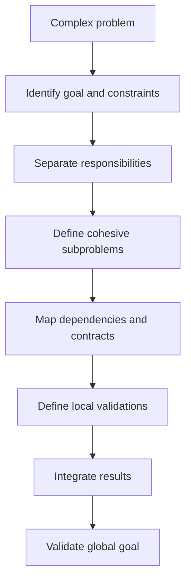
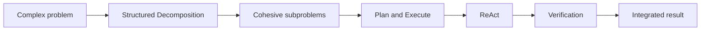
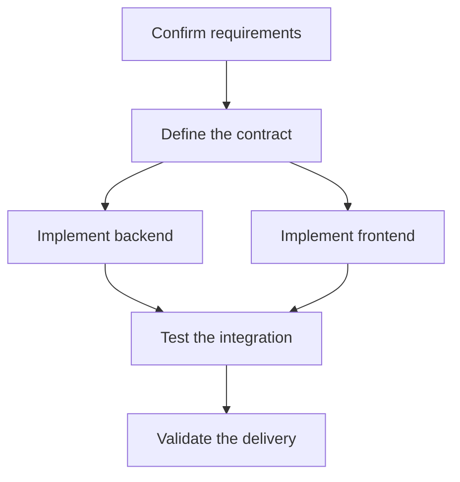
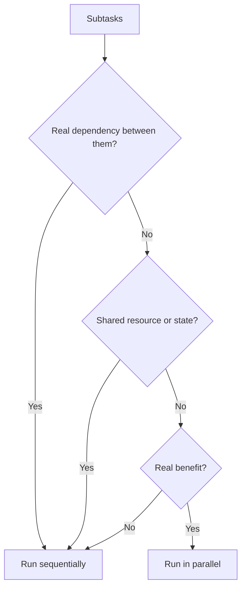
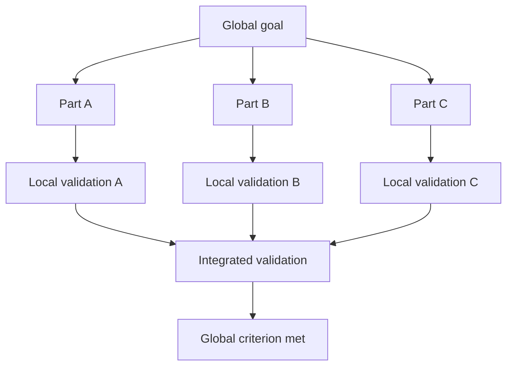
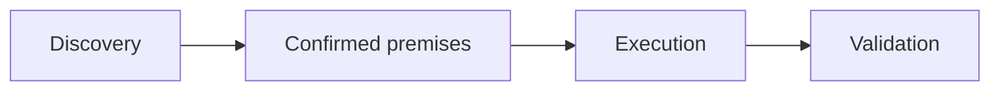

# Structured Decomposition

## Purpose

Use Structured Decomposition to turn a complex problem into smaller parts that can be understood, investigated, implemented, validated, and integrated safely.

The technique avoids two extremes:

```text
Under-decomposition:
- Treating a large problem as a single vague task.
- Mixing incompatible responsibilities, risks, and decisions.
- Implementing before understanding essential parts of the problem.

Over-decomposition:
- Creating artificial micro-tasks.
- Splitting work that needs to stay cohesive.
- Increasing coordination, context, and cost with no real gain.
```

Decomposition must produce a clear operational structure: components, responsibilities, dependencies, contracts, risks, validations, and integration. It does not require exposing detailed chain of thought.

## Core principle

> Split the problem into the smallest parts that can be understood, verified, and integrated without losing the necessary context.

A good decomposition preserves the global goal.


```mermaid
flowchart TD
    A[Complex problem] --> B[Identify goal and constraints]
    B --> C[Separate responsibilities]
    C --> D[Define cohesive subproblems]
    D --> E[Map dependencies and contracts]
    E --> F[Define local validations]
    F --> G[Integrate results]
    G --> H[Validate global goal]
```

## When to use

Use Structured Decomposition when the task involves:

```text
- Multiple responsibilities or components.
- Technical, functional, and operational requirements mixed together.
- Frontend, backend, database, integrations, or infrastructure.
- Long files or documents spanning multiple topics.
- Systems with flows, states, and dependencies.
- Refactoring large or coupled modules.
- Analyzing a problem with several possible causes.
- A decision spanning different dimensions: security, cost, deadline, compatibility, and maintenance.
- A task too large to be validated as a single unit.
- The need to delegate, parallelize, or organize subtasks.
```

The same triggers double as fitting examples: authentication with login/session/authorization/OAuth, a feature crossing UI/API/database/notifications, refactoring a large component, document analysis, database migration, distributed diagnosis, turning vague requirements into deliverables.

## When to avoid

Do not use Structured Decomposition as an automatic ritual. Avoid or simplify when:

```text
- There is a single clear, local action.
- The task is small, reversible, and easy to verify.
- The problem has no relevant dependencies.
- The user asked for a translation, rewrite, summary, or one-off tweak.
- Decomposing would create more coordination than value.
- The answer only requires a direct lookup in a known source.
```

Poor fits: fixing a syntax error, renaming a variable, translating a sentence, adjusting a button label, looking up the signature of a documented function.

## Relationship to other techniques

| Technique                | Responsibility                                                |
| ------------------------ | ------------------------------------------------------------- |
| Structured Decomposition | Splits the problem into cohesive parts, dependencies, and contracts |
| Plan and Execute         | Orders the execution of the parts                             |
| ReAct                    | Decides the next action within a part                         |
| Verification             | Defines how to validate each part and the integrated result   |
| Critique and Refine      | Fixes parts with flaws or gaps                                |
| Decision Making          | Chooses between approaches, including interdependent paths with pruning |


```mermaid
flowchart LR
    A[Complex problem] --> B[Structured Decomposition]
    B --> C[Cohesive subproblems]
    C --> D[Plan and Execute]
    D --> E[ReAct]
    E --> F[Verification]
    F --> G[Integrated result]
```

### Division of roles with Plan and Execute

Use Structured Decomposition to answer:

```text
- Which parts exist?
- Which responsibilities belong to each part?
- Which parts depend on each other?
- Which contracts connect these parts?
- How will each part be validated?
- How to confirm the integration meets the global goal?
```

Use [Plan and Execute](plan-and-execute.md) to answer:

```text
- In what order should these parts run?
- Which steps can happen in parallel?
- Where should checkpoints exist?
- When is replanning needed?
```

## Decomposition model

Before splitting, define the problem minimally.

```text
Goal:
- What final result must exist?

Scope:
- What is included?
- What is explicitly out?

Inputs:
- What data, files, events, requirements, or dependencies exist?

Outputs:
- What deliverables, decisions, changes, or behaviors must exist?

Constraints:
- Stack, security, deadline, compatibility, budget, permissions, and conventions.

Risks:
- What could fail, cause regressions, expose data, or raise cost?

Completion criterion:
- How to know the problem is solved?
```

Do not decompose a vague goal without first making it minimally verifiable.

```text
Bad:
"Improve authentication."

Better:
"Allow login via e-mail and Google OAuth, protect routes by role, renew sessions per the defined policy, and log failures without exposing tokens."
```

### Reframe before decomposing (step-back)

When the problem carries high uncertainty or comes framed with a bias baked in, step back and reframe before splitting. Decomposing a wrong framing only multiplies the error across subproblems.

```text
- What is the real problem behind the request?
- Does the statement already assume a solution? Which premise is baked in?
- Is there a higher level of abstraction where the problem gets simpler?
- What question, if answered, would dissolve most of the complexity?
```

For high-uncertainty or diagnostic problems, combine with [Root Cause Analysis](root-cause-analysis.md) and record premises with [Assumption Tracking](assumption-tracking.md) before moving to execution.

## The right unit of decomposition

A part must have a clear responsibility, an observable result, and a boundary tight enough to be validated.

```text
A good unit of decomposition:
- has a goal of its own;
- has identifiable inputs and outputs;
- can be validated in isolation;
- has explicit dependencies;
- reduces real uncertainty or work;
- does not mix incompatible responsibilities.

A bad unit:
- is too vague;
- depends on everything;
- has no completion criterion;
- merely restates the name of the larger goal;
- exists only to inflate the step count.
```

Example:

```text
Bad:
1. Build backend.
2. Build frontend.
3. Test everything.

Better:
1. Confirm the order-creation contract.
2. Implement order validation and persistence.
3. Implement predictable error responses.
4. Wire the form to the route.
5. Validate the success, error, and duplicate flows.
```

### Recursive decomposition and when to stop

If a subproblem remains complex, apply the same decomposition to it — recursively. But each level of depth adds coordination, so stop decomposing as soon as the current part satisfies all of the criteria below:

```text
Stop decomposing when the part:
- has a clear, verifiable completion criterion;
- can be validated in isolation;
- has a single responsibility and explicit dependencies;
- can be implemented/investigated without splitting again to be understood;
- fits the planned effort budget (see the catalog in ../SKILL.md).

Keep decomposing only while at least one of these criteria fails.
```

Decomposing past that point is over-decomposition: it yields micro-tasks whose coordination cost outweighs the work.

## Types of decomposition

### 1. By responsibility

Use when different parts serve distinct ends.

```text
Problem:
Implement authentication.

Responsibilities:
- User registration and identity.
- Login and credential validation.
- Session issuance and renewal.
- Authorization by role or permission.
- Logout and revocation.
- Auditing and failure handling.
```

Do not mix all these responsibilities into a single task or module without need.

### 2. By flow

Use when the problem is oriented around business or user steps.

```text
Flow:
Export a report.

Parts:
1. User requests the export.
2. System validates permission and filters.
3. A job is created.
4. A worker generates the file.
5. The file is stored.
6. The user receives a status or notification.
7. Download is authorized.
```

Each part must be clear enough to pinpoint failures and validations.

### 3. By layer

Use when the system already has a well-defined layered architecture.

```text
Feature:
Add filtering by status.

Layers:
- UI: status selector and state update.
- Application: query-param composition.
- API: filter validation and application.
- Persistence: query with the proper condition.
- Tests: local and integrated behavior.
```

Do not force layer-based decomposition when it hurts cohesion.

### 4. By risk

Use when different parts carry very different risks.

```text
Example:
Database migration.

Parts:
- Schema change.
- Compatibility with the current application.
- Migration of existing data.
- Backfill.
- Query performance.
- Rollback.
- Post-deploy monitoring.
```

Risk-based decomposition prevents treating a migration as a simple table change.

### 5. By uncertainty

Use when the problem is not yet sufficiently understood. For cause diagnosis, see [Root Cause Analysis](root-cause-analysis.md).

```text
Example:
"The system is slow."

Subproblems:
- Does the slowness occur in the frontend, API, database, or an external integration?
- Is it constant or volume-dependent?
- Is there a recent regression?
- Is there a CPU, I/O, query, serialization, or network bottleneck?
- Is there a metric or log to validate each hypothesis?
```

In that case, do not implement improvements before separating discovery from execution.

### 6. By deliverable

Use when the goal requires distinct artifacts.

```text
Example:
Build an integration with an external service.

Deliverables:
- Authenticated client.
- Request and response contracts.
- Error handling.
- Observability.
- Tests.
- Configuration documentation.
```

Useful when the results must be delivered, reviewed, or tested separately.

## How to decompose

### 1. Identify the core of the problem

Ask:

```text
- What is the main result?
- Which part is mandatory for the task to count as done?
- Which results are secondary?
- Which constraints must not be violated?
```

Example:

```text
Task:
"Add recurring payments."

Core:
- Charge correctly at the defined interval.
- Record the state and result of each charge.
- Prevent duplicates.
- Handle failures and cancellations.

Secondary:
- Detailed dashboard.
- Advanced history.
- Extra notifications.
```

Do not let secondary features hide the main goal.

### 2. Identify responsibilities

Separate activities that have different reasons to change.

```text
Bad:
"Payment service that validates input, computes prices, charges the card,
updates the subscription, sends e-mail, and generates reports."

Better:
- Request validation.
- Price calculation and rules.
- Charging via the provider.
- Subscription update.
- Notification.
- Auditing and reporting.
```

This rule does not demand a class or service per responsibility. It only demands that distinct responsibilities be recognized and not coupled without need.

### 3. Identify inputs, outputs, and contracts

For each part, define:

```text
Input:
- Data, events, parameters, or resources required.

Output:
- Result produced, state changed, response, or artifact.

Contract:
- Format, invariants, permissions, errors, and expected behaviors.

Dependencies:
- Services, data, steps, or decisions required.

Validation:
- How to confirm the part works.
```

When contracts and non-functional requirements become the crux of the problem, handle them with [Constraint Satisfaction](constraint-satisfaction.md).

Example:

```text
Part:
Create an order.

Input:
- Items, customer, address, payment method.

Output:
- Order persisted with an identifier and initial state.

Contract:
- Items must exist.
- Quantities must be positive.
- The user must have permission.
- Errors must follow the standard format.

Dependencies:
- Catalog, inventory, payment, and database.

Validation:
- Tests for success, out-of-stock error, declined payment, and duplicates.
```

### 4. Map dependencies

Distinguish a real dependency from an ordering preference.


```mermaid
flowchart TD
    A[Confirm requirements] --> B[Define the contract]
    B --> C[Implement backend]
    B --> D[Implement frontend]
    C --> E[Test the integration]
    D --> E
    E --> F[Validate the delivery]
```

A dependency is real when:

```text
- One part needs the other's output.
- A decision must be made first.
- Both change the same shared resource.
- One part defines a contract the other uses.
- Running in the wrong order causes rework or risk.
```

Do not create a dependency just because a step "seems to come first".

### 5. Define integration boundaries

Independent parts need clear interfaces.

```text
An integration boundary must spell out:
- data exchanged;
- format;
- each side's responsibility;
- error handling;
- authentication and authorization;
- synchronous or asynchronous;
- idempotency, when applicable;
- observability;
- compatibility.
```

Example:

```text
Frontend <-> API

Input:
GET /orders?status=active&page=1

Output:
{
  "items": [...],
  "page": 1,
  "page_size": 20,
  "total": 75
}

Errors:
- 400 for an invalid filter.
- 401 for missing authentication.
- 403 for missing permission.

Validation:
- Contract tests and UI flow tests.
```

## Granularity

### Signs the part is too large

```text
- It has multiple independent responsibilities.
- No clear completion criterion can be written for it.
- Its failure could stem from many different causes.
- It spans many files or systems with no defined boundary.
- It cannot be validated without validating the whole system.
- It mixes discovery, decision, implementation, and validation.
```

### Signs the part is too small

```text
- It produces no useful result on its own.
- It only exists because a step was split artificially.
- Its coordination cost exceeds the work.
- It cannot be validated separately.
- It merely restates a mechanical micro-action.
- It must always happen together with another part.
```

Part too large: split by responsibility, risk, or contract. Part too small: regroup by goal or validation.

## Decomposition and parallelism

Decomposition can reveal parallelizable subtasks, but it does not mandate parallelism. Parallelize only when the parts are independent.

```text
Criteria:
- They do not change the same resource.
- They do not depend on each other's output.
- They do not share critical mutable state.
- Their results can be interpreted separately.
- There is a real gain in running them simultaneously.
```


```mermaid
flowchart TD
    A[Subtasks] --> B{Real dependency between them?}
    B -- Yes --> C[Run sequentially]
    B -- No --> D{Shared resource or state?}
    D -- Yes --> C
    D -- No --> E{Real benefit?}
    E -- Yes --> F[Run in parallel]
    E -- No --> C
```

Safe example (parallelizable):

```text
- Read the API's official documentation.
- Inspect existing component conventions.
- Review related tests.
```

Unsafe example (requires order and a checkpoint):

```text
- Change the database schema.
- Change code that depends on the new schema.
- Run the migration.
```

## Validation-oriented decomposition

Each subproblem must have local validation and contribute to the global validation.


```mermaid
flowchart TD
    A[Global goal] --> B[Part A]
    A --> C[Part B]
    A --> D[Part C]

    B --> E[Local validation A]
    C --> F[Local validation B]
    D --> G[Local validation C]

    E --> H[Integrated validation]
    F --> H
    G --> H

    H --> I[Global criterion met]
```

Example:

```text
Goal:
Enable CSV export.

Local validation:
- Export permission works.
- Filters are propagated.
- The file is generated.
- Download is authorized.

Integrated validation:
- A permitted user exports filtered data.
- A user without permission cannot export.
- The file holds the expected data.
```

Do not assume that validating isolated parts proves the integrated behavior.

## Discovery versus execution

Problems with material uncertainty must be split into two groups. Record pending premises with [Assumption Tracking](assumption-tracking.md).

```text
Discovery:
- Confirm requirements.
- Inspect contracts.
- Reproduce bugs.
- Map the architecture.
- Identify dependencies.
- Validate premises.

Execution:
- Change code.
- Create tests.
- Update configuration.
- Implement a migration.
- Update documentation.
```


```mermaid
flowchart LR
    A[Discovery] --> B[Confirmed premises]
    B --> C[Execution]
    C --> D[Validation]
```

Do not treat discovery as delay. It cuts rework when premises are uncertain.

## Closing integration gaps

After decomposing, validate that the sum of the parts solves the goal.

```text
Questions:
- Were all necessary responsibilities covered?
- Is there a gap between two parts?
- Is any responsibility duplicated?
- Are the contracts compatible?
- Does the execution order respect dependencies?
- Do the local validations cover the global goal?
- Is any behavior between the boundaries unhandled?
- Does any part rest on a premise not yet confirmed?
```

Example of a common gap:

```text
Problem:
Implement file upload.

Parts created:
- Upload screen.
- Receiving endpoint.
- Storage.

Gaps:
- Type and size validation.
- Access permission.
- Antivirus or inspection, when applicable.
- Metadata persistence.
- Authorized download.
- Failure handling.
```

## Anti-patterns

```text
1. Splitting by files instead of responsibility.
   Bad:     Change file A / file B / file C.
   Better:  Confirm the contract, implement validation, update the UI flow, create regression tests.
   Files are a consequence of the implementation, not the problem's main structure.

2. Mixing discovery and implementation.
   Bad:     "Implement OAuth and figure out how the provider works while coding."
   Better:  Confirm provider/callback/scopes/session, define the contract, implement, validate the full flow.

3. Creating subtasks with no verifiable output.
   Bad:     "Think about the architecture."
   Better:  "Compare alternatives against criteria of compatibility, operating cost, and migration risk."

4. Duplicating responsibility.
   Bad:     Frontend, backend, and worker all validate permission with no defined purpose.
   Better:  The frontend controls visibility; the backend is the source of truth for authorization; the worker receives pre-authorized tasks or validates per the contract.
   Do not confuse defense in depth with purposeless duplication.

5. Over-decomposing.
   Bad:     Create variable / create function / create import / add test / run test.
   Better:  "Implement input normalization and cover valid and invalid cases."

6. Not mapping integration.
   Bad:     Validate frontend and backend separately and assume they will work together.
   Better:  Validate request, response, errors, authentication, and end-to-end behavior.

7. Ignoring non-functional requirements.
   Bad:     Decompose only screens and endpoints.
   Better:  Include security, performance, observability, errors, compatibility, and operations when relevant.
```

## Examples

### Example 1 — Full feature (system)

```text
Task:
Add CSV export of orders.

Goal:
Let authorized users export orders according to the active filters.

Decomposition:

1. Rules and contract
   - Which fields can be exported?
   - Which permissions are required?
   - Which filters must be honored?
   - What is the file format?

2. Backend
   - Validate permission.
   - Receive and validate filters.
   - Query permitted data.
   - Generate the CSV.
   - Return the file or an async job.

3. Frontend
   - Show the action only to permitted users.
   - Reuse the active filters.
   - Show loading, error, and success states.

4. Security and privacy
   - Exclude sensitive fields.
   - Block export without authorization.
   - Record an audit trail if needed.

5. Validation
   - Test export with filters.
   - Test a user without permission.
   - Check the CSV's content and encoding.
   - Run the end-to-end integration.
```

### Example 2 — Document analysis (document)

```text
Task:
Analyze a long contract to identify risks.

Goal:
Produce a clear report on obligations, penalties, deadlines, and risks.

Decomposition:

1. Document identification
   - Parties, term, subject matter, version, and annexes.

2. Obligations
   - Each party's obligations, deliverables, deadlines, and acceptance conditions.

3. Financials
   - Amounts, adjustments, penalties, and payment terms.

4. Risks
   - Liability and limitation of liability.
   - Confidentiality, personal data, termination, and jurisdiction.

5. Inconsistencies
   - Contradictory clauses, undefined terms, missing annexes, obligations without objective criteria.

6. Synthesis
   - Priority risks, questions for negotiation, points requiring confirmation.
```

## Recording format

Use this format when recording the decomposition:

```text
Goal:
- [final result]

Scope:
- Includes:
- Excludes:

Subproblems:

1. [name]
   - Responsibility:
   - Input:
   - Output:
   - Dependencies:
   - Contract:
   - Risk:
   - Validation:

(repeat for each subproblem)

Integration:
- [how the parts connect]

Global completion criterion:
- [conditions that confirm the goal]
```

## Reminders for the agent

```text
- Reframe before splitting when uncertainty is high; do not decompose a biased statement.
- Decompose recursively, but stop as soon as the part is verifiable, isolable, and cohesive.
- Separate discovery from execution when relevant premises are unconfirmed.
- Parallelize only independent parts with no state or resource conflicts.
- Define local validation per part and integrated validation for the global goal.
- Check for gaps, duplication, and non-functional requirements before executing.
- Do not expose detailed chain of thought; communicate only the relevant structure, contracts, dependencies, decisions, and limitations.
```

## Related techniques

[Plan and Execute](plan-and-execute.md) · [ReAct](react.md) · [Verification](verification.md) · [Critique and Refine](critique-and-refine.md) · [Decision Making](decision-making.md) · [Root Cause Analysis](root-cause-analysis.md) · [Constraint Satisfaction](constraint-satisfaction.md) · [Assumption Tracking](assumption-tracking.md)

Back to the [technique catalog](../SKILL.md).
