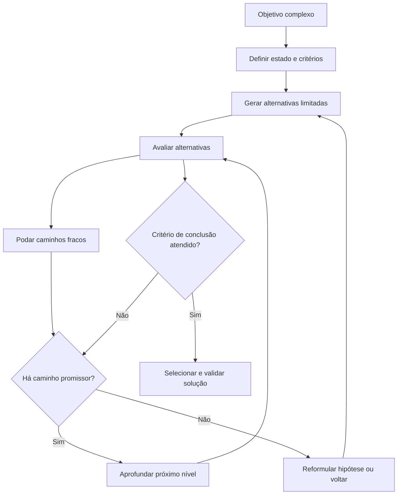
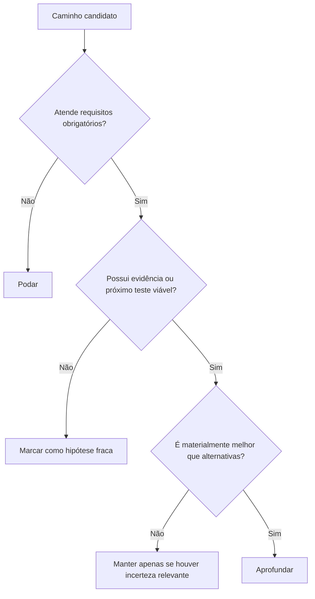
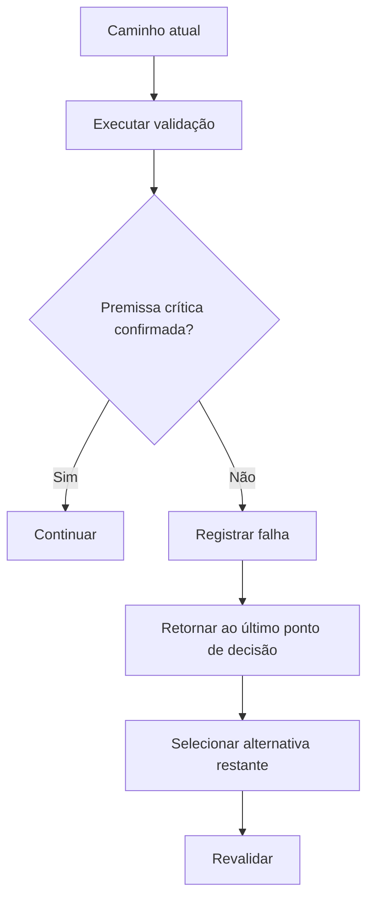

# Tree of Thoughts

## Objetivo

Use Tree of Thoughts para resolver tarefas nas quais existem múltiplas abordagens plausíveis, decisões interdependentes ou risco relevante de seguir cedo demais por um único caminho.

A técnica transforma uma decisão complexa em uma busca controlada:

1. definir o estado inicial e o objetivo;
2. gerar poucos caminhos candidatos;
3. avaliar cada caminho por critérios explícitos;
4. podar caminhos fracos;
5. aprofundar apenas os caminhos promissores;
6. voltar e explorar alternativa quando novas evidências invalidarem o caminho atual;
7. selecionar a solução com melhor sustentação.

Tree of Thoughts não exige expor cadeia de pensamento detalhada. Os "thoughts" devem ser tratados como **estados de decisão compactos e verificáveis**, não como raciocínio interno extenso.

## Princípio central

> Explore alternativas somente quando a escolha entre elas puder alterar materialmente o resultado.

A técnica deve ampliar a qualidade da decisão, não apenas multiplicar opções.



## Quando usar

Use Tree of Thoughts quando houver pelo menos uma destas condições:

```text
- Existem duas ou mais soluções plausíveis e materialmente diferentes.
- A decisão inicial pode comprometer etapas futuras.
- É necessário comparar trade-offs entre arquitetura, custo, risco, prazo ou compatibilidade.
- Há múltiplas hipóteses concorrentes para explicar um problema.
- A tarefa exige lookahead, busca, poda ou backtracking.
- Um plano linear falhou ou depende de premissas ainda incertas.
- O custo de escolher o caminho errado é relevante e as alternativas podem ser comparadas por critérios objetivos.
```

Exemplos adequados: escolher entre monólito modular, microserviços ou arquitetura orientada a eventos; investigar uma falha com múltiplas causas plausíveis; planejar migração de banco com diferentes estratégias de compatibilidade; selecionar biblioteca, fornecedor ou infraestrutura sob restrições reais; definir estratégia de autenticação com requisitos conflitantes; projetar fluxo de fallback para integração externa crítica.

## Quando evitar

Não use Tree of Thoughts para tarefas que possuem um caminho claro, baixo risco ou resposta direta.

```text
- Existe uma única ação evidente, ou a tarefa é simples, local e reversível.
- O problema pode ser resolvido por consulta direta à documentação ou ao código.
- Não há critério objetivo para comparar alternativas, ou a exploração não produzirá nova evidência.
- O custo de gerar e avaliar alternativas supera o benefício.
- A tarefa é apenas tradução, reescrita, resumo ou ajuste pontual.
- O problema exige execução prática, não exploração de possibilidades.
```

Exemplos inadequados: corrigir um erro de import; renomear uma variável; criar um endpoint CRUD simples; traduzir um texto; consultar uma propriedade documentada de uma API; reescrever um parágrafo.

## Fronteiras com outras técnicas

A confusão mais provável é entre **Tree of Thoughts** e [Decision Making](decision-making.md):

- **Tree of Thoughts** explora caminhos **interdependentes** por meio de busca — gera, aprofunda, poda e faz backtracking conforme novas evidências surgem. Use quando a escolha de um nível afeta os níveis seguintes e o caminho certo só se revela ao explorar.
- **Decision Making** escolhe entre **alternativas já enumeradas e independentes** ponderando trade-offs em um único passo de decisão. Use quando as opções estão dadas e o trabalho é compará-las, não descobri-las.

Regra prática: se a decisão é "qual destas N opções", use Decision Making; se é "qual sequência de escolhas leva a uma solução viável, com poda e retorno", use Tree of Thoughts.

| Técnica             | Responsabilidade                                                        |
| ------------------- | ----------------------------------------------------------------------- |
| Plan and Execute    | Organiza etapas, dependências, checkpoints e execução global            |
| ReAct               | Executa ações locais, observa resultados e atualiza o estado            |
| Verification        | Determina se evidências são suficientes para confiar em uma conclusão   |
| Critique and Refine | Corrige falhas ou lacunas concretas                                     |
| Decision Making     | Escolhe entre alternativas independentes por trade-offs explícitos      |
| Tree of Thoughts    | Explora e compara caminhos concorrentes antes de comprometer a execução |

### Regra de integração

Use Tree of Thoughts para decidir **qual caminho seguir**. Depois que um caminho for selecionado:

- use Plan and Execute para organizar a execução;
- use ReAct para agir e observar;
- use Verification para confirmar resultados;
- use Critique and Refine apenas quando houver falha, lacuna ou inconsistência concreta.

Tree of Thoughts não substitui execução nem validação.

## Modelo de estado

Cada nó da árvore deve representar um estado compacto e verificável.

```text
Estado:
- O que já foi confirmado.

Objetivo local:
- O que este caminho precisa resolver.

Hipótese ou estratégia:
- Qual abordagem está sendo considerada.

Premissas:
- O que precisa ser verdadeiro para esse caminho funcionar.

Evidências:
- Fatos, contratos, testes, fontes ou observações que sustentam o caminho.

Riscos:
- O que pode falhar, quebrar ou gerar custo.

Próxima ação:
- A menor ação útil para validar, aprofundar ou descartar o caminho.

Critério de poda:
- O que tornará esse caminho inviável ou inferior.
```

Exemplo:

```text
Estado:
- A aplicação precisa processar tarefas demoradas sem bloquear a API.

Estratégia:
- Usar fila com workers assíncronos.

Premissas:
- O ambiente suporta um broker e processamento separado.

Evidências:
- Já existe Redis e worker no projeto.

Riscos:
- Idempotência, retries e observabilidade.

Próxima ação:
- Verificar se o fluxo precisa de consistência imediata ou processamento eventual.

Critério de poda:
- Descartar se a resposta precisar estar disponível de forma síncrona ao usuário.
```

## Estrutura da busca

### 1. Definir objetivo e critérios

Antes de gerar alternativas, defina como elas serão avaliadas.

```text
Objetivo:
- Resultado que precisa ser alcançado.

Restrições:
- Stack, prazo, orçamento, compatibilidade, segurança, equipe e permissões.

Critérios de avaliação:
- Correção.
- Segurança.
- Compatibilidade.
- Complexidade.
- Custo.
- Manutenibilidade.
- Latência.
- Escalabilidade.
- Reversibilidade.
- Risco operacional.

Critério de conclusão:
- Condição que permite selecionar um caminho com confiança suficiente.
```

Não gere alternativas antes de saber o que elas precisam otimizar.

### 2. Gerar alternativas limitadas

Gere apenas alternativas genuinamente diferentes.

```text
- Gere de 2 a 4 caminhos iniciais.
- Evite variantes superficiais da mesma solução.
- Não mantenha alternativas sem premissa, benefício ou trade-off distinto.
- Não crie caminhos incompatíveis com restrições já confirmadas.
```

Exemplo:

```text
Problema:
- Processar geração de relatório pesado.

Alternativas:
A. Processamento síncrono na própria API.
B. Job assíncrono com fila e polling de status.
C. Job assíncrono com notificação ao concluir.

Não são alternativas úteis:
- Job assíncrono com nome diferente.
- Polling a cada 5 segundos versus 10 segundos, antes de definir se polling é adequado.
```

### 3. Avaliar alternativas

Avalie alternativas por evidência e critérios explícitos. Use uma matriz compacta quando houver comparação real:

| Critério                   | Caminho A | Caminho B | Caminho C |
| -------------------------- | --------- | --------- | --------- |
| Atende requisito principal |           |           |           |
| Compatível com stack       |           |           |           |
| Segurança                  |           |           |           |
| Complexidade               |           |           |           |
| Custo operacional          |           |           |           |
| Reversibilidade            |           |           |           |
| Risco de regressão         |           |           |           |
| Evidência disponível       |           |           |           |

Não use pontuações falsas ou arbitrárias. Use números apenas quando houver escala definida, dados comparáveis ou critério explícito.

```text
Ruim:
"Caminho A: nota 9. Caminho B: nota 7."

Melhor:
"Caminho A exige nova infraestrutura e introduz consistência eventual.
Caminho B reutiliza serviços existentes, mas exige polling e tratamento de status.
Caminho C reduz polling, mas exige canal de notificação ainda inexistente."
```

### 4. Fazer poda precoce

Descarte caminhos que não atendam requisitos obrigatórios. Poda não é fracasso: ela reduz custo e evita aprofundar opções inviáveis.



Pode um caminho quando:

```text
- Viola requisito obrigatório.
- Contradiz contrato, documentação ou fato confirmado.
- Introduz risco inaceitável.
- Depende de recurso indisponível.
- É claramente mais complexo sem benefício proporcional.
- Não possui caminho viável de validação.
- Foi refutado por teste, execução ou evidência confiável.
- É dominado por outra alternativa em todos os critérios relevantes.
```

Não pode um caminho apenas por parecer menos familiar ou menos elegante.

## Estratégias de exploração

Escolha a estratégia conforme onde está o risco e o custo de comparar opções.

- **Largura** — avalie várias alternativas superficialmente antes de aprofundar. Use quando a escolha inicial é decisiva, há muitas opções plausíveis, é barato eliminar caminhos cedo e um erro inicial causaria alto retrabalho. Padrão para escolha de arquitetura ou biblioteca.
- **Profundidade** — aprofunde um caminho promissor até encontrar validação, bloqueio ou necessidade de retorno. Use quando uma alternativa já é claramente superior, a validação exige várias etapas dependentes, comparar todas as opções é caro e há critérios objetivos para interromper ou voltar.
- **Híbrida** — combine as duas e é o fluxo recomendado quando o risco está concentrado em uma decisão de arquitetura ou integração:

```text
1. Explorar de 2 a 4 alternativas em largura.
2. Podar opções inviáveis.
3. Aprofundar a opção mais promissora.
4. Voltar apenas se evidência material invalidar o caminho.
```

## Backtracking

Backtracking é retornar a uma decisão anterior após evidência concreta de que o caminho atual é fraco, inválido ou inferior.

Use backtracking quando:

```text
- Um teste refutou premissa crítica.
- Uma dependência não está disponível.
- A implementação viola contrato confirmado.
- O risco real é maior que o previsto.
- A alternativa selecionada não atende requisito obrigatório.
- Surgiu evidência de que um caminho podado era mais adequado.
```



Não faça backtracking por preferência estética, ansiedade ou ausência de perfeição.

## Convergência e regras de parada

Encerre a busca com base em critério objetivo, não em sensação de completude.

Convergência (selecione e siga para execução) quando:

```text
- Um caminho atende todos os requisitos obrigatórios e domina os demais nos critérios relevantes.
- A evidência disponível é suficiente para sustentar a escolha (critério de conclusão atendido).
- As alternativas restantes não diferem materialmente no resultado.
- O orçamento de exploração se esgotou e há um caminho viável aceitável.
```

Caso limite — **todos os caminhos podados ou nenhum atende requisito obrigatório**. Não force uma escolha entre opções inviáveis; em vez disso, na ordem:

```text
1. Reexaminar se algum requisito tido como obrigatório é, na verdade, negociável; se for, relaxar a restrição e reavaliar os caminhos.
2. Buscar evidência adicional que possa reabilitar um caminho podado (premissa pode ter sido descartada cedo demais).
3. Escalar ao usuário o conflito entre requisitos e restrições, apresentando o trade-off explícito.
4. Declarar inviabilidade sob as restrições atuais, registrando qual requisito nenhuma alternativa consegue satisfazer.
```

## Orçamento de exploração

Tree of Thoughts precisa de limites explícitos. O orçamento padrão alinha-se ao orçamento de esforço do catálogo (ver [catálogo de técnicas](../SKILL.md)).

```text
- Máximo de 2 a 4 alternativas iniciais.
- Máximo de 1 a 3 níveis de aprofundamento antes de reavaliar.
- Uma ação de validação relevante por caminho antes de expandir novamente.
- Poda imediata de caminhos que violem requisito obrigatório.
- Pare quando houver evidência suficiente para selecionar uma opção.
```

Aumente o orçamento apenas quando o risco de errar é alto, as alternativas têm consequências muito diferentes, a decisão é difícil de reverter, há evidência adicional que pode mudar a escolha, ou o usuário pediu comparação aprofundada.

Reduza o orçamento quando o contexto é incompleto, as alternativas não são materialmente diferentes, a tarefa exige ação rápida e reversível, ou a investigação já identificou caminho claramente superior.

## Uso de ferramentas e evidências

Tree of Thoughts não deve explorar apenas por linguagem ou intuição. Para cada caminho promissor, escolha uma ação que gere evidência: ler contrato ou documentação oficial; inspecionar código existente; executar teste focado; reproduzir erro; fazer chamada controlada de API; medir desempenho; consultar configuração real; comparar impacto em dependências.

Formato recomendado:

```text
Caminho:
- Implementar cache distribuído.

Premissa a validar:
- Há leituras repetidas com latência relevante.

Ação:
- Medir frequência e tempo das consultas atuais.

Resultado:
- Consultas são raras e já possuem latência aceitável.

Decisão:
- Podar cache distribuído; custo e complexidade não são justificados.
```

## Seleção final

Ao terminar a exploração, selecione o caminho que melhor atende aos critérios confirmados. A escolha final deve incluir:

```text
Opção selecionada:
- [caminho escolhido]

Motivos:
- [critérios e evidências principais]

Alternativas descartadas:
- [motivo objetivo de descarte]

Riscos remanescentes:
- [limitações ainda existentes]

Validação necessária:
- [o que precisa ser confirmado durante a execução]
```

Não declare que uma alternativa é "a melhor" sem qualificar:

```text
Melhor:
"É a melhor opção para os requisitos, restrições e evidências atuais."

Evite:
"É objetivamente a melhor solução."
```

## Anti-padrões

### 1. Gerar alternativas demais

```text
Ruim:
Criar dez estratégias para um problema com duas soluções reais.

Melhor:
Gerar poucas alternativas materialmente distintas e podar cedo.
```

### 2. Criar variantes superficiais

```text
Ruim:
A. Usar Redis.
B. Usar Redis com TTL.
C. Usar Redis com chave diferente.

Melhor:
Comparar cache local, cache distribuído e ausência de cache.
```

### 3. Avaliar sem critérios

```text
Ruim:
"Essa solução parece melhor."

Melhor:
"Essa solução atende compatibilidade, usa infraestrutura existente e reduz risco operacional, mas adiciona consistência eventual."
```

### 4. Explorar sem evidência

```text
Ruim:
Continuar hipotetizando sobre uma API sem consultar contrato, documentação ou resposta real.

Melhor:
Escolher a menor ação que confirme ou descarte a hipótese.
```

### 5. Backtracking excessivo

```text
Ruim:
Abandonar a solução a cada dificuldade menor.

Melhor:
Voltar apenas quando uma premissa crítica falhar ou o caminho deixar de atender requisitos.
```

### 6. Confundir brainstorming com busca

```text
Ruim:
Gerar ideias sem critérios, poda ou decisão.

Melhor:
Gerar alternativas, compará-las, eliminar as fracas e selecionar uma direção.
```

### 7. Usar Tree of Thoughts para tarefa linear

```text
Ruim:
Explorar múltiplas formas de alterar um único campo em um formulário.

Melhor:
Usar ReAct e Verification para executar a alteração diretamente.
```

## Exemplos

### Exemplo 1 — Arquitetura de processamento assíncrono

```text
Problema:
- Gerar relatórios grandes sem bloquear requisições.

Critérios:
- Não bloquear API.
- Permitir acompanhamento de status.
- Reutilizar infraestrutura existente.
- Evitar complexidade desnecessária.

Alternativas:
A. Processamento síncrono.
B. Worker assíncrono com polling.
C. Worker assíncrono com notificação.

Poda:
- A é descartada porque viola requisito de não bloquear API.

Validação:
- Verificar se já existe fila, broker e canal de notificação.

Seleção:
- B pode ser preferida se a fila já existir e não houver infraestrutura de push.
- C pode ser preferida se notificações já forem suportadas e experiência imediata for requisito.
```

### Exemplo 2 — Diagnóstico de falha

```text
Problema:
- Usuários relatam duplicidade de pedidos.

Hipóteses:
A. Clique duplo na interface.
B. Retry de rede no cliente.
C. Falta de idempotência no backend.
D. Processamento duplicado em worker.

Critérios:
- Explicar duplicidade observada.
- Ser compatível com logs e dados existentes.
- Permitir teste objetivo.

Exploração:
1. Inspecionar logs de request e chave de correlação.
2. Verificar se requisições duplicadas chegam ao backend.
3. Testar criação repetida com mesmo payload.
4. Confirmar se worker processa a mesma mensagem mais de uma vez.

Seleção:
- Não assumir que o frontend é a única causa apenas porque o clique duplo é visível.
```

## Formato compacto de exploração

Use este formato para registrar uma busca controlada, respeitando o orçamento padrão (2 a 4 alternativas, 1 a 3 níveis):

```text
Objetivo:
- [resultado desejado]

Critérios:
- [critérios de decisão e critério de conclusão]

Alternativas (2 a 4, materialmente distintas):
1. [caminho]
   - Premissas:
   - Benefícios:
   - Riscos:
   - Evidência necessária:
   - Critério de poda:

2. [caminho]
   - Premissas:
   - Benefícios:
   - Riscos:
   - Evidência necessária:
   - Critério de poda:

Decisão:
- [opção selecionada ou necessidade de aprofundamento]

Justificativa:
- [evidências e trade-offs]

Limitações:
- [o que ainda não foi confirmado]
```

Pontos que reforçam o que não está coberto acima: não exponha cadeia de pensamento detalhada — comunique apenas alternativas, critérios, evidências, decisões e limitações relevantes; valide premissas críticas com ferramentas, testes, documentação ou observação antes de comprometer a execução.

## Técnicas relacionadas

- [Plan and Execute](plan-and-execute.md)
- [ReAct](react.md)
- [Verification](verification.md)
- [Critique and Refine](critique-and-refine.md)
- [Decision Making](decision-making.md)

Voltar a skill [pelizzai-reasoning](../SKILL.md).
