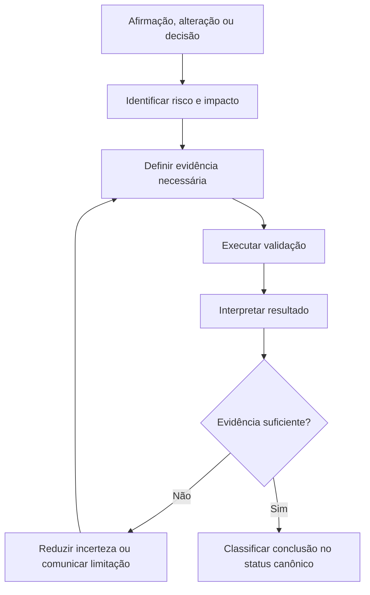
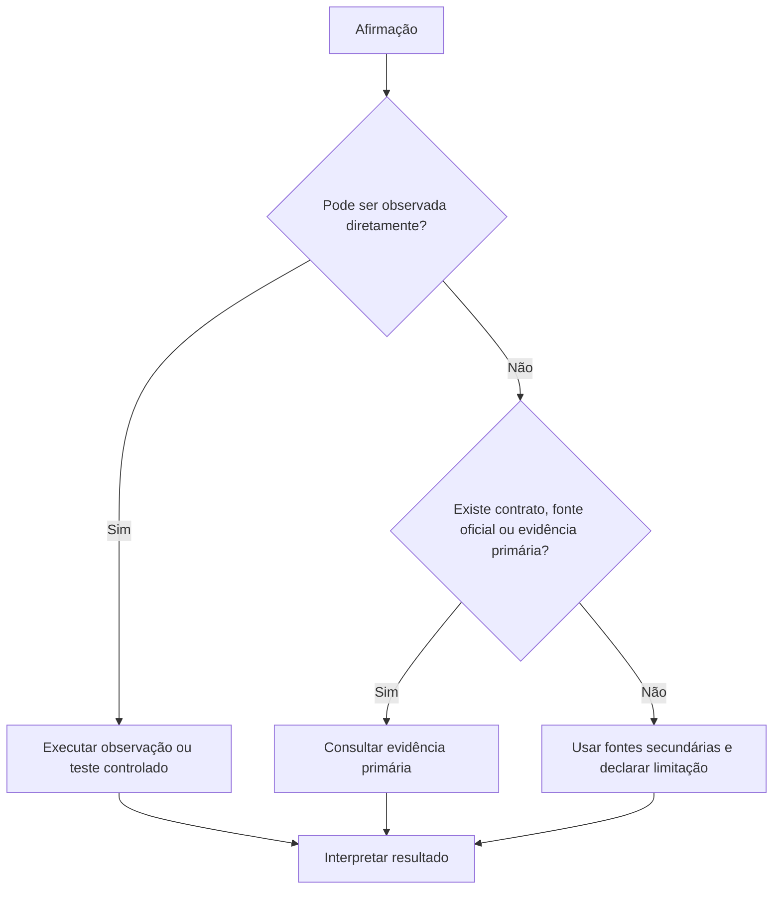

# Verification

## Objetivo

Use Verification para confirmar que uma conclusão, alteração, resposta ou ação está correta o suficiente para o contexto.

A técnica existe para evitar erros como:

- tratar hipótese como fato;
- confiar em uma única fonte fraca;
- concluir que código funciona apenas porque compila;
- assumir que um teste passou porque executou;
- validar apenas o caminho feliz;
- ignorar regressões, efeitos colaterais ou requisitos não funcionais;
- apresentar uma recomendação como certeza quando a evidência é insuficiente.

Verification não é uma etapa burocrática obrigatória para toda tarefa. Ela deve ser proporcional ao impacto, à incerteza, à reversibilidade e ao custo de errar (ver o orçamento de esforço na skill [pelizzai-reasoning](../SKILL.md)).

## Princípio central

> Uma conclusão só é confiável quando a evidência utilizada é adequada ao risco da decisão.

Não use confiança subjetiva como substituto de validação.



## Status canônico da conclusão

Toda conclusão e toda informação relevante recebe exatamente um destes status. Este é o conjunto único usado no frontmatter, na classificação de informação, no registro e na decisão final — não introduza variações locais.

| Status                  | Significado                                                           | Como comunicar                                 |
| ----------------------- | --------------------------------------------------------------------- | ---------------------------------------------- |
| Confirmado              | Observado diretamente ou sustentado por evidência suficiente ao risco | Pode ser afirmado com segurança compatível     |
| Parcialmente confirmado | Cenário principal validado, mas há lacunas conhecidas                 | Afirmar só o coberto; declarar as lacunas      |
| Inferido                | Conclusão derivada de fatos confirmados, sem prova direta suficiente  | Deve ser apresentado como inferência           |
| Hipótese                | Explicação possível ainda não validada                                | Deve ser testada ou explicitamente sinalizada  |
| Refutado                | Afirmação contrariada por evidência                                   | Não deve orientar a decisão sem nova evidência |
| Bloqueado               | Não foi possível validar por falta de acesso, contexto ou ferramenta  | Declarar o bloqueio e o que falta              |
| Inconclusivo            | Evidências insuficientes ou conflitantes                              | Não forçar conclusão; declarar incerteza       |
| Desconhecido            | Informação ausente ou não verificável                                 | Não deve ser inventada                         |

Exemplo de classificação de informação:

```text
Confirmado:
- O endpoint retorna HTTP 422 quando recebe payload inválido.

Inferido:
- A falha da interface provavelmente decorre de campo enviado com nome diferente.

Hipótese:
- O problema pode ocorrer apenas quando o formulário possui campo opcional vazio.

Desconhecido:
- Não foi confirmado se clientes externos consomem o mesmo endpoint.

Refutado:
- A hipótese de indisponibilidade da API foi descartada porque a rota respondeu normalmente.
```

Quando a tarefa é categorizada como Hipótese ou Desconhecido, registre e rastreie a suposição com [Assumption Tracking](assumption-tracking.md).

## Quando usar

Use Verification quando a tarefa envolver:

- código alterado;
- testes, builds, lint, typecheck ou execução de comandos;
- dados, números, cálculos ou métricas;
- arquivos enviados pelo usuário;
- APIs, integrações, bancos de dados ou contratos;
- pesquisa factual, técnica, jurídica, financeira, médica ou atual;
- decisões arquiteturais;
- recomendações com impacto relevante;
- segurança, permissões, autenticação ou dados sensíveis;
- ações irreversíveis ou difíceis de reverter;
- conclusões derivadas de múltiplas fontes;
- bugs, regressões ou comportamento inesperado.

Exemplos:

```text
- Confirmar que uma feature funciona após alterar frontend e backend.
- Verificar se uma biblioteca suporta determinado recurso.
- Conferir se um cálculo está correto.
- Validar se uma API retornou o formato esperado.
- Confirmar se uma afirmação atual ainda é verdadeira.
- Revisar se uma refatoração preservou o comportamento existente.
- Verificar se uma recomendação se sustenta em fontes confiáveis.
```

## Quando simplificar ou evitar

Não transforme tarefas simples em processos de validação desproporcionais.

Simplifique quando:

- a tarefa é criativa;
- o usuário forneceu todo o conteúdo necessário;
- a resposta é conceitual e estável;
- não há ação externa, fato atual ou risco relevante;
- a alteração é local, reversível e facilmente inspecionável;
- não existe mecanismo de validação adicional que gere informação útil.

Exemplos: reescrever um parágrafo, traduzir uma frase, sugerir nomes para um projeto, ajustar formatação, explicar um conceito básico e estável.

Mesmo em tarefas simples, não invente resultados, fontes, testes ou observações.

## Regras de parada

Pare a verificação quando qualquer condição abaixo for atingida (espelha o "Pare quando" da skill [pelizzai-reasoning](../SKILL.md)):

- a evidência obtida já é suficiente para o risco da decisão;
- novas validações repetiriam a mesma hipótese, ambiente e entrada sem ganho de informação;
- o resultado está bloqueado por falta de acesso, contexto ou ferramenta — registre como Bloqueado e comunique;
- o custo de validar adicional supera o custo de errar no contexto.

## Relação com outras técnicas

| Técnica             | Papel                                                                  |
| ------------------- | ---------------------------------------------------------------------- |
| Plan and Execute    | Define o plano, etapas, dependências e checkpoints                     |
| ReAct               | Escolhe a próxima ação, observa o resultado e atualiza o estado        |
| Verification        | Define o que precisa ser provado e qual evidência é suficiente         |
| Critique and Refine | Melhora um resultado quando há critério objetivo ou evidência de falha |
| Tree of Thoughts    | Explora alternativas quando há múltiplos caminhos relevantes           |

### Regra de integração e handoffs

- Use [Plan and Execute](plan-and-execute.md) para definir o que precisa ser feito.
- Use [ReAct](react.md) para executar e observar cada etapa.
- Use Verification para decidir se a evidência obtida é suficiente para concluir.
- Quando a validação **falha** ou expõe inconsistência, passe para [Critique and Refine](critique-and-refine.md) para revisar o resultado.
- Quando há um **bug ou comportamento inesperado** cuja causa precisa ser entendida, passe para [Root Cause Analysis](root-cause-analysis.md).
- Quando surge **conflito entre fontes** na validação de pesquisa, passe para [Evidence Synthesis](evidence-synthesis.md).
- Quando há **múltiplos caminhos plausíveis** de validação ou solução, explore com [Tree of Thoughts](tree-of-thoughts.md).

## Hierarquia de evidências

Prefira evidências diretas, específicas e verificáveis. Da mais forte para a mais fraca:

1. observação direta e reproduzível;
2. teste automatizado ou execução controlada;
3. código-fonte, contrato, schema ou configuração real;
4. documentação oficial atualizada;
5. fonte primária, dado público ou registro oficial;
6. fonte secundária confiável;
7. relato de terceiros;
8. memória, intuição ou suposição.

A evidência mais forte depende do contexto.

| Pergunta                             | Evidência preferida                                |
| ------------------------------------ | -------------------------------------------------- |
| "Esse endpoint aceita esse campo?"   | Contrato, schema, código ou chamada real           |
| "Essa feature funciona?"             | Teste, execução controlada e inspeção de resultado |
| "Essa biblioteca suporta recurso X?" | Documentação oficial e código da versão usada      |
| "Esse cálculo está correto?"         | Fórmula, dados de entrada e cálculo reproduzível   |
| "Esse fato é atual?"                 | Fonte primária atual ou fonte oficial recente      |
| "Essa alteração gerou regressão?"    | Teste de regressão, diff e comportamento observado |

## Proporcionalidade de validação

A profundidade da verificação deve ser proporcional ao risco (Baixo, Médio, Alto, Crítico — alinhado ao orçamento de esforço da skill [pelizzai-reasoning](../SKILL.md)).

| Nível   | Características                                                           | Validação esperada                                                                          |
| ------- | ------------------------------------------------------------------------- | ------------------------------------------------------------------------------------------- |
| Baixo   | Alteração local, reversível, sem impacto externo                          | Revisão direta e verificação simples                                                        |
| Médio   | Código funcional, integração limitada ou decisão relevante                | Testes focados, revisão de contratos e efeitos colaterais                                   |
| Alto    | Dados persistentes, segurança, integração crítica ou produção             | Testes abrangentes, validação de contratos, rollback e evidência independente               |
| Crítico | Financeiro, jurídico, médico, segurança sensível ou produção irreversível | Fontes primárias, revisão rigorosa, validação redundante e comunicação explícita de limites |

Regra prática — quanto maior o custo de errar: mais forte deve ser a evidência; mais independente deve ser a validação; mais explícitas devem ser as limitações; mais cuidadosa deve ser a comunicação da conclusão.

## Tipos de validação por tarefa

Cada tipo de validação confirma uma propriedade diferente. A tabela abaixo cruza tipo de tarefa, validação mínima e validação reforçada; as seções seguintes detalham o que cada tipo cobre.

| Tipo de tarefa            | Validação mínima                             | Validação reforçada                                 |
| ------------------------- | -------------------------------------------- | --------------------------------------------------- |
| Alteração local de código | Revisão de diff e teste focado               | Lint, typecheck e build                             |
| Nova feature frontend     | Fluxo principal e erro relevante             | Testes, lint, typecheck e build                     |
| Nova feature backend      | Teste de rota ou serviço                     | Testes de integração, contrato e tratamento de erro |
| Refatoração               | Testes existentes e revisão de comportamento | Testes de regressão e comparação de saída           |
| Integração externa        | Contrato e resposta controlada               | Retry, timeout, falhas e observabilidade            |
| Migração de banco         | Schema e dados de teste                      | Backup, rollback, performance e impacto em produção |
| Pesquisa técnica          | Documentação oficial                         | Comparação de versões, fontes e limitações          |
| Recomendação relevante    | Critérios explícitos                         | Contra-argumento, riscos e alternativas             |
| Cálculo ou relatório      | Reproduzir resultado                         | Conferência independente e auditoria de entradas    |
| Segurança                 | Validação de acesso e entrada                | Revisão de ameaça, testes negativos e logs          |

### Estrutural

Confirma que a forma do resultado está correta: sintaxe, tipos, schema, imports, contratos, formato de payload, configuração e estrutura de arquivos (ex.: typecheck passa, JSON segue o schema, imports existem). Atenção: validação estrutural não prova comportamento correto.

### Comportamental

Confirma que o sistema faz o que deveria: regras de negócio, fluxos de usuário, respostas de API, permissões, erros esperados, eventos e estados de interface (ex.: usuário autorizado exporta CSV; usuário sem permissão recebe resposta adequada; sistema bloqueia envio duplicado).

### Regressão

Confirma que a alteração não quebrou comportamento existente. Use ao corrigir bug, refatorar, alterar contrato, trocar dependência, mexer em lógica compartilhada, componente reutilizado, autenticação, cache ou estado global (ex.: testes anteriores continuam passando; novo campo não quebra clientes existentes).

### Integração

Confirma que componentes distintos funcionam juntos: frontend e backend, API e banco, filas e workers, autenticação externa, serviços de terceiros, cache, webhooks e armazenamento externo (ex.: frontend envia payload compatível; worker consome mensagem esperada; webhook processado com assinatura válida).

### Segurança

Confirma que o resultado não expõe dados, permissões ou comportamento perigoso. Verifique, quando aplicável:

```text
- autenticação;
- autorização;
- validação de entrada;
- exposição de segredos;
- logs com dados sensíveis;
- permissões excessivas;
- injeção;
- acesso indevido entre usuários;
- tratamento seguro de erros;
- rate limiting e abuso previsível.
```

Não conclua que algo é seguro apenas porque não apresentou erro funcional. Para validação antes de ações de alto impacto, ver também [Constraint Satisfaction](constraint-satisfaction.md).

### Dados e cálculos

Use quando houver valores numéricos, planilhas, relatórios, agregações, filtros, indicadores, cálculos financeiros, percentuais, datas ou conversões. Verifique origem dos dados, período, fórmula, unidades, arredondamentos, valores ausentes, duplicidades, soma de totais, coerência entre resultado e entradas e possibilidade de reprodução.

```text
Ruim:
"O total parece correto."

Melhor:
"O total foi recalculado a partir das linhas de origem; a soma confere, exceto pelo item X, que usa arredondamento diferente."
```

### Pesquisa e fatos externos

Use para afirmações atuais, técnicas, legais, médicas, financeiras ou potencialmente controversas. Verifique data da informação, autoridade e proximidade da fonte ao fato, escopo e contexto, conflitos entre fontes, versão da tecnologia, se a fonte trata exatamente da pergunta e se a conclusão é fato ou interpretação.

Priorize documentação oficial; legislação, órgãos oficiais ou decisões primárias; artigos científicos e dados públicos; repositórios e changelogs oficiais; e veículos reconhecidos quando fontes primárias não existirem. Não use fonte antiga para responder pergunta atual sem declarar a limitação.

Quando há **conflito entre fontes**, reconcilie com [Evidence Synthesis](evidence-synthesis.md) antes de concluir.

## Verificação por refutação

Para afirmações de alto impacto, não basta acumular evidência a favor: derive 1 a 3 perguntas cuja resposta **refutaria** a conclusão e procure ativamente por elas. Se nenhuma refutação se sustentar após busca genuína, a confiança aumenta; se alguma se sustentar, a conclusão cai para Refutado, Parcialmente confirmado ou Inconclusivo.

```text
Conclusão sob teste:
- "A migração é segura para rodar em produção."

Perguntas que refutariam:
1. Existe alguma tabela grande sem índice que travaria sob lock durante a migração?
2. Algum cliente em produção depende da coluna que será removida?
3. O rollback foi testado e restaura o estado anterior sem perda?

Resultado:
- Se qualquer resposta for "sim/indeterminado", a conclusão não é Confirmado.
```

## Processo de verificação

### 1. Definir a afirmação verificável

Transforme conclusões vagas em afirmações testáveis.

```text
Ruim:
"A feature está pronta."

Melhor:
"O usuário com permissão pode exportar CSV respeitando filtros ativos; usuários sem permissão não acessam a ação; testes, lint e build aplicáveis passam."
```

### 2. Identificar o risco de estar errado

Pergunte: o que acontece se esta conclusão estiver errada? Há impacto em dados, usuários, segurança ou dinheiro? A ação é reversível? Quem depende deste resultado? Há integração externa? O erro pode permanecer oculto por muito tempo? A resposta define o nível de evidência necessário.

### 3. Escolher a evidência adequada

Escolha a menor validação que seja suficiente para o risco.



Não use validações irrelevantes. Para "campo de formulário não é salvo", executar o build é irrelevante; o útil é inspecionar o payload enviado, verificar o schema da API e confirmar resposta e persistência.

### 4. Executar e registrar resultado

Para validações relevantes, registre de forma compacta com o formato abaixo — usado tanto durante a execução quanto na comunicação final. Não registre apenas "validado" sem indicar o que foi verificado.

```text
Afirmação:
- [o que está sendo confirmado]

Validação:
- [teste, fonte, observação ou ferramenta utilizada]

Resultado:
- [o que foi observado]

Limitações:
- [o que não foi verificado ou permanece incerto]

Conclusão:
- [um status canônico]
```

### 5. Interpretar sem exagerar

Uma evidência confirma apenas o que ela realmente cobre. Um teste que passou confirma o cenário testado, mas não confirma automaticamente todos os cenários, segurança, performance, compatibilidade, ausência de regressões ou comportamento em produção.

```text
Ruim:
"O sistema está seguro porque o login funciona."

Melhor:
"O fluxo de login foi validado. Ainda é necessário avaliar autorização, exposição de tokens, rate limiting e cenários de ataque relevantes."
```

### 6. Decidir a conclusão

Ao final, atribua exatamente um dos status definidos em a seção **Status canônico da conclusão**.

## Validação negativa

Não valide apenas o caminho feliz. Quando aplicável, teste também entrada inválida, ausência de campos, permissões insuficientes, dados duplicados, timeout, indisponibilidade externa, concorrência, estado vazio, valores extremos, formatos inesperados, rollback, retry e tentativa de uso indevido.

A validação negativa deve ser proporcional ao risco. Não é necessário testar todos os cenários possíveis em toda alteração.

## Independência de validação

Quanto maior o risco, menos a validação deve depender da mesma suposição usada na implementação.

```text
Fraco:
- Implementar regra e validar apenas lendo o próprio código.
Mais forte:
- Implementar regra, executar teste independente e observar resultado real.

Fraco:
- Confirmar um cálculo usando a mesma fórmula e os mesmos valores sem revisão.
Mais forte:
- Recalcular por método independente ou conferir com fonte de dados original.

Fraco:
- Validar afirmação técnica com blog que repete a documentação.
Mais forte:
- Consultar documentação oficial, changelog ou código da versão usada.
```

## Checklists

### Código (base)

```text
[ ] O código compila ou passa em typecheck aplicável.
[ ] Imports, tipos e contratos foram validados.
[ ] Fluxo principal foi testado ou executado.
[ ] Erros relevantes possuem tratamento previsível.
[ ] Mudanças preservam comportamento esperado.
[ ] Não há segredos, dados sensíveis ou logs indevidos.
[ ] A alteração não introduziu dependência, complexidade ou efeito colateral desnecessário.
```

### Frontend

```text
[ ] A interface renderiza sem erro.
[ ] Estados de carregamento, vazio e erro foram considerados quando aplicável.
[ ] Eventos acionam a ação esperada.
[ ] Acessibilidade e semântica não foram degradadas.
[ ] Requests enviados seguem o contrato.
[ ] Testes, lint, typecheck e build aplicáveis foram executados.
```

### Backend

```text
[ ] Entrada é validada.
[ ] Autorização foi considerada.
[ ] Respostas de sucesso e erro seguem contrato.
[ ] Integrações externas possuem tratamento de falha adequado.
[ ] Operações críticas são idempotentes quando necessário.
[ ] Testes de serviço, rota ou integração foram executados quando disponíveis.
```

### Pesquisas e recomendações

```text
[ ] O problema real foi entendido.
[ ] Os critérios de comparação estão explícitos.
[ ] As fontes tratam da versão e do contexto corretos.
[ ] A recomendação não se baseia apenas em popularidade.
[ ] Riscos, custos e limitações foram considerados.
[ ] Há pelo menos uma alternativa plausível.
[ ] Existe um contra-argumento relevante.
[ ] A conclusão diferencia fato, inferência e preferência.
```

Formato recomendado de recomendação: opção sugerida; evidências (fatos e fontes); trade-offs (custos, limitações, riscos); contra-argumento (cenário em que outra opção seria melhor); nível de confiança (alto/médio/baixo) e motivo.

### Antes de ações de alto impacto

Antes de executar ações que possam gerar perda, custo, exposição ou alteração difícil de reverter (excluir arquivos, alterar banco, publicar em produção, enviar e-mails, modificar permissões, atualizar infraestrutura, executar migração, processar dados sensíveis, realizar transações):

```text
[ ] O objetivo do usuário está explícito.
[ ] O recurso-alvo foi confirmado.
[ ] A ação é necessária e proporcional.
[ ] O escopo foi limitado ao mínimo necessário.
[ ] Há backup, rollback ou alternativa reversível quando aplicável.
[ ] Permissões foram conferidas.
[ ] Impactos colaterais foram avaliados.
[ ] Existe método de validação após a execução.
```

Trate as restrições inegociáveis dessas ações com [Constraint Satisfaction](constraint-satisfaction.md), e aplique a **verificação por refutação** antes de prosseguir.

## Anti-padrões

1. **Confundir execução com validação.** "Rodei o comando, então está correto" → "O comando executou sem erro, mas ainda preciso verificar se o resultado atende ao requisito."
2. **Validar só o caminho feliz.** "Cadastro funciona porque um usuário foi criado" → "Validado para entrada válida, duplicidade, campos obrigatórios e erro de integração."
3. **Tratar fonte única como verdade absoluta.** "Um blog diz que a biblioteca suporta isso" → "A documentação oficial da versão usada confirma o suporte; há limitação X para o ambiente Y."
4. **Usar métricas como prova completa.** "A cobertura está alta, então o código é confiável" → "A cobertura indica cenários exercitados, mas não prova qualidade dos casos, segurança ou correção da regra."
5. **Ignorar evidência contrária.** "O teste que falhou deve estar errado" → "Verificar se há regressão, expectativa desatualizada ou ambiente inconsistente antes de descartar o resultado."
6. **Declarar certeza onde há limitação.** "Está resolvido" → "O cenário principal foi validado. Não foi possível testar a integração externa porque as credenciais não estavam disponíveis."
7. **Repetir validações sem ganho.** Executar o mesmo teste sem alterar hipótese, ambiente ou entrada → executar nova validação apenas quando houver nova hipótese, alteração ou condição relevante.

## Exemplos

### Alteração de API compatível com clientes existentes

```text
Afirmação:
- O novo campo `priority` é compatível com clientes existentes.

Validação:
1. Confirmar contrato atualizado.
2. Executar teste com cliente antigo sem o campo.
3. Executar teste com cliente novo usando o campo.
4. Verificar comportamento com valor inválido.
5. Confirmar documentação e schema.

Conclusão:
- Confirmado apenas se clientes antigos continuarem funcionando conforme esperado;
  caso contrário, Refutado.
```

### Validação de segurança end-to-end (exportação restrita)

```text
Afirmação:
- O endpoint de exportação só permite exportar dados do próprio tenant a usuários autorizados.

Risco:
- Alto (exposição de dados entre clientes).

Validação:
1. Autenticação: requisição sem token é rejeitada (401).
2. Autorização: usuário sem a permissão `export` recebe 403.
3. Isolamento: usuário do tenant A tenta exportar recurso do tenant B -> negado.
4. Entrada: filtro malicioso (injeção/IDs forjados) é validado e não vaza outros tenants.
5. Logs: resposta e logs não contêm segredos nem dados sensíveis de terceiros.
6. Refutação: existe rota alternativa (caminho, parâmetro herdado, cache) que ignore a checagem? Buscar e testar.

Resultado:
- 1 a 5 passaram; a busca por (6) não encontrou rota alternativa após inspeção de roteamento e cache.

Limitação:
- Rate limiting sob abuso sustentado não foi testado.

Conclusão:
- Parcialmente confirmado: isolamento e autorização confirmados; controle de abuso pendente.
```

## Técnicas relacionadas

- [Plan and Execute](plan-and-execute.md) — define plano, etapas e checkpoints.
- [ReAct](react.md) — executa e observa cada etapa.
- [Critique and Refine](critique-and-refine.md) — revisa o resultado após falha ou inconsistência.
- [Tree of Thoughts](tree-of-thoughts.md) — explora caminhos alternativos de validação ou solução.
- [Evidence Synthesis](evidence-synthesis.md) — reconcilia fontes em conflito na validação de pesquisa.
- [Assumption Tracking](assumption-tracking.md) — rastreia hipóteses e desconhecidos.
- [Constraint Satisfaction](constraint-satisfaction.md) — garante restrições antes de ações de alto impacto.

Voltar a skill [pelizzai-reasoning](../SKILL.md).
