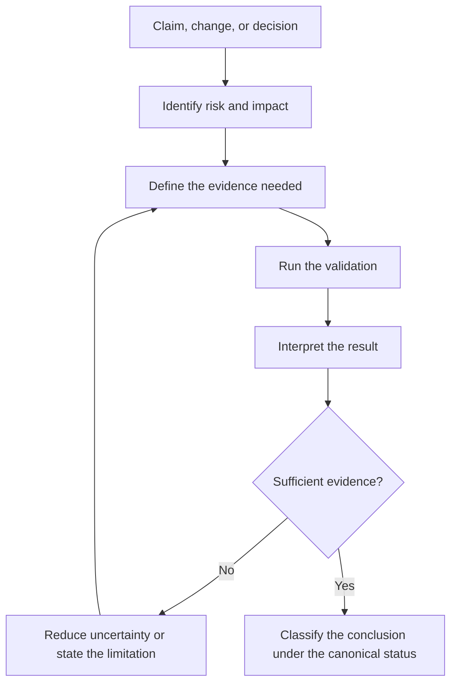
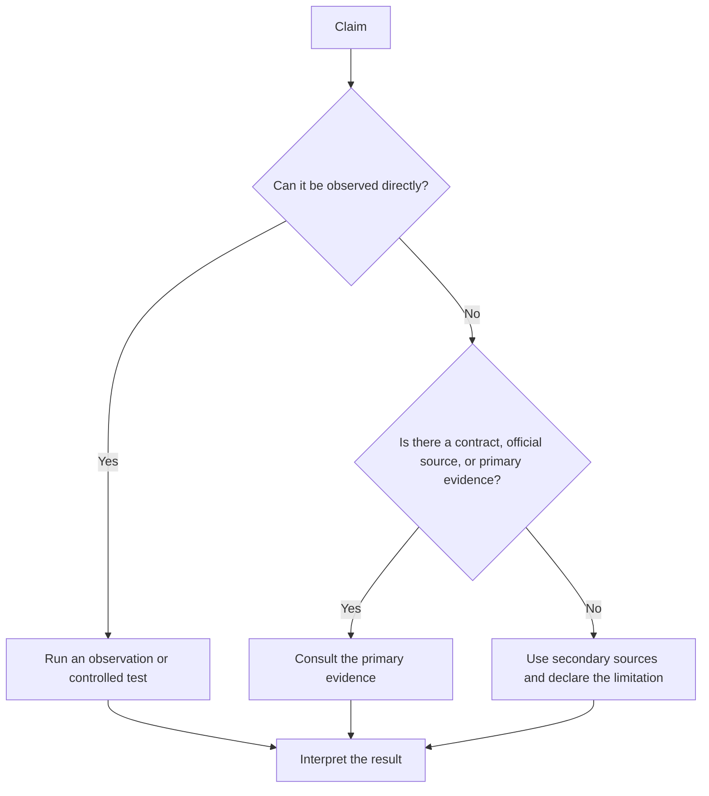

# Verification

## Purpose

Use Verification to confirm that a conclusion, change, answer, or action is correct enough for the context.

The technique exists to avoid errors such as:

- treating a hypothesis as fact;
- trusting a single weak source;
- concluding code works just because it compiles;
- assuming a test passed because it ran;
- validating only the happy path;
- ignoring regressions, side effects, or non-functional requirements;
- presenting a recommendation as certainty when the evidence is insufficient.

Verification is not a mandatory bureaucratic step for every task. It must be proportional to impact, uncertainty, reversibility, and the cost of being wrong (see the effort budget in the [pelizzai-reasoning](../SKILL.md) skill).

## Core principle

> A conclusion is only trustworthy when the evidence behind it matches the risk of the decision.

Do not use subjective confidence as a substitute for validation.


```mermaid
flowchart TD
    A[Claim, change, or decision] --> B[Identify risk and impact]
    B --> C[Define the evidence needed]
    C --> D[Run the validation]
    D --> E[Interpret the result]
    E --> F{Sufficient evidence?}

    F -- No --> G[Reduce uncertainty or state the limitation]
    G --> C

    F -- Yes --> H[Classify the conclusion under the canonical status]
```

## Canonical conclusion status

Every conclusion and every relevant piece of information receives exactly one of these statuses. This is the single set used in frontmatter, in information classification, in the record, and in the final decision — do not introduce local variations.

| Status                | Meaning                                                               | How to communicate                             |
| --------------------- | --------------------------------------------------------------------- | ---------------------------------------------- |
| Confirmed             | Directly observed or backed by evidence sufficient for the risk       | May be stated with matching confidence         |
| Partially confirmed   | Main scenario validated, but known gaps remain                        | State only what is covered; declare the gaps   |
| Inferred              | Conclusion derived from confirmed facts, without sufficient direct proof | Must be presented as an inference           |
| Hypothesis            | Possible explanation not yet validated                                | Must be tested or explicitly flagged           |
| Refuted               | Claim contradicted by evidence                                        | Must not guide the decision without new evidence |
| Blocked               | Could not be validated for lack of access, context, or tooling        | Declare the blocker and what is missing        |
| Inconclusive          | Insufficient or conflicting evidence                                  | Do not force a conclusion; declare the uncertainty |
| Unknown               | Information absent or unverifiable                                    | Must not be invented                           |

Example of information classification:

```text
Confirmed:
- The endpoint returns HTTP 422 when it receives an invalid payload.

Inferred:
- The UI failure most likely stems from a field sent under a different name.

Hypothesis:
- The problem may occur only when the form has an empty optional field.

Unknown:
- Whether external clients consume the same endpoint has not been confirmed.

Refuted:
- The API-unavailability hypothesis was discarded because the route responded normally.
```

When a conclusion is categorized as Hypothesis or Unknown, record and track the assumption with [Assumption Tracking](assumption-tracking.md).

## When to use

Use Verification when the task involves:

- changed code;
- tests, builds, lint, typecheck, or command execution;
- data, numbers, calculations, or metrics;
- files uploaded by the user;
- APIs, integrations, databases, or contracts;
- factual, technical, legal, financial, medical, or time-sensitive research;
- architectural decisions;
- recommendations with relevant impact;
- security, permissions, authentication, or sensitive data;
- irreversible or hard-to-reverse actions;
- conclusions drawn from multiple sources;
- bugs, regressions, or unexpected behavior.

Examples:

```text
- Confirm a feature works after changing frontend and backend.
- Check whether a library supports a given capability.
- Check that a calculation is correct.
- Validate that an API returned the expected format.
- Confirm that a time-sensitive claim still holds.
- Review whether a refactor preserved existing behavior.
- Check whether a recommendation rests on reliable sources.
```

## When to simplify or skip

Do not turn simple tasks into disproportionate validation processes.

Simplify when:

- the task is creative;
- the user supplied all the content needed;
- the answer is conceptual and stable;
- there is no external action, current fact, or relevant risk;
- the change is local, reversible, and easy to inspect;
- no additional validation mechanism would produce useful information.

Examples: rewriting a paragraph, translating a sentence, suggesting names for a project, adjusting formatting, explaining a basic, stable concept.

Even in simple tasks, never invent results, sources, tests, or observations.

## Stop rules

Stop verifying when any condition below is met (mirrors the "Stop when" of the [pelizzai-reasoning](../SKILL.md) skill):

- the evidence gathered is already sufficient for the risk of the decision;
- further validations would repeat the same hypothesis, environment, and input with no information gain;
- the result is blocked by lack of access, context, or tooling — record it as Blocked and communicate;
- the cost of further validation outweighs the cost of being wrong in the context.

## Relationship to other techniques

| Technique           | Role                                                                   |
| ------------------- | ---------------------------------------------------------------------- |
| Plan and Execute    | Defines the plan, steps, dependencies, and checkpoints                 |
| ReAct               | Chooses the next action, observes the result, and updates the state    |
| Verification        | Defines what must be proven and what evidence is sufficient            |
| Critique and Refine | Improves a result when there is an objective criterion or evidence of failure |
| Decision Making     | Chooses between solution paths, including interdependent ones with pruning |

### Integration rule and handoffs

- Use [Plan and Execute](plan-and-execute.md) to define what needs to be done.
- Use [ReAct](react.md) to execute and observe each step.
- Use Verification to decide whether the evidence gathered is sufficient to conclude.
- When validation **fails** or exposes an inconsistency, hand off to [Critique and Refine](critique-and-refine.md) to revise the result.
- When there is a **bug or unexpected behavior** whose cause must be understood, hand off to [Root Cause Analysis](root-cause-analysis.md).
- When **sources conflict** during research validation, hand off to [Evidence Synthesis](evidence-synthesis.md).
- When there are **multiple solution paths with interdependent decisions**, use [Decision Making](decision-making.md) in search mode with pruning and backtracking.

## Evidence hierarchy

Prefer direct, specific, verifiable evidence. From strongest to weakest:

1. direct, reproducible observation;
2. automated test or controlled execution;
3. actual source code, contract, schema, or configuration;
4. up-to-date official documentation;
5. primary source, public data, or official record;
6. reliable secondary source;
7. third-party account;
8. memory, intuition, or supposition.

The strongest evidence depends on the context.

| Question                              | Preferred evidence                                 |
| ------------------------------------- | -------------------------------------------------- |
| "Does this endpoint accept this field?" | Contract, schema, code, or a real call           |
| "Does this feature work?"             | Test, controlled execution, and result inspection  |
| "Does this library support capability X?" | Official documentation and the code of the version in use |
| "Is this calculation correct?"        | Formula, input data, and a reproducible calculation |
| "Is this fact current?"               | Current primary source or recent official source   |
| "Did this change cause a regression?" | Regression test, diff, and observed behavior       |

## Validation proportionality

The depth of verification must be proportional to the risk (Low, Medium, High, Critical — aligned with the effort budget of the [pelizzai-reasoning](../SKILL.md) skill).

| Level    | Characteristics                                                           | Expected validation                                                                          |
| -------- | ------------------------------------------------------------------------- | ------------------------------------------------------------------------------------------- |
| Low      | Local, reversible change with no external impact                          | Direct review and a simple check                                                             |
| Medium   | Functional code, limited integration, or a relevant decision              | Focused tests, review of contracts and side effects                                          |
| High     | Persistent data, security, critical integration, or production            | Comprehensive tests, contract validation, rollback, and independent evidence                 |
| Critical | Financial, legal, medical, sensitive security, or irreversible production | Primary sources, rigorous review, redundant validation, and explicit communication of limits |

Rule of thumb — the higher the cost of being wrong: the stronger the evidence must be; the more independent the validation must be; the more explicit the limitations must be; the more careful the communication of the conclusion must be.

## Validation types by task

Each validation type confirms a different property. The table below crosses task type, minimum validation, and reinforced validation; the following sections detail what each type covers.

| Task type                 | Minimum validation                           | Reinforced validation                               |
| ------------------------- | -------------------------------------------- | --------------------------------------------------- |
| Local code change         | Diff review and a focused test               | Lint, typecheck, and build                          |
| New frontend feature      | Main flow and relevant error                 | Tests, lint, typecheck, and build                   |
| New backend feature       | Route or service test                        | Integration, contract, and error-handling tests     |
| Refactor                  | Existing tests and behavior review           | Regression tests and output comparison              |
| External integration      | Contract and controlled response             | Retry, timeout, failures, and observability         |
| Database migration        | Schema and test data                         | Backup, rollback, performance, and production impact |
| Technical research        | Official documentation                       | Comparison of versions, sources, and limitations    |
| Relevant recommendation   | Explicit criteria                            | Counter-argument, risks, and alternatives           |
| Calculation or report     | Reproduce the result                         | Independent cross-check and input audit             |
| Security                  | Access and input validation                  | Threat review, negative tests, and logs             |

### Structural

Confirms the shape of the result is correct: syntax, types, schema, imports, contracts, payload format, configuration, and file structure (e.g., typecheck passes, the JSON follows the schema, imports exist). Caution: structural validation does not prove correct behavior.

### Behavioral

Confirms the system does what it should: business rules, user flows, API responses, permissions, expected errors, events, and UI states (e.g., an authorized user exports CSV; a user without permission gets the proper response; the system blocks a duplicate submission).

### Regression

Confirms the change did not break existing behavior. Use when fixing a bug, refactoring, changing a contract, swapping a dependency, or touching shared logic, a reused component, authentication, cache, or global state (e.g., previous tests keep passing; the new field does not break existing clients).

### Integration

Confirms distinct components work together: frontend and backend, API and database, queues and workers, external authentication, third-party services, cache, webhooks, and external storage (e.g., the frontend sends a compatible payload; the worker consumes the expected message; the webhook is processed with a valid signature).

### Security

Confirms the result does not expose data, permissions, or dangerous behavior. When applicable, check:

```text
- authentication;
- authorization;
- input validation;
- secret exposure;
- logs with sensitive data;
- excessive permissions;
- injection;
- improper cross-user access;
- safe error handling;
- rate limiting and foreseeable abuse.
```

Do not conclude something is secure just because it showed no functional error. For validation before high-impact actions, see also [Constraint Satisfaction](constraint-satisfaction.md).

### Data and calculations

Use when there are numeric values, spreadsheets, reports, aggregations, filters, indicators, financial calculations, percentages, dates, or conversions. Check the data's origin, period, formula, units, rounding, missing values, duplicates, totals adding up, coherence between result and inputs, and reproducibility.

```text
Bad:
"The total looks right."

Better:
"The total was recalculated from the source rows; the sum checks out, except for item X, which uses different rounding."
```

### Research and external facts

Use for current, technical, legal, medical, financial, or potentially controversial claims. Check the information's date, the source's authority and proximity to the fact, scope and context, conflicts between sources, the technology version, whether the source addresses the exact question, and whether the conclusion is fact or interpretation.

Prioritize official documentation; legislation, official bodies, or primary rulings; scientific papers and public data; official repositories and changelogs; and recognized outlets when primary sources do not exist. Do not use an old source to answer a current question without declaring the limitation.

When **sources conflict**, reconcile with [Evidence Synthesis](evidence-synthesis.md) before concluding.

## Verification by refutation

For high-impact claims, piling up supporting evidence is not enough: derive 1 to 3 questions whose answer would **refute** the conclusion and actively hunt for them. If no refutation holds after a genuine search, confidence rises; if any holds, the conclusion drops to Refuted, Partially confirmed, or Inconclusive.

```text
Conclusion under test:
- "The migration is safe to run in production."

Questions that would refute it:
1. Is there any large unindexed table that would stall under lock during the migration?
2. Does any production client depend on the column being removed?
3. Was the rollback tested, and does it restore the previous state without loss?

Result:
- If any answer is "yes/indeterminate", the conclusion is not Confirmed.
```

## Verification process

### 1. Define the verifiable claim

Turn vague conclusions into testable claims.

```text
Bad:
"The feature is done."

Better:
"A user with permission can export CSV honoring the active filters; users without permission cannot reach the action; applicable tests, lint, and build pass."
```

### 2. Identify the risk of being wrong

Ask: what happens if this conclusion is wrong? Is there impact on data, users, security, or money? Is the action reversible? Who depends on this result? Is there an external integration? Could the error stay hidden for a long time? The answer sets the level of evidence required.

### 3. Choose the right evidence

Choose the smallest validation that is sufficient for the risk.


```mermaid
flowchart TD
    A[Claim] --> B{Can it be observed directly?}
    B -- Yes --> C[Run an observation or controlled test]
    B -- No --> D{Is there a contract, official source, or primary evidence?}
    D -- Yes --> E[Consult the primary evidence]
    D -- No --> F[Use secondary sources and declare the limitation]
    C --> G[Interpret the result]
    E --> G
    F --> G
```

Do not use irrelevant validations. For "a form field is not being saved", running the build is irrelevant; what helps is inspecting the payload sent, checking the API schema, and confirming the response and persistence.

### 4. Execute and record the result

For relevant validations, record compactly in the format below — used both during execution and in the final communication. Never record just "validated" without stating what was checked.

```text
Claim:
- [what is being confirmed]

Validation:
- [test, source, observation, or tool used]

Result:
- [what was observed]

Limitations:
- [what was not verified or remains uncertain]

Conclusion:
- [one canonical status]
```

### 5. Interpret without overreaching

A piece of evidence confirms only what it actually covers. A passing test confirms the tested scenario, but does not automatically confirm every scenario, security, performance, compatibility, absence of regressions, or behavior in production.

```text
Bad:
"The system is secure because login works."

Better:
"The login flow was validated. Authorization, token exposure, rate limiting, and relevant attack scenarios still need assessment."
```

### 6. Decide the conclusion

At the end, assign exactly one of the statuses defined in the **Canonical conclusion status** section.

## Negative validation

Do not validate only the happy path. When applicable, also test invalid input, missing fields, insufficient permissions, duplicate data, timeout, external unavailability, concurrency, empty state, extreme values, unexpected formats, rollback, retry, and attempted misuse.

Negative validation must be proportional to the risk. Not every possible scenario needs testing on every change.

## Validation independence

The higher the risk, the less the validation should rest on the same assumption used in the implementation.

```text
Weak:
- Implement a rule and validate it only by reading your own code.
Stronger:
- Implement the rule, run an independent test, and observe the real result.

Weak:
- Confirm a calculation using the same formula and the same values, unreviewed.
Stronger:
- Recalculate by an independent method or check against the original data source.

Weak:
- Validate a technical claim with a blog post that parrots the documentation.
Stronger:
- Consult the official documentation, changelog, or code of the version in use.
```

## Cross-check via independent runs

Generating N independent attempts at the same question and measuring their convergence is expensive and,
in a single agent, redundant: native extended reasoning already performs that internal consistency check
before answering. Repeating the same question "out loud" three times and counting the majority creates no
evidence — only cost. Do not use convergence between your own attempts as proof.

Cross-checking only adds value when the runs are **genuinely independent** because they come from
distinct agents or lenses, not from the same head in the same turn:

```text
- pelizzai-team / pelizzai-subagents: several members reach the same result by different
  paths (distinct methods, hypotheses, or sources);
- independent reviewers and blind lenses (e.g., the blind spec lens of pelizzai-review, which
  judges the code without the author's narrative);
- recalculation by an independent method or tool against the same data.
```

Hard rule: convergence raises confidence, never replaces validation against external reality.
Agreement between runs that share the same wrong premise is **false convergence** — they are all
wrong together. When independent runs converge, still confirm with a test, contract, official
source, or real data; when they diverge, investigate the premise that splits them with
[Evidence Synthesis](evidence-synthesis.md), without picking the majority.

## Checklists

### Code (base)

```text
[ ] The code compiles or passes the applicable typecheck.
[ ] Imports, types, and contracts were validated.
[ ] The main flow was tested or executed.
[ ] Relevant errors have predictable handling.
[ ] The changes preserve expected behavior.
[ ] No secrets, sensitive data, or improper logs.
[ ] The change introduced no unnecessary dependency, complexity, or side effect.
```

### Frontend

```text
[ ] The UI renders without errors.
[ ] Loading, empty, and error states were considered when applicable.
[ ] Events trigger the expected action.
[ ] Accessibility and semantics were not degraded.
[ ] Requests sent follow the contract.
[ ] Applicable tests, lint, typecheck, and build were run.
```

### Backend

```text
[ ] Input is validated.
[ ] Authorization was considered.
[ ] Success and error responses follow the contract.
[ ] External integrations have proper failure handling.
[ ] Critical operations are idempotent when needed.
[ ] Service, route, or integration tests were run when available.
```

### Research and recommendations

```text
[ ] The real problem was understood.
[ ] The comparison criteria are explicit.
[ ] The sources address the correct version and context.
[ ] The recommendation does not rest on popularity alone.
[ ] Risks, costs, and limitations were considered.
[ ] There is at least one plausible alternative.
[ ] There is a relevant counter-argument.
[ ] The conclusion distinguishes fact, inference, and preference.
```

Recommended format for a recommendation: suggested option; evidence (facts and sources); trade-offs (costs, limitations, risks); counter-argument (scenario where another option would be better); confidence level (high/medium/low) and why.

### Before high-impact actions

Before executing actions that can cause loss, cost, exposure, or hard-to-reverse change (deleting files, altering a database, publishing to production, sending e-mails, modifying permissions, updating infrastructure, running a migration, processing sensitive data, performing transactions):

```text
[ ] The user's goal is explicit.
[ ] The target resource was confirmed.
[ ] The action is necessary and proportional.
[ ] The scope was limited to the minimum necessary.
[ ] There is a backup, rollback, or reversible alternative when applicable.
[ ] Permissions were checked.
[ ] Side impacts were assessed.
[ ] There is a validation method for after the execution.
```

Handle these actions' non-negotiable constraints with [Constraint Satisfaction](constraint-satisfaction.md), and apply **verification by refutation** before proceeding.

## Anti-patterns

1. **Confusing execution with validation.** "I ran the command, so it's correct" → "The command ran without errors, but I still need to check that the result meets the requirement."
2. **Validating only the happy path.** "Signup works because one user was created" → "Validated for valid input, duplicates, required fields, and integration error."
3. **Treating a single source as absolute truth.** "A blog says the library supports this" → "The official documentation for the version in use confirms the support; limitation X applies to environment Y."
4. **Using metrics as full proof.** "Coverage is high, so the code is reliable" → "Coverage shows which scenarios were exercised, but does not prove case quality, security, or rule correctness."
5. **Ignoring contrary evidence.** "The failing test must be wrong" → "Check for a regression, an outdated expectation, or an inconsistent environment before discarding the result."
6. **Declaring certainty where there is a limitation.** "It's fixed" → "The main scenario was validated. The external integration could not be tested because the credentials were unavailable."
7. **Repeating validations with no gain.** Running the same test without changing hypothesis, environment, or input → run a new validation only when there is a new hypothesis, change, or relevant condition.

## Examples

### API change compatible with existing clients

```text
Claim:
- The new `priority` field is compatible with existing clients.

Validation:
1. Confirm the updated contract.
2. Run a test with an old client without the field.
3. Run a test with a new client using the field.
4. Check the behavior with an invalid value.
5. Confirm documentation and schema.

Conclusion:
- Confirmed only if old clients keep working as expected;
  otherwise, Refuted.
```

### End-to-end security validation (restricted export)

```text
Claim:
- The export endpoint only lets authorized users export their own tenant's data.

Risk:
- High (data exposure across customers).

Validation:
1. Authentication: a request without a token is rejected (401).
2. Authorization: a user without the `export` permission gets 403.
3. Isolation: a tenant A user tries to export a tenant B resource -> denied.
4. Input: a malicious filter (injection/forged IDs) is validated and leaks no other tenants.
5. Logs: response and logs contain no secrets or third-party sensitive data.
6. Refutation: is there an alternative route (path, inherited parameter, cache) that skips the check? Search and test.

Result:
- 1 through 5 passed; the search for (6) found no alternative route after inspecting routing and cache.

Limitation:
- Rate limiting under sustained abuse was not tested.

Conclusion:
- Partially confirmed: isolation and authorization confirmed; abuse control pending.
```

## Related techniques

- [Plan and Execute](plan-and-execute.md) — defines the plan, steps, and checkpoints.
- [ReAct](react.md) — executes and observes each step.
- [Critique and Refine](critique-and-refine.md) — revises the result after a failure or inconsistency.
- [Decision Making](decision-making.md) — chooses between solution paths, including interdependent ones with pruning.
- [Evidence Synthesis](evidence-synthesis.md) — reconciles conflicting sources in research validation.
- [Assumption Tracking](assumption-tracking.md) — tracks hypotheses and unknowns.
- [Constraint Satisfaction](constraint-satisfaction.md) — enforces constraints before high-impact actions.

Back to the [technique catalog](../SKILL.md).
