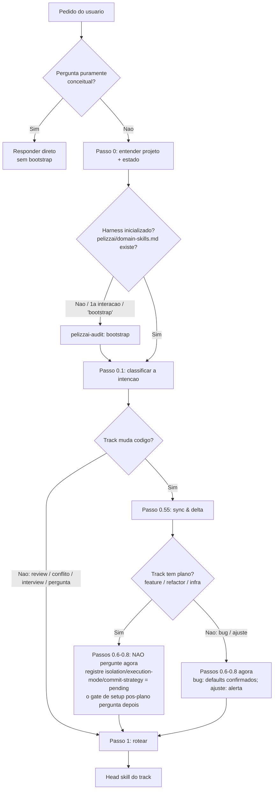
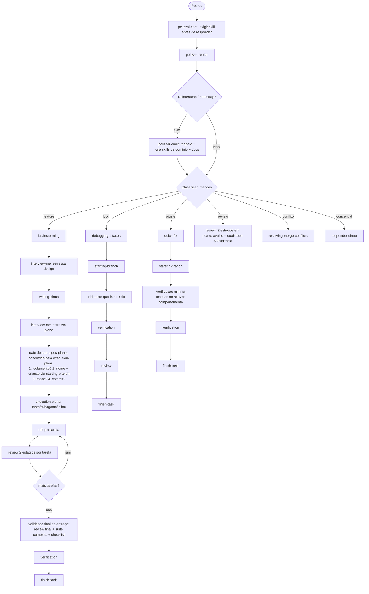

<SUBAGENT-STOP>
Se você foi despachado como subagente/teammate para executar uma tarefa específica, ignore esta skill — o orquestrador já decidiu o contexto para você.
</SUBAGENT-STOP>

# PelizzAI Router

## Objetivo

Ponto de entrada do ciclo de vida de toda tarefa que toca código ou o projeto. Antes de qualquer trabalho criativo, de debugging ou de execução, o router entende o terreno, prepara as decisões de execução e roteia para a skill certa — escolhendo a **menor** combinação de skills que resolve com segurança.

**Anuncie ao iniciar:** "Usando a skill PelizzAI Router para entender a tarefa e preparar o ciclo de trabalho."

> **Princípio:** entender o projeto → ler/criar o estado → classificar a intenção → preparar as decisões de execução (no momento certo de cada track) → rotear. Nunca pule direto para implementar.

---

## Quando usar

```text
- USE no início de QUALQUER pedido que possa tocar código, arquivos, config ou o projeto
  (feature, bug, ajuste, refactor, infra, pedido de review, conflito de merge).
- NÃO use para conversa pura ou pergunta conceitual que não muda nada — responda direto.
  Mas se virar "então muda lá pra mim", volte aqui.
- Isolamento: o usuário ESCOLHE entre branch e worktree (gate humano). Para tracks com plano
  (feature/refactor/infra), a escolha acontece APÓS o plano ser escrito e estressado — no
  GATE DE SETUP PÓS-PLANO (pelizzai-execution-plans). Para bug, branch é o default confirmado
  brevemente; para ajuste, branch direto (alerta, não pergunta).
```

## Camada global: `pelizzai-preferences`

Em paralelo ao track, aplique a `pelizzai-preferences` como **camada global** (idioma, qualidade técnica, segurança, validação, portabilidade, decisões de execução) sempre que a tarefa envolver comunicação, engenharia ou código. Ela **não substitui** as skills específicas — ajusta como o trabalho é feito. Não a acione para tarefas triviais sem risco onde nenhuma preferência mudaria o resultado.

---

## Fluxo do router



---

## Processo

### Passo 0 — Entender o projeto e o estado

Leitura leve do projeto antes de decidir (ferramentas de arquivo e Git, não shell improvisado):

```text
1. É repositório git? (git rev-parse). Se não e a tarefa vai gerar código, ofereça `git init` (não force).
2. Leia o estado do harness: pelizzai/data/state.md.
   - Tarefa ativa real (slug != <none> e phase não-terminal: brainstorm/plan/exec/review)?
     → RETOME sem re-perguntar o registrado; valide a branch contra o git. Com isolation: branch,
       `git branch --show-current` no repositório. Com isolation: worktree, valide pela saída de
       `git worktree list` (caminho + branch numa chamada) ou rode `git branch --show-current`
       DENTRO do worktree-path registrado — no working tree principal ele devolve OUTRA branch
       e geraria divergência falso-positiva.
       Em divergência que arrisque o trabalho — ou após crash/worktree órfão — acione a
       `pelizzai-recovery` (ponto de retorno → menu ao usuário → reconciliar e commitar o
       cursor) antes de prosseguir.
   - slug: <none> ou phase: done → tarefa anterior FECHADA; classifique o pedido novo do zero e
     SOBRESCREVA o bloco da tarefa ativa com os placeholders <…> — uma tarefa nova NUNCA herda
     isolation/execution-mode/commit-strategy da anterior (essas decisões pertencem à tarefa
     que você acabou de fechar; os gates devem perguntar de novo, não reaproveitar em silêncio).
   - phase: blocked → tarefa travada aguardando decisão humana; traga isso à tona antes de começar algo novo.
3. Harness inicializado? Se NÃO existir pelizzai/domain-skills.md (ou for a 1a interação, ou o usuário
   digitou "bootstrap") → roteie para pelizzai-audit (mapeia o projeto, cria skills de domínio e docs)
   ANTES de seguir. A audit cuida do bootstrap; o router cuida do ciclo de cada tarefa.
   Exceção: pergunta puramente conceitual NÃO dispara o bootstrap — responda direto; a audit só
   entra quando a resposta exigir tocar ou entender ESTE projeto.
4. Sugestão/pedido que soa recorrente → confira pelizzai/out-of-scope/ (match por conceito, não por
   keyword) antes de re-litigar; havendo rejeição registrada, traga a razão à tona em vez de reabrir.
```

### Passo 0.1 — Classificar a intenção (um track)

| O usuário quer / diz                                                  | Track       | Head skill (Passo 1)                                       |
| --------------------------------------------------------------------- | ----------- | ---------------------------------------------------------- |
| Construir algo novo; "queria um/uma…", nova feature/tela/endpoint     | `feature`   | `pelizzai-brainstorming`                                   |
| Algo quebrado, erro, "não funciona", "tá com bug"                     | `bug`       | `pelizzai-debugging`                                       |
| Mudança pequena e local (texto, label, cor; ~1 arquivo, < ~50 linhas) | `ajuste`    | `pelizzai-quick-fix`                                       |
| Reestruturar sem mudar comportamento                                  | `refactor`  | arquitetural → `pelizzai-brainstorming`; local → `ajuste` → `pelizzai-quick-fix` |
| Infra/devops/config/deploy                                            | `infra`     | estrutural → `pelizzai-brainstorming`; config simples → `ajuste` → `pelizzai-quick-fix` |
| Revisar trabalho feito / preparar PR / "está bom?"                    | `review`    | `pelizzai-review`                                          |
| Conflito de merge/rebase em andamento; "deu merge conflict"           | —           | `pelizzai-resolving-merge-conflicts`                       |
| Estressar um plano/design EXISTENTE; "me questiona"                   | —           | `pelizzai-interview-me`                                    |
| Pergunta conceitual, sem mudar código                                 | —           | responda direto (não entre no fluxo pesado)               |

Quando ambíguo, pergunte em linguagem simples (uma pergunta). Se o pedido comportar **2-3 leituras materialmente diferentes**, apresente-as com o esforço estimado de cada uma (e o dado medido do estado atual, quando houver) e deixe o usuário escolher — não escolha em silêncio. Em `refactor`/`infra` pequeno que vai pelo caminho leve, **registre `track: ajuste`** para os gates do ajuste valerem.

### Passo 0.5 — Adaptar ao usuário (audience)

Se o usuário parece não-técnico, **traduza** o que entendeu: "Entendi que você quer **X**. Vou tratar como **<feature/ajuste/bug>**. Faz sentido?" Não despeje jargão (siga a `pelizzai-writing-clearly-and-concisely`). Registre `audience: technical | layperson` no `state.md`.

### Passo 0.55 — Sync & delta (reposcan) — só tracks que mudam código

Este é o momento **Observar** do ciclo OODA do harness (`pelizzai-loop`): cada tarefa começa da realidade atual, não de um snapshot velho.

```bash
git fetch                                          # pule se não houver remoto
git log --oneline --since="<ultima_data> 00:00"    # commits desde a última tarefa
git log --oneline HEAD..origin/<base> 2>/dev/null  # o que a base remota avançou
```

Releia só o que mudou e importa para esta tarefa. Para um `bug`, um commit recente na área que falha é suspeito nº 1 — leve para a `pelizzai-debugging` Fase 1. Fique em silêncio se nada material mudou.

### Passos 0.6–0.8 — Decisões de setup (isolamento, modo de execução, estratégia de commit)

**O momento certo depende do track:**

```text
- feature / refactor arquitetural / infra estrutural (tracks COM plano):
  NÃO pergunte nada agora — depois do plano você (e o usuário) saberão se há frentes paralelas,
  o que muda a recomendação de worktree e de team. Registre os placeholders:
  isolation: <pending> | execution-mode: <pending> | commit-strategy: <pending>.
  Quem pergunta é o GATE DE SETUP PÓS-PLANO da pelizzai-execution-plans (as 4 perguntas, em ordem:
  isolamento → nome da branch/worktree → modo de execução → estratégia de commit).

- bug: defaults naturais, confirmados BREVEMENTE em uma mensagem (não o menu completo):
  isolation: branch | execution-mode: inline (debugging roda inline; nunca paralelize um bug)
  | commit-strategy: pergunte (menu do 0.8). Se o usuário quiser worktree, atenda.

- ajuste: sem pergunta de isolamento — registre isolation: branch e apenas AVISE:
  "Como é um ajuste pontual, vou trabalhar numa branch (sem worktree)."
  execution-mode: inline (confirme brevemente) | commit-strategy: pergunte (menu do 0.8).
```

Os **menus canônicos** das três decisões moram na `pelizzai-execution-plans` (Gate de setup pós-plano) — use-os de lá ao perguntar aqui (bug/ajuste). Em resumo:

**0.6 — Isolamento:** `branch` (troca no lugar; recomendado para a maioria) ou `worktree` (cópia isolada em outra pasta; recomende quando há partes independentes que rodariam em paralelo). Registre `isolation`. Quem **cria** a branch/worktree é a `pelizzai-starting-branch` (que também sugere o nome `<tipo>/<slug>`).

**0.7 — Modo de execução:** `team` / `subagents` / `inline` — **sempre com as TRÊS opções visíveis**, preferência **team > subagents > inline**, proporcional ao trabalho. Nota: escrita paralela real requer `isolation: worktree` com caminhos disjuntos; em `branch`, o coordenador integra as escritas em série — diga isso ao recomendar. Registre `execution-mode`.

**0.8 — Estratégia de commit:** `granular` (um commit definitivo por tarefa/passo, mantido no fim) ou `squash-final` (commits de trabalho e UM commit consolidado no fechamento) — **pergunte e aguarde a resposta**; registre `commit-strategy`. A escolha é **honrada até o fim**: `granular` NÃO ganha squash no fechamento (a `pelizzai-finish-task` não re-pergunta); `squash-final` já autoriza a consolidação final.

### Passo 1 — Rotear para a head skill (com os encadeamentos)

Invoque a head skill do track e **passe o contexto** (o que entendeu, a stack, o estado, as **skills de domínio presentes** e o **audience**):

```text
feature → pelizzai-brainstorming → interview-me (estressa o design) → pelizzai-writing-plans
          → interview-me (estressa o plano) → GATE DE SETUP PÓS-PLANO (pelizzai-execution-plans:
          isolamento → pelizzai-starting-branch → modo de execução → commit-strategy)
          → pelizzai-execution-plans (executa; loop OODA por tarefa)
          → validação final da entrega (review final + suite completa + checklist do plano)
          → pelizzai-verification-before-completion → pelizzai-finish-task
bug     → pelizzai-debugging (inline; chama starting-branch antes do fix; encadeia review + finish-task)
ajuste  → pelizzai-quick-fix (starting-branch → mudança + verificação mínima (teste só se houver
          comportamento) → verification-before-completion → commit conforme a estratégia → finish-task)
refactor→ arquitetural: cadeia de feature (refactor que preserva comportamento na pelizzai-tdd);
          local: registrado como ajuste → pelizzai-quick-fix
infra   → estrutural: cadeia de feature; config simples: registrado como ajuste → pelizzai-quick-fix
review  → pelizzai-review (2 estágios por tarefa de plano; pedido avulso = estágio de qualidade
          com evidência fresca)
conflito de merge/rebase → pelizzai-resolving-merge-conflicts
plano/design existente p/ estressar → pelizzai-interview-me (depois writing-plans, ou volta ao brainstorming)
pergunta conceitual → responda direto (não dispara bootstrap; a pelizzai-audit só entra quando
          a resposta exigir tocar ou entender o projeto)
```

---

## Mapa de fluxos do harness



> O `pelizzai-loop` dá a lente do laço: o ciclo **OODA** (Observar → Orientar → Decidir → Agir) repetido até a Definition of Done; em dúvida material, o harness para e usa a `pelizzai-interview-me`.

---

## O que o router registra em `pelizzai/data/state.md`

Se `pelizzai/data/state.md` não existir, instancie-o a partir do template da `pelizzai-execution-plans` antes de gravar. Campos: `slug`, `track`, `phase` inicial, `isolation` (`<pending>` nos tracks com plano; `branch` em bug/ajuste), `execution-mode` (`<pending>` ou o confirmado), `commit-strategy` (Passo 0.8 ou `<pending>`), `audience` (Passo 0.5), `plan` (quando a writing-plans informa o caminho), `project` (em workspace), e uma linha datada no `## Histórico`. Sobrescreva o bloco da tarefa ativa por inteiro. O fechamento é da `pelizzai-finish-task`.

---

## Red flags

```text
Nunca: pular o Passo 0 e implementar sem entender o projeto; criar a branch/worktree aqui (é da
       starting-branch — o router decide/registra, não executa); decidir o isolamento sem perguntar
       quando não há decisão registrada (EXCETO no track ajuste, que é branch com alerta);
       oferecer worktree/paralelismo num ajuste pontual; reaproveitar em silêncio as decisões da
       tarefa anterior (tarefa nova = perguntas de novo); registrar commit-strategy sem perguntar;
       forçar o fluxo pesado de feature num ajuste trivial; despejar jargão num usuário não-técnico.
Sempre: na 1a interação, rotear para pelizzai-audit (bootstrap — exceto pergunta puramente
        conceitual, que se responde direto); para tracks que mudam código, fazer o
        Passo 0.55; nos tracks com plano, deixar isolamento/modo/commit para o gate pós-plano
        (registrando <pending>); apresentar o menu do modo de execução SEMPRE com as três opções
        (team, subagents, inline); passar o contexto entendido à head skill; aplicar
        pelizzai-preferences como camada global.
```

---

## Integração

**Chamada por:** `pelizzai-core` (raiz), no início de toda tarefa que toca código/projeto.

**Decide/roteia para:** `pelizzai-audit` (bootstrap), `pelizzai-starting-branch` (executa o isolamento decidido), `pelizzai-brainstorming` / `pelizzai-debugging` / `pelizzai-quick-fix` / `pelizzai-review` / `pelizzai-resolving-merge-conflicts` (head skills), `pelizzai-recovery` (divergência state.md×git na retomada), `pelizzai-execution-plans` (conduz o gate de setup pós-plano e honra as decisões registradas).

**Camada global:** `pelizzai-preferences`. **Combina com:** `pelizzai-loop` (lente OODA do ciclo), `pelizzai-finish-task` (fecha o ciclo e atualiza o state.md que o router criou).
