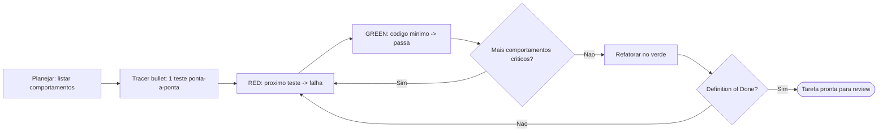

# PelizzAI TDD

## Objetivo

Usar um teste comportamental como instrumento de design e prova. TDD é o default de toda tarefa de
código: ao implementar cada tarefa de um plano e sempre que um membro despachado escreve código, o
ciclo é red → green → refactor por fatia vertical. Quando o efeito da tarefa não é comportamental, o
gate abaixo nomeia a prova correta — a exceção é declarada, nunca improvisada.

**Anuncie ao iniciar:** "Usando a skill PelizzAI TDD para implementar este comportamento em red → green → refactor."

## Gate de adequação

Use TDD quando todas forem verdadeiras:

```text
[ ] Existe comportamento observável novo, alterado ou quebrado.
[ ] Há interface/seam adequado para exercitá-lo sem acoplar o teste à implementação.
[ ] O teste automatizado reduz risco de regressão e é mais estável que o detalhe testado.
```

Caso contrário, use a estratégia selecionada por `pelizzai-reasoning` e registrada no plano:

| Efeito | Estratégia correta |
| --- | --- |
| Refatoração sem mudança comportamental | cobertura/suíte de caracterização verde antes; refatorar no verde; mesma suíte depois |
| Configuração ou IaC | validator/plan/dry-run da ferramenta e checagem de compatibilidade/rollback |
| Migração | validação de schema, dry-run/ambiente descartável, forward/rollback conforme suporte |
| UI puramente visual | `pelizzai-frontend` + navegador/screenshot em viewports e estados relevantes |
| Documentação/copy | lint, links, exemplos, build/render ou inspeção estática proporcional |
| Código gerado/vendor | validar fonte/gerador e regeneração determinística; não testar o artefato como código autoral |

Combinações são normais: um formulário usa TDD para submissão/erros **e** `pelizzai-frontend` para aparência, acessibilidade e responsividade.

Não se auto-classifique uma mudança de comportamento como "cosmética" ou "config" para escapar do
ciclo: a exceção vale pelo efeito real do artefato, não pela pressa.

---

## Princípio de teste

Teste comportamento por interface pública, não detalhes internos. O teste deve sobreviver a uma refatoração que preserve o contrato.

Prefira integração fina ou tracer bullet que percorra o caminho real. Use mocks somente em fronteiras externas caras, lentas ou não determinísticas; não simule colaboradores internos para validar a forma do código. Consulte [tests.md](tests.md) e [mocking.md](mocking.md) quando precisar de exemplos.

## Antipadrão: Fatias Horizontais

**NÃO escreva todos os testes primeiro para depois escrever toda a implementação.** Isso é "fatiamento horizontal" — tratar o estado VERMELHO (RED) como "escrever todos os testes" e o estado VERDE (GREEN) como "escrever todo o código".

Isso gera **testes ruins**:

- Testes escritos em lote testam comportamentos _imaginados_, não comportamentos _reais_
- Você acaba testando a _forma_ das coisas (estruturas de dados, assinaturas de funções) em vez do comportamento visível ao usuário
- Os testes tornam-se insensíveis a mudanças reais: passam quando o comportamento quebra e falham quando o comportamento está correto
- Você avança além da sua visibilidade, comprometendo-se com a estrutura de testes antes de compreender a implementação

**Abordagem correta**: fatias verticais via _tracer bullets_ (testes que percorrem todo o caminho real do sistema). Um teste → uma implementação → repetir. Cada teste responde ao que você aprendeu no ciclo anterior. Como você acabou de escrever o código, sabe exatamente qual comportamento é importante e como verificá-lo.

```
ERRADO (horizontal):
  RED:   test1, test2, test3, test4, test5
  GREEN: impl1, impl2, impl3, impl4, impl5

CERTO (vertical):
  RED→GREEN: test1→impl1
  RED→GREEN: test2→impl2
  RED→GREEN: test3→impl3
  ...
```

## Preparação mínima

Antes do primeiro teste:

```text
1. Consumidor: leia `pelizzai/domain-skills.md` e carregue as skills de domínio do comportamento em
   teste — os padrões do projeto prevalecem sobre os genéricos; membro despachado já as recebe no
   briefing. Source mode: use regras/skills do repo-fonte.
2. Obtenha o comando canônico em `pelizzai/profile.md`, quando existir, ou no manifest/script real;
   nunca chute (`npm test` num projeto pnpm é o antipadrão).
3. Explore o código da área e respeite as ADRs vigentes.
4. Confirme contrato, comportamento e seam no pedido/aceite; use spec/plano quando existirem.
5. Para API externa incerta, derive a versão instalada e consulte Context7; use documentação
   oficial atual como fallback.
```

**Acorde os seams antes dos testes: nenhum teste é escrito num seam não confirmado.** Em fluxo de
feature, os seams já vêm da spec aprovada (`pelizzai-brainstorming`, estratégia de validação e seams
reais) — confirme-os; fora dele, acorde-os aqui, com o vocabulário de `pelizzai-codebase-design`.

Ao acordar o seam, identifique oportunidades de módulos profundos (interface simples, implementação
robusta) usando o vocabulário de `pelizzai-codebase-design` e a *Structured Decomposition* de
`pelizzai-reasoning` para mapear comportamentos e testabilidade; em design novo, isso já vem da
`pelizzai-brainstorming`.

Se o seam necessário não existe, isso é sinal arquitetural. Não contorça o teste: registre a lacuna e use `pelizzai-improving-architecture` quando ela exigir mudança de design.

Qualquer lacuna material — interface a alterar, comportamento esperado, seam, critério de aceite —
para o trabalho e vai para `pelizzai-interview-me`, uma pergunta por vez. Não preencha por
convenção, default ou inferência razoável; também não reabra decisão já aprovada.

---

## Plano de teste na borda (antes do primeiro RED)

**Não é possível testar tudo.** Confirme com o usuário exatamente quais comportamentos são mais
relevantes e concentre o esforço em caminhos críticos e lógica complexa, não em todo caso de borda
imaginável. Os comportamentos e seams a testar não começam por suposição: apresente o plano de teste
na borda e **obtenha a aprovação do usuário** antes do primeiro RED. A escolha de comportamentos e
seams continua sua (o desenho é preservado); ela vira recomendação a ratificar, não decisão aplicada
em silêncio.

```text
Plano de teste proposto (responda "ok" ou ajuste):
- Comportamentos por fatia: <lista ordenada de comportamentos observáveis, um por fatia>
- Seams: <interface/fronteira que exercita cada um sem acoplar à implementação>
- Fora de escopo: <o que este ciclo não cobre>
```

A pergunta canônica do planejamento: "Qual é a interface pública, e em quais seams vamos testar?
Quais comportamentos são mais importantes?"

Dispensam este gate — sem "obviedade" autodeclarada:

```text
- spec/plano ratificado que já aprovou os comportamentos e seams desta tarefa (não reabra);
- caminho leve: teste único de regressão (`pelizzai-debugging`) ou teste mínimo de ajuste
  (`pelizzai-quick-fix`), onde o comportamento-alvo já está fixado pela causa raiz ou pelo
  critério do ajuste;
- briefing fechado (SUBAGENT-STOP): aplique o briefing, não abra gates e escale ao coordenador
  o que exigir decisão.
```

O gate de adequação (acima) permanece: se TDD não é a estratégia certa, ele decide isso antes.

---

## Ciclo por fatia vertical

### 1. RED

Escreva **um** teste para **um** comportamento observável. Rode-o e confirme:

```text
- falha pelo motivo esperado;
- falha no código de produção, não por fixture/import/setup quebrado;
- passaria somente se o comportamento existisse.
```

Teste que já passa não provou a regressão nem guiou a implementação. Corrija o teste/seam antes de seguir.

### 2. GREEN

Implemente o mínimo coerente para satisfazer o comportamento. Rode o teste e leia exit code/contagem. Não antecipe casos futuros nem misture refator amplo.

### 3. Próxima fatia

Repita um comportamento por vez. Não escreva todos os testes primeiro para depois escrever toda a implementação; isso congela uma forma imaginada antes do aprendizado do ciclo anterior.

### 4. REFACTOR

Somente no verde — nunca refatore no VERMELHO:

```text
- remova duplicação;
- melhore nomes e fronteiras;
- aprofunde módulos quando simplificar a interface;
- rode a suíte relevante após cada passo.
```

Use [refactoring.md](refactoring.md) para candidatos. Refatoração pode acontecer dentro do ciclo, mas uma tarefa cujo único efeito é refatorar não precisa fabricar RED: ela começa e termina com caracterização verde.

## Ciclo de TDD (visão geral)



---

## Checklist por ciclo

```text
[ ] O teste descreve o contrato observável, não a implementação.
[ ] Usa a interface/seam acordado, sem detalhe privado.
[ ] O teste resistiria a uma refatoração interna que preserve o contrato.
[ ] O RED foi observado pela razão esperada.
[ ] O GREEN foi observado com saída fresca.
[ ] O código adicionado é proporcional ao comportamento atual.
[ ] Nenhuma funcionalidade especulativa entrou.
```

Para bug de regressão, `pelizzai-verification-before-completion` exige a prova reforçada: verde com o fix, falha ao remover/reverter somente o fix, verde após restaurá-lo.

## Quando um teste falha inesperadamente

Não invoque RCA por reflexo:

```text
- causa direta explícita → ReAct + Verification;
- bug determinístico com causa incerta → RCA leve;
- flaky/recorrente/distribuído → RCA + síntese de evidência;
- dano ativo → contenção reversível primeiro.
```

Siga a triagem de `pelizzai-debugging`.

## Integração no harness

**Quando o TDD entra:**

- Diretamente, quando o usuário desenvolve test-first ou corrige um bug — escreva primeiro o teste de regressão que reproduz o bug.
- Como **disciplina por tarefa** ao executar um plano: a `pelizzai-execution-plans` conduz tarefa a tarefa (team, subagentes ou inline) e aplica a estratégia registrada — TDD por padrão na tarefa de código, sem forçá-lo onde o efeito não é comportamental.
- Por **membros de `pelizzai-team` / `pelizzai-subagents`**: cada membro que escreve código implementa sua frente via TDD.
- `pelizzai-writing-plans` registra a estratégia de prova por tarefa: TDD é o default da tarefa de código e o gate de adequação nomeia a exceção quando o efeito não é comportamental.
- `pelizzai-debugging` usa regressão red→green quando há comportamento automatizável.
- `pelizzai-frontend` continua obrigatório para UI mesmo quando os testes de componente passam.
- `pelizzai-verification-before-completion` valida o resultado completo antes de qualquer alegação.

**Raciocínio — `pelizzai-reasoning`:**

- Planejamento: liste os comportamentos com *Structured Decomposition* (comportamentos, não passos de implementação).
- Teste vermelho inesperado ou bug: triagem de `pelizzai-debugging` antes de mexer no código.
- Estado verde: *Verification* confirma que o comportamento existe de fato — não basta "passou".

**Loop até a entrega — `pelizzai-loop` (OODA):**

- O ciclo RED→GREEN é um loop: repita teste→código por comportamento até a *Definition of Done* (comportamentos críticos testados e verdes, refatorado no verde).
- No nível da tarefa/plano, o harness mantém o loop **OODA** (observar a evidência fresca → orientar contra o plano → decidir → agir) até a tarefa ser entregue com êxito. Em dúvida material, **pare** e use `pelizzai-interview-me`.

**Aprovação e conclusão:**

- Confirme interface, comportamentos e seams com `pelizzai-interview-me`, ou no design aprovado da `pelizzai-brainstorming`, antes de escrever testes.
- Antes de declarar pronto, passe pela `pelizzai-verification-before-completion` e pela `pelizzai-review` (exceção: o track **ajuste** dispensa o review formal por escopo trivial — ver `pelizzai-quick-fix`; a verificação vale sempre).

> TDD é a disciplina padrão do comportamento — não uma prova universal de qualidade para artefato sem comportamento automatizável.
