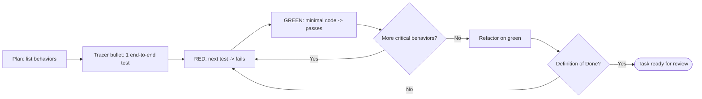

# PelizzAI TDD

## Goal

Use a behavioral test as an instrument of design and proof. TDD is the default for every code
task: when implementing each task of a plan and whenever a dispatched member writes code, the
cycle is red → green → refactor per vertical slice. When the task's effect is not behavioral, the
gate below names the correct proof — the exception is declared, never improvised.

**Announce at start**, in the conversation's language: that you are using the PelizzAI TDD skill to implement this behavior red → green → refactor. The brand spelling "PelizzAI" and the skill's name stay as written; the rest of the sentence follows the conversation.

## Suitability gate

Use TDD when all of these are true:

```text
[ ] There is new, changed, or broken observable behavior.
[ ] There is a suitable interface/seam to exercise it without coupling the test to the implementation.
[ ] The automated test reduces regression risk and is more stable than the detail under test.
```

Otherwise, use the strategy recorded in the plan:

| Effect | Correct strategy |
| --- | --- |
| Refactor with no behavioral change | green characterization coverage/suite first; refactor on green; same suite after |
| Configuration or IaC | the tool's validator/plan/dry-run plus compatibility/rollback checks |
| Migration | schema validation, dry-run/disposable environment, forward/rollback as supported |
| Purely visual UI | `pelizzai-interface` + browser/screenshot across relevant viewports and states |
| Documentation/copy | lint, links, examples, build/render, or proportional static inspection |
| Generated/vendor code | validate the source/generator and deterministic regeneration; do not test the artifact as authored code |

Combinations are normal: a form uses TDD for submission/errors **and** `pelizzai-interface` for appearance, accessibility, and responsiveness.

Do not self-classify a behavioral change as "cosmetic" or "config" to escape the cycle: the
exception holds by the artifact's real effect, not by haste.

---

## Testing principle

Test behavior through the public interface, not internal details. The test must survive a refactor that preserves the contract.

Prefer thin integration or a tracer bullet that walks the real path. Use mocks only at external boundaries that are expensive, slow, or non-deterministic; do not simulate internal collaborators to validate the code's shape. See [tests.md](tests.md) and [mocking.md](mocking.md) when you need examples.

## Anti-pattern: Horizontal Slices

**Do NOT write all the tests first and then write all the implementation.** That is "horizontal slicing" — treating the RED state as "write all the tests" and the GREEN state as "write all the code".

It produces **bad tests**:

- Tests written in batch test _imagined_ behaviors, not _real_ behaviors
- You end up testing the _shape_ of things (data structures, function signatures) instead of user-visible behavior
- The tests become insensitive to real changes: they pass when the behavior breaks and fail when the behavior is correct
- You advance beyond your visibility, committing to a test structure before understanding the implementation

**Correct approach**: vertical slices via _tracer bullets_ (tests that walk the system's entire real path). One test → one implementation → repeat. Each test responds to what you learned in the previous cycle. Since you just wrote the code, you know exactly which behavior matters and how to verify it.

```text
WRONG (horizontal):
  RED:   test1, test2, test3, test4, test5
  GREEN: impl1, impl2, impl3, impl4, impl5

RIGHT (vertical):
  RED→GREEN: test1→impl1
  RED→GREEN: test2→impl2
  RED→GREEN: test3→impl3
  ...
```

## Minimal preparation

Before the first test:

```text
1. Consumer: read `pelizzai/domain-skills.md` and load the domain skills for the behavior under
   test — project patterns prevail over generic ones; a dispatched member already receives them in
   the briefing. Source mode: use the source repo's rules/skills.
2. Get the canonical command from `pelizzai/profile.md`, when it exists, or from the real
   manifest/script; never guess (`npm test` in a pnpm project is the anti-pattern).
3. Explore the area's code and respect the ADRs in force.
4. Confirm contract, behavior, and seam in the request/acceptance criteria; use the spec/plan when they exist.
5. For an uncertain external API, derive the installed version and consult Context7; use current
   official documentation as fallback.
```

**Agree the seams before the tests: no test is written on an unconfirmed seam.** In a feature
flow, the seams already come from the approved spec (`pelizzai-discovery`, validation strategy,
and real seams) — confirm them; outside it, agree them here, with the vocabulary of
`pelizzai-module-design`.

While agreeing the seam, identify opportunities for deep modules (simple interface, robust
implementation) using the vocabulary of `pelizzai-module-design` and *structured decomposition* to map
behaviors and testability; in new design, this already comes from
`pelizzai-discovery`.

If the needed seam does not exist, that is an architectural signal. Do not contort the test: record the gap and use `pelizzai-architecture` when it requires a design change.

Any material gap — an interface to change, expected behavior, a seam, an acceptance criterion —
halts the work and goes to `pelizzai-interview`, one question at a time. Do not fill it by
convention, default, or reasonable inference; also do not reopen an already-approved decision.

---

## Test plan at the edge (before the first RED)

**You cannot test everything.** Confirm with the user exactly which behaviors matter most and
focus the effort on critical paths and complex logic, not on every imaginable edge case. The
behaviors and seams to test do not start from assumption: present the test plan at the edge and
**get the user's approval** before the first RED. Choosing behaviors and seams remains your job
(the design is preserved); it becomes a recommendation to ratify, not a decision applied in
silence.

```text
Proposed test plan (answer "ok" or adjust):
- Behaviors per slice: <ordered list of observable behaviors, one per slice>
- Seams: <interface/boundary that exercises each one without coupling to the implementation>
- Out of scope: <what this cycle does not cover>
```

The canonical planning question: "What is the public interface, and on which seams will we test?
Which behaviors matter most?"

**A predicate with N conditions demands N scenarios, one per condition.** A test that only
exercises the conditions together proves the SET, not each condition: drop any one condition from
the predicate and the combined scenario still refuses, so the mutant survives — and the survival
is invisible precisely because mutation WAS run. Define a baseline case; for each condition, add
one scenario that changes ONLY that condition, holding the others at values that make the
observable result depend on it, and assert the expected result of every scenario. The extra
scenarios are the price of knowing which condition each test actually holds.

Waived from this gate — with no self-declared "obviousness":

```text
- a ratified spec/plan that already approved this task's behaviors and seams (do not reopen);
- light path: a single regression test (`pelizzai-diagnose`) or a minimal tweak test
  (`pelizzai-quick-fix`), where the target behavior is already fixed by the root cause or by the
  tweak's criterion;
- closed briefing (SUBAGENT-STOP / TEAM-MEMBER-STOP): apply the briefing, do not open gates, and escalate to the
  coordinator whatever requires a decision.
```

The suitability gate (above) still stands: if TDD is not the right strategy, it decides that first.

---

## Cycle per vertical slice

### 1. RED

Write **one** test for **one** observable behavior. Run it and confirm:

```text
- it fails for the expected reason;
- it fails in production code, not from a broken fixture/import/setup;
- it would pass only if the behavior existed.
```

A test that already passes has neither proven the regression nor guided the implementation. Fix the test/seam before moving on.

**An observed RED is necessary, not sufficient.** It proves the test failed BEFORE the
implementation existed; it does not prove the test fails again if the implementation is replaced
by a wrong one. Record, next to the RED, the discriminating evidence in one line —
`kills: <the wrong implementation it rejects>` — because that is the proof the plan's completion
criterion contracts and the reviewer will demand. Mutation details are required only when the
chosen means IS a controlled mutation; a preserved RED or an editor reversion carries the same
`kills:` line with no mutation to describe
(`pelizzai-verify` accepts the same safe means at the seal: preserved RED, controlled mutation,
or reversion in the editor — and whichever means is used, the `kills:` line names what was
rejected; evidence that names nothing does not discriminate).

### 2. GREEN

Implement the minimum coherent code to satisfy the behavior. Run the test and read the exit code/counts. Do not anticipate future cases or mix in a broad refactor.

### 3. Next slice

Repeat, one behavior at a time. Do not write all the tests first and then all the implementation; that freezes an imagined shape before the previous cycle's learning.

### 4. REFACTOR

Only on green — never refactor on RED:

```text
- remove duplication;
- improve names and boundaries;
- deepen modules when it simplifies the interface;
- run the relevant suite after each step.
```

Use [refactoring.md](refactoring.md) for candidates. Refactoring can happen inside the cycle, but a task whose only effect is to refactor does not need to fabricate a RED: it starts and ends with green characterization.

## TDD cycle (overview)


```mermaid
flowchart LR
    P[Plan: list behaviors] --> T[Tracer bullet: 1 end-to-end test]
    T --> R[RED: next test -> fails]
    R --> G[GREEN: minimal code -> passes]
    G --> C{More critical behaviors?}
    C -- Yes --> R
    C -- No --> RF[Refactor on green]
    RF --> D{Definition of Done?}
    D -- No --> R
    D -- Yes --> done([Task ready for review])
```

---

## Checklist per cycle

```text
[ ] The test describes the observable contract, not the implementation.
[ ] It uses the agreed interface/seam, with no private detail.
[ ] The test would survive an internal refactor that preserves the contract.
[ ] The RED was observed for the expected reason.
[ ] The GREEN was observed with fresh output.
[ ] The added code is proportional to the current behavior.
[ ] No speculative functionality got in.
```

For a regression bug, `pelizzai-verify` requires the reinforced proof that the test detects the
defect, by any of the same safe means the seal accepts — a preserved RED, a controlled mutation
the test kills, or the reversion cycle (green with the fix → failing with only the fix
removed/reverted → green after restoring it) — always with the `kills:` line naming the rejected
implementation. The three are equivalent forms of one requirement, not competing bars.

## When a test fails unexpectedly

Do not invoke RCA by reflex:

```text
- explicit direct cause → ReAct + Verification;
- deterministic bug with uncertain cause → light RCA;
- flaky/recurring/distributed → RCA + evidence synthesis;
- active damage → reversible containment first.
```

Follow the triage in `pelizzai-diagnose`.

## Harness integration

**When TDD comes in:**

- Directly, when the user develops test-first or fixes a bug — first write the regression test that reproduces the bug.
- As a **per-task discipline** when executing a plan: `pelizzai-execute` drives task by task (team, subagents, or inline) and applies the recorded strategy — TDD by default for the code task, without forcing it where the effect is not behavioral.
- By **`pelizzai-team` / `pelizzai-subagents` members**: every member who writes code implements their workstream via TDD.
- `pelizzai-plan` records the proof strategy per task: TDD is the code task's default and the suitability gate names the exception when the effect is not behavioral.
- `pelizzai-diagnose` uses red→green regression when there is automatable behavior.
- `pelizzai-interface` remains mandatory for UI even when component tests pass.
- `pelizzai-verify` validates the complete result before any claim.

**Reasoning:**

- Planning: list the behaviors with *Structured Decomposition* (behaviors, not implementation steps).
- Unexpected red test or bug: `pelizzai-diagnose` triage before touching the code.
- Green state: *Verification* confirms the behavior actually exists — "it passed" is not enough.

**Loop until delivery — `pelizzai-loop` (OODA):**

- The RED→GREEN cycle is a loop: repeat test→code per behavior until the *Definition of Done* (critical behaviors tested and green, refactored on green).
- At the task/plan level, the harness keeps the **OODA** loop (observe the fresh evidence → orient against the plan → decide → act) until the task is delivered successfully. On material doubt, **stop** and use `pelizzai-interview`.

**Approval and completion:**

- Confirm interface, behaviors, and seams with `pelizzai-interview`, or in the approved `pelizzai-discovery` design, before writing tests.
- Before declaring done, go through `pelizzai-verify` and `pelizzai-review` (exception: the **tweak** track waives the formal review for trivial scope — see `pelizzai-quick-fix`; verification always applies).

> TDD is the default discipline for behavior — not a universal quality proof for an artifact with no automatable behavior.
