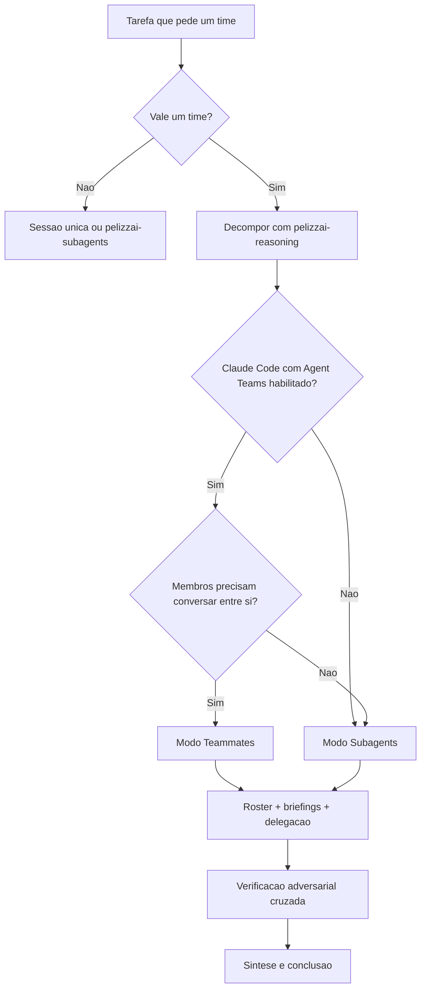

# PelizzAI Team

## Objetivo

Coordenar **vários agentes trabalhando como um time** em uma mesma tarefa, com um **coordenador** que entende o papel de cada membro, delega corretamente, acompanha o progresso, verifica os resultados e os sintetiza em uma entrega única.

Esta skill funciona em **dois modos** e escolhe o adequado automaticamente:

- **Modo Teammates** — usa o recurso nativo **Agent Teams** do Claude Code (teammates reais, independentes, que conversam entre si). Disponível apenas no Claude Code e somente quando o recurso está habilitado.
- **Modo Subagents** — quando o Agent Teams não está disponível, monta um time equivalente com **subagents** (ferramenta `Agent`/`Task`), com o coordenador suprindo a infraestrutura de coordenação e comunicação.

O protocolo de coordenação e delegação é **o mesmo nos dois modos**; muda apenas a mecânica de execução.

**Anuncie ao iniciar:** "Usando a skill PelizzAI Team para coordenar um time de agentes."

<MEMBRO-DO-TIME-STOP>
Se você foi designado como **membro** de um time (teammate ou subagente executando uma subtarefa), **não acione esta skill** para criar um sub-time. Não há times aninhados. Execute sua subtarefa, acione `pelizzai-reasoning` para raciocinar sobre ela, **aplique as skills de domínio coladas no seu briefing** (elas prevalecem sobre padrões genéricos) e a camada global `pelizzai-preferences`, e devolva o entregável no formato combinado no seu briefing. **Não commite** — a consolidação (commit) é do coordenador, após os reviews; deixe o trabalho na working tree.

Um membro **produz artefatos** (spec, relatório, diff) como **entregável para o coordenador** — não conduz por conta própria fluxos que exijam aprovação do usuário (`pelizzai-brainstorming`, `pelizzai-writing-plans`). Esses fluxos pertencem ao coordenador / à sessão principal.

Sob briefing fechado (MEMBRO-DO-TIME-STOP/SUBAGENT-STOP), não produza análises de rota nem abra gates: aplique o briefing, **sinalize no retorno** (`DONE_WITH_CONCERNS`/`NEEDS_CONTEXT`) se faltou skill de domínio cobrindo a stack da sua tarefa, e escale ao coordenador o que exigir decisão.

Você **não decide lacuna de produto**. Se requisito, escopo, UX, arquitetura, dados, segurança,
custo ou critério de aceite não estiver escrito no briefing, no plano ou na spec, **nomeie a
lacuna** — o que falta, o que ela muda na entrega e 2–3 opções que você enxerga, com a que
recomenda — e devolva `NEEDS_CONTEXT`. Não preencha por convenção, default, Context7 ou "inferência
razoável", mesmo que a escolha pareça óbvia e reversível, e não fale direto com o usuário: quem
leva a lacuna ao humano é o coordenador.
</MEMBRO-DO-TIME-STOP>

---

## Princípio central

> Um time só se justifica quando o trabalho pode ser dividido em frentes que avançam **em paralelo**, com **baixo acoplamento** entre elas e **ganho real** de cobertura, velocidade ou diversidade de perspectivas. Caso contrário, uma sessão única ou um único subagente entrega mais rápido, mais barato e com menos risco de coordenação.

Times multiplicam o custo de tokens e adicionam custo de coordenação. Use o **menor** time que resolve a tarefa, e só quando o paralelismo paga esses custos.

---

## Prioridades

1. Instruções explícitas do usuário.
2. Regras obrigatórias do sistema e do ambiente (permissões, segurança).
3. Regras específicas do projeto, workspace ou repositório.
4. Esta skill e seu protocolo de coordenação.
5. Preferências de implementação.

---

## Quando usar / quando não usar

| Use um time quando…                                                            | NÃO use um time quando…                                              |
| ------------------------------------------------------------------------------ | -------------------------------------------------------------------- |
| Revisão multi-perspectiva (segurança, performance, testes) em paralelo         | A tarefa é sequencial: cada passo depende do resultado do anterior   |
| Investigação com **hipóteses concorrentes** (debate para refutar teorias)      | Dois ou mais membros precisariam editar **o mesmo arquivo**          |
| Módulos/features novos com **donos distintos** e fronteiras claras             | Há muitas dependências passo a passo entre as partes                 |
| Coordenação cross-layer (frontend, backend, testes), cada camada com um dono   | A tarefa é trivial, local e reversível                               |
| Pesquisa ampla com várias frentes independentes                                | Uma fonte/contrato direto já responde sem necessidade de paralelizar |
| Auditorias de cobertura ampla (varrer muitos arquivos por critérios distintos) | O ganho de paralelismo não cobre o custo de tokens e coordenação     |

Na coluna da direita, prefira **sessão única** (tarefa sequencial/trivial) ou **um único subagente** via `pelizzai-subagents` (trabalho isolado que só precisa reportar de volta).

**Ponte com o track de bug (`pelizzai-debugging`):** o fix de um bug roda sempre **inline** — nunca paralelize a correção. O que um time pode assumir é a **investigação** (Fases 1–3), com hipóteses concorrentes em papéis **read-only**, e apenas quando ≥3 fixes já falharam ou as hipóteses são independentes entre si; o time investiga e reporta, e a Fase 4 (teste que falha + fix) volta para a sessão principal.

---

## Os dois modos de execução

| Dimensão        | Modo Teammates (nativo)                                   | Modo Subagents (fallback)                                          |
| --------------- | --------------------------------------------------------- | ------------------------------------------------------------------ |
| Disponibilidade | Só no Claude Code, com Agent Teams habilitado             | Qualquer ambiente com a ferramenta `Agent`/`Task`                  |
| Comunicação     | Teammates conversam **entre si** (`SendMessage`/mailbox)  | Subagentes **não** se falam; só reportam ao coordenador            |
| Coordenação     | Task list compartilhada + auto-coordenação dos teammates  | O coordenador é toda a infraestrutura (lista e roteamento)         |
| Contexto        | Cada teammate tem janela própria e **persiste** na sessão | Cada subagente tem janela própria e **encerra ao retornar**        |
| Custo de tokens | Alto (cada teammate é um Claude completo e duradouro)     | Menor (subagente sintetiza e devolve; não fica ativo)              |
| Melhor para     | Trabalho que exige **diálogo/debate** entre os membros    | Trabalho paralelo em que só importa o **resultado** de cada frente |

**Regra de escolha em duas camadas:** primeiro a **capacidade** (o recurso existe?), depois a **necessidade** (os membros precisam mesmo conversar entre si?). Se o Agent Teams está habilitado **mas** os membros não precisam dialogar — apenas reportar — o **Modo Subagents** costuma ser a escolha mais econômica.

---

## Detecção de capacidade e escolha do modo

Antes de montar o time, determine o modo:

```text
1. A plataforma é o Claude Code?
   - Não (Codex, Gemini CLI, Copilot CLI, etc.) → Modo Subagents (ou o mecanismo de subagentes da plataforma).
   - Sim → siga.

2. O Agent Teams está habilitado? (heurística — confirme o que conseguir)
   - O recurso liga com a env var CLAUDE_CODE_EXPERIMENTAL_AGENT_TEAMS=1.
   - Verifique, nesta ordem: a env var no ambiente; depois o bloco "env" do settings.json
     do projeto (.claude/settings.json) e do usuário (~/.claude/settings.json).
   - Habilitado → Modo Teammates é POSSÍVEL.
   - Desabilitado → Modo Subagents.

3. Os membros precisam conversar entre si (debate, refutação mútua, hand-off vivo)?
   - Sim, e o recurso está habilitado → Modo Teammates.
   - Não → Modo Subagents (mais barato), mesmo com o recurso habilitado.

Detecção indeterminada: se a capacidade não puder ser confirmada, informe a limitação e recomende
Subagents como fallback mais disponível/barato. Pergunte se o usuário aceita o fallback; não troque
o modo ratificado por conta própria.
```

**Se o usuário pediu teammates explicitamente, mas o recurso está desabilitado:** informe como habilitar e ofereça o fallback. Não habilite por conta própria sem confirmação.

```json
// .claude/settings.json (ou ~/.claude/settings.json)
{
	"env": {
		"CLAUDE_CODE_EXPERIMENTAL_AGENT_TEAMS": "1"
	}
}
```

> Ambiente Windows + PowerShell (caso deste usuário): mesmo com o Agent Teams habilitado, o modo **split-panes** exige tmux ou iTerm2 e **não** funciona no Windows Terminal, no terminal integrado do VS Code nem no Ghostty. No Windows, use o modo de exibição **in-process** (padrão). Isso não impede teammates — apenas a visualização em painéis.



---

## O papel do coordenador

O coordenador é o **team lead** (Modo Teammates) ou a **sessão principal** (Modo Subagents). Ele
**orquestra**: decompõe, delega, cruza as lentes e consolida. **Nunca** implementa uma frente por
conta própria nem se despacha como a **lente spec cega** do review — ele já viu o relatório e o
raciocínio dos membros, então não pode julgar às cegas; a lente cega é sempre um revisor
independente. Em ambos os modos, a regra é a mesma e inegociável:

<HARD-GATE>
Não delegue uma subtarefa a um membro sem antes saber responder, para **cada** membro:

1. **O que** ele vai fazer (objetivo único e claro).
2. **Por que** essa frente existe e como ela contribui para o objetivo global.
3. **De que ele depende** (outros membros, arquivos, decisões já tomadas).
4. **O que ele entrega** (formato exato do retorno).
5. **Como o resultado será verificado** (por quem e de que forma).

Se você não consegue responder a esses cinco itens para um membro, **a decomposição ainda não está pronta** — volte a decompor antes de delegar.
</HARD-GATE>

Os cinco itens do HARD-GATE têm lar permanente: cada um corresponde a um campo do briefing e a uma coluna do roster (ver mapeamento abaixo). Se a célula do roster está vazia, a decomposição daquele membro ainda não está pronta.

**Regra de escrita — vale para teammates e subagents:** branch ou worktree da tarefa possui uma
única working tree de integração. Worktree isola a tarefa do repo principal e **não isola agentes
entre si** — quem serializa a escrita é esta regra, não o Git. O que a escrita concorrente pode
fazer depende do isolamento ratificado no gate de setup:

- `isolation: branch` — **um writer por vez**. O coordenador integra as contribuições em série;
  implementadores escrevendo ao mesmo tempo na mesma working tree colidem. O paralelismo fica com o
  que não escreve: investigação, leitura, review e decomposição.
- `isolation: worktree` — frentes escrevem em paralelo **dentro do worktree único da tarefa**, desde
  que toquem **caminhos disjuntos**. A disjunção é a **condição**, não um conselho: se aparecer
  conflito real, o par não era disjunto — replaneje a decomposição em vez de forçar. Nunca um
  worktree por membro; é um por tarefa.

Em ambos os casos, review, stage, commit e cursor continuam serializados pelo coordenador, e membros
**não commitam**.

**Responsabilidades do coordenador:**

- Decompor a tarefa em papéis com fronteiras claras (frentes/arquivos **disjuntos** para evitar conflito).
- Definir o **número de membros** a partir da decomposição (ver abaixo) — não por um número mágico.
- Escrever um **briefing autossuficiente** por membro (ver protocolo abaixo).
- Manter o **roster vivo** (quem faz o quê, por quê, estado, dependências, verificação).
- Roteamento de comunicação: monitorar o mailbox (Teammates) ou repassar saídas entre membros em rodadas (Subagents).
- Tratar **falhas de membro** (ver seção própria).
- Verificar os resultados de forma adversarial (cross-check, refutação).
- Sintetizar tudo em uma entrega única, resolvendo divergências.
- Receber as **lacunas materiais** que os membros nomearem e levá-las ao humano por
  `pelizzai-interview-me` (modo lacuna) **antes de a frente continuar** — uma pergunta por vez, com
  2–3 opções e a recomendada. O coordenador agrupa e ordena as lacunas por dependência, mas
  **consolidar não é decidir**: ele não escolhe nem por si nem pelo membro. A decisão ratificada
  volta ao plano e ao briefing antes do re-despacho.
- Coletar as lacunas de skill de domínio sinalizadas pelos membros e consolidá-las numa **única** proposta no fechamento (alimenta o eixo adoption-driven de `pelizzai-finish-task`); nunca criar skill no meio da tarefa. Essa é outra via: lacuna de domain skill **não** para a frente; lacuna material para.
- Decidir a conclusão e encerrar os membros.

### Quantos membros

O número de membros **não é arbitrário**: é o número de **frentes disjuntas** (ou lentes/hipóteses concorrentes) que sobrevivem à decomposição (`Structured Decomposition`) e que de fato avançam em paralelo, limitado pelo custo. Uma frente por membro; se duas frentes compartilham arquivos ou dependem em série, **fundem-se** em um membro. O intervalo de 3 a 5 é típico, **não** uma cota a preencher.

### Roster vivo

Mantenha — e atualize — uma tabela do estado do time. Ela é o modelo mental do coordenador sobre **quem faz o quê** e espelha os cinco itens do HARD-GATE:

```text
| Membro      | Papel              | Frente / por quê            | Arquivos próprios        | Depende de | Entregável        | Verificação           | Estado       |
| ----------- | ------------------ | --------------------------- | ------------------------ | ---------- | ----------------- | --------------------- | ------------ |
| pesquisador | Investigar hipótese A | causa da desconexão precoce | logs/, src/net/ (leitura) | —          | relatório de causa | cross-check c/ refutador | em progresso |
| backend     | Endpoint /sessions | persistir sessão do usuário | src/api/sessions.*       | —          | diff + testes     | reprodução pelo QA    | pendente     |
| revisor-sec | Auditar autenticação | risco de sessão/token       | (leitura) src/auth/      | backend    | achados c/ severidade | revisão do coordenador | bloqueado    |
```

Mapeamento HARD-GATE → roster: item 1 → Papel/Frente; item 2 → Frente / por quê; item 3 → Depende de; item 4 → Entregável; item 5 → Verificação.

No Modo Teammates, esse roster espelha a **task list compartilhada** (que tem os mesmos estados: pendente, em progresso, concluído, com dependências). No Modo Subagents, o roster é a **sua** lista — não há lista compartilhada nativa.

---

## Raciocínio do coordenador (pelizzai-reasoning)

O coordenador **deve** acionar `pelizzai-reasoning` para a fase de planejamento e delegação. Pipeline recomendado:

```text
Structured Decomposition   (dividir em papéis coesos, contratos e dependências)
→ Plan and Execute         (ordenar, atribuir, definir checkpoints)
→ [delegação aos membros]
→ Evidence Synthesis       (cruzar e conciliar entregáveis heterogêneos/conflitantes),
                           com Verification e Self-Consistency como auxiliares
```

- Use **Constraint Satisfaction** quando houver requisitos rígidos, compatibilidade, segurança ou proibições que todos os membros devem respeitar.
- Para investigação, o coordenador conduz **Root Cause Analysis** e distribui **hipóteses concorrentes** entre os membros (cada um defende/refuta uma teoria).
- Carregue a técnica dominante e somente auxiliares que resolvam lacunas distintas, conforme
  `pelizzai-reasoning`; não distribua técnicas por quota ou por papel decorativo.

Cada **membro** também raciocina: o briefing instrui o membro a acionar `pelizzai-reasoning` para sua subtarefa (ver protocolo de delegação).

---

## Composição do time: catálogo de papéis

Escolha papéis com fronteiras que não se sobrepõem. Papéis comuns e a técnica de `pelizzai-reasoning` que normalmente os serve:

**Papéis de implementação são ESPECIALISTAS por área.** Nomeie o papel pela área (ex.:
`implementador-backend`, `implementador-frontend`, `implementador-dados`) e cole no briefing o pacote
**COMPLETO** de skills de domínio daquela área do catálogo — não só as que parecem aplicar à tarefa
específica, mas a área inteira do papel. Um especialista que carrega toda a sua área decide as
fronteiras com o contexto que o histórico daria, em vez de reagir a um recorte estreito. As frentes
continuam **disjuntas por arquivo** (invariante anti-conflito): a área define o pacote de skills que
o membro recebe, não amplia os arquivos que ele pode escrever.

| Papel                         | Mandato                                                                    | Técnica principal sugerida (pelizzai-reasoning) |
| ----------------------------- | -------------------------------------------------------------------------- | ----------------------------------------------- |
| Investigador / Pesquisador    | Reunir evidências, mapear o código, testar uma hipótese específica         | Root Cause Analysis                             |
| Implementador (por frente)    | Construir um módulo/camada com arquivos próprios e bem delimitados         | Structured Decomposition                        |
| Revisor especializado         | Auditar sob **uma** lente (segurança, performance, testes, acessibilidade) | Verification (ou Critique and Refine)           |
| Advogado do diabo / Refutador | Tentar **derrubar** as conclusões e implementações dos outros              | Tree of Thoughts / refutação via Verification   |
| Verificador / QA              | Reproduzir, rodar testes, conferir contratos e resultados                  | Verification (Self-Consistency auxiliar)        |
| Documentador                  | Consolidar achados, escrever spec ou relatório final                       | Evidence Synthesis                              |

Dê a cada lente/hipótese um membro distinto — um único agente tende a ancorar em uma só linha de raciocínio. A diversidade de papéis é o que um time entrega e uma sessão única não.

---

## Protocolo de delegação por membro

Para cada membro, entregue um **briefing autossuficiente**. Os membros não herdam o histórico. Em
execução de plano, use `task-brief.*` somente com plano Markdown persistente compatível; plano
nativo usa conteúdo colado. Handoffs ficam no path gitignored consumidor ou temp em source mode.

```text
Briefing de [nome do membro] — papel: [papel nomeado pela ÁREA, ex.: implementador-backend]

- Objetivo: [um resultado único e claro]                              (HARD-GATE 1)
- Missão global e papel desta frente: [o objetivo do time em uma frase
  + por que esta subtarefa existe e como ela contribui]              (HARD-GATE 2)
- Escopo incluído: [o que está dentro]
- Escopo excluído: [o que está fora — evita sobreposição com outros membros]
- Frentes/arquivos próprios: [conjunto disjunto; quem mais NÃO toca aqui]
- Contexto necessário: [caminhos, contratos, decisões já tomadas, links de spec,
  convenções do projeto — tudo, porque o membro não viu esta conversa]
- Regras/skills locais relevantes: monte um ESPECIALISTA — cole o pacote **COMPLETO** de skills de
  domínio da **ÁREA** do papel [catálogo `pelizzai/domain-skills.md` no consumidor, ou regras/skills
  do repo-fonte em source mode; cole os pontos operacionais, não só os nomes], não só as que parecem
  aplicar à tarefa específica, mas a área inteira. Em dúvida se uma skill de domínio do catálogo
  pertence à área, inclua-a: o custo de incluir é menor que o de
  ignorar uma regra do projeto. Se a área da frente não tem skill cobrindo, diga isso e instrua o
  membro a sinalizar a lacuna no retorno
- Camada global: aplique `pelizzai-preferences` e raciocine via `pelizzai-reasoning`; em
  conflito, as SKILLS DE DOMÍNIO coladas acima e as regras do projeto PREVALECEM sobre elas
- Dependências: [o que precisa de outro membro; o que já pode começar]  (HARD-GATE 3)
- Raciocínio: técnica principal sugerida de `pelizzai-reasoning`: [ver catálogo de papéis]
- Contrato de entrega: [formato EXATO do retorno — ex.: lista de achados com
  severidade e arquivo:linha; diff + saída dos testes; relatório com seções X/Y/Z]  (HARD-GATE 4)
- Critério de sucesso: [como o próprio membro sabe que terminou corretamente]
- Verificação: [como e por quem o resultado será conferido — ex.: cross-check por
  outro membro; rodada de refutação; reprodução de teste pelo QA]      (HARD-GATE 5)
- Commit (papéis de escrita): NÃO commite; deixe o trabalho na working tree —
  o coordenador consolida após os reviews
- Salvo-conduto: é sempre OK parar e dizer "isso é difícil demais para mim" — trabalho ruim é
  pior que trabalho nenhum; você não será penalizado por escalar (reporte BLOCKED)
- Lacuna material (frase canônica, no TEXTO do briefing): se requisito, escopo, UX, arquitetura,
  dados, segurança ou aceite não estiver escrito neste briefing, no plano ou na spec, PARE, NOMEIE
  a lacuna (o que falta + o que ela muda + 2–3 opções com a recomendada), devolva `NEEDS_CONTEXT` e
  declare-a também em `Desvios do plano:`. Você não preenche por default nem fala com o usuário —
  quem leva a decisão ao humano é o coordenador, pela `pelizzai-interview-me` (modo lacuna)
- Restrições/proibições: [não tocar em X; não rodar Y; não publicar; só leitura]
```

**Por que cada campo importa:**

- _Missão global e papel desta frente_ dá ao membro o enquadramento que o histórico daria — sem ela, ele decide fronteiras às cegas.
- _Frentes/arquivos próprios_ previne o anti-padrão de dois membros sobrescrevendo o mesmo arquivo.
- _Contrato de entrega_ permite ao coordenador **sintetizar** sem reinterpretar formatos heterogêneos.
- _Critério de sucesso_ (autocheck do membro) é distinto de _Verificação_ (como o coordenador/outro membro confere o resultado) — os dois campos não se substituem.

---

## Modo Teammates (nativo)

Use quando o Agent Teams está habilitado **e** os membros precisam conversar entre si.

**Mecânica:**

- **Habilitar:** `CLAUDE_CODE_EXPERIMENTAL_AGENT_TEAMS=1` (env var ou `settings.json`). Experimental; só no Claude Code.
- **Criar membros:** descreva em linguagem natural quantos e com que papéis. O usuário confirma. O lead dá um **nome** a cada teammate — peça nomes previsíveis (ex.: `pesquisador`, `backend`, `revisor-sec`) para referenciá-los depois. Em versões atuais (v2.1.178+), criar teammate **não exige setup prévio** e não há ferramentas `TeamCreate`/`TeamDelete`; um eventual campo `team_name` na ferramenta `Agent` é aceito porém **ignorado**.
- **Papéis reutilizáveis:** é possível criar um teammate a partir de um **subagent definido** (`agentType` de project/user/plugin), ex.: "crie um teammate usando o agent type `security-reviewer`". Ele honra `tools` e `model` da definição; as ferramentas de time (`SendMessage`, gestão de tarefas) ficam sempre disponíveis.
- **Task list compartilhada:** popule com tarefas dimensionadas (~5–6 por teammate), com **dependências** quando houver. O claim usa file-locking; tarefas dependentes desbloqueiam sozinhas quando a predecessora conclui.
- **Comunicação:** `SendMessage` por nome; entrega via mailbox. Para falar com todos, envie uma mensagem por destinatário. Quando um teammate fica ocioso, ele notifica o lead.
- **Aprovação de plano:** para frentes arriscadas, exija que o teammate **planeje antes de implementar** (fica em plan mode read-only até o lead aprovar). Dê critérios de aprovação no seu prompt (ex.: "só aprove planos com cobertura de testes").
- **Modelo e esforço:** teammates **não** herdam o `/model` do lead por padrão — configure em `/config` → "Default teammate model". Herdam o **effort** do lead.
- **Exibição:** `in-process` (padrão, qualquer terminal) ou `split-panes` (`teammateMode`/`--teammate-mode`; exige tmux ou iTerm2). **No Windows, use in-process** (ver nota acima).
- **Quality gates por hooks:** `TeammateIdle`, `TaskCreated`, `TaskCompleted` (saída com exit code 2 envia feedback e bloqueia a ação).
- **Encerrar:** peça o shutdown por nome; o teammate pode aceitar ou recusar com justificativa. A limpeza do time é automática ao encerrar a sessão.

**Limitações do recurso (experimental) — o coordenador deve compensar:**

```text
- /resume e /rewind NÃO restauram teammates in-process. Após retomar a sessão, recrie os membros.
- O status de tarefa pode atrasar (um teammate esquece de marcar "concluído" e trava dependências).
  → confirme você mesmo se o trabalho terminou e cutuque o teammate.
- O shutdown é lento (o teammate finaliza a requisição atual antes de encerrar).
- Uma equipe por sessão; sem times aninhados; o lead é fixo (sem transferência de liderança).
- Teammates herdam o modo de permissão do lead no spawn (inclusive --dangerously-skip-permissions).
- Pré-aprove operações comuns nas permissões antes de criar teammates, para reduzir interrupções.
```

---

## Modo Subagents (fallback)

Use quando o Agent Teams não está disponível, ou quando os membros só precisam reportar (sem diálogo). Aqui **o coordenador é toda a infraestrutura** que o Agent Teams ofereceria nativamente.

**Mecânica:**

- **Ferramenta:** `Agent`/`Task`. Cada subagente tem janela de contexto própria e **só devolve seu texto final** ao coordenador; subagentes **não** se comunicam entre si e **encerram ao retornar** (sem memória entre chamadas).
- **Tipos e capacidade de escrita:** papéis de **leitura/investigação** (Investigador, Revisor, Refutador, QA de inspeção) usam `Explore` ou `Plan` (read-only). Papéis que **escrevem arquivos** (Implementador) exigem `general-purpose` ou um subagent customizado com ferramentas de escrita — **`Explore` e `Plan` não editam**. Escolha o `agentType` pela necessidade do papel.
- **Paralelismo:** para membros independentes, emita **várias chamadas `Agent` numa única mensagem** — elas rodam concorrentemente. O paralelismo **seguro por padrão** é o de **leitura** (`Explore`).
- **Comunicação simulada (o coordenador como roteador):** como os subagentes não conversam, simule o diálogo em **rodadas**:

```text
Rodada 1 — produção:   cada membro executa sua frente e devolve o entregável.
Rodada 2 — confronto:  o coordenador spawna um NOVO subagente com o mesmo papel e injeta,
                       no prompt, o briefing completo MAIS as saídas relevantes dos outros,
                       pedindo que refute, concorde ou ajuste (simula o "debate científico").
Rodada N — convergência: pare assim que as posições estabilizarem.

Atenção: em Subagents NÃO há continuidade entre rodadas. Cada rodada e cada verificador é um
SPAWN NOVO, sem memória da rodada anterior nem acesso ao trabalho dos demais — o coordenador
precisa re-injetar tudo no prompt. Limite as rodadas de confronto (tipicamente 1–2) e aplique
o orçamento de esforço de `pelizzai-reasoning`: mais rodadas só se reduzirem risco real.
```

- **Cross-check adversarial:** spawnar **verificadores céticos** cujo único trabalho é tentar **refutar** os achados/implementações. Como o verificador é stateless, **cole no prompt dele o artefato a refutar**. Mantenha um achado só se ele sobrevive.
- **Evitar conflito de arquivos:** atribua **arquivos disjuntos** por membro. O que a escrita
  paralela pode fazer depende do isolamento ratificado no gate: em `isolation: branch`, um writer
  por vez e o coordenador aplica as contribuições em série (o paralelismo fica com
  investigação/leitura/review); em `isolation: worktree`, frentes com **caminhos disjuntos** podem
  escrever em paralelo dentro do worktree único da tarefa. Em nenhum dos dois o Git/index, o
  review-package ou o diretório compartilhado ficam transacionais — por isso review, stage, commit
  e cursor continuam serializados pelo coordenador.
- **Lista de tarefas:** é o **seu** roster (não há lista compartilhada nativa) — atualize-o a cada rodada.
- **Síntese:** o coordenador integra os entregáveis e cruza as divergências com `pelizzai-reasoning` (`Evidence Synthesis`, com `Verification` auxiliar).

> Para delegar a **um único** subagente isolado (não um time), use a skill irmã `pelizzai-subagents` (o lar canônico desse padrão).

---

## Tratamento de falhas de membro

Vale para os dois modos. O coordenador nunca conclui silenciosamente com uma frente em aberto.

```text
- Membro falha ou devolve fora do contrato:
  → re-briefar com instruções mais estritas, reduzir o escopo, ou reatribuir a frente a outro membro.
- Membro trava ou demora além do esperado:
  → Modo Teammates: cutucar via SendMessage, ou pedir shutdown e recriar.
  → Modo Subagents: reemitir a chamada Agent (spawn novo com o briefing).
- Frente se mostra inviável:
  → o coordenador absorve a frente ou replaneja a decomposição (não força nem ignora).
```

Ancore a recuperação em `pelizzai-reasoning`: `Critique and Refine` (corrigir entregável falho) e `Plan and Execute` (replanejar quando a decomposição não se sustenta).

---

## Verificação e síntese

Resultados de membros **não** são verdade até serem cruzados.

- **Cross-check:** confronte entregáveis que se sobrepõem; achados em conflito disparam uma rodada de refutação (Modo Subagents) ou um debate via `SendMessage` (Modo Teammates).
- **Verificação adversarial:** prefira que **outro** membro (ou um verificador dedicado) tente derrubar uma conclusão, em vez de o próprio autor confirmá-la.
- **Self-Consistency:** quando vários membros chegam ao mesmo resultado por caminhos independentes, a convergência aumenta a confiança — mas não substitui teste/fonte real.
- **Review por tarefa (duas lentes com cegueira assimétrica):** todo entregável de implementação passa pela `pelizzai-review` — a **lente spec cega** (recebe só diff + spec/plano + domain skills da área, NUNCA o relatório do autor: julga o código contra o contrato, sem a narrativa) e a **lente qualidade/evidência** (recebe o relatório e verifica as alegações com prova fresca). O coordenador despacha revisores independentes — **nunca é a lente cega** —, cruza os dois verdicts e, em conflito, decide com evidência própria ou escala. O perfil cego/duplo (`split`) é o default em qualquer lane, inclusive bounded — só com dois despachos a lente spec desconhece a narrativa do autor; `combined` numa passada é exceção que o usuário ratifica no passo 4 do gate de setup. Proporcional é a **profundidade** de cada lente, não a existência do review nem a cegueira.
- **Gate de evidência:** antes de aceitar um entregável de **implementação**, aplique `pelizzai-verification-before-completion` — confira o **diff do git** e rode os comandos de teste você mesmo (ou exija a saída + exit code colados); o relatório do membro nunca é evidência.
- **Síntese:** cruze os entregáveis com `Evidence Synthesis` e produza **uma** entrega, deixando claro o que é consenso, o que foi divergência resolvida e o que permanece em aberto.
- **Impasse:** se o confronto **não** converge, o coordenador **não** força um consenso artificial: decide pelo critério dominante da tarefa (acionando `Decision Making`) e, quando a escolha pertence ao usuário ou o impacto é alto, **escala por `pelizzai-interview-me`** — nomeando a lacuna, com as posições viradas em 2–3 opções reais, a recomendada e o trade-off de cada uma.

Aplique o **orçamento de esforço** de `pelizzai-reasoning`: a profundidade da verificação é proporcional ao risco da mudança.

---

## Orçamento e dimensionamento

```text
- O número de membros é DERIVADO da decomposição (uma frente disjunta = um membro), não uma cota.
- 3 a 5 membros cobrem a maioria dos fluxos; ~5 a 6 tarefas por membro mantém todos produtivos.
- Custo de tokens escala de forma ~linear com o número de membros (Teammates é o mais caro).
- Suba o tamanho do time só quando o trabalho ganha de fato com mais frentes simultâneas.
- Três membros focados costumam render mais que cinco dispersos.
```

---

## Anti-padrões

```text
- Montar um time para tarefa sequencial, trivial ou de uma fonte só.
- Dois membros editando o mesmo arquivo (sobrescrita garantida).
- Briefing vago, ou assumir que o membro tem o histórico da conversa.
- Delegar um papel de escrita a um agentType read-only (Explore/Plan não editam).
- "Continuar a conversa" com um subagente entre rodadas (cada rodada é um spawn novo, sem memória).
- O coordenador começar a implementar em vez de delegar, esperar e sintetizar.
- O coordenador se despachar como a lente spec cega (ele já viu o relatório) — a lente cega é sempre um revisor independente.
- Entregar o relatório do implementador à lente spec cega, ou montar um membro sem o pacote completo de domain skills da sua área.
- Membro preencher por default, convenção ou "inferência razoável" uma decisão de produto que não está no briefing/plano/spec, em vez de nomear a lacuna e devolver `NEEDS_CONTEXT`.
- O coordenador decidir a lacuna material (por si ou pelo membro) em vez de levá-la ao humano pela `pelizzai-interview-me` — consolidar as lacunas não é decidi-las.
- Aceitar achados sem verificação adversarial.
- No Modo Subagents, esperar que os membros se coordenem sozinhos (eles não se falam).
- Usar split-panes no Windows / Windows Terminal / terminal do VS Code / Ghostty.
- Deixar tarefa "em progresso" travando dependências, sem confirmar a conclusão (Teammates).
- Criar mais membros do que o trabalho realmente paralelizável comporta.
```

---

## Sinais de alerta (red flags)

**Nunca:**

- Delegue sem saber responder os cinco itens do `<HARD-GATE>` para cada membro.
- Habilite o Agent Teams no `settings.json` do usuário sem confirmação.
- Trate o resultado de um membro como verdade antes de cruzá-lo/refutá-lo.
- Decida no lugar do usuário uma lacuna material que os membros nomearam (consolidar não é decidir).
- Seja você mesmo (coordenador) a lente spec cega, ou passe o relatório do autor a ela.
- Conclua silenciosamente com uma frente falha ou em aberto.
- Encerre o time antes de validar os critérios de conclusão.
- Deixe o lead concluir que "acabou" com tarefas ainda abertas — verifique o roster.

---

## Fluxo operacional resumido

```text
1. Avalie se um time agrega valor real. Se não, use sessão única ou `pelizzai-subagents`.
2. Decomponha com `pelizzai-reasoning` (Structured Decomposition) em papéis, contratos e frentes disjuntas.
3. Derive o número de membros das frentes e detecte a capacidade; escolha o modo (Teammates × Subagents).
4. Monte o roster (5 itens do HARD-GATE por membro) e escreva um briefing autossuficiente.
5. Delegue (spawn), em paralelo quando independentes, com confirmação do usuário.
6. Acompanhe o roster; monitore o mailbox (Teammates) ou roteie saídas em rodadas (Subagents).
7. Trate falhas de membro; não conclua com frente em aberto.
8. Verifique de forma adversarial (cross-check / refutação) e sintetize com Evidence Synthesis.
9. Resolva divergências (ou escale o impasse); conclua quando os critérios forem atendidos e encerre os membros.
```

---

## Integração

**Combina com:**

- `pelizzai-reasoning` — raciocínio do coordenador (decomposição, plano, síntese, verificação) e de cada membro; é também onde mora a técnica `Verification` para fechamento.
- `pelizzai-preferences` — camada global instruída no briefing de cada membro (skills de domínio prevalecem).
- `pelizzai-subagents` — delegação leve a **um** subagente isolado (sem time).
- `pelizzai-router` / `pelizzai-execution-plans` — de onde o modo `team` chega (gate de setup); a execution-plans define o ciclo por tarefa que cada frente segue.
- `pelizzai-interview-me` — destino das lacunas materiais nomeadas pelos membros: o coordenador as consolida e leva ao humano antes de a frente continuar.
- `pelizzai-verification-before-completion` — gate de evidência antes de aceitar entregável de implementação.
- `pelizzai-brainstorming` / `pelizzai-writing-plans` — de onde a tarefa do time normalmente chega.

---

## Instrução final para o agente

```text
Use PelizzAI Team para coordenar um time, não para inflar tarefas que uma sessão única resolve.

Monte o menor time que cobre a tarefa. Antes de delegar, entenda o que cada membro fará e
escreva um briefing que se sustente sozinho. Lembre-se de que nenhum membro viu esta conversa.

Prefira:
- proporcionalidade a paralelismo decorativo;
- frentes disjuntas a membros disputando os mesmos arquivos;
- verificação adversarial a confiança no autor;
- síntese clara a um amontoado de saídas;
- Modo Subagents barato quando os membros não precisam conversar.

Não delegue sem responder os cinco itens do HARD-GATE.
Não deixe o membro preencher decisão de produto — ele nomeia a lacuna e devolve NEEDS_CONTEXT.
Não decida a lacuna material no lugar do usuário: consolide e leve à pelizzai-interview-me.
Não mande um papel de escrita a um agentType read-only.
Não trate rodadas de subagentes como conversa contínua — cada rodada é um spawn novo.
Não habilite o Agent Teams sem confirmação do usuário.
Não conclua com o roster ainda aberto.
```
