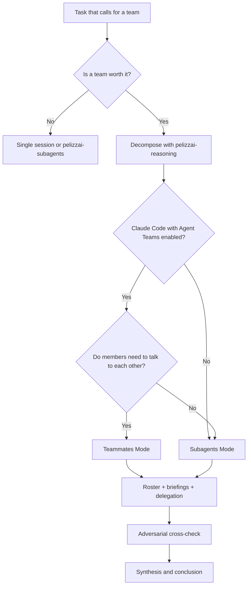

# PelizzAI Team

## Goal

Coordinate **multiple agents working as a team** on a single task, with a **coordinator** who understands each member's role, delegates correctly, tracks progress, verifies the results, and synthesizes them into a single delivery.

This skill works in **two modes** and picks the right one automatically:

- **Teammates Mode** — uses Claude Code's native **Agent Teams** feature (real, independent teammates that talk to each other). Available only in Claude Code and only when the feature is enabled.
- **Subagents Mode** — when Agent Teams is not available, assembles an equivalent team with **subagents** (the `Agent`/`Task` tool), with the coordinator supplying the coordination and communication infrastructure.

The coordination and delegation protocol is **the same in both modes**; only the execution mechanics change.

**Announce on start**, in the conversation's language: that you are using the PelizzAI Team skill to coordinate a team of agents.

<TEAM-MEMBER-STOP>
If you were assigned as a **member** of a team (a teammate or a subagent executing a subtask), **do not invoke this skill** to create a sub-team. There are no nested teams. Execute your subtask, invoke `pelizzai-reasoning` to reason about it, **apply the domain skills pasted into your briefing** (they prevail over generic patterns) and the global layer `pelizzai-preferences`, and return the deliverable in the format agreed in your briefing. **Do not commit** — consolidation (commit) belongs to the coordinator, after the reviews; leave the work in the working tree.

A member **produces artifacts** (spec, report, diff) as a **deliverable for the coordinator** — it does not run, on its own, flows that require user approval (`pelizzai-idea-generation`, `pelizzai-writing-plans`). Those flows belong to the coordinator / the main session.

Under a closed briefing (TEAM-MEMBER-STOP/SUBAGENT-STOP), do not produce route analyses or open gates: apply the briefing, **flag in your return** (`DONE_WITH_CONCERNS`/`NEEDS_CONTEXT`) if no domain skill covered your task's stack, and escalate to the coordinator whatever requires a decision.

You **do not decide product gaps**. If a requirement, scope, UX, architecture, data, security, cost,
or acceptance criterion is not written in the briefing, the plan, or the spec, **name the
gap** — what is missing, what it changes in the delivery, and 2–3 options you see, with the one you
recommend — and return `NEEDS_CONTEXT`. Do not fill it in by convention, default, Context7, or
"reasonable inference", even when the choice looks obvious and reversible, and do not talk to the
user directly: the coordinator is who takes the gap to the human.
</TEAM-MEMBER-STOP>

---

## Core principle

> A team is only justified when the work can be split into fronts that advance **in parallel**, with **low coupling** between them and a **real gain** in coverage, speed, or diversity of perspectives. Otherwise, a single session or a single subagent delivers faster, cheaper, and with less coordination risk.

Teams multiply token cost and add coordination cost. Use the **smallest** team that solves the task, and only when the parallelism pays for those costs.

---

## Priorities

1. Explicit user instructions.
2. Mandatory system and environment rules (permissions, security).
3. Project-, workspace-, or repository-specific rules.
4. This skill and its coordination protocol.
5. Implementation preferences.

---

## When to use / when not to use

| Use a team when…                                                               | Do NOT use a team when…                                              |
| ------------------------------------------------------------------------------ | -------------------------------------------------------------------- |
| Multi-perspective review (security, performance, tests) in parallel            | The task is sequential: each step depends on the previous result     |
| Investigation with **competing hypotheses** (debate to refute theories)        | Two or more members would need to edit **the same file**             |
| New modules/features with **distinct owners** and clear boundaries             | There are many step-by-step dependencies between the parts           |
| Cross-layer coordination (frontend, backend, tests), each layer with an owner  | The task is trivial, local, and reversible                           |
| Broad research with several independent fronts                                 | One source/direct contract already answers, no need to parallelize   |
| Broad-coverage audits (sweeping many files under distinct criteria)            | The parallelism gain does not cover the token and coordination cost  |

In the right-hand column, prefer a **single session** (sequential/trivial task) or a **single subagent** via `pelizzai-subagents` (isolated work that only needs to report back).

**Bridge to the bug track (`pelizzai-debug`):** a bug fix always runs **inline** — never parallelize the fix. What a team can take on is the **investigation** (Phases 1–3), with competing hypotheses in **read-only** roles, and only when ≥3 fixes have already failed or the hypotheses are independent of each other; the team investigates and reports, and Phase 4 (failing test + fix) returns to the main session.

---

## The two execution modes

| Dimension       | Teammates Mode (native)                                    | Subagents Mode (fallback)                                          |
| --------------- | ---------------------------------------------------------- | ------------------------------------------------------------------ |
| Availability    | Claude Code only, with Agent Teams enabled                 | Any environment with the `Agent`/`Task` tool                       |
| Communication   | Teammates talk **to each other** (`SendMessage`/mailbox)   | Subagents do **not** talk; they only report to the coordinator     |
| Coordination    | Shared task list + teammate self-coordination              | The coordinator is the entire infrastructure (list and routing)    |
| Context         | Each teammate has its own window and **persists** in the session | Each subagent has its own window and **ends when it returns** |
| Token cost      | High (each teammate is a full, long-lived Claude)          | Lower (a subagent synthesizes and returns; it does not stay active) |
| Best for        | Work that requires **dialogue/debate** among the members   | Parallel work where only each front's **result** matters           |

**Two-layer choice rule:** first **capability** (does the feature exist?), then **need** (do the members really need to talk to each other?). If Agent Teams is enabled **but** the members do not need to dialogue — only report — **Subagents Mode** is usually the more economical choice.

---

## Capability detection and mode choice

Before assembling the team, determine the mode:

```text
1. Is the platform Claude Code?
   - No (Codex, Gemini CLI, Copilot CLI, etc.) → Subagents Mode (or the platform's subagent mechanism).
   - Yes → continue.

2. Is Agent Teams enabled? (heuristic — confirm what you can)
   - The feature is turned on with the env var CLAUDE_CODE_EXPERIMENTAL_AGENT_TEAMS=1.
   - Check, in this order: the env var in the environment; then the "env" block of the project's
     settings.json (.claude/settings.json). Never read the user's global configuration
     (~/.claude/settings.json) to detect it — it may hold secrets/keys the skill has no reason to
     see; if the project sources do not confirm the capability, treat detection as indeterminate.
   - Enabled → Teammates Mode is POSSIBLE.
   - Disabled → Subagents Mode.

3. Do the members need to talk to each other (debate, mutual refutation, live hand-off)?
   - Yes, and the feature is enabled → Teammates Mode.
   - No → Subagents Mode (cheaper), even with the feature enabled.

Indeterminate detection: if the capability cannot be confirmed, state the limitation and recommend
Subagents as the more available/cheaper fallback. Ask whether the user accepts the fallback; do not
swap the ratified mode on your own.
```

**If the user explicitly asked for teammates but the feature is disabled:** explain how to enable it and offer the fallback. Do not enable it on your own without confirmation.

```json
// .claude/settings.json (or ~/.claude/settings.json)
{
	"env": {
		"CLAUDE_CODE_EXPERIMENTAL_AGENT_TEAMS": "1"
	}
}
```

> Windows + PowerShell environment (this user's case): even with Agent Teams enabled, **split-panes** mode requires tmux or iTerm2 and does **not** work in Windows Terminal, the VS Code integrated terminal, or Ghostty. On Windows, use the **in-process** display mode (the default). This does not prevent teammates — only the pane visualization.


```mermaid
flowchart TD
    A[Task that calls for a team] --> B{Is a team worth it?}
    B -- No --> Z[Single session or pelizzai-subagents]
    B -- Yes --> C[Decompose with pelizzai-reasoning]
    C --> D{Claude Code with Agent Teams enabled?}
    D -- No --> S[Subagents Mode]
    D -- Yes --> E{Do members need to talk to each other?}
    E -- Yes --> T[Teammates Mode]
    E -- No --> S
    T --> R[Roster + briefings + delegation]
    S --> R
    R --> V[Adversarial cross-check]
    V --> Y[Synthesis and conclusion]
```

---

## The coordinator's role

The coordinator is the **team lead** (Teammates Mode) or the **main session** (Subagents Mode). It
**orchestrates**: decomposes, delegates, crosses the lenses, and consolidates. It **never** implements a front
on its own, nor dispatches itself as the review's **blind spec lens** — it has already seen the
members' report and reasoning, so it cannot judge blind; the blind lens is always an independent
reviewer. In both modes, the rule is the same and non-negotiable:

<HARD-GATE>
Do not delegate a subtask to a member until you can answer, for **each** member:

1. **What** they will do (a single, clear objective).
2. **Why** this front exists and how it contributes to the global goal.
3. **What they depend on** (other members, files, decisions already made).
4. **What they deliver** (exact format of the return).
5. **How the result will be verified** (by whom and how).

If you cannot answer these five items for a member, **the decomposition is not ready yet** — go back and decompose further before delegating.
</HARD-GATE>

The five HARD-GATE items have a permanent home: each one maps to a briefing field and a roster column (see the mapping below). If the roster cell is empty, that member's decomposition is not ready yet.

**Write rule — applies to teammates and subagents:** the task's branch or worktree has a single
integration working tree. Worktree isolates the task from the main repo and does **not isolate agents
from each other** — what serializes writes is this rule, not Git. What concurrent writing may do
depends on the isolation ratified in the setup gate:

- `isolation: branch` — **one writer at a time**. The coordinator integrates contributions serially;
  implementers writing at the same time in the same working tree collide. Parallelism stays with
  what does not write: investigation, reading, review, and decomposition.
- `isolation: worktree` — fronts write in parallel **inside the task's single worktree**, as long as
  they touch **disjoint paths**. Disjointness is the **condition**, not advice: if a real conflict
  appears, the pair was not disjoint — replan the decomposition instead of forcing it. Never one
  worktree per member; it is one per task.

In both cases, review, stage, commit, and cursor remain serialized by the coordinator, and members
**do not commit**.

**Coordinator responsibilities:**

- Decompose the task into roles with clear boundaries (**disjoint** fronts/files to avoid conflict).
- Set the **number of members** from the decomposition (see below) — not from a magic number.
- Write a **self-contained briefing** per member (see the protocol below).
- Keep the **living roster** (who does what, why, state, dependencies, verification).
- Communication routing: monitor the mailbox (Teammates) or relay outputs between members in rounds (Subagents).
- Handle **member failures** (see its own section).
- Verify the results adversarially (cross-check, refutation).
- Synthesize everything into a single delivery, resolving divergences.
- Receive the **material gaps** the members name and take them to the human via
  `pelizzai-interview` (gap mode) **before the front continues** — one question at a time, with
  2–3 options and the recommended one. The coordinator groups and orders the gaps by dependency, but
  **consolidating is not deciding**: it chooses neither on its own nor for the member. The ratified
  decision goes back into the plan and the briefing before re-dispatch.
- Collect the domain-skill gaps flagged by the members and consolidate them into a **single** proposal at closeout (feeding the adoption-driven axis of `pelizzai-finish`); never create a skill mid-task. That is a different lane: a domain-skill gap does **not** stop the front; a material gap does.
- Decide on completion and shut down the members.

### How many members

The number of members is **not arbitrary**: it is the number of **disjoint fronts** (or competing lenses/hypotheses) that survive decomposition (`Structured Decomposition`) and actually advance in parallel, capped by cost. One front per member; if two fronts share files or depend on each other serially, they **merge** into one member. The 3-to-5 range is typical, **not** a quota to fill.

### Living roster

Keep — and update — a table of the team's state. It is the coordinator's mental model of **who does what** and mirrors the five HARD-GATE items:

```text
| Member       | Role                     | Front / why                   | Own files                 | Depends on | Deliverable          | Verification             | State        |
| ------------ | ------------------------ | ----------------------------- | ------------------------- | ---------- | -------------------- | ------------------------ | ------------ |
| researcher   | Investigate hypothesis A | cause of the early disconnect | logs/, src/net/ (read)    | —          | cause report         | cross-check w/ refuter   | in progress  |
| backend      | /sessions endpoint       | persist the user session      | src/api/sessions.*        | —          | diff + tests         | reproduction by QA       | pending      |
| sec-reviewer | Audit authentication     | session/token risk            | (read) src/auth/          | backend    | findings w/ severity | coordinator review       | blocked      |
```

HARD-GATE → roster mapping: item 1 → Role/Front; item 2 → Front / why; item 3 → Depends on; item 4 → Deliverable; item 5 → Verification.

In Teammates Mode, this roster mirrors the **shared task list** (which has the same states: pending, in progress, completed, with dependencies). In Subagents Mode, the roster is **your** list — there is no native shared list.

---

## Coordinator reasoning (pelizzai-reasoning)

The coordinator **must** invoke `pelizzai-reasoning` for the planning and delegation phase. Recommended pipeline:

```text
Structured Decomposition   (split into cohesive roles, contracts, and dependencies)
→ Plan and Execute         (order, assign, define checkpoints)
→ [delegation to the members]
→ Evidence Synthesis       (cross and reconcile heterogeneous/conflicting deliverables),
                           with Verification (including cross-check via independent runs) as auxiliary
```

- Use **Constraint Satisfaction** when there are hard requirements, compatibility, security, or prohibitions that all members must respect.
- For investigation, the coordinator runs **Root Cause Analysis** and distributes **competing hypotheses** among the members (each one defends/refutes a theory).
- Load the dominant technique and only auxiliaries that fill distinct gaps, per
  `pelizzai-reasoning`; do not distribute techniques by quota or as decorative roles.

Each **member** reasons too: the briefing instructs the member to invoke `pelizzai-reasoning` for their subtask (see the delegation protocol).

---

## Team composition: role catalog

Choose roles with boundaries that do not overlap. Common roles and the `pelizzai-reasoning` technique that usually serves them:

**Implementation roles are SPECIALISTS by area.** Name the role by area (e.g.,
`backend-implementer`, `frontend-implementer`, `data-implementer`) and paste into the briefing the
**COMPLETE** package of domain skills for that area from the catalog — not just the ones that seem
to apply to the specific task, but the role's entire area. A specialist who carries their whole area
decides boundaries with the context the history would have given, instead of reacting to a narrow
slice. Fronts remain **disjoint by file** (the anti-conflict invariant): the area defines the skill
package the member receives; it does not widen the files they may write.

| Role                          | Mandate                                                                    | Suggested primary technique (pelizzai-reasoning) |
| ----------------------------- | -------------------------------------------------------------------------- | ----------------------------------------------- |
| Investigator / Researcher     | Gather evidence, map the code, test a specific hypothesis                  | Root Cause Analysis                             |
| Implementer (per front)       | Build a module/layer with its own, well-delimited files                    | Structured Decomposition                        |
| Specialized reviewer          | Audit under **one** lens (security, performance, tests, accessibility)     | Verification (or Critique and Refine)           |
| Devil's advocate / Refuter    | Try to **take down** the others' conclusions and implementations           | Refutation via Verification                     |
| Verifier / QA                 | Reproduce, run tests, check contracts and results                          | Verification (cross-check via independent runs) |
| Documenter                    | Consolidate findings, write the spec or final report                       | Evidence Synthesis                              |

Give each lens/hypothesis its own member — a single agent tends to anchor on one line of reasoning. Role diversity is what a team delivers and a single session does not.

---

## Per-member delegation protocol

For each member, deliver a **self-contained briefing**. Members do not inherit the history. In
plan execution, use `task-brief.*` only with a compatible persistent Markdown plan; a native plan
uses pasted content. Handoffs live in the consumer's gitignored path, or in temp in source mode.

```text
Briefing for [member name] — role: [role named by AREA, e.g., backend-implementer]

- Objective: [a single, clear outcome]                                (HARD-GATE 1)
- Global mission and this front's role: [the team's goal in one sentence
  + why this subtask exists and how it contributes]                   (HARD-GATE 2)
- In scope: [what is included]
- Out of scope: [what is out — avoids overlap with other members]
- Own fronts/files: [disjoint set; who else does NOT touch here]
- Required context: [paths, contracts, decisions already made, spec links,
  project conventions — everything, because the member has not seen this conversation]
- Relevant local rules/skills: assemble a SPECIALIST — paste the **COMPLETE** package of domain
  skills for the role's **AREA** [the `pelizzai/domain-skills.md` catalog in a consumer, or the
  source repo's rules/skills in source mode; paste the operational points, not just the names], not
  only the ones that seem to apply to the specific task, but the entire area. When in doubt
  whether a catalog domain skill belongs to the area, include it: the cost of including is lower
  than the cost of ignoring a project rule. If the front's area has no covering skill, say so and
  instruct the member to flag the gap in their return
- Global layer: apply `pelizzai-preferences` and reason via `pelizzai-reasoning`; on
  conflict, the DOMAIN SKILLS pasted above and the project rules PREVAIL over them
- Dependencies: [what needs another member; what can start now]        (HARD-GATE 3)
- Reasoning: suggested primary `pelizzai-reasoning` technique: [see the role catalog]
- Delivery contract: [EXACT format of the return — e.g., list of findings with
  severity and file:line; diff + test output; report with sections X/Y/Z]  (HARD-GATE 4)
- Success criterion: [how the member itself knows it finished correctly]
- Verification: [how and by whom the result will be checked — e.g., cross-check by
  another member; refutation round; test reproduction by QA]           (HARD-GATE 5)
- Commit (writing roles): do NOT commit; leave the work in the working tree —
  the coordinator consolidates after the reviews
- Safe harbor: it is always OK to stop and say "this is too hard for me" — bad work is
  worse than no work; you will not be penalized for escalating (report BLOCKED)
- Material gap (canonical sentence, in the briefing TEXT): if a requirement, scope, UX,
  architecture, data, security, or acceptance item is not written in this briefing, the plan, or
  the spec, STOP, NAME the gap (what is missing + what it changes + 2–3 options with the
  recommended one), return `NEEDS_CONTEXT`, and declare it also under `Deviations from plan:`.
  You do not fill it in by default and you do not talk to the user — the coordinator is who takes
  the decision to the human, via `pelizzai-interview` (gap mode)
- Restrictions/prohibitions: [do not touch X; do not run Y; do not publish; read-only]
```

**Why each field matters:**

- _Global mission and this front's role_ gives the member the framing the history would have given — without it, they decide boundaries blind.
- _Own fronts/files_ prevents the anti-pattern of two members overwriting the same file.
- _Delivery contract_ lets the coordinator **synthesize** without reinterpreting heterogeneous formats.
- _Success criterion_ (the member's self-check) is distinct from _Verification_ (how the coordinator/another member checks the result) — the two fields do not substitute for each other.

---

## Teammates Mode (native)

Use when Agent Teams is enabled **and** the members need to talk to each other.

**Mechanics:**

- **Enable:** `CLAUDE_CODE_EXPERIMENTAL_AGENT_TEAMS=1` (env var or `settings.json`). Experimental; Claude Code only.
- **Create members:** describe in natural language how many and with which roles. The user confirms. The lead gives each teammate a **name** — ask for predictable names (e.g., `researcher`, `backend`, `sec-reviewer`) to reference them later. In current versions (v2.1.178+), creating a teammate **requires no prior setup** and there are no `TeamCreate`/`TeamDelete` tools; an eventual `team_name` field on the `Agent` tool is accepted but **ignored**.
- **Reusable roles:** a teammate can be created from a **defined subagent** (an `agentType` from project/user/plugin), e.g., "create a teammate using the `security-reviewer` agent type". It honors the definition's `tools` and `model`; the team tools (`SendMessage`, task management) are always available.
- **Shared task list:** populate it with right-sized tasks (~5–6 per teammate), with **dependencies** where they exist. Claiming uses file-locking; dependent tasks unblock on their own when the predecessor completes.
- **Communication:** `SendMessage` by name; delivery via mailbox. To address everyone, send one message per recipient. When a teammate goes idle, it notifies the lead.
- **Plan approval:** for risky fronts, require the teammate to **plan before implementing** (it stays in read-only plan mode until the lead approves). Give approval criteria in your prompt (e.g., "only approve plans with test coverage").
- **Model and effort:** teammates do **not** inherit the lead's `/model` by default — configure it in `/config` → "Default teammate model". They inherit the lead's **effort**.
- **Display:** `in-process` (default, any terminal) or `split-panes` (`teammateMode`/`--teammate-mode`; requires tmux or iTerm2). **On Windows, use in-process** (see the note above).
- **Quality gates via hooks:** `TeammateIdle`, `TaskCreated`, `TaskCompleted` (exiting with exit code 2 sends feedback and blocks the action).
- **Shut down:** request the shutdown by name; the teammate may accept or refuse with justification. Team cleanup is automatic when the session ends.

**Feature limitations (experimental) — the coordinator must compensate:**

```text
- /resume and /rewind do NOT restore in-process teammates. After resuming the session, recreate the members.
- Task status can lag (a teammate forgets to mark "completed" and blocks dependencies).
  → confirm yourself that the work is done and nudge the teammate.
- Shutdown is slow (the teammate finishes its current request before exiting).
- One team per session; no nested teams; the lead is fixed (no leadership transfer).
- Teammates inherit the lead's permission mode at spawn (including --dangerously-skip-permissions).
- Pre-approve common operations in permissions before creating teammates, to reduce interruptions.
```

---

## Subagents Mode (fallback)

Use when Agent Teams is not available, or when the members only need to report (no dialogue). Here **the coordinator is the entire infrastructure** that Agent Teams would provide natively.

**Mechanics:**

- **Tool:** `Agent`/`Task`. Each subagent has its own context window and **only returns its final text** to the coordinator; subagents do **not** communicate with each other and **end when they return** (no memory across calls).
- **Types and write capability:** **reading/investigation** roles (Investigator, Reviewer, Refuter, inspection QA) use `Explore` or `Plan` (read-only). Roles that **write files** (Implementer) require `general-purpose` or a custom subagent with write tools — **`Explore` and `Plan` do not edit**. Choose the `agentType` by the role's need.
- **Parallelism:** for independent members, issue **several `Agent` calls in a single message** — they run concurrently. The parallelism that is **safe by default** is **read** parallelism (`Explore`).
- **Simulated communication (the coordinator as router):** since the subagents do not talk, simulate the dialogue in **rounds**:

```text
Round 1 — production:    each member executes its front and returns the deliverable.
Round 2 — confrontation: the coordinator spawns a NEW subagent with the same role and injects,
                         in the prompt, the full briefing PLUS the relevant outputs of the others,
                         asking it to refute, agree, or adjust (simulates the "scientific debate").
Round N — convergence:   stop as soon as the positions stabilize.

Caution: in Subagents there is NO continuity across rounds. Each round and each verifier is a
NEW SPAWN, with no memory of the previous round and no access to the others' work — the coordinator
must re-inject everything into the prompt. Cap the confrontation rounds (typically 1–2) and apply
the effort budget from `pelizzai-reasoning`: more rounds only if they reduce real risk.
```

- **Adversarial cross-check:** spawn **skeptical verifiers** whose only job is to try to **refute** the findings/implementations. Since the verifier is stateless, **paste into its prompt the artifact to refute**. Keep a finding only if it survives.
- **Avoiding file conflicts:** assign **disjoint files** per member. What parallel writing may do
  depends on the isolation ratified in the gate: under `isolation: branch`, one writer at a time and
  the coordinator applies the contributions serially (parallelism stays with
  investigation/reading/review); under `isolation: worktree`, fronts with **disjoint paths** may
  write in parallel inside the task's single worktree. In neither case are Git/the index, the
  review-package, or the shared directory transactional — which is why review, stage, commit,
  and cursor remain serialized by the coordinator.
- **Task list:** it is **your** roster (there is no native shared list) — update it every round.
- **Synthesis:** the coordinator integrates the deliverables and crosses the divergences with `pelizzai-reasoning` (`Evidence Synthesis`, with `Verification` as auxiliary).

> To delegate to a **single** isolated subagent (not a team), use the sibling skill `pelizzai-subagents` (the canonical home of that pattern).

---

## Handling member failures

Applies to both modes. The coordinator never concludes silently with a front left open.

```text
- A member fails or returns outside the contract:
  → re-brief with stricter instructions, reduce the scope, or reassign the front to another member.
- A member stalls or takes longer than expected:
  → Teammates Mode: nudge via SendMessage, or request shutdown and recreate.
  → Subagents Mode: reissue the Agent call (a new spawn with the briefing).
- A front proves unviable:
  → the coordinator replans the decomposition or redistributes the front to another member
    (it neither forces nor ignores) — it never implements the front itself.
```

Anchor the recovery in `pelizzai-reasoning`: `Critique and Refine` (fix a failed deliverable) and `Plan and Execute` (replan when the decomposition does not hold).

---

## Verification and synthesis

Member results are **not** truth until they are cross-checked.

- **Cross-check:** confront deliverables that overlap; conflicting findings trigger a refutation round (Subagents Mode) or a debate via `SendMessage` (Teammates Mode).
- **Adversarial verification:** prefer that **another** member (or a dedicated verifier) try to take down a conclusion, rather than the author confirming it.
- **Cross-check via independent runs (Verification):** when several members reach the same result through independent paths, the convergence increases confidence — but it does not replace a real test/source.
- **Per-task review (two lenses with asymmetric blindness):** every implementation deliverable goes through `pelizzai-review` — the **blind spec lens** (receives only diff + spec/plan + the area's domain skills, NEVER the author's report: it judges the code against the contract, without the narrative) and the **quality/evidence lens** (receives the report and verifies the claims with fresh proof). The coordinator dispatches independent reviewers — it is **never the blind lens** —, crosses the two verdicts and, on conflict, decides with its own evidence or escalates. The two lenses always go out in **two dispatches**, in any lane, including bounded — only that way does the spec lens not know the author's narrative; there is no single-pass variant to fall back on. What is proportional is each lens's **depth**, not the review's existence, the number of dispatches, nor the blindness.
- **Evidence gate:** before accepting an **implementation** deliverable, apply `pelizzai-final-verification` — check the **git diff** and run the test commands yourself, or accept output + exit code from **whoever ran the check** (the quality/evidence lens, an independent reviewer — never the author); the member's report, including output the member pasted itself, is never evidence.
- **Synthesis:** cross the deliverables with `Evidence Synthesis` and produce **one** delivery, making clear what is consensus, what was resolved divergence, and what remains open.
- **Deadlock:** if the confrontation does **not** converge, the coordinator does **not** force an artificial consensus: it decides by the task's dominant criterion (invoking `Decision Making`) and, when the choice belongs to the user or the impact is high, **escalates via `pelizzai-interview`** — naming the gap, with the positions turned into 2–3 real options, the recommended one, and each one's trade-off.

Apply the **effort budget** from `pelizzai-reasoning`: verification depth is proportional to the change's risk.

---

## Budget and sizing

```text
- The number of members is DERIVED from the decomposition (one disjoint front = one member), not a quota.
- 3 to 5 members cover most flows; ~5 to 6 tasks per member keeps everyone productive.
- Token cost scales ~linearly with the number of members (Teammates is the most expensive).
- Grow the team size only when the work actually gains from more simultaneous fronts.
- Three focused members usually outperform five scattered ones.
```

---

## Anti-patterns

```text
- Assembling a team for a sequential, trivial, or single-source task.
- Two members editing the same file (guaranteed overwrite).
- A vague briefing, or assuming the member has the conversation history.
- Delegating a writing role to a read-only agentType (Explore/Plan do not edit).
- "Continuing the conversation" with a subagent across rounds (each round is a new spawn, no memory).
- The coordinator starting to implement instead of delegating, waiting, and synthesizing.
- The coordinator dispatching itself as the blind spec lens (it has already seen the report) — the blind lens is always an independent reviewer.
- Handing the implementer's report to the blind spec lens, or assembling a member without the complete package of domain skills for its area.
- A member filling in, by default, convention, or "reasonable inference", a product decision that is not in the briefing/plan/spec, instead of naming the gap and returning `NEEDS_CONTEXT`.
- The coordinator deciding the material gap (on its own or for the member) instead of taking it to the human via `pelizzai-interview` — consolidating the gaps is not deciding them.
- Accepting findings without adversarial verification.
- In Subagents Mode, expecting the members to coordinate on their own (they do not talk to each other).
- Using split-panes on Windows / Windows Terminal / the VS Code terminal / Ghostty.
- Leaving a task "in progress" blocking dependencies, without confirming completion (Teammates).
- Creating more members than the truly parallelizable work supports.
```

---

## Red flags

**Never:**

- Delegate without being able to answer the five `<HARD-GATE>` items for each member.
- Enable Agent Teams in the user's `settings.json` without confirmation.
- Treat a member's result as truth before cross-checking/refuting it.
- Decide, in the user's place, a material gap the members named (consolidating is not deciding).
- Act as the blind spec lens yourself (the coordinator), or hand the author's report to it.
- Conclude silently with a failed or open front.
- Shut the team down before validating the completion criteria.
- Let the lead conclude "it's done" with tasks still open — check the roster.

---

## Operational flow at a glance

```text
1. Assess whether a team adds real value. If not, use a single session or `pelizzai-subagents`.
2. Decompose with `pelizzai-reasoning` (Structured Decomposition) into roles, contracts, and disjoint fronts.
3. Derive the number of members from the fronts and detect capability; choose the mode (Teammates vs. Subagents).
4. Build the roster (the 5 HARD-GATE items per member) and write a self-contained briefing.
5. Delegate (spawn), in parallel when independent, with user confirmation.
6. Track the roster; monitor the mailbox (Teammates) or route outputs in rounds (Subagents).
7. Handle member failures; do not conclude with an open front.
8. Verify adversarially (cross-check / refutation) and synthesize with Evidence Synthesis.
9. Resolve divergences (or escalate the deadlock); conclude when the criteria are met and shut down the members.
```

---

## Integration

**Combines with:**

- `pelizzai-reasoning` — the coordinator's reasoning (decomposition, plan, synthesis, verification) and each member's; it is also where the `Verification` technique for closeout lives.
- `pelizzai-preferences` — the global layer instructed in each member's briefing (domain skills prevail).
- `pelizzai-subagents` — lightweight delegation to **one** isolated subagent (no team).
- `pelizzai-router` / `pelizzai-execute` — where the `team` mode arrives from (setup gate); pelizzai-execute defines the per-task cycle each front follows.
- `pelizzai-interview` — destination of the material gaps named by the members: the coordinator consolidates them and takes them to the human before the front continues.
- `pelizzai-final-verification` — the evidence gate before accepting an implementation deliverable.
- `pelizzai-idea-generation` / `pelizzai-writing-plans` — where the team's task usually comes from.

---

## Final instruction to the agent

```text
Use PelizzAI Team to coordinate a team, not to inflate tasks that a single session solves.

Assemble the smallest team that covers the task. Before delegating, understand what each member
will do and write a briefing that stands on its own. Remember that no member has seen this
conversation.

Prefer:
- proportionality over decorative parallelism;
- disjoint fronts over members fighting over the same files;
- adversarial verification over trust in the author;
- clear synthesis over a pile of outputs;
- the cheap Subagents Mode when the members do not need to talk.

Do not delegate without answering the five HARD-GATE items.
Do not let a member fill in a product decision — they name the gap and return NEEDS_CONTEXT.
Do not decide the material gap in the user's place: consolidate and take it to pelizzai-interview.
Do not send a writing role to a read-only agentType.
Do not treat subagent rounds as a continuous conversation — each round is a new spawn.
Do not enable Agent Teams without user confirmation.
Do not conclude with the roster still open.
```
