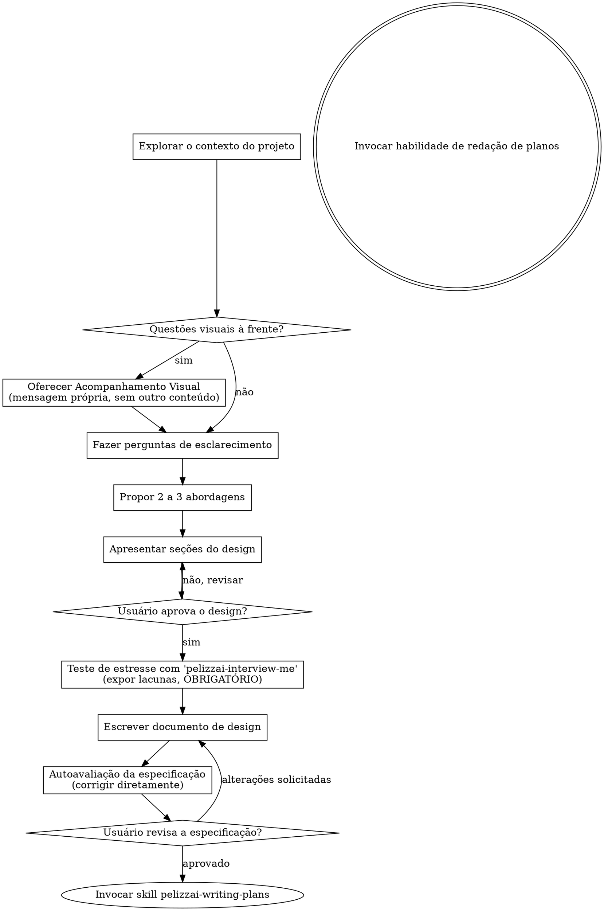

# Transformando ideias em projetos

Ajude a transformar ideias em projetos e especificações detalhadas e completas por meio de um diálogo colaborativo natural. Este processo é útil para qualquer trabalho criativo, incluindo a criação de funcionalidades, desenvolvimento de componentes, adição de recursos ou modificação de comportamentos.

Comece entendendo o contexto atual do projeto, faça um repo scan completo e, em seguida, explore a intenção do usuário, os requisitos e o design antes da implementação. O objetivo é criar uma especificação detalhada que possa ser usada para orientar o desenvolvimento.

Faça perguntas uma de cada vez para refinar a ideia. Depois de entender o que está construindo, apresente o projeto e obtenha a aprovação do usuário antes de prosseguir para a implementação. O processo é iterativo e colaborativo, garantindo que o resultado final atenda às necessidades do usuário e aos objetivos do projeto.

<HARD-GATE>
NÃO utilize nenhuma habilidade de implementação, escreva nenhum código, crie nenhum scaffold de projeto ou tome qualquer ação de implementação até que você tenha apresentado um projeto e o usuário o tenha aprovado. Isso se aplica a TODOS os projetos, independentemente da simplicidade aparente.

(A única exceção - uma correção pontual trivial - é tratada ANTES, pelo `pelizzai-router`. Uma vez dentro da fase de brainstorming, esta regra se aplica integralmente.)
</HARD-GATE>

## Antipadrão: "Isso é simples demais para precisar de um design"

Todo projeto passa por esse processo. Uma lista de tarefas, um utilitário de função única, uma alteração de configuração — todos eles. É nos projetos "simples" que suposições não analisadas geram o maior desperdício de trabalho. O design pode ser breve (algumas frases para projetos realmente simples), mas você PRECISA apresentá-lo e obter aprovação.

## Checklist

Você DEVE criar uma tarefa para cada um destes itens e concluí-los na ordem indicada:

1. **Explorar o contexto do projeto** — verificar arquivos, documentações e commits recentes
2. **Oferecer um complemento visual** (se o tópico envolver questões visuais) — esta deve ser uma mensagem separada, não combinada com uma pergunta de esclarecimento. Consulte a seção "Complemento Visual" abaixo.
3. **Fazer perguntas de esclarecimento** — uma de cada vez; entender o objetivo, as restrições e os critérios de sucesso
4. **Propor 2 a 3 abordagens** — apresentando prós e contras (trade-offs) e sua recomendação
5. **Apresentar o design** — em seções dimensionadas de acordo com a complexidade; obter a aprovação do usuário após cada seção
6. **Realizar teste de estresse com `interview-me` (OBRIGATÓRIO)** — antes de redigir o documento, conduzir uma entrevista aprofundada que **exponha as lacunas do design** (casos não tratados, validações ausentes, falhas de segurança/autorização, estados indefinidos, contradições). Não é uma oferta opcional — consulte a nota na seção "Apresentação do design".
7. **Redigir o documento de design** — salvar em `pelizzai/specs/YYYY-MM-DD-<tópico>-design.md` e fazer o commit
8. **Autoavaliação da especificação** — verificação rápida (inline) de placeholders, contradições, ambiguidades e escopo (veja abaixo)
9. **Revisão da especificação pelo usuário** — solicitar que o usuário revise o arquivo de especificação antes de prosseguir
10. **Transição para a implementação** — acionar a skill `pelizzai-writing-plans` para criar o plano de implementação

## Fluxo do Processo

**O estado final consiste em invocar a skill pelizzai-writing-plans** NÃO invoque o design de frontend nem qualquer outra habilidade de implementação. A ÚNICA habilidade a ser invocada após o brainstorming é a elaboração de planos de redação.

## O Processo

**Compreendendo a ideia:**

- Primeiro, verifique o estado atual do projeto, incluindo arquivos, documentação e commits recentes. Isso ajuda a entender o contexto e a identificar quaisquer restrições ou requisitos existentes. Para isso, use subagents através da skill `pelizzai-subagents`.
- Antes de fazer perguntas detalhadas, avalie o escopo: se a solicitação descreve múltiplos subsistemas independentes (ex.: "criar uma plataforma com chat, armazenamento de arquivos, faturamento e análise de dados"), aponte isso imediatamente. Não gaste perguntas refinando detalhes de um projeto que precisa ser decomposto primeiro.
- Se o projeto for grande demais para uma única especificação, ajude o usuário a decompô-lo em subprojetos: quais são as partes independentes, como elas se relacionam e em que ordem devem ser construídas? Em seguida, trabalhe na concepção do primeiro subprojeto seguindo o fluxo de design padrão. Cada subprojeto terá seu próprio ciclo de especificação, planejamento e implementação.
- Para projetos com escopo adequado, faça perguntas uma de cada vez para refinar a ideia.
- Dê preferência a perguntas de múltipla escolha quando possível, mas perguntas abertas também são aceitáveis.
- Apenas uma pergunta por mensagem; se um tópico exigir mais exploração, divida-o em várias perguntas.
- Concentre-se em compreender: propósito, restrições e critérios de sucesso.

**Explorando abordagens:**

- Proponha de 2 a 3 abordagens diferentes, apresentando os prós e contras de cada uma
- Apresente as opções de forma conversacional, incluindo sua recomendação e a justificativa
- Comece pela opção recomendada e explique o motivo

**Apresentando o projeto:**

- Assim que você acreditar que entendeu o que está construindo, apresente o projeto.
- Adeque cada seção à sua complexidade: algumas frases se for simples, até 200-300 palavras se for complexa.
- Após cada seção, pergunte se tudo parece correto até o momento.
- Aborde: arquitetura, componentes, fluxo de dados, tratamento de erros e testes.
- Esteja preparado para voltar atrás e esclarecer qualquer dúvida.
- **Antes de finalizar, teste o projeto sob estresse com a habilidade `pelizzai-interview-me` (OBRIGATÓRIO — não é opcional).** Anuncie na linguagem do usuário: "Vou te entrevistar para estressar este design e expor os pontos fracos antes de seguir." Realize uma entrevista detalhada que exponha ativamente as lacunas (casos não tratados, validação ausente, falhas de segurança/autorização, estados indefinidos, contradições). Você só pode finalizar após as lacunas terem sido identificadas e cada uma delas for resolvida ou explicitamente aceita pelo usuário — nunca pule esta etapa. Isso é crítico para evitar desperdício de trabalho e garantir que o design seja robusto.

**Projetando para isolamento e clareza:**

- Divida o sistema em unidades menores, cada uma com um propósito claro, que se comuniquem por meio de interfaces bem definidas e que possam ser compreendidas e testadas de forma independente.
- Para cada unidade, você deve ser capaz de responder: o que ela faz, como ela é utilizada e de que ela depende?
- É possível entender o que uma unidade faz sem ler sua implementação interna? Você consegue alterar essa implementação sem quebrar os componentes que a utilizam? Se a resposta for não, as fronteiras da unidade precisam ser revistas.
- Unidades menores e bem delimitadas também facilitam o seu trabalho: é mais fácil raciocinar sobre um código que você consegue compreender como um todo, e as alterações são mais seguras quando os arquivos têm um foco específico. Quando um arquivo se torna muito grande, isso geralmente indica que ele está acumulando responsabilidades demais.

**Trabalhando em bases de código existentes:**

- Explore a estrutura atual antes de propor alterações. Siga os padrões existentes. Use a skill `pelizzai-subagents` para analisar o código e identificar padrões, convenções e práticas existentes.
- Quando o código existente apresentar problemas que impactem o trabalho (por exemplo, um arquivo excessivamente grande, limites pouco claros ou responsabilidades entrelaçadas), incorpore melhorias direcionadas ao projeto — tal como um bom desenvolvedor aprimora o código em que está trabalhando.
- Não proponha refatorações não relacionadas. Mantenha o foco no que atende ao objetivo atual.

## Após o Design

**Documentação:**

- Salve o design validado (especificação) em `pelizzai/specs/YYYY-MM-DD-<topic>-design.md`
- (Preferências do usuário quanto ao local da especificação prevalecem sobre esse padrão)
- Use a skill `pelizzai-writing-clearly-and-concisely` para redigir a especificação de forma clara e concisa, evitando jargões e termos técnicos desnecessários.
- Faça o _commit_ do documento de design no Git

**Autoavaliação da Especificação:**
Após redigir o documento de especificação, analise-o com um olhar renovado:

1. **Verificação de marcadores de posição:** Há algum "TBD (To Be Determined / To Be Decided)", "TODO ("a fazer" ou "para fazer")", seção incompleta ou requisito vago? Corrija-os usando a skill `pelizzai-interview-me` para esclarecer e preencher lacunas.
2. **Consistência interna:** Alguma seção contradiz outra? A arquitetura está alinhada com as descrições da funcionalidade?
3. **Verificação de escopo:** O escopo está suficientemente focado para um único plano de implementação ou precisa ser desmembrado?
4. **Verificação de ambiguidade:** Algum requisito pode ser interpretado de duas maneiras diferentes? Se sim, use a skill `pelizzai-interview-me` para esclarecer e eliminar ambiguidades.

Corrija eventuais problemas diretamente no documento de especificação. Não crie tarefas separadas para isso. O objetivo é que o documento final seja claro, conciso e completo.

**Etapa de Revisão pelo Usuário:**
Após a conclusão do ciclo de revisão da especificação, solicite ao usuário que revise a especificação redigida antes de prosseguir:

> "A especificação foi redigida e registrada em `<path>`. Por favor, revise-a e informe se deseja fazer alguma alteração antes de começarmos a elaborar o plano de implementação."

_Mantenha uma linguagem simples e direta, evitando jargões técnicos._

Aguarde a resposta do usuário. Se ele solicitar alterações, faça-as e repita o ciclo de revisão da especificação. Prossiga apenas quando o usuário aprovar.

**Implementação:**

- Acione a skill `pelizzai-writing-plans` para criar um plano de implementação detalhado.
- NÃO acione nenhuma outra habilidade. `pelizzai-writing-plans` é a próxima etapa.

## Princípios-chave

- **Uma pergunta de cada vez** – Evite sobrecarregar com múltiplas perguntas
- **Preferência por múltipla escolha** – Mais fácil de responder do que perguntas abertas. Sempre ofereça 4 opções, sendo a última "outra (especifique)".
- **Aplicação rigorosa do YAGNI** – Remova funcionalidades desnecessárias de todos os projetos
- **Explore alternativas** – Sempre proponha de 2 a 3 abordagens antes de decidir
- **Validação incremental** – Apresente o projeto e obtenha aprovação antes de avançar
- **Seja flexível** – Volte atrás e peça esclarecimentos quando algo não fizer sentido

## Visual Companion

Uma ferramenta complementar baseada no navegador para exibir mockups, diagramas e opções visuais durante sessões de brainstorming. Disponível como uma ferramenta — não como um modo fixo. Aceitar o recurso significa que ele está disponível para perguntas que se beneficiam de uma abordagem visual; isso NÃO significa que todas as perguntas passarão pelo navegador.

**Oferecendo a ferramenta (no momento oportuno):** NÃO a ofereça logo de início. Aguarde até surgir uma pergunta que fique genuinamente mais clara se for mostrada em vez de apenas descrita — uma pergunta que realmente envolva mockup, layout ou diagrama, e não apenas um _tópico_ de interface (UI). Quando isso acontecer pela primeira vez, faça a oferta em uma mensagem separada:

> "A próxima parte pode ficar mais fácil se eu mostrar visualmente — posso preparar mockups, diagramas e comparações em uma aba do navegador conforme avançamos. É um recurso novo e pode consumir muitos tokens. Quer que eu faça isso? Vou abrir para você."

**Essa oferta DEVE ser enviada em uma mensagem própria.** Apenas a oferta — sem perguntas de esclarecimento, resumos ou outros conteúdos. Aguarde a resposta do usuário. Se ele aceitar, inicie o servidor com a flag `--open` para que o navegador dele abra automaticamente na primeira tela.

**Decisão por pergunta:** Mesmo após o usuário aceitar, decida PARA CADA PERGUNTA se usará o navegador ou o terminal. O critério é: **o usuário entenderia melhor vendo ou lendo?**

- **Use o navegador** para conteúdo que É visual — mockups, wireframes, comparações de layout, diagramas de arquitetura, designs visuais lado a lado.
- **Use o terminal** para conteúdo textual — perguntas sobre requisitos, escolhas conceituais, listas de prós e contras (trade-offs), opções de texto A/B/C/D, decisões de escopo.

Uma pergunta sobre um tópico de UI não é automaticamente uma pergunta visual. "O que significa 'personalidade' neste contexto?" é uma pergunta conceitual — use o terminal. "Qual layout de assistente (wizard) funciona melhor?" é uma pergunta visual — use o navegador.

Se o usuário concordar com o uso da ferramenta, leia o guia detalhado antes de prosseguir: [visual companion](./visual-companion.md)
