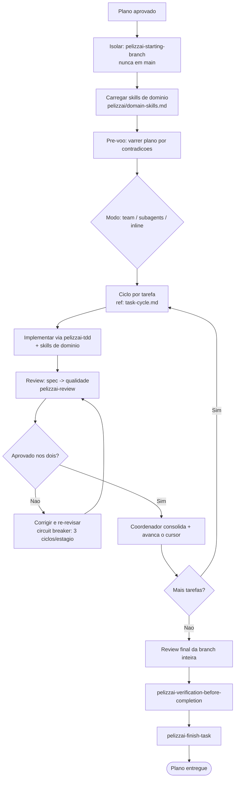

# PelizzAI Execution Plans

## Objetivo

Executar um plano de implementação aprovado com **disciplina por tarefa**: cada tarefa é implementada via TDD, revisada (spec + qualidade) e só então consolidada, em **loop** até o plano inteiro ser entregue com êxito. A skill escolhe **como** executar — em time, com subagentes, ou inline — e mantém um **estado retomável**.

**Anuncie ao iniciar:** "Usando a skill Pelizzai Execution Plans para executar o plano, tarefa por tarefa."

<MEMBRO-DO-TIME-STOP>
Se você é um **membro** (teammate/subagente) encarregado de **uma tarefa**, implemente apenas a sua: siga `pelizzai-tdd`, aplique as skills de domínio coladas no seu briefing, e devolva o resultado com um dos status (`DONE` / `DONE_WITH_CONCERNS` / `BLOCKED` / `NEEDS_CONTEXT`). Não orquestre o plano nem commite — a consolidação é do coordenador. Ver `references/task-cycle.md`.
</MEMBRO-DO-TIME-STOP>

---

## Princípio central

> Execute um plano aprovado com gates humanos nas **bordas** (isolamento, commit/squash, push/PR, conclusão) e autonomia **entre as tarefas** (não pare para perguntar "sigo?" a cada tarefa). Nenhuma tarefa é consolidada sem TDD e review. Nunca o modo "mãos-livres" que remove os gates de borda.

---

## Pré-requisitos (gate)

Antes da primeira tarefa, confirme:

```text
[ ] Existe um plano aprovado (pelizzai-writing-plans, PRD ou issues). Sem plano → volte a pelizzai-writing-plans.
[ ] Existe o catálogo pelizzai/domain-skills.md. Se NÃO existe, o harness não foi inicializado:
    rode pelizzai-audit (bootstrap) e só então volte.
[ ] As skills de domínio relevantes foram selecionadas do catálogo, prontas para aplicar/colar —
    obrigatório nos três modos (ver abaixo).
[ ] Há isolamento: NÃO está em branch protegida (main/master/develop/dev). Isole via pelizzai-starting-branch.
[ ] O estado existe em pelizzai/data/state.md (se não, instancie a partir do template e preencha
    slug/track/phase/branch/isolation/execution-mode/commit-strategy/plan antes da Tarefa 1) e
    foi validado contra o git.
```

O diretório `pelizzai/` segue o **padrão único do harness** (ver `pelizzai-audit` → "Padrão de diretório `pelizzai/`"). O estado desta skill vive em **`pelizzai/data/state.md`**.

---

## Ler as skills de domínio (obrigatório nos três modos)

As skills de domínio capturam os padrões deste projeto. **Todo executor as aplica** — em time, com subagentes ou inline.

```text
1. Leia o catálogo `pelizzai/domain-skills.md` e selecione as skills de domínio relevantes à tarefa.
2. Inline: carregue essas skills no seu contexto e aplique-as ao implementar.
3. Subagents/Team: o membro NÃO herda seu contexto — COLE as skills de domínio relevantes
   (ou seus pontos-chave) no briefing de cada tarefa, junto com o texto completo da tarefa.
```

Se o catálogo não existir, o projeto não foi inicializado: rode a `pelizzai-audit` (bootstrap) antes de executar.

---

## Os três modos de execução

Ordem de preferência: **team → subagents → inline**. Escolha proporcional ao plano (não monte um time para um plano trivial).

| Modo                 | Skill              | Quando                                                                       |
| -------------------- | ------------------ | ---------------------------------------------------------------------------- |
| **team** (preferido) | `pelizzai-team`    | Plano com **frentes paralelas** ou cross-layer (ex.: backend + frontend + testes), donos distintos que se beneficiam de coordenação/diálogo |
| **subagents**        | `pelizzai-subagents` | Tarefas independentes que só precisam **reportar**; um subagente fresco por tarefa, contexto isolado, review por tarefa |
| **inline** (último)  | —                  | Subagentes/time indisponíveis, ou plano **pequeno e muito sequencial**; o coordenador implementa tarefa a tarefa na própria sessão |

```text
Isolamento e paralelismo (política do harness: só branches, sem worktrees):
- O isolamento é sempre uma branch (um working tree). NÃO usamos worktrees.
- Sem worktrees, não há escrita paralela isolada no mesmo repo: a execução que ESCREVE roda em
  uma branch por vez e o COORDENADOR integra as contribuições EM SÉRIE.
- O paralelismo de team/subagents fica para o que NÃO escreve concorrentemente: investigação,
  leitura, review e decomposição. Em subagents, despache um subagente por tarefa, um de cada vez.
```

**Desempate team × subagents:** team = múltiplas frentes em paralelo (via teammates ou subagentes internos do `pelizzai-team`); subagents = um subagente isolado por tarefa, em série. Havendo paralelismo de frentes, prefira **team** mesmo que os membros só reportem.

O modo escolhido é registrado em `pelizzai/data/state.md` (`execution-mode: team | subagents | inline`).

---

## Fluxo



O laço macro **desta skill** repete o ciclo até a **Definition of Done** do plano (a lente de DoD e de parada por dúvida vem da `pelizzai-loop`).

---

## Pré-voo

Antes da Tarefa 1, leia o plano **uma vez** procurando contradições internas ou conflitos com as skills de domínio/critérios de review. Se houver, apresente tudo ao usuário em **uma** pergunta batched; se estiver limpo, siga em silêncio.

---

## Ciclo por tarefa

O protocolo detalhado — briefing por colagem, TDD, review em dois estágios, status, circuit breaker e commit como gate — está em **[references/task-cycle.md](references/task-cycle.md)**. Resumo:

```text
1. Briefing: COLE o texto completo da tarefa + as skills de domínio relevantes no prompt
   (o membro nunca lê o arquivo do plano). Responda perguntas ANTES de o trabalho começar.
2. Implementar via pelizzai-tdd (Iron Law: teste que falha primeiro). O membro NÃO commita.
3. Review em dois estágios, nesta ordem: (a) conformidade com a spec; (b) qualidade do código,
   com evidência de teste FRESCA (rodou e colou a saída verde — não inferida). Use pelizzai-review.
4. Reprovou? Corrija e re-revise. Circuit breaker: 3 ciclos por estágio por tarefa; rejeição
   estrutural escala de imediato; ao estourar → registra phase: blocked e escala ao humano.
5. Aprovou nos dois? O COORDENADOR consolida (commit) e avança o cursor em pelizzai/data/state.md.
```

---

## Modo Team (preferido)

Use `pelizzai-team`. Cada **frente** do plano (conjunto coeso de tarefas, ex.: uma camada) vira um membro; o coordenador (lead) delega por briefing autossuficiente (com as skills de domínio coladas), monitora e sintetiza. Como o harness usa só branches (sem worktrees), as frentes não escrevem em paralelo de forma isolada: o coordenador integra as contribuições **em série** na branch; reserve o paralelismo para investigação, review e decomposição. O ciclo por tarefa acima vale dentro de cada frente.

## Modo Subagents

Use `pelizzai-subagents`. Um subagente **fresco por tarefa**, despachado pelo coordenador, com contexto isolado. O coordenador roteia, revisa (dois estágios) e consolida. Execução contínua entre tarefas; sem pausa por tarefa.

## Modo Inline (último recurso)

Sem subagentes/time, ou plano pequeno e sequencial: o coordenador implementa tarefa a tarefa na própria sessão, seguindo o mesmo ciclo (TDD → review → consolidar → avançar cursor). É o **fallback** — prefira team ou subagents quando disponíveis.

---

## Estado e retomada — `pelizzai/data/state.md`

O cursor da tarefa ativa vive em `pelizzai/data/state.md` (template: [templates/state.md](templates/state.md)). Campos: identidade da tarefa (`slug`, `track`, `phase`), `branch`, `isolation`, `execution-mode`, `commit-strategy`, `plan` (caminho do plano em execução), `project` (projeto-alvo, em workspace), progresso (`delivered`/`next`/`pending`) e o `## Histórico`. Se o arquivo não existir, instancie-o a partir do template antes da Tarefa 1.

```text
- Sentinela: slug: <none> ou phase: done → não há tarefa ativa (começa do zero).
- Avance o cursor a cada tarefa concluída; em commit granular o toque do cursor entra no MESMO
  commit da tarefa; em squash-final, acumula — nunca um commit órfão só do cursor (exceção única:
  o registro de phase: blocked do circuit breaker — ver references/task-cycle.md §5).
- Retomada após compaction: confie no ledger + git, mas VALIDE contra a realidade — a branch
  registrada bate com `git branch --show-current`?
  Releia o arquivo apontado em `plan:` para reconstruir o texto das tarefas pendentes (o membro
  nunca lê o plano; quem cola é o coordenador). Em divergência que arrisque o trabalho, NÃO confie
  cego: reporte e recupere o estado com o usuário antes de prosseguir.
- Em workspace, a branch e os comandos de teste/lint/build são POR-PROJETO; use o campo `project:`.
```

---

## Loop até a entrega

O laço macro — implementar → testar → revisar → corrigir, repetido até a **Definition of Done** do plano (todas as tarefas concluídas, testes verdes com evidência, review final aprovado) — é conduzido por **esta skill** (o ciclo por tarefa + o "Mais tarefas?" do fluxo). De `pelizzai-loop` importe apenas: (a) a noção de **Definition of Done** do plano e (b) a regra — em dúvida material durante o loop, **pare** e use `pelizzai-interview-me`; só retome quando resolvida.

---

## Gates humanos (bordas) e autonomia entre tarefas

```text
GATES (exigem confirmação do usuário):
- Começar em branch protegida (main/master/develop/dev) — proibido, sem exceção.
- Escolha do modo de execução (team/subagents/inline).
- Estratégia de commit (granular vs squash-final) e o squash em si.
- Destino: push direto / push + PR / manter local / descartar.
- Conclusão.

AUTONOMIA (sem perguntar a cada passo):
- Entre as tarefas de um plano JÁ APROVADO, execute de forma contínua (não pergunte "sigo?").
- Pare apenas por: BLOCKED que você não resolve, ambiguidade material, ou plano concluído.

NUNCA o modo "mãos-livres" que remove os gates de borda (reprovado em campo no harness anterior).
```

---

## Conclusão

Ao terminar todas as tarefas:

```text
1. Review final da branch inteira (não só por tarefa).
2. pelizzai-verification-before-completion — evidência antes de afirmar "pronto".
3. pelizzai-finish-task — verificar testes, fechar o cursor (phase: done), consolidar honrando a
   commit-strategy, perguntar squash, perguntar destino (push/PR/local/descartar).
```

---

## Raciocínio — `pelizzai-reasoning`

- Ordenar tarefas e checkpoints: *Plan and Execute*.
- Tarefa que falha de forma inesperada: *Root Cause Analysis* (e a `pelizzai-tdd`/diagnóstico).
- Antes de consolidar: *Verification* — o comportamento existe de fato, com evidência.

---

## Anti-padrões

```text
- Executar sem plano aprovado, ou sem isolamento (em branch protegida).
- Pular a leitura das skills de domínio — ou não colá-las no briefing dos membros.
- Deixar o membro/subagente commitar (o commit é gate do coordenador, após os dois reviews).
- Aceitar "testes passam" inferido, sem evidência fresca colada.
- Loop infinito de fix→re-review (ignorar o circuit breaker de 3 ciclos).
- Pausar a cada tarefa de um plano já aprovado (quebra a execução contínua) — ou, no extremo oposto,
  remover os gates de borda (mãos-livres).
- Fazer o subagente ler o arquivo do plano inteiro (cole o texto da tarefa).
- Commit órfão só para mover o cursor (exceção única: o registro de phase: blocked do circuit breaker).
- Confiar no state.md sem validar contra o git ao retomar.
```

---

## Integração

**Combina com:**

- `pelizzai-writing-plans` — produz o plano que esta skill executa.
- `pelizzai-starting-branch` — isolamento em branch antes de qualquer código.
- `pelizzai-tdd` — disciplina por tarefa (test-first).
- `pelizzai-team` / `pelizzai-subagents` — os dois modos paralelos; inline é o fallback.
- `pelizzai-review` — review por tarefa (spec + qualidade) e review final.
- `pelizzai-loop` — lente de Definition of Done e de parada por dúvida (o laço macro é desta skill).
- `pelizzai-reasoning` — ordenação, diagnóstico e verificação.
- `pelizzai-verification-before-completion` / `pelizzai-finish-task` — conclusão com gates.
- `pelizzai-audit` — padrão de diretório `pelizzai/` e catálogo de skills de domínio.

**Fallback enquanto skills irmãs estão em materialização.** As skills já materializadas (`pelizzai-team`, `pelizzai-tdd`, `pelizzai-reasoning`, `pelizzai-loop`, `pelizzai-audit`, `pelizzai-interview-me`, `pelizzai-writing-skills`, `pelizzai-writing-plans`, `pelizzai-starting-branch`, `pelizzai-review`, `pelizzai-verification-before-completion`) devem ser usadas diretamente. Para as que ainda são stubs vazios, aplique o procedimento mínimo inline — sobretudo no que é fail-closed:

```text
- pelizzai-finish-task (vazia): rode você mesmo os comandos de teste (evidência fresca antes de
  afirmar "pronto") e pergunte squash e destino (push/PR/local/descartar) manualmente — base nunca
  vazia, branch protegida fail-closed.
- pelizzai-subagents (vazia): a mecânica de subagente isolado está descrita acima e na pelizzai-team.
```

---

## Instrução final para o agente

```text
Execute o plano aprovado, tarefa por tarefa, sempre via TDD e review, em loop até a entrega.

Prefira team → subagents → inline, de forma proporcional ao plano.
Leia e aplique as skills de domínio nos três modos (cole-as no briefing dos membros).
Mantenha gates humanos nas bordas; execute com autonomia entre tarefas.
Consolide só após spec ✅ e qualidade ✅ com evidência fresca.
Estado em pelizzai/data/state.md; valide contra o git ao retomar.
Nunca comece em branch protegida. Nunca mãos-livres.
```
