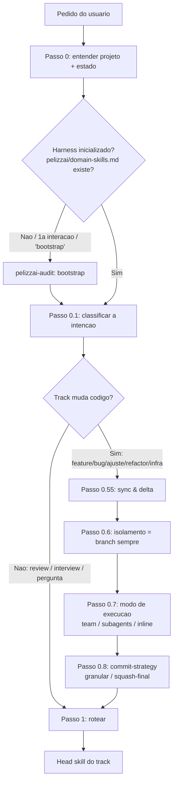
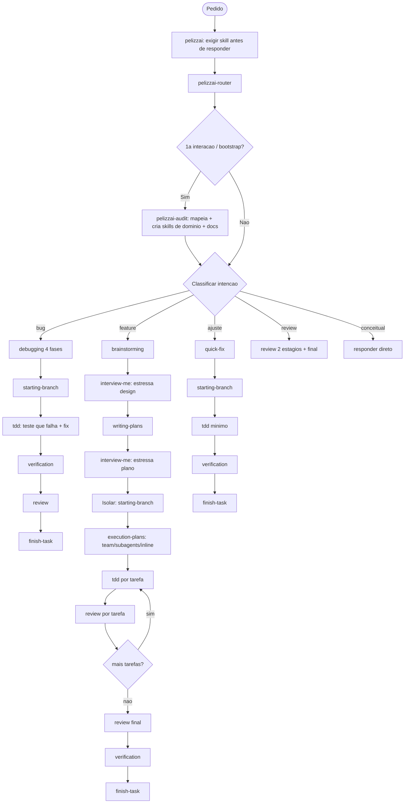

<SUBAGENT-STOP>
Se você foi despachado como subagente/teammate para executar uma tarefa específica, ignore esta skill — o orquestrador já decidiu o contexto para você.
</SUBAGENT-STOP>

# PelizzAI Router

## Objetivo

Ponto de entrada do ciclo de vida de toda tarefa que toca código ou o projeto. Antes de qualquer trabalho criativo, de debugging ou de execução, o router entende o terreno, fixa as decisões de execução e roteia para a skill certa — escolhendo a **menor** combinação de skills que resolve com segurança.

**Anuncie ao iniciar:** "Usando a skill Pelizzai Router para entender a tarefa e preparar o ciclo de trabalho."

> **Princípio:** entender o projeto → ler/criar o estado → classificar a intenção → registrar modo de execução e commit → rotear. Nunca pule direto para implementar.

---

## Quando usar

```text
- USE no início de QUALQUER pedido que possa tocar código, arquivos, config ou o projeto
  (feature, bug, ajuste, refactor, infra, pedido de review).
- NÃO use para conversa pura ou pergunta conceitual que não muda nada — responda direto.
  Mas se virar "então muda lá pra mim", volte aqui.
- Política do harness: trabalhamos SÓ com branches (sem worktrees) — o isolamento é sempre branch.
```

## Camada global: `pelizzai-preferences`

Em paralelo ao track, aplique a `pelizzai-preferences` como **camada global** (idioma, qualidade técnica, segurança, validação, portabilidade, decisões de execução) sempre que a tarefa envolver comunicação, engenharia ou código. Ela **não substitui** as skills específicas — ajusta como o trabalho é feito. Não a acione para tarefas triviais sem risco onde nenhuma preferência mudaria o resultado.

---

## Fluxo do router



---

## Processo

### Passo 0 — Entender o projeto e o estado

Leitura leve do projeto antes de decidir (ferramentas de arquivo e Git, não shell improvisado):

```text
1. É repositório git? (git rev-parse). Se não e a tarefa vai gerar código, ofereça `git init` (não force).
2. Leia o estado do harness: pelizzai/data/state.md.
   - Tarefa ativa real (slug != <none> e phase não-terminal: brainstorm/plan/exec/review)?
     → RETOME sem re-perguntar o registrado; valide a branch contra `git branch --show-current`.
       Em divergência que arrisque o trabalho, reporte e confirme antes de prosseguir.
   - slug: <none> ou phase: done → tarefa anterior FECHADA; classifique o pedido novo do zero e
     sobrescreva o bloco da tarefa ativa (uma tarefa nova NÃO herda as decisões da anterior).
   - phase: blocked → tarefa travada aguardando decisão humana; traga isso à tona antes de começar algo novo.
3. Harness inicializado? Se NÃO existir pelizzai/domain-skills.md (ou for a 1a interação, ou o usuário
   digitou "bootstrap") → roteie para pelizzai-audit (mapeia o projeto, cria skills de domínio e docs)
   ANTES de seguir. A audit cuida do bootstrap; o router cuida do ciclo de cada tarefa.
```

### Passo 0.1 — Classificar a intenção (um track)

| O usuário quer / diz                                                  | Track       | Head skill (Passo 1)                                       |
| --------------------------------------------------------------------- | ----------- | ---------------------------------------------------------- |
| Construir algo novo; "queria um/uma…", nova feature/tela/endpoint     | `feature`   | `pelizzai-brainstorming`                                   |
| Algo quebrado, erro, "não funciona", "tá com bug"                     | `bug`       | `pelizzai-debugging`                                       |
| Mudança pequena e local (texto, label, cor; ~1 arquivo, < ~50 linhas) | `ajuste`    | `pelizzai-quick-fix`                                       |
| Reestruturar sem mudar comportamento                                  | `refactor`  | arquitetural → `pelizzai-brainstorming`; local → `ajuste` → `pelizzai-quick-fix` |
| Infra/devops/config/deploy                                            | `infra`     | estrutural → `pelizzai-brainstorming`; config simples → `ajuste` → `pelizzai-quick-fix` |
| Revisar trabalho feito / preparar PR / "está bom?"                    | `review`    | `pelizzai-review`                                          |
| Estressar um plano/design EXISTENTE; "me questiona"                   | —           | `pelizzai-interview-me`                                    |
| Pergunta conceitual, sem mudar código                                 | —           | responda direto (não entre no fluxo pesado)               |

Quando ambíguo, pergunte em linguagem simples (uma pergunta). Em `refactor`/`infra` pequeno que vai pelo caminho leve, **registre `track: ajuste`** para os gates do ajuste valerem.

### Passo 0.5 — Adaptar ao usuário (audience)

Se o usuário parece não-técnico, **traduza** o que entendeu: "Entendi que você quer **X**. Vou tratar como **<feature/ajuste/bug>**. Faz sentido?" Não despeje jargão (siga a `pelizzai-writing-clearly-and-concisely`). Registre `audience: technical | layperson` no `state.md`.

### Passo 0.55 — Sync & delta (reposcan) — só tracks que mudam código

```bash
git fetch                                          # pule se não houver remoto
git log --oneline --since="<ultima_data> 00:00"    # commits desde a última tarefa
git log --oneline HEAD..origin/<base> 2>/dev/null  # o que a base remota avançou
```

Releia só o que mudou e importa para esta tarefa. Para um `bug`, um commit recente na área que falha é suspeito nº 1 — leve para a `pelizzai-debugging` Fase 1.

### Passo 0.6 — Isolamento (sempre branch)

O harness é **branches-only**. O isolamento é sempre `branch` — não pergunte; apenas **avise**: "Vou trabalhar numa **branch** (sem worktree)." Registre `isolation: branch`. Quem cria a branch é a `pelizzai-starting-branch`; aqui você só decide e registra.

### Passo 0.7 — Modo de execução (team / subagents / inline)

**Pergunte** e registre `execution-mode` (retome o valor só se for tarefa ativa real). Ordem de preferência **team > subagents > inline**, proporcional ao trabalho:

```text
1. team (preferido) — várias frentes/papéis em paralelo, com coordenação/diálogo (pelizzai-team).
2. subagents — um subagente isolado por tarefa, que reporta de volta (pelizzai-subagents).
3. inline — eu mesmo, aqui no chat, tarefa a tarefa (último recurso).
```

Para `ajuste` e `bug`, `inline` é o default natural — confirme brevemente (debugging roda inline; nunca subagentes/paralelo para um bug). Sem worktrees, a escrita paralela não é isolada: o coordenador integra em série (ver `pelizzai-execution-plans`).

### Passo 0.8 — Estratégia de commit (granular / squash-final)

```text
1. Commits graduais (granular) — um commit por passo; histórico detalhado.
2. Um commit final único (squash-final) — acumula tudo e fecha num commit no fim.
```

Registre `commit-strategy`.

### Passo 1 — Rotear para a head skill (com os encadeamentos)

Invoque a head skill do track e **passe o contexto** (o que entendeu, a stack, a isolação, o estado, as **skills de domínio presentes** e o **audience**):

```text
feature → pelizzai-brainstorming → interview-me (estressa o design) → pelizzai-writing-plans
          → interview-me (estressa o plano) → pelizzai-execution-plans (honra o execution-mode)
          → pelizzai-review → pelizzai-verification-before-completion → pelizzai-finish-task
bug     → pelizzai-debugging (inline; chama starting-branch antes do fix; encadeia review + finish-task)
ajuste  → pelizzai-quick-fix (starting-branch → mudança + teste mínimo → finish-task)
refactor→ arquitetural: cadeia de feature (refactor que preserva comportamento na pelizzai-tdd);
          local: registrado como ajuste → pelizzai-quick-fix
infra   → estrutural: cadeia de feature; config simples: registrado como ajuste → pelizzai-quick-fix
review  → pelizzai-review
plano/design existente p/ estressar → pelizzai-interview-me (depois writing-plans, ou volta ao brainstorming)
pergunta conceitual → responda direto (na 1a interação, rode a pelizzai-audit antes do briefing)
```

---

## Mapa de fluxos do harness



> O `pelizzai-loop` envolve a execução: o harness repete o ciclo até a Definition of Done; em dúvida material, para e usa a `pelizzai-interview-me`.

---

## O que o router registra em `pelizzai/data/state.md`

Se `pelizzai/data/state.md` não existir, instancie-o a partir do template da `pelizzai-execution-plans` antes de gravar. Campos: `slug`, `track`, `phase` inicial, `isolation: branch`, `execution-mode` (Passo 0.7), `commit-strategy` (Passo 0.8), `audience` (Passo 0.5), `plan` (quando a writing-plans informa o caminho), `project` (em workspace), e uma linha datada no `## Histórico`. Sobrescreva o bloco da tarefa ativa por inteiro. O fechamento é da `pelizzai-finish-task`.

---

## Red flags

```text
Nunca: pular o Passo 0 e implementar sem entender o projeto; criar a branch aqui (é da starting-branch);
       perguntar worktree (o harness é branches-only); forçar o fluxo pesado de feature num ajuste trivial;
       despejar jargão num usuário não-técnico.
Sempre: na 1a interação, rotear para pelizzai-audit (bootstrap); para tracks que mudam código, fazer o
        Passo 0.55 e registrar modo de execução + commit-strategy antes de qualquer mudança; passar o
        contexto entendido à head skill; aplicar pelizzai-preferences como camada global.
```

---

## Integração

**Chamada por:** `pelizzai` (raiz), no início de toda tarefa que toca código/projeto.

**Decide/roteia para:** `pelizzai-audit` (bootstrap), `pelizzai-starting-branch` (lê o isolamento), `pelizzai-brainstorming` / `pelizzai-debugging` / `pelizzai-quick-fix` / `pelizzai-review` (head skills), `pelizzai-execution-plans` (lê o execution-mode).

**Camada global:** `pelizzai-preferences`. **Combina com:** `pelizzai-finish-task` (fecha o ciclo e atualiza o state.md que o router criou).
