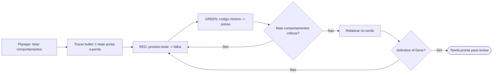

# Desenvolvimento Orientado a Testes (TDD)

## Filosofia

**Princípio fundamental**: Testes devem verificar o comportamento por meio de interfaces públicas, não de detalhes de implementação. O código pode mudar completamente; os testes não deveriam.

**Bons testes** são do tipo integração: eles exercitam caminhos reais de código através de APIs públicas. Eles descrevem _o que_ o sistema faz, não _como_ ele faz. Um bom teste é lido como uma especificação — "usuário pode finalizar a compra com um carrinho válido" informa exatamente qual funcionalidade existe. Esses testes sobrevivem a refatorações porque não dependem da estrutura interna.

**Testes ruins** estão acoplados à implementação. Eles utilizam _mocks_ para colaboradores internos, testam métodos privados ou verificam resultados por meios externos (como consultar um banco de dados diretamente em vez de usar a interface). O sinal de alerta: seu teste quebra quando você refatora, mas o comportamento não mudou. Se você renomeia uma função interna e os testes falham, esses testes estavam testando a implementação, não o comportamento.

Consulte [tests.md](tests.md) para exemplos e [mocking.md](mocking.md) para diretrizes sobre o uso de _mocks_.

## Antipadrão: Fatias Horizontais

**NÃO escreva todos os testes primeiro para depois escrever toda a implementação.** Isso é "fatiamento horizontal" — tratar o estado VERMELHO (RED) como "escrever todos os testes" e o estado VERDE (GREEN) como "escrever todo o código".

Isso gera **testes ruins**:

- Testes escritos em lote testam comportamentos _imaginados_, não comportamentos _reais_
- Você acaba testando a _forma_ das coisas (estruturas de dados, assinaturas de funções) em vez do comportamento visível ao usuário
- Os testes tornam-se insensíveis a mudanças reais: passam quando o comportamento quebra e falham quando o comportamento está correto
- Você avança além da sua visibilidade, comprometendo-se com a estrutura de testes antes de compreender a implementação

**Abordagem correta**: Fatias verticais via _tracer bullets_ (testes de ponta a ponta que percorrem todo o caminho do sistema). Um teste → uma implementação → repetir. Cada teste responde ao que você aprendeu no ciclo anterior. Como você acabou de escrever o código, sabe exatamente qual comportamento é importante e como verificá-lo.

```
ERRADO (horizontal):
  RED:   test1, test2, test3, test4, test5
  GREEN: impl1, impl2, impl3, impl4, impl5

CERTO (vertical):
  RED→GREEN: test1→impl1
  RED→GREEN: test2→impl2
  RED→GREEN: test3→impl3
  ...
```

## Fluxo de Trabalho

### 1. Planejamento

Explore a base de código e respeite as ADRs (Architecture Decision Records — Decisões de Arquitetura) da área em que você está trabalhando.

Antes de escrever qualquer código:

- [ ] Confirme com o usuário quais alterações de interface são necessárias (use `pelizzai-interview-me` quando houver dúvida material)
- [ ] Confirme com o usuário quais comportamentos devem ser testados (priorize-os)
- [ ] Identifique oportunidades para criar módulos "profundos" (interface simples, implementação robusta) — use o vocabulário da `pelizzai-codebase-design` e a `pelizzai-reasoning` (Structured Decomposition) para mapear o vocabulário e a testabilidade; em design novo, isso vem da `pelizzai-brainstorming`
- [ ] Liste os comportamentos a serem testados (não os passos de implementação)
- [ ] Obtenha a aprovação do usuário para o plano

Pergunte: "Como deve ser a interface pública? Quais comportamentos são mais importantes de testar?"

**Não é possível testar tudo.** Confirme com o usuário exatamente quais comportamentos são mais relevantes. Concentre os esforços de teste em caminhos críticos e lógicas complexas, e não em todos os casos de borda (_edge cases_) possíveis.

### 2. Tracer Bullet (Teste de Integração Inicial)

Escreva UM teste que confirme UMA única coisa sobre o sistema:

```
RED:   Escreva o teste para o primeiro comportamento → o teste falha
GREEN:     Escreva o código mínimo para passar → o teste passa
```

Este é o seu _tracer bullet_ (teste de integração inicial) — ele comprova que o caminho funciona de ponta a ponta.

### 3. Ciclo Incremental

Para cada comportamento restante:

```
RED:   Escreva o próximo teste → falha
GREEN: Código mínimo para passar → passa
```

Regras:

- Um teste por vez
- Apenas o código necessário para passar no teste atual
- Não antecipe testes futuros
- Mantenha os testes focados em comportamento observável

### 4. Refatoração

Após todos os testes passarem, identifique [candidatos à refatoração](refactoring.md):

- [ ] Extraia código duplicado
- [ ] Aprofunde módulos (encapsule a complexidade atrás de interfaces simples)
- [ ] Aplique princípios SOLID onde fizer sentido
- [ ] Considere o que o novo código revela sobre o código existente
- [ ] Execute os testes após cada etapa de refatoração

**Nunca refatore enquanto estiver no estado VERMELHO (RED).** Primeiro, chegue ao estado VERDE (GREEN).

## Checklist por Ciclo

```
[ ] O teste descreve o comportamento, não a implementação
[ ] O teste utiliza apenas a interface pública
[ ] O teste resistiria a uma refatoração interna
[ ] O código é o mínimo necessário para este teste
[ ] Nenhuma funcionalidade especulativa foi adicionada
```

## Ciclo de TDD (visão geral)



## Integração no harness

**Quando o TDD entra:**

- Diretamente, quando o usuário desenvolve test-first ou corrige um bug — escreva primeiro o teste de regressão que reproduz o bug.
- Como **disciplina por tarefa** ao executar um plano: a `pelizzai-execution-plans` despacha um subagente por tarefa, e cada tarefa é implementada por este ciclo TDD.
- Por **membros de `pelizzai-team` / `pelizzai-subagents`**: cada membro que escreve código implementa sua frente via TDD.
- **Caminho leve:** para um único teste de regressão (`pelizzai-debugging` Fase 4) ou um teste mínimo de ajuste (`pelizzai-quick-fix`), pule a cerimônia de aprovação de plano do Planejamento — o comportamento-alvo já está fixado pela causa raiz / pelo critério do ajuste.

**Raciocínio — `pelizzai-reasoning`:**

- Planejamento: liste os comportamentos com *Structured Decomposition* (comportamentos, não passos de implementação).
- Teste vermelho inesperado ou bug: *Root Cause Analysis* antes de mexer no código.
- Estado verde: *Verification* confirma que o comportamento existe de fato — não basta "passou".

**Loop até a entrega — `pelizzai-loop`:**

- O ciclo RED→GREEN é um loop: repita teste→código por comportamento até a *Definition of Done* (comportamentos críticos testados e verdes, refatorado no verde).
- No nível da tarefa/plano, o harness mantém o loop (implementar → testar → revisar → corrigir) até a tarefa ser entregue com êxito. Em dúvida material, **pare** e use `pelizzai-interview-me`.

**Aprovação e conclusão:**

- Confirme interface e comportamentos com `pelizzai-interview-me`, ou no design aprovado da `pelizzai-brainstorming`, antes de escrever testes.
- Antes de declarar pronto, passe pela `pelizzai-verification-before-completion` e pela `pelizzai-review`.
