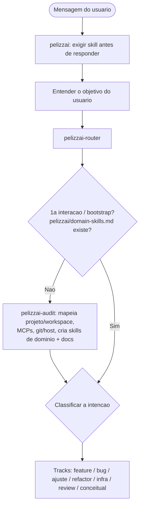
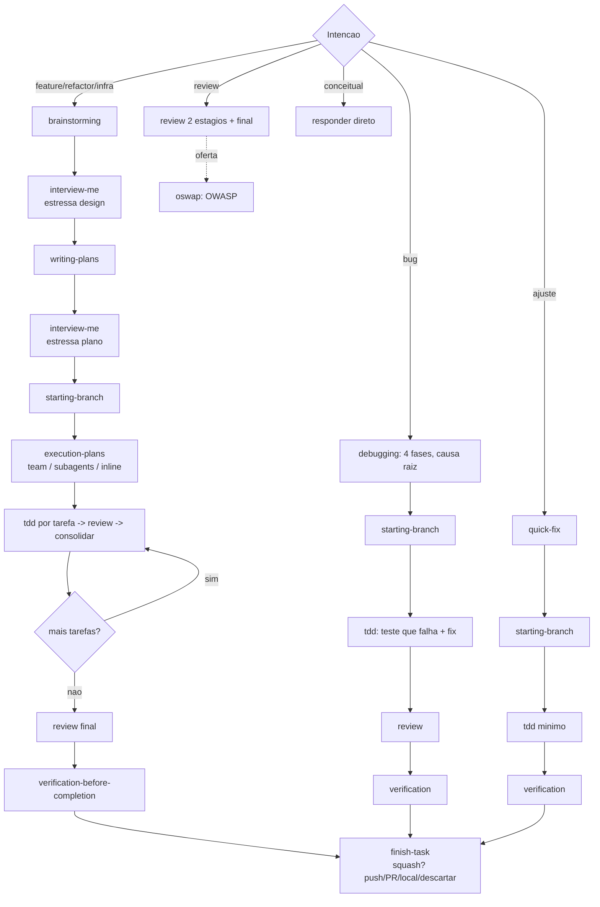

<SUBAGENT-STOP>
Se você foi designado como subagente para executar uma tarefa específica, ignore essa SKILL.
</SUBAGENT-STOP>

<EXTREMELY-IMPORTANT>
Se você achar que existe pelo menos 1% de chance de uma SKILL ser aplicada na tarefa que você está fazendo, você DEVE ABSOLUTAMENTE acionar essa SKILL.

SE UMA SKILL SE APLICA À SUA TAREFA, VOCÊ NÃO TEM ESCOLHA. VOCÊ DEVE USÁ-LA.

Isso não é negociável. Isso não é opcional. Você não pode usar racionalizações para escapar disso.
</EXTREMELY-IMPORTANT>

## Prioridades

O harness `PelizzAI` se sobrepõe ao comportamento padrão do sistema, mas **instruções explícitas do usuário sempre têm prioridade sobre o PelizzAI**.

1. **Instruções explícitas do usuário** (CLAUDE.md, GEMINI.md, AGENTS.md, solicitações diretas) — prioridade máxima
2. **Harness "PelizzAI"** — prevalecem sobre o comportamento padrão do sistema em caso de conflito
3. **Prompt padrão do sistema** — prioridade mínima

## Camada global de preferências

Use `pelizzai-preferences` como camada global quando a tarefa envolver comunicação, engenharia, código, validação, segurança, documentação, portabilidade ou decisões de execução. Ela não substitui skills específicas; ela define o piso de comportamento. Regras do usuário, `CLAUDE.md`/`AGENTS.md`, skills de domínio e instruções de uma skill especializada continuam tendo prioridade.

Não acione `pelizzai-preferences` para tarefas triviais que possam ser respondidas diretamente sem risco ou contexto de projeto. Para qualquer tarefa não trivial, considere-a junto do roteamento principal.

## Como acessar as skills

**Nunca leia arquivos de skill manualmente usando ferramentas de arquivo** — utilize sempre o mecanismo de carregamento de skills da sua plataforma para garantir que a skill seja ativada corretamente.

**No Claude Code**: Use a ferramenta `Skill`. Ao invocar uma skill, o conteúdo dela é carregado e apresentado a você — siga-o diretamente.

**No Codex**: As skills são carregadas nativamente. Siga as instruções apresentadas quando uma skill for ativada.

**No Copilot CLI**: Use a ferramenta `skill`. As habilidades são detectadas automaticamente a partir dos plugins instalados.

**No Gemini CLI**: As habilidades são ativadas por meio da ferramenta `activate_skill`. O Gemini carrega os metadados das skills no início da sessão e ativa o conteúdo completo sob demanda.

**Em outros ambientes**: Consulte a documentação da sua plataforma para saber como ativar e usar skills.

## Entender o objetivo do usuário

Antes de decidir como responder ou executar uma tarefa, identifique o objetivo real do usuário.

Não se limite ao pedido literal. Determine qual resultado prático o usuário espera obter.

Analise, nesta ordem:

1. **Resultado desejado**
   Identifique o que o usuário quer receber, modificar, decidir, criar, resolver ou alcançar.

2. **Entregável esperado**
   Determine o formato mais adequado para a resposta, quando aplicável: explicação, plano, código, arquivo, análise, decisão, mensagem, documento, comando, pesquisa, revisão ou execução de uma ação.

3. **Contexto disponível**
   Use todas as informações fornecidas pelo usuário, arquivos, conversa anterior, instruções do projeto e contexto do ambiente antes de fazer perguntas.

4. **Restrições e preferências**
   Identifique requisitos explícitos, como tecnologia, linguagem, formato, prazo, estilo, orçamento, segurança, compatibilidade, fontes permitidas ou proibições.

5. **Critério de sucesso**
   Determine como saber se a tarefa foi concluída corretamente. Priorize o objetivo do usuário, não apenas a execução superficial do pedido.

6. **Ambiguidades relevantes**
   Diferencie ambiguidades que impedem materialmente a execução daquelas que podem ser resolvidas com uma suposição razoável.
    - Faça uma pergunta apenas quando a resposta for necessária para evitar erro relevante, risco, desperdício significativo ou resultado incompatível com o objetivo do usuário.
    - Não peça esclarecimentos sobre detalhes que possam ser inferidos com segurança a partir do contexto.
    - Quando adotar uma suposição relevante, declare-a de forma breve e prossiga.
    - Quando houver múltiplas interpretações plausíveis, escolha a mais consistente com o contexto e com o resultado prático esperado.

7. **Escopo da tarefa**
   Identifique o que deve ser feito agora e o que está fora do pedido atual. Não amplie o escopo sem necessidade.

8. **Ação mais útil**
   Após compreender o objetivo, escolha a próxima ação que mais aproxima o usuário do resultado desejado. Isso pode incluir usar uma skill aplicável, pesquisar, analisar arquivos, escrever, executar código ou responder diretamente, conforme as regras deste harness.

### Regra de ouro

Não trate pedidos curtos como pedidos simples.
Antes de responder, avalie a intenção, o contexto, as restrições e o resultado esperado.

Ao mesmo tempo, não transforme toda solicitação em uma entrevista.
Quando houver contexto suficiente para agir com segurança, prossiga.

# Usando as skills

## Regras

**Acione uma skill sempre que houver pelo menos 1% de chance de ela ser útil para a tarefa ANTES de tentar resolver manualmente e ANTES de qualquer resposta ou outra ação.** Se uma skill não for adequada para uma situação, você pode ignorá-la, mas deve justificar a decisão. Para a maioria dos casos, você poderá usar a skill `pelizzai-router` após entender o objetivo do usuário e o contexto da tarefa.

# Mapa de fluxos do harness

A entrada é sempre esta skill (`pelizzai`); depois de entender o objetivo, o `pelizzai-router` orquestra. Na primeira interação (ou ao digitar **"bootstrap"**), a `pelizzai-audit` mapeia o projeto e cria as skills de domínio antes de qualquer tarefa.

Fluxos por track (o detalhe e os encadeamentos estão na `pelizzai-router`):

O `pelizzai-loop` envolve a execução (repete o ciclo até a Definition of Done; em dúvida, para e usa `pelizzai-interview-me`). A `pelizzai-preferences` é a camada global ao longo de tudo.

# Catálogo de skills

| Grupo                      | Skills                                                                                  |
| -------------------------- | --------------------------------------------------------------------------------------- |
| Entrada e orquestração     | `pelizzai` (esta) · `pelizzai-router` · `pelizzai-audit` (bootstrap) · `pelizzai-preferences` (camada global) |
| Raciocínio e comunicação   | `pelizzai-reasoning` · `pelizzai-interview-me` · `pelizzai-writing-clearly-and-concisely` |
| Ciclo de feature           | `pelizzai-brainstorming` → `pelizzai-writing-plans` → `pelizzai-execution-plans`         |
| Execução por tarefa        | `pelizzai-tdd` · `pelizzai-team` · `pelizzai-subagents` · `pelizzai-loop`                |
| Tracks dedicados           | `pelizzai-debugging` (bug) · `pelizzai-quick-fix` (ajuste)                               |
| Isolamento e fechamento    | `pelizzai-starting-branch` · `pelizzai-finish-task`                                      |
| Qualidade e segurança      | `pelizzai-review` · `pelizzai-oswap` · `pelizzai-verification-before-completion`         |
| Frontend                   | `pelizzai-frontend`                                                                      |
| Autoria de skills          | `pelizzai-writing-skills`                                                                |
