# PelizzAI - Harness de agentes

> **Status:** projeto em desenvolvimento.
>
> **Fonte de verdade:** `.claude/skills/` (as skills) e `CLAUDE.md` (as diretrizes).
>
> **Distribuição multi-IDE:** o formato SKILL.md é um padrão aberto lido nativamente por
> Claude Code, OpenAI Codex, Gemini CLI, Cursor, GitHub Copilot e outras ferramentas. O
> `scripts/sync-harness.ps1` gera, a partir da fonte, o espelho interoperável `.agents/skills/`
> e os adaptadores de entrada `AGENTS.md` e `GEMINI.md`; o Cursor tem o adaptador
> `.cursor/rules/pelizzai.mdc`. Um CI (`-Check`) impede que os gerados saiam de sincronia.

PelizzAI é um harness de agentes baseado em **skills Markdown**, em português do Brasil,
para conduzir tarefas de software com disciplina de produção: entender o objetivo,
mapear o projeto, escolher o fluxo certo, isolar em branch ou worktree, executar com TDD,
revisar com evidência, validar a entrega como um líder técnico, verificar antes de afirmar
conclusão e fechar a entrega de forma deliberada.

O harness não é um framework de runtime. Ele é um **sistema operacional de trabalho para
agentes**: as skills definem quando agir, como decompor, quando delegar, como revisar,
quais artefatos persistir e onde exigir decisão humana.

## Visão geral

O PelizzAI tem quatro camadas:

1. **Entrada e roteamento:** `pelizzai-core` força o uso de skills; `pelizzai-router`
   entende a tarefa e escolhe o track.
2. **Ciclo de vida:** bootstrap, brainstorming, plano, gate de setup pós-plano, execução,
   debugging, ajuste, review, validação final e fechamento.
3. **Execução com agentes:** coordenador, teammates nativos do Claude Code quando
   disponíveis, subagents como fallback e execução inline como último recurso — todos
   recebendo skills de domínio, `pelizzai-preferences` e `pelizzai-reasoning` no briefing.
4. **Estado do projeto alvo:** diretório `pelizzai/`, skills de domínio, specs,
   planos, ADRs, cursor de tarefa e ledger de manutenção.

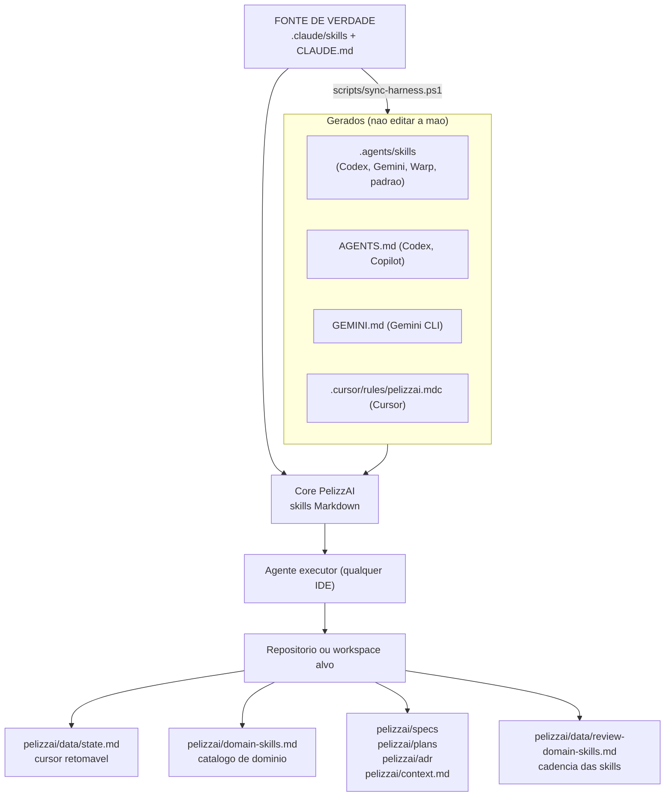

## O que existe neste repositório

```text
PelizzAI/
├── CLAUDE.md                         FONTE: diretrizes + ponte para o harness
├── README.md                         este mapa do harness
├── AGENTS.md                         GERADO: CLAUDE.md + seção do harness (Codex, Copilot, …)
├── GEMINI.md                         GERADO: cópia de AGENTS.md (Gemini CLI)
├── scripts/
│   ├── sync-harness.ps1              gera os alvos; -Check (anti-drift); -UpdateManifest
│   └── pelizzai-core-skills.txt      GERADO: manifesto das skills de core
├── .github/workflows/
│   └── check-harness.yml             CI: roda sync-harness.ps1 -Check
├── .cursor/rules/
│   └── pelizzai.mdc                  adaptador de entrada do Cursor (alwaysApply)
├── .agents/
│   └── skills/                       GERADO: espelho 1:1 de .claude/skills (padrão interoperável)
└── .claude/                          FONTE
    ├── hooks/
    │   ├── pelizzai-cadence.mjs       hook opt-in de cadencia para Claude Code
    │   └── pelizzai-cadence.ps1       variante PowerShell do hook
    └── skills/
        ├── pelizzai-core/             skill raiz (entrada obrigatória)
        ├── pelizzai-router/           roteador do ciclo de vida
        ├── pelizzai-audit/            bootstrap e repo-scan
        ├── pelizzai-execution-plans/  executor de planos + gate de setup pós-plano
        └── pelizzai-*/                demais skills de processo
```

Os alvos **gerados** (`.agents/skills/`, `AGENTS.md`, `GEMINI.md`, `scripts/pelizzai-core-skills.txt`)
são versionados mas **nunca editados à mão** — edite a fonte e rode `pwsh scripts/sync-harness.ps1`.
O CI falha se algum sair de sincronia.

Hoje, a distribuição prática está em `.claude`. O README descreve também os invariantes
que devem sobreviver às versões futuras para outras IDEs.

## Princípios

- **Skills-first:** a inteligência vive nas skills, não em código oculto.
- **Marca "PelizzAI":** todo anúncio de skill usa a grafia exata "PelizzAI" (regra global
  na `pelizzai-core`); identificadores (`pelizzai-*`) e o diretório `pelizzai/` ficam em minúsculas.
- **Claude Code primeiro, portável depois:** o projeto atual é Claude Code; a arquitetura
  evita amarrar a lógica do harness a um único runtime.
- **Isolamento escolhido pelo usuário:** `branch` (troca no lugar) ou `worktree` (working
  tree isolado, habilita escrita paralela em caminhos disjuntos). Nos tracks com plano, a
  escolha acontece no **gate de setup pós-plano**; num ajuste pontual, branch com alerta.
- **Proporcionalidade:** use o menor fluxo seguro; ajuste trivial não vira ritual pesado.
- **Evidência antes de afirmação:** nada de "pronto", "passa" ou "corrigido" sem comando
  rodado, saída lida e evidência fresca.
- **Gates humanos nas bordas:** setup pós-plano (isolamento, nome, modo de execução,
  estratégia de commit), push, PR e descarte são decisões explícitas — e honradas até o
  fim (granular não vira squash; tarefa nova não herda decisões da anterior).
- **Autonomia entre tarefas:** uma vez aprovado o plano e feito o setup, o agente executa
  tarefa por tarefa sem pedir permissão a cada passo, parando apenas por bloqueio real.
- **Loop OODA:** o laço de execução re-observa a realidade (git, testes, reviews) a cada
  iteração antes de decidir a próxima ação (`pelizzai-loop`, `pelizzai-reasoning`).
- **Domínio explícito:** cada projeto alvo ganha skills de domínio próprias, catalogadas e
  mantidas com base no código real e em documentação atual (MCP `context7` como fonte
  primária de docs de libs/frameworks; a web como fallback).

## Fluxo global

Toda tarefa que toca o projeto passa pela raiz `pelizzai-core`, pelo roteador e por um track.
Na primeira interação com um projeto alvo, ou quando o usuário digita `bootstrap`, o
roteador manda primeiro para o bootstrap.

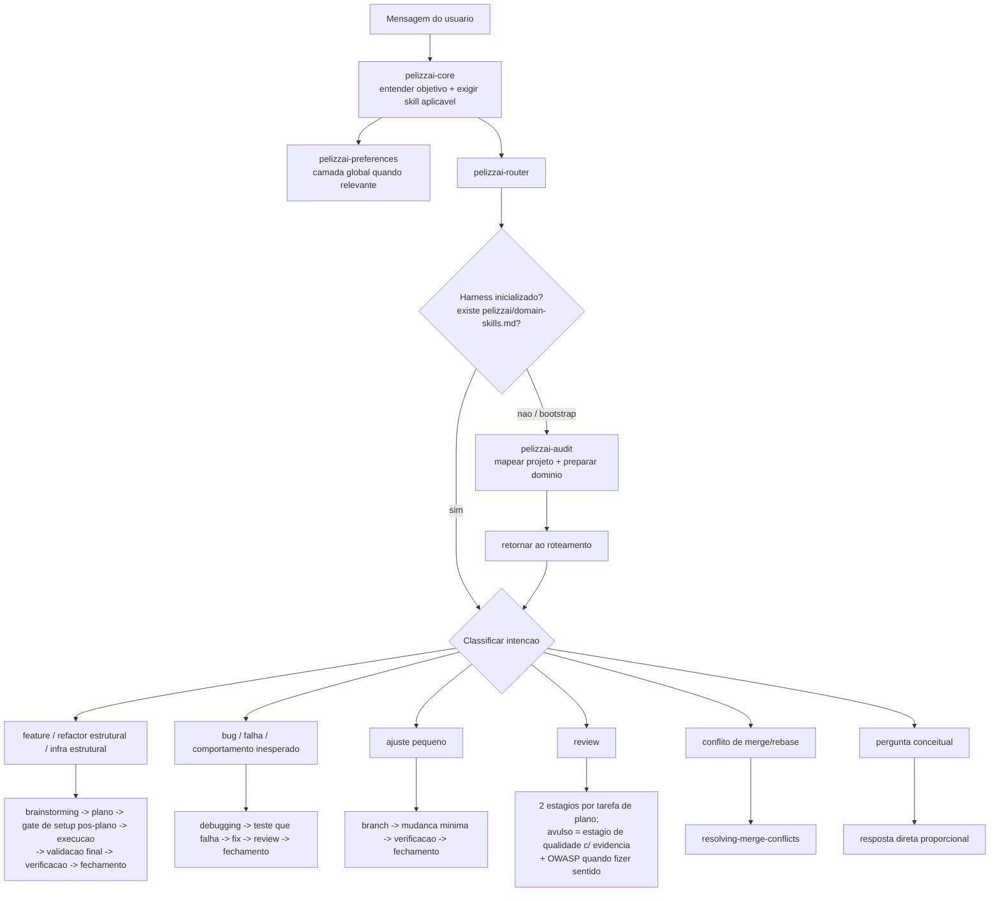

## Bootstrap

O bootstrap cria o contexto reutilizável do harness dentro do projeto alvo. Ele distingue
projeto novo, projeto existente e workspace, faz repo-scan, identifica stack, MCPs, git,
convenções e skills existentes, e então aciona `pelizzai-writing-skills` para criar e
catalogar skills de domínio.

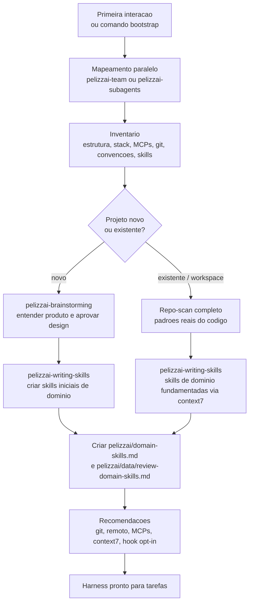

O sinal canônico de bootstrap concluído é `pelizzai/domain-skills.md`, não apenas a
existência de skills avulsas.

## Tracks principais

### Feature, refactor estrutural e infra estrutural

Features e mudanças estruturais passam por design, plano, gate de setup e execução. O design
e o plano são estressados com `pelizzai-interview-me` antes de virar implementação.

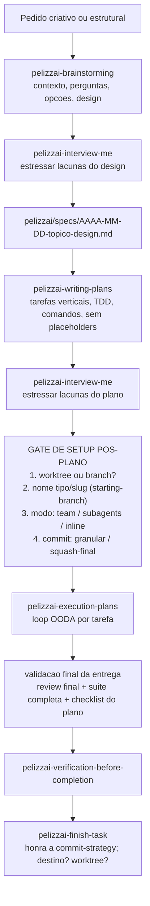

### Bug

Debugging é inline por padrão. O harness proíbe correção por palpite: primeiro reproduz,
investiga causa raiz, compara padrões, testa hipótese e só então implementa. As quatro
fases são um ciclo OODA (observar → orientar → decidir → agir).

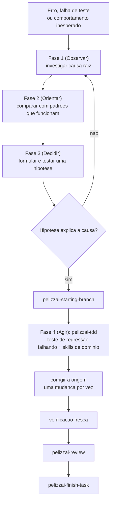

Após três tentativas de fix sem sucesso, o fluxo para e escala: a hipótese ou a arquitetura
precisa ser reavaliada.

### Ajuste pequeno

O track `ajuste` pula design e plano, mas não pula branch, skills de domínio, verificação
nem fechamento. Ele só vale quando a mudança é pequena, local, sem nova superfície pública
e sem regra de negócio nova. Num ajuste não se oferece worktree — branch com alerta.

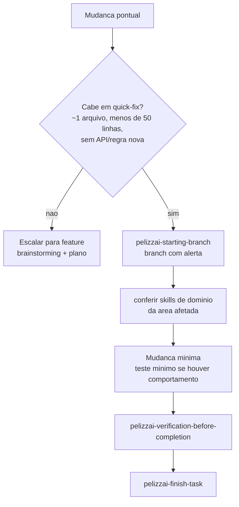

## Gate de setup pós-plano

Com o plano salvo e estressado, a `pelizzai-execution-plans` conduz **quatro perguntas, em
ordem**, antes da Tarefa 1 (registradas em `pelizzai/data/state.md`; tarefa nova nunca herda
as respostas da anterior):

| # | Pergunta                       | Opções                                                        |
| - | ------------------------------ | ------------------------------------------------------------- |
| 1 | Isolamento                     | `branch` (troca no lugar) · `worktree` (cópia isolada; habilita escrita paralela em caminhos disjuntos) |
| 2 | Nome da branch/worktree        | `pelizzai-starting-branch` sugere `<tipo>/<slug>` a partir do track (`feat/`, `fix/`, `refactor/`, …) e confirma |
| 3 | Modo de execução               | `team` (preferido; time coordenado) · `subagents` (um por tarefa) · `inline` — **as três opções sempre visíveis** |
| 4 | Estratégia de commit           | `granular` (commits definitivos mantidos — sem squash no fim) · `squash-final` (commits wip + consolidação final já autorizada) |

Para `bug` e `ajuste` (sem plano), o router resolve as mesmas decisões no início, com
defaults confirmados brevemente (bug) ou alerta (ajuste).

## Loop de execução por tarefa

`pelizzai-execution-plans` é o motor de execução de planos aprovados. Ele mantém o cursor
em `pelizzai/data/state.md`, lê o plano, cola a tarefa, as skills de domínio e a camada
global (`pelizzai-preferences` + `pelizzai-reasoning`, com as skills de domínio prevalecendo)
no briefing de cada executor, e só consolida quando spec e qualidade passam. O laço macro
é um ciclo OODA até a Definition of Done.

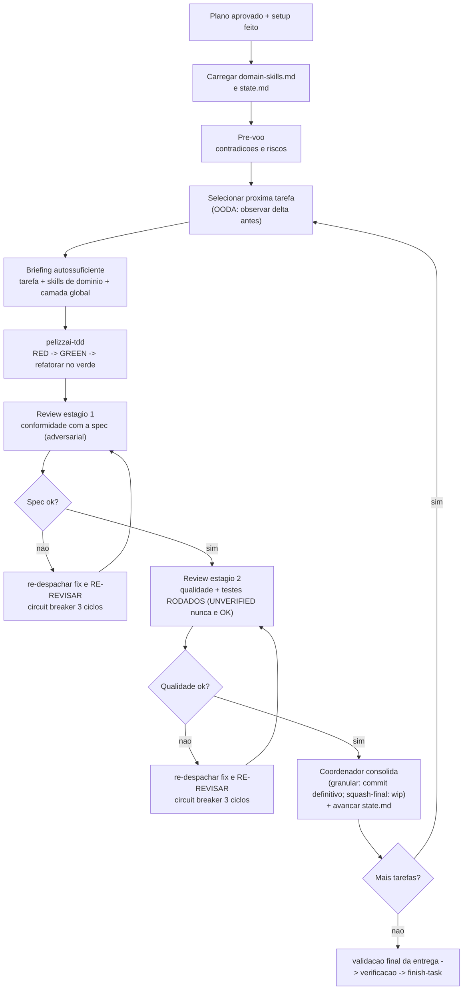

O membro implementador não commita. O commit é gate do coordenador após os dois reviews.
Fixes de review voltam ao implementador (nunca corrigidos à mão pelo coordenador) e são
sempre re-revisados no mesmo estágio.

## Validação final da entrega (coordenador/líder)

Nenhum plano é declarado entregue sem o coordenador validar a entrega inteira, nesta ordem:

```text
1. Review final da branch inteira (pelizzai-review, modelo mais capaz, effort máximo).
2. Suíte completa (testes + lint + build) rodada pelo próprio coordenador, com saída e
   exit code — nunca reaproveitando runs por tarefa nem confiando em relatório de membro.
3. Checklist do plano, requisito a requisito — conformidade é binária.
4. pelizzai-verification-before-completion (evidência fresca antes de qualquer alegação).
5. pelizzai-finish-task (fechamento).
```

## Time de agentes

`pelizzai-team` coordena múltiplos papéis quando há paralelismo real: investigação por
hipóteses, revisão multi-perspectiva, pesquisa ampla ou frentes cross-layer. Se o Agent
Teams nativo do Claude Code estiver habilitado e os membros precisarem conversar, usa
teammates. Caso contrário, monta o equivalente com subagents.

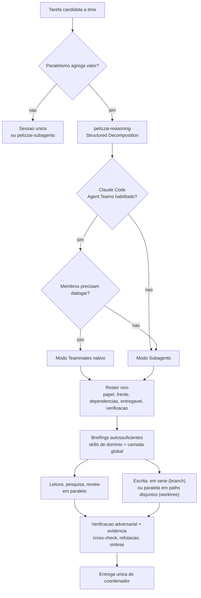

Papéis típicos:

| Papel | Função |
| --- | --- |
| Coordenador | Decompõe, cria roster, delega, verifica, integra, valida a entrega e decide conclusão. |
| Investigador | Mapeia código, logs, docs ou hipótese específica. |
| Implementador | Escreve uma frente delimitada, via TDD, sem commitar. |
| Revisor | Audita spec, qualidade, segurança, performance, testes ou acessibilidade. |
| Refutador | Tenta derrubar hipóteses e achados para reduzir viés de confirmação. |
| Verificador / QA | Reproduz comportamento, roda checks e valida evidência. |
| Documentador | Consolida decisões, specs, planos ou relatórios. |

Limite importante: a escrita paralela depende do isolamento escolhido. Com `branch`, não
existe escrita paralela isolada no mesmo working tree — o coordenador integra em série.
Com `worktree`, as frentes escrevem em paralelo **dentro do worktree único da tarefa**,
desde que toquem caminhos disjuntos (nunca um worktree por agente). Review, commit e
cursor continuam serializados pelo coordenador.

## Estado e artefatos no projeto alvo

Ao inicializar um projeto ou workspace, o PelizzAI cria artefatos em `pelizzai/` na raiz.
Esse diretório é a memória operacional do harness dentro daquele projeto.

```text
pelizzai/
├── domain-skills.md              catalogo de skills de dominio; marca bootstrap concluido
├── context.md                    glossario de dominio, criado sob demanda
├── context/                      glossarios por contexto, em workspaces maiores
├── context-map.md                mapa entre contextos, quando existir
├── adr/                          decisoes de arquitetura
├── specs/                        designs aprovados
├── plans/                        planos de implementacao
└── data/
    ├── state.md                  cursor da tarefa ativa
    ├── review-domain-skills.md   ledger de manutencao de skills de dominio
    └── .cadence-state.json       contador local do hook; deve ficar no .gitignore
```

`state.md` é o cursor retomável. Ele registra `slug`, `track`, `phase`, `branch`,
`isolation`, `worktree-path`, `execution-mode`, `commit-strategy`, `audience`, `plan`,
`project`, progresso e histórico.

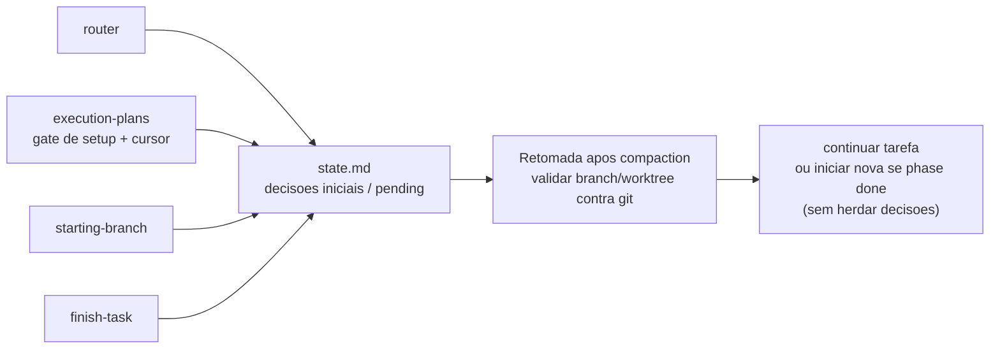

Estados principais:

| Campo | Uso |
| --- | --- |
| `slug` | Identidade da tarefa ativa; `<none>` significa sem tarefa ativa. |
| `track` | `feature`, `bug`, `ajuste`, `refactor`, `infra` ou `review`. |
| `phase` | `brainstorm`, `plan`, `exec`, `review`, `done` ou `blocked`. |
| `branch` | Branch de trabalho validada contra o git ao retomar. |
| `isolation` | `pending`, `branch` ou `worktree` — escolhido pelo usuário no gate. |
| `worktree-path` | Caminho do worktree, quando `isolation: worktree`. |
| `execution-mode` | `pending`, `team`, `subagents` ou `inline`. |
| `commit-strategy` | `pending`, `granular` ou `squash-final` — honrada até o fim. |
| `audience` | `technical` ou `layperson` — modula a linguagem dos gates. |
| `plan` | Caminho do plano em execução, quando houver. |

## Gates de branch, verificação e fechamento

O harness protege o histórico e a confiança do usuário com gates fortes.

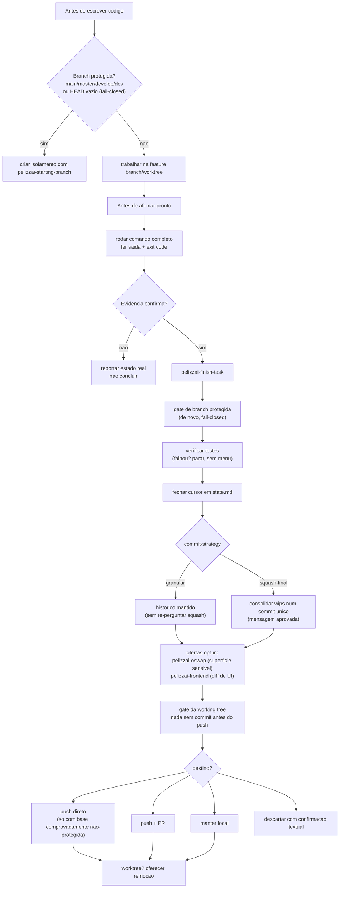

Nada dá push, abre PR ou descarta branch sem confirmação explícita. A estratégia de commit
escolhida no setup é honrada — `granular` mantém o histórico (squash só a pedido explícito);
`squash-final` consolida os commits wip num único commit final já autorizado.

## Manutenção das skills de domínio

As skills de domínio não são estáticas. `pelizzai-writing-skills` cria e mantém essas
skills usando dois eixos: mudança de versão da stack e padrões repetidos no histórico.

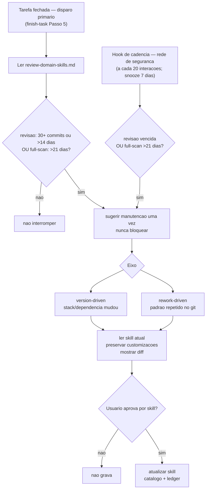

O nudge pós-tarefa (finish-task Passo 5) é o **disparo primário** e checa os dois gatilhos do
ledger: ≥30 commits **ou** >14 dias desde `last-review` (o eixo de dias é a âncora de ~sprint;
commits só antecipam num burst real), e >21 dias desde `last-full-scan` — é o núcleo portável da
cadência, definido em `pelizzai-writing-skills`. Os limiares são calibrados para times ativos
(o antigo 10/10 disparava cedo demais — 10 commits acontecem numa manhã). No Claude Code há a
rede de segurança opcional `.claude/hooks/pelizzai-cadence.mjs`/`.ps1`: roda em `UserPromptSubmit`,
conta interações e a cada 20 verifica o ledger, com supressão de 7 dias após avisar. Sempre sai
com código 0, engole erros e nunca bloqueia o usuário. O ledger é semeado com a data do bootstrap
(não a do 1º commit), para não disparar um nudge espúrio já na primeira tarefa de um repo maduro.

## Catálogo de skills do harness

| Grupo | Skills | Responsabilidade |
| --- | --- | --- |
| Entrada e orquestração | `pelizzai-core`, `pelizzai-router`, `pelizzai-audit`, `pelizzai-preferences` | Entrada obrigatória, roteamento, bootstrap e piso global de comportamento. |
| Raciocínio e conversa | `pelizzai-reasoning` (13 técnicas, incl. OODA), `pelizzai-interview-me`, `pelizzai-writing-clearly-and-concisely` | Técnicas proporcionais de raciocínio, entrevistas para resolver ambiguidade e escrita clara. |
| Feature | `pelizzai-brainstorming`, `pelizzai-writing-plans`, `pelizzai-execution-plans` | Design aprovado, plano executável, gate de setup pós-plano e execução tarefa por tarefa. |
| Execução | `pelizzai-tdd`, `pelizzai-team`, `pelizzai-subagents`, `pelizzai-loop` | TDD, delegação, times, e o loop OODA até a Definition of Done. |
| Tracks leves/dedicados | `pelizzai-debugging`, `pelizzai-quick-fix` | Bug com causa raiz e ajuste pontual sem perder disciplina. |
| Design e exploração | `pelizzai-codebase-design`, `pelizzai-domain-modeling`, `pelizzai-prototype` | Módulos profundos, modelo de domínio, ADRs e protótipos descartáveis. |
| Isolamento e integração | `pelizzai-starting-branch`, `pelizzai-finish-task`, `pelizzai-resolving-merge-conflicts` | Branch/worktree seguros, fechamento honrando a commit-strategy, push/PR e conflitos. |
| Qualidade e segurança | `pelizzai-review`, `pelizzai-oswap`, `pelizzai-verification-before-completion` | Review em dois estágios + review final, OWASP no diff e evidência antes de conclusão. |
| Frontend | `pelizzai-frontend` | Produto, design, implementação e QA visual para UI. |
| Skills | `pelizzai-writing-skills` | Autoria e manutenção de skills de domínio (fundamentadas no context7). |

## Como começar em um projeto alvo

Copie para o projeto ou workspace alvo os diretórios/arquivos do harness conforme a(s) IDE(s)
que você usa (todos gerados a partir da mesma fonte, então são coerentes entre si):

| IDE / ferramenta         | O que copiar para o projeto alvo                                  |
| ------------------------ | ---------------------------------------------------------------- |
| Claude Code              | `.claude/` (skills + hooks)                                       |
| Codex, Warp, genéricos   | `.agents/skills/` + `AGENTS.md`                                   |
| Gemini CLI               | `.agents/skills/` + `GEMINI.md` (ou `AGENTS.md`)                  |
| Cursor                   | `.agents/skills/` + `.cursor/rules/pelizzai.mdc`                  |
| GitHub Copilot           | `AGENTS.md` (entrada); `.agents/skills/` para carregamento nativo |

Uso global (vale em qualquer projeto da máquina, sem copiar por projeto): coloque as skills em
`~/.claude/skills/` (Claude Code) ou `~/.agents/skills/` (caminho interoperável das demais).

Depois:

1. Abra o projeto na sua IDE.
2. Peça `bootstrap`.
3. Revise as skills de domínio criadas, o catálogo `pelizzai/domain-skills.md` e o ledger
   `pelizzai/data/review-domain-skills.md`.
4. (Claude Code) Opte ou não pelo hook de cadência.
5. Depois do bootstrap, peça a tarefa normalmente; o router escolhe o fluxo.

**Ao evoluir o harness** (editar `.claude/skills/` ou `CLAUDE.md`), rode
`pwsh scripts/sync-harness.ps1` para regenerar os alvos, e recopie-os para os projetos alvo.
Para instalar globalmente sem copiar por projeto, aponte `~/.agents/skills/` para este repositório
(link simbólico) ou faça um pull periódico.

## O que é específico por ferramenta hoje

| Parte | Situação atual |
| --- | --- |
| Skills (conteúdo) | **Portáveis** — SKILL.md é padrão aberto. Fonte em `.claude/skills/`, espelho gerado em `.agents/skills/` (com instruções de ativação por plataforma embutidas na `pelizzai-core`). |
| Entrada sempre-carregada | `CLAUDE.md` (Claude Code) · `AGENTS.md` (Codex, Copilot) · `GEMINI.md` (Gemini CLI) · `.cursor/rules/pelizzai.mdc` (Cursor) — todos gerados da mesma fonte. |
| Hooks | `.claude/hooks/pelizzai-cadence.*` são **Claude Code-only**; o núcleo da cadência é portável (finish-task Passo 5) e vale nas demais IDEs sem o hook. |
| Agent Teams | Suportado pela `pelizzai-team` quando o Claude Code tem o recurso habilitado; fora disso, degrada para subagents. |
| Subagents | Ferramenta `Agent`/`Task` do ambiente; cada plataforma tem o seu mecanismo. |

O que **permanece igual** em qualquer IDE:

- nomes e responsabilidades das skills;
- diretório `pelizzai/` no projeto alvo e o schema operacional do `state.md`;
- o gate de setup pós-plano (isolamento, nome, modo, commit) e a honra às decisões;
- loop OODA: TDD -> review em 2 estágios -> validação final -> verificação -> fechamento;
- manutenção das skills de domínio por catálogo e ledger.

## Limites conhecidos

- O carregamento **nativo** de skills por diretório específico varia por ferramenta: `.agents/skills/`
  cobre Codex, Gemini CLI (alias) e Warp; ferramentas que só leem o próprio diretório (ex.: alguns
  fluxos do Copilot em `.github/skills/`) recebem a entrada via `AGENTS.md` e podem receber o espelho
  nativo adicionando o diretório ao array de alvos do `sync-harness.ps1`.
- O `sync-harness.ps1` exige **PowerShell 7+** (encoding UTF-8); o CI roda em `windows-latest`.
- O hook de cadência é específico do Claude Code e é opt-in.
- Agent Teams é experimental no Claude Code; sem ele, o harness degrada para subagents.
- No Windows, teammates devem usar visualização `in-process`; `split-panes` exige tmux/iTerm2.
- Escrita paralela exige `isolation: worktree` com caminhos disjuntos; em `branch`, a
  integração de escrita é em série pelo coordenador.
- `context7` é o MCP preferencial para fundamentar skills e APIs atuais, mas a
  instalação/configuração depende do ambiente do usuário (a `pelizzai-audit` recomenda no bootstrap).

## Evoluindo o harness

Skills do harness (`pelizzai-*`) só devem ser editadas por pedido explícito. A manutenção
autônoma atua apenas sobre skills de domínio dos projetos alvo.

Ao alterar uma skill:

1. Preserve `frontmatter` com apenas `name` e `description`.
2. Mantenha `SKILL.md` enxuto; mova profundidade para `references/`, `templates/` ou `scripts/`.
3. Atualize este README quando a alteração mudar fluxos, gates, diretórios ou expectativas.
4. Se a skill tiver comportamento verificável, acrescente ou rode evals quando existirem.

O objetivo do PelizzAI é simples de dizer e difícil de executar: fazer agentes trabalharem
como uma equipe técnica disciplinada, com memória de projeto, evidência real e bons pontos
de decisão humana.
