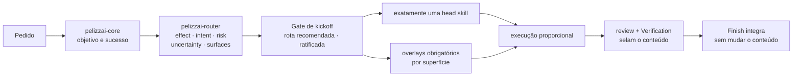
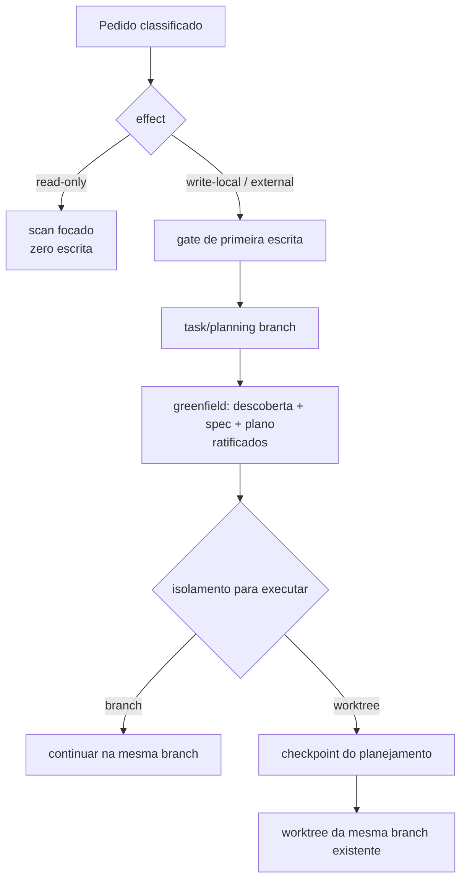
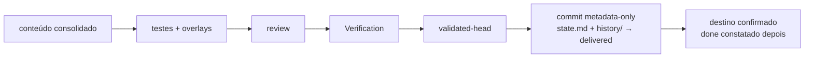
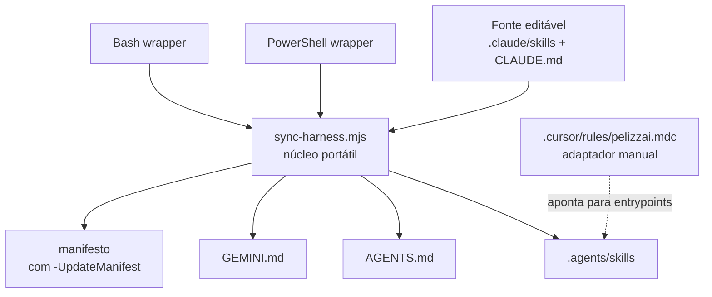

# PelizzAI

Harness de engenharia para agentes de código. O PelizzAI classifica, raciocina, investiga e
recomenda; o usuário decide o produto. Depois de spec e plano ratificados, o harness executa e
produz evidência verificável sem inflar mudanças locais já especificadas.

> A fonte de verdade é `.claude/skills/` + `CLAUDE.md`. O núcleo portátil
> `scripts/sync-harness.mjs` mantém o espelho `.agents/skills/`, `AGENTS.md`, `GEMINI.md` e, no modo próprio, o manifesto
> `scripts/pelizzai-core-skills.txt`. `.cursor/rules/pelizzai.mdc` é um adaptador manual: não é
> gerado pelo sync. `sync-harness.ps1` e `sync-harness.sh` são apenas wrappers do mesmo núcleo.

## Guia rápido: instalar e usar

### 1. Instale no seu projeto

A partir do repo-fonte PelizzAI, use o comando da sua plataforma. Instalar e atualizar são a mesma
operação:

```powershell
# Windows
pwsh scripts/sync-harness.ps1 -ExportConsumer C:\caminho\do\seu-projeto
```

```bash
# macOS ou Linux
bash scripts/sync-harness.sh --export-consumer /caminho/do/seu-projeto
```

```bash
# Entrada portátil direta, em qualquer sistema com Node.js 18+
node scripts/sync-harness.mjs --export-consumer /caminho/do/seu-projeto
```

Isso copia as skills core, os hooks e os scripts úteis, gera o `CLAUDE.md` consumidor e valida os
espelhos — sem tocar skills de domínio ou `pelizzai/`. Por default também preserva
`settings.json`; somente a escolha explícita `--install-hooks` faz o merge dos hooks.

### 2. Decida sobre os hooks

Os hooks são copiados na instalação, mas não são ativados silenciosamente. Há dois caminhos:

- instalar junto com o harness, acrescentando `-InstallHooks` no PowerShell ou `--install-hooks`
  no Bash/Node;
- deixar para a primeira interação mutável: a `pelizzai-audit` executa o check, recomenda a
  instalação e faz uma única pergunta. Depois do “sim”, roda o instalador.

O instalador é multiplataforma, idempotente e preserva hooks, permissões e demais campos já
existentes em `.claude/settings.json`:

```bash
node scripts/install-hooks.mjs --check   # somente verifica
node scripts/install-hooks.mjs           # registra após confirmação
node scripts/install-hooks.mjs --remove  # remove somente os hooks PelizzAI
```

Esses hooks são consumidos pelo Claude Code. Em Codex, Gemini, Cursor e outros agentes, os mesmos
invariantes continuam nas skills e arquivos de entrada; cada plataforma pode ganhar enforcement
nativo quando expuser um mecanismo equivalente.

### 3. Use — um único comando: `bootstrap`

- **Repositório existente**: abra o agente no projeto e digite **`bootstrap`**. É o único comando
  do PelizzAI. O harness escaneia a stack real (lockfiles, versões), propõe o conjunto de skills
  de domínio fundamentadas em Context7/documentação oficial da versão observada, mais catálogo,
  profile e a cadência de
  manutenção — você decide primeiro o conjunto de skills e depois, separadamente, se quer armar a
  cadência; cada decisão vem com recomendação.
- **Projeto novo**: nem o `bootstrap` é necessário — peça o produto. O harness conduz descoberta
  com uma pergunta por vez → spec → stress/aprovação → domain skills → plano → stress/aprovação →
  setup → execução. Cada pergunta traz a melhor opção recomendada; nenhuma é auto-confirmada.
- **Dali em diante, não há comandos**: trabalhe pedindo tarefas normalmente. O router classifica
  cada pedido e recomenda a rota; tarefas mutáveis aguardam ratificação. Decisões estruturais
  (base/branch, isolamento, modo, commits e destino) são perguntadas uma por vez, com recomendação.
  Mesmo sem digitar `bootstrap`, o harness detecta catálogo ausente
  numa tarefa mutável e propõe o bootstrap sozinho. Classificar é do harness; decidir é do usuário.

## Context7: a inteligência técnica transversal

Context7 é a fonte técnica preferencial do PelizzAI — a “arma secreta” para evitar decisões
baseadas em memória desatualizada. Ele não é uma etapa exclusiva do bootstrap nem aparece somente
depois das perguntas:

| Situação | Como o harness usa Context7 |
| --- | --- |
| Projeto novo | valida capacidades e trade-offs da stack informada ou das candidatas antes de recomendar |
| Projeto existente | lê manifests/lockfiles primeiro e consulta a documentação da versão realmente instalada |
| Feature ou plano | confirma APIs, limites, integração e compatibilidade antes de decompor a solução |
| Debugging | confronta sintoma/código com contratos e mudanças da versão usada |
| Upgrade | verifica breaking changes, migração e alvo suportado |
| Skills de domínio | cria ou atualiza regras de stack a partir da versão real, preservando customizações |

Context7 é read-only e pode ser usado antes do Gate de kickoff para eliminar dúvida factual e
formular perguntas melhores. Ele nunca escolhe requisitos, UX, regra de negócio, arquitetura
preferida, risco aceito ou critério de aceite. Isso continua sendo ratificado pelo usuário.

O servidor Context7 não é instalado à força pelo repositório porque cada host configura MCP de
forma diferente. No bootstrap, o harness verifica se a ferramenta está disponível e recomenda sua
configuração quando faltar. Documentação oficial atual é o fallback; memória da LLM não é.

## O kernel inteligente

O PelizzAI separa autoridade, invariantes e heurísticas. Proteção de branch, autoridade do usuário,
autorização externa e validação são invariantes. OODA, TDD, brainstorming, team e subagents são
ferramentas situacionais; elas escolhem como trabalhar, não o que o produto deve fazer.



O envelope de decisão é derivado do pedido e das evidências; não vira formulário para o usuário —
mas a rota montada volta como **recomendação a ratificar** no Gate de kickoff antes de investir:

| Campo | Valores | Decisão que governa |
| --- | --- | --- |
| `effect` | `read-only`, `write-local`, `external` | se pode escrever e quais confirmações são necessárias |
| `intent` | bootstrap, feature, bug, ajuste, refactor, infra, review, conflito | qual head skill conduz o ciclo de vida |
| `risk` | low, medium, high | profundidade de validação, review e contenção |
| `uncertainty` | low, medium, high | quanto descobrir antes de implementar |
| `surfaces` | UI, security, data, public-contract, docs, none | quais overlays atravessam o fluxo |

### Kickoff: a rota é recomendação, não decisão

A classificação continua rica e derivada pelo harness, mas nunca é aplicada em silêncio. Antes de
investir, o `pelizzai-router` apresenta a **Análise da proposta** (premissas, lacunas, riscos e
alternativas materiais) e, no **Gate de kickoff**, a rota proposta — lane, head skill, overlays e
  descoberta — como uma recomendação e uma pergunta de confirmação. Classificar é do
harness; decidir é do usuário.

- Somente efeito `read-only` informa e segue sem ratificação, pois não altera estado.
- Toda tarefa mutável, inclusive ajuste/`bounded`, para no kickoff até receber confirmação.
- Quando o usuário parece não-técnico ou a intenção admite leituras diferentes, o kickoff reapresenta
  o entendido ("vou tratar como feature/ajuste/bug/refactor — confere?") e registra `audience`.

Em greenfield, descoberta é o default obrigatório: `pelizzai-interview-me` pergunta uma decisão por
turno e `pelizzai-brainstorming` produz a spec. Pular descoberta/spec/plano exige dispensa explícita;
Context7 entra cedo para responder fatos técnicos e melhorar recomendações; nunca responde pelo
usuário decisões de produto.

Ratificar a rota também não encerra a autoridade do usuário: **lacuna material que apareça depois —
na spec, no plano ou no meio da execução — para o trabalho e volta pela `pelizzai-interview-me`**,
uma pergunta por vez. Default, convenção, Context7 ou "inferência razoável" não substituem essa
resposta, mesmo quando a escolha parece óbvia e reversível.

### Uma head skill, overlays transversais

Uma tarefa tem exatamente uma **head skill** responsável pelo ciclo de vida. Skills transversais
não competem com ela: entram como overlays e são propagadas para design, plano, brief de execução,
review e Verification.

| Sinal observado | Overlay obrigatório |
| --- | --- |
| tela, componente, CSS, layout, UX ou acessibilidade | `pelizzai-frontend` |
| auth, input externo, SQL, upload, segredo, CORS, SSRF ou dependência sensível | `pelizzai-oswap` antes da validação final |
| convenção específica do projeto | skill de domínio catalogada em `pelizzai/domain-skills.md` |
| documentação humana no escopo | `pelizzai-documenting-features` |

O overlay frontend aplica o design system e a especificação existentes antes de preferências
genéricas. Ele exige estados reais, responsividade, acessibilidade e QA visual, e combate
explicitamente AI slop: gradientes decorativos gratuitos, glassmorphism automático, excesso de
cards, copy genérica, ícones arbitrários e interfaces sem hierarquia ou intenção de produto.

## Efeitos e primeira escrita

- `read-only`: pode inspecionar e analisar, mas não cria branch, state, catálogo, profile,
  relatório persistente nem bootstrap.
- `write-local`: precisa passar pelo router e pelo gate de primeira escrita.
- `external`: além do isolamento, valida autoridade, alvo, reversibilidade e confirmação no
  momento da ação, como push, PR, deploy, mensagem, custo ou mudança em produção.

Para tarefas mutáveis em Git, `pelizzai-starting-branch` cria ou valida uma task branch **antes**
de qualquer state, spec, plano, ADR, código, configuração, teste, scaffold ou protótipo. Specs e
planos nunca nascem primeiro numa branch protegida.



Branch, execução inline e commits granulares são os defaults **recomendados** para trabalho comum;
worktree, team e subagents entram quando frentes realmente independentes justificam o custo. Nada
disso é aplicado em silêncio. Base e nome da branch são ratificados antes do planejamento. Depois
do plano aprovado, isolamento, modo — com `team` sempre visível —, commits e review são decididos
**uma pergunta por vez**. Ajuste e bug usam o mesmo princípio em forma curta. `squash-final` só
ocorre a pedido explícito.

Decisões estruturais ratificadas podem virar **política do projeto** em `pelizzai/profile.md` e
pré-selecionar futuras recomendações. Elas não auto-confirmam uma tarefa nova, salvo delegação
explícita do usuário. `destination` nunca é herdado — push, PR e publicação são confirmados por tarefa.

## Rotas proporcionais

### Feature, refactor e infra

| Lane | Quando usar | Rota |
| --- | --- | --- |
| `bounded` | aceite claro, risco e incerteza baixos, sem decisão arquitetural | plano compacto; brainstorming não é obrigatório |
| `standard` | contrato/aceite claros, risco médio ou trade-offs limitados | plano; brainstorming compacto só se restar decisão real |
| `exploratory` | alta incerteza ou decisões arquiteturais/sensíveis acopladas | brainstorming completo + stress proporcional → plano |

Todo produto/projeto greenfield entra como `exploratory`, mesmo com stack definida. Framework,
linguagem e banco não definem usuários, regras, estados, UX, dados nem critérios de aceite.

Entrevistas e comparação de múltiplas abordagens só aparecem quando existe ambiguidade ou decisão
real. Uma mudança grande e mecânica pode continuar simples; um endpoint pequeno, aditivo e com
contrato claro pode ser standard com review/overlays mais fortes, sem discovery artificial.

### Debugging

`pelizzai-debugging` começa por triagem, não por um ritual fixo:

1. confirma sintoma, impacto, ambiente e evidência disponível;
2. contém primeiro quando há incidente ativo, risco de dados ou segurança;
3. escolhe o menor método que discrimina as causas plausíveis;
4. implementa o fix, prova a regressão e revalida os overlays.

Um erro localizado de compilação pode exigir uma hipótese e uma reprodução curta. Uma falha
intermitente entre sistemas pode exigir hipóteses concorrentes e instrumentação. OODA é o ciclo
macro adaptativo — observar, orientar, decidir e agir — quando novas evidências mudam o próximo
passo; não é uma obrigação universal nem determina quantidade fixa de hipóteses.

### Ajuste e review

- `pelizzai-quick-fix`: mudança local, reversível, sem nova regra, contrato ou superfície.
- `pelizzai-review`: review read-only de diff, working tree, branch ou PR.
- `pelizzai-improving-architecture`: revisão codebase-wide por fricção/evidência, sem escrita.
- Se um ajuste revelar design, contrato ou risco novo, o router o reclassifica antes de continuar.

## Execução e testes

O plano registra critérios observáveis e a estratégia de validação por artefato. TDD continua
forte onde há comportamento executável, mas não é usado como teatro para Markdown ou configuração.

| Artefato/intenção | Estratégia primária | Evidência mínima |
| --- | --- | --- |
| comportamento novo ou bug reproduzível | TDD | RED observado → GREEN → refactor; teste de comportamento |
| refactor/legado sem contrato seguro | characterization | comportamento atual capturado antes; regressão depois |
| config, schema, migration, script, build ou integração | validate | parser, dry-run, fixture ou integração real; rollback quando aplicável |
| UI, responsividade ou interação visual | visual + funcional | app rodando, estados/viewport e QA do overlay frontend |
| docs, prompts, policies ou artefato estático | static/scenario | lint, render, link/schema/grep ou cenário de consumo |

Cada tarefa recebe um briefing fresco com constraints, skills de domínio, overlays e evidência
esperada. Review por tarefa usa o working tree inteiro — staged, unstaged e untracked. O review
final usa o range `base-sha..HEAD`, com o modelo mais capaz disponível e effort máximo: profundidade
de processo é proporcional ao risco, capacidade do modelo nunca é.

## Conteúdo selado e fechamento

A validação final acontece depois de squash, overlays, testes e correções. Quando tudo passa,
`pelizzai-verification-before-completion` grava:

```text
validated-head = SHA exato do último commit de conteúdo validado
```

`pelizzai-finish-task` exige `HEAD == validated-head`; a única sujeira permitida é
`pelizzai/data/state.md` contendo o seal pendente. Então cria exatamente um commit metadata-only —
o state e o arquivo de história que o próprio selo gera — para selar a tarefa em `phase: delivered`
(conteúdo selado + destino executado) e gravar `confirmar:`, a condição observável que virará `done`.
É nesse selo que o bloco íntegro da tarefa migra para `pelizzai/data/history/` (versionado) e o
cursor volta ao tamanho do template, deixando uma linha de índice.
Antes de publicar, prova que `validated-head..closure-head` contém somente essa metadata e que nenhum
conteúdo do produto mudou. Push, PR, descarte e remoção de worktree continuam opt-in. `done` nunca é
declarado aqui: é **constatado** na abertura da próxima tarefa ou na retomada — o harness confere
`confirmar:` contra o Git e carimba o desfecho na linha de índice.



## Bootstrap consumidor

O próprio repo PelizzAI é detectado como **source mode** e não recebe runtime consumidor: branch,
plano nativo/execution record e SHA selado substituem state/closure. Num
projeto consumidor:

- análise sem escrita usa `pelizzai-audit` em `scan-only`;
- `bootstrap-write` só ocorre por pedido explícito ou consentimento após a proposta;
- nas bordas design→plano e plano→execução a audit **propõe** proativamente o menor conjunto útil de
  skills de domínio (fundamentadas em Context7/documentação oficial atual da versão observada), em vez de esperar o comando
  `bootstrap`; nada é escrito sem um "sim" e zero skills é um resultado válido quando ratificado;
- `pelizzai/.gitignore` é criado e verificado com `git check-ignore` para os efêmeros.

## Estado e artefatos no projeto alvo

`pelizzai/` é a memória operacional do harness dentro do projeto alvo. Regra única: a **raiz** guarda
conhecimento versionado; `data/` guarda estado e efêmeros. Tudo que o harness gera AO TRABALHAR num
projeto — estado, specs, planos, ADRs, mockups, relatórios, handoffs — fica dentro de `pelizzai/`,
nunca em `.pelizzai/`, no temp do SO ou espalhado por outras pastas. (Os adaptadores de distribuição
do próprio harness — `AGENTS.md`, `GEMINI.md` e `.agents/skills/`, gerados pelo sync, mais o
`.cursor/rules/pelizzai.mdc` manual — vivem na raiz do repositório do harness, por definição.)

```text
pelizzai/
├── .gitignore
├── domain-skills.md              catálogo de domínio; marca o bootstrap concluído
├── profile.md                    comandos test/build/lint, stack baseline, defaults ratificados
├── context.md | context/         glossário de domínio, sob demanda
├── adr/ | specs/ | plans/        sob demanda
└── data/
    ├── state.md                  cursor da tarefa ativa                        (versionado)
    ├── review-domain-skills.md   ledger de manutenção das skills de domínio    (versionado)
    ├── history/                  bloco íntegro migrado no selo delivered       (versionado)
    ├── .cadence-state.json       contador local do hook de cadência            (ignorado)
    ├── handoffs/                 briefs de tarefa e pacotes de review          (ignorado)
    ├── mockups/                  telas do visual companion                     (ignorado)
    └── reports/                  relatórios longos de QA, review e arquitetura (ignorado)
```

O `state.md` é escalar por repositório e é **cursor, não arquivo de carimbos**: as aprovações de
descoberta/spec/domain skills/plano ficam no cabeçalho do plano, com data. Campos:

| Campo | Uso |
| --- | --- |
| `slug` | Identidade da tarefa ativa; `<none>` significa sem tarefa ativa. |
| `track` | `feature`, `bug`, `ajuste`, `refactor`, `infra` ou `review`. |
| `lane` | `bounded`, `standard`, `exploratory` ou `high-risk` — profundidade classificada pelo router, ratificada no kickoff. |
| `phase` | `brainstorm`, `plan`, `exec`, `review`, `delivered`, `done`, `abandoned` ou `blocked`. |
| `branch` | Branch de trabalho, validada contra o Git ao retomar. |
| `base-ref` · `base-sha` | Ref exata da base e SHA resolvido antes da primeira mudança; delimitam o review final. |
| `validated-head` | SHA do último commit de conteúdo aprovado na validação final; `<none>` antes dela. |
| `confirmar` | Condição observável que vira `done` depois — constatada contra o Git, nunca declarada no fechamento. |
| `kickoff` | `pendente` até o gate consolidado ser ratificado; depois `ratificado AAAA-MM-DD`. |
| `isolation` · `worktree-path` | `pending` até a ratificação; depois `branch` ou `worktree` + caminho. |
| `execution-mode` | `pending`, `team`, `subagents` ou `inline` — as três opções sempre visíveis no gate. |
| `commit-strategy` | `pending`, `granular` ou `squash-final`; `squash-final` só a pedido explícito. |
| `effect` · `risk` | `read-only`/`write-local`/`external` e `low`/`medium`/`high`, derivados pelo router. |
| `overlays` | Skills transversais exigidas (ex.: `pelizzai-frontend`, `pelizzai-oswap`). |
| `audience` | `technical` ou `layperson` — modula a linguagem dos gates. |
| `spec` · `plan` | Caminho do artefato, `pending`, dispensa explícita datada ou `not-applicable`. |
| `project` | Caminho do único repositório Git desta tarefa, em workspace. |

Abaixo do cursor ficam apenas `## Progresso` (uma linha por tarefa do plano; relatório longo vai para
`data/reports/` e sobra o link) e `## Histórico` (índice durável). Isolamento, modo e commit nascem
`<pending>` e só deixam de sê-lo quando o usuário ratifica o gate. A `pelizzai-finish-task` encerra a
tarefa em `phase: delivered` e grava `confirmar:`; nesse selo o bloco íntegro migra para
`data/history/` e o cursor volta ao tamanho do template. `done` é constatado depois, contra o Git, na
abertura da próxima tarefa ou na retomada. A política de execução ratificada do projeto vive à parte,
em `pelizzai/profile.md`, e não é herança de tarefa. Na retomada, esses dados são confrontados com o
Git; divergências perigosas vão para `pelizzai-recovery`.

## Manutenção das skills de domínio

Skills de domínio não são estáticas. A `pelizzai-writing-skills` é o motor de autoria e manutenção,
em três eixos — dois atualizam o que já existe, um cria:

| Eixo | Gatilho | Efeito |
| --- | --- | --- |
| version-driven | a stack mudou de versão maior ou ganhou dependência significativa (drift contra o Stack baseline do `profile.md`) | atualiza a skill afetada pela doc da versão real |
| rework-driven | o mesmo ajuste manual se repete no histórico do Git | o padrão vira regra na skill existente |
| adoption-driven | dependência ou serviço significativo adotado e ainda sem cobertura no catálogo | propõe **criar** a primeira skill dessa stack |

O disparo primário é o nudge de fechamento (`pelizzai-finish-task`, Passo 5), que lê o ledger
`pelizzai/data/review-domain-skills.md`: ≥10 commits **ou** >10 dias desde `last-review` propõem a
revisão; >15 dias desde `last-full-scan` propõem o repo-scan amplo. O eixo de dias é a âncora; os
commits só antecipam num burst real. No Claude Code, o hook opt-in `pelizzai-cadence` é a rede de
segurança: checa o ledger a cada 10 interações, com supressão de 7 dias depois de avisar.

**Regra do nudge: avisa uma vez, nunca bloqueia.** E refresh nunca sobrescreve às cegas — a skill
atual é lida, muda só o que a nova versão ou o padrão exige, as customizações do projeto são
preservadas e o diff vai ao usuário ANTES de gravar, com aprovação **por skill**, nunca em lote. A
manutenção proativa atua somente sobre skills de domínio; as skills do harness (`pelizzai-*`) só
mudam a pedido explícito do usuário.

## Fonte, distribuição e compatibilidade



| Ambiente | Entrada/skills |
| --- | --- |
| Claude Code | `CLAUDE.md` + `.claude/skills/` |
| Codex, Copilot e agentes compatíveis | `AGENTS.md` + `.agents/skills/` |
| Gemini CLI | `GEMINI.md` + `.agents/skills/` |
| Cursor | `.cursor/rules/pelizzai.mdc` manual + `AGENTS.md` + `.agents/skills/` |

Arquivos gerados não são editados à mão. O adaptador Cursor é revisado manualmente porque sua
função é apenas encaminhar aos entrypoints e às regras compartilhadas.

### Instalar/atualizar em um projeto consumidor

A distribuição oficial usa o mesmo núcleo em todos os sistemas:

```powershell
pwsh scripts/sync-harness.ps1 -ExportConsumer C:\caminho\do\projeto
```

```bash
bash scripts/sync-harness.sh --export-consumer /caminho/do/projeto
```

Ele copia as skills **core** (somente as do manifesto — as skills de domínio do projeto nunca são
tocadas), os hooks `pelizzai-*` e os scripts portáteis; gera o `CLAUDE.md`
consumidor; regenera e valida os espelhos do destino. Atualizar = rodar o mesmo comando de novo.
Os hooks só são registrados na exportação com `--install-hooks`/`-InstallHooks`; sem essa escolha,
a `pelizzai-audit` verifica e pede confirmação na primeira tarefa mutável.

**Nunca distribua por cópia manual do repositório.** O que distingue o repo-fonte de um consumidor
é exclusivamente a sentinela `scripts/pelizzai-source-repo.txt`: uma cópia manual a levaria junto e
promoveria o consumidor a repo-fonte por engano (writegate sem Regra B, bootstrap mudo, runtime
`pelizzai/` desativado). O `-ExportConsumer` exclui a sentinela por contrato — e a remove do
destino se encontrá-la.

## Catálogo de skills do harness

| Grupo | Skills | Responsabilidade |
| --- | --- | --- |
| Entrada e orquestração | `pelizzai-core`, `pelizzai-router`, `pelizzai-audit`, `pelizzai-preferences` | Entrada obrigatória, classificação da rota e Gate de kickoff, bootstrap consumidor e piso global de comportamento. |
| Raciocínio e conversa | `pelizzai-reasoning`, `pelizzai-interview-me`, `pelizzai-writing-clearly-and-concisely` | Técnicas proporcionais de raciocínio (inclui OODA), entrevista que resolve toda lacuna material — uma pergunta por vez — e escrita clara. |
| Design, plano e execução | `pelizzai-brainstorming`, `pelizzai-writing-plans`, `pelizzai-execution-plans` | Design ratificado com spec, plano executável e stress, gate de setup pós-plano e execução tarefa a tarefa. |
| Execução por tarefa | `pelizzai-tdd`, `pelizzai-team`, `pelizzai-subagents`, `pelizzai-loop`, `pelizzai-handoff` | Estratégia de prova por artefato, delegação e times, o laço OODA até a Definition of Done e a bifurcação para sessão nova. |
| Tracks dedicados | `pelizzai-debugging`, `pelizzai-quick-fix` | Bug com triagem e causa raiz; ajuste local sem perder isolamento, prova e fechamento. |
| Design e exploração | `pelizzai-codebase-design`, `pelizzai-domain-modeling`, `pelizzai-prototype`, `pelizzai-improving-architecture` | Módulos profundos e seams, vocabulário de domínio e ADR, protótipo descartável e revisão arquitetural read-only. |
| Isolamento e integração | `pelizzai-starting-branch`, `pelizzai-finish-task`, `pelizzai-resolving-merge-conflicts`, `pelizzai-recovery`, `pelizzai-documenting-features` | Branch/worktree antes da primeira escrita, selo `delivered` metadata-only, conflitos, recuperação de estado divergente e doc humana da feature. |
| Qualidade e segurança | `pelizzai-review`, `pelizzai-oswap`, `pelizzai-verification-before-completion` | Review por tarefa e review final em `base-sha..HEAD`, OWASP na superfície sensível e evidência fresca antes de qualquer conclusão. |
| Frontend | `pelizzai-frontend` | Overlay de produto, design, implementação e QA visual — desde o design, não como QA tardio. |
| Autoria de skills | `pelizzai-writing-skills` | Autoria e manutenção das skills de domínio, fundamentadas em Context7/documentação oficial da versão real. |

## Estrutura do repositório

```text
PelizzAI/
├── .claude/
│   ├── skills/                   fonte canônica das skills
│   └── hooks/                    cadence, guardrails, writegate e SessionStart opt-in
├── .agents/skills/               espelho gerado
├── .cursor/rules/pelizzai.mdc    adaptador manual
├── scripts/
│   ├── sync-harness.mjs          núcleo portátil de sync + distribuição
│   ├── sync-harness.ps1          wrapper Windows/PowerShell
│   ├── sync-harness.sh           wrapper macOS/Linux
│   ├── install-hooks.mjs         merge/check/remove de hooks Claude Code
│   ├── test-harness-contracts.ps1
│   ├── pelizzai-source-repo.txt  sentinela de source mode (NUNCA copiar a consumidores)
│   ├── task-brief.ps1|.sh
│   └── review-package.ps1|.sh
├── CLAUDE.md                     entrada canônica
├── AGENTS.md                     gerado
├── GEMINI.md                     gerado
└── .github/workflows/check-harness.yml
```

Os hooks são redes de segurança, não o cérebro do harness. Os arquivos `.mjs` rodam com Node em
Windows, macOS e Linux; os `.ps1` ficam como fallback Windows. Guardrails bloqueiam comandos Git
destrutivos conhecidos; o writegate opt-in é um `PreToolUse` fail-closed que barra escrita de produto
em branch protegida/destacada (Regra A) e, no consumidor, enquanto `kickoff: ratificado` não estiver
gravado no `state.md` (Regra B), movendo o invariante "isolar antes da primeira escrita" da
obediência do modelo para enforcement executável. O hook não enforça as etapas de aprovação do
greenfield — esse gate é conduzido pelas skills, com o usuário. Erros internos de qualquer hook são
fail-open para não sequestrar a ferramenta. Cadence e SessionStart apenas lembram contexto quando
instalados com consentimento.

## Desenvolvimento do harness

Edite somente as fontes canônicas e o adaptador Cursor quando necessário. A
`pelizzai-writing-skills` executa sync e check automaticamente depois de qualquer edição de skill
já autorizada. Para manutenção manual do harness:

```bash
node scripts/sync-harness.mjs --update-manifest
node scripts/sync-harness.mjs --check --source-mode
pwsh scripts/test-harness-contracts.ps1
```

O CI executa o núcleo portátil e os wrappers em Windows, Ubuntu e macOS; os testes de contrato
rodam em Windows e Ubuntu. Os contratos
cobrem composição do kernel, roteamento, manifest, guardrails, helpers, Visual Companion e paridade
dos alvos gerados.

## Limites conhecidos

- O carregamento **nativo** de skills por diretório varia por ferramenta: `.agents/skills/` cobre
  Codex, Gemini CLI (alias) e Warp; ferramentas que só leem o próprio diretório recebem a entrada
  via `AGENTS.md` e podem ganhar espelho nativo acrescentando o alvo ao `sync-harness.mjs`.
- `.cursor/rules/pelizzai.mdc` é adaptador **manual**: o sync não o gera, e ele precisa ser revisado
  à mão quando os entrypoints mudarem.
- O núcleo portátil exige Node.js 18+; os wrappers `.ps1` exigem PowerShell 7+ (encoding UTF-8).
- Os hooks (cadência, guardrails, writegate, SessionStart) são específicos do Claude Code e opt-in.
  Nas demais plataformas os mesmos invariantes valem, mas só pelas skills — sem enforcement
  executável.
- Agent Teams é experimental no Claude Code; sem ele, a `pelizzai-team` degrada para subagents. No
  Windows, teammates devem usar visualização `in-process`.
- Escrita paralela exige `isolation: worktree` com caminhos disjuntos dentro do worktree único da
  tarefa; em `branch`, o coordenador integra em série.
- Context7 é o MCP preferencial, mas a instalação/configuração depende do host — a `pelizzai-audit`
  recomenda no bootstrap; sem ele, o fallback é documentação oficial atual, com a limitação
  declarada.

## Princípio operacional

Use o menor fluxo que preserve os invariantes. Leia antes de perguntar, não escreva em pedidos
read-only, isole antes da primeira escrita, aplique overlays pela superfície real e só declare
conclusão quando o mesmo conteúdo revisado estiver testado, verificado e selado.
