# PelizzAI - Harness de agentes

> **Status:** projeto em desenvolvimento.
>
> **Foco atual:** Claude Code, com a implementação versionada em `.claude/`.
>
> **Direção futura:** portar o mesmo harness para outras superfícies, como `.agents`,
> `.cursor` e outras IDEs. A intenção é preservar os contratos de fluxo e trocar apenas
> os adaptadores de execução de cada ambiente.

PelizzAI é um harness de agentes baseado em **skills Markdown**, em português do Brasil,
para conduzir tarefas de software com disciplina de produção: entender o objetivo,
mapear o projeto, escolher o fluxo certo, isolar em branch, executar com TDD,
revisar com evidência, verificar antes de afirmar conclusão e fechar a entrega de forma
deliberada.

O harness não é um framework de runtime. Ele é um **sistema operacional de trabalho para
agentes**: as skills definem quando agir, como decompor, quando delegar, como revisar,
quais artefatos persistir e onde exigir decisão humana.

## Visão geral

O PelizzAI tem quatro camadas:

1. **Entrada e roteamento:** `pelizzai` força o uso de skills; `pelizzai-router`
   entende a tarefa e escolhe o track.
2. **Ciclo de vida:** bootstrap, brainstorming, plano, execução, debugging, ajuste,
   review e fechamento.
3. **Execução com agentes:** coordenador, teammates nativos do Claude Code quando
   disponíveis, subagents como fallback e execução inline como último recurso.
4. **Estado do projeto alvo:** diretório `pelizzai/`, skills de domínio, specs,
   planos, ADRs, cursor de tarefa e ledger de manutenção.

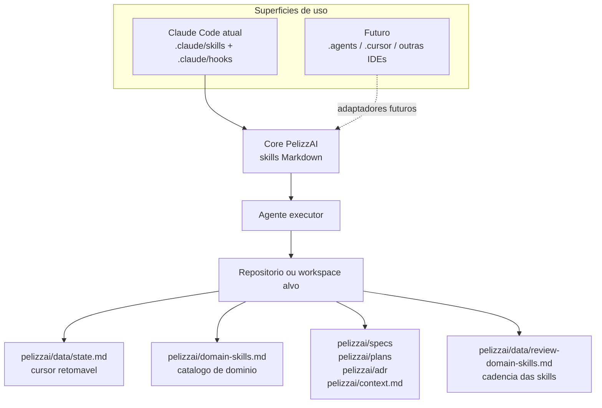

## O que existe neste repositório

```text
PelizzAI/
├── CLAUDE.md                         diretrizes comportamentais gerais para Claude Code
├── README.md                         este mapa do harness
└── .claude/
    ├── hooks/
    │   ├── pelizzai-cadence.mjs       hook opt-in de cadencia para Claude Code
    │   └── pelizzai-cadence.ps1       variante PowerShell do hook
    └── skills/
        ├── pelizzai/                  skill raiz
        ├── pelizzai-router/           roteador do ciclo de vida
        ├── pelizzai-audit/            bootstrap e repo-scan
        ├── pelizzai-execution-plans/  executor de planos
        └── pelizzai-*/                demais skills de processo
```

Hoje, a distribuição prática está em `.claude`. O README descreve também os invariantes
que devem sobreviver às versões futuras para outras IDEs.

## Princípios

- **Skills-first:** a inteligência vive nas skills, não em código oculto.
- **Claude Code primeiro, portável depois:** o projeto atual é Claude Code; a arquitetura
  evita amarrar a lógica do harness a um único runtime.
- **Branches-only:** o isolamento é sempre branch; o harness não usa `git worktree`.
- **Proporcionalidade:** use o menor fluxo seguro; ajuste trivial não vira ritual pesado.
- **Evidência antes de afirmação:** nada de "pronto", "passa" ou "corrigido" sem comando
  rodado, saída lida e evidência fresca.
- **Gates humanos nas bordas:** branch, modo de execução, estratégia de commit, squash,
  push, PR e descarte são decisões explícitas.
- **Autonomia entre tarefas:** uma vez aprovado o plano, o agente executa tarefa por tarefa
  sem pedir permissão a cada passo, parando apenas quando houver bloqueio real.
- **Domínio explícito:** cada projeto alvo ganha skills de domínio próprias, catalogadas e
  mantidas com base no código real e em documentação atual.

## Fluxo global

Toda tarefa que toca o projeto passa pela raiz `pelizzai`, pelo roteador e por um track.
Na primeira interação com um projeto alvo, ou quando o usuário digita `bootstrap`, o
roteador manda primeiro para o bootstrap.

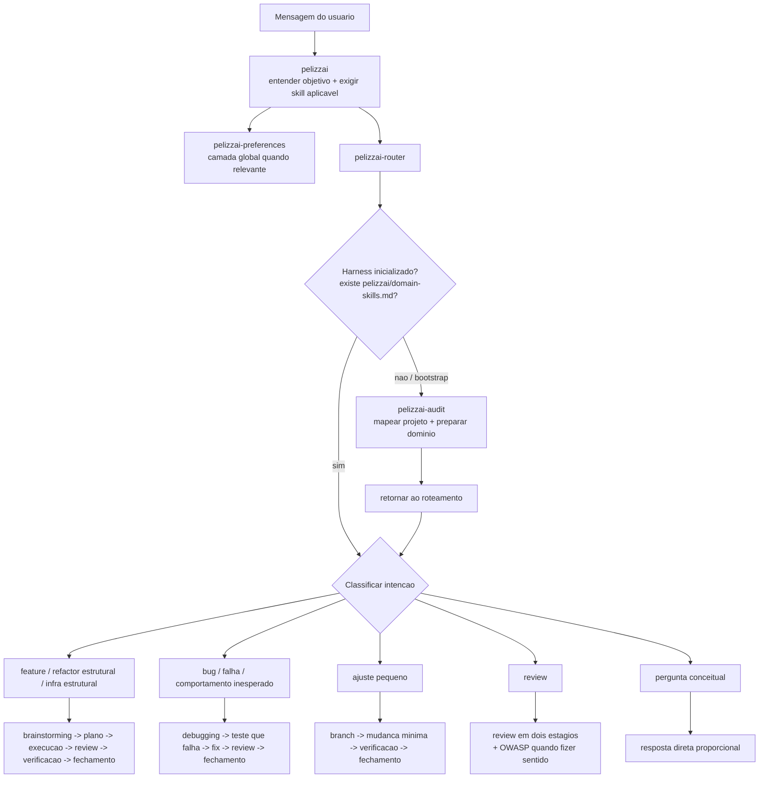

## Bootstrap

O bootstrap cria o contexto reutilizável do harness dentro do projeto alvo. Ele distingue
projeto novo, projeto existente e workspace, faz repo-scan, identifica stack, MCPs, git,
convenções e skills existentes, e então aciona `pelizzai-writing-skills` para criar e
catalogar skills de domínio.

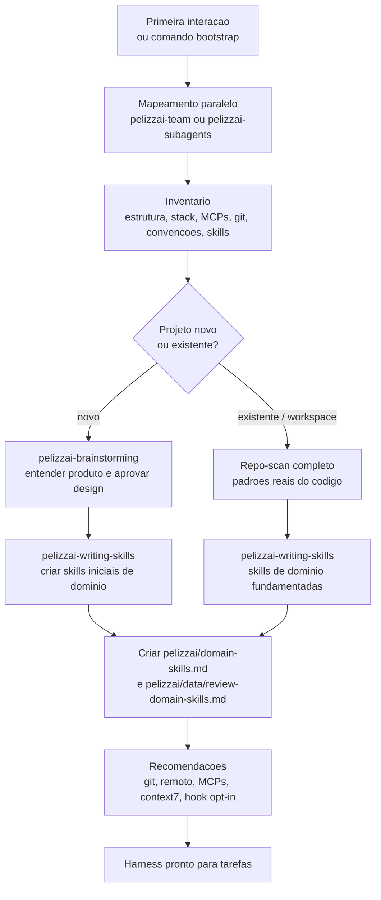

O sinal canônico de bootstrap concluído é `pelizzai/domain-skills.md`, não apenas a
existência de skills avulsas.

## Tracks principais

### Feature, refactor estrutural e infra estrutural

Features e mudanças estruturais passam por design, plano e execução. O design e o plano
são estressados com `pelizzai-interview-me` antes de virar implementação.

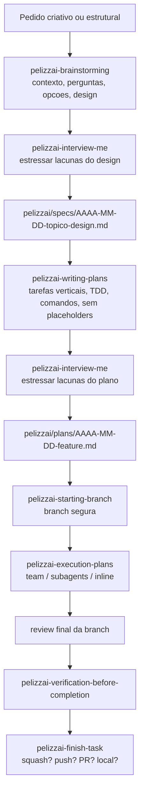

### Bug

Debugging é inline por padrão. O harness proíbe correção por palpite: primeiro reproduz,
investiga causa raiz, compara padrões, testa hipótese e só então implementa.

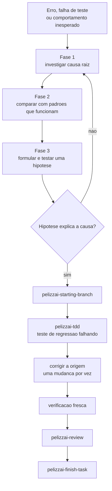

Após três tentativas de fix sem sucesso, o fluxo para e escala: a hipótese ou a arquitetura
precisa ser reavaliada.

### Ajuste pequeno

O track `ajuste` pula design e plano, mas não pula branch, verificação nem fechamento.
Ele só vale quando a mudança é pequena, local, sem nova superfície pública e sem regra de
negócio nova.

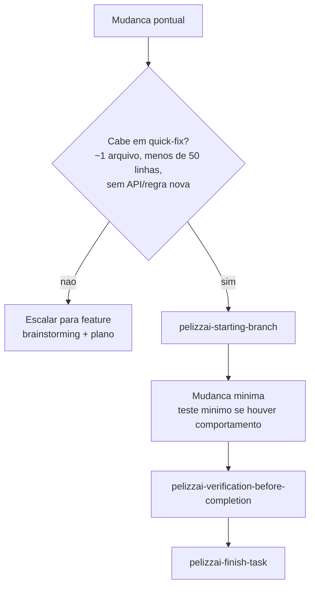

## Loop de execução por tarefa

`pelizzai-execution-plans` é o motor de execução de planos aprovados. Ele mantém o cursor
em `pelizzai/data/state.md`, lê o plano, cola a tarefa e as skills de domínio no briefing
de cada executor, e só consolida quando spec e qualidade passam.

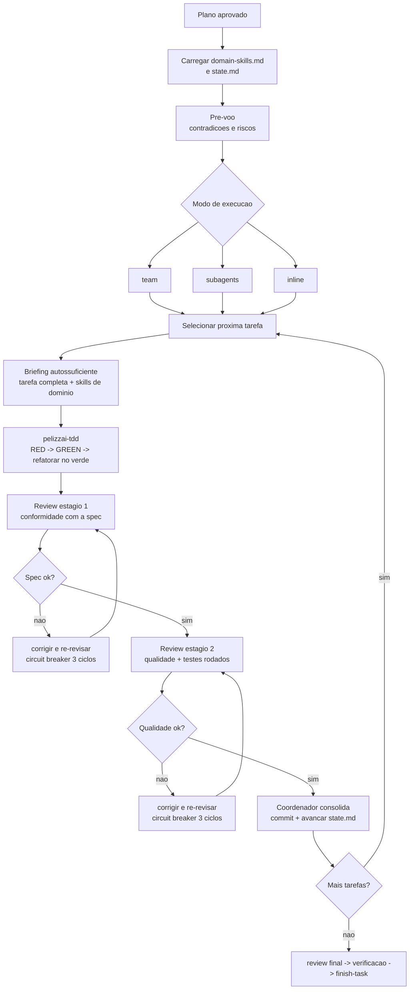

O membro implementador não commita. O commit é gate do coordenador após os dois reviews.

## Time de agentes

`pelizzai-team` coordena múltiplos papéis quando há paralelismo real: investigação por
hipóteses, revisão multi-perspectiva, pesquisa ampla ou frentes cross-layer. Se o Agent
Teams nativo do Claude Code estiver habilitado e os membros precisarem conversar, usa
teammates. Caso contrário, monta o equivalente com subagents.

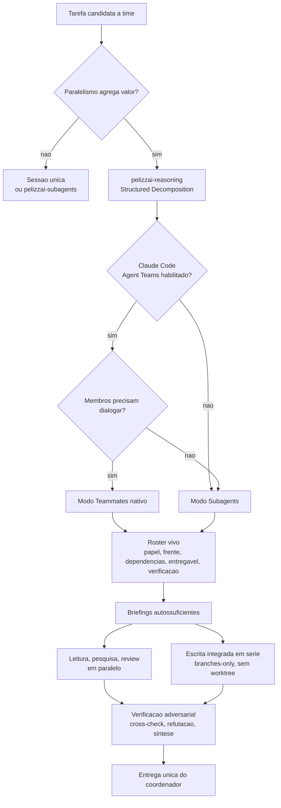

Papéis típicos:

| Papel | Função |
| --- | --- |
| Coordenador | Decompõe, cria roster, delega, verifica, integra e decide conclusão. |
| Investigador | Mapeia código, logs, docs ou hipótese específica. |
| Implementador | Escreve uma frente delimitada, via TDD, sem commitar. |
| Revisor | Audita spec, qualidade, segurança, performance, testes ou acessibilidade. |
| Refutador | Tenta derrubar hipóteses e achados para reduzir viés de confirmação. |
| Verificador / QA | Reproduz comportamento, roda checks e valida evidência. |
| Documentador | Consolida decisões, specs, planos ou relatórios. |

Limite importante: como o harness é **branches-only**, não existe escrita paralela isolada
no mesmo working tree. O paralelismo seguro por padrão é leitura, análise e review; escrita
é integrada em série pelo coordenador.

## Estado e artefatos no projeto alvo

Ao inicializar um projeto ou workspace, o PelizzAI cria artefatos em `pelizzai/` na raiz.
Esse diretório é a memória operacional do harness dentro daquele projeto.

```text
pelizzai/
├── domain-skills.md              catalogo de skills de dominio; marca bootstrap concluido
├── context.md                    glossario de dominio, criado sob demanda
├── context/                      glossarios por contexto, em workspaces maiores
├── context-map.md                mapa entre contextos, quando existir
├── adr/                          decisoes de arquitetura
├── specs/                        designs aprovados
├── plans/                        planos de implementacao
└── data/
    ├── state.md                  cursor da tarefa ativa
    ├── review-domain-skills.md   ledger de manutencao de skills de dominio
    └── .cadence-state.json       contador local do hook; deve ficar no .gitignore
```

`state.md` é o cursor retomável. Ele registra `slug`, `track`, `phase`, `branch`,
`isolation`, `execution-mode`, `commit-strategy`, `plan`, `project`, progresso e histórico.

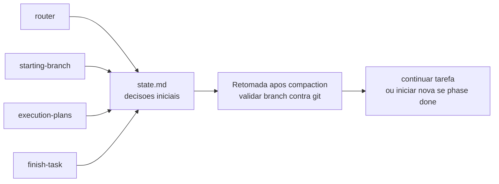

Estados principais:

| Campo | Uso |
| --- | --- |
| `slug` | Identidade da tarefa ativa; `<none>` significa sem tarefa ativa. |
| `track` | `feature`, `bug`, `ajuste`, `refactor`, `infra` ou `review`. |
| `phase` | `brainstorm`, `plan`, `exec`, `review`, `done` ou `blocked`. |
| `branch` | Branch de trabalho validada contra o git ao retomar. |
| `execution-mode` | `team`, `subagents` ou `inline`. |
| `commit-strategy` | `granular` ou `squash-final`. |
| `plan` | Caminho do plano em execução, quando houver. |

## Gates de branch, verificação e fechamento

O harness protege o histórico e a confiança do usuário com três gates fortes.

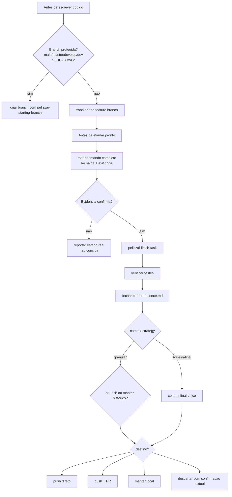

Nada dá push, abre PR, faz squash ou descarta branch sem confirmação explícita.

## Manutenção das skills de domínio

As skills de domínio não são estáticas. `pelizzai-writing-skills` cria e mantém essas
skills usando dois eixos: mudança de versão da stack e padrões repetidos no histórico.

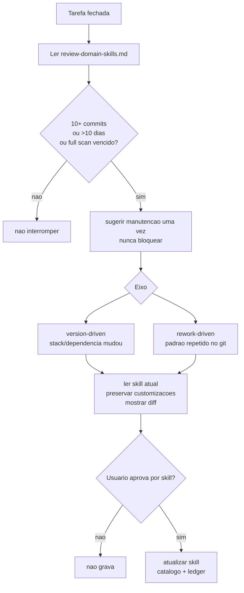

No Claude Code há um reforço opcional: `.claude/hooks/pelizzai-cadence.mjs` ou
`.claude/hooks/pelizzai-cadence.ps1`. O hook roda em `UserPromptSubmit`, conta interações
e a cada 10 prompts verifica se o ledger indica revisão vencida. Ele sempre sai com código 0,
engole erros e nunca bloqueia o usuário.

## Catálogo de skills do harness

| Grupo | Skills | Responsabilidade |
| --- | --- | --- |
| Entrada e orquestração | `pelizzai`, `pelizzai-router`, `pelizzai-audit`, `pelizzai-preferences` | Entrada obrigatória, roteamento, bootstrap e piso global de comportamento. |
| Raciocínio e conversa | `pelizzai-reasoning`, `pelizzai-interview-me`, `pelizzai-writing-clearly-and-concisely` | Técnicas proporcionais de raciocínio, entrevistas para resolver ambiguidade e escrita clara. |
| Feature | `pelizzai-brainstorming`, `pelizzai-writing-plans`, `pelizzai-execution-plans` | Design aprovado, plano executável e execução tarefa por tarefa. |
| Execução | `pelizzai-tdd`, `pelizzai-team`, `pelizzai-subagents`, `pelizzai-loop` | TDD, delegação, times, DoD e repetição até conclusão. |
| Tracks leves/dedicados | `pelizzai-debugging`, `pelizzai-quick-fix` | Bug com causa raiz e ajuste pontual sem perder disciplina. |
| Design e exploração | `pelizzai-codebase-design`, `pelizzai-domain-modeling`, `pelizzai-prototype` | Módulos profundos, modelo de domínio, ADRs e protótipos descartáveis. |
| Isolamento e integração | `pelizzai-starting-branch`, `pelizzai-finish-task`, `pelizzai-resolving-merge-conflicts` | Branch segura, fechamento, squash/push/PR e conflitos. |
| Qualidade e segurança | `pelizzai-review`, `pelizzai-oswap`, `pelizzai-verification-before-completion` | Review em dois estágios, OWASP no diff e evidência antes de conclusão. |
| Frontend | `pelizzai-frontend` | Produto, design, implementação e QA visual para UI. |
| Skills | `pelizzai-writing-skills` | Autoria e manutenção de skills de domínio. |

## Como começar em um projeto alvo

Enquanto o projeto está focado em Claude Code:

1. Disponibilize a pasta `.claude/` do PelizzAI no projeto ou workspace alvo, conforme o
   modo de distribuição que você estiver usando.
2. Abra o projeto no Claude Code.
3. Peça `bootstrap`.
4. Revise as skills de domínio criadas, o catálogo `pelizzai/domain-skills.md` e o ledger
   `pelizzai/data/review-domain-skills.md`.
5. Opte ou não pelo hook de cadência do Claude Code.
6. Depois do bootstrap, peça a tarefa normalmente; o router escolhe o fluxo.

Não há instalador versionado neste repositório ainda. A forma atual de uso é a própria
estrutura `.claude`.

## O que é Claude-specific hoje

| Parte | Situação atual |
| --- | --- |
| Skills | Implementadas em `.claude/skills/*/SKILL.md`. |
| Hooks | `.claude/hooks/pelizzai-cadence.mjs` e `.ps1`, via `UserPromptSubmit`. |
| Agent Teams | Suportado pela skill `pelizzai-team` quando o Claude Code estiver com o recurso habilitado. |
| Subagents | Descritos como ferramenta `Agent`/`Task` do ambiente. |
| Configuração | Hook opt-in via `.claude/settings.json`. |

Para outras IDEs, a expectativa é portar:

- o carregamento das skills;
- a mecânica de subagentes/teammates;
- a instalação de hooks ou lembretes;
- os nomes de arquivos de instrução do ambiente.

O que deve permanecer igual:

- nomes e responsabilidades das skills;
- diretório `pelizzai/` no projeto alvo;
- schema operacional do `state.md`;
- política branches-only;
- loop TDD -> review -> verificação -> fechamento;
- manutenção das skills de domínio por catálogo e ledger.

## Limites conhecidos

- As versões para `.agents`, `.cursor` e outras IDEs ainda não estão materializadas neste repo.
- O hook de cadência é específico do Claude Code e é opt-in.
- Agent Teams é experimental no Claude Code; sem ele, o harness degrada para subagents.
- No Windows, teammates devem usar visualização `in-process`; `split-panes` exige tmux/iTerm2.
- Como não há `worktree`, escrita paralela no mesmo repo não é isolada.
- `context7` é tratado como MCP preferencial para fundamentar skills e APIs atuais, mas a
  instalação/configuração depende do ambiente do usuário.

## Evoluindo o harness

Skills do harness (`pelizzai-*`) só devem ser editadas por pedido explícito. A manutenção
autônoma atua apenas sobre skills de domínio dos projetos alvo.

Ao alterar uma skill:

1. Preserve `frontmatter` com apenas `name` e `description`.
2. Mantenha `SKILL.md` enxuto; mova profundidade para `references/`, `templates/` ou `scripts/`.
3. Atualize este README quando a alteração mudar fluxos, gates, diretórios ou expectativas.
4. Se a skill tiver comportamento verificável, acrescente ou rode evals quando existirem.

O objetivo do PelizzAI é simples de dizer e difícil de executar: fazer agentes trabalharem
como uma equipe técnica disciplinada, com memória de projeto, evidência real e bons pontos
de decisão humana.
