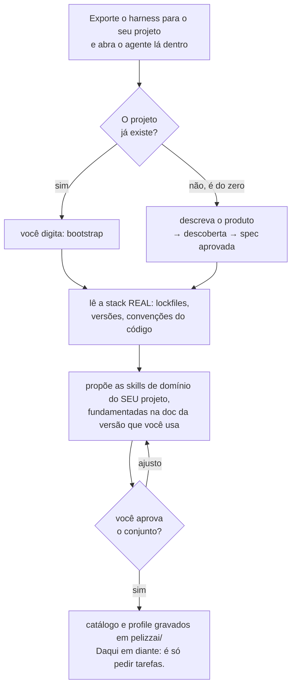
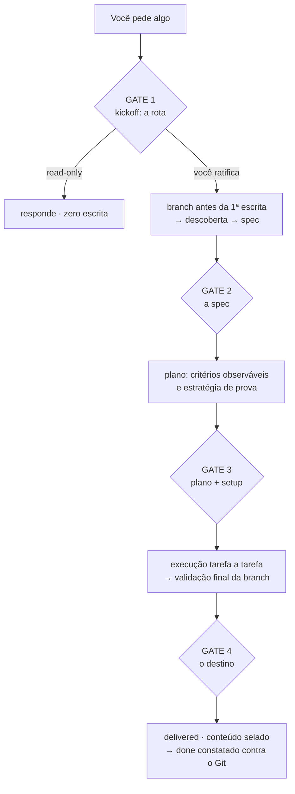
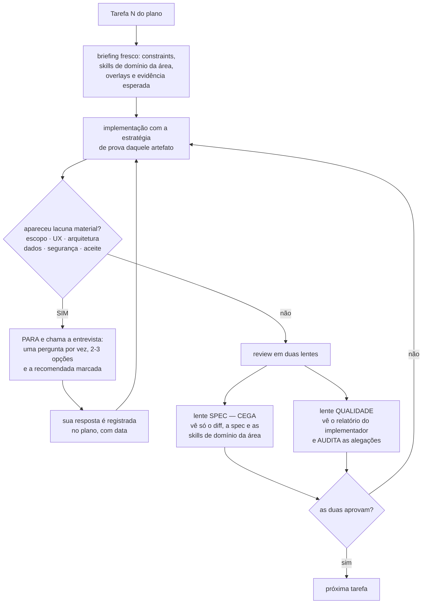
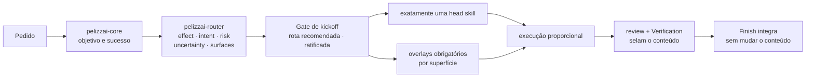
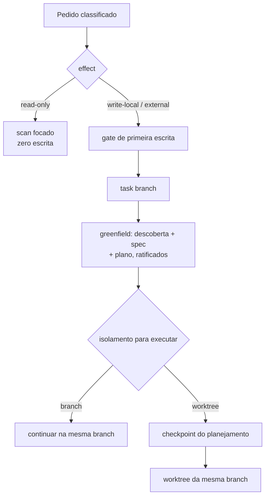
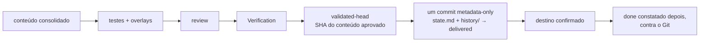
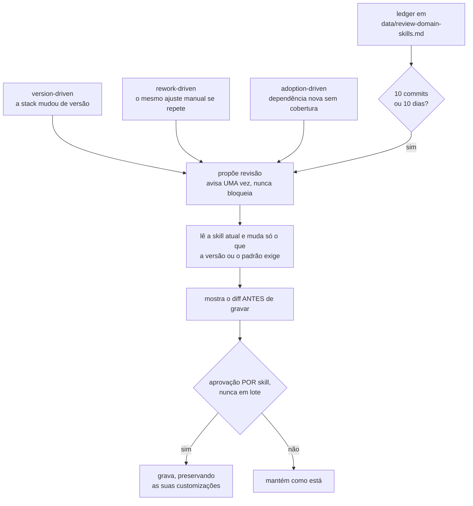
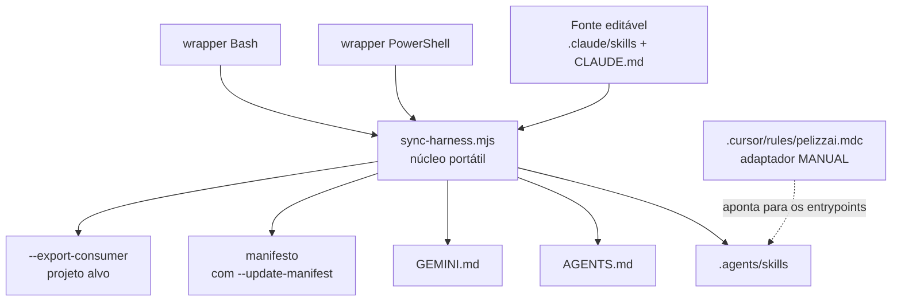

# PelizzAI

Harness de engenharia para agentes de código — Claude Code, Codex, Cursor, Gemini CLI e afins.

Você clona, exporta para o seu projeto e o agente passa a trabalhar com processo: ele lê a sua
stack de verdade, escreve regras específicas do seu projeto, isola antes de escrever, prova o que
entrega e **para para perguntar sempre que a decisão for sua**.

A regra que organiza tudo o resto:

> **O harness classifica, raciocina, investiga e recomenda. Quem decide o produto é você.**
> Toda lacuna que aparecer no meio do caminho — requisito ambíguo, escolha de UX, contrato de
> interface indefinido — para o trabalho e volta para você em forma de pergunta. Convenção,
> default ou "inferência razoável" não substituem a sua resposta, mesmo quando a escolha parece
> óbvia e reversível.

**Requisitos:** Node.js 18+ (obrigatório). PowerShell 7+ apenas se você quiser usar os wrappers
`.ps1` no Windows. Nenhuma dependência é instalada: o harness é markdown, mais alguns scripts.

---

## Como funciona, em 30 segundos



`bootstrap` é o único comando que existe. Depois dele, você trabalha pedindo coisas em linguagem
natural; o harness classifica cada pedido e recomenda a rota.

---

## Instalação

A partir do repo-fonte do PelizzAI, aponte para o seu projeto. **Instalar e atualizar são o mesmo
comando** — rode de novo quando quiser a versão nova.

```bash
# Portátil (qualquer sistema com Node.js 18+)
node scripts/sync-harness.mjs --export-consumer /caminho/do/seu-projeto
```

```powershell
# Windows
pwsh scripts/sync-harness.ps1 -ExportConsumer C:\caminho\do\seu-projeto
```

```bash
# macOS / Linux
bash scripts/sync-harness.sh --export-consumer /caminho/do/seu-projeto
```

Isso copia as skills core, os hooks e os scripts úteis, gera o `CLAUDE.md` do consumidor e valida
os espelhos — **sem tocar** nas suas skills de domínio, no seu `pelizzai/` ou no seu
`settings.json`.

> **Nunca distribua copiando o repositório à mão.** O que distingue o repo-fonte de um consumidor é
> uma única sentinela, `scripts/pelizzai-source-repo.txt`. Uma cópia manual a levaria junto e
> promoveria o seu projeto a repo-fonte por engano — com bootstrap mudo, runtime desativado e
> writegate pela metade. O `--export-consumer` remove a sentinela por contrato.

### Hooks: copiados, nunca ligados sem você

Os hooks são específicos do Claude Code e **opt-in**. Você tem dois caminhos:

- ligar junto com a instalação, acrescentando `--install-hooks` (ou `-InstallHooks`);
- deixar para a primeira tarefa que escreve algo: a `pelizzai-audit` verifica, recomenda e pergunta
  uma vez, um hook por vez.

```bash
node scripts/install-hooks.mjs --check                  # só verifica
node scripts/install-hooks.mjs --only cadence,guardrails # instala os que você escolher
node scripts/install-hooks.mjs --remove                 # remove só os hooks PelizzAI
```

O instalador é idempotente e preserva hooks, permissões e demais campos que já existirem no seu
`.claude/settings.json`. Nas outras plataformas os mesmos invariantes continuam valendo pelas
skills — sem enforcement executável.

---

## O ciclo de vida de uma tarefa

Este é o fluxo principal do harness. Os losangos marcados **GATE** são os pontos onde ele para e
espera você.



Quatro paradas em uma feature completa; menos nas rotas curtas. **Entre os gates o harness trabalha
sozinho** — ele não pergunta "sigo?" a cada passo, porque autonomia dentro de fronteira ratificada
é o ponto. O que ele nunca faz é atravessar um gate no silêncio.

Ratificar a rota no GATE 1 não encerra a sua autoridade: lacuna material que aparecer depois —
na spec, no plano ou no meio do código — reabre a conversa (veja o fluxo seguinte).

---

## O que acontece dentro de cada tarefa



Duas coisas merecem destaque aqui:

**A lente cega.** O revisor de spec nunca lê o relatório de quem implementou — só o diff e a spec.
Assim ele não herda o enquadramento de quem escreveu o código. Quem lê o relatório é a outra lente,
e o dever dela é justamente **auditar as alegações**, não confiar nelas.

**A entrevista não é só do planejamento.** Se a lacuna aparece na tarefa 7 de 9, o trabalho para
ali. Quem executa não escolhe — nomeia a lacuna e devolve. Em modo time, o membro devolve ao
coordenador, e o coordenador **também não decide**: consolida e leva a você.

---

## O kernel: o que é invariante e o que é situacional

O PelizzAI separa autoridade, invariantes e heurísticas. Proteção de branch, autoridade do usuário,
autorização externa e validação são **invariantes**. OODA, TDD, brainstorming, team e subagents são
**ferramentas situacionais**: elas escolhem como trabalhar, nunca o que o produto deve fazer.



O envelope de decisão é derivado do pedido e das evidências — não é formulário para você preencher.
Mas a rota montada volta como **recomendação a ratificar** antes de investir esforço:

| Campo | Valores | Decisão que governa |
| --- | --- | --- |
| `effect` | `read-only`, `write-local`, `external` | se pode escrever e quais confirmações são necessárias |
| `intent` | bootstrap, feature, bug, ajuste, refactor, infra, review, conflito | qual head skill conduz o ciclo de vida |
| `risk` | low, medium, high | profundidade de validação, review e contenção |
| `uncertainty` | low, medium, high | quanto descobrir antes de implementar |
| `surfaces` | UI, security, data, public-contract, docs, none | quais overlays atravessam o fluxo |

### Uma head skill, overlays transversais

Uma tarefa tem exatamente uma **head skill** responsável pelo ciclo de vida. Skills transversais não
competem com ela: entram como overlays e são propagadas para design, plano, briefing de execução,
review e Verification.

| Sinal observado | Overlay obrigatório |
| --- | --- |
| tela, componente, CSS, layout, UX ou acessibilidade | `pelizzai-frontend` |
| auth, input externo, SQL, upload, segredo, CORS, SSRF ou dependência sensível | `pelizzai-oswap` antes da validação final |
| convenção específica do projeto | skill de domínio catalogada em `pelizzai/domain-skills.md` |
| documentação humana no escopo | `pelizzai-documenting-features` |

O overlay frontend aplica o design system e a especificação existentes antes de qualquer preferência
genérica. Ele exige estados reais, responsividade, acessibilidade e QA visual, e combate
explicitamente AI slop: gradiente decorativo gratuito, glassmorphism automático, excesso de cards,
copy genérica, ícone arbitrário e interface sem hierarquia ou intenção de produto.

---

## Efeitos e a primeira escrita

- `read-only` — inspeciona e analisa, mas **não** cria branch, estado, catálogo, profile, relatório
  persistente nem bootstrap.
- `write-local` — passa pelo router e pelo gate de primeira escrita.
- `external` — além do isolamento, valida autoridade, alvo, reversibilidade e confirmação no momento
  da ação: push, PR, deploy, mensagem, custo, mudança em produção.



Para tarefas mutáveis em Git, `pelizzai-starting-branch` cria ou valida a branch **antes** de
qualquer estado, spec, plano, ADR, código, configuração, teste, scaffold ou protótipo. Spec e plano
nunca nascem numa branch protegida.

Branch, execução inline e commits granulares são os defaults **recomendados**; worktree, team e
subagents entram quando frentes realmente independentes justificam o custo. Nada disso é aplicado em
silêncio — depois do plano aprovado, isolamento, modo (com `team` sempre visível), commits e review
são decididos **uma pergunta por vez**. `squash-final` só acontece a pedido explícito.

Decisões estruturais ratificadas podem virar **política do projeto** em `pelizzai/profile.md` e
pré-selecionar recomendações futuras. Elas não auto-confirmam uma tarefa nova, salvo delegação
explícita sua. `destination` nunca é herdado: push, PR e publicação são confirmados por tarefa.

---

## Rotas proporcionais

### Feature, refactor e infra

| Lane | Quando usar | Rota |
| --- | --- | --- |
| `bounded` | aceite claro, risco e incerteza baixos, sem decisão arquitetural | plano compacto; brainstorming não é obrigatório |
| `standard` | contrato e aceite claros, risco médio ou trade-offs limitados | plano; brainstorming compacto só se restar decisão real |
| `exploratory` | incerteza alta ou decisões arquiteturais acopladas | brainstorming completo + stress proporcional → plano |

Todo produto greenfield entra como `exploratory`, mesmo com a stack já definida. Framework,
linguagem e banco não definem usuários, regras, estados, UX, dados nem critérios de aceite.

### Debugging

`pelizzai-debugging` começa por **triagem**, não por ritual fixo. A classe da falha escolhe o método:

| Classe da falha | Método | Hipóteses |
| --- | --- | --- |
| causa direta — compilador, stack trace ou contrato apontam o ponto | ReAct + Verification | zero ou uma |
| determinístico, mas incerto | RCA leve + ReAct | uma basta, se discrimina |
| flaky, recorrente ou distribuído | RCA + Evidence Synthesis | concorrentes, com instrumentação |
| incidente com dano ativo | contenção primeiro; RCA depois | contenção não espera diagnóstico |

OODA é o **ciclo macro** — observar, orientar, decidir, agir — quando evidência nova muda o próximo
passo. Não é técnica diagnóstica, não é obrigatório e não define quantidade de hipóteses. Três fixes
que não resolvem param a tentativa e viram entrevista: é lacuna, não teimosia.

### Ajuste e review

- `pelizzai-quick-fix` — mudança local e reversível, sem nova regra, contrato ou superfície.
- `pelizzai-review` — review read-only de diff, working tree, branch ou PR.
- `pelizzai-improving-architecture` — revisão codebase-wide por fricção e evidência, sem escrita.
- Se um ajuste revelar design, contrato ou risco novo, o router reclassifica antes de continuar.

---

## Execução e testes

O plano registra critérios observáveis e a estratégia de validação **por artefato**. TDD é forte
onde há comportamento executável, e não vira teatro para Markdown ou configuração.

| Artefato / intenção | Estratégia primária | Evidência mínima |
| --- | --- | --- |
| comportamento novo ou bug reproduzível | TDD | RED observado → GREEN → refactor |
| refactor ou legado sem contrato seguro | characterization | comportamento atual capturado antes; regressão depois |
| config, schema, migration, build, integração | validate | parser, dry-run, fixture ou integração real; rollback quando aplicável |
| UI, responsividade, interação visual | visual + funcional | app rodando, estados e viewports, QA do overlay frontend |
| docs, prompts, policies, artefato estático | static / scenario | lint, render, link/schema/grep ou cenário de consumo |

Cada tarefa recebe briefing fresco com constraints, skills de domínio, overlays e evidência
esperada. O review por tarefa usa o working tree inteiro — staged, unstaged e untracked. O review
final usa o range `base-sha..HEAD`, com **o modelo mais capaz disponível e effort máximo**:
profundidade de processo é proporcional ao risco; capacidade do modelo nunca é.

---

## Conteúdo selado e fechamento



A validação final acontece depois de squash, overlays, testes e correções. Quando tudo passa,
`pelizzai-verification-before-completion` grava o `validated-head`: o SHA exato do último commit de
conteúdo validado.

`pelizzai-finish-task` exige `HEAD == validated-head` — **o que você recebe é exatamente o que foi
revisado**. Ela cria então um único commit metadata-only para selar a tarefa em `phase: delivered` e
gravar `confirmar:`, a condição observável que virará `done`. Nesse selo, o bloco íntegro da tarefa
migra para `pelizzai/data/history/` e o cursor volta ao tamanho do template.

`done` nunca é declarado no fechamento: é **constatado** na abertura da próxima tarefa ou na
retomada, conferindo `confirmar:` contra o Git. Se a constatação falhar — PR fechado sem merge, por
exemplo — o harness avisa e pergunta o que fazer.

---

## Estado e artefatos no seu projeto

`pelizzai/` é a memória operacional do harness dentro do seu projeto. Regra única: a **raiz** guarda
conhecimento versionado; `data/` guarda estado e efêmeros.

```text
pelizzai/
├── .gitignore
├── domain-skills.md              catálogo de domínio; marca o bootstrap concluído
├── profile.md                    comandos test/build/lint, stack baseline, defaults ratificados
├── context.md | context/         glossário de domínio, sob demanda
├── adr/ | specs/ | plans/        sob demanda
└── data/
    ├── state.md                  cursor da tarefa ativa                        (versionado)
    ├── review-domain-skills.md   ledger de manutenção das skills de domínio    (versionado)
    ├── history/                  bloco íntegro migrado no selo delivered       (versionado)
    ├── .cadence-state.json       contador local do hook de cadência            (ignorado)
    ├── handoffs/                 briefs de tarefa e pacotes de review          (ignorado)
    ├── mockups/                  telas do visual companion                     (ignorado)
    └── reports/                  relatórios longos de QA, review e arquitetura (ignorado)
```

O `state.md` é **cursor, não arquivo de carimbos**: as aprovações de descoberta, spec, domain skills
e plano ficam no cabeçalho do plano, com data — não no cursor. Campos principais:

| Campo | Uso |
| --- | --- |
| `slug` · `track` · `lane` | identidade, tipo e profundidade da tarefa ativa |
| `phase` | `brainstorm`, `plan`, `exec`, `review`, `delivered`, `done`, `abandoned` ou `blocked` |
| `branch` · `base-ref` · `base-sha` | branch de trabalho e a base exata que delimita o review final |
| `validated-head` | SHA do conteúdo aprovado na validação final |
| `confirmar` | condição observável que vira `done` — constatada contra o Git |
| `kickoff` | `pendente` até você ratificar o gate consolidado |
| `isolation` · `execution-mode` · `commit-strategy` | nascem `pending`; nunca viram default silencioso |
| `effect` · `risk` · `overlays` · `audience` | derivados pelo router; modulam profundidade e linguagem |
| `spec` · `plan` · `project` | caminho do artefato ou dispensa explícita datada |

Abaixo do cursor ficam apenas `## Progresso` (uma linha por tarefa; relatório longo vai para
`data/reports/` e sobra o link) e `## Histórico` (índice durável). Na retomada, tudo isso é
confrontado com o Git; divergência perigosa vai para `pelizzai-recovery`.

---

## Skills de domínio: criação e manutenção

Skills de domínio são as regras **do seu projeto** — build, deploy, convenções de UI, migrações,
integrações. O bootstrap cria o máximo de skills úteis que os padrões observados justificam, cada
uma fundamentada na documentação da versão que você realmente usa. Elas não são estáticas:



Dois eixos atualizam o que existe; **adoption-driven é o único que cria** fora do bootstrap. O
disparo primário é o nudge de fechamento; no Claude Code, o hook opt-in `pelizzai-cadence` é a rede
de segurança, checando o ledger a cada 10 interações com supressão de 7 dias depois de avisar.

A manutenção proativa atua **somente** sobre skills de domínio. As skills do harness (`pelizzai-*`)
só mudam a pedido explícito.

---

## Context7: a fonte técnica transversal

Context7 é a fonte técnica preferencial do PelizzAI — o antídoto contra decisão baseada em memória
desatualizada da LLM.

| Situação | Como o harness usa |
| --- | --- |
| Projeto novo | valida capacidades e trade-offs da stack antes de recomendar |
| Projeto existente | lê manifests e lockfiles primeiro, depois a doc da versão realmente instalada |
| Feature ou plano | confirma APIs, limites e compatibilidade antes de decompor |
| Debugging | confronta sintoma e código com os contratos da versão usada |
| Upgrade | verifica breaking changes, migração e alvo suportado |
| Skills de domínio | cria e atualiza regras a partir da versão real |

Context7 é read-only e elimina dúvida **factual** — ele nunca escolhe requisito, UX, regra de
negócio, arquitetura, risco aceito ou critério de aceite. Isso continua sendo seu.

O servidor não é instalado à força, porque cada host configura MCP de um jeito. No bootstrap o
harness verifica se está disponível e recomenda a configuração quando faltar. O fallback é
documentação oficial atual; memória da LLM não é fallback.

---

## Distribuição e compatibilidade



| Ambiente | Entrada / skills |
| --- | --- |
| Claude Code | `CLAUDE.md` + `.claude/skills/` |
| Codex, Copilot e compatíveis | `AGENTS.md` + `.agents/skills/` |
| Gemini CLI | `GEMINI.md` + `.agents/skills/` |
| Cursor | `.cursor/rules/pelizzai.mdc` manual + `AGENTS.md` + `.agents/skills/` |

Arquivos gerados não são editados à mão. O adaptador Cursor é a exceção: o sync **não** o gera, e
ele precisa ser revisado manualmente quando os entrypoints mudarem.

---

## Catálogo de skills

| Grupo | Skills | Responsabilidade |
| --- | --- | --- |
| Entrada e orquestração | `pelizzai-core`, `pelizzai-router`, `pelizzai-audit`, `pelizzai-preferences` | entrada obrigatória, classificação da rota e gate de kickoff, bootstrap, piso global de comportamento |
| Raciocínio e conversa | `pelizzai-reasoning`, `pelizzai-interview-me`, `pelizzai-writing-clearly-and-concisely` | técnicas proporcionais de raciocínio (inclui OODA), entrevista que resolve toda lacuna material, escrita clara |
| Design, plano e execução | `pelizzai-brainstorming`, `pelizzai-writing-plans`, `pelizzai-execution-plans` | design ratificado com spec, plano executável e stress, gate de setup e execução tarefa a tarefa |
| Execução por tarefa | `pelizzai-tdd`, `pelizzai-team`, `pelizzai-subagents`, `pelizzai-loop`, `pelizzai-handoff` | estratégia de prova por artefato, delegação e times, laço macro e bifurcação para sessão nova |
| Tracks dedicados | `pelizzai-debugging`, `pelizzai-quick-fix` | bug com triagem e causa raiz; ajuste local sem perder isolamento, prova e fechamento |
| Design e exploração | `pelizzai-codebase-design`, `pelizzai-domain-modeling`, `pelizzai-prototype`, `pelizzai-improving-architecture` | módulos profundos e seams, vocabulário e ADR, protótipo descartável, revisão arquitetural read-only |
| Isolamento e integração | `pelizzai-starting-branch`, `pelizzai-finish-task`, `pelizzai-resolving-merge-conflicts`, `pelizzai-recovery`, `pelizzai-documenting-features` | branch antes da primeira escrita, selo `delivered`, conflitos, recuperação e doc humana |
| Qualidade e segurança | `pelizzai-review`, `pelizzai-oswap`, `pelizzai-verification-before-completion` | review por tarefa e final, OWASP na superfície sensível, evidência fresca antes de concluir |
| Frontend | `pelizzai-frontend` | overlay de produto, design, implementação e QA visual — desde o design |
| Autoria de skills | `pelizzai-writing-skills` | autoria e manutenção das skills de domínio |

---

## Estrutura do repositório

```text
PelizzAI/
├── .claude/
│   ├── skills/                   fonte canônica das skills
│   └── hooks/                    cadence, guardrails, writegate e SessionStart (opt-in)
├── .agents/skills/               espelho gerado
├── .cursor/rules/pelizzai.mdc    adaptador manual
├── scripts/
│   ├── sync-harness.mjs          núcleo portátil de sync + distribuição
│   ├── sync-harness.ps1|.sh      wrappers
│   ├── install-hooks.mjs         merge/check/remove de hooks do Claude Code
│   ├── test-harness-contracts.ps1  suíte de contratos do harness
│   ├── pelizzai-source-repo.txt  sentinela de source mode (NUNCA copiar a consumidores)
│   ├── task-brief.ps1|.sh
│   └── review-package.ps1|.sh
├── CLAUDE.md                     entrada canônica
├── AGENTS.md · GEMINI.md         gerados
└── .github/workflows/check-harness.yml
```

**Os hooks são redes de segurança, não o cérebro do harness.** `guardrails` bloqueia um punhado
estreito de comandos Git irreversíveis — deliberadamente estreito, porque regra larga trava trabalho
legítimo e ensina o agente a contornar a rede.

O `writegate` é um `PreToolUse` fail-closed que move o invariante "isolar antes da primeira escrita"
da obediência do modelo para enforcement executável. São duas regras: a **Regra A** barra escrita de
produto em branch protegida ou HEAD destacado; no consumidor, escrever produto exige
`kickoff: ratificado` no `state.md` — a **Regra B**. Escrever metadata em `pelizzai/` continua
liberado mesmo em branch protegida, senão a reconciliação do próprio estado travaria.

O hook **não enforça as etapas de aprovação do
greenfield** — descoberta, spec, domain skills e plano continuam obrigatórios, mas são conduzidos
pelas skills, com você, e não por um hook contando carimbos no cursor.

Erro interno de qualquer hook é fail-open: um bug na rede de segurança nunca sequestra a sua
ferramenta.

---

## Desenvolvimento do harness

Edite **somente** `.claude/` (e o adaptador Cursor quando necessário). Tudo em `.agents/`,
`AGENTS.md` e `GEMINI.md` é gerado — mudança feita lá é perdida no próximo sync.

```bash
node scripts/sync-harness.mjs                    # regenera os espelhos
node scripts/sync-harness.mjs --check            # valida a sincronia
pwsh scripts/test-harness-contracts.ps1          # suíte de contratos
```

Cada comportamento do harness é travado por uma asserção na suíte de contratos. Comportamento novo
sem asserção nova é regressão esperando acontecer — e asserção enfraquecida a um regex que casa tudo
é pior que asserção nenhuma, porque simula cobertura. O CI roda o núcleo e os wrappers em Windows,
Ubuntu e macOS; os contratos rodam em Windows e Ubuntu.

---

## Limites conhecidos

- O carregamento **nativo** de skills por diretório varia por ferramenta: `.agents/skills/` cobre
  Codex, Gemini CLI e Warp; as demais recebem a entrada via `AGENTS.md` e podem ganhar espelho
  nativo acrescentando o alvo ao `sync-harness.mjs`.
- `.cursor/rules/pelizzai.mdc` é manual — o sync não o gera e nenhum job de CI o compara com a
  fonte.
- O núcleo exige Node.js 18+; os wrappers `.ps1` exigem PowerShell 7+ com encoding UTF-8.
- Os hooks são específicos do Claude Code e opt-in. Nas demais plataformas os invariantes valem
  apenas pelas skills, sem enforcement executável.
- Agent Teams é experimental no Claude Code; sem ele, a `pelizzai-team` degrada para subagents. No
  Windows, teammates devem usar visualização `in-process`.
- Escrita paralela exige `isolation: worktree` com caminhos disjuntos; em `branch`, o coordenador
  integra em série.
- Context7 depende do host para instalação e configuração. Sem ele, o fallback é documentação
  oficial atual, com a limitação declarada.

---

## Princípio operacional

Use o menor fluxo que preserve os invariantes. Leia antes de perguntar, não escreva em pedido
read-only, isole antes da primeira escrita, aplique overlays pela superfície real e só declare
conclusão quando o mesmo conteúdo revisado estiver testado, verificado e selado.

E quando faltar uma decisão que é do usuário: pergunte. Sempre.
