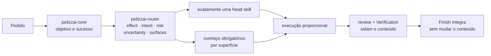
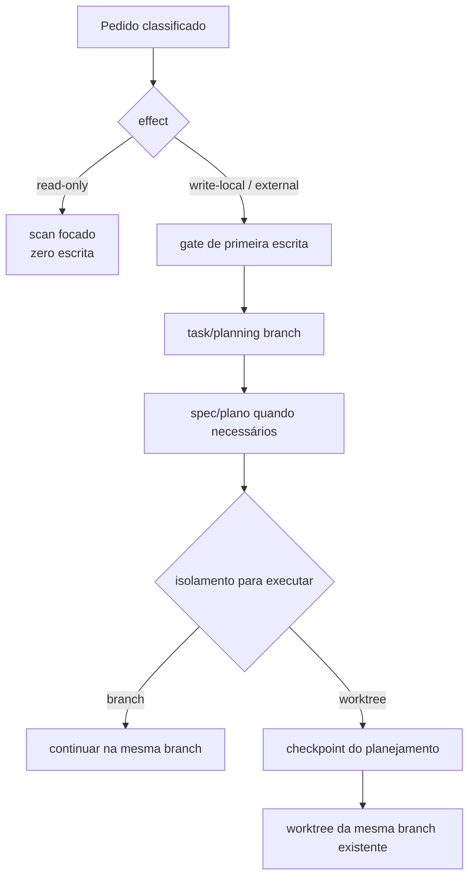
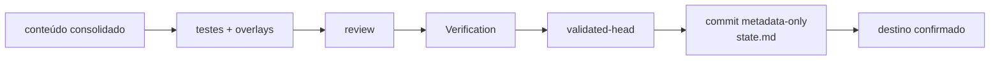
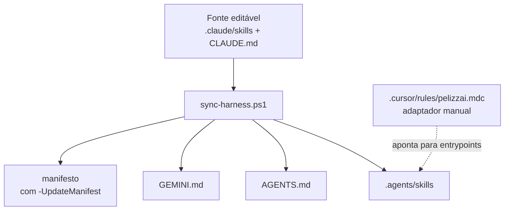

# PelizzAI

Harness de engenharia para agentes de código. O PelizzAI classifica a tarefa, escolhe o menor
fluxo seguro e produz evidência verificável sem transformar toda mudança em uma cerimônia.

> A fonte de verdade é `.claude/skills/` + `CLAUDE.md`. O `scripts/sync-harness.ps1` mantém o
> espelho `.agents/skills/`, `AGENTS.md`, `GEMINI.md` e, no modo próprio, o manifesto
> `scripts/pelizzai-core-skills.txt`. `.cursor/rules/pelizzai.mdc` é um adaptador manual: não é
> gerado pelo sync.

## O kernel inteligente

O PelizzAI separa invariantes de heurísticas. Proteção de branch, autorização para efeitos
externos e validação do conteúdo são invariantes. OODA, TDD, brainstorming, entrevistas, team e
subagents são ferramentas situacionais.



O envelope de decisão é derivado do pedido e das evidências; não vira formulário para o usuário:

| Campo | Valores | Decisão que governa |
| --- | --- | --- |
| `effect` | `read-only`, `write-local`, `external` | se pode escrever e quais confirmações são necessárias |
| `intent` | bootstrap, feature, bug, ajuste, refactor, infra, review, conflito | qual head skill conduz o ciclo de vida |
| `risk` | low, medium, high | profundidade de validação, review e contenção |
| `uncertainty` | low, medium, high | quanto descobrir antes de implementar |
| `surfaces` | UI, security, data, public-contract, docs, none | quais overlays atravessam o fluxo |

### Uma head skill, overlays transversais

Uma tarefa tem exatamente uma **head skill** responsável pelo ciclo de vida. Skills transversais
não competem com ela: entram como overlays e são propagadas para design, plano, brief de execução,
review e Verification.

| Sinal observado | Overlay obrigatório |
| --- | --- |
| tela, componente, CSS, layout, UX ou acessibilidade | `pelizzai-frontend` |
| auth, input externo, SQL, upload, segredo, CORS, SSRF ou dependência sensível | `pelizzai-oswap` antes da validação final |
| convenção específica do projeto | skill de domínio catalogada em `pelizzai/domain-skills.md` |
| documentação humana no escopo | `pelizzai-documenting-features` |

O overlay frontend aplica o design system e a especificação existentes antes de preferências
genéricas. Ele exige estados reais, responsividade, acessibilidade e QA visual, e combate
explicitamente AI slop: gradientes decorativos gratuitos, glassmorphism automático, excesso de
cards, copy genérica, ícones arbitrários e interfaces sem hierarquia ou intenção de produto.

## Efeitos e primeira escrita

- `read-only`: pode inspecionar e analisar, mas não cria branch, state, catálogo, profile,
  relatório persistente nem bootstrap.
- `write-local`: precisa passar pelo router e pelo gate de primeira escrita.
- `external`: além do isolamento, valida autoridade, alvo, reversibilidade e confirmação no
  momento da ação, como push, PR, deploy, mensagem, custo ou mudança em produção.

Para tarefas mutáveis em Git, `pelizzai-starting-branch` cria ou valida uma task branch **antes**
de qualquer state, spec, plano, ADR, código, configuração, teste, scaffold ou protótipo. Specs e
planos nunca nascem primeiro numa branch protegida.



Branch, execução inline e commits granulares são defaults seguros para trabalho comum. Worktree,
team ou subagents entram somente quando frentes realmente independentes justificam o custo. O
usuário não recebe menus sem uma escolha material.

## Rotas proporcionais

### Feature, refactor e infra

| Lane | Quando usar | Rota |
| --- | --- | --- |
| `bounded` | aceite claro, risco e incerteza baixos, sem decisão arquitetural | plano compacto; brainstorming não é obrigatório |
| `standard` | contrato/aceite claros, risco médio ou trade-offs limitados | plano; brainstorming compacto só se restar decisão real |
| `exploratory` | alta incerteza ou decisões arquiteturais/sensíveis acopladas | brainstorming completo + stress proporcional → plano |

Entrevistas e comparação de múltiplas abordagens só aparecem quando existe ambiguidade ou decisão
real. Uma mudança grande e mecânica pode continuar simples; um endpoint pequeno, aditivo e com
contrato claro pode ser standard com review/overlays mais fortes, sem discovery artificial.

### Debugging

`pelizzai-debugging` começa por triagem, não por um ritual fixo:

1. confirma sintoma, impacto, ambiente e evidência disponível;
2. contém primeiro quando há incidente ativo, risco de dados ou segurança;
3. escolhe o menor método que discrimina as causas plausíveis;
4. implementa o fix, prova a regressão e revalida os overlays.

Um erro localizado de compilação pode exigir uma hipótese e uma reprodução curta. Uma falha
intermitente entre sistemas pode exigir hipóteses concorrentes e instrumentação. OODA é o ciclo
macro adaptativo — observar, orientar, decidir e agir — quando novas evidências mudam o próximo
passo; não é uma obrigação universal nem determina quantidade fixa de hipóteses.

### Ajuste e review

- `pelizzai-quick-fix`: mudança local, reversível, sem nova regra, contrato ou superfície.
- `pelizzai-review`: review read-only de diff, working tree, branch ou PR.
- `pelizzai-improving-architecture`: revisão codebase-wide por fricção/evidência, sem escrita.
- Se um ajuste revelar design, contrato ou risco novo, o router o reclassifica antes de continuar.

## Execução e testes

O plano registra critérios observáveis e a estratégia de validação por artefato. TDD continua
forte onde há comportamento executável, mas não é usado como teatro para Markdown ou configuração.

| Artefato/intenção | Estratégia primária | Evidência mínima |
| --- | --- | --- |
| comportamento novo ou bug reproduzível | TDD | RED observado → GREEN → refactor; teste de comportamento |
| refactor/legado sem contrato seguro | characterization | comportamento atual capturado antes; regressão depois |
| config, schema, migration, script, build ou integração | validate | parser, dry-run, fixture ou integração real; rollback quando aplicável |
| UI, responsividade ou interação visual | visual + funcional | app rodando, estados/viewport e QA do overlay frontend |
| docs, prompts, policies ou artefato estático | static/scenario | lint, render, link/schema/grep ou cenário de consumo |

Cada tarefa recebe um briefing fresco com constraints, skills de domínio, overlays e evidência
esperada. Review por tarefa usa o working tree inteiro — staged, unstaged e untracked. O review
final usa o range `base-sha..HEAD`.

## Conteúdo selado e fechamento

A validação final acontece depois de squash, overlays, testes e correções. Quando tudo passa,
`pelizzai-verification-before-completion` grava:

```text
validated-head = SHA exato do último commit de conteúdo validado
```

`pelizzai-finish-task` exige `HEAD == validated-head`; a única sujeira permitida é
`pelizzai/data/state.md` contendo o seal pendente. Então cria exatamente um commit metadata-only,
tocando apenas esse arquivo, para fechar o cursor.
Antes de publicar, prova que `validated-head..closure-head` contém somente esse state e que nenhum
conteúdo do produto mudou. Push, PR, descarte e remoção de worktree continuam opt-in.



## Bootstrap consumidor

O próprio repo PelizzAI é detectado como **source mode** e não recebe runtime consumidor: branch,
plano nativo/execution record e SHA selado substituem state/closure. Num
projeto consumidor:

- análise sem escrita usa `pelizzai-audit` em `scan-only`;
- `bootstrap-write` só ocorre por pedido explícito ou consentimento após a proposta;
- o bootstrap cria o menor conjunto útil de skills de domínio — zero é válido;
- `pelizzai/.gitignore` é criado e verificado com `git check-ignore` para os efêmeros.

```text
pelizzai/
├── .gitignore
├── domain-skills.md
├── profile.md
├── context.md | context/       sob demanda
├── adr/ | specs/ | plans/      sob demanda
└── data/
    ├── state.md
    ├── review-domain-skills.md
    ├── .cadence-state.json     ignorado
    ├── handoffs/               ignorado
    ├── mockups/                ignorado
    └── reports/                ignorado
```

O `state.md` é escalar por repositório e registra, entre outros campos, `effect`, `risk`,
`overlays`, `base-ref`, `base-sha`, `branch`, `isolation`, `execution-mode`, `plan` e
`validated-head`. Na retomada, esses dados são confrontados com Git; divergências perigosas vão
para `pelizzai-recovery`.

## Fonte, distribuição e compatibilidade



| Ambiente | Entrada/skills |
| --- | --- |
| Claude Code | `CLAUDE.md` + `.claude/skills/` |
| Codex, Copilot e agentes compatíveis | `AGENTS.md` + `.agents/skills/` |
| Gemini CLI | `GEMINI.md` + `.agents/skills/` |
| Cursor | `.cursor/rules/pelizzai.mdc` manual + `AGENTS.md` + `.agents/skills/` |

Arquivos gerados não são editados à mão. O adaptador Cursor é revisado manualmente porque sua
função é apenas encaminhar aos entrypoints e às regras compartilhadas.

## Estrutura do repositório

```text
PelizzAI/
├── .claude/
│   ├── skills/                   fonte canônica das skills
│   └── hooks/                    cadence, guardrails e SessionStart opt-in
├── .agents/skills/               espelho gerado
├── .cursor/rules/pelizzai.mdc    adaptador manual
├── scripts/
│   ├── sync-harness.ps1
│   ├── test-harness-contracts.ps1
│   ├── task-brief.ps1|.sh
│   └── review-package.ps1|.sh
├── CLAUDE.md                     entrada canônica
├── AGENTS.md                     gerado
├── GEMINI.md                     gerado
└── .github/workflows/check-harness.yml
```

Os hooks são redes de segurança, não o cérebro do harness. Guardrails bloqueiam comandos Git
destrutivos conhecidos; erros internos do hook são fail-open para não sequestrar a ferramenta.
Cadence e SessionStart apenas lembram contexto quando instalados com consentimento.

## Desenvolvimento do harness

Edite somente as fontes canônicas e o adaptador Cursor quando necessário. Depois:

```powershell
pwsh scripts/sync-harness.ps1 -UpdateManifest
pwsh scripts/sync-harness.ps1 -Check -SourceMode
pwsh scripts/test-harness-contracts.ps1
```

O CI executa o check de sync em Windows e os testes de contrato em Windows e Ubuntu. Os contratos
cobrem composição do kernel, roteamento, manifest, guardrails, helpers, Visual Companion e paridade
dos alvos gerados.

## Princípio operacional

Use o menor fluxo que preserve os invariantes. Leia antes de perguntar, não escreva em pedidos
read-only, isole antes da primeira escrita, aplique overlays pela superfície real e só declare
conclusão quando o mesmo conteúdo revisado estiver testado, verificado e selado.
