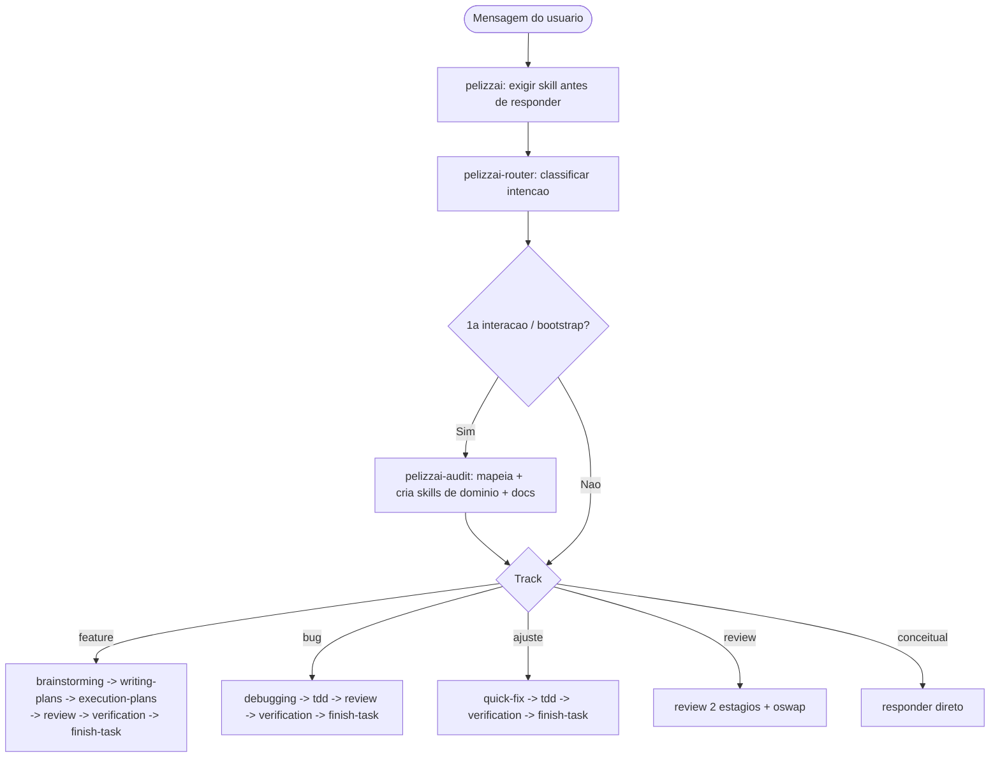

# PelizzAI — Harness

Um **harness de agente baseado em skills**, em português do Brasil, para trabalho de software *production-ready*. Toda a inteligência e todos os gatilhos vivem nas **skills** (markdown), portáveis entre `.claude`, `.agents`, `.cursor` e outras IDEs — o agente lê a skill e segue.

## O que é

O PelizzAI orquestra o ciclo de vida de uma tarefa de software — do entendimento do objetivo à entrega — através de skills especializadas que se encadeiam. Uma skill de entrada estabelece como achar e usar skills; um roteador classifica a intenção e conduz ao fluxo certo; skills de processo cuidam de design, plano, execução, testes, review, segurança e fechamento.

## Princípios

- **Skills-first.** A lógica vive nas skills (portáveis). O único gatilho automático opcional é um hook de cadência para lembrar de revisar as skills de domínio (ver `pelizzai-writing-skills`).
- **Branches-only.** O harness trabalha **só com branches** (sem `git worktree`). Nunca commita em branch protegida (`main`/`master`/`develop`/`dev`).
- **Diretório `pelizzai/`.** Todo o estado e a documentação do harness vivem em `pelizzai/` na raiz do repositório/workspace (ver abaixo).
- **Proporcionalidade.** Use a menor combinação de skills que resolve com segurança; não transforme tarefa simples em processo pesado.
- **Evidência antes de afirmação.** Nenhuma alegação de "pronto" sem rodar a verificação e ver a saída.
- **O harness mais inteligente possível.** Ao revisar/construir skills, aplique todos os achados — inclusive *nice-to-have*.

## Como começar

Na **primeira interação** com um projeto (ou digitando **`bootstrap`**), a skill `pelizzai-audit` mapeia o contexto (projeto único ou workspace, novo ou existente, stacks, MCPs, git/host, skills de domínio), cria as **skills de domínio** do projeto (fundamentadas via MCP `context7`) e a documentação. A existência de `pelizzai/domain-skills.md` marca o harness como inicializado.

## Fluxo



Os fluxos detalhados, com todos os encadeamentos, estão na `pelizzai-router` e na skill de entrada `pelizzai`.

## Catálogo de skills

| Grupo                    | Skills                                                                                       |
| ------------------------ | -------------------------------------------------------------------------------------------- |
| Entrada e orquestração   | `pelizzai` · `pelizzai-router` · `pelizzai-audit` · `pelizzai-preferences`                    |
| Raciocínio e comunicação | `pelizzai-reasoning` · `pelizzai-interview-me` · `pelizzai-writing-clearly-and-concisely`     |
| Ciclo de feature         | `pelizzai-brainstorming` → `pelizzai-writing-plans` → `pelizzai-execution-plans`              |
| Execução por tarefa      | `pelizzai-tdd` · `pelizzai-team` · `pelizzai-subagents` · `pelizzai-loop`                     |
| Tracks dedicados         | `pelizzai-debugging` (bug) · `pelizzai-quick-fix` (ajuste)                                    |
| Design e exploração      | `pelizzai-codebase-design` · `pelizzai-domain-modeling` · `pelizzai-prototype`                |
| Isolamento e fechamento  | `pelizzai-starting-branch` · `pelizzai-finish-task` · `pelizzai-resolving-merge-conflicts`    |
| Qualidade e segurança    | `pelizzai-review` · `pelizzai-oswap` · `pelizzai-verification-before-completion`              |
| Frontend                 | `pelizzai-frontend`                                                                           |
| Autoria de skills        | `pelizzai-writing-skills`                                                                     |

## Diretório `pelizzai/`

Na raiz do repositório ou do workspace:

```text
pelizzai/
├── domain-skills.md            catálogo das skills de domínio (marca o bootstrap concluído)
├── context.md                  glossário do domínio (pelizzai-domain-modeling); multi-contexto: context/<nome>.md + context-map.md
├── adr/                        decisões de arquitetura (ADRs numerados)
├── specs/                      designs aprovados (pelizzai-brainstorming): AAAA-MM-DD-<topico>-design.md
├── plans/                      planos de implementação (pelizzai-writing-plans): AAAA-MM-DD-<feature>.md
└── data/
    ├── state.md                cursor da tarefa ativa (pelizzai-execution-plans / -router / -finish-task)
    ├── review-domain-skills.md ledger de manutenção das skills de domínio
    └── .cadence-state.json      contador do hook de cadência (no .gitignore)
```

## Convenções

- **Idioma:** português do Brasil, com acentuação correta.
- **Skills de domínio:** nomeadas com o prefixo do projeto (nunca `pelizzai-`, reservado ao harness), fundamentadas na documentação real via `context7`.
- **Formato:** cada skill é um `SKILL.md` com frontmatter (`name`/`description`); profundidade vai em `references/`, artefatos em `templates/`, código em `scripts/` (divulgação progressiva, `SKILL.md` < ~500 linhas).
