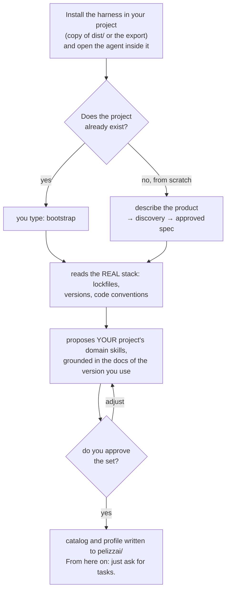
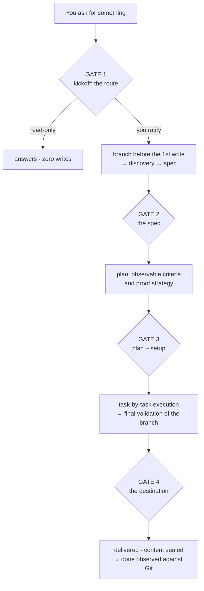
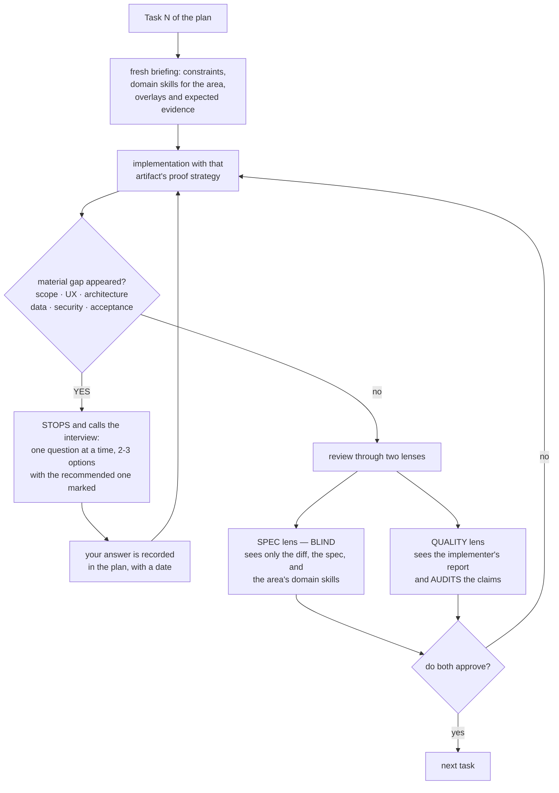
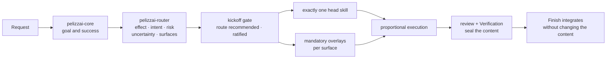
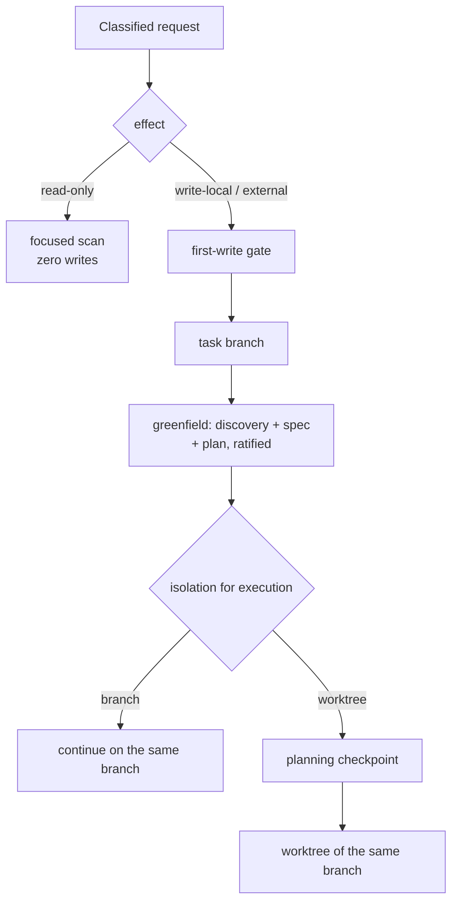
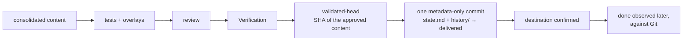
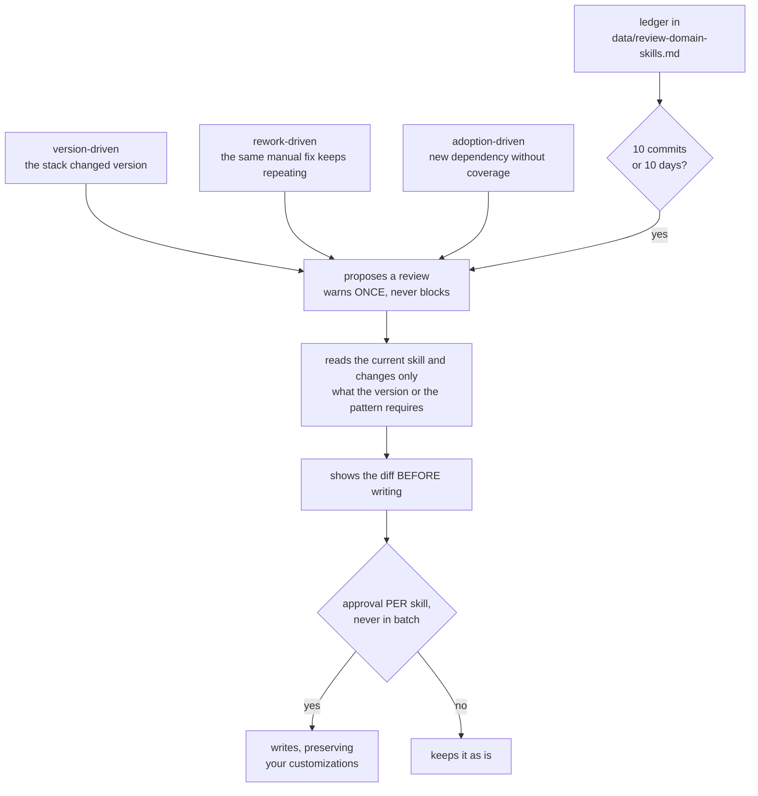
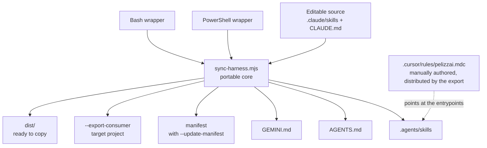

# PelizzAI

An engineering harness for coding agents — Claude Code, Codex, Cursor, Gemini CLI, and the like.

You clone it, copy `dist/` into your project (or run the export), and the agent starts working with
process: it reads your actual stack, writes rules specific to your project, isolates before
writing, proves what it delivers, and **stops to ask whenever the decision is yours**.

The rule that organizes everything else:

> **The harness classifies, reasons, investigates, and recommends. You decide the product.**
> Every gap that appears along the way — an ambiguous requirement, a UX choice, an undefined
> interface contract — stops the work and comes back to you as a question. Convention, defaults,
> or "reasonable inference" do not substitute for your answer, even when the choice looks obvious
> and reversible.

**Requirements:** none to install by copying `dist/`. Node.js 18+ for the scripts (export,
sync, hooks); PowerShell 7+ only for the `.ps1` wrappers on Windows. No dependencies are
installed: the harness is markdown, plus a few scripts.

---

## How it works, in 30 seconds


```mermaid
flowchart TD
    A["Install the harness in your project<br/>(copy of dist/ or the export)<br/>and open the agent inside it"] --> B{"Does the project<br/>already exist?"}
    B -- "yes" --> D["you type: bootstrap"]
    B -- "no, from scratch" --> E["describe the product<br/>→ discovery → approved spec"]
    D --> F["reads the REAL stack: lockfiles,<br/>versions, code conventions"]
    E --> F
    F --> H["proposes YOUR project's domain skills,<br/>grounded in the docs of the version you use"]
    H --> I{"do you approve<br/>the set?"}
    I -- "adjust" --> H
    I -- "yes" --> K["catalog and profile written to pelizzai/<br/>From here on: just ask for tasks."]
```

`bootstrap` is the only command there is. After it, you work by asking for things in natural
language; the harness classifies each request and recommends the route.

---

## Installation

### No command line: copy `dist/`

The `dist/` folder is the harness ready for consumption: core skills (`.claude` and `.agents`),
hooks, the Cursor adapter (`.cursor`), scripts, and the three entrypoints (`CLAUDE.md` already in
the consumer version, `AGENTS.md`, `GEMINI.md`) — without the source-repo sentinel and without the
harness's development files.

1. Download the repository (clone or "Download ZIP" on GitHub).
2. Copy **the contents** of `dist/` into the root of your project — Ctrl+C, Ctrl+V, done.
3. Open the agent in the project and type `bootstrap`.

To **update** later, prefer the export below: it preserves your domain skills, your `pelizzai/`,
and the project's own content in `CLAUDE.md`/`AGENTS.md`/`GEMINI.md` (the harness manages only
its anchored contract block), and validates the installation. Copying the new `dist/` over the
top also works, but it **replaces** those three entry files with the block-only versions, neither
removes core skills discontinued upstream nor runs the validation — on a project that already has
its own entry files, use the export.

### With a command line: install and update are the same command

From the PelizzAI source repo, point at your project — run it again whenever you want the new
version.

```bash
# Portable (any system with Node.js 18+)
node scripts/sync-harness.mjs --export-consumer /path/to/your-project
```

```powershell
# Windows
pwsh scripts/sync-harness.ps1 -ExportConsumer C:\path\to\your-project
```

```bash
# macOS / Linux
bash scripts/sync-harness.sh --export-consumer /path/to/your-project
```

This copies the core skills, the hooks, the Cursor adapter, and the useful scripts, **anchors**
the harness contract as a marker-delimited block (`<!-- pelizzai:contract -->`) inside the
consumer's `CLAUDE.md`, `AGENTS.md`, and `GEMINI.md`, and validates the mirrors — **without
touching** your domain skills, your `pelizzai/`, your `settings.json`, or the project's own
content in those three files. A project that already has its `CLAUDE.md`/`AGENTS.md` keeps
everything and gains the block at the end; re-running the export only resyncs the block when the
contract changed upstream (files written by the pre-anchor export are migrated in place, once).

> **Never copy the repository root by hand** — manual copying is what `dist/` is for. What sets
> the source repo apart from a consumer is a single sentinel, `scripts/pelizzai-source-repo.txt`.
> Copying the root would carry it along and promote your project to source repo by mistake — with
> a mute bootstrap, disabled runtime, and half a writegate. `dist/` and `--export-consumer`
> exclude the sentinel by contract.

### Hooks: copied, never enabled without you

The hooks are Claude Code-specific and **opt-in**. You have two paths:

- enable them along with the installation, adding `--install-hooks` (or `-InstallHooks`);
- leave it to the first task that writes something: `pelizzai-audit` checks, recommends, and asks
  once, one hook at a time.

```bash
node scripts/install-hooks.mjs --check                  # check only
node scripts/install-hooks.mjs --only cadence,guardrails # install the ones you choose
node scripts/install-hooks.mjs --remove                 # remove only the PelizzAI hooks
```

The installer is idempotent and preserves hooks, permissions, and any other fields that already
exist in your `.claude/settings.json`. On the other platforms the same invariants still hold
through the skills — with no executable enforcement.

---

## The lifecycle of a task

This is the harness's main flow. The diamonds marked **GATE** are the points where it stops and
waits for you.


```mermaid
flowchart TD
    P["You ask for something"] --> GK{"GATE 1<br/>kickoff: the route"}
    GK -- "read-only" --> RO["answers · zero writes"]
    GK -- "you ratify" --> DES["branch before the 1st write<br/>→ discovery → spec"]
    DES --> GS{"GATE 2<br/>the spec"}
    GS --> PLAN["plan: observable criteria<br/>and proof strategy"]
    PLAN --> GP{"GATE 3<br/>plan + setup"}
    GP --> EXEC["task-by-task execution<br/>→ final validation of the branch"]
    EXEC --> GD{"GATE 4<br/>the destination"}
    GD --> DEL["delivered · content sealed<br/>→ done observed against Git"]
```

Four stops in a full feature; fewer on the short routes. **Between the gates the harness works on
its own** — it does not ask "keep going?" at every step, because autonomy inside a ratified
boundary is the point. What it never does is cross a gate in silence.

Ratifying the route at GATE 1 does not end your authority: a material gap that shows up later —
in the spec, in the plan, or in the middle of the code — reopens the conversation (see the next
flow).

---

## What happens inside each task


```mermaid
flowchart TD
    T["Task N of the plan"] --> BRIEF["fresh briefing: constraints,<br/>domain skills for the area,<br/>overlays and expected evidence"]
    BRIEF --> IMPL["implementation with that<br/>artifact's proof strategy"]
    IMPL --> GAP{"material gap appeared?<br/>scope · UX · architecture<br/>data · security · acceptance"}
    GAP -- "YES" --> IV["STOPS and calls the interview:<br/>one question at a time, 2-3 options<br/>with the recommended one marked"]
    IV --> REG["your answer is recorded<br/>in the plan, with a date"]
    REG --> IMPL
    GAP -- "no" --> REV["review through two lenses"]
    REV --> L1["SPEC lens — BLIND<br/>sees only the diff, the spec, and<br/>the area's domain skills"]
    REV --> L2["QUALITY lens<br/>sees the implementer's report<br/>and AUDITS the claims"]
    L1 --> OK{"do both approve?"}
    L2 --> OK
    OK -- "no" --> IMPL
    OK -- "yes" --> NEXT["next task"]
```

Two things deserve highlighting here:

**The blind lens.** The spec reviewer never reads the implementer's report — only the diff and the
spec. That way it does not inherit the framing of whoever wrote the code. The report is read by the
other lens, whose duty is precisely to **audit the claims**, not trust them.

**The interview is not just for planning.** If the gap appears on task 7 of 9, the work stops
right there. The executor does not choose — it names the gap and hands it back. In team mode, the
member hands it back to the coordinator, and the coordinator **does not decide either**: it
consolidates and brings it to you.

---

## The kernel: what is invariant and what is situational

PelizzAI separates authority, invariants, and heuristics. Branch protection, user authority,
external authorization, and validation are **invariants**. OODA, TDD, brainstorming, team, and
subagents are **situational tools**: they choose how to work, never what the product should do.


```mermaid
flowchart LR
    U["Request"] --> C["pelizzai-core<br/>goal and success"]
    C --> R["pelizzai-router<br/>effect · intent · risk<br/>uncertainty · surfaces"]
    R --> K["kickoff gate<br/>route recommended · ratified"]
    K --> H["exactly one head skill"]
    K --> O["mandatory overlays<br/>per surface"]
    H --> E["proportional execution"]
    O --> E
    E --> V["review + Verification<br/>seal the content"]
    V --> F["Finish integrates<br/>without changing the content"]
```

The decision envelope is derived from the request and the evidence — it is not a form for you to
fill in. But the assembled route comes back as a **recommendation to ratify** before effort is
invested:

| Field | Values | Decision it governs |
| --- | --- | --- |
| `effect` | `read-only`, `write-local`, `external` | whether it may write and which confirmations are required |
| `intent` | bootstrap, feature, bug, tweak, refactor, infra, review, conflict | which head skill drives the lifecycle |
| `risk` | low, medium, high | depth of validation, review, and containment |
| `uncertainty` | low, medium, high | how much to discover before implementing |
| `surfaces` | UI, security, data, public-contract, docs, none | which overlays run through the flow |

### One head skill, cross-cutting overlays

A task has exactly one **head skill** responsible for the lifecycle. Cross-cutting skills do not
compete with it: they enter as overlays and are propagated to design, plan, execution briefing,
review, and Verification.

| Observed signal | Mandatory overlay |
| --- | --- |
| screen, component, CSS, layout, UX, or accessibility | `pelizzai-frontend` |
| auth, external input, SQL, upload, secret, CORS, SSRF, or a sensitive dependency | `pelizzai-oswap` before the final validation |
| project-specific convention | domain skill cataloged in `pelizzai/domain-skills.md` |
| human documentation in scope | `pelizzai-documenting-features` |

The frontend overlay applies the existing design system and specification before any generic
preference. It demands real states, responsiveness, accessibility, and visual QA, and explicitly
fights AI slop: gratuitous decorative gradients, automatic glassmorphism, card overload, generic
copy, arbitrary icons, and interfaces without hierarchy or product intent.

---

## Effects and the first write

- `read-only` — inspects and analyzes, but does **not** create a branch, state, catalog, profile,
  persistent report, or bootstrap.
- `write-local` — goes through the router and the first-write gate.
- `external` — beyond isolation, validates authority, target, reversibility, and confirmation at
  the moment of the action: push, PR, deploy, message, cost, change in production.


```mermaid
flowchart TD
    D["Classified request"] --> Q{"effect"}
    Q -- "read-only" --> S["focused scan<br/>zero writes"]
    Q -- "write-local / external" --> G["first-write gate"]
    G --> B["task branch"]
    B --> P["greenfield: discovery + spec<br/>+ plan, ratified"]
    P --> I{"isolation for execution"}
    I -- "branch" --> SAME["continue on the same branch"]
    I -- "worktree" --> CP["planning checkpoint"]
    CP --> WT["worktree of the same branch"]
```

For Git-mutating tasks, `pelizzai-starting-branch` creates or validates the branch **before** any
state, spec, plan, ADR, code, configuration, test, scaffold, or prototype. Spec and plan are never
born on a protected branch.

Branch, inline execution, and granular commits are the **recommended** defaults; worktree, team,
and subagents come in when genuinely independent fronts justify the cost. None of it is applied in
silence — after the plan is approved, isolation, mode (with `team` always visible), commits, and
review are decided **one question at a time**. `squash-final` happens only on explicit request.

Ratified structural decisions can become **project policy** in `pelizzai/profile.md` and
pre-select future recommendations. They do not auto-confirm a new task, barring your explicit
delegation. `destination` is never inherited: push, PR, and publication are confirmed per task.

---

## Proportional routes

### Feature, refactor, and infra

| Lane | When to use | Route |
| --- | --- | --- |
| `bounded` | clear acceptance, low risk and uncertainty, no architectural decision | compact plan; brainstorming is not required |
| `standard` | clear contract and acceptance, medium risk or limited trade-offs | plan; compact brainstorming only if a real decision remains |
| `exploratory` | high uncertainty or coupled architectural decisions | full brainstorming + proportional stress → plan |

Every greenfield product enters as `exploratory`, even with the stack already defined. Framework,
language, and database define neither users, rules, states, UX, data, nor acceptance criteria.

### Debugging

`pelizzai-debugging` starts with **triage**, not a fixed ritual. The failure class picks the
method:

| Failure class | Method | Hypotheses |
| --- | --- | --- |
| direct cause — compiler, stack trace, or contract points at the spot | ReAct + Verification | zero or one |
| deterministic but uncertain | light RCA + ReAct | one is enough, if it discriminates |
| flaky, recurring, or distributed | RCA + Evidence Synthesis | competing, with instrumentation |
| incident with active damage | containment first; RCA later | containment does not wait for diagnosis |

OODA is the **macro cycle** — observe, orient, decide, act — when new evidence changes the next
step. It is not a diagnostic technique, it is not mandatory, and it does not set the number of
hypotheses. Three fixes that do not solve it stop the attempt and become an interview: it is a
gap, not stubbornness.

### Tweak and review

- `pelizzai-quick-fix` — a local, reversible change with no new rule, contract, or surface.
- `pelizzai-review` — read-only review of a diff, working tree, branch, or PR.
- `pelizzai-improving-architecture` — codebase-wide review by friction and evidence, with no
  writes.
- If a tweak reveals new design, contract, or risk, the router reclassifies before continuing.

---

## Execution and tests

The plan records observable criteria and the validation strategy **per artifact**. TDD is strong
where executable behavior exists, and does not become theater for Markdown or configuration.

| Artifact / intent | Primary strategy | Minimum evidence |
| --- | --- | --- |
| new behavior or reproducible bug | TDD | RED observed → GREEN → refactor |
| refactor or legacy without a safe contract | characterization | current behavior captured before; regression after |
| config, schema, migration, build, integration | validate | parser, dry-run, fixture, or real integration; rollback when applicable |
| UI, responsiveness, visual interaction | visual + functional | app running, states and viewports, frontend-overlay QA |
| docs, prompts, policies, static artifact | static / scenario | lint, render, link/schema/grep, or a consumption scenario |

Each task receives a fresh briefing with constraints, domain skills, overlays, and expected
evidence. The per-task review uses the entire working tree — staged, unstaged, and untracked. The
final review uses the `base-sha..HEAD` range, with **the model you chose — never a smaller one —
and the highest effort your platform allows**: the harness elevates the reasoning of any model,
the math of which model to use is yours, and process depth is proportional to risk — never lowered
to compensate for a smaller model.

---

## Sealed content and closeout


```mermaid
flowchart LR
    C["consolidated content"] --> T["tests + overlays"]
    T --> R["review"]
    R --> V["Verification"]
    V --> S["validated-head<br/>SHA of the approved content"]
    S --> M["one metadata-only commit<br/>state.md + history/ → delivered"]
    M --> X["destination confirmed"]
    X --> DN["done observed later,<br/>against Git"]
```

The final validation happens after squash, overlays, tests, and fixes. When everything passes,
`pelizzai-verification-before-completion` records the `validated-head`: the exact SHA of the last
validated content commit.

`pelizzai-finish-task` requires `HEAD == validated-head` — **what you receive is exactly what was
reviewed**. It then creates a single metadata-only commit to seal the task in `phase: delivered`
and record `confirm:`, the observable condition that will become `done`. In that seal, the task's
intact block migrates to `pelizzai/data/history/` and the cursor returns to template size.

`done` is never declared at closeout: it is **observed** at the opening of the next task or on
resumption, by checking `confirm:` against Git. If the observation fails — a PR closed without a
merge, for example — the harness warns and asks what to do.

Everything in this section describes **your consumer project**. In the PelizzAI source repo — the
repository marked by the sentinel `scripts/pelizzai-source-repo.txt` — there is no `pelizzai/` runtime:
`validated-head` and `phase: delivered` stay in the native execution record, the closeout does not create
a metadata-only commit or migrate a block to `data/history/`, and `done` is still observed later,
against Git.

---

## State and artifacts in your project

`pelizzai/` is the harness's operational memory inside your project. Single rule: the **root**
holds versioned knowledge; `data/` holds state and ephemera.

```text
pelizzai/
├── .gitignore
├── domain-skills.md              domain catalog; marks the bootstrap as complete
├── profile.md                    test/build/lint commands, stack baseline, ratified defaults
├── context.md | context/         domain glossary, on demand
├── adr/ | specs/ | plans/        on demand
└── data/
    ├── state.md                  cursor of the active task                     (versioned)
    ├── review-domain-skills.md   maintenance ledger for the domain skills      (versioned)
    ├── history/                  intact block migrated at the delivered seal   (versioned)
    ├── .cadence-state.json       local counter for the cadence hook            (ignored)
    ├── handoffs/                 task briefs and review packages               (ignored)
    ├── mockups/                  visual companion screens                      (ignored)
    └── reports/                  long QA, review, and architecture reports     (ignored)
```

`state.md` is a **cursor, not a stamp file**: the discovery, spec, domain skills, and plan
approvals live in the plan header, with dates — not in the cursor. Main fields:

| Field | Use |
| --- | --- |
| `slug` · `track` · `lane` | identity, type, and depth of the active task |
| `phase` | `brainstorm`, `plan`, `exec`, `review`, `delivered`, `done`, `abandoned`, or `blocked` |
| `branch` · `base-ref` · `base-sha` | working branch and the exact base that bounds the final review |
| `validated-head` | SHA of the content approved in the final validation |
| `confirm` | observable condition that becomes `done` — observed against Git |
| `kickoff` | `pending` until you ratify the consolidated gate |
| `isolation` · `execution-mode` · `commit-strategy` | born `pending`; never become a silent default |
| `effect` · `risk` · `overlays` · `audience` | derived by the router; modulate depth and language |
| `spec` · `plan` · `project` | path of the artifact or a dated explicit waiver |

Below the cursor sit only `## Progress` (one line per task; a long report goes to `data/reports/`
and the link stays) and `## History` (durable index). On resumption, all of it is checked against
Git; dangerous divergence goes to `pelizzai-recovery`.

---

## Domain skills: creation and maintenance

Domain skills are **your project's** rules — build, deploy, UI conventions, migrations,
integrations. The bootstrap creates as many useful skills as the observed patterns justify, each
grounded in the documentation of the version you actually use. They are not static:


```mermaid
flowchart TD
    VD["version-driven<br/>the stack changed version"] --> PROP
    RD["rework-driven<br/>the same manual fix keeps repeating"] --> PROP
    AD["adoption-driven<br/>new dependency without coverage"] --> PROP
    LED["ledger in<br/>data/review-domain-skills.md"] --> NUD{"10 commits<br/>or 10 days?"}
    NUD -- "yes" --> PROP["proposes a review<br/>warns ONCE, never blocks"]
    PROP --> READ["reads the current skill and changes only<br/>what the version or the pattern requires"]
    READ --> DIFF["shows the diff BEFORE writing"]
    DIFF --> APR{"approval PER skill,<br/>never in batch"}
    APR -- "yes" --> W["writes, preserving<br/>your customizations"]
    APR -- "no" --> SKIP["keeps it as is"]
```

Two axes update what exists; **adoption-driven is the only one that creates** outside the
bootstrap. The primary trigger is the closeout nudge; on Claude Code, the opt-in
`pelizzai-cadence` hook is the safety net, checking the ledger every 10 interactions with 7-day
suppression after warning.

Proactive maintenance acts **only** on domain skills. The harness skills (`pelizzai-*`) change
only on explicit request.

---

## Context7: the cross-cutting technical source

Context7 is PelizzAI's preferred technical source — the antidote to decisions based on the LLM's
outdated memory.

| Situation | How the harness uses it |
| --- | --- |
| New project | validates stack capabilities and trade-offs before recommending |
| Existing project | reads manifests and lockfiles first, then the docs of the version actually installed |
| Feature or plan | confirms APIs, limits, and compatibility before decomposing |
| Debugging | confronts symptom and code with the contracts of the version in use |
| Upgrade | checks breaking changes, migration, and supported target |
| Domain skills | creates and updates rules from the real version |

Context7 is read-only and eliminates **factual** doubt — it never chooses a requirement, UX,
business rule, architecture, accepted risk, or acceptance criterion. That remains yours.

The server is not force-installed, because each host configures MCP its own way. During bootstrap
the harness checks whether it is available and recommends the configuration when it is missing.
The fallback is current official documentation; LLM memory is not a fallback.

---

## Distribution and compatibility


```mermaid
flowchart TD
    SRC["Editable source<br/>.claude/skills + CLAUDE.md"] --> SYNC["sync-harness.mjs<br/>portable core"]
    PS["PowerShell wrapper"] --> SYNC
    SH["Bash wrapper"] --> SYNC
    SYNC --> AS[".agents/skills"]
    SYNC --> AG["AGENTS.md"]
    SYNC --> GE["GEMINI.md"]
    SYNC --> MF["manifest<br/>with --update-manifest"]
    SYNC --> EXP["--export-consumer<br/>target project"]
    SYNC --> DIST["dist/<br/>ready to copy"]
    CUR[".cursor/rules/pelizzai.mdc<br/>manually authored, distributed by the export"] -.->|points at the entrypoints| AS
```

| Environment | Entry / skills |
| --- | --- |
| Claude Code | `CLAUDE.md` + `.claude/skills/` |
| Codex, Copilot, and compatibles | `AGENTS.md` + `.agents/skills/` |
| Gemini CLI | `GEMINI.md` + `.agents/skills/` |
| Cursor | `.cursor/rules/pelizzai.mdc` + `AGENTS.md` + `.agents/skills/` |

Generated files are not edited by hand. The Cursor adapter is the authoring exception: the sync
does **not** generate it from `CLAUDE.md` — it is hand-written at the source and needs review
whenever the entrypoints change. **Distribution**, however, is automatic: the `--export-consumer`
copies it to the consumer project along with the rest of the harness.

---

## Skill catalog

| Group | Skills | Responsibility |
| --- | --- | --- |
| Entry and orchestration | `pelizzai-core`, `pelizzai-router`, `pelizzai-audit`, `pelizzai-preferences` | mandatory entry, route classification and kickoff gate, bootstrap, global behavior floor |
| Reasoning and conversation | `pelizzai-reasoning`, `pelizzai-interview-me`, `pelizzai-writing-clearly-and-concisely` | proportional reasoning techniques (including OODA), the interview that resolves every material gap, clear writing |
| Design, plan, and execution | `pelizzai-brainstorming`, `pelizzai-writing-plans`, `pelizzai-execution-plans` | ratified design with spec, executable and stress-tested plan, setup gate and task-by-task execution |
| Per-task execution | `pelizzai-tdd`, `pelizzai-team`, `pelizzai-subagents`, `pelizzai-loop`, `pelizzai-handoff` | proof strategy per artifact, delegation and teams, macro loop and forking into a new session |
| Dedicated tracks | `pelizzai-debugging`, `pelizzai-quick-fix` | bug with triage and root cause; local tweak without losing isolation, proof, and closeout |
| Design and exploration | `pelizzai-codebase-design`, `pelizzai-domain-modeling`, `pelizzai-prototype`, `pelizzai-improving-architecture` | deep modules and seams, vocabulary and ADRs, disposable prototype, read-only architectural review |
| Isolation and integration | `pelizzai-starting-branch`, `pelizzai-finish-task`, `pelizzai-resolving-merge-conflicts`, `pelizzai-recovery`, `pelizzai-documenting-features` | branch before the first write, `delivered` seal, conflicts, recovery, and human docs |
| Quality and security | `pelizzai-review`, `pelizzai-oswap`, `pelizzai-verification-before-completion` | per-task and final review, OWASP on the sensitive surface, fresh evidence before completion |
| Frontend | `pelizzai-frontend` | product, design, implementation, and visual QA overlay — from design onward |
| Skill authoring | `pelizzai-writing-skills` | authoring and maintenance of the domain skills |

---

## Repository structure

```text
PelizzAI/
├── .claude/
│   ├── skills/                   canonical source of the skills
│   └── hooks/                    cadence, guardrails, writegate, and SessionStart (opt-in)
├── .agents/skills/               generated mirror
├── .cursor/rules/pelizzai.mdc    manually authored adapter, distributed by the export
├── dist/                         harness ready to copy (generated by the sync; no sentinel)
├── scripts/
│   ├── sync-harness.mjs          portable core of sync + distribution
│   ├── sync-harness.ps1|.sh      wrappers
│   ├── install-hooks.mjs         merge/check/remove of the Claude Code hooks
│   ├── test-harness-contracts.ps1  harness contract suite
│   ├── pelizzai-source-repo.txt  source mode sentinel (NEVER copy to consumers)
│   ├── task-brief.ps1|.sh
│   └── review-package.ps1|.sh
├── CLAUDE.md                     canonical entry
├── AGENTS.md · GEMINI.md         generated
└── .github/workflows/check-harness.yml
```

**The hooks are safety nets, not the harness's brain.** `guardrails` blocks a narrow handful of
irreversible Git commands — deliberately narrow, because a broad rule blocks legitimate work and
teaches the agent to route around the net.

The `writegate` is a fail-closed `PreToolUse` hook that moves the invariant "isolate before the
first write" from model obedience to executable enforcement. There are two rules: **Rule A** bars
product writes on a protected branch or a detached HEAD; in a consumer, writing product requires
`kickoff: ratified` in `state.md` — **Rule B**. Writing metadata in `pelizzai/` stays allowed even
on a protected branch, otherwise reconciling the state itself would deadlock.

The hook **does not enforce the greenfield approval steps** — discovery, spec, domain skills, and
plan remain mandatory, but they are driven by the skills, with you, not by a hook counting stamps
in the cursor.

An internal error in any hook is fail-open: a bug in the safety net never hijacks your tool.

---

## Harness development

The source of behavior is `.claude/` (skills and hooks); `CLAUDE.md`, `README.md`, `scripts/`, and
`.github/` are authored as well, and the Cursor adapter is manual. **Do not edit the generated
files** — `.agents/`, `AGENTS.md`, `GEMINI.md`, the manifest, and the entire `dist/` — a change
made there is lost on the next sync.

```bash
node scripts/sync-harness.mjs                    # regenerates mirrors and dist/
node scripts/sync-harness.mjs --check            # validates the sync
pwsh scripts/test-harness-contracts.ps1          # contract suite
```

The sync regenerates `dist/` automatically in the source repo (there is also the standalone
`--build-dist`); the CI fails if it is committed out of sync with `.claude/`.

Every harness behavior is locked by an assertion in the contract suite. New behavior without a new
assertion is a regression waiting to happen — and an assertion weakened into a regex that matches
everything is worse than no assertion, because it simulates coverage. The CI runs the core and the
wrappers on Windows, Ubuntu, and macOS; the contracts run on Windows and Ubuntu.

---

## Known limits

- **Native** per-directory skill loading varies by tool: `.agents/skills/` covers Codex, Gemini
  CLI, and Warp; the others receive the entry via `AGENTS.md` and can gain a native mirror by
  adding the target to `sync-harness.mjs`.
- The authoring of `.cursor/rules/pelizzai.mdc` is manual — the sync distributes it to consumers,
  but does not generate it from `CLAUDE.md`, and no CI job compares it against the entrypoints.
- The core requires Node.js 18+; the `.ps1` wrappers require PowerShell 7+ with UTF-8 encoding.
- The hooks are Claude Code-specific and opt-in. On the other platforms the invariants hold only
  through the skills, with no executable enforcement.
- Agent Teams is experimental in Claude Code; without it, `pelizzai-team` degrades to subagents.
  On Windows, teammates must use the `in-process` display.
- Parallel writes require `isolation: worktree` with disjoint paths; on `branch`, the coordinator
  integrates serially.
- Context7 depends on the host for installation and configuration. Without it, the fallback is
  current official documentation, with the limitation declared.

---

## License and participation

Distributed under the **Apache 2.0 License** — see [LICENSE](LICENSE). You may use, modify, and
embed the harness in your own products, including commercial ones, preserving the copyright notice
and the license. Apache-2.0 also expressly grants the contributors' patent rights, which matters
for anyone embedding this in a product.

- **Contribute:** [.github/CONTRIBUTING.md](.github/CONTRIBUTING.md) — read it before your first
  PR; this repository has rules of its own (edit only `.claude/`, new behavior requires a new
  assertion).
- **Report a vulnerability:** [.github/SECURITY.md](.github/SECURITY.md) — through a private
  channel, never in a public issue.

---

## Operating principle

Use the smallest flow that preserves the invariants. Read before asking, do not write on a
read-only request, isolate before the first write, apply overlays by the real surface, and only
declare completion when the same reviewed content is tested, verified, and sealed.

And when a decision that belongs to the user is missing: ask. Always.
